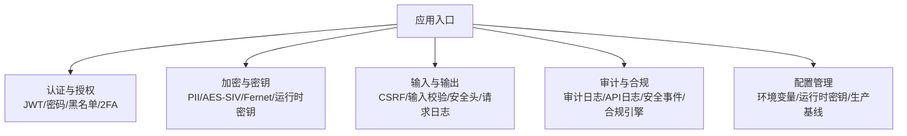
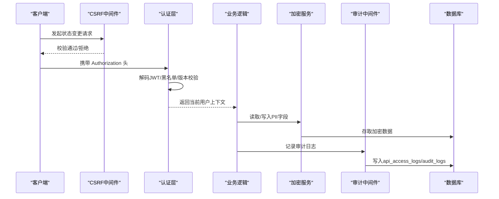
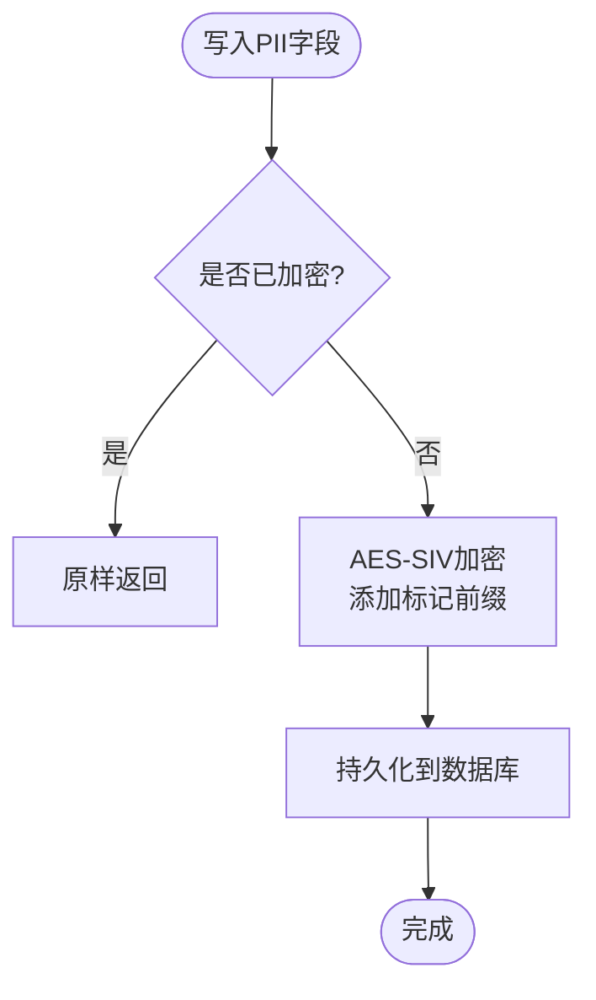
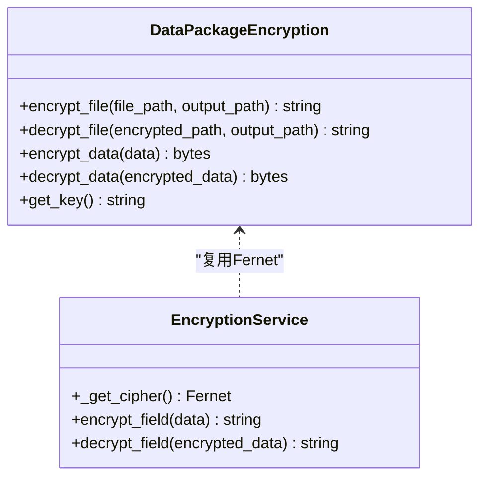
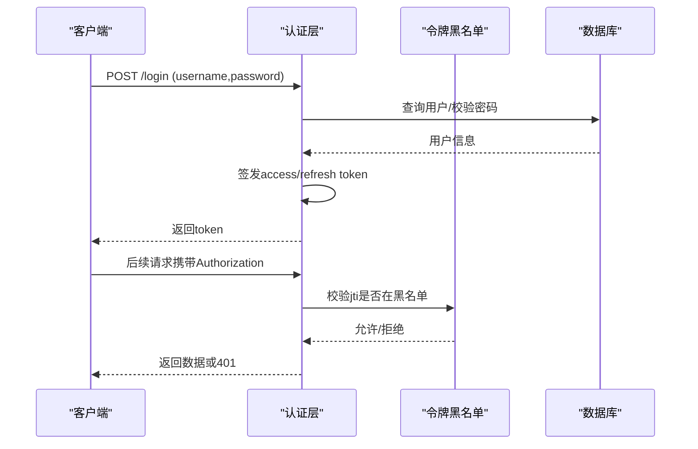
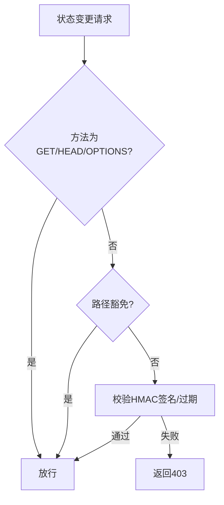
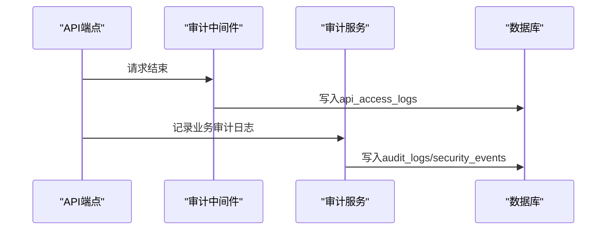
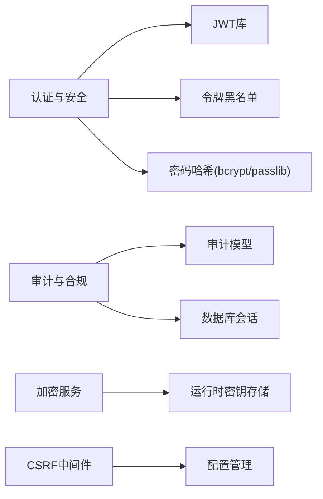

# 数据安全设计

<cite>
**本文引用的文件**
- [backend/app/core/pii_crypto.py](file://backend/app/core/pii_crypto.py)
- [backend/app/core/security.py](file://backend/app/core/security.py)
- [backend/app/services/encryption_service.py](file://backend/app/services/encryption_service.py)
- [backend/app/services/secrets_manager.py](file://backend/app/services/secrets_manager.py)
- [backend/app/core/config.py](file://backend/app/core/config.py)
- [backend/app/middleware/csrf_middleware.py](file://backend/app/middleware/csrf_middleware.py)
- [backend/app/services/compliance_engine.py](file://backend/app/services/compliance_engine.py)
- [backend/app/models/audit.py](file://backend/app/models/audit.py)
- [backend/app/utils/input_validator.py](file://backend/app/utils/input_validator.py)
- [backend/app/services/audit_service.py](file://backend/app/services/audit_service.py)
- [backend/app/services/two_factor_service.py](file://backend/app/services/two_factor_service.py)
- [backend/app/core/token_blacklist.py](file://backend/app/core/token_blacklist.py)
- [backend/app/middleware/audit_middleware.py](file://backend/app/middleware/audit_middleware.py)
- [backend/app/middleware/request_logger.py](file://backend/app/middleware/request_logger.py)
</cite>

## 目录
1. [简介](#简介)
2. [项目结构](#项目结构)
3. [核心组件](#核心组件)
4. [架构总览](#架构总览)
5. [详细组件分析](#详细组件分析)
6. [依赖关系分析](#依赖关系分析)
7. [性能与安全权衡](#性能与安全权衡)
8. [故障排查指南](#故障排查指南)
9. [结论](#结论)
10. [附录：合规与最佳实践清单](#附录：合规与最佳实践清单)

## 简介
本文件面向“乡村振兴系统”的数据安全设计，覆盖敏感数据加密、PII 处理、访问控制、审计日志、操作追踪、安全事件监控、数据脱敏、权限验证、SQL 注入防护、密钥与证书管理、安全配置、合规性要求、数据隐私保护与安全漏洞修复流程。文档基于后端代码实现进行说明，并提供可视化图示帮助理解。

## 项目结构
后端安全相关能力主要分布在以下模块：
- 认证与授权：JWT、密码策略、令牌黑名单、双因素认证
- 加密与密钥：PII 字段透明加密、数据包加密、运行时密钥存储
- 输入与输出：CSRF 中间件、输入校验、响应头加固、请求日志
- 审计与合规：审计日志、API 访问日志、安全事件、合规引擎
- 配置管理：环境变量与运行时密钥、生产环境强制安全基线

**图表来源**
- [backend/app/core/security.py:209-336](file://backend/app/core/security.py#L209-L336)
- [backend/app/core/pii_crypto.py:30-87](file://backend/app/core/pii_crypto.py#L30-L87)
- [backend/app/services/encryption_service.py:181-260](file://backend/app/services/encryption_service.py#L181-L260)
- [backend/app/middleware/csrf_middleware.py:177-284](file://backend/app/middleware/csrf_middleware.py#L177-L284)
- [backend/app/services/audit_service.py:58-229](file://backend/app/services/audit_service.py#L58-L229)
- [backend/app/core/config.py:296-379](file://backend/app/core/config.py#L296-L379)

**章节来源**
- [backend/app/core/security.py:209-336](file://backend/app/core/security.py#L209-L336)
- [backend/app/core/pii_crypto.py:30-87](file://backend/app/core/pii_crypto.py#L30-L87)
- [backend/app/services/encryption_service.py:181-260](file://backend/app/services/encryption_service.py#L181-L260)
- [backend/app/middleware/csrf_middleware.py:177-284](file://backend/app/middleware/csrf_middleware.py#L177-L284)
- [backend/app/services/audit_service.py:58-229](file://backend/app/services/audit_service.py#L58-L229)
- [backend/app/core/config.py:296-379](file://backend/app/core/config.py#L296-L379)

## 核心组件
- 敏感数据加密与 PII 处理
  - 使用 AES-SIV（确定性加密）对 PII 字段进行透明加密，支持等值查询；密文带标记前缀以兼容历史明文。
  - 密钥来源优先级：显式 ENCRYPTION_KEY → 运行时密钥存储持久化密钥；失败时抛出明确错误。
- 数据包与字段级加密
  - 提供 Fernet 对称加密用于数据包与字段级加解密；支持从环境变量或运行时密钥存储加载密钥。
- 认证与访问控制
  - JWT 签发与校验、密码哈希与策略、令牌黑名单、token_version 强制下线、管理员角色校验。
- CSRF 与输入防护
  - HMAC 增强的 Double Submit Cookie 模式；输入清洗与 SQL 注入/XSS 检测。
- 审计与合规
  - 审计日志、API 访问日志、登录尝试记录、安全事件记录与统计；合规引擎检查经费偏差阈值。
- 密钥与配置管理
  - 运行时密钥自动创建与持久化；生产环境强制关闭 DB_ECHO、强制生成加密密钥；可选加密配置文件加载。

**章节来源**
- [backend/app/core/pii_crypto.py:30-87](file://backend/app/core/pii_crypto.py#L30-L87)
- [backend/app/services/encryption_service.py:181-260](file://backend/app/services/encryption_service.py#L181-L260)
- [backend/app/core/security.py:209-336](file://backend/app/core/security.py#L209-L336)
- [backend/app/middleware/csrf_middleware.py:177-284](file://backend/app/middleware/csrf_middleware.py#L177-L284)
- [backend/app/services/audit_service.py:58-229](file://backend/app/services/audit_service.py#L58-L229)
- [backend/app/core/config.py:296-379](file://backend/app/core/config.py#L296-L379)

## 架构总览
下图展示关键安全组件的交互关系：请求进入后经过 CSRF 与输入校验，认证层解析 JWT 并校验黑名单与版本，业务逻辑中通过加密服务读写 PII，审计中间件记录访问日志，合规引擎在特定场景执行规则校验。

**图表来源**
- [backend/app/middleware/csrf_middleware.py:177-284](file://backend/app/middleware/csrf_middleware.py#L177-L284)
- [backend/app/core/security.py:209-336](file://backend/app/core/security.py#L209-L336)
- [backend/app/core/pii_crypto.py:30-87](file://backend/app/core/pii_crypto.py#L30-L87)
- [backend/app/middleware/audit_middleware.py:18-109](file://backend/app/middleware/audit_middleware.py#L18-L109)
- [backend/app/models/audit.py:53-175](file://backend/app/models/audit.py#L53-L175)

## 详细组件分析

### 敏感数据加密与 PII 处理
- 确定性加密（AES-SIV）：同一明文恒得同一密文，便于 WHERE 条件直接命中密值；密文带标记前缀，兼容历史明文行。
- 密钥派生与缓存：SHA-512 派生 64 字节密钥，进程内缓存；优先使用显式 ENCRYPTION_KEY，否则从运行时密钥存储获取或生成。
- 泄漏面与权衡：确定性加密暴露等值关系（同号可识别），但避免明文落库；适用于无范围查询需求的身份证/电话等字段。

**图表来源**
- [backend/app/core/pii_crypto.py:30-87](file://backend/app/core/pii_crypto.py#L30-L87)

**章节来源**
- [backend/app/core/pii_crypto.py:30-87](file://backend/app/core/pii_crypto.py#L30-L87)

### 数据包与字段级加密
- Fernet 对称加密：用于数据包与字段级加解密；支持从环境变量或运行时密钥存储加载密钥，失败时抛出明确异常。
- 密钥生命周期：首次启动自动生成并持久化，跨重启保持；生产环境建议通过环境变量或加密配置文件注入。

**图表来源**
- [backend/app/services/encryption_service.py:12-175](file://backend/app/services/encryption_service.py#L12-L175)
- [backend/app/services/encryption_service.py:181-260](file://backend/app/services/encryption_service.py#L181-L260)

**章节来源**
- [backend/app/services/encryption_service.py:12-175](file://backend/app/services/encryption_service.py#L12-L175)
- [backend/app/services/encryption_service.py:181-260](file://backend/app/services/encryption_service.py#L181-L260)

### 认证与访问控制
- JWT 签发与校验：使用 HS256 算法，支持 access/refresh token；过期时间由配置控制。
- 令牌黑名单与版本吊销：登出或强制下线时将 jti 加入内存黑名单，支持数据库持久化；token_version 不匹配则拒绝旧令牌。
- 密码策略：最小长度、复杂度、弱口令黑名单、用户名包含检查；bcrypt 兼容补丁确保性能与稳定性。
- 管理员权限：require_admin 依赖工厂校验角色或超级用户标志。

**图表来源**
- [backend/app/core/security.py:209-336](file://backend/app/core/security.py#L209-L336)
- [backend/app/core/token_blacklist.py:27-114](file://backend/app/core/token_blacklist.py#L27-L114)

**章节来源**
- [backend/app/core/security.py:209-336](file://backend/app/core/security.py#L209-L336)
- [backend/app/core/token_blacklist.py:27-114](file://backend/app/core/token_blacklist.py#L27-L114)

### CSRF 与输入防护
- CSRF 保护：Double Submit Cookie + HMAC 签名；支持旧版明文回退并记录警告；内置过期检测与豁免路径。
- 输入校验：XSS 与 SQL 注入模式检测；邮箱、手机号、身份证号格式校验；文件大小与扩展名限制。
- 安全响应头：中间件注入 X-Content-Type-Options、X-Frame-Options、Referrer-Policy 等。

**图表来源**
- [backend/app/middleware/csrf_middleware.py:177-284](file://backend/app/middleware/csrf_middleware.py#L177-L284)
- [backend/app/utils/input_validator.py:12-124](file://backend/app/utils/input_validator.py#L12-L124)

**章节来源**
- [backend/app/middleware/csrf_middleware.py:177-284](file://backend/app/middleware/csrf_middleware.py#L177-L284)
- [backend/app/utils/input_validator.py:12-124](file://backend/app/utils/input_validator.py#L12-L124)

### 审计日志、操作追踪与安全事件监控
- 审计日志：记录用户动作、资源类型、新旧值、状态、级别、元数据；支持分页查询与统计。
- API 访问日志：中间件独立 session 落库，失败仅记录警告，不影响主流程。
- 登录尝试与安全事件：记录失败原因、频率统计；支持事件分级与解决闭环。
- 合规引擎：经费偏差率预警线与否决线检测，输出汇总与违规项。

**图表来源**
- [backend/app/middleware/audit_middleware.py:18-109](file://backend/app/middleware/audit_middleware.py#L18-L109)
- [backend/app/services/audit_service.py:58-229](file://backend/app/services/audit_service.py#L58-L229)
- [backend/app/models/audit.py:53-175](file://backend/app/models/audit.py#L53-L175)
- [backend/app/services/compliance_engine.py:23-109](file://backend/app/services/compliance_engine.py#L23-L109)

**章节来源**
- [backend/app/middleware/audit_middleware.py:18-109](file://backend/app/middleware/audit_middleware.py#L18-L109)
- [backend/app/services/audit_service.py:58-229](file://backend/app/services/audit_service.py#L58-L229)
- [backend/app/models/audit.py:53-175](file://backend/app/models/audit.py#L53-L175)
- [backend/app/services/compliance_engine.py:23-109](file://backend/app/services/compliance_engine.py#L23-L109)

### 数据脱敏策略与权限验证
- 前端脱敏：手机号、身份证号、姓名、银行卡、邮箱、地址、金额、军号等字段按规则掩码；支持按角色与级别动态脱敏。
- 权限验证：认证层统一鉴权出口，结合角色与 token_version 控制访问；管理员接口需 require_admin。
- 日志脱敏：敏感字段（password、secret、token、key、authorization、credit_card、ssn、id_card、phone、email）在日志中替换为占位符。

**章节来源**
- [frontend/tests/unit/utils-full-coverage.test.ts:34-68](file://frontend/tests/unit/utils-full-coverage.test.ts#L34-L68)
- [frontend/tests/unit/utils/desensitize.test.ts:1-52](file://frontend/tests/unit/utils/desensitize.test.ts#L1-L52)
- [backend/app/core/security.py:180-202](file://backend/app/core/security.py#L180-L202)
- [backend/app/core/security.py:350-371](file://backend/app/core/security.py#L350-L371)

### 密钥管理与证书管理
- 运行时密钥存储：ENCRYPTION_KEY、PII_AESSIV_KEY、ENCRYPTION_FERNET_KEY 等通过 get_or_create_secret 自动创建与持久化。
- 密钥轮换与撤销：SecretsManager 支持生成、轮换、撤销、清理过期密钥；记录版本信息与活跃状态。
- 证书管理：当前实现未引入外部证书服务；如需 HTTPS 证书，建议在反向代理（如 Nginx/Kylin）层管理，并通过 TRUST_PROXY_HEADERS 控制信任策略。

**章节来源**
- [backend/app/core/config.py:296-379](file://backend/app/core/config.py#L296-L379)
- [backend/app/services/secrets_manager.py:13-193](file://backend/app/services/secrets_manager.py#L13-L193)
- [backend/app/core/security.py:491-516](file://backend/app/core/security.py#L491-L516)

### 安全配置最佳实践
- 生产环境强制关闭 DB_ECHO，防止敏感 SQL 落入日志。
- 强制生成并持久化 ENCRYPTION_KEY，避免使用默认测试密钥。
- 启用 CSRF 保护；谨慎设置 TRUST_PROXY_HEADERS，仅在可信反向代理后开启。
- 合理配置 CORS 源与方法，限制跨域访问范围。
- 使用强密码策略与账户锁机制，降低暴力破解风险。

**章节来源**
- [backend/app/core/config.py:301-329](file://backend/app/core/config.py#L301-L329)
- [backend/app/core/config.py:126-159](file://backend/app/core/config.py#L126-L159)
- [backend/app/core/security.py:524-590](file://backend/app/core/security.py#L524-L590)

## 依赖关系分析
- 认证层依赖 JWT 库与黑名单模块；审计中间件依赖数据库会话与模型；加密服务依赖运行时密钥存储；CSRF 中间件依赖配置与安全头注入。
- 潜在循环依赖通过延迟导入规避（如 security.py 中延迟导入 database/user）。
- 外部依赖：cryptography（AES-SIV/Fernet）、jwt（PyJWT）、passlib/bcrypt（密码哈希）、pyotp（双因素认证）。

**图表来源**
- [backend/app/core/security.py:209-336](file://backend/app/core/security.py#L209-L336)
- [backend/app/core/token_blacklist.py:27-114](file://backend/app/core/token_blacklist.py#L27-L114)
- [backend/app/services/audit_service.py:58-229](file://backend/app/services/audit_service.py#L58-L229)
- [backend/app/services/encryption_service.py:181-260](file://backend/app/services/encryption_service.py#L181-L260)
- [backend/app/middleware/csrf_middleware.py:177-284](file://backend/app/middleware/csrf_middleware.py#L177-L284)

**章节来源**
- [backend/app/core/security.py:209-336](file://backend/app/core/security.py#L209-L336)
- [backend/app/core/token_blacklist.py:27-114](file://backend/app/core/token_blacklist.py#L27-L114)
- [backend/app/services/audit_service.py:58-229](file://backend/app/services/audit_service.py#L58-L229)
- [backend/app/services/encryption_service.py:181-260](file://backend/app/services/encryption_service.py#L181-L260)
- [backend/app/middleware/csrf_middleware.py:177-284](file://backend/app/middleware/csrf_middleware.py#L177-L284)

## 性能与安全权衡
- 确定性加密（AES-SIV）提升等值查询性能，但暴露等值关系；适用于无需范围查询的 PII 字段。
- 审计日志独立 session 落库，失败不破坏主流程，保障可用性；但需注意日志表增长与索引优化。
- CSRF HMAC 校验增加少量 CPU 开销，但显著提升安全性；旧版明文回退会记录警告，推动前端升级。
- 令牌黑名单内存存储适合单机部署；生产可扩展至数据库持久化以提升高可用。

[本节为通用指导，不直接分析具体文件]

## 故障排查指南
- 登录失败与令牌失效
  - 检查 JWT 解码与黑名单校验；确认 token_version 与用户版本一致。
  - 参考：[backend/app/core/security.py:228-336](file://backend/app/core/security.py#L228-L336)、[backend/app/core/token_blacklist.py:60-114](file://backend/app/core/token_blacklist.py#L60-L114)
- PII 解密失败
  - 检查密钥来源与缓存；确认密文标记前缀与关联数据；查看解密异常日志。
  - 参考：[backend/app/core/pii_crypto.py:78-87](file://backend/app/core/pii_crypto.py#L78-L87)
- CSRF 验证失败
  - 确认前端正确获取并携带 X-CSRF-Token；检查 cookie 与 header 的 HMAC 签名一致性。
  - 参考：[backend/app/middleware/csrf_middleware.py:211-284](file://backend/app/middleware/csrf_middleware.py#L211-L284)
- 审计日志写入失败
  - 检查数据库连接与权限；确认独立 session 提交成功；关注 WARNING 日志。
  - 参考：[backend/app/middleware/audit_middleware.py:80-109](file://backend/app/middleware/audit_middleware.py#L80-L109)

**章节来源**
- [backend/app/core/security.py:228-336](file://backend/app/core/security.py#L228-L336)
- [backend/app/core/token_blacklist.py:60-114](file://backend/app/core/token_blacklist.py#L60-L114)
- [backend/app/core/pii_crypto.py:78-87](file://backend/app/core/pii_crypto.py#L78-L87)
- [backend/app/middleware/csrf_middleware.py:211-284](file://backend/app/middleware/csrf_middleware.py#L211-L284)
- [backend/app/middleware/audit_middleware.py:80-109](file://backend/app/middleware/audit_middleware.py#L80-L109)

## 结论
本系统构建了覆盖加密、认证、授权、审计、合规、输入防护与密钥管理的完整数据安全体系。通过确定性加密、HMAC 增强 CSRF、令牌黑名单与版本吊销、运行时密钥存储与生产基线强制，有效降低敏感数据泄露与越权访问风险。建议持续完善证书管理、外部密钥服务集成与更细粒度的数据脱敏策略，以满足更高合规要求。

[本节为总结，不直接分析具体文件]

## 附录：合规与最佳实践清单
- 合规性要求
  - 经费偏差率预警线与否决线检测；审计日志留存与查询；安全事件分级与解决闭环。
  - 参考：[backend/app/services/compliance_engine.py:23-109](file://backend/app/services/compliance_engine.py#L23-L109)、[backend/app/models/audit.py:53-175](file://backend/app/models/audit.py#L53-L175)
- 数据隐私保护
  - PII 字段透明加密；日志敏感字段脱敏；前端多类型数据脱敏。
  - 参考：[backend/app/core/pii_crypto.py:30-87](file://backend/app/core/pii_crypto.py#L30-L87)、[backend/app/core/security.py:180-202](file://backend/app/core/security.py#L180-L202)、[frontend/tests/unit/utils/desensitize.test.ts:1-52](file://frontend/tests/unit/utils/desensitize.test.ts#L1-L52)
- 安全漏洞修复流程
  - 输入校验拦截 XSS/SQL 注入；CSRF 保护防跨站请求；令牌黑名单即时吊销；审计日志追踪问题根因。
  - 参考：[backend/app/utils/input_validator.py:12-124](file://backend/app/utils/input_validator.py#L12-L124)、[backend/app/middleware/csrf_middleware.py:177-284](file://backend/app/middleware/csrf_middleware.py#L177-L284)、[backend/app/core/token_blacklist.py:27-114](file://backend/app/core/token_blacklist.py#L27-L114)
- 密钥与证书管理
  - 运行时密钥自动创建与持久化；密钥轮换与撤销；生产环境强制生成加密密钥。
  - 参考：[backend/app/services/secrets_manager.py:13-193](file://backend/app/services/secrets_manager.py#L13-L193)、[backend/app/core/config.py:296-379](file://backend/app/core/config.py#L296-L379)

**章节来源**
- [backend/app/services/compliance_engine.py:23-109](file://backend/app/services/compliance_engine.py#L23-L109)
- [backend/app/models/audit.py:53-175](file://backend/app/models/audit.py#L53-L175)
- [backend/app/core/pii_crypto.py:30-87](file://backend/app/core/pii_crypto.py#L30-L87)
- [backend/app/core/security.py:180-202](file://backend/app/core/security.py#L180-L202)
- [frontend/tests/unit/utils/desensitize.test.ts:1-52](file://frontend/tests/unit/utils/desensitize.test.ts#L1-L52)
- [backend/app/utils/input_validator.py:12-124](file://backend/app/utils/input_validator.py#L12-L124)
- [backend/app/middleware/csrf_middleware.py:177-284](file://backend/app/middleware/csrf_middleware.py#L177-L284)
- [backend/app/core/token_blacklist.py:27-114](file://backend/app/core/token_blacklist.py#L27-L114)
- [backend/app/services/secrets_manager.py:13-193](file://backend/app/services/secrets_manager.py#L13-L193)
- [backend/app/core/config.py:296-379](file://backend/app/core/config.py#L296-L379)