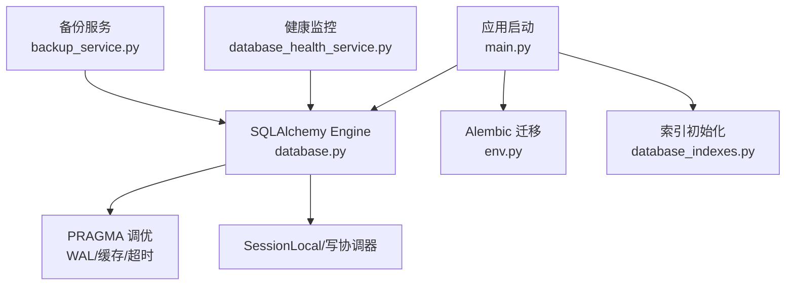
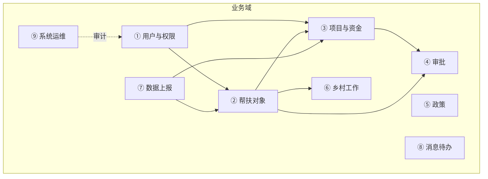
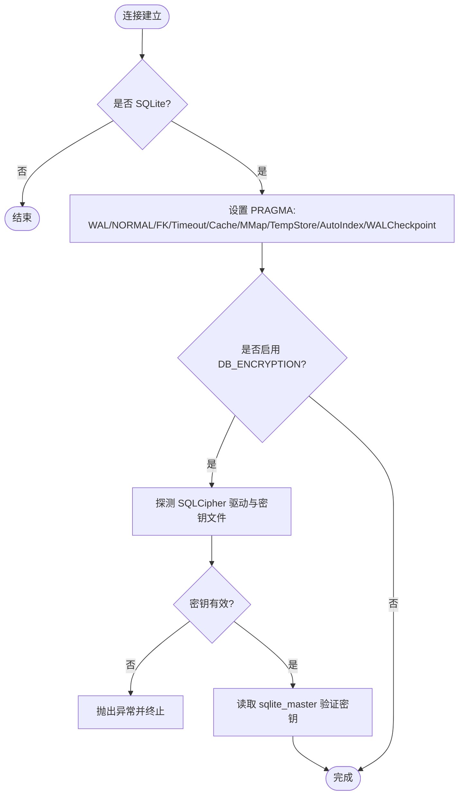
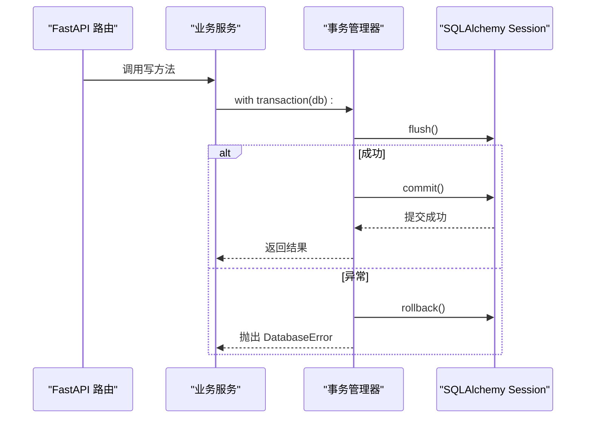
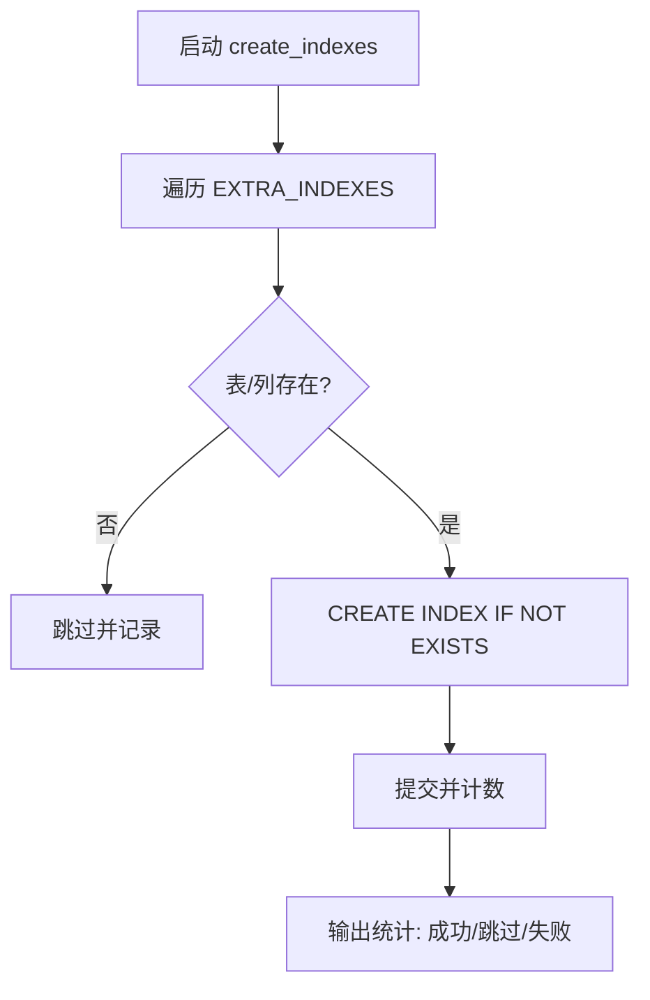
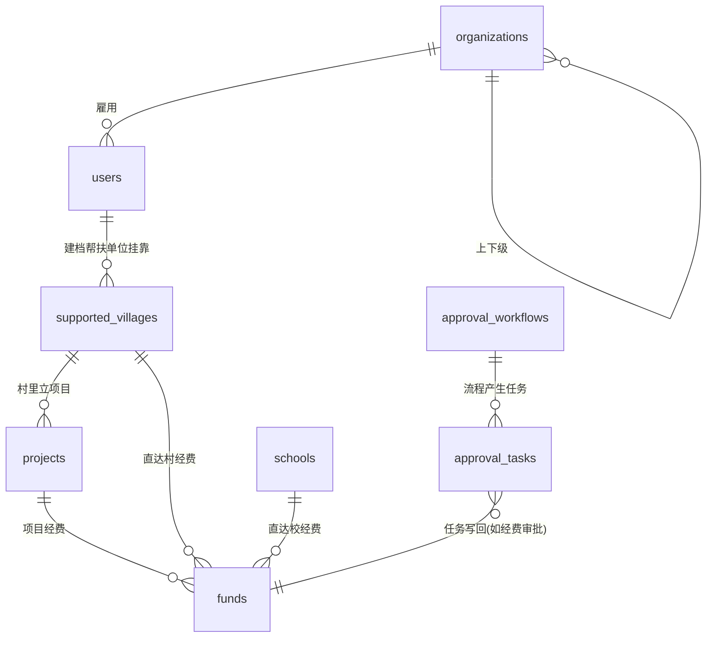
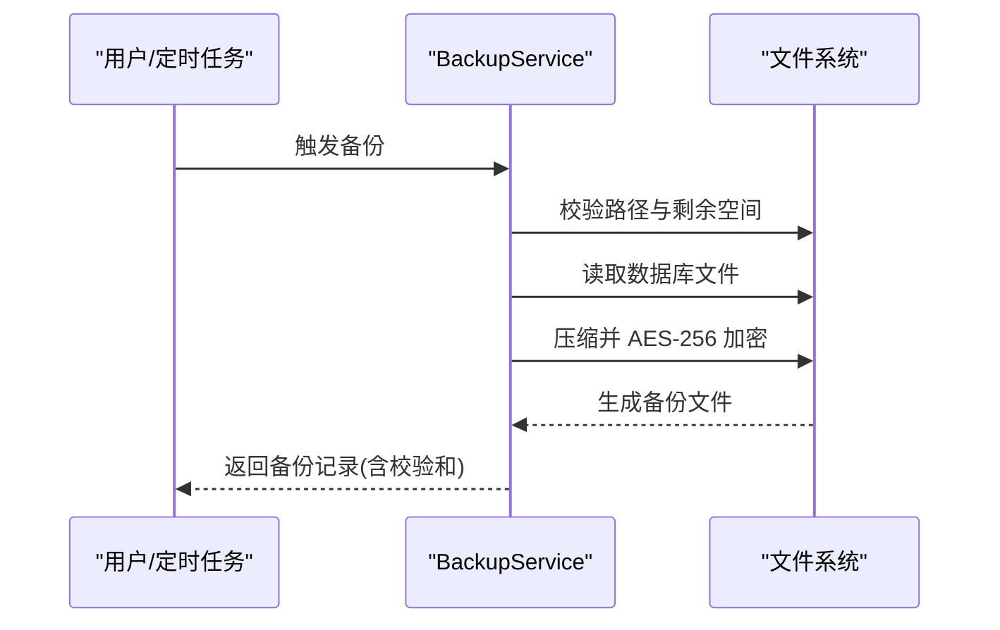
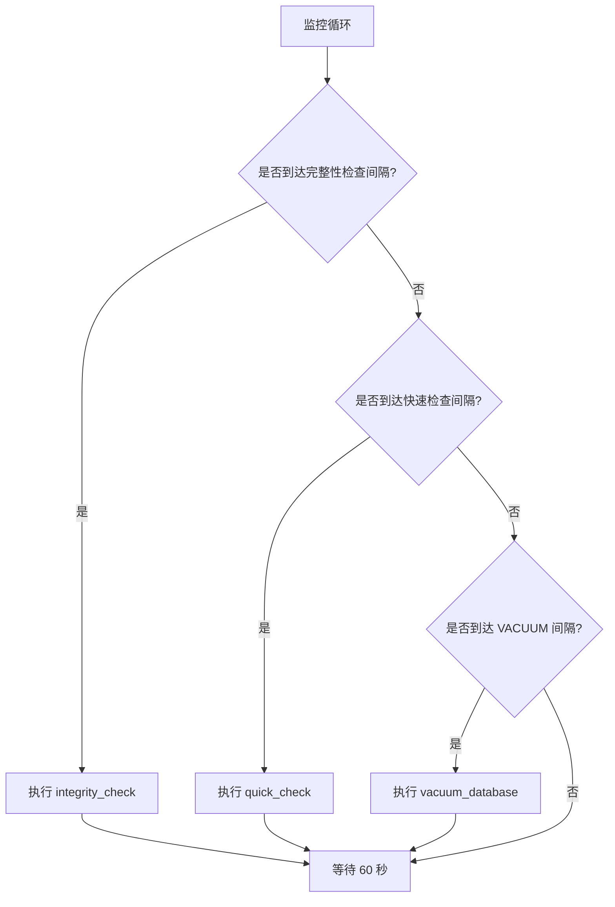
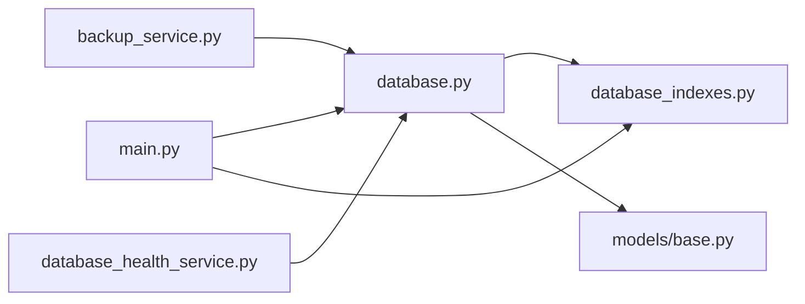

# 数据库架构设计

<cite>
**本文引用的文件**
- [backend/app/core/database.py](file://backend/app/core/database.py)
- [backend/app/core/config.py](file://backend/app/core/config.py)
- [backend/app/core/database_indexes.py](file://backend/app/core/database_indexes.py)
- [backend/app/models/base.py](file://backend/app/models/base.py)
- [backend/app/main.py](file://backend/app/main.py)
- [backend/alembic/env.py](file://backend/alembic/env.py)
- [docs/03-开发文档/08-数据设计/01-数据库设计总览.md](file://docs/03-开发文档/08-数据设计/01-数据库设计总览.md)
- [backend/app/services/backup_service.py](file://backend/app/services/backup_service.py)
- [backend/app/services/database_health_service.py](file://backend/app/services/database_health_service.py)
- [backend/tests/unit/test_database_core.py](file://backend/tests/unit/test_database_core.py)
- [backend/tests/unit/test_performance_api.py](file://backend/tests/unit/test_performance_api.py)
- [backend/tests/unit/test_coverage_gap_batch8.py](file://backend/tests/unit/test_coverage_gap_batch8.py)
</cite>

## 目录
1. [引言](#引言)
2. [项目结构](#项目结构)
3. [核心组件](#核心组件)
4. [架构总览](#架构总览)
5. [详细组件分析](#详细组件分析)
6. [依赖关系分析](#依赖关系分析)
7. [性能与优化](#性能与优化)
8. [故障排查指南](#故障排查指南)
9. [结论](#结论)
10. [附录](#附录)

## 引言
本文件面向“乡村振兴系统”的数据库架构设计与运维，聚焦 SQLite 选型原因、整体架构原则、9 大业务域划分逻辑、核心实体关系与表间关联策略、数据流向设计、索引与查询优化、事务与并发控制、备份恢复策略，以及监控指标、健康检查与故障排查。内容以代码实现为依据，结合现有文档与测试用例进行系统化梳理，便于研发与运维人员快速掌握并落地实践。

## 项目结构
后端采用 FastAPI + SQLAlchemy ORM + Alembic 迁移；数据库为 SQLite（支持可选 SQLCipher 加密）。启动时创建表、执行 Alembic 升级、补建缺失列（可配置）、创建性能索引；运行期通过 PRAGMA 调优、连接池与写入协调器保障并发与一致性；提供备份服务与健康监控服务。

图表来源
- [backend/app/main.py:418-433](file://backend/app/main.py#L418-L433)
- [backend/app/core/database.py:55-67](file://backend/app/core/database.py#L55-L67)
- [backend/alembic/env.py:20-30](file://backend/alembic/env.py#L20-L30)
- [backend/app/core/database_indexes.py:59-95](file://backend/app/core/database_indexes.py#L59-L95)

章节来源
- [backend/app/main.py:418-433](file://backend/app/main.py#L418-L433)
- [backend/app/core/database.py:55-67](file://backend/app/core/database.py#L55-L67)
- [backend/alembic/env.py:20-30](file://backend/alembic/env.py#L20-L30)
- [backend/app/core/database_indexes.py:59-95](file://backend/app/core/database_indexes.py#L59-L95)

## 核心组件
- 数据库引擎与会话：基于 SQLAlchemy 的 Engine/Session，针对 SQLite 启用 WAL、外键约束、busy_timeout、内存临时存储、自动索引等 PRAGMA；连接池使用 QueuePool，限制并发避免锁竞争。
- 写入协调器：SQLiteWriteCoordinator 提供 exclusive_write 独占写上下文，解决长事务/大批量导入时的 SQLITE_BUSY；兼容旧版队列串行写入。
- 索引管理：启动时校验并创建 EXTRA_INDEXES 中的性能索引，幂等安全；提供删除与分析工具。
- 模型基类：BaseModel/TimestampMixin/SoftDeleteMixin/VersionMixin 统一 id、时间戳、软删除、乐观锁与同步版本号；EncryptedText 对 PII 字段透明加解密。
- 配置中心：Settings 集中管理数据库 URL、连接池、加密开关、慢查询阈值、CORS、CSRF、速率限制、监控端口等。
- 迁移与自动补列：Alembic 负责正式 schema 变更；启动时可回退到 _migrate_missing_columns 自动补列，保证向后兼容。
- 备份服务：全量/增量备份、AES-256 加密压缩、完整性校验、路径安全校验、最小剩余空间阈值。
- 健康监控：周期性完整性检查、快速检查、VACUUM 优化、统计与告警状态维护。

章节来源
- [backend/app/core/database.py:78-157](file://backend/app/core/database.py#L78-L157)
- [backend/app/core/database.py:198-289](file://backend/app/core/database.py#L198-L289)
- [backend/app/core/database_indexes.py:18-95](file://backend/app/core/database_indexes.py#L18-L95)
- [backend/app/models/base.py:23-45](file://backend/app/models/base.py#L23-L45)
- [backend/app/models/base.py:66-106](file://backend/app/models/base.py#L66-L106)
- [backend/app/models/base.py:109-155](file://backend/app/models/base.py#L109-L155)
- [backend/app/core/config.py:80-104](file://backend/app/core/config.py#L80-L104)
- [backend/app/main.py:418-433](file://backend/app/main.py#L418-L433)
- [backend/app/services/backup_service.py:74-118](file://backend/app/services/backup_service.py#L74-L118)
- [backend/app/services/database_health_service.py:16-46](file://backend/app/services/database_health_service.py#L16-L46)

## 架构总览
系统围绕“用户(User)、组织(Organization)、帮扶村(SupportedVillage)、学校(School)、项目(Project)、经费(Fund)”等核心实体展开，形成 9 大业务域：用户与权限、帮扶对象、项目与资金、审批、政策、乡村工作、数据上报、消息待办、系统运维。数据流向遵循“业务操作→审批→写回→审计记录”，数据包在多台电脑之间传输并批量写回业务数据。

图表来源
- [docs/03-开发文档/08-数据设计/01-数据库设计总览.md:18-57](file://docs/03-开发文档/08-数据设计/01-数据库设计总览.md#L18-L57)

章节来源
- [docs/03-开发文档/08-数据设计/01-数据库设计总览.md:10-57](file://docs/03-开发文档/08-数据设计/01-数据库设计总览.md#L10-L57)

## 详细组件分析

### SQLite 选型与深度调优
- 选型原因：离线桌面/单机部署场景，零外部依赖；WAL 模式支持多读一写并发；PRAGMA 可调优内存与 I/O；配合连接池与 busy_timeout 平衡性能与稳定性。
- 关键调优：journal_mode=WAL、synchronous=NORMAL、foreign_keys=ON、busy_timeout=10000、cache_size/mmap_size 动态化、temp_store=MEMORY、automatic_index=ON、wal_autocheckpoint=1000、optimize 在连接关闭时执行。
- 加密支持：可选 SQLCipher，启动时探测驱动与密钥文件，错误密钥立即失败（fail-fast），避免假加密。

图表来源
- [backend/app/core/database.py:78-157](file://backend/app/core/database.py#L78-L157)
- [backend/app/core/database.py:93-131](file://backend/app/core/database.py#L93-L131)

章节来源
- [backend/app/core/database.py:78-157](file://backend/app/core/database.py#L78-L157)
- [backend/app/core/database.py:93-131](file://backend/app/core/database.py#L93-L131)

### 事务处理与并发控制
- 短事务：常规 CRUD 依赖 WAL + busy_timeout=10000 自动重试，无需显式加锁。
- 长事务：exclusive_write() 获取进程内互斥锁，避免长事务被 busy_timeout 截断，同时不阻塞其他短事务读取。
- 事务封装：TransactionManager 提供 context manager 与装饰器，统一 commit/rollback；非 SQLite 环境可设置隔离级别与只读事务。
- 连接池：QueuePool 限制连接数，防止过多连接导致文件锁竞争；pool_pre_ping 健康检查，pool_recycle 定期回收。

图表来源
- [backend/tests/unit/test_core_transaction.py:65-76](file://backend/tests/unit/test_core_transaction.py#L65-L76)
- [backend/tests/unit/test_cov_final_transaction.py:8-17](file://backend/tests/unit/test_cov_final_transaction.py#L8-L17)

章节来源
- [backend/app/core/database.py:198-289](file://backend/app/core/database.py#L198-L289)
- [backend/tests/unit/test_core_transaction.py:65-76](file://backend/tests/unit/test_core_transaction.py#L65-L76)
- [backend/tests/unit/test_cov_final_transaction.py:8-17](file://backend/tests/unit/test_cov_final_transaction.py#L8-L17)

### 索引设计与查询优化
- 启动索引：EXTRA_INDEXES 包含 FK 列、状态/日期常用过滤列的索引；create_indexes 幂等创建，缺失列跳过并记录日志。
- 运行时分析：analyze_table_stats 执行 ANALYZE 并收集各表行数统计，辅助性能评估。
- 查询监控：中间件与事件监听统计 N+1 与慢查询；API 暴露慢查询列表与统计分位值。

图表来源
- [backend/app/core/database_indexes.py:59-95](file://backend/app/core/database_indexes.py#L59-L95)

章节来源
- [backend/app/core/database_indexes.py:18-95](file://backend/app/core/database_indexes.py#L18-L95)
- [backend/tests/unit/test_performance_api.py:66-173](file://backend/tests/unit/test_performance_api.py#L66-L173)

### 核心实体关系与数据流向
- 核心七实体：User、Organization、SupportedVillage、School、Project、Fund、ApprovalWorkflow；其余表为其明细档案。
- 数据流向：业务操作→审批流程→写回业务表→审计日志；数据包导入触发批量写回；乡村工作与成效评估分别挂在自然村与帮扶村。

图表来源
- [docs/03-开发文档/08-数据设计/01-数据库设计总览.md:63-108](file://docs/03-开发文档/08-数据设计/01-数据库设计总览.md#L63-L108)

章节来源
- [docs/03-开发文档/08-数据设计/01-数据库设计总览.md:63-108](file://docs/03-开发文档/08-数据设计/01-数据库设计总览.md#L63-L108)

### 备份与恢复策略
- 全量/增量备份：支持增量备份开关与压缩级别；备份包包含数据库与必要元数据。
- 加密与校验：AES-256 加密备份文件，PBKDF2 派生密钥；上传恢复前进行路径安全校验与完整性检测。
- 资源保护：最低剩余空间阈值（默认 500MB）；解析实际绑定数据库路径，避免打包/注入环境下路径漂移。
- 调度与容错：备份调度器启停容错；主进程启动时后台线程执行健康检查与 KPI 预计算。

图表来源
- [backend/app/services/backup_service.py:74-118](file://backend/app/services/backup_service.py#L74-L118)
- [backend/app/services/backup_service.py:145-200](file://backend/app/services/backup_service.py#L145-L200)

章节来源
- [backend/app/services/backup_service.py:74-118](file://backend/app/services/backup_service.py#L74-L118)
- [backend/app/services/backup_service.py:145-200](file://backend/app/services/backup_service.py#L145-L200)
- [backend/tests/unit/test_coverage_gap_batch8.py:154-188](file://backend/tests/unit/test_coverage_gap_batch8.py#L154-L188)

### 健康检查与监控指标
- 健康检查：周期性完整性检查（PRAGMA integrity_check）、快速检查（连接与基本查询）、每周 VACUUM 优化；维护 last_check 时间与问题清单。
- 监控指标：慢查询统计、锁超时次数、完整性错误计数；可通过 /health/full 接口获取数据库大小、备份数量等。
- 启动检查：应用启动时后台线程执行数据库健康检查，确保迁移后状态可见。

图表来源
- [backend/app/services/database_health_service.py:100-133](file://backend/app/services/database_health_service.py#L100-L133)
- [backend/app/services/database_health_service.py:135-200](file://backend/app/services/database_health_service.py#L135-L200)

章节来源
- [backend/app/services/database_health_service.py:16-46](file://backend/app/services/database_health_service.py#L16-L46)
- [backend/app/services/database_health_service.py:100-133](file://backend/app/services/database_health_service.py#L100-L133)
- [backend/app/services/database_health_service.py:135-200](file://backend/app/services/database_health_service.py#L135-L200)
- [backend/tests/unit/test_system_health_api.py:100-160](file://backend/tests/unit/test_system_health_api.py#L100-L160)

## 依赖关系分析
- 模块耦合：database.py 提供 Engine/Session/PRAGMA 调优；database_indexes.py 依赖 engine 创建索引；models/base.py 定义通用混入；main.py 编排启动流程；backup_service.py 与 database_health_service.py 通过路径工具与配置访问数据库。
- 外部依赖：SQLAlchemy、Alembic、SQLCipher（可选）、cryptography（备份加密）。
- 潜在风险：裸整数无外键的引用不一致；双“村庄宇宙”（villages 与 supported_villages）需严格区分；sync_version 绕过 SQLAlchemy UPDATE 将导致不同步。

图表来源
- [backend/app/core/database.py:55-67](file://backend/app/core/database.py#L55-L67)
- [backend/app/core/database_indexes.py:59-95](file://backend/app/core/database_indexes.py#L59-L95)
- [backend/app/models/base.py:158-185](file://backend/app/models/base.py#L158-L185)
- [backend/app/main.py:418-433](file://backend/app/main.py#L418-L433)

章节来源
- [backend/app/core/database.py:55-67](file://backend/app/core/database.py#L55-L67)
- [backend/app/core/database_indexes.py:59-95](file://backend/app/core/database_indexes.py#L59-L95)
- [backend/app/models/base.py:158-185](file://backend/app/models/base.py#L158-L185)
- [backend/app/main.py:418-433](file://backend/app/main.py#L418-L433)

## 性能与优化
- 连接层：WAL 模式、NORMAL 同步、busy_timeout=10000、内存临时存储、自动索引、WAL 自动 checkpoint。
- 内存层：cache_size 与 mmap_size 环境变量覆盖，默认 64MB/128MB；连接关闭时执行 optimize。
- 索引层：FK 列与高频 WHERE/ORDER BY 列建立索引；启动时幂等创建；ANALYZE 更新统计。
- 查询层：N+1 检测、慢查询阈值（默认 200ms）、统计分位（p50/p95/p99）；中间件与事件监听采集。
- 事务层：短事务利用 WAL 与 busy_timeout；长事务使用 exclusive_write 独占写；非 SQLite 可设置隔离级别与只读。
- 备份层：增量备份、压缩级别、AES-256 加密、路径安全校验、最低剩余空间阈值。

章节来源
- [backend/app/core/database.py:78-157](file://backend/app/core/database.py#L78-L157)
- [backend/app/core/database_indexes.py:18-95](file://backend/app/core/database_indexes.py#L18-L95)
- [backend/app/core/config.py:80-104](file://backend/app/core/config.py#L80-L104)
- [backend/tests/unit/test_performance_api.py:66-173](file://backend/tests/unit/test_performance_api.py#L66-L173)
- [backend/app/services/backup_service.py:74-118](file://backend/app/services/backup_service.py#L74-L118)

## 故障排查指南
- 启动阶段
  - 迁移失败：生产环境迁移失败直接中止启动，记录 ERROR 与完整栈；开发/测试环境记录错误后回退到自动补列。
  - 索引创建失败：记录警告并继续；检查列是否存在与权限。
- 运行阶段
  - SQLITE_BUSY：长事务或高并发写入导致；使用 exclusive_write 包裹长事务；调整 busy_timeout 或降低并发。
  - 慢查询：通过 /performance/slow-queries 查看；增加索引或优化查询；关注 N+1 问题。
  - 备份失败：检查磁盘剩余空间（≥500MB）、路径安全、加密密钥；查看备份日志与校验和。
  - 健康检查异常：完整性检查失败、连接不可用；查看 last_check 与 issues 列表。
- 常见陷阱
  - village_id 实指帮扶村（supported_villages.id），不是自然村（villages.id）。
  - 双“村庄宇宙”：乡村工作挂 villages，帮扶业务挂 supported_villages。
  - 软删除双轨制：旧模型 is_active=False，新模型 SoftDeleteMixin。
  - 裸整数无外键：部分 organization_id/user_id 不做引用校验，删被引用行不会报错。
  - sync_version：绕过 SQLAlchemy UPDATE 不会自增，导致增量同步失效。

章节来源
- [backend/app/main.py:418-433](file://backend/app/main.py#L418-L433)
- [backend/app/core/database.py:198-289](file://backend/app/core/database.py#L198-L289)
- [backend/tests/unit/test_performance_api.py:66-173](file://backend/tests/unit/test_performance_api.py#L66-L173)
- [backend/app/services/backup_service.py:74-118](file://backend/app/services/backup_service.py#L74-L118)
- [backend/app/services/database_health_service.py:135-200](file://backend/app/services/database_health_service.py#L135-L200)
- [docs/03-开发文档/08-数据设计/01-数据库设计总览.md:312-323](file://docs/03-开发文档/08-数据设计/01-数据库设计总览.md#L312-L323)

## 结论
本系统以 SQLite 为核心存储，通过 WAL、PRAGMA 调优、连接池与写入协调器，在单机/多机物理协同环境下兼顾一致性与性能。9 大业务域清晰划分，核心实体关系明确，数据流向规范。索引与查询优化贯穿启动与运行期，事务与并发控制覆盖短/长事务场景。备份与健康管理提供可靠的数据保护与可观测性。建议在生产环境中持续监控慢查询与锁超时，合理维护索引与统计信息，严格执行备份策略与健康检查。

## 附录
- 9 大业务域概览与 ER 图详见《数据库设计总览》。
- 数据字典与迁移链以 models 与 alembic 为准。
- 配置项参考 Settings，包括数据库、加密、连接池、监控与安全相关参数。