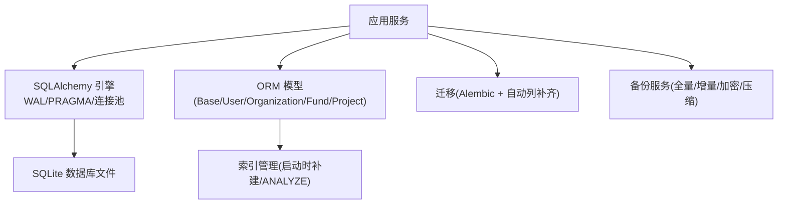
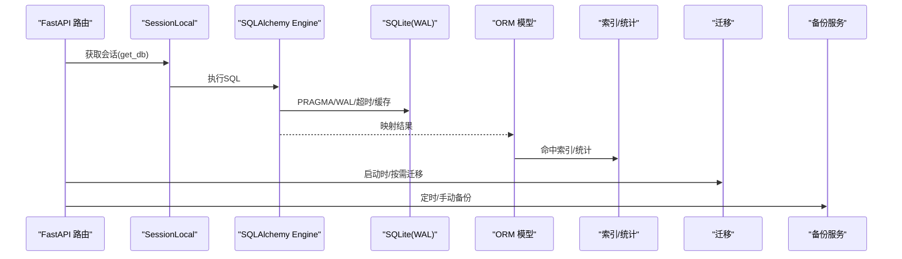
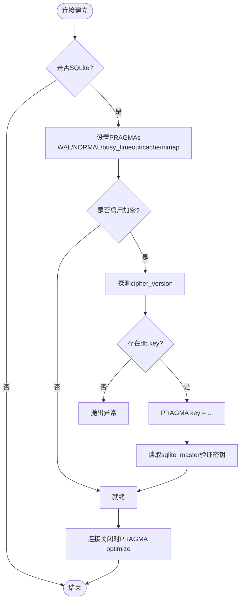
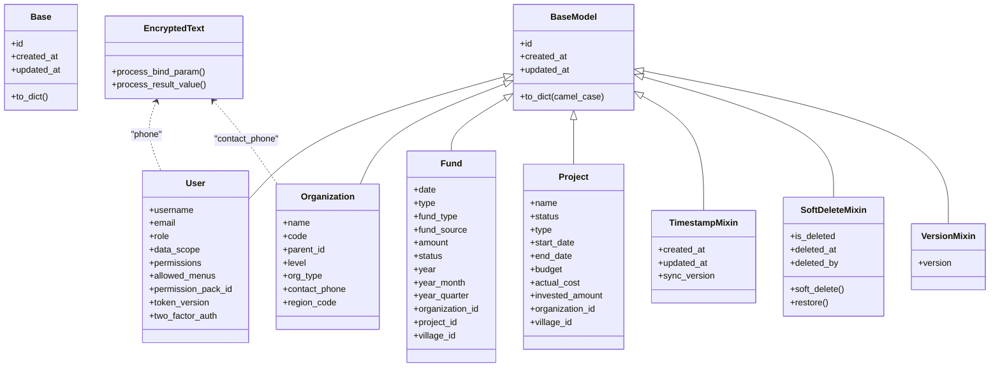
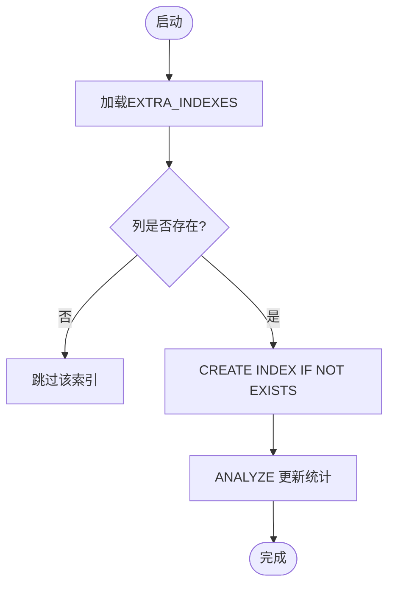
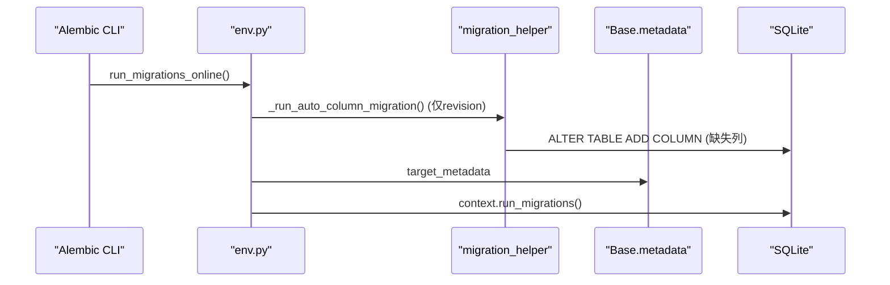
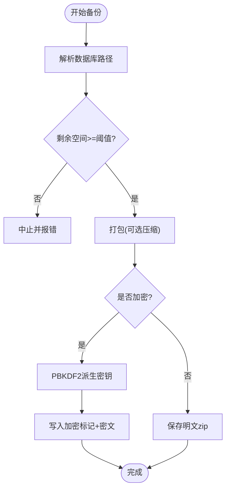
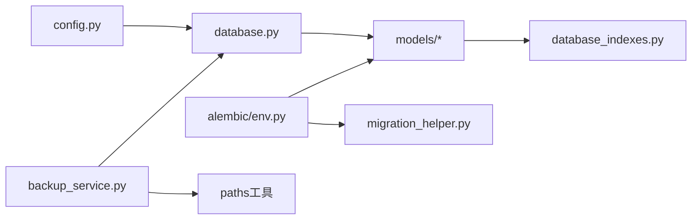

# 数据库设计

<cite>
**本文引用的文件**
- [backend/app/core/database.py](file://backend/app/core/database.py)
- [backend/app/core/database_indexes.py](file://backend/app/core/database_indexes.py)
- [backend/alembic/env.py](file://backend/alembic/env.py)
- [backend/app/models/base.py](file://backend/app/models/base.py)
- [backend/app/models/user.py](file://backend/app/models/user.py)
- [backend/app/models/organization.py](file://backend/app/models/organization.py)
- [backend/app/models/fund.py](file://backend/app/models/fund.py)
- [backend/app/models/project.py](file://backend/app/models/project.py)
- [backend/app/core/config.py](file://backend/app/core/config.py)
- [backend/app/services/backup_service.py](file://backend/app/services/backup_service.py)
- [backend/app/core/migration_helper.py](file://backend/app/core/migration_helper.py)
- [backend/alembic/versions/001_baseline.py](file://backend/alembic/versions/001_baseline.py)
</cite>

## 目录
1. [简介](#简介)
2. [项目结构](#项目结构)
3. [核心组件](#核心组件)
4. [架构总览](#架构总览)
5. [详细组件分析](#详细组件分析)
6. [依赖关系分析](#依赖关系分析)
7. [性能与优化](#性能与优化)
8. [故障排查指南](#故障排查指南)
9. [结论](#结论)
10. [附录](#附录)

## 简介
本文件面向“乡村振兴帮扶管理系统”的数据库设计与实现，聚焦 SQLite 在单机/多机物理协同环境下的深度调优、表结构与关系模型、索引策略、查询优化、数据迁移管理（Alembic + 自动列补齐）、备份恢复与安全合规。文档以代码为依据，提供可追溯的章节来源与图示，帮助读者从整体到细节掌握系统的数据层设计。

## 项目结构
数据层由以下关键部分组成：
- 引擎与连接配置：WAL 模式、PRAGMA 调优、连接池、SQLCipher 加密探测与密钥校验
- ORM 模型与基类：统一时间戳、软删除、乐观锁版本、PII 字段透明加密类型
- 索引管理：运行时索引创建与分析统计
- 迁移管理：Alembic 环境与自动列补齐辅助
- 备份恢复：增量/全量备份、压缩与 AES-256 加密、路径安全校验
- 配置中心：数据库 URL、连接池参数、加密开关等

**图表来源**
- [backend/app/core/database.py:55-65](file://backend/app/core/database.py#L55-L65)
- [backend/app/core/database_indexes.py:59-95](file://backend/app/core/database_indexes.py#L59-L95)
- [backend/alembic/env.py:79-103](file://backend/alembic/env.py#L79-L103)
- [backend/app/services/backup_service.py:74-118](file://backend/app/services/backup_service.py#L74-L118)

**章节来源**
- [backend/app/core/database.py:1-158](file://backend/app/core/database.py#L1-L158)
- [backend/app/core/database_indexes.py:1-148](file://backend/app/core/database_indexes.py#L1-L148)
- [backend/alembic/env.py:1-110](file://backend/alembic/env.py#L1-L110)
- [backend/app/models/base.py:1-185](file://backend/app/models/base.py#L1-L185)
- [backend/app/services/backup_service.py:1-200](file://backend/app/services/backup_service.py#L1-L200)

## 核心组件
- 数据库引擎与 PRAGMA 调优：启用 WAL、NORMAL 同步、busy_timeout、内存缓存与 mmap、自动 checkpoint 与 optimize
- 写入协调器：长事务独占写上下文，避免 SQLITE_BUSY；短事务走 WAL+busy_timeout 并发读
- ORM 基类与混入：统一 id、created_at/updated_at、sync_version 自动递增、软删除、乐观锁版本、EncryptedText PII 透明加密
- 索引管理：集中定义额外索引，启动时幂等创建，支持 ANALYZE 统计
- 迁移与环境：Alembic 在线/离线模式、与 _migrate_missing_columns 兼容共存
- 备份服务：全量/增量、AES-256(Fernet) 加密、压缩级别、路径安全校验、最小剩余空间阈值

**章节来源**
- [backend/app/core/database.py:78-158](file://backend/app/core/database.py#L78-L158)
- [backend/app/core/database.py:198-289](file://backend/app/core/database.py#L198-L289)
- [backend/app/models/base.py:23-46](file://backend/app/models/base.py#L23-L46)
- [backend/app/models/base.py:66-155](file://backend/app/models/base.py#L66-L155)
- [backend/app/core/database_indexes.py:14-95](file://backend/app/core/database_indexes.py#L14-L95)
- [backend/alembic/env.py:45-103](file://backend/alembic/env.py#L45-L103)
- [backend/app/services/backup_service.py:74-200](file://backend/app/services/backup_service.py#L74-L200)

## 架构总览
下图展示请求到数据库的关键路径：FastAPI 注入 Session → SQLAlchemy 引擎 → SQLite（WAL/PRAGMA）→ ORM 模型 → 索引与统计 → 迁移与备份。

**图表来源**
- [backend/app/core/database.py:174-186](file://backend/app/core/database.py#L174-L186)
- [backend/app/core/database.py:78-158](file://backend/app/core/database.py#L78-L158)
- [backend/app/core/database_indexes.py:59-95](file://backend/app/core/database_indexes.py#L59-L95)
- [backend/alembic/env.py:79-103](file://backend/alembic/env.py#L79-L103)
- [backend/app/services/backup_service.py:74-118](file://backend/app/services/backup_service.py#L74-L118)

## 详细组件分析

### 数据库引擎与连接管理
- 引擎创建：根据是否 SQLite 选择连接池与参数；开启 pool_pre_ping、pool_recycle、pool_timeout
- PRAGMA 初始化：WAL、foreign_keys=ON、synchronous=NORMAL、busy_timeout=10000、cache_size/mmap_size、temp_store=MEMORY、wal_autocheckpoint=1000、automatic_index=ON
- SQLCipher 支持：连接建立时探测 cipher_version，读取并校验 db.key，失败则拒绝启动
- 连接关闭优化：调用 PRAGMA optimize
- 写入协调器：exclusive_write 上下文管理器用于长事务独占写，避免 SQLITE_BUSY；enqueue 向后兼容队列串行

**图表来源**
- [backend/app/core/database.py:78-158](file://backend/app/core/database.py#L78-L158)
- [backend/app/core/database.py:160-171](file://backend/app/core/database.py#L160-L171)

**章节来源**
- [backend/app/core/database.py:55-65](file://backend/app/core/database.py#L55-L65)
- [backend/app/core/database.py:78-158](file://backend/app/core/database.py#L78-L158)
- [backend/app/core/database.py:198-289](file://backend/app/core/database.py#L198-L289)

### ORM 模型与关系映射
- 基类 BaseModel：id、created_at、updated_at、to_dict(camelCase)、__repr__
- 混入：
  - TimestampMixin：自动 UTC 时间戳、sync_version 在 before_update 自动 +1
  - SoftDeleteMixin：is_deleted/deleted_at/deleted_by、soft_delete()/restore()
  - VersionMixin：version 乐观锁
  - EncryptedText：PII 字段透明加解密（写入标记 enc.v1:，读取还原明文）
- 核心模型：
  - User：角色、数据范围、权限包绑定、菜单白名单、token_version、两因素认证关联
  - Organization：树形自引用、组织类型/层级、联系人电话加密、region_code 数据权限前缀
  - Fund：经费生命周期、预算/拨付/使用/结余、健康度/偏差率、软删、聚合冗余字段 year/year_month/year_quarter 及对应复合索引
  - Project：状态/类型/进度、起止日期、资金信息、软删、任务与附件

**图表来源**
- [backend/app/models/base.py:23-46](file://backend/app/models/base.py#L23-L46)
- [backend/app/models/base.py:66-155](file://backend/app/models/base.py#L66-L155)
- [backend/app/models/user.py:26-90](file://backend/app/models/user.py#L26-L90)
- [backend/app/models/organization.py:31-78](file://backend/app/models/organization.py#L31-L78)
- [backend/app/models/fund.py:61-167](file://backend/app/models/fund.py#L61-L167)
- [backend/app/models/project.py:47-175](file://backend/app/models/project.py#L47-L175)

**章节来源**
- [backend/app/models/base.py:1-185](file://backend/app/models/base.py#L1-L185)
- [backend/app/models/user.py:1-152](file://backend/app/models/user.py#L1-L152)
- [backend/app/models/organization.py:1-78](file://backend/app/models/organization.py#L1-L78)
- [backend/app/models/fund.py:1-299](file://backend/app/models/fund.py#L1-L299)
- [backend/app/models/project.py:1-320](file://backend/app/models/project.py#L1-L320)

### 索引与查询优化
- 运行时索引：EXTRA_INDEXES 集中管理 FK/状态/日期等高频查询列，启动时 CREATE INDEX IF NOT EXISTS 幂等创建
- 模型内索引：各模型 __table_args__ 声明单列/复合索引，覆盖常见过滤与排序组合
- 统计信息：ANALYZE 更新 sqlite_stat 表，提升查询计划质量
- 聚合冗余：Fund 表预计算 year/year_month/year_quarter，配合复合索引消除 GROUP BY strftime 开销

**图表来源**
- [backend/app/core/database_indexes.py:59-95](file://backend/app/core/database_indexes.py#L59-L95)
- [backend/app/core/database_indexes.py:121-148](file://backend/app/core/database_indexes.py#L121-L148)

**章节来源**
- [backend/app/core/database_indexes.py:14-95](file://backend/app/core/database_indexes.py#L14-L95)
- [backend/app/models/fund.py:66-86](file://backend/app/models/fund.py#L66-L86)
- [backend/app/models/project.py:52-68](file://backend/app/models/project.py#L52-L68)
- [backend/app/models/user.py:31-35](file://backend/app/models/user.py#L31-L35)
- [backend/app/models/organization.py:36-43](file://backend/app/models/organization.py#L36-L43)

### 数据迁移管理
- Alembic 环境：在线/离线模式、target_metadata 指向 Base.metadata、render_as_batch=True 适配 SQLite
- 自动列补齐：_migrate_missing_columns 在 revision --autogenerate 前运行，确保生成脚本基于完整 schema；upgrade/downgrade 不重复执行以避免冲突
- 基线迁移：001_baseline 检测核心表缺失时 create_all 构建初始库，后续迁移各自带存在性守卫

**图表来源**
- [backend/alembic/env.py:79-103](file://backend/alembic/env.py#L79-L103)
- [backend/app/core/migration_helper.py:68-154](file://backend/app/core/migration_helper.py#L68-L154)
- [backend/alembic/versions/001_baseline.py:21-43](file://backend/alembic/versions/001_baseline.py#L21-L43)

**章节来源**
- [backend/alembic/env.py:1-110](file://backend/alembic/env.py#L1-L110)
- [backend/app/core/migration_helper.py:1-154](file://backend/app/core/migration_helper.py#L1-L154)
- [backend/alembic/versions/001_baseline.py:1-48](file://backend/alembic/versions/001_baseline.py#L1-L48)

### 备份与恢复策略
- 全量/增量：支持增量备份（通过 manifest 跟踪变更），压缩级别可配
- 加密：AES-256(Fernet)，PBKDF2 派生密钥，文件头标记识别加密格式
- 路径安全：上传/备份路径校验，防止路径穿越
- 磁盘空间：备份前检查最小剩余空间（默认 500MB）
- 恢复：解密到临时文件再解压恢复，保证原备份不受影响

**图表来源**
- [backend/app/services/backup_service.py:74-118](file://backend/app/services/backup_service.py#L74-L118)
- [backend/app/services/backup_service.py:141-200](file://backend/app/services/backup_service.py#L141-L200)

**章节来源**
- [backend/app/services/backup_service.py:1-200](file://backend/app/services/backup_service.py#L1-L200)

### 安全与隐私保护
- 传输与存储加密：
  - 数据库级：SQLCipher 探测与密钥校验，fail-closed 策略
  - 字段级：EncryptedText 对敏感字段（如 phone、contact_phone）透明加密，写入标记、读取还原
- 访问控制：
  - 用户角色与数据范围（all/org/org_children/self）
  - 权限包与菜单白名单（allowed_menus）
  - token_version 强制旧令牌失效
- CSRF 与速率限制：生产默认开启 CSRF，速率限制可配
- 日志安全：生产环境强制关闭 DB_ECHO，避免敏感 SQL 落盘

**章节来源**
- [backend/app/core/database.py:89-131](file://backend/app/core/database.py#L89-L131)
- [backend/app/models/base.py:23-46](file://backend/app/models/base.py#L23-L46)
- [backend/app/models/user.py:42-85](file://backend/app/models/user.py#L42-L85)
- [backend/app/core/config.py:126-154](file://backend/app/core/config.py#L126-L154)
- [backend/app/core/config.py:301-310](file://backend/app/core/config.py#L301-L310)

## 依赖关系分析
- 模块耦合：
  - database.py 依赖 config.py 获取 DATABASE_URL 与连接池参数
  - models/* 依赖 base.py 提供的基类与混入
  - database_indexes.py 依赖 engine 进行索引创建与分析
  - alembic/env.py 依赖 Base.metadata 与 migration_helper
  - backup_service.py 依赖 paths 工具与 system_config
- 外部依赖：
  - SQLAlchemy/QueuePool 连接池
  - SQLite（WAL/PRAGMA）
  - SQLCipher（可选）
  - cryptography（Fernet/AES-256）

**图表来源**
- [backend/app/core/config.py:24-31](file://backend/app/core/config.py#L24-L31)
- [backend/app/core/database.py:47-65](file://backend/app/core/database.py#L47-L65)
- [backend/app/core/database_indexes.py:59-95](file://backend/app/core/database_indexes.py#L59-L95)
- [backend/alembic/env.py:20-24](file://backend/alembic/env.py#L20-L24)
- [backend/app/services/backup_service.py:74-118](file://backend/app/services/backup_service.py#L74-L118)

**章节来源**
- [backend/app/core/config.py:54-104](file://backend/app/core/config.py#L54-L104)
- [backend/app/core/database.py:47-65](file://backend/app/core/database.py#L47-L65)
- [backend/app/core/database_indexes.py:59-95](file://backend/app/core/database_indexes.py#L59-L95)
- [backend/alembic/env.py:20-24](file://backend/alembic/env.py#L20-L24)
- [backend/app/services/backup_service.py:74-118](file://backend/app/services/backup_service.py#L74-L118)

## 性能与优化
- WAL 与同步策略：WAL + NORMAL 平衡一致性与写入性能
- 连接池：QueuePool 限制连接数，避免文件锁竞争；pool_pre_ping 保障连接健康
- PRAGMA 调优：cache_size、mmap_size、temp_store=MEMORY、wal_autocheckpoint、automatic_index、optimize
- 索引策略：
  - 高频过滤/排序列建立单列索引
  - 常见组合条件建立复合索引（如 status+date、village_id+status）
  - 聚合冗余字段（year/year_month/year_quarter）消除函数计算开销
- 长事务隔离：exclusive_write 避免 SQLITE_BUSY，短事务走 WAL 并发读
- 统计信息：ANALYZE 更新 sqlite_stat，提升查询计划质量

**章节来源**
- [backend/app/core/database.py:78-158](file://backend/app/core/database.py#L78-L158)
- [backend/app/core/database.py:198-289](file://backend/app/core/database.py#L198-L289)
- [backend/app/core/database_indexes.py:59-95](file://backend/app/core/database_indexes.py#L59-L95)
- [backend/app/models/fund.py:66-86](file://backend/app/models/fund.py#L66-L86)
- [backend/app/models/fund.py:199-226](file://backend/app/models/fund.py#L199-L226)

## 故障排查指南
- 启动时报错“SQLCipher 驱动不支持”：确认已安装 pysqlcipher3/sqlcipher3，或关闭 DB_ENCRYPTION_ENABLED
- 密钥错误导致“file is not a database”：检查 config/db.key 内容与权限，确保首条业务查询能读取 schema
- 导入大数据报 SQLITE_BUSY：使用 exclusive_write 包裹长事务，或调整 busy_timeout
- 索引未生效：确认 EXTRA_INDEXES 中列名正确，启动时 create_indexes 是否成功，必要时手动 ANALYZE
- 备份失败：检查磁盘剩余空间（≥500MB）、备份目录权限、加密密码是否正确
- 迁移冲突：确保 revision --autogenerate 前执行 _migrate_missing_columns，避免重复 DDL

**章节来源**
- [backend/app/core/database.py:89-131](file://backend/app/core/database.py#L89-L131)
- [backend/app/core/database.py:198-289](file://backend/app/core/database.py#L198-L289)
- [backend/app/core/database_indexes.py:59-95](file://backend/app/core/database_indexes.py#L59-L95)
- [backend/app/services/backup_service.py:120-139](file://backend/app/services/backup_service.py#L120-L139)
- [backend/app/core/migration_helper.py:68-154](file://backend/app/core/migration_helper.py#L68-L154)

## 结论
本系统采用 SQLite+WAL 的高并发读写方案，结合 PRAGMA 调优、连接池与写入协调器，兼顾性能与一致性。ORM 层通过基类与混入统一审计、软删与乐观锁，模型内聚式索引与聚合冗余显著提升复杂查询效率。迁移体系以 Alembic 为主、自动列补齐为辅，确保平滑演进。备份服务提供加密与压缩能力，满足数据安全与合规要求。整体设计在单机/多机协同场景下具备高可用、易维护与可扩展特性。

## 附录
- 配置项速查（数据库相关）：
  - DATABASE_URL：动态默认路径，支持相对路径转绝对路径
  - DB_POOL_SIZE/MAX_OVERFLOW/TIMEOUT/RECYCLE/PRE_PING：连接池参数
  - DB_ENCRYPTION_ENABLED/KEY_PATH：SQLCipher 开关与密钥文件
  - ENCRYPTION_KEY/BACKEND/DERIVATION：字段加密配置
  - ENABLE_AUTO_MIGRATION：是否允许启动时自动 DDL（建议逐步迁移至 Alembic）

**章节来源**
- [backend/app/core/config.py:80-104](file://backend/app/core/config.py#L80-L104)
- [backend/app/core/config.py:296-364](file://backend/app/core/config.py#L296-L364)