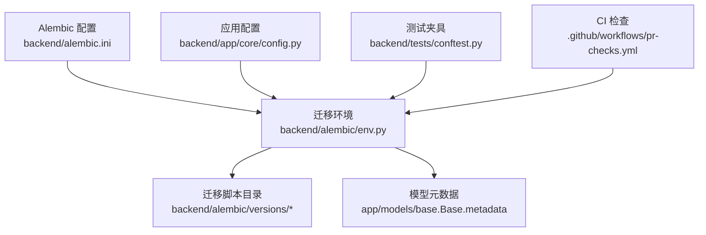
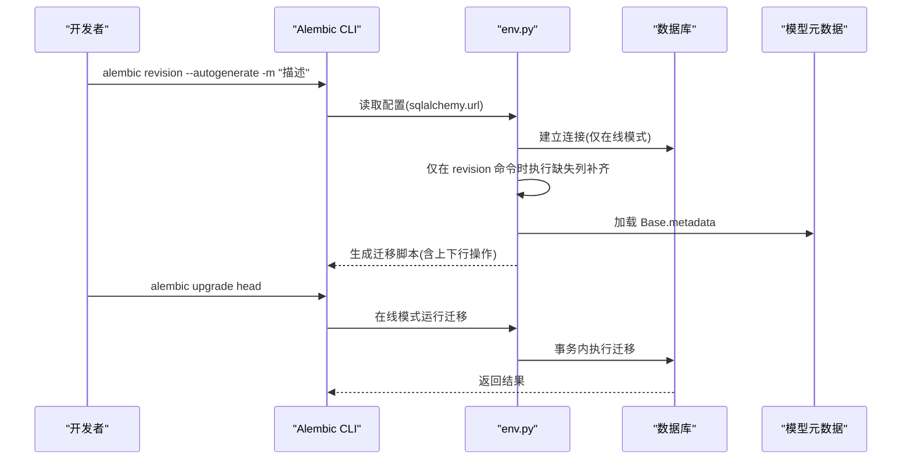
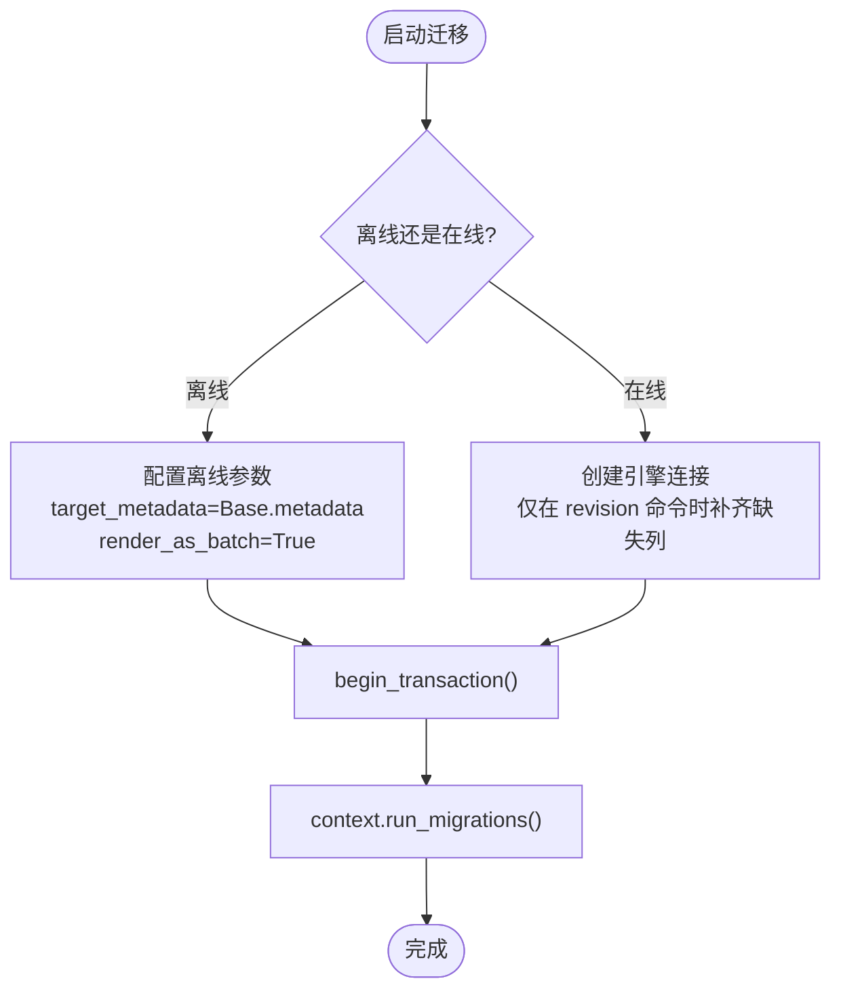
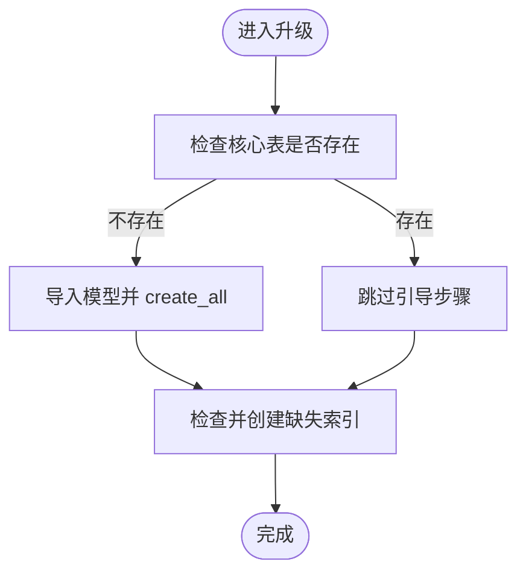
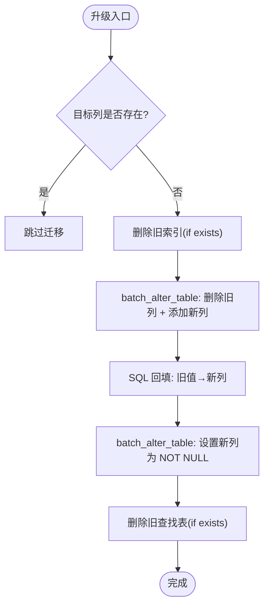
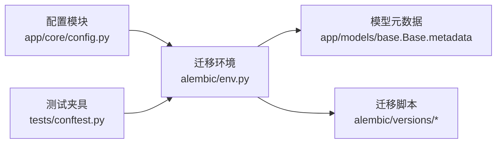

# 数据迁移管理

<cite>
**本文引用的文件**
- [backend/alembic.ini](file://backend/alembic.ini)
- [backend/alembic/env.py](file://backend/alembic/env.py)
- [backend/alembic/script.py.mako](file://backend/alembic/script.py.mako)
- [backend/alembic/versions/001_baseline.py](file://backend/alembic/versions/001_baseline.py)
- [backend/alembic/versions/013_bootstrap_baseline.py](file://backend/alembic/versions/013_bootstrap_baseline.py)
- [backend/alembic/versions/20260608_revitalization_tier_to_bool.py](file://backend/alembic/versions/20260608_revitalization_tier_to_bool.py)
- [backend/app/core/migration_helper.py](file://backend/app/core/migration_helper.py)
- [backend/app/core/config.py](file://backend/app/core/config.py)
- [backend/tests/conftest.py](file://backend/tests/conftest.py)
- [.github/workflows/pr-checks.yml](file://.github/workflows/pr-checks.yml)
</cite>

## 目录
1. [简介](#简介)
2. [项目结构](#项目结构)
3. [核心组件](#核心组件)
4. [架构总览](#架构总览)
5. [详细组件分析](#详细组件分析)
6. [依赖关系分析](#依赖关系分析)
7. [性能考虑](#性能考虑)
8. [故障排查指南](#故障排查指南)
9. [结论](#结论)
10. [附录](#附录)

## 简介
本文件面向“帮扶管理信息系统”的数据迁移管理，围绕 Alembic 迁移工具的使用、迁移脚本编写规范、版本控制策略展开，覆盖基线迁移、增量迁移、回滚流程，以及冲突解决、数据一致性保障、生产部署注意事项。同时给出最佳实践、常见陷阱规避、性能优化建议，并说明自动化测试与 CI/CD 集成、灾难恢复方案。

## 项目结构
后端使用 Alembic 进行数据库版本化管理，迁移脚本位于 backend/alembic/versions；环境配置在 backend/alembic/env.py；Alembic 配置文件为 backend/alembic.ini；模板脚本为 backend/alembic/script.py.mako。应用通过配置模块读取 DATABASE_URL，并在迁移环境中注入到 Alembic。测试侧通过 conftest 隔离数据库路径，避免污染开发库。CI 工作流包含后端测试、覆盖率门禁与安全扫描。

图表来源
- [backend/alembic.ini:1-40](file://backend/alembic.ini#L1-L40)
- [backend/alembic/env.py:20-43](file://backend/alembic/env.py#L20-L43)
- [backend/app/core/config.py:24-32](file://backend/app/core/config.py#L24-L32)
- [backend/tests/conftest.py:14-23](file://backend/tests/conftest.py#L14-L23)

章节来源
- [backend/alembic.ini:1-40](file://backend/alembic.ini#L1-L40)
- [backend/alembic/env.py:1-110](file://backend/alembic/env.py#L1-L110)
- [backend/app/core/config.py:24-32](file://backend/app/core/config.py#L24-L32)
- [backend/tests/conftest.py:14-23](file://backend/tests/conftest.py#L14-L23)

## 核心组件
- Alembic 配置与环境：alembic.ini 指定脚本位置与日志级别；env.py 负责连接数据库、加载模型元数据、离线/在线模式切换、SQLite 批处理支持，并在 autogenerate 前执行缺失列补齐以生成一致的结构差异。
- 迁移脚本模板：script.py.mako 提供 revision/down_revision/branch_labels/depends_on 及 upgrade/downgrade 骨架。
- 基线与引导迁移：001_baseline 作为历史起点；013_bootstrap_baseline 解决空库无法引导与存量索引缺失问题，具备幂等性。
- 增量迁移示例：如将字符串字段改为布尔字段并清理旧表/索引的迁移脚本，体现 SQLite 批处理与数据回填策略。
- 自动列补齐辅助：migration_helper.py 提供兼容旧库的缺失列自动添加能力，并可通过环境变量禁用，推动向纯 Alembic 迁移过渡。
- 配置与测试：config.py 提供 DATABASE_URL；tests/conftest.py 设置测试数据库路径与上传目录隔离，确保测试安全。

章节来源
- [backend/alembic/script.py.mako:1-27](file://backend/alembic/script.py.mako#L1-L27)
- [backend/alembic/versions/001_baseline.py:1-48](file://backend/alembic/versions/001_baseline.py#L1-L48)
- [backend/alembic/versions/013_bootstrap_baseline.py:1-82](file://backend/alembic/versions/013_bootstrap_baseline.py#L1-L82)
- [backend/alembic/versions/20260608_revitalization_tier_to_bool.py:1-102](file://backend/alembic/versions/20260608_revitalization_tier_to_bool.py#L1-L102)
- [backend/app/core/migration_helper.py:1-154](file://backend/app/core/migration_helper.py#L1-L154)
- [backend/app/core/config.py:24-32](file://backend/app/core/config.py#L24-L32)
- [backend/tests/conftest.py:14-23](file://backend/tests/conftest.py#L14-L23)

## 架构总览
下图展示从应用配置到 Alembic 迁移执行的端到端流程，包括离线生成 SQL 与在线执行迁移，以及在 autogenerate 前补齐缺失列以保证差异检测准确。

图表来源
- [backend/alembic/env.py:29-43](file://backend/alembic/env.py#L29-L43)
- [backend/alembic/env.py:60-94](file://backend/alembic/env.py#L60-L94)
- [backend/alembic/env.py:95-103](file://backend/alembic/env.py#L95-L103)
- [backend/alembic.ini:1-40](file://backend/alembic.ini#L1-L40)

## 详细组件分析

### Alembic 环境与迁移执行
- 配置注入：env.py 将 settings.DATABASE_URL 写入 Alembic 配置，确保迁移使用应用配置的数据库地址。
- 离线/在线模式：离线模式用于生成 SQL（不连库），在线模式直接执行迁移。
- SQLite 批处理：启用 render_as_batch=True 以支持 SQLite 的 ALTER TABLE 限制。
- 前置补齐：在 revision --autogenerate 场景下，先执行 _migrate_missing_columns，使 autogenerate 看到完整表结构，避免重复 DDL。
- 日志：根据是否已有 root handler 决定是否加载 fileConfig，避免重置应用日志导致静默。

图表来源
- [backend/alembic/env.py:45-57](file://backend/alembic/env.py#L45-L57)
- [backend/alembic/env.py:79-103](file://backend/alembic/env.py#L79-L103)

章节来源
- [backend/alembic/env.py:29-43](file://backend/alembic/env.py#L29-L43)
- [backend/alembic/env.py:60-94](file://backend/alembic/env.py#L60-L94)
- [backend/alembic/env.py:95-103](file://backend/alembic/env.py#L95-L103)

### 基线迁移与引导
- 001_baseline：作为历史起点，若检测到核心表已存在则跳过；否则导入全部模型并通过 Base.metadata.create_all 建表，保证从零开始可引导。
- 013_bootstrap_baseline：进一步解决空库引导与存量索引缺失问题，具备幂等性；upgrade 中先引导建表再补索引，downgrade 仅移除本迁移创建的索引，避免误删全库。

图表来源
- [backend/alembic/versions/001_baseline.py:21-42](file://backend/alembic/versions/001_baseline.py#L21-L42)
- [backend/alembic/versions/013_bootstrap_baseline.py:39-71](file://backend/alembic/versions/013_bootstrap_baseline.py#L39-L71)

章节来源
- [backend/alembic/versions/001_baseline.py:1-48](file://backend/alembic/versions/001_baseline.py#L1-L48)
- [backend/alembic/versions/013_bootstrap_baseline.py:1-82](file://backend/alembic/versions/013_bootstrap_baseline.py#L1-L82)

### 增量迁移示例：字段类型变更与数据回填
以将字符串字段改为布尔字段为例，迁移过程包括：
- 幂等守卫：检测目标列是否存在，存在则整体跳过。
- 删除旧索引：使用 if_exists=True 避免重复错误。
- 分批修改列：SQLite 需 batch_alter_table，先删除旧列并添加新列，再进行数据回填。
- 数据回填：将非空旧值映射为新布尔列，并将 NULL 设置为默认值。
- 最终约束：在新列上设置 NOT NULL。
- 清理旧表：删除不再使用的查找表。

图表来源
- [backend/alembic/versions/20260608_revitalization_tier_to_bool.py:25-64](file://backend/alembic/versions/20260608_revitalization_tier_to_bool.py#L25-L64)

章节来源
- [backend/alembic/versions/20260608_revitalization_tier_to_bool.py:1-102](file://backend/alembic/versions/20260608_revitalization_tier_to_bool.py#L1-L102)

### 自动列补齐与向后兼容
- 作用：在应用启动或迁移前检测模型与数据库列差异，自动添加缺失列，并为 SQLite 推断类型与 DEFAULT，确保已有行获得合理默认值。
- 兼容性：与 Alembic 共存，但逐步迁移至纯 Alembic；生产环境建议通过环境变量禁用自动 DDL，降低风险。
- 迁移指引：新增字段后优先生成 Alembic 迁移脚本，而非依赖自动补齐。

章节来源
- [backend/app/core/migration_helper.py:1-154](file://backend/app/core/migration_helper.py#L1-L154)

### 配置与测试隔离
- 配置：DATABASE_URL 由 Settings 动态计算默认路径，便于跨平台部署。
- 测试：conftest 强制设置测试数据库路径与上传目录隔离，避免并发 pytest 进程破坏开发库；提前导入所有模型子模块，确保 mapper 注册表完整。

章节来源
- [backend/app/core/config.py:24-32](file://backend/app/core/config.py#L24-L32)
- [backend/tests/conftest.py:14-23](file://backend/tests/conftest.py#L14-L23)
- [backend/tests/conftest.py:101-113](file://backend/tests/conftest.py#L101-L113)

## 依赖关系分析
- env.py 依赖 app.core.config.settings 获取 DATABASE_URL，并依赖 app.models.base.Base.metadata 作为目标元数据。
- 迁移脚本依赖 SQLAlchemy 与 Alembic op，部分脚本在运行时导入 app.models 以确保模型注册表完整。
- 测试夹具通过环境变量与 monkeypatch 隔离路径与数据库，确保迁移相关测试稳定。

图表来源
- [backend/alembic/env.py:20-43](file://backend/alembic/env.py#L20-L43)
- [backend/app/core/config.py:24-32](file://backend/app/core/config.py#L24-L32)
- [backend/tests/conftest.py:14-23](file://backend/tests/conftest.py#L14-L23)

章节来源
- [backend/alembic/env.py:20-43](file://backend/alembic/env.py#L20-L43)
- [backend/app/core/config.py:24-32](file://backend/app/core/config.py#L24-L32)
- [backend/tests/conftest.py:14-23](file://backend/tests/conftest.py#L14-L23)

## 性能考虑
- SQLite 批处理：迁移中使用 render_as_batch=True 与 batch_alter_table，减少 DDL 失败与重建开销。
- 索引补全：通过引导迁移集中补全缺失索引，提升查询性能。
- 连接池：配置模块提供 DB_POOL_SIZE、DB_MAX_OVERFLOW、DB_POOL_PRE_PING 等参数，避免连接耗尽与慢查询。
- 迁移粒度：将大变更拆分为多个小迁移，降低单次事务时间与锁竞争。
- 幂等设计：迁移脚本具备幂等性，支持重放，减少回滚与修复成本。

[本节为通用指导，不直接分析具体文件]

## 故障排查指南
- 自动列补齐失败：检查 migration_helper.py 中的异常捕获与日志输出，确认数据库连接与权限；必要时临时关闭自动补齐并手动执行 Alembic 迁移。
- 迁移冲突：当多分支产生不同头时，使用合并迁移脚本统一链；参考现有 merge_* 迁移文件组织方式。
- SQLite 不支持的 DDL：确保使用 batch_alter_table 与 if_exists/if_not_exists 选项，避免重复或非法操作。
- 测试污染：确认 tests/conftest.py 已正确设置 DATABASE_URL 与 UPLOAD_DIR，避免写回真实库。
- 日志静默：env.py 中避免重复加载 fileConfig，防止重置应用日志。

章节来源
- [backend/app/core/migration_helper.py:80-88](file://backend/app/core/migration_helper.py#L80-L88)
- [backend/alembic/env.py:32-39](file://backend/alembic/env.py#L32-L39)
- [backend/tests/conftest.py:14-23](file://backend/tests/conftest.py#L14-L23)

## 结论
本项目采用 Alembic 进行数据库版本化管理，结合基线迁移与引导迁移确保从零建库与存量库一致性；增量迁移遵循幂等、SQLite 兼容与数据回填原则；通过自动列补齐机制实现向后兼容，同时鼓励迁移到纯 Alembic。测试与 CI 提供了稳定的验证与质量门禁。生产部署应关注迁移幂等性、连接池与索引补全，并制定回滚与灾难恢复预案。

[本节为总结性内容，不直接分析具体文件]

## 附录

### 迁移脚本编写规范
- 命名与标识：revision 唯一且可读；down_revision 指向上一版本；branch_labels/depends_on 明确分支与依赖。
- 幂等性：使用 if_exists/if_not_exists、has_table/has_column 检查，避免重复操作。
- SQLite 兼容：批量修改列时使用 batch_alter_table；DDL 尽量简单，复杂逻辑用 SQL 语句。
- 数据回填：在列变更后立即回填数据，确保业务可用性；必要时分批次更新以避免长事务。
- 回滚设计：downgrade 应尽可能还原 schema 与数据状态；对不可逆操作记录警告并谨慎实现。

章节来源
- [backend/alembic/script.py.mako:14-26](file://backend/alembic/script.py.mako#L14-L26)
- [backend/alembic/versions/20260608_revitalization_tier_to_bool.py:25-64](file://backend/alembic/versions/20260608_revitalization_tier_to_bool.py#L25-L64)

### 版本控制策略
- 单头线性历史：尽量避免分支合并带来的复杂链；如需合并，使用专用合并迁移脚本。
- 基线锁定：001_baseline 与 013_bootstrap_baseline 共同构成稳定起点，后续迁移基于此演进。
- 变更记录：每个迁移附带清晰注释，说明变更目的、影响范围与回滚策略。

章节来源
- [backend/alembic/versions/001_baseline.py:1-48](file://backend/alembic/versions/001_baseline.py#L1-L48)
- [backend/alembic/versions/013_bootstrap_baseline.py:1-82](file://backend/alembic/versions/013_bootstrap_baseline.py#L1-L82)

### 自动化测试与 CI/CD 集成
- 测试隔离：conftest 设置 DATABASE_URL 与 UPLOAD_DIR，确保测试不污染开发环境。
- 覆盖率门禁：CI 中设置 --cov-fail-under=98，失败即阻断 PR。
- 安全扫描：pip-audit 与 bandit 在 CI 中执行，提示依赖漏洞与代码安全问题。
- 静态检查：flake8、mypy、前端 lint 与类型检查纳入 PR 检查流程。

章节来源
- [backend/tests/conftest.py:14-23](file://backend/tests/conftest.py#L14-L23)
- [.github/workflows/pr-checks.yml:24-44](file://.github/workflows/pr-checks.yml#L24-L44)
- [.github/workflows/pr-checks.yml:68-83](file://.github/workflows/pr-checks.yml#L68-L83)

### 生产环境部署注意事项
- 禁用自动列补齐：设置 DISABLE_AUTO_MIGRATION=1，避免启动时自动 DDL 风险。
- 迁移顺序：确保 alembic upgrade head 在应用启动前执行，或使用程序化调用保证顺序。
- 备份与回滚：发布前备份数据库；准备 downgrade 脚本与回滚预案；对不可逆操作评估风险。
- 监控与日志：开启慢查询阈值与日志轮转，便于定位迁移性能问题。

章节来源
- [backend/app/core/migration_helper.py:71-82](file://backend/app/core/migration_helper.py#L71-L82)
- [backend/app/core/config.py:95-104](file://backend/app/core/config.py#L95-L104)

### 灾难恢复方案
- 备份策略：定期备份数据库文件与迁移历史；保留关键版本的迁移脚本与数据快照。
- 恢复流程：从备份恢复数据库后，执行 alembic upgrade head 对齐最新 schema；必要时执行特定迁移以修复不一致。
- 验证步骤：运行测试套件与关键业务校验脚本，确保数据一致性与功能可用。

[本节为通用指导，不直接分析具体文件]