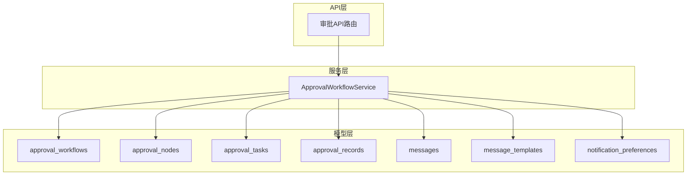
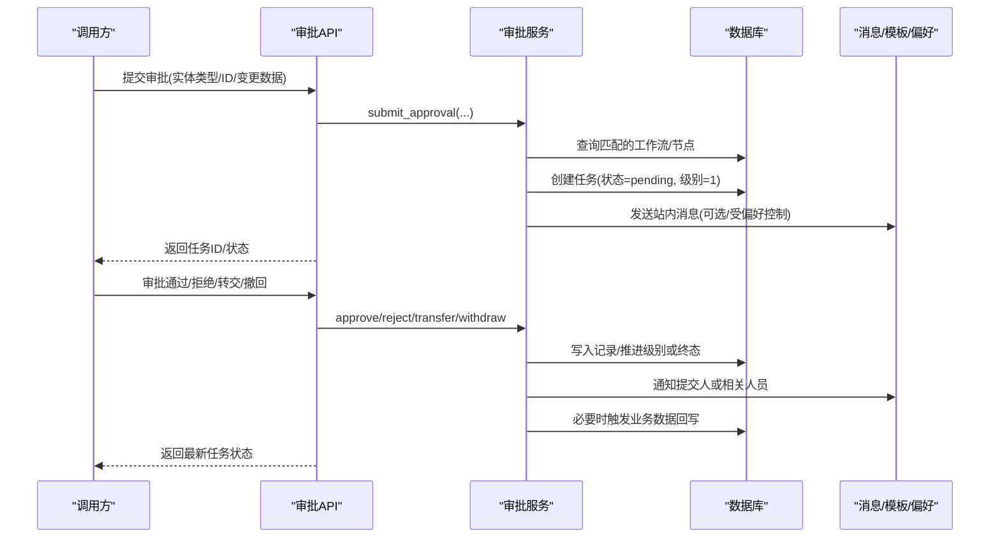
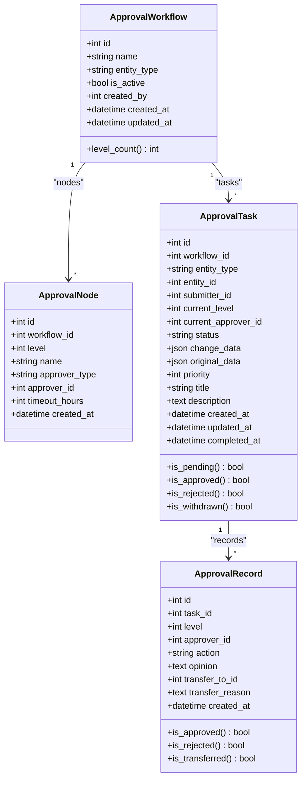
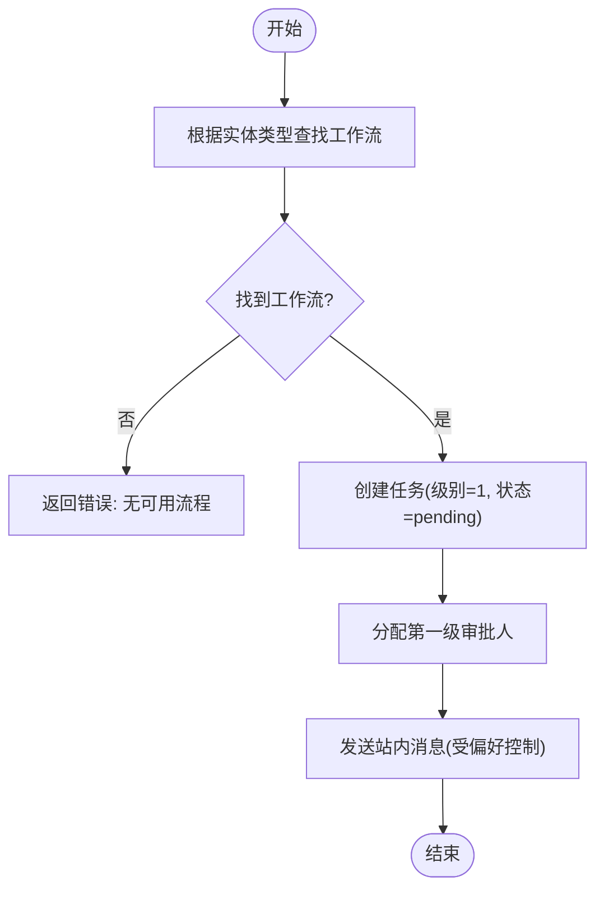
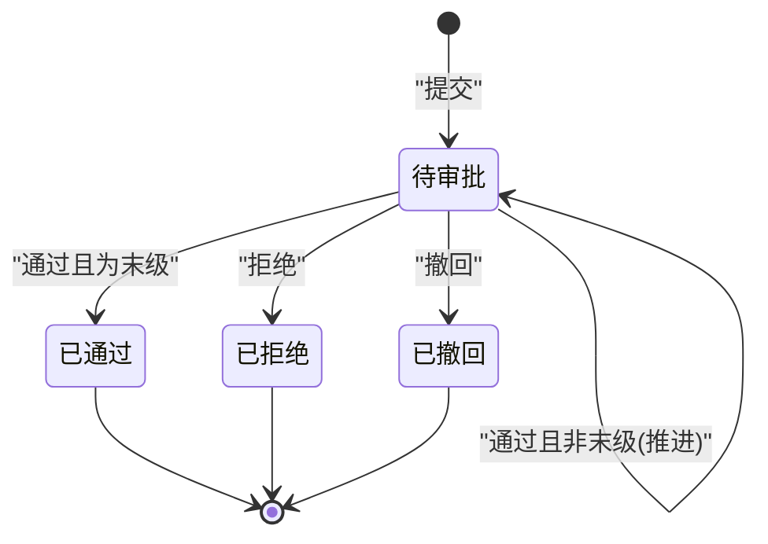
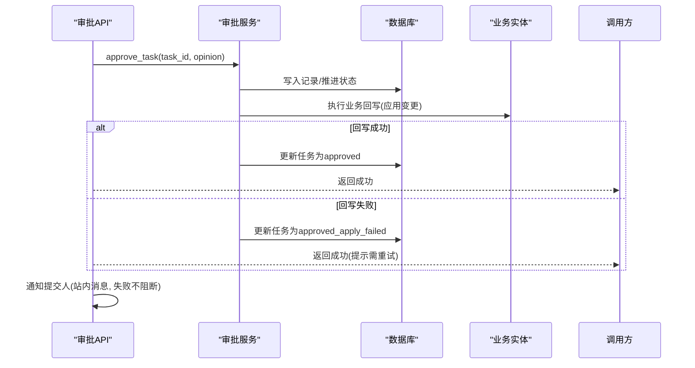
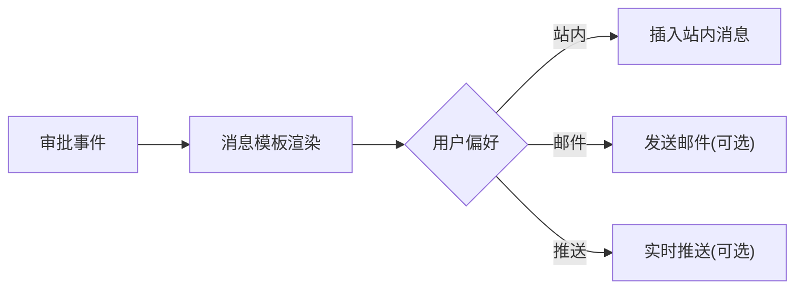
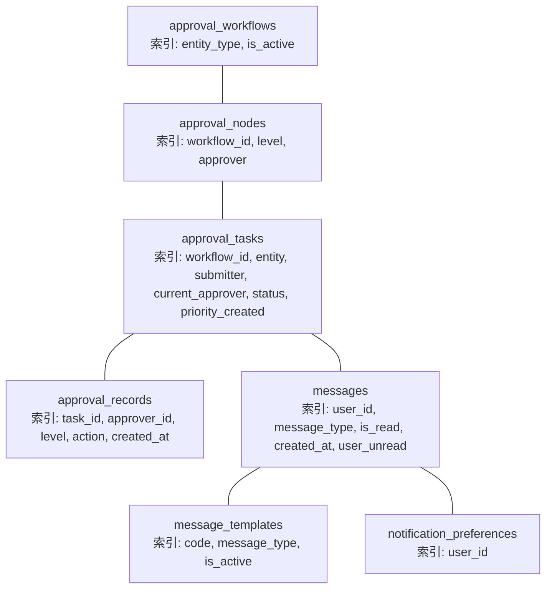

# 审批工作流域表结构

<cite>
**本文引用的文件**
- [backend/app/models/approval.py](file://backend/app/models/approval.py)
- [backend/app/models/message.py](file://backend/app/models/message.py)
- [backend/app/models/message_template.py](file://backend/app/models/message_template.py)
- [backend/app/models/notification_preference.py](file://backend/app/models/notification_preference.py)
- [backend/app/api/v1/approval.py](file://backend/app/api/v1/approval.py)
- [backend/app/services/approval_workflow_service.py](file://backend/app/services/approval_workflow_service.py)
- [backend/app/core/database_indexes.py](file://backend/app/core/database_indexes.py)
- [backend/alembic/versions/fk_ondelete_001_fix_contradictions.py](file://backend/alembic/versions/fk_ondelete_001_fix_contradictions.py)
</cite>

## 目录
1. [简介](#简介)
2. [项目结构](#项目结构)
3. [核心组件](#核心组件)
4. [架构总览](#架构总览)
5. [详细组件分析](#详细组件分析)
6. [依赖关系分析](#依赖关系分析)
7. [性能考虑](#性能考虑)
8. [故障排查指南](#故障排查指南)
9. [结论](#结论)
10. [附录](#附录)

## 简介
本文件围绕“审批工作流”相关四张核心表进行系统化文档化，覆盖：
- 流程模板表 approval_workflows
- 节点配置表 approval_nodes
- 任务表 approval_tasks
- 记录表 approval_records

重点说明多级审批流程的配置机制、审批人分配策略、任务状态流转；解释审批结果写回业务数据的闭环保障（含 approved_apply_failed 异常处理）；并阐述消息通知系统（站内消息、消息模板、通知偏好）。文末提供配置示例与异常处理方案。

## 项目结构
审批能力由模型层、服务层与API层协同实现：
- 模型层：定义审批流程、节点、任务、记录以及消息、模板、通知偏好等数据模型。
- 服务层：封装审批生命周期（提交、通过、拒绝、转交、撤回、重试回写、批量自动审批等）。
- API层：暴露审批管理接口（创建/更新流程、提交审批、审批操作、待办列表、重试回写等）。

图表来源
- [backend/app/models/approval.py:53-291](file://backend/app/models/approval.py#L53-L291)
- [backend/app/models/message.py:34-87](file://backend/app/models/message.py#L34-L87)
- [backend/app/models/message_template.py:14-140](file://backend/app/models/message_template.py#L14-L140)
- [backend/app/models/notification_preference.py:17-132](file://backend/app/models/notification_preference.py#L17-L132)
- [backend/app/services/approval_workflow_service.py:30-700](file://backend/app/services/approval_workflow_service.py#L30-L700)
- [backend/app/api/v1/approval.py:226-800](file://backend/app/api/v1/approval.py#L226-L800)

章节来源
- [backend/app/models/approval.py:53-291](file://backend/app/models/approval.py#L53-L291)
- [backend/app/api/v1/approval.py:226-800](file://backend/app/api/v1/approval.py#L226-L800)

## 核心组件
- 审批流程模板（approval_workflows）：按实体类型定义可复用的多级审批链，支持启用/禁用与元信息。
- 审批节点（approval_nodes）：描述每一级审批的审批人类型（用户/角色）、目标ID、超时时间等。
- 审批任务（approval_tasks）：每次变更请求生成一个任务，跟踪当前级别、当前审批人、状态、变更前后数据等。
- 审批记录（approval_records）：记录每步审批动作（通过/拒绝/转交）、意见、转交原因、时间等。
- 消息与模板（messages/message_templates）：站内消息与模板渲染，支撑审批事件通知。
- 通知偏好（notification_preferences）：用户对邮件/站内/推送三类渠道的通知开关。

章节来源
- [backend/app/models/approval.py:53-291](file://backend/app/models/approval.py#L53-L291)
- [backend/app/models/message.py:34-87](file://backend/app/models/message.py#L34-L87)
- [backend/app/models/message_template.py:14-140](file://backend/app/models/message_template.py#L14-L140)
- [backend/app/models/notification_preference.py:17-132](file://backend/app/models/notification_preference.py#L17-L132)

## 架构总览
审批主流程（提交→流转→完成/拒绝→通知→回写）如下：

图表来源
- [backend/app/api/v1/approval.py:380-513](file://backend/app/api/v1/approval.py#L380-L513)
- [backend/app/services/approval_workflow_service.py:203-700](file://backend/app/services/approval_workflow_service.py#L203-L700)
- [backend/app/models/message.py:34-87](file://backend/app/models/message.py#L34-L87)
- [backend/app/models/message_template.py:14-140](file://backend/app/models/message_template.py#L14-L140)
- [backend/app/models/notification_preference.py:17-132](file://backend/app/models/notification_preference.py#L17-L132)

## 详细组件分析

### 数据模型与关系
- 流程模板（approval_workflows）
  - 关键字段：名称、实体类型、是否启用、创建人、时间戳
  - 关系：一对多关联到节点；一对多关联到任务
- 节点（approval_nodes）
  - 关键字段：级别、名称、审批人类型（user/role）、审批人/角色ID、超时小时
  - 关系：属于某流程
- 任务（approval_tasks）
  - 关键字段：工作流ID、实体类型/ID、提交人、当前级别、当前审批人、状态、变更前后数据、优先级、标题/说明、完成时间
  - 关系：属于某流程；关联提交人与当前审批人；一对多记录
- 记录（approval_records）
  - 关键字段：任务ID、级别、审批人、动作（approve/reject/transfer）、意见、转交目标与原因、时间
  - 关系：属于某任务；关联审批人与转交目标

图表来源
- [backend/app/models/approval.py:53-291](file://backend/app/models/approval.py#L53-L291)

章节来源
- [backend/app/models/approval.py:53-291](file://backend/app/models/approval.py#L53-L291)

### 多级审批流程配置机制
- 流程模板按实体类型划分，便于不同业务对象复用各自审批链。
- 节点按 level 顺序组织，最多支持多级（代码注释表明上限为5级），每个节点可指定审批人类型为用户或角色，并设置超时时间。
- 提交审批时，系统根据实体类型找到对应工作流，按节点顺序创建任务并定位第一级审批人。

图表来源
- [backend/app/api/v1/approval.py:380-413](file://backend/app/api/v1/approval.py#L380-L413)
- [backend/app/services/approval_workflow_service.py:203-300](file://backend/app/services/approval_workflow_service.py#L203-L300)

章节来源
- [backend/app/api/v1/approval.py:380-413](file://backend/app/api/v1/approval.py#L380-L413)
- [backend/app/services/approval_workflow_service.py:203-300](file://backend/app/services/approval_workflow_service.py#L203-L300)

### 审批人分配策略
- 节点定义审批人类型：
  - user：直接指定具体用户ID作为审批人
  - role：以角色维度解析（由服务层在运行时解析为具体用户）
- 任务维护 current_approver_id 指向当前待处理审批人，便于待办展示与权限校验。
- 支持转交：将当前任务转交给其他用户，并在记录中保留转交原因。

章节来源
- [backend/app/models/approval.py:101-136](file://backend/app/models/approval.py#L101-L136)
- [backend/app/models/approval.py:138-223](file://backend/app/models/approval.py#L138-L223)
- [backend/app/api/v1/approval.py:515-545](file://backend/app/api/v1/approval.py#L515-L545)

### 任务状态流转
- 初始状态：pending（待审批）
- 通过：若达到最后一级则进入 approved；否则推进到下一级继续 pending
- 拒绝：进入 rejected，终止流程
- 撤回：进入 withdrawn，终止流程
- 转交：保持 pending，仅变更当前审批人

图表来源
- [backend/app/models/approval.py:36-51](file://backend/app/models/approval.py#L36-L51)
- [backend/app/models/approval.py:138-223](file://backend/app/models/approval.py#L138-L223)
- [backend/app/api/v1/approval.py:416-513](file://backend/app/api/v1/approval.py#L416-L513)

章节来源
- [backend/app/models/approval.py:36-51](file://backend/app/models/approval.py#L36-L51)
- [backend/app/api/v1/approval.py:416-513](file://backend/app/api/v1/approval.py#L416-L513)

### 审批结果写回业务数据的闭环保障
- 设计要点：
  - 审批通过后，服务层应执行业务实体的数据回写，确保“审批通过即生效”。
  - 若回写失败，需将任务标记为异常终态（如 approved_apply_failed），以便后续重试修复。
  - 提供管理员重试接口，对异常任务重新执行回写，消除“审批成功但业务状态未变”的不一致。
- 关键路径：
  - 审批通过/拒绝后，API 层会尝试通知提交人（站内消息），消息落库失败不阻断审批主流程。
  - 提供 /approval/tasks/{id}/retry-apply 接口用于管理员手动重试回写，并记录工作日志。

图表来源
- [backend/app/api/v1/approval.py:416-513](file://backend/app/api/v1/approval.py#L416-L513)
- [backend/app/services/approval_workflow_service.py:447-700](file://backend/app/services/approval_workflow_service.py#L447-L700)

章节来源
- [backend/app/api/v1/approval.py:416-513](file://backend/app/api/v1/approval.py#L416-L513)
- [backend/app/services/approval_workflow_service.py:447-700](file://backend/app/services/approval_workflow_service.py#L447-L700)

### 消息通知系统设计
- 站内消息（messages）
  - 字段包含接收用户、消息类型（system/approval/task/backup）、标题、内容、链接、是否已读、创建/阅读时间。
  - 审批结果通知在API层统一封装，失败不阻断主流程。
- 消息模板（message_templates）
  - 预置审批相关模板编码（如 approval_submitted/approval_approved/approval_rejected 等）。
  - 支持标题/内容/邮件主题/邮件正文模板渲染，具备变量占位符能力。
- 通知偏好（notification_preferences）
  - 针对每种消息类型，分别控制邮件、站内、推送三类渠道的开关。
  - 提供便捷方法判断是否应发送某类通知。

图表来源
- [backend/app/models/message.py:34-87](file://backend/app/models/message.py#L34-L87)
- [backend/app/models/message_template.py:14-140](file://backend/app/models/message_template.py#L14-L140)
- [backend/app/models/notification_preference.py:17-132](file://backend/app/models/notification_preference.py#L17-L132)
- [backend/app/api/v1/approval.py:65-84](file://backend/app/api/v1/approval.py#L65-L84)

章节来源
- [backend/app/models/message.py:34-87](file://backend/app/models/message.py#L34-L87)
- [backend/app/models/message_template.py:14-140](file://backend/app/models/message_template.py#L14-L140)
- [backend/app/models/notification_preference.py:17-132](file://backend/app/models/notification_preference.py#L17-L132)
- [backend/app/api/v1/approval.py:65-84](file://backend/app/api/v1/approval.py#L65-L84)

### 审批流程配置示例
- 场景：经费申请（entity_type=fund）
  - 流程模板：名称“经费审批”，实体类型“fund”，启用
  - 节点1：部门主管（approver_type=user，approver_id=部门主管ID）
  - 节点2：财务审核（approver_type=role，approver_id=财务角色ID）
  - 节点3：分管领导（approver_type=user，approver_id=分管领导ID）
- 提交审批：携带实体ID、变更数据、标题/说明、优先级
- 审批流转：逐级审批，任一拒绝即终止；全部通过则回写业务数据

章节来源
- [backend/app/models/approval.py:53-136](file://backend/app/models/approval.py#L53-L136)
- [backend/app/api/v1/approval.py:226-413](file://backend/app/api/v1/approval.py#L226-L413)

### 异常处理方案
- 消息通知失败：API层捕获异常并记录日志，不阻断审批主流程。
- 业务回写失败：将任务标记为 approved_apply_failed，并提供管理员重试接口。
- 权限校验：驳回必须填写原因；自动审批/批量审批仅限管理员。
- 数据一致性：重试回写成功后记录工作日志，便于审计追踪。

章节来源
- [backend/app/api/v1/approval.py:65-84](file://backend/app/api/v1/approval.py#L65-L84)
- [backend/app/api/v1/approval.py:486-513](file://backend/app/api/v1/approval.py#L486-L513)
- [backend/app/api/v1/approval.py:627-717](file://backend/app/api/v1/approval.py#L627-L717)

## 依赖关系分析
- 索引优化：为常用查询列建立索引，提升待办列表、任务筛选、记录查询效率。
- 外键约束：审批记录中的审批人字段允许为空（用户删除后置空），保证留痕完整性。

图表来源
- [backend/app/core/database_indexes.py:23-33](file://backend/app/core/database_indexes.py#L23-L33)
- [backend/app/models/approval.py:87-90](file://backend/app/models/approval.py#L87-L90)
- [backend/app/models/approval.py:128-132](file://backend/app/models/approval.py#L128-L132)
- [backend/app/models/approval.py:192-199](file://backend/app/models/approval.py#L192-L199)
- [backend/app/models/approval.py:261-267](file://backend/app/models/approval.py#L261-L267)
- [backend/app/models/message.py:61-68](file://backend/app/models/message.py#L61-L68)
- [backend/app/models/message_template.py:43-47](file://backend/app/models/message_template.py#L43-L47)
- [backend/app/models/notification_preference.py:57](file://backend/app/models/notification_preference.py#L57)

章节来源
- [backend/app/core/database_indexes.py:23-33](file://backend/app/core/database_indexes.py#L23-L33)
- [backend/alembic/versions/fk_ondelete_001_fix_contradictions.py:57-70](file://backend/alembic/versions/fk_ondelete_001_fix_contradictions.py#L57-L70)

## 性能考虑
- 使用复合索引加速常见查询：
  - 待办列表：按状态、优先级、创建时间排序
  - 任务检索：按实体类型+实体ID快速定位
  - 记录查询：按任务ID、级别、动作、时间范围
- 消息查询：按用户+是否已读+创建时间组合索引，提升未读数统计与列表加载速度。
- 避免在审批主流程中进行重型计算，必要时异步化或批量化处理。

章节来源
- [backend/app/core/database_indexes.py:23-33](file://backend/app/core/database_indexes.py#L23-L33)
- [backend/app/models/message.py:61-68](file://backend/app/models/message.py#L61-L68)

## 故障排查指南
- 无法创建审批任务
  - 检查是否存在匹配的审批流程（实体类型与工作流一致）
  - 参考提交接口返回的错误信息
- 无权限审批/拒绝
  - 确认当前用户是否为任务的当前审批人或管理员
  - 单机版优化允许当前用户直接审批/拒绝
- 驳回失败
  - 必须填写原因（后端强制校验）
- 业务回写失败
  - 查看任务状态是否为 approved_apply_failed
  - 使用管理员重试接口重新执行回写，并检查工作日志
- 消息未送达
  - 检查用户通知偏好是否关闭了相应渠道
  - 消息写入失败不会阻断审批，可在消息中心查看

章节来源
- [backend/app/api/v1/approval.py:380-513](file://backend/app/api/v1/approval.py#L380-L513)
- [backend/app/api/v1/approval.py:627-717](file://backend/app/api/v1/approval.py#L627-L717)
- [backend/app/models/notification_preference.py:62-111](file://backend/app/models/notification_preference.py#L62-L111)

## 结论
本审批工作流体系通过“流程模板+节点配置+任务驱动+记录留痕”的设计，实现了灵活的多级审批与严格的闭环保障。配合消息模板与通知偏好，形成完整的审批通知链路；通过异常终态与重试机制，确保业务数据最终一致。建议在生产环境结合索引优化与监控告警，进一步提升稳定性与可观测性。

## 附录
- 常用接口速览（基于API路由）
  - 提交审批：POST /approval/submit
  - 审批通过：POST /approval/tasks/{id}/approve
  - 审批拒绝：POST /approval/tasks/{id}/reject
  - 转交审批：POST /approval/tasks/{id}/transfer
  - 撤回申请：POST /approval/tasks/{id}/withdraw
  - 重试回写：POST /approval/tasks/{id}/retry-apply
  - 自动审批（单机版）：POST /approval/submit-auto、/approval/tasks/{id}/auto-approve、/approval/tasks/auto-approve-all

章节来源
- [backend/app/api/v1/approval.py:226-800](file://backend/app/api/v1/approval.py#L226-L800)