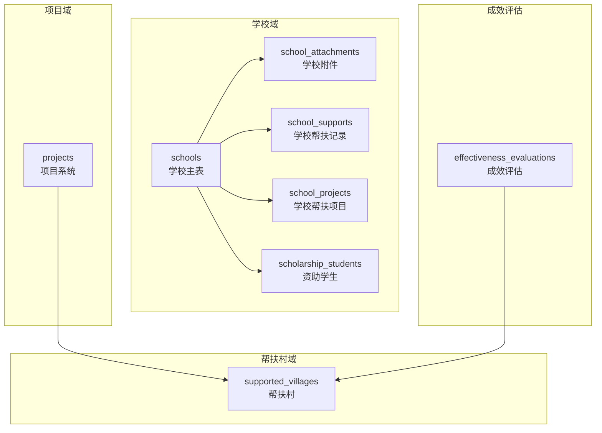
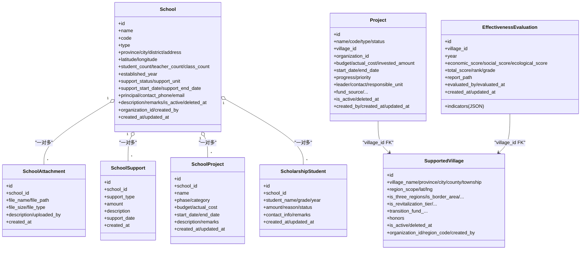
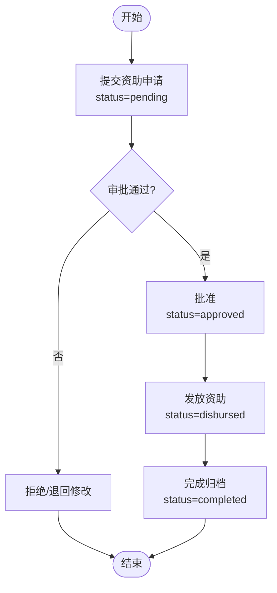
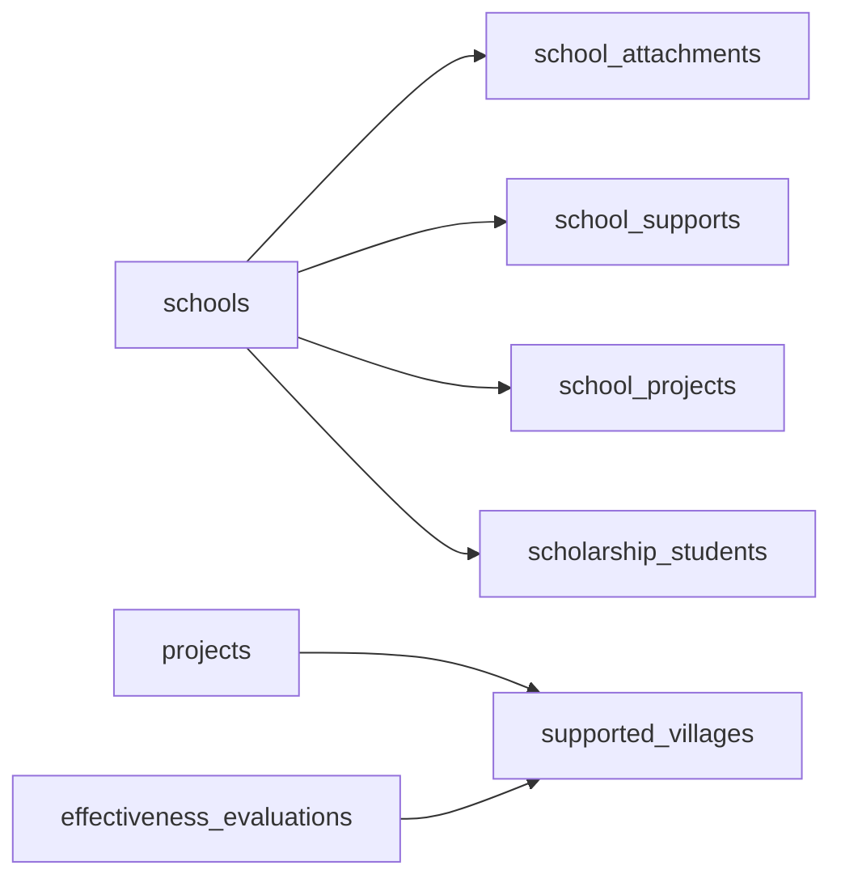

# 学校帮扶表结构

<cite>
**本文引用的文件**
- [backend/app/models/school.py](file://backend/app/models/school.py)
- [backend/app/schemas/school.py](file://backend/app/schemas/school.py)
- [backend/app/api/v1/school.py](file://backend/app/api/v1/school.py)
- [backend/app/models/project.py](file://backend/app/models/project.py)
- [backend/app/models/supported_village.py](file://backend/app/models/supported_village.py)
- [backend/app/models/effectiveness.py](file://backend/app/models/effectiveness.py)
- [backend/alembic/versions/b5c9d3e7f1a2_add_organization_id_created_by_to_schools.py](file://backend/alembic/versions/b5c9d3e7f1a2_add_organization_id_created_by_to_schools.py)
</cite>

## 目录
1. [简介](#简介)
2. [项目结构](#项目结构)
3. [核心组件](#核心组件)
4. [架构总览](#架构总览)
5. [详细组件分析](#详细组件分析)
6. [依赖关系分析](#依赖关系分析)
7. [性能考虑](#性能考虑)
8. [故障排查指南](#故障排查指南)
9. [结论](#结论)
10. [附录](#附录)

## 简介
本文件围绕“学校帮扶”业务，系统化梳理学校主表及关联表的数据结构设计、字段含义与约束、数据流转与集成点，并解释“学校帮扶线”与“帮扶村线”的差异，说明学校作为帮扶对象的特点。同时给出学校数据与项目系统的集成设计、资助学生全生命周期管理以及帮扶成效评估所需的数据支撑结构，便于开发、测试与运维人员快速理解与扩展。

## 项目结构
与学校帮扶相关的核心代码集中在后端模型层与API层：
- 模型定义：school.py（学校主表、附件、帮扶记录、项目、奖学金学生）、project.py（项目系统）、supported_village.py（帮扶村体系）、effectiveness.py（成效评估）
- 接口与校验：api/v1/school.py（学校相关API）、schemas/school.py（请求/响应Schema）
- 迁移脚本：b5c9d3e7f1a2...（为学校表增加组织与创建人字段）

图表来源
- [backend/app/models/school.py:43-124](file://backend/app/models/school.py#L43-L124)
- [backend/app/models/school.py:181-218](file://backend/app/models/school.py#L181-L218)
- [backend/app/models/school.py:220-244](file://backend/app/models/school.py#L220-L244)
- [backend/app/models/school.py:256-311](file://backend/app/models/school.py#L256-L311)
- [backend/app/models/school.py:322-375](file://backend/app/models/school.py#L322-L375)
- [backend/app/models/project.py:47-175](file://backend/app/models/project.py#L47-L175)
- [backend/app/models/supported_village.py:42-128](file://backend/app/models/supported_village.py#L42-L128)
- [backend/app/models/effectiveness.py:20-53](file://backend/app/models/effectiveness.py#L20-L53)

章节来源
- [backend/app/models/school.py:43-124](file://backend/app/models/school.py#L43-L124)
- [backend/app/models/project.py:47-175](file://backend/app/models/project.py#L47-L175)
- [backend/app/models/supported_village.py:42-128](file://backend/app/models/supported_village.py#L42-L128)
- [backend/app/models/effectiveness.py:20-53](file://backend/app/models/effectiveness.py#L20-L53)

## 核心组件
- 学校主表 schools：承载学校基本信息、地理位置、办学规模、师资力量、帮扶状态与联系人等，支持软删除与组织隔离。
- 学校附件 school_attachments：存储学校电子资料，按学校ID关联，支持文件元信息。
- 学校帮扶记录 school_supports：记录对学校的帮扶事件（类型、金额、日期等）。
- 学校帮扶项目 school_projects：助学兴教类项目，含阶段、预算、实际投入、起止时间等。
- 资助学生 scholarship_students：记录受助学生、年度、金额、原因、状态等，贯穿资助全生命周期。
- 项目系统 projects：面向帮扶村的通用项目模型，通过 village_id 指向 supported_villages.id，形成“项目—帮扶村”主线。
- 帮扶村 supported_villages：帮扶村主体，承载区域标记、振兴梯队、经费汇总等，是项目系统与成效评估的锚点。
- 成效评估 effectiveness_evaluations：针对帮扶村的年度评估指标与得分，用于成效分析与对比。

章节来源
- [backend/app/models/school.py:43-124](file://backend/app/models/school.py#L43-L124)
- [backend/app/models/school.py:181-218](file://backend/app/models/school.py#L181-L218)
- [backend/app/models/school.py:220-244](file://backend/app/models/school.py#L220-L244)
- [backend/app/models/school.py:256-311](file://backend/app/models/school.py#L256-L311)
- [backend/app/models/school.py:322-375](file://backend/app/models/school.py#L322-L375)
- [backend/app/models/project.py:47-175](file://backend/app/models/project.py#L47-L175)
- [backend/app/models/supported_village.py:42-128](file://backend/app/models/supported_village.py#L42-L128)
- [backend/app/models/effectiveness.py:20-53](file://backend/app/models/effectiveness.py#L20-L53)

## 架构总览
学校域以 schools 为中心，向外辐射出附件、帮扶记录、项目与学生资助；项目域以 projects 为核心，绑定到帮扶村 supported_villages；成效评估以 supported_villages 为维度进行年度打分与排名。学校与项目之间通过 school_projects 建立直接关联，而项目与帮扶村之间通过 projects.village_id 指向 supported_villages.id。

图表来源
- [backend/app/models/school.py:43-124](file://backend/app/models/school.py#L43-L124)
- [backend/app/models/school.py:181-218](file://backend/app/models/school.py#L181-L218)
- [backend/app/models/school.py:220-244](file://backend/app/models/school.py#L220-L244)
- [backend/app/models/school.py:256-311](file://backend/app/models/school.py#L256-L311)
- [backend/app/models/school.py:322-375](file://backend/app/models/school.py#L322-L375)
- [backend/app/models/project.py:47-175](file://backend/app/models/project.py#L47-L175)
- [backend/app/models/supported_village.py:42-128](file://backend/app/models/supported_village.py#L42-L128)
- [backend/app/models/effectiveness.py:20-53](file://backend/app/models/effectiveness.py#L20-L53)

## 详细组件分析

### 学校主表 schools
- 基本信息：名称、编码、类型（小学/初中/高中/职校/其他）、级别（省/市/县/乡镇/其他）、建校年份。
- 地理位置：省市区、详细地址、经纬度，便于地图展示与地理统计。
- 办学规模与师资：学生人数、教师人数、班级数量。
- 帮扶信息：帮扶状态（未帮扶/帮扶中/已完成）、帮扶单位、帮扶起止时间。
- 联系信息：校长、联系电话（透明加密）、邮箱。
- 其他：简介、备注、是否启用、软删时间。
- 数据权限：所属组织ID、创建者ID，配合数据范围控制。
- 索引：名称、类型、帮扶状态、区县、是否启用、帮扶单位等常用查询列。

章节来源
- [backend/app/models/school.py:43-124](file://backend/app/models/school.py#L43-L124)
- [backend/alembic/versions/b5c9d3e7f1a2_add_organization_id_created_by_to_schools.py](file://backend/alembic/versions/b5c9d3e7f1a2_add_organization_id_created_by_to_schools.py)

### 学校附件表 school_attachments
- 作用：存储学校电子资料（如资质、报告、图片等），按学校ID关联。
- 关键字段：原始文件名、存储路径、文件大小、MIME类型、描述、上传人、上传时间。
- 约束：外键级联删除，保证数据一致性；按 school_id 建索引提升查询效率。

章节来源
- [backend/app/models/school.py:181-218](file://backend/app/models/school.py#L181-L218)

### 学校帮扶记录表 school_supports
- 作用：记录对学校的帮扶事件，便于统计帮扶类型分布与累计金额。
- 关键字段：帮扶类型、金额、描述、帮扶日期、创建时间。
- 索引：school_id、support_date、support_type，优化按学校、时间、类型的聚合查询。

章节来源
- [backend/app/models/school.py:220-244](file://backend/app/models/school.py#L220-L244)

### 学校帮扶项目表 school_projects
- 作用：助学兴教类项目的全生命周期管理，包括调研、立项、实施、验收、完成。
- 关键字段：项目名称、阶段、类别、预算与实际投入（万元）、起止时间、描述与备注。
- 索引：school_id、phase，支持按学校与阶段筛选。

章节来源
- [backend/app/models/school.py:256-311](file://backend/app/models/school.py#L256-L311)

### 资助学生表 scholarship_students
- 作用：资助学生的全生命周期管理，从申请审批到发放完成。
- 关键字段：学生姓名、年级、资助年度、金额、原因、联系方式、备注。
- 状态机：待审批→已批准→已发放→已完成。
- 索引：school_id、year，支持按学校与年度统计。

章节来源
- [backend/app/models/school.py:322-375](file://backend/app/models/school.py#L322-L375)

### 项目系统与学校项目的集成
- 项目系统 projects 以帮扶村为主线，village_id 指向 supported_villages.id，用于跟踪帮扶村的项目进度、资金与成果。
- 学校项目 school_projects 聚焦学校维度的助学兴教项目，与 projects 并行存在，服务于不同业务视角。
- 集成建议：
  - 当项目涉及学校时，优先使用 school_projects；当项目涉及村庄基础设施或产业时，使用 projects。
  - 若需跨域统计，可通过学校所在区域与帮扶村区域进行地理或行政关联，或在应用层建立映射。

章节来源
- [backend/app/models/project.py:47-175](file://backend/app/models/project.py#L47-L175)
- [backend/app/models/school.py:256-311](file://backend/app/models/school.py#L256-L311)

### 学校帮扶线与帮扶村线的区别
- 学校帮扶线：以 schools 为中心，关注学校基本信息、资源与需求，通过 school_supports 记录帮扶事件，通过 school_projects 管理助学项目，通过 scholarship_students 管理资助学生。
- 帮扶村线：以 supported_villages 为中心，关注村庄人口、收入、产业、基建、党建、医疗、消费、就业等多维数据，并通过 projects 与 effectiveness_evaluations 进行项目跟踪与成效评估。
- 差异要点：
  - 目标对象不同：学校 vs 村庄。
  - 数据维度不同：学校侧重教育、师资、学生资助；村庄侧重经济、民生、产业与基建。
  - 项目载体不同：school_projects 专用于学校；projects 专用于帮扶村。
  - 成效评估：effectiveness_evaluations 仅绑定到帮扶村，学校侧暂无同构评估表。

章节来源
- [backend/app/models/school.py:43-124](file://backend/app/models/school.py#L43-L124)
- [backend/app/models/supported_village.py:42-128](file://backend/app/models/supported_village.py#L42-L128)
- [backend/app/models/project.py:47-175](file://backend/app/models/project.py#L47-L175)
- [backend/app/models/effectiveness.py:20-53](file://backend/app/models/effectiveness.py#L20-L53)

### 学校作为帮扶对象的特点
- 可独立建档：具备完整的基本信息、地理位置、规模与师资，便于精准识别帮扶需求。
- 可被多次帮扶：通过 school_supports 记录多次帮扶事件，支持按类型与时间统计。
- 可承接项目：通过 school_projects 管理助学兴教项目，覆盖从调研到验收的全流程。
- 可资助学生：通过 scholarship_students 实现从申请到发放的闭环管理。
- 可软删除与权限隔离：is_active 与 deleted_at 支持回收站机制；organization_id 与 created_by 支持组织级数据权限。

章节来源
- [backend/app/models/school.py:43-124](file://backend/app/models/school.py#L43-L124)
- [backend/app/models/school.py:220-244](file://backend/app/models/school.py#L220-L244)
- [backend/app/models/school.py:256-311](file://backend/app/models/school.py#L256-L311)
- [backend/app/models/school.py:322-375](file://backend/app/models/school.py#L322-L375)

### 学校数据与项目系统的集成设计
- 数据边界清晰：学校域与项目域各自维护核心实体，避免耦合过深。
- 交叉场景处理：
  - 若项目同时涉及学校与村庄，可在应用层建立关联视图或中间表，或在报表层进行联合统计。
  - 对于纯学校项目，使用 school_projects；对于纯村庄项目，使用 projects。
- 统一时间轴：所有实体均包含 created_at/updated_at，便于审计与趋势分析。

章节来源
- [backend/app/models/school.py:256-311](file://backend/app/models/school.py#L256-L311)
- [backend/app/models/project.py:47-175](file://backend/app/models/project.py#L47-L175)

### 学校资助学生的全生命周期管理
- 申请与审批：status 初始为 pending，经审批后转为 approved。
- 发放执行：approved 后进入 disbursed，记录发放时间与凭证（可在 remarks 或扩展字段中体现）。
- 完成归档：disbursed 后转为 completed，形成闭环。
- 统计与分析：按 school_id 与 year 聚合，支持年度资助人数、金额、类型分布等报表。

图表来源
- [backend/app/models/school.py:322-375](file://backend/app/models/school.py#L322-L375)

### 学校帮扶成效评估的数据支撑结构
- 当前成效评估表 effectiveness_evaluations 绑定到帮扶村（village_id），用于年度指标评分与排名。
- 学校侧暂无同构评估表，但可基于现有数据构建衍生指标：
  - 学校维度：累计资助学生数、累计资助金额、项目完成率、帮扶事件频次与类型分布。
  - 项目维度：school_projects 的预算与实际投入对比、阶段推进情况。
  - 帮扶记录维度：school_supports 的金额与类型统计。
- 建议：如需学校维度的标准化评估，可新增 school_effectiveness_evaluations 表，结构与 effectiveness_evaluations 对齐，以支持横向对比。

章节来源
- [backend/app/models/effectiveness.py:20-53](file://backend/app/models/effectiveness.py#L20-L53)
- [backend/app/models/school.py:220-244](file://backend/app/models/school.py#L220-L244)
- [backend/app/models/school.py:256-311](file://backend/app/models/school.py#L256-L311)
- [backend/app/models/school.py:322-375](file://backend/app/models/school.py#L322-L375)

## 依赖关系分析
- 外键约束：
  - school_attachments.school_id → schools.id（级联删除）
  - school_supports.school_id → schools.id（级联删除）
  - school_projects.school_id → schools.id（级联删除）
  - scholarship_students.school_id → schools.id（级联删除）
  - projects.village_id → supported_villages.id（级联删除）
  - effectiveness_evaluations.village_id → supported_villages.id（级联删除）
- 索引策略：
  - 学校主表：名称、类型、帮扶状态、区县、是否启用、帮扶单位
  - 附件/帮扶/项目/学生：school_id 索引
  - 帮扶记录：support_date、support_type 索引
  - 项目：status、type、village_id、organization_id、时间列等复合索引
  - 成效评估：village_id、year 索引

图表来源
- [backend/app/models/school.py:43-124](file://backend/app/models/school.py#L43-L124)
- [backend/app/models/school.py:181-218](file://backend/app/models/school.py#L181-L218)
- [backend/app/models/school.py:220-244](file://backend/app/models/school.py#L220-L244)
- [backend/app/models/school.py:256-311](file://backend/app/models/school.py#L256-L311)
- [backend/app/models/school.py:322-375](file://backend/app/models/school.py#L322-L375)
- [backend/app/models/project.py:47-175](file://backend/app/models/project.py#L47-L175)
- [backend/app/models/supported_village.py:42-128](file://backend/app/models/supported_village.py#L42-L128)
- [backend/app/models/effectiveness.py:20-53](file://backend/app/models/effectiveness.py#L20-L53)

章节来源
- [backend/app/models/school.py:43-124](file://backend/app/models/school.py#L43-L124)
- [backend/app/models/project.py:47-175](file://backend/app/models/project.py#L47-L175)
- [backend/app/models/supported_village.py:42-128](file://backend/app/models/supported_village.py#L42-L128)
- [backend/app/models/effectiveness.py:20-53](file://backend/app/models/effectiveness.py#L20-L53)

## 性能考虑
- 索引优化：
  - 高频查询列（如 school_id、support_date、phase、year）均已建索引，确保列表与统计接口响应迅速。
  - 项目表复合索引覆盖常见过滤组合（状态+类型、状态+时间、村庄+状态等）。
- 软删除与过滤：
  - is_active 与 deleted_at 在列表查询中默认过滤已删除数据，减少无效结果集。
- 数据权限：
  - organization_id 与 created_by 结合数据范围适配器，避免越权查询导致的性能损耗。
- 大字段与加密：
  - 敏感字段（如联系电话、身份证号）采用透明加密，读写开销可控；避免在列表页返回过大文本字段。

[本节为通用性能指导，不直接分析具体文件]

## 故障排查指南
- 常见问题定位：
  - 学校列表为空：检查 is_active 与 deleted_at 过滤条件；确认 organization_id 数据权限。
  - 附件无法访问：核对 file_path 与存储路径映射；检查 school_id 是否存在。
  - 帮扶记录统计异常：确认 support_date 与 support_type 索引命中；检查 amount 是否为空。
  - 资助学生状态卡死：核查 status 流转逻辑，确保审批与发放流程正确更新。
  - 项目与村庄关联错误：确认 projects.village_id 指向 supported_villages.id，而非 villages.id。
- 日志与审计：
  - 利用 created_at/updated_at 与审计日志追踪变更；必要时导出变更记录进行回溯。

章节来源
- [backend/app/models/school.py:43-124](file://backend/app/models/school.py#L43-L124)
- [backend/app/models/project.py:47-175](file://backend/app/models/project.py#L47-L175)
- [backend/app/models/school.py:220-244](file://backend/app/models/school.py#L220-L244)
- [backend/app/models/school.py:322-375](file://backend/app/models/school.py#L322-L375)

## 结论
学校帮扶表结构以 schools 为核心，围绕附件、帮扶记录、项目与学生资助形成完整的数据闭环；项目系统与帮扶村线保持解耦，职责清晰。通过合理的索引与软删除策略，系统在性能与可维护性上达到平衡。未来如需在学校侧引入标准化成效评估，可参考帮扶村评估表结构扩展，以实现更全面的帮扶成效度量。

[本节为总结性内容，不直接分析具体文件]

## 附录
- API 与 Schema：
  - 学校相关接口位于 api/v1/school.py，请求/响应校验在 schemas/school.py。
  - 资助学生导入与列表接口支持批量操作与分页查询。
- 迁移脚本：
  - b5c9d3e7f1a2... 为学校表增加组织与创建人字段，完善数据权限基础。

章节来源
- [backend/app/api/v1/school.py:127-181](file://backend/app/api/v1/school.py#L127-L181)
- [backend/app/api/v1/school.py:334-334](file://backend/app/api/v1/school.py#L334-L334)
- [backend/app/api/v1/school.py:1041-1053](file://backend/app/api/v1/school.py#L1041-L1053)
- [backend/app/api/v1/school.py:1208-1208](file://backend/app/api/v1/school.py#L1208-L1208)
- [backend/app/api/v1/school.py:1335-1335](file://backend/app/api/v1/school.py#L1335-L1335)
- [backend/app/schemas/school.py:11-89](file://backend/app/schemas/school.py#L11-L89)
- [backend/alembic/versions/b5c9d3e7f1a2_add_organization_id_created_by_to_schools.py](file://backend/alembic/versions/b5c9d3e7f1a2_add_organization_id_created_by_to_schools.py)