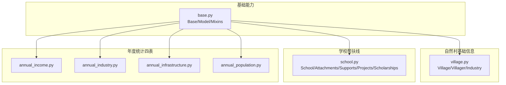
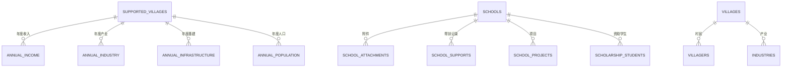
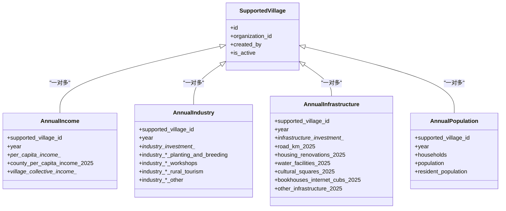
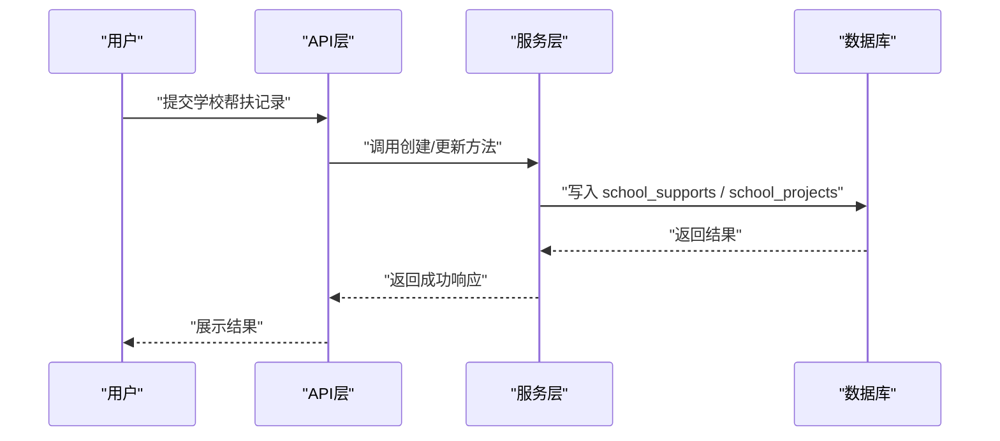
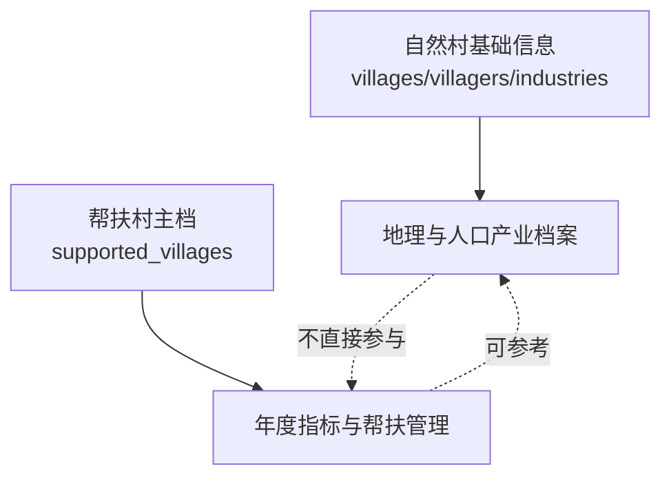
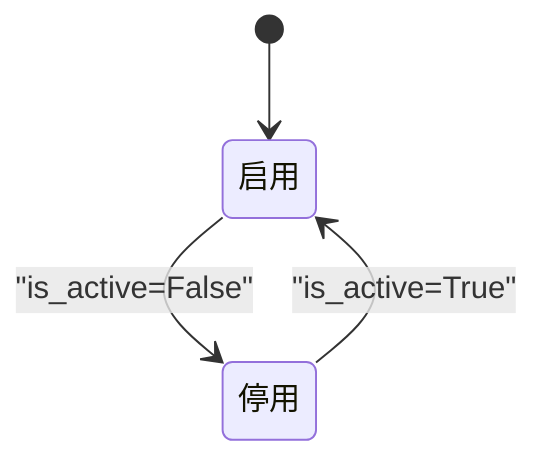
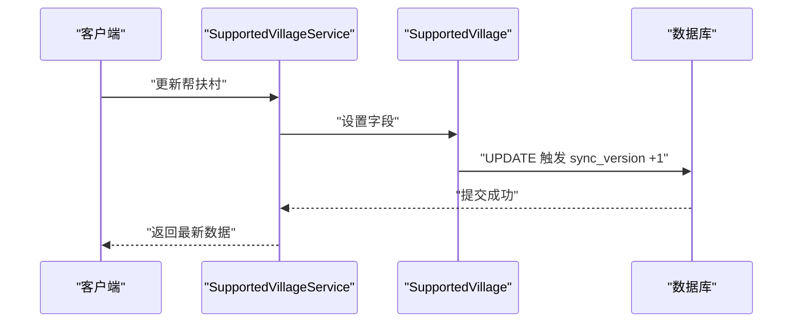
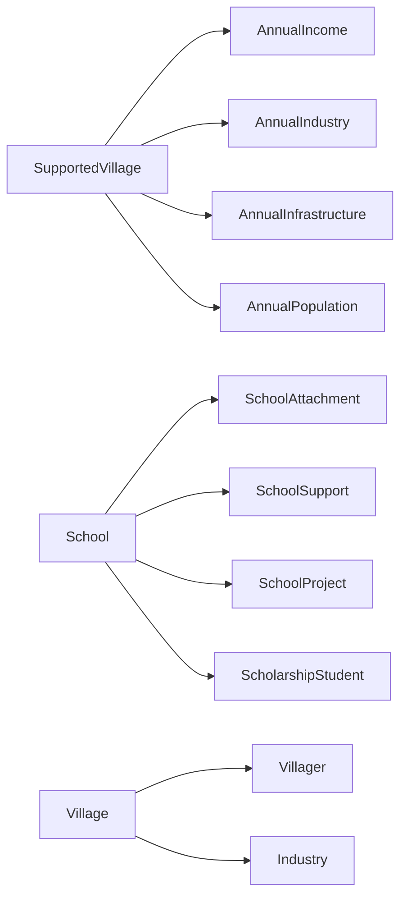

# 帮扶对象与区域域表结构

<cite>
**本文引用的文件**
- [backend/app/models/base.py](file://backend/app/models/base.py)
- [backend/app/models/village.py](file://backend/app/models/village.py)
- [backend/app/models/school.py](file://backend/app/models/school.py)
- [backend/app/models/annual_income.py](file://backend/app/models/annual_income.py)
- [backend/app/models/annual_industry.py](file://backend/app/models/annual_industry.py)
- [backend/app/models/annual_infrastructure.py](file://backend/app/models/annual_infrastructure.py)
- [backend/app/models/annual_population.py](file://backend/app/models/annual_population.py)
- [backend/app/models/__init__.py](file://backend/app/models/__init__.py)
- [backend/app/services/supported_village_service.py](file://backend/app/services/supported_village_service.py)
- [backend/alembic/versions/village_softdel_001_add_is_active.py](file://backend/alembic/versions/village_softdel_001_add_is_active.py)
</cite>

## 目录
1. [简介](#简介)
2. [项目结构](#项目结构)
3. [核心组件](#核心组件)
4. [架构总览](#架构总览)
5. [详细组件分析](#详细组件分析)
6. [依赖关系分析](#依赖关系分析)
7. [性能考虑](#性能考虑)
8. [故障排查指南](#故障排查指南)
9. [结论](#结论)
10. [附录](#附录)

## 简介
本文件面向“帮扶对象与区域域”数据模型，系统性说明：
- 帮扶村主档表 supported_villages 及其年度板块子表（人口、收入、产业、基础设施等）的关联设计；
- 学校帮扶线五张表（schools、school_attachments、school_supports、school_projects、scholarship_students）的设计要点；
- 自然村基础信息（villages、villagers、industries 等）与帮扶村的边界与区别；
- 年度统计四表的数据结构设计；
- 地理信息存储、软删除实现、数据完整性约束；
- 帮扶对象生命周期管理与数据同步机制。

## 项目结构
与本文相关的代码主要位于后端 models 层，按主题分文件组织：
- 基础能力：base.py 提供 Base、BaseModel、TimestampMixin、SoftDeleteMixin、EncryptedText 等通用能力；
- 自然村基础信息：village.py 定义 villages、villagers、industries；
- 学校帮扶线：school.py 定义 schools、school_attachments、school_supports、school_projects、scholarship_students；
- 年度统计四表：annual_income.py、annual_industry.py、annual_infrastructure.py、annual_population.py；
- 模型懒加载注册：models/__init__.py 集中声明各模块导出；
- 服务层：supported_village_service.py 提供帮扶村 CRUD 示例；
- 迁移脚本：village_softdel_001_add_is_active.py 为帮扶村增加 is_active 软删字段。

**图表来源**
- [backend/app/models/base.py:158-185](file://backend/app/models/base.py#L158-L185)
- [backend/app/models/village.py:14-130](file://backend/app/models/village.py#L14-L130)
- [backend/app/models/school.py:43-375](file://backend/app/models/school.py#L43-L375)
- [backend/app/models/annual_income.py:10-49](file://backend/app/models/annual_income.py#L10-L49)
- [backend/app/models/annual_industry.py:10-41](file://backend/app/models/annual_industry.py#L10-L41)
- [backend/app/models/annual_infrastructure.py:18-51](file://backend/app/models/annual_infrastructure.py#L18-L51)
- [backend/app/models/annual_population.py:10-37](file://backend/app/models/annual_population.py#L10-L37)

**章节来源**
- [backend/app/models/base.py:158-185](file://backend/app/models/base.py#L158-L185)
- [backend/app/models/__init__.py:13-78](file://backend/app/models/__init__.py#L13-L78)

## 核心组件
- 自然村基础信息
  - Village：村庄基础信息，含地理坐标、地貌特征、行政区划编码、组织归属、经济概况、状态与活跃标记。
  - Villager：村民信息，含敏感字段透明加密（身份证号、电话）。
  - Industry：村庄产业信息，含类型、规模、产值、就业带动、特色产业标记。
- 学校帮扶线
  - School：学校主档，含级别、类型、地理位置、师生规模、帮扶状态与周期、联系人、启用标记、软删时间戳、组织与创建者。
  - SchoolAttachment：学校电子资料附件，记录文件名、路径、大小、类型、说明、上传人与时间。
  - SchoolSupport：学校帮扶记录，记录类型、金额、描述、日期。
  - SchoolProject：助学兴教项目，阶段枚举、类别、预算与实际投入、起止时间、描述备注。
  - ScholarshipStudent：资助学生，年级、年度、金额、原因、状态、联系方式、备注。
- 年度统计四表
  - AnnualIncome：帮扶村年度收入，包含人均纯收入多年度列、县区人均收入、村集体收入多年度列。
  - AnnualIndustry：年度产业投入，含多年度投入、合计及分类明细。
  - AnnualInfrastructure：年度基础设施投入及明细，含道路、住房改造、水利设施、文化广场等。
  - AnnualPopulation：年度人口，户数、总人口、常住人口。

**章节来源**
- [backend/app/models/village.py:14-130](file://backend/app/models/village.py#L14-L130)
- [backend/app/models/school.py:43-375](file://backend/app/models/school.py#L43-L375)
- [backend/app/models/annual_income.py:10-49](file://backend/app/models/annual_income.py#L10-L49)
- [backend/app/models/annual_industry.py:10-41](file://backend/app/models/annual_industry.py#L10-L41)
- [backend/app/models/annual_infrastructure.py:18-51](file://backend/app/models/annual_infrastructure.py#L18-L51)
- [backend/app/models/annual_population.py:10-37](file://backend/app/models/annual_population.py#L10-L37)

## 架构总览
帮扶对象与区域域数据围绕“帮扶村”这一业务主体展开，年度板块子表以“帮扶村ID+年份”唯一键进行维度化统计；学校帮扶线独立成域，通过外键与学校主档关联；自然村基础信息与帮扶村在语义上不同：前者是地理与人口产业的基础档案，后者是帮扶工作的主档与年度指标载体。

**图表来源**
- [backend/app/models/annual_income.py:10-49](file://backend/app/models/annual_income.py#L10-L49)
- [backend/app/models/annual_industry.py:10-41](file://backend/app/models/annual_industry.py#L10-L41)
- [backend/app/models/annual_infrastructure.py:18-51](file://backend/app/models/annual_infrastructure.py#L18-L51)
- [backend/app/models/annual_population.py:10-37](file://backend/app/models/annual_population.py#L10-L37)
- [backend/app/models/school.py:43-375](file://backend/app/models/school.py#L43-L375)
- [backend/app/models/village.py:14-130](file://backend/app/models/village.py#L14-L130)

## 详细组件分析

### 帮扶村主档与年度板块子表
- 帮扶村主档（supported_villages）
  - 作为年度板块子表的父实体，被年度收入、产业、基建、人口四表通过外键引用。
  - 支持组织归属与创建者追踪（由迁移脚本补充 organization_id、created_by）。
  - 软删除：通过 is_active 标记控制可见性（默认启用），列表查询通常过滤已停用项。
- 年度收入（annual_income）
  - 唯一约束：(supported_village_id, year)，确保每村每年一条收入记录。
  - 字段涵盖人均纯收入多年度、县区人均收入、村集体收入多年度。
- 年度产业（annual_industry）
  - 唯一约束：(supported_village_id, year)。
  - 字段涵盖多年度产业投入、合计以及分类明细（种植养殖、帮扶车间、乡村旅游、其他）。
- 年度基础设施（annual_infrastructure）
  - 唯一约束：(supported_village_id, year)。
  - 字段涵盖多年度基础设施投入、合计以及道路、住房改造、水利设施、文化广场、书屋/网吧、其他等明细。
- 年度人口（annual_population）
  - 唯一约束：(supported_village_id, year)。
  - 字段涵盖户数、总人口、常住人口。

**图表来源**
- [backend/app/models/annual_income.py:10-49](file://backend/app/models/annual_income.py#L10-L49)
- [backend/app/models/annual_industry.py:10-41](file://backend/app/models/annual_industry.py#L10-L41)
- [backend/app/models/annual_infrastructure.py:18-51](file://backend/app/models/annual_infrastructure.py#L18-L51)
- [backend/app/models/annual_population.py:10-37](file://backend/app/models/annual_population.py#L10-L37)
- [backend/alembic/versions/village_softdel_001_add_is_active.py:1-32](file://backend/alembic/versions/village_softdel_001_add_is_active.py#L1-L32)

**章节来源**
- [backend/app/models/annual_income.py:10-49](file://backend/app/models/annual_income.py#L10-L49)
- [backend/app/models/annual_industry.py:10-41](file://backend/app/models/annual_industry.py#L10-L41)
- [backend/app/models/annual_infrastructure.py:18-51](file://backend/app/models/annual_infrastructure.py#L18-L51)
- [backend/app/models/annual_population.py:10-37](file://backend/app/models/annual_population.py#L10-L37)
- [backend/alembic/versions/village_softdel_001_add_is_active.py:1-32](file://backend/alembic/versions/village_softdel_001_add_is_active.py#L1-L32)

### 学校帮扶线五张表
- Schools（学校主档）
  - 字段覆盖：名称、编码、类型、省市区地址、经纬度、师生规模、建校年份、帮扶状态与周期、校长、联系电话（加密）、邮箱、简介备注、是否启用、软删时间、组织与创建者、时间戳。
  - 索引：名称、类型、帮扶状态、区县、启用、帮扶单位。
- SchoolAttachments（附件）
  - 字段：学校ID、文件名、路径、大小、MIME类型、说明、上传人、上传时间。
  - 外键：school_id 级联删除。
- SchoolSupports（帮扶记录）
  - 字段：学校ID、帮扶类型、金额、描述、帮扶日期、创建时间。
- SchoolProjects（项目）
  - 字段：学校ID、项目名称、阶段枚举、类别、预算、实际投入、起止时间、描述、备注、时间戳。
- ScholarshipStudents（资助学生）
  - 字段：学校ID、学生姓名、年级、年度、金额、原因、状态枚举、联系方式、备注、时间戳。

**图表来源**
- [backend/app/models/school.py:43-375](file://backend/app/models/school.py#L43-L375)

**章节来源**
- [backend/app/models/school.py:43-375](file://backend/app/models/school.py#L43-L375)

### 自然村基础信息与帮扶村的区别
- 自然村基础信息（villages、villagers、industries）
  - 侧重地理与人口产业基础档案，包含经纬度、海拔、面积、民族、喀斯特比例、地形类型、行政区划编码等。
  - 村民与产业均通过 village_id 关联到具体村庄。
- 帮扶村（supported_villages）
  - 聚焦帮扶工作主档与年度指标，承载年度收入、产业、基建、人口等统计维度。
  - 与 natural villages 并非一一对应，可能基于行政或帮扶管理口径划分。

**章节来源**
- [backend/app/models/village.py:14-130](file://backend/app/models/village.py#L14-L130)

### 年度统计四表数据结构设计
- 统一设计原则
  - 每个年度统计表均以 (supported_village_id, year) 作为唯一键，保证每村每年仅一条记录。
  - 使用 Numeric 类型存储金额类字段，避免精度丢失。
  - 建立索引加速按村与按年查询。
- 字段分组
  - 收入：人均纯收入多年度、县区人均收入、村集体收入多年度。
  - 产业：多年度投入、合计、分类明细（种植养殖、帮扶车间、乡村旅游、其他）。
  - 基建：多年度投入、合计、细分设施（道路、住房改造、水利设施、文化广场、书屋/网吧、其他）。
  - 人口：户数、总人口、常住人口。

**章节来源**
- [backend/app/models/annual_income.py:10-49](file://backend/app/models/annual_income.py#L10-L49)
- [backend/app/models/annual_industry.py:10-41](file://backend/app/models/annual_industry.py#L10-L41)
- [backend/app/models/annual_infrastructure.py:18-51](file://backend/app/models/annual_infrastructure.py#L18-L51)
- [backend/app/models/annual_population.py:10-37](file://backend/app/models/annual_population.py#L10-L37)

### 地理信息存储
- 自然村与学校均提供经度、纬度、海拔（自然村）等地理字段，便于地图展示与空间分析。
- 建议结合 region_code 与行政区划编码进行数据权限前缀匹配与范围筛选。

**章节来源**
- [backend/app/models/village.py:34-45](file://backend/app/models/village.py#L34-L45)
- [backend/app/models/school.py:69-75](file://backend/app/models/school.py#L69-L75)

### 软删除实现
- 帮扶村：通过 is_active 布尔字段实现软删除（默认 True），迁移脚本新增该字段并设置默认值。
- 学校：提供 deleted_at 字段用于回收站保留期计算，同时保留 is_active 启用标记。
- 通用混入：SoftDeleteMixin 提供 is_deleted/deleted_at/deleted_by 与 soft_delete/restore 方法，供新模型采用。

**图表来源**
- [backend/alembic/versions/village_softdel_001_add_is_active.py:1-32](file://backend/alembic/versions/village_softdel_001_add_is_active.py#L1-L32)
- [backend/app/models/base.py:108-148](file://backend/app/models/base.py#L108-L148)
- [backend/app/models/school.py:101-102](file://backend/app/models/school.py#L101-L102)

**章节来源**
- [backend/alembic/versions/village_softdel_001_add_is_active.py:1-32](file://backend/alembic/versions/village_softdel_001_add_is_active.py#L1-L32)
- [backend/app/models/base.py:108-148](file://backend/app/models/base.py#L108-L148)
- [backend/app/models/school.py:101-102](file://backend/app/models/school.py#L101-L102)

### 数据完整性约束
- 外键约束：年度统计表与学校相关子表均通过 ForeignKey 引用父表，并配置 ondelete 策略（如 CASCADE）。
- 唯一约束：年度统计表对 (supported_village_id, year) 设置唯一约束，防止重复录入。
- 索引优化：为常用查询字段建立索引（如 village_id、year、name、type、support_status 等）。
- PII 加密：敏感字段（如身份证号、电话、联系电话）使用 EncryptedText 透明加密，读写自动加解密。

**章节来源**
- [backend/app/models/annual_income.py:14-26](file://backend/app/models/annual_income.py#L14-L26)
- [backend/app/models/annual_industry.py:14-26](file://backend/app/models/annual_industry.py#L14-L26)
- [backend/app/models/annual_infrastructure.py:22-34](file://backend/app/models/annual_infrastructure.py#L22-L34)
- [backend/app/models/annual_population.py:14-26](file://backend/app/models/annual_population.py#L14-L26)
- [backend/app/models/school.py:181-204](file://backend/app/models/school.py#L181-L204)
- [backend/app/models/base.py:23-46](file://backend/app/models/base.py#L23-L46)

### 帮扶对象生命周期管理与数据同步机制
- 生命周期
  - 创建：通过服务层创建帮扶村与年度板块记录。
  - 更新：服务层支持按 ID 更新字段，触发 sync_version 递增。
  - 删除：使用 is_active 软删或 SoftDeleteMixin 的软删方法，保留审计信息。
- 数据同步
  - 增量同步依据：TimestampMixin.sync_version 在每次 UPDATE 前自动 +1，便于按版本号过滤变更。
  - 服务层示例：SupportedVillageService 提供 get/create/update/delete 等方法，可作为生命周期操作入口。

**图表来源**
- [backend/app/services/supported_village_service.py:31-59](file://backend/app/services/supported_village_service.py#L31-L59)
- [backend/app/models/base.py:65-106](file://backend/app/models/base.py#L65-L106)

**章节来源**
- [backend/app/services/supported_village_service.py:31-59](file://backend/app/services/supported_village_service.py#L31-L59)
- [backend/app/models/base.py:65-106](file://backend/app/models/base.py#L65-L106)

## 依赖关系分析
- 模型间依赖
  - 年度统计表依赖帮扶村主档（ForeignKey）。
  - 学校子表依赖学校主档（ForeignKey）。
  - 自然村基础信息中村民与产业依赖村庄主档。
- 模块懒加载
  - models/__init__.py 集中声明各模型模块映射，按需导入以降低启动开销。

**图表来源**
- [backend/app/models/annual_income.py:21-26](file://backend/app/models/annual_income.py#L21-L26)
- [backend/app/models/annual_industry.py:20-26](file://backend/app/models/annual_industry.py#L20-L26)
- [backend/app/models/annual_infrastructure.py:28-34](file://backend/app/models/annual_infrastructure.py#L28-L34)
- [backend/app/models/annual_population.py:21-26](file://backend/app/models/annual_population.py#L21-L26)
- [backend/app/models/school.py:191-204](file://backend/app/models/school.py#L191-L204)
- [backend/app/models/village.py:86-99](file://backend/app/models/village.py#L86-L99)
- [backend/app/models/__init__.py:13-78](file://backend/app/models/__init__.py#L13-L78)

**章节来源**
- [backend/app/models/__init__.py:13-78](file://backend/app/models/__init__.py#L13-L78)

## 性能考虑
- 索引设计
  - 年度统计表针对 supported_village_id 与 year 建立索引，提升按村与按年查询效率。
  - 学校表针对 name、type、support_status、district、is_active、support_unit 建立索引，优化常见筛选条件。
- 数值精度
  - 金额类字段使用 Numeric 类型，避免浮点误差。
- 懒加载
  - 模型模块懒加载减少启动时间与内存占用。

**章节来源**
- [backend/app/models/annual_income.py:14-18](file://backend/app/models/annual_income.py#L14-L18)
- [backend/app/models/school.py:48-55](file://backend/app/models/school.py#L48-L55)
- [backend/app/models/__init__.py:1-10](file://backend/app/models/__init__.py#L1-L10)

## 故障排查指南
- 软删除问题
  - 若列表未显示某条帮扶村，检查 is_active 是否为 False；确认查询逻辑是否过滤已停用项。
- 重复录入
  - 年度统计表出现重复时，检查 (supported_village_id, year) 唯一约束是否生效。
- 敏感字段异常
  - 读取敏感字段为空或乱码，检查 EncryptedText 加解密流程是否正常。
- 同步版本不递增
  - 确认 TimestampMixin.before_update 事件监听是否生效，确保 sync_version 在更新时自增。

**章节来源**
- [backend/alembic/versions/village_softdel_001_add_is_active.py:1-32](file://backend/alembic/versions/village_softdel_001_add_is_active.py#L1-L32)
- [backend/app/models/annual_income.py:14-18](file://backend/app/models/annual_income.py#L14-L18)
- [backend/app/models/base.py:23-46](file://backend/app/models/base.py#L23-L46)
- [backend/app/models/base.py:94-106](file://backend/app/models/base.py#L94-L106)

## 结论
本方案以帮扶村为核心，构建年度板块子表的多维统计体系；学校帮扶线形成独立的五表闭环；自然村基础信息提供地理与人口产业底座。通过外键、唯一约束、索引与 PII 加密保障数据完整性与安全；借助 is_active 与 deleted_at 实现软删除；利用 sync_version 支撑增量同步。整体设计兼顾可读性、可扩展性与运维友好性。

## 附录
- 模型懒加载清单
  - 通过 models/__init__.py 中的 _MODULE_MAP 可快速定位各模型所在模块，便于开发与维护。

**章节来源**
- [backend/app/models/__init__.py:13-78](file://backend/app/models/__init__.py#L13-L78)