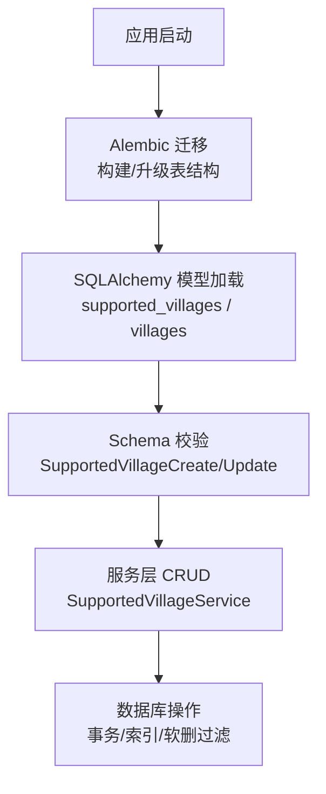
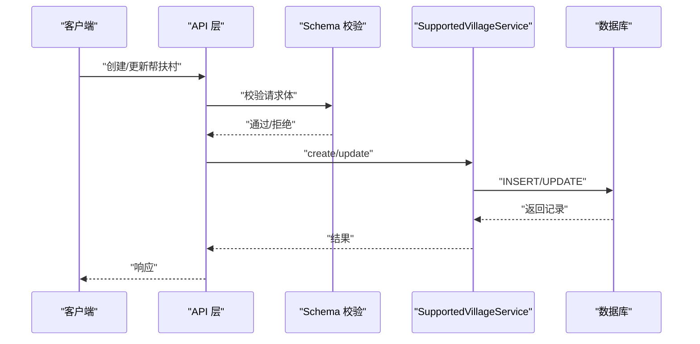
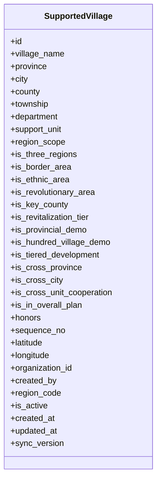
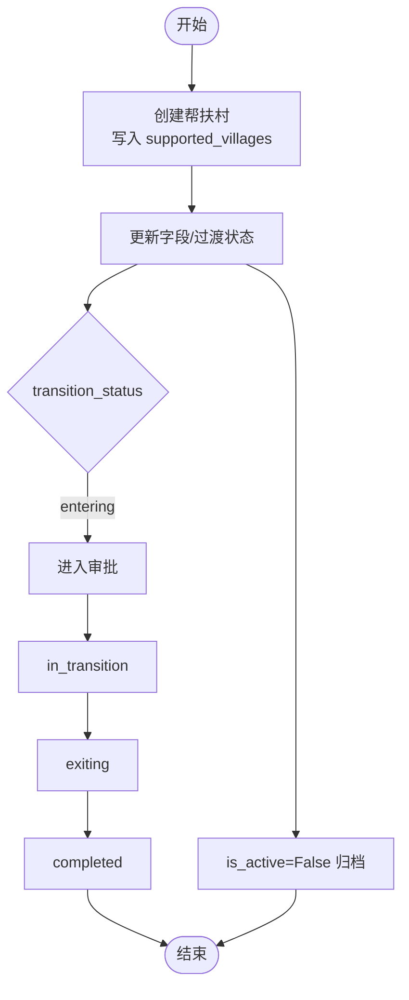
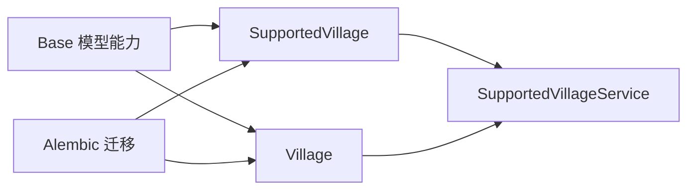

# 帮扶村核心表结构

<cite>
**本文引用的文件**
- [backend/app/models/supported_village.py](file://backend/app/models/supported_village.py)
- [backend/app/models/village.py](file://backend/app/models/village.py)
- [backend/app/models/base.py](file://backend/app/models/base.py)
- [backend/app/schemas/supported_village.py](file://backend/app/schemas/supported_village.py)
- [backend/app/services/supported_village_service.py](file://backend/app/services/supported_village_service.py)
- [backend/alembic/versions/a3f8b2c1d9e4_add_organization_id_created_by_to_supported_villages.py](file://backend/alembic/versions/a3f8b2c1d9e4_add_organization_id_created_by_to_supported_villages.py)
- [backend/alembic/versions/village_softdel_001_add_is_active.py](file://backend/alembic/versions/village_softdel_001_add_is_active.py)
- [backend/alembic/versions/region_code_001_add_region_code_to_models.py](file://backend/alembic/versions/region_code_001_add_region_code_to_models.py)
</cite>

## 目录
1. [简介](#简介)
2. [项目结构](#项目结构)
3. [核心组件](#核心组件)
4. [架构总览](#架构总览)
5. [详细组件分析](#详细组件分析)
6. [依赖关系分析](#依赖关系分析)
7. [性能考虑](#性能考虑)
8. [故障排查指南](#故障排查指南)
9. [结论](#结论)
10. [附录](#附录)

## 简介
本文件聚焦“帮扶村”核心数据模型与数据库设计，围绕 supported_villages（帮扶村主档）展开，系统说明其基础信息、地理坐标、行政区划编码、组织关联等关键字段；对比其与基础 villages（村庄主档）的差异与联系；解释帮扶对象业务字段（如帮扶状态、级别、周期等）在数据层的表现；并给出数据完整性约束、索引优化策略、软删除实现机制，以及帮扶村生命周期管理（创建、更新、归档/停用）的数据库支撑。

## 项目结构
与帮扶村相关的代码主要分布在以下位置：
- 模型定义：backend/app/models/supported_village.py（帮扶村主档）、backend/app/models/village.py（村庄基础信息）
- 基类与通用能力：backend/app/models/base.py（时间戳、软删除、同步版本等）
- 接口校验与输入输出：backend/app/schemas/supported_village.py（创建/更新/查询参数）
- 服务层：backend/app/services/supported_village_service.py（CRUD 与分页查询）
- 迁移脚本：alembic/versions 下关于 supported_villages 的迁移（组织ID、创建人、地区编码、软删除列与索引等）

**图表来源**
- [backend/alembic/versions/a3f8b2c1d9e4_add_organization_id_created_by_to_supported_villages.py:26-41](file://backend/alembic/versions/a3f8b2c1d9e4_add_organization_id_created_by_to_supported_villages.py#L26-L41)
- [backend/alembic/versions/village_softdel_001_add_is_active.py:31-52](file://backend/alembic/versions/village_softdel_001_add_is_active.py#L31-L52)
- [backend/app/models/base.py:66-106](file://backend/app/models/base.py#L66-L106)
- [backend/app/services/supported_village_service.py:15-29](file://backend/app/services/supported_village_service.py#L15-L29)

**章节来源**
- [backend/app/models/supported_village.py](file://backend/app/models/supported_village.py)
- [backend/app/models/village.py:14-63](file://backend/app/models/village.py#L14-L63)
- [backend/app/models/base.py:66-106](file://backend/app/models/base.py#L66-L106)
- [backend/app/schemas/supported_village.py:11-74](file://backend/app/schemas/supported_village.py#L11-L74)
- [backend/app/services/supported_village_service.py:15-29](file://backend/app/services/supported_village_service.py#L15-L29)
- [backend/alembic/versions/a3f8b2c1d9e4_add_organization_id_created_by_to_supported_villages.py:26-41](file://backend/alembic/versions/a3f8b2c1d9e4_add_organization_id_created_by_to_supported_villages.py#L26-L41)
- [backend/alembic/versions/village_softdel_001_add_is_active.py:31-52](file://backend/alembic/versions/village_softdel_001_add_is_active.py#L31-L52)
- [backend/alembic/versions/region_code_001_add_region_code_to_models.py:30-34](file://backend/alembic/versions/region_code_001_add_region_code_to_models.py#L30-L34)

## 核心组件
- 帮扶村主档模型（supported_villages）：承载帮扶对象的主体信息与业务属性，包括名称、行政归属、地理坐标、组织关联、地区编码、软删除标记、创建人与时间戳等。
- 村庄基础模型（villages）：承载村庄的基础地理与经济概况信息，作为更通用的地理实体维度。
- 基类能力（base）：提供统一的时间戳、同步版本号、软删除混入等通用能力。
- Schema 校验（schemas/supported_village.py）：对创建/更新请求进行严格校验，包含过渡状态字段用于审批流分支。
- 服务层（services/supported_village_service.py）：封装分页查询、单条获取、创建/更新/删除等核心操作。

**章节来源**
- [backend/app/models/supported_village.py](file://backend/app/models/supported_village.py)
- [backend/app/models/village.py:14-63](file://backend/app/models/village.py#L14-L63)
- [backend/app/models/base.py:66-106](file://backend/app/models/base.py#L66-L106)
- [backend/app/schemas/supported_village.py:11-74](file://backend/app/schemas/supported_village.py#L11-L74)
- [backend/app/services/supported_village_service.py:15-59](file://backend/app/services/supported_village_service.py#L15-L59)

## 架构总览
帮扶村的数据库设计与调用链路如下：
- Alembic 迁移负责建表与索引（组织ID、创建人、地区编码、软删除列与索引）。
- SQLAlchemy 模型映射到 supported_villages 与 villages 表。
- API 请求经 Pydantic Schema 校验后进入服务层，执行 CRUD。
- 列表查询默认按 is_active 过滤（软删除），支持按 organization_id、名称模糊匹配。
- 时间戳与同步版本号由基类自动维护，便于增量同步与审计。

**图表来源**
- [backend/app/schemas/supported_village.py:11-74](file://backend/app/schemas/supported_village.py#L11-L74)
- [backend/app/services/supported_village_service.py:35-51](file://backend/app/services/supported_village_service.py#L35-L51)

**章节来源**
- [backend/alembic/versions/a3f8b2c1d9e4_add_organization_id_created_by_to_supported_villages.py:26-41](file://backend/alembic/versions/a3f8b2c1d9e4_add_organization_id_created_by_to_supported_villages.py#L26-L41)
- [backend/alembic/versions/village_softdel_001_add_is_active.py:31-52](file://backend/alembic/versions/village_softdel_001_add_is_active.py#L31-L52)
- [backend/app/services/supported_village_service.py:15-59](file://backend/app/services/supported_village_service.py#L15-L59)

## 详细组件分析

### 帮扶村主档表 supported_villages 设计
- 基础信息字段
  - 名称、省市区乡、部门单位、帮扶单位、地区范围等，用于描述帮扶对象的基本属性。
  - 序号字段用于排序展示。
- 地理坐标存储
  - 纬度、经度字段用于地图展示与空间检索。
- 行政区划编码
  - region_code 字段用于数据权限前缀匹配与区域聚合。
- 组织关联
  - organization_id 与 created_by 字段分别表示所属组织与创建人，均建立索引以优化查询。
- 业务属性（帮扶状态、级别、周期等）
  - 通过布尔型标志位表达帮扶相关属性（例如是否三区三州、边境地区、民族地区、革命老区、重点县、乡村振兴层级、省级示范、百村示范、分级发展、跨省/跨市/跨单位协作、纳入总体方案等）。
  - 过渡状态 transition_status 用于审批流程分支（none/entering/in_transition/exiting/completed），配合服务层或上层工作流完成状态流转。
- 软删除与活跃标记
  - is_active 布尔字段标识是否启用（False 表示已软删除），列表查询默认过滤已删除记录。
- 时间戳与同步版本
  - created_at、updated_at、sync_version 由基类自动维护，支持增量同步与审计。

**图表来源**
- [backend/app/models/supported_village.py](file://backend/app/models/supported_village.py)
- [backend/app/models/base.py:66-106](file://backend/app/models/base.py#L66-L106)

**章节来源**
- [backend/app/models/supported_village.py](file://backend/app/models/supported_village.py)
- [backend/app/schemas/supported_village.py:11-74](file://backend/app/schemas/supported_village.py#L11-L74)
- [backend/alembic/versions/a3f8b2c1d9e4_add_organization_id_created_by_to_supported_villages.py:26-41](file://backend/alembic/versions/a3f8b2c1d9e4_add_organization_id_created_by_to_supported_villages.py#L26-L41)
- [backend/alembic/versions/region_code_001_add_region_code_to_models.py:30-34](file://backend/alembic/versions/region_code_001_add_region_code_to_models.py#L30-L34)
- [backend/alembic/versions/village_softdel_001_add_is_active.py:31-52](file://backend/alembic/versions/village_softdel_001_add_is_active.py#L31-L52)
- [backend/app/models/base.py:66-106](file://backend/app/models/base.py#L66-L106)

### 与基础 villages 表的区别与联系
- 区别
  - villages 侧重地理与经济基础信息（名称、地址、经纬度、海拔、面积、地形、人口、收入、状态等），是通用地理实体维度。
  - supported_villages 侧重帮扶业务属性（帮扶单位、部门、各类帮扶标志位、过渡状态、组织与创建人等），是帮扶业务主档。
- 联系
  - 两者都具备地理坐标与行政区划编码能力，可用于地图与区域统计。
  - 可通过 region_code 或组织维度进行数据权限与聚合分析。
  - 实际业务中，帮扶村可能对应某个 villages 记录，二者可联合查询形成“地理+业务”的综合视图。

**章节来源**
- [backend/app/models/village.py:14-63](file://backend/app/models/village.py#L14-L63)
- [backend/app/models/supported_village.py](file://backend/app/models/supported_village.py)

### 数据完整性约束与索引优化
- 完整性约束
  - 必填字段：village_name（名称）为必填，确保帮扶对象唯一标识。
  - 数值范围：经纬度、序号等字段具备范围校验（Schema 层）。
  - 外键与级联：组织与创建人字段通过索引优化查询；如需强一致可结合外键约束（当前迁移未显式声明外键，建议按需添加）。
- 索引优化
  - organization_id、created_by 索引：加速按组织与创建人筛选。
  - is_active 索引：加速列表软删除过滤。
  - 名称模糊搜索：建议在应用层使用 LIKE 或全文检索；若频繁按名称检索，可考虑追加名称索引或 FT 索引。
  - region_code：用于数据权限前缀匹配，可按需增加索引以提升区域聚合性能。

**章节来源**
- [backend/app/schemas/supported_village.py:11-74](file://backend/app/schemas/supported_village.py#L11-L74)
- [backend/alembic/versions/a3f8b2c1d9e4_add_organization_id_created_by_to_supported_villages.py:34-41](file://backend/alembic/versions/a3f8b2c1d9e4_add_organization_id_created_by_to_supported_villages.py#L34-L41)
- [backend/alembic/versions/village_softdel_001_add_is_active.py:50-52](file://backend/alembic/versions/village_softdel_001_add_is_active.py#L50-L52)

### 软删除实现机制
- 软删除字段
  - is_active：True 表示启用，False 表示已删除（软删）。
- 迁移与索引
  - 通过迁移新增 is_active 列并设置默认值，同时创建 ix_supported_villages_is_active 索引以优化列表过滤。
- 查询策略
  - 列表查询默认过滤 is_active=False 的记录，详情接口允许查看已删除记录（根据业务需求控制）。
- 恢复与审计
  - 可在服务层提供恢复方法，将 is_active 置回 True；deleted_by 等审计字段可根据需要扩展。

**章节来源**
- [backend/alembic/versions/village_softdel_001_add_is_active.py:31-52](file://backend/alembic/versions/village_softdel_001_add_is_active.py#L31-L52)
- [backend/app/models/base.py:108-147](file://backend/app/models/base.py#L108-L147)

### 帮扶村生命周期管理的数据库支持
- 创建
  - 通过 SupportedVillageCreate Schema 校验后，服务层插入记录，自动填充 created_at、updated_at、sync_version。
- 更新
  - 通过 SupportedVillageUpdate Schema 校验，支持字段级更新；transition_status 用于审批分支。
- 归档/停用
  - 通过 is_active=False 实现软删除归档；列表默认不显示已归档记录。
- 状态流转
  - 结合 transition_status 与工作流，可实现 none → entering → in_transition → exiting → completed 的状态机；服务层或上层流程根据状态变更触发相应动作。

**图表来源**
- [backend/app/schemas/supported_village.py:41-74](file://backend/app/schemas/supported_village.py#L41-L74)
- [backend/alembic/versions/village_softdel_001_add_is_active.py:31-52](file://backend/alembic/versions/village_softdel_001_add_is_active.py#L31-L52)

**章节来源**
- [backend/app/schemas/supported_village.py:11-74](file://backend/app/schemas/supported_village.py#L11-L74)
- [backend/app/services/supported_village_service.py:35-59](file://backend/app/services/supported_village_service.py#L35-L59)
- [backend/alembic/versions/village_softdel_001_add_is_active.py:31-52](file://backend/alembic/versions/village_softdel_001_add_is_active.py#L31-L52)

## 依赖关系分析
- 模型依赖
  - supported_villages 依赖 base 提供的 TimestampMixin、SoftDeleteMixin 等通用能力。
  - villages 与 supported_villages 共享地理与区域编码能力，便于跨表聚合。
- 服务依赖
  - SupportedVillageService 依赖 SQLAlchemy 异步会话与模型，提供分页与条件查询。
- 迁移依赖
  - 组织ID与创建人、地区编码、软删除列与索引的迁移相互独立且幂等，保证任意历史库可重放。

**图表来源**
- [backend/app/models/base.py:66-106](file://backend/app/models/base.py#L66-L106)
- [backend/app/services/supported_village_service.py:15-29](file://backend/app/services/supported_village_service.py#L15-L29)
- [backend/alembic/versions/a3f8b2c1d9e4_add_organization_id_created_by_to_supported_villages.py:26-41](file://backend/alembic/versions/a3f8b2c1d9e4_add_organization_id_created_by_to_supported_villages.py#L26-L41)
- [backend/alembic/versions/village_softdel_001_add_is_active.py:31-52](file://backend/alembic/versions/village_softdel_001_add_is_active.py#L31-L52)

**章节来源**
- [backend/app/models/base.py:66-106](file://backend/app/models/base.py#L66-L106)
- [backend/app/services/supported_village_service.py:15-29](file://backend/app/services/supported_village_service.py#L15-L29)
- [backend/alembic/versions/a3f8b2c1d9e4_add_organization_id_created_by_to_supported_villages.py:26-41](file://backend/alembic/versions/a3f8b2c1d9e4_add_organization_id_created_by_to_supported_villages.py#L26-L41)
- [backend/alembic/versions/village_softdel_001_add_is_active.py:31-52](file://backend/alembic/versions/village_softdel_001_add_is_active.py#L31-L52)

## 性能考虑
- 索引策略
  - organization_id、created_by、is_active 已建立索引，显著提升按组织、创建人与软删除过滤的查询性能。
  - region_code 可按需增加索引以优化区域聚合与权限过滤。
- 查询优化
  - 列表查询使用分页与条件过滤，避免全表扫描。
  - 名称模糊搜索建议使用全文检索或追加名称索引。
- 软删除影响
  - 列表默认过滤 is_active=False，减少无效数据量，提升响应速度。
- 同步版本
  - sync_version 自动递增，支持增量同步与数据包过滤，降低同步负载。

[本节为通用性能指导，无需具体文件引用]

## 故障排查指南
- 列表查询未显示已归档记录
  - 检查是否默认过滤 is_active=False；确认迁移已添加 is_active 列与索引。
- 组织维度查询慢
  - 确认 organization_id 索引存在；必要时增加复合索引（如 organization_id + is_active）。
- 名称搜索不准确
  - 检查是否使用正确的模糊匹配方式；考虑引入全文检索或名称索引。
- 过渡状态未生效
  - 确认 Schema 中包含 transition_status；服务层或上层流程是否正确处理该字段。

**章节来源**
- [backend/alembic/versions/village_softdel_001_add_is_active.py:31-52](file://backend/alembic/versions/village_softdel_001_add_is_active.py#L31-L52)
- [backend/alembic/versions/a3f8b2c1d9e4_add_organization_id_created_by_to_supported_villages.py:34-41](file://backend/alembic/versions/a3f8b2c1d9e4_add_organization_id_created_by_to_supported_villages.py#L34-L41)
- [backend/app/schemas/supported_village.py:41-74](file://backend/app/schemas/supported_village.py#L41-L74)

## 结论
帮扶村主档表 supported_villages 通过丰富的业务字段、地理坐标、行政区划编码与组织关联，构建了完整的帮扶对象数据模型；与 villages 表形成“业务+地理”的双维支撑。借助基类的软删除、时间戳与同步版本能力，以及迁移脚本的索引与列增强，系统在数据完整性、查询性能与生命周期管理方面提供了坚实基础。后续可按需扩展外键约束、全文检索与复合索引，进一步提升稳定性与性能。

[本节为总结性内容，无需具体文件引用]

## 附录
- 关键迁移路径
  - 组织ID与创建人：a3f8b2c1d9e4_add_organization_id_created_by_to_supported_villages.py
  - 地区编码：region_code_001_add_region_code_to_models.py
  - 软删除列与索引：village_softdel_001_add_is_active.py
- 服务层入口
  - SupportedVillageService：提供分页查询、创建、更新、删除等方法

**章节来源**
- [backend/alembic/versions/a3f8b2c1d9e4_add_organization_id_created_by_to_supported_villages.py:26-41](file://backend/alembic/versions/a3f8b2c1d9e4_add_organization_id_created_by_to_supported_villages.py#L26-L41)
- [backend/alembic/versions/region_code_001_add_region_code_to_models.py:30-34](file://backend/alembic/versions/region_code_001_add_region_code_to_models.py#L30-L34)
- [backend/alembic/versions/village_softdel_001_add_is_active.py:31-52](file://backend/alembic/versions/village_softdel_001_add_is_active.py#L31-L52)
- [backend/app/services/supported_village_service.py:15-59](file://backend/app/services/supported_village_service.py#L15-L59)