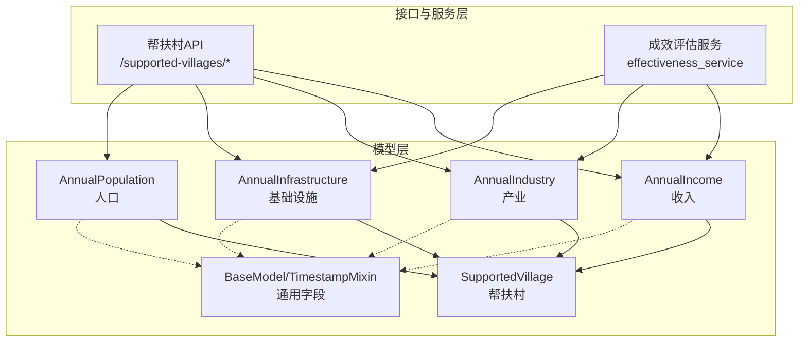
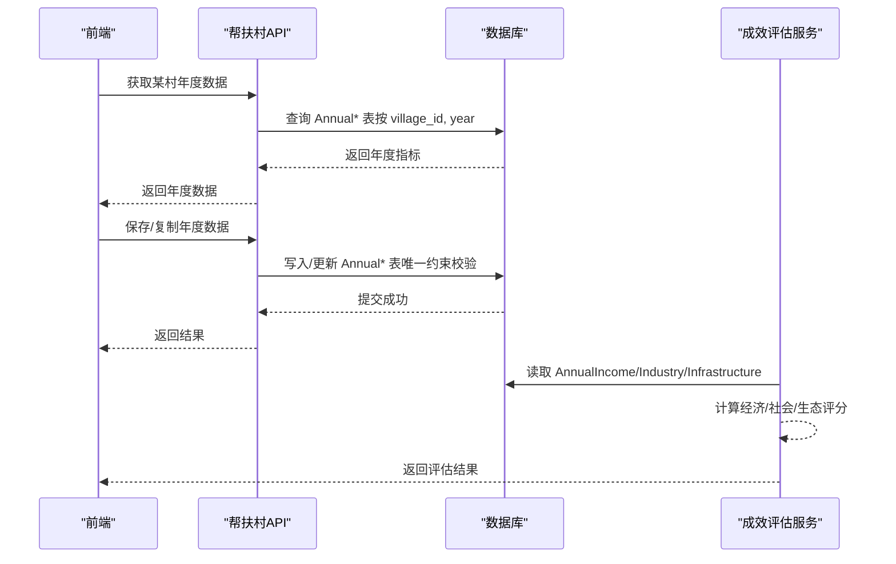
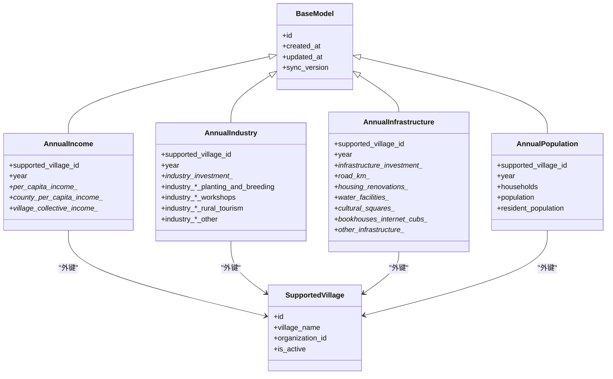

# 年度统计四表结构

<cite>
**本文引用的文件**
- [annual_income.py](file://backend/app/models/annual_income.py)
- [annual_industry.py](file://backend/app/models/annual_industry.py)
- [annual_infrastructure.py](file://backend/app/models/annual_infrastructure.py)
- [annual_population.py](file://backend/app/models/annual_population.py)
- [base.py](file://backend/app/models/base.py)
- [supported_village.py](file://backend/app/models/supported_village.py)
- [supported_village.py（API）](file://backend/app/api/v1/supported_village.py)
- [effectiveness_service.py](file://backend/app/services/effectiveness_service.py)
</cite>

## 目录
1. [简介](#简介)
2. [项目结构](#项目结构)
3. [核心组件](#核心组件)
4. [架构总览](#架构总览)
5. [详细组件分析](#详细组件分析)
6. [依赖关系分析](#依赖关系分析)
7. [性能考虑](#性能考虑)
8. [故障排查指南](#故障排查指南)
9. [结论](#结论)
10. [附录](#附录)

## 简介
本文件围绕“年度统计四表”进行结构化说明，涵盖：
- annual_income（收入统计表）
- annual_industry（产业统计表）
- annual_infrastructure（基础设施统计表）
- annual_population（人口统计表）

重点阐述四表的统一数据结构设计、各表特有业务字段、版本与历史数据管理策略、以及数据一致性保障机制。同时给出与帮扶村主实体、服务层计算和API层的关联关系，帮助读者快速理解从模型到使用的全链路。

## 项目结构
四张年度统计表均位于后端模型目录，遵循统一的基类与索引约束设计；它们通过外键与“帮扶村”主实体关联，形成“一村一年一行”的维度建模风格。年度数据的读写由帮扶村API统一入口处理，服务层在成效评估等场景消费这些指标。

图表来源
- [annual_income.py:10-49](file://backend/app/models/annual_income.py#L10-L49)
- [annual_industry.py:10-41](file://backend/app/models/annual_industry.py#L10-L41)
- [annual_infrastructure.py:18-51](file://backend/app/models/annual_infrastructure.py#L18-L51)
- [annual_population.py:10-37](file://backend/app/models/annual_population.py#L10-L37)
- [supported_village.py:42-199](file://backend/app/models/supported_village.py#L42-L199)
- [base.py:66-106](file://backend/app/models/base.py#L66-L106)
- [supported_village.py（API）:195-305](file://backend/app/api/v1/supported_village.py#L195-L305)
- [effectiveness_service.py:96-129](file://backend/app/services/effectiveness_service.py#L96-L129)

章节来源
- [annual_income.py:10-49](file://backend/app/models/annual_income.py#L10-L49)
- [annual_industry.py:10-41](file://backend/app/models/annual_industry.py#L10-L41)
- [annual_infrastructure.py:18-51](file://backend/app/models/annual_infrastructure.py#L18-L51)
- [annual_population.py:10-37](file://backend/app/models/annual_population.py#L10-L37)
- [supported_village.py:42-199](file://backend/app/models/supported_village.py#L42-L199)
- [base.py:66-106](file://backend/app/models/base.py#L66-L106)
- [supported_village.py（API）:195-305](file://backend/app/api/v1/supported_village.py#L195-L305)
- [effectiveness_service.py:96-129](file://backend/app/services/effectiveness_service.py#L96-L129)

## 核心组件
- 年度收入表（AnnualIncome）：记录帮扶村按年的人均纯收入、县区人均收入、村集体收入等指标。
- 年度产业表（AnnualIndustry）：记录帮扶村按年的产业投入、细分产业数量等。
- 年度基础设施表（AnnualInfrastructure）：记录帮扶村按年的基础设施投入及道路、住房改造、水利设施等明细。
- 年度人口表（AnnualPopulation）：记录帮扶村按年的户数、总人口、常住人口等。

四表共性
- 唯一性约束：每个帮扶村每年仅允许一条记录（联合唯一约束）。
- 索引优化：针对帮扶村ID、年份建立索引，提升查询效率。
- 时间戳与同步版本：继承自基类的创建/更新时间与同步版本号，用于增量同步与变更追踪。
- 软删除与审计：通过基类混入或上层逻辑实现软删除与审计留痕（年度表本身未直接声明软删字段，但受基类时间戳与同步版本支持）。

章节来源
- [annual_income.py:10-49](file://backend/app/models/annual_income.py#L10-L49)
- [annual_industry.py:10-41](file://backend/app/models/annual_industry.py#L10-L41)
- [annual_infrastructure.py:18-51](file://backend/app/models/annual_infrastructure.py#L18-L51)
- [annual_population.py:10-37](file://backend/app/models/annual_population.py#L10-L37)
- [base.py:66-106](file://backend/app/models/base.py#L66-L106)

## 架构总览
年度四表以“帮扶村 + 年份”为自然键，形成稳定的维度切片。API层提供统一的读取、写入、复制能力；服务层基于这些数据进行成效评估与指标聚合。

图表来源
- [supported_village.py（API）:195-305](file://backend/app/api/v1/supported_village.py#L195-L305)
- [effectiveness_service.py:96-129](file://backend/app/services/effectiveness_service.py#L96-L129)
- [annual_income.py:10-49](file://backend/app/models/annual_income.py#L10-L49)
- [annual_industry.py:10-41](file://backend/app/models/annual_industry.py#L10-L41)
- [annual_infrastructure.py:18-51](file://backend/app/models/annual_infrastructure.py#L18-L51)
- [annual_population.py:10-37](file://backend/app/models/annual_population.py#L10-L37)

## 详细组件分析

### 统一数据结构设计
- 主键与维度
  - 每表包含帮扶村ID与年份作为业务主键维度，并通过唯一约束保证“一村一年一行”。
- 通用字段
  - 自增主键、创建时间、更新时间、同步版本号（用于增量同步与变更检测）。
- 数据来源标记
  - 当前模型层未内置“数据来源”字段；如需区分录入渠道或系统来源，可在应用层扩展字段或在导入流程中附加元数据。
- 同比/环比计算
  - 模型层不存储同比/环比字段；建议在查询或服务层根据相邻年份数据计算增长率，避免冗余与不一致。

章节来源
- [annual_income.py:10-49](file://backend/app/models/annual_income.py#L10-L49)
- [annual_industry.py:10-41](file://backend/app/models/annual_industry.py#L10-L41)
- [annual_infrastructure.py:18-51](file://backend/app/models/annual_infrastructure.py#L18-L51)
- [annual_population.py:10-37](file://backend/app/models/annual_population.py#L10-L37)
- [base.py:66-106](file://backend/app/models/base.py#L66-L106)

### 年度收入表（AnnualIncome）
- 关键业务字段
  - 人均纯收入（多年度分列）、县区人均收入（指定年度）、村集体收入（多年度分列）。
- 设计要点
  - 数值型字段采用高精度类型，便于财务与统计口径一致。
  - 通过唯一约束确保同一村同一年仅有一条收入记录。
- 典型用法
  - 列表页展示人均收入趋势；服务层可据此计算经济增长率并参与综合评分。

章节来源
- [annual_income.py:10-49](file://backend/app/models/annual_income.py#L10-L49)

### 年度产业表（AnnualIndustry）
- 关键业务字段
  - 产业投入（多年度分列与合计）、细分产业数量（种植养殖、帮扶车间、乡村旅游、其他）。
- 设计要点
  - 将投入金额与分项数量分离，兼顾总量统计与结构分析。
  - 唯一约束保障年度粒度数据完整性。
- 典型用法
  - 统计产业覆盖度与投入强度；服务层结合基础设施覆盖度计算社会效益评分。

章节来源
- [annual_industry.py:10-41](file://backend/app/models/annual_industry.py#L10-L41)

### 年度基础设施表（AnnualInfrastructure）
- 关键业务字段
  - 基础设施投入（多年度分列与总计）、道路公里数、住房改造数量、水利设施数量、文化广场数量、书屋/网吧数量、其他基础设施数量。
- 设计要点
  - 投入金额与实物量指标并存，便于多维度评估。
  - 唯一约束保障年度粒度数据完整性。
- 典型用法
  - 统计基础设施覆盖率；服务层将其纳入社会与生态评分。

章节来源
- [annual_infrastructure.py:18-51](file://backend/app/models/annual_infrastructure.py#L18-L51)

### 年度人口表（AnnualPopulation）
- 关键业务字段
  - 户数、总人口、常住人口。
- 设计要点
  - 基础人口指标，支撑人均指标的分母与结构分析。
  - 唯一约束保障年度粒度数据完整性。
- 典型用法
  - 计算常住人口占比、人口规模变化；与收入指标联动分析民生改善。

章节来源
- [annual_population.py:10-37](file://backend/app/models/annual_population.py#L10-L37)

### 年度数据版本管理与历史保留策略
- 版本控制
  - 所有模型继承基类的时间戳与同步版本号；每次更新自动递增同步版本号，便于增量同步与数据包过滤。
- 历史保留
  - 年度表以“一村一年一行”的方式天然保留历史快照；新增年份即新增行，旧年份数据保持不变。
- 软删除与审计
  - 年度表本身未声明软删字段；若需对年度记录做软删或恢复，应在上层服务中扩展相应字段与逻辑，并结合审计日志记录操作人。

章节来源
- [base.py:66-106](file://backend/app/models/base.py#L66-L106)
- [annual_income.py:10-49](file://backend/app/models/annual_income.py#L10-L49)
- [annual_industry.py:10-41](file://backend/app/models/annual_industry.py#L10-L41)
- [annual_infrastructure.py:18-51](file://backend/app/models/annual_infrastructure.py#L18-L51)
- [annual_population.py:10-37](file://backend/app/models/annual_population.py#L10-L37)

### 数据一致性保证机制
- 唯一约束
  - 四表均以“帮扶村ID + 年份”为唯一约束，防止重复录入。
- 外键约束
  - 四表通过外键关联帮扶村主表，级联删除保证数据一致性。
- 事务与回滚
  - 年度数据批量复制与保存通过API层事务封装，异常时回滚，避免半写状态。
- 权限与隔离
  - 所有查询与写入均经过数据范围适配器与权限校验，确保组织隔离与最小可见原则。

章节来源
- [annual_income.py:10-49](file://backend/app/models/annual_income.py#L10-L49)
- [annual_industry.py:10-41](file://backend/app/models/annual_industry.py#L10-L41)
- [annual_infrastructure.py:18-51](file://backend/app/models/annual_infrastructure.py#L18-L51)
- [annual_population.py:10-37](file://backend/app/models/annual_population.py#L10-L37)
- [supported_village.py:42-199](file://backend/app/models/supported_village.py#L42-L199)
- [supported_village.py（API）:195-305](file://backend/app/api/v1/supported_village.py#L195-L305)

## 依赖关系分析
四张年度表均依赖帮扶村主实体与基类；API层提供统一访问入口；服务层消费年度指标进行成效评估。

图表来源
- [base.py:158-185](file://backend/app/models/base.py#L158-L185)
- [annual_income.py:10-49](file://backend/app/models/annual_income.py#L10-L49)
- [annual_industry.py:10-41](file://backend/app/models/annual_industry.py#L10-L41)
- [annual_infrastructure.py:18-51](file://backend/app/models/annual_infrastructure.py#L18-L51)
- [annual_population.py:10-37](file://backend/app/models/annual_population.py#L10-L37)
- [supported_village.py:42-199](file://backend/app/models/supported_village.py#L42-L199)

章节来源
- [base.py:158-185](file://backend/app/models/base.py#L158-L185)
- [annual_income.py:10-49](file://backend/app/models/annual_income.py#L10-L49)
- [annual_industry.py:10-41](file://backend/app/models/annual_industry.py#L10-L41)
- [annual_infrastructure.py:18-51](file://backend/app/models/annual_infrastructure.py#L18-L51)
- [annual_population.py:10-37](file://backend/app/models/annual_population.py#L10-L37)
- [supported_village.py:42-199](file://backend/app/models/supported_village.py#L42-L199)

## 性能考虑
- 索引策略
  - 四表均对帮扶村ID建立单列索引，部分表对“帮扶村ID+年份”建立复合索引，显著提升按村与按年查询性能。
- 查询模式
  - 推荐以“帮扶村ID + 年份”精确查询；列表聚合建议结合分页与必要字段投影，减少数据传输。
- 写入优化
  - 批量复制与保存使用事务封装，避免多次往返；利用唯一约束快速失败，减少无效写入。
- 缓存与审计
  - 列表查询可使用缓存降低热点压力；审计日志与同步版本号不影响高频读路径。

章节来源
- [annual_income.py:10-49](file://backend/app/models/annual_income.py#L10-L49)
- [annual_industry.py:10-41](file://backend/app/models/annual_industry.py#L10-L41)
- [annual_infrastructure.py:18-51](file://backend/app/models/annual_infrastructure.py#L18-L51)
- [annual_population.py:10-37](file://backend/app/models/annual_population.py#L10-L37)
- [supported_village.py（API）:447-577](file://backend/app/api/v1/supported_village.py#L447-L577)

## 故障排查指南
- 重复录入报错
  - 现象：插入或更新时报唯一约束冲突。
  - 原因：同一帮扶村同一年已存在记录。
  - 处理：先查询是否存在，再决定更新或提示用户。
- 空值导致计算异常
  - 现象：同比/环比或评分计算出现NaN/除零。
  - 原因：缺失前一年数据或分母为零。
  - 处理：在服务层增加空值保护与默认值策略。
- 导入失败
  - 现象：Excel导入部分行失败。
  - 原因：必填字段为空、长度超限、重名等。
  - 处理：查看错误列表，修正后重试；必要时分批导入。
- 权限问题
  - 现象：无法查看或编辑某村年度数据。
  - 原因：数据范围隔离或越权访问。
  - 处理：确认当前用户组织范围与角色权限。

章节来源
- [supported_village.py（API）:195-305](file://backend/app/api/v1/supported_village.py#L195-L305)
- [supported_village.py（API）:447-577](file://backend/app/api/v1/supported_village.py#L447-L577)
- [effectiveness_service.py:96-129](file://backend/app/services/effectiveness_service.py#L96-L129)

## 结论
年度统计四表采用“帮扶村 + 年份”的维度建模，配合唯一约束与索引，确保了数据的一致性与查询性能。四表共享基类的时间戳与同步版本，便于增量同步与变更追踪。业务上，收入、产业、基础设施、人口四类指标相互补充，既满足统计报表需求，也支撑服务层的成效评估与评分计算。建议在应用层完善数据来源标记与同比/环比计算，并在需要时对年度记录引入软删与审计字段，以增强可追溯性与合规性。

## 附录
- 术语
  - 同比：与上一年度相同指标的对比。
  - 环比：与上一统计周期（如上月/上季度）的对比。
  - 软删除：逻辑删除，保留历史数据以便审计与恢复。
- 最佳实践
  - 新增年度数据前先检查是否已存在，避免重复。
  - 计算同比/环比时处理空值与除零情况。
  - 批量操作使用事务，确保原子性。
  - 严格遵循数据范围隔离，避免越权访问。