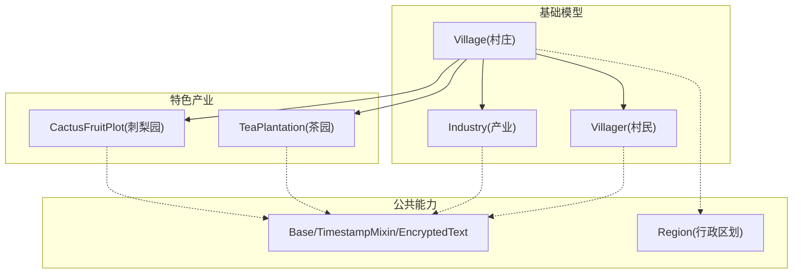
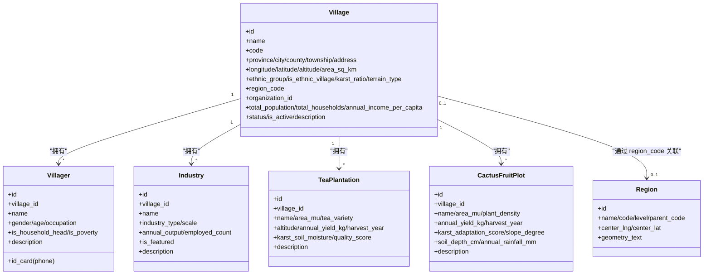
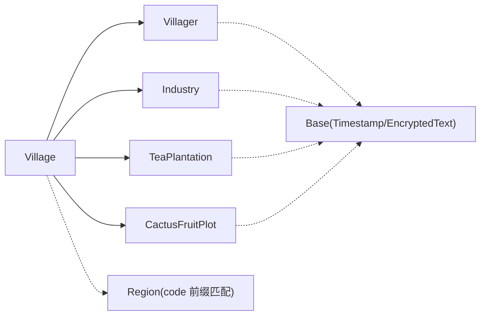

# 自然村基础表结构

<cite>
**本文引用的文件**
- [backend/app/models/village.py](file://backend/app/models/village.py)
- [backend/app/models/industry.py](file://backend/app/models/industry.py)
- [backend/app/models/base.py](file://backend/app/models/base.py)
- [backend/app/models/region.py](file://backend/app/models/region.py)
- [backend/app/models/supported_village.py](file://backend/app/models/supported_village.py)
- [backend/alembic/versions/001_baseline.py](file://backend/alembic/versions/001_baseline.py)
</cite>

## 目录
1. [简介](#简介)
2. [项目结构](#项目结构)
3. [核心组件](#核心组件)
4. [架构总览](#架构总览)
5. [详细组件分析](#详细组件分析)
6. [依赖关系分析](#依赖关系分析)
7. [性能与查询优化](#性能与查询优化)
8. [故障排查指南](#故障排查指南)
9. [结论](#结论)
10. [附录](#附录)

## 简介
本文件面向“自然村基础数据”的数据库设计，围绕以下目标展开：
- 说明村庄基础信息表（villages）的结构，覆盖行政区划、地理坐标、民族特征、地形地貌等基础属性。
- 说明村民信息表（villagers）的结构，重点解释个人信息、家庭关系、贫困标识等敏感数据的加密存储机制。
- 说明产业信息表（industries）的设计，涵盖特色产业、种植养殖、加工贸易等记录方式，并补充贵州省特色农业（茶园、刺梨园）的扩展模型。
- 明确基础表与帮扶对象表（supported_villages 及其年度指标表）的区别，阐明基础数据的管理与维护机制。
- 给出地理信息系统（GIS）数据的存储格式与查询优化建议。

## 项目结构
与“自然村基础表结构”直接相关的后端代码主要位于 models 层，包含：
- 村庄与村民、产业的基础模型
- 特色产业（茶园、刺梨园）的扩展模型
- 行政区划模型（用于区域编码与 GIS 几何）
- 通用基类（时间戳、同步版本、PII 透明加密类型）
- Alembic 基线迁移（用于从零建库时一次性创建所有表）

图表来源
- [backend/app/models/village.py:14-130](file://backend/app/models/village.py#L14-L130)
- [backend/app/models/industry.py:16-113](file://backend/app/models/industry.py#L16-L113)
- [backend/app/models/base.py:23-46](file://backend/app/models/base.py#L23-L46)
- [backend/app/models/region.py:11-39](file://backend/app/models/region.py#L11-L39)

章节来源
- [backend/app/models/village.py:14-130](file://backend/app/models/village.py#L14-L130)
- [backend/app/models/industry.py:16-113](file://backend/app/models/industry.py#L16-L113)
- [backend/app/models/base.py:23-46](file://backend/app/models/base.py#L23-L46)
- [backend/app/models/region.py:11-39](file://backend/app/models/region.py#L11-L39)

## 核心组件
- Village（村庄基础信息）
  - 字段覆盖：名称、编码、省市区乡镇地址、经纬度、海拔、面积、主要民族、是否少数民族村寨、喀斯特比例、地形类型、区划编码、组织归属、人口与收入概况、状态与备注。
  - 索引：名称、县、组织ID，便于按行政区和组织维度检索。
  - 关系：一对多关联 Villager、Industry；只读视图关联茶园与刺梨园。
- Villager（村民信息）
  - 字段覆盖：所属村庄、姓名、身份证号、电话、性别、年龄、职业、户主标识、贫困户标识、备注。
  - 安全：身份证号与电话使用 EncryptedText 透明加密存储，读写自动加解密。
  - 索引：村庄ID、姓名，支持按村和姓名快速检索。
- Industry（产业信息）
  - 字段覆盖：所属村庄、产业名称、类型、规模、年产值、带动就业人数、是否特色产业、备注。
  - 索引：村庄ID、产业类型，支持按村与类型筛选。
- Region（行政区划）
  - 字段覆盖：名称、编码、层级、上级编码、中心经纬度、GeoJSON geometry。
  - 用途：为 villages.region_code 提供区划编码前缀匹配的数据权限依据；geometry 用于 GIS 空间查询。
- Base 能力
  - TimestampMixin：统一 created_at/updated_at/sync_version，更新时自动递增版本号，支撑增量同步。
  - EncryptedText：PII 字段透明加密（写入加密、读取解密），支持确定性密文以利于等值查询。

章节来源
- [backend/app/models/village.py:14-130](file://backend/app/models/village.py#L14-L130)
- [backend/app/models/industry.py:16-113](file://backend/app/models/industry.py#L16-L113)
- [backend/app/models/region.py:11-39](file://backend/app/models/region.py#L11-L39)
- [backend/app/models/base.py:23-46](file://backend/app/models/base.py#L23-L46)
- [backend/app/models/base.py:66-106](file://backend/app/models/base.py#L66-L106)

## 架构总览
自然村基础数据采用“基础实体 + 特色产业扩展 + 公共能力”的分层建模：
- 基础实体：Village/Villager/Industry 描述自然村的静态与动态基础信息。
- 特色产业扩展：TeaPlantation/CactusFruitPlot 针对贵州特色农业进行细粒度建模，并提供基于海拔、土壤湿度、坡度、降雨等的评分算法。
- 公共能力：Base 提供时间戳、同步版本、PII 加密；Region 提供区划编码与 GeoJSON 几何。

图表来源
- [backend/app/models/village.py:14-130](file://backend/app/models/village.py#L14-L130)
- [backend/app/models/industry.py:16-113](file://backend/app/models/industry.py#L16-L113)
- [backend/app/models/region.py:11-39](file://backend/app/models/region.py#L11-L39)

## 详细组件分析

### 村庄基础信息表（villages）
- 设计要点
  - 行政区划：province/city/county/township/address 与 region_code 共同构成多维定位与权限前缀匹配。
  - 地理信息：longitude/latitude/altitude/area_sq_km 满足基础 GIS 展示与统计需求。
  - 民族与地貌：ethnic_group/is_ethnic_village/karst_ratio/terrain_type 刻画民族特征与喀斯特地貌影响。
  - 经济概况：total_population/total_households/annual_income_per_capita 提供宏观指标。
  - 状态管理：status/is_active/description 控制生命周期与备注。
- 索引策略
  - 名称、县、组织ID 建立索引，提升列表与筛选性能。
- 关系
  - 与 Villager、Industry 一对多；与茶园、刺梨园通过 viewonly 关系聚合展示。

章节来源
- [backend/app/models/village.py:14-74](file://backend/app/models/village.py#L14-L74)

### 村民信息表（villagers）
- 设计要点
  - 个人信息：name/gender/age/occupation 等基础画像。
  - 家庭关系：is_household_head 标识户主，便于家庭单元统计。
  - 贫困标识：is_poverty 作为扶贫与帮扶业务的关键标志位。
  - 敏感数据：id_card/phone 使用 EncryptedText 透明加密，保障隐私合规。
- 索引策略
  - village_id/name 索引，支持按村与姓名检索。
- 安全与审计
  - 继承 TimestampMixin，具备 created_at/updated_at/sync_version，便于增量同步与变更追踪。

章节来源
- [backend/app/models/village.py:76-103](file://backend/app/models/village.py#L76-L103)
- [backend/app/models/base.py:23-46](file://backend/app/models/base.py#L23-L46)
- [backend/app/models/base.py:66-106](file://backend/app/models/base.py#L66-L106)

### 产业信息表（industries）
- 设计要点
  - 记录方式：name/industry_type/scale/annual_output/employed_count/is_featured/description。
  - 特色产业：is_featured 标记特色产业，便于专项统计与政策倾斜。
- 索引策略
  - village_id/industry_type 索引，支持按村与类型筛选。
- 关系
  - 与 Village 一对多，体现“一村多产”。

章节来源
- [backend/app/models/village.py:105-130](file://backend/app/models/village.py#L105-L130)

### 特色产业扩展（茶园、刺梨园）
- 茶园（TeaPlantation）
  - 字段：品种、面积、海拔、产量、采收年份、喀斯特土壤湿度指数、品质评分等。
  - 算法：calculate_quality 综合海拔与土壤湿度计算品质评分。
- 刺梨园（CactusFruitPlot）
  - 字段：密度、产量、采收年份、喀斯特适应性评分、坡度、土层厚度、年降雨量等。
  - 算法：calculate_adaptation 综合坡度、土层厚度、降雨量评估适应性。
- 价值
  - 将地理环境因子量化为可计算的评分，辅助产业布局与质量评估。

章节来源
- [backend/app/models/industry.py:16-113](file://backend/app/models/industry.py#L16-L113)
- [backend/app/models/industry.py:118-176](file://backend/app/models/industry.py#L118-L176)

### 行政区划与GIS（regions）
- 字段
  - code/level/parent_code 构建层级树；center_lng/center_lat 提供中心点；geometry_text 存储 GeoJSON geometry。
- 用途
  - villages.region_code 通过前缀匹配实现数据权限隔离。
  - geometry_text 支持空间查询（如按区县范围筛选村庄）。
- 建议
  - 在数据库层面为 geometry_text 建立空间索引（若数据库支持），以提升空间查询性能。

章节来源
- [backend/app/models/region.py:11-39](file://backend/app/models/region.py#L11-L39)

### 基础表与帮扶对象表的区别
- 基础表（villages/villagers/industries）
  - 关注“自然村”的静态与基础动态信息，强调地理、人口、产业等客观事实。
  - 适合做全域数据底座，服务于地图展示、统计分析与跨部门共享。
- 帮扶对象表（supported_villages 及年度指标表）
  - 关注“被帮扶村”的业务过程数据，包括人口、收入、投入、基础设施、党建、医疗、消费、就业、教育等多维年度指标。
  - 更贴近帮扶工作台账与考核，强调年度变化与投入产出。
- 维护机制
  - 基础表由数据治理团队或村级管理员维护，保持准确性与一致性。
  - 帮扶对象表由帮扶单位或业务系统按年度填报，结合审核流程确保数据质量。
  - 两者可通过地名、区划编码等进行关联，但职责边界清晰，避免混用。

章节来源
- [backend/app/models/supported_village.py:42-305](file://backend/app/models/supported_village.py#L42-L305)

## 依赖关系分析
- 模型间依赖
  - Village 是核心枢纽，关联 Villager、Industry、TeaPlantation、CactusFruitPlot。
  - Region 通过 region_code 与 Village 形成逻辑关联（非外键约束）。
- 公共能力依赖
  - 所有模型继承 Base/TimestampMixin，获得统一的时间戳与同步版本。
  - PII 字段通过 EncryptedText 实现透明加密，降低业务侵入性。
- 迁移依赖
  - Alembic 基线迁移在空库时通过导入所有模型元数据一次性建表，保证初始一致性。

图表来源
- [backend/app/models/village.py:14-130](file://backend/app/models/village.py#L14-L130)
- [backend/app/models/industry.py:16-113](file://backend/app/models/industry.py#L16-L113)
- [backend/app/models/base.py:23-46](file://backend/app/models/base.py#L23-L46)
- [backend/app/models/region.py:11-39](file://backend/app/models/region.py#L11-L39)
- [backend/alembic/versions/001_baseline.py:21-42](file://backend/alembic/versions/001_baseline.py#L21-L42)

章节来源
- [backend/alembic/versions/001_baseline.py:21-42](file://backend/alembic/versions/001_baseline.py#L21-L42)

## 性能与查询优化
- 索引设计
  - villages：名称、县、组织ID 索引，加速列表与筛选。
  - villagers：村庄ID、姓名 索引，支持按村与姓名检索。
  - industries：村庄ID、产业类型 索引，支持按村与类型筛选。
  - tea_plantations/cactus_fruit_plots：村庄ID、采收年份 索引，支持按村与年份聚合。
  - regions：编码唯一索引、层级与父级编码索引，支撑层级遍历与权限前缀匹配。
- 同步版本
  - TimestampMixin.sync_version 在每次更新时自动递增，便于增量同步与数据包过滤。
- GIS 查询优化
  - 建议在数据库层对 regions.geometry_text 建立空间索引（若引擎支持），并使用空间函数进行范围查询。
  - 对于 villages 的经纬度字段，可在热点查询场景下建立复合索引（如 county + longitude/latitude 区间）。
- 查询模式建议
  - 列表页优先使用索引列过滤（如 village_id、industry_type、year）。
  - 避免在大表上进行全表扫描与复杂字符串模糊匹配。
  - 对频繁访问的聚合结果（如各村产业汇总）考虑物化视图或缓存层。

章节来源
- [backend/app/models/village.py:19-23](file://backend/app/models/village.py#L19-L23)
- [backend/app/models/village.py:81-84](file://backend/app/models/village.py#L81-L84)
- [backend/app/models/village.py:110-113](file://backend/app/models/village.py#L110-L113)
- [backend/app/models/industry.py:26-29](file://backend/app/models/industry.py#L26-L29)
- [backend/app/models/industry.py:72-75](file://backend/app/models/industry.py#L72-L75)
- [backend/app/models/region.py:16-20](file://backend/app/models/region.py#L16-L20)
- [backend/app/models/base.py:66-106](file://backend/app/models/base.py#L66-L106)

## 故障排查指南
- 加密字段异常
  - 现象：明文/密文不一致导致查询失败或显示异常。
  - 排查：确认 EncryptedText 的写入与读取路径是否正确；检查历史数据是否已迁移为密文。
  - 参考：透明加密类型定义与加解密调用位置。
- 增量同步失效
  - 现象：sync_version 未递增导致增量包为空。
  - 排查：确认 before_update 事件是否生效；检查 UPDATE 语句是否绕过 ORM。
  - 参考：sync_version 自动递增事件监听。
- 权限前缀不生效
  - 现象：按 region_code 前缀匹配的数据权限未生效。
  - 排查：确认 villages.region_code 与 regions.code 的前缀关系正确；检查权限层是否使用前缀匹配。
  - 参考：Region 模型与 villages 的 region_code 字段。
- 空间查询慢
  - 现象：按 GeoJSON 范围查询响应慢。
  - 排查：确认是否在数据库层建立了空间索引；检查查询是否使用了合适的空间函数。
  - 参考：regions.geometry_text 字段。

章节来源
- [backend/app/models/base.py:23-46](file://backend/app/models/base.py#L23-L46)
- [backend/app/models/base.py:94-106](file://backend/app/models/base.py#L94-L106)
- [backend/app/models/region.py:11-39](file://backend/app/models/region.py#L11-L39)

## 结论
- 自然村基础表以 Village 为核心，串联 Villager 与 Industry，并通过 Region 提供区划与 GIS 能力。
- 特色产业扩展（茶园、刺梨园）将地理环境因子量化为评分，支撑产业布局与质量评估。
- 基础表与帮扶对象表职责清晰：前者为数据底座，后者为业务台账；二者可协同但不混用。
- 通过合理的索引设计与同步版本机制，兼顾了查询性能与增量同步需求；GIS 数据建议结合数据库空间索引进一步优化。

## 附录
- 数据字典速览
  - villages：名称、编码、行政区划、地理坐标、海拔、面积、民族、地貌、区划编码、组织、人口与收入、状态与备注。
  - villagers：所属村庄、姓名、身份证与电话（加密）、性别、年龄、职业、户主、贫困户、备注。
  - industries：所属村庄、名称、类型、规模、产值、就业、是否特色、备注。
  - regions：名称、编码、层级、父级、中心点、GeoJSON geometry。
- 初始化与迁移
  - Alembic 基线迁移在空库时通过导入所有模型元数据一次性建表，确保初始一致性。

章节来源
- [backend/alembic/versions/001_baseline.py:21-42](file://backend/alembic/versions/001_baseline.py#L21-L42)