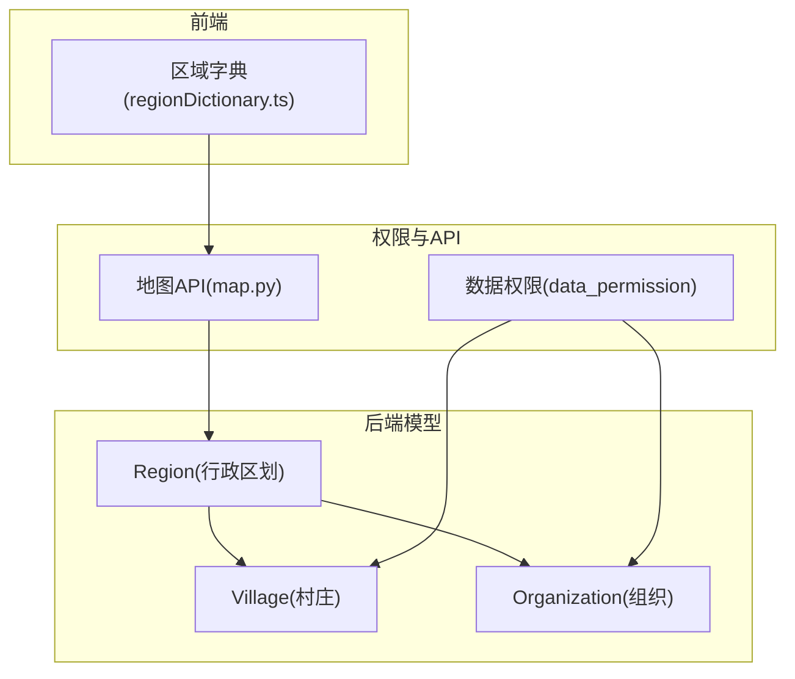
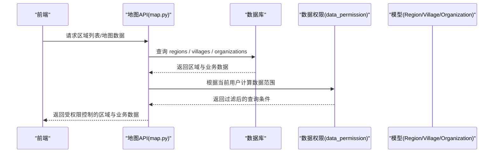
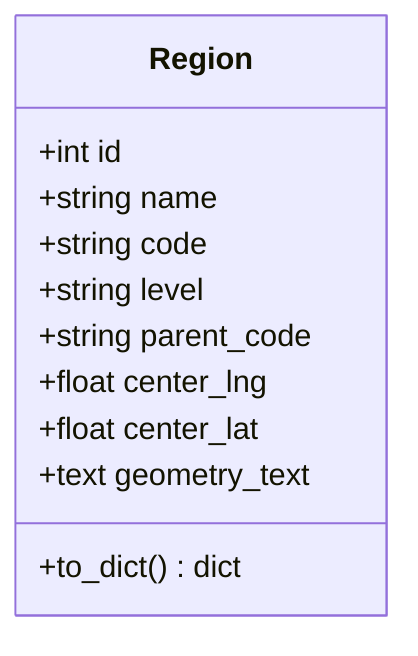
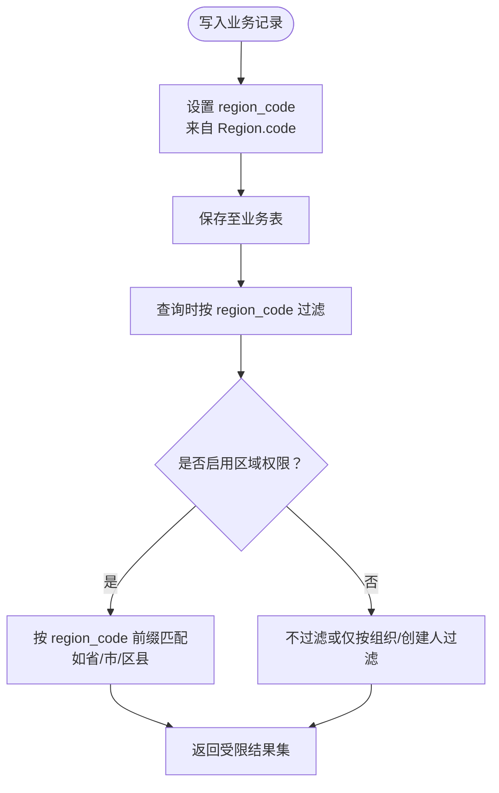
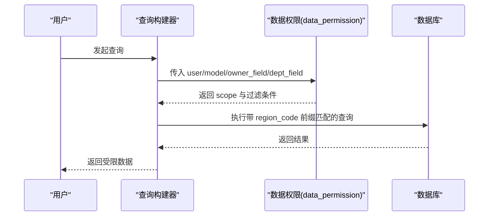
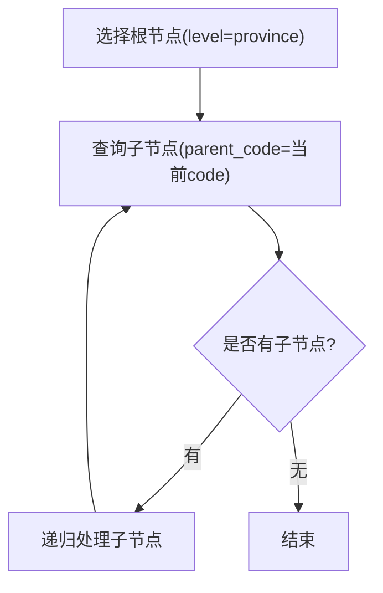
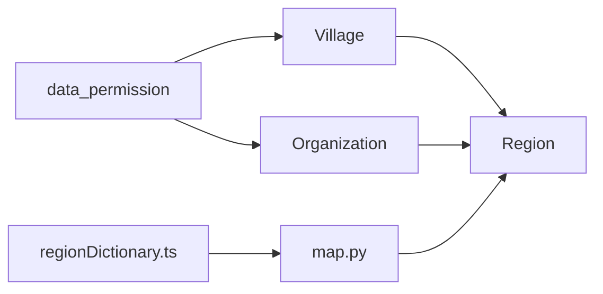

# 行政区划表结构

<cite>
**本文引用的文件**
- [backend/app/models/region.py](file://backend/app/models/region.py)
- [backend/app/models/village.py](file://backend/app/models/village.py)
- [backend/app/models/organization.py](file://backend/app/models/organization.py)
- [backend/app/core/data_permission.py](file://backend/app/core/data_permission.py)
- [backend/alembic/versions/region_code_001_add_region_code_to_models.py](file://backend/alembic/versions/region_code_001_add_region_code_to_models.py)
- [backend/app/api/v1/map.py](file://backend/app/api/v1/map.py)
- [frontend/src/config/regionDictionary.ts](file://frontend/src/config/regionDictionary.ts)
</cite>

## 目录
1. [简介](#简介)
2. [项目结构](#项目结构)
3. [核心组件](#核心组件)
4. [架构总览](#架构总览)
5. [详细组件分析](#详细组件分析)
6. [依赖关系分析](#依赖关系分析)
7. [性能考虑](#性能考虑)
8. [故障排查指南](#故障排查指南)
9. [结论](#结论)
10. [附录](#附录)

## 简介
本文件围绕“regions”行政区划表及其在系统中的使用，提供完整、可操作的设计与实现说明。内容涵盖：
- 省市区县乡多级区划的层级关系、编码规则与名称映射
- 区域代码与国家标准的对应关系及数据权限前缀匹配机制
- 历史变更记录与树形结构维护策略
- region_code 在各业务表中的使用方式与数据隔离、权限控制实现
- 行政区划数据的导入导出与同步更新机制建议

## 项目结构
与行政区划相关的关键位置：
- 模型层：Region（regions 表）、Village（villages 表）、Organization（organizations 表）
- 权限层：data_permission（数据范围过滤）
- 迁移脚本：region_code_001（为业务表添加 region_code 字段）
- API 层：map.py（地图/区域相关接口引用 Region）
- 前端字典：regionDictionary.ts（省级行政区字典，用于界面展示）

**图表来源**
- [backend/app/models/region.py:11-39](file://backend/app/models/region.py#L11-L39)
- [backend/app/models/village.py:45-53](file://backend/app/models/village.py#L45-L53)
- [backend/app/models/organization.py:60-78](file://backend/app/models/organization.py#L60-L78)
- [backend/app/core/data_permission.py:83-170](file://backend/app/core/data_permission.py#L83-L170)
- [backend/app/api/v1/map.py:276-276](file://backend/app/api/v1/map.py#L276-L276)
- [frontend/src/config/regionDictionary.ts:1-36](file://frontend/src/config/regionDictionary.ts#L1-L36)

**章节来源**
- [backend/app/models/region.py:11-39](file://backend/app/models/region.py#L11-L39)
- [backend/app/models/village.py:45-53](file://backend/app/models/village.py#L45-L53)
- [backend/app/models/organization.py:60-78](file://backend/app/models/organization.py#L60-L78)
- [backend/app/core/data_permission.py:83-170](file://backend/app/core/data_permission.py#L83-L170)
- [backend/app/api/v1/map.py:276-276](file://backend/app/api/v1/map.py#L276-L276)
- [frontend/src/config/regionDictionary.ts:1-36](file://frontend/src/config/regionDictionary.ts#L1-L36)

## 核心组件
- Region（regions 表）
  - 主键 id；唯一编码 code；层级 level；父级 parent_code；中心经纬度 center_lng/center_lat；几何 geometry_text
  - 索引：level、parent_code、code（唯一）
- Village（villages 表）
  - 包含 region_code 字段，关联 regions.code，用于数据权限前缀匹配
- Organization（organizations 表）
  - 包含 region_code 字段，关联 regions.code，用于数据权限前缀匹配
- 数据权限模块
  - 提供按用户角色/组织的数据范围过滤能力，结合 region_code 可实现基于行政区划的前缀匹配与数据隔离
- 迁移脚本
  - 为 projects、supported_villages 等表增加 region_code 字段，确保业务表具备区域维度

**章节来源**
- [backend/app/models/region.py:11-39](file://backend/app/models/region.py#L11-L39)
- [backend/app/models/village.py:45-53](file://backend/app/models/village.py#L45-L53)
- [backend/app/models/organization.py:60-78](file://backend/app/models/organization.py#L60-L78)
- [backend/alembic/versions/region_code_001_add_region_code_to_models.py:18-34](file://backend/alembic/versions/region_code_001_add_region_code_to_models.py#L18-L34)

## 架构总览
下图展示了行政区划在系统内的核心作用：作为统一编码源，支撑多业务表的数据隔离与权限控制，同时为地图与前端展示提供基础数据。

**图表来源**
- [backend/app/api/v1/map.py:276-276](file://backend/app/api/v1/map.py#L276-L276)
- [backend/app/core/data_permission.py:83-170](file://backend/app/core/data_permission.py#L83-L170)
- [backend/app/models/region.py:11-39](file://backend/app/models/region.py#L11-L39)
- [backend/app/models/village.py:45-53](file://backend/app/models/village.py#L45-L53)
- [backend/app/models/organization.py:60-78](file://backend/app/models/organization.py#L60-L78)

## 详细组件分析

### 行政区划模型（Region）
- 设计要点
  - 层级 level：支持 province/prefecture/county 等多级扩展
  - 父子关系：通过 parent_code 指向上级编码，形成树形结构
  - 地理信息：center_lng/center_lat 与 geometry_text 支持地图渲染与空间分析
  - 唯一性：code 唯一约束，保证编码全局唯一
- 复杂度与索引
  - 查询优化：对 level、parent_code、code 建立索引，提升层级遍历与快速定位效率
- 命名与映射
  - name 存储显示名称；前端可使用 regionDictionary.ts 进行省级字典映射

**图表来源**
- [backend/app/models/region.py:11-39](file://backend/app/models/region.py#L11-L39)

**章节来源**
- [backend/app/models/region.py:11-39](file://backend/app/models/region.py#L11-L39)

### 业务表中的 region_code 使用
- Village（村庄）
  - 字段：region_code，关联 regions.code，用于数据权限前缀匹配
- Organization（组织）
  - 字段：region_code，关联 regions.code，用于数据权限前缀匹配
- 迁移覆盖
  - 迁移脚本为 projects、supported_villages 等表增加 region_code，使更多业务实体具备区域维度

**图表来源**
- [backend/app/models/village.py:45-53](file://backend/app/models/village.py#L45-L53)
- [backend/app/models/organization.py:60-78](file://backend/app/models/organization.py#L60-L78)
- [backend/alembic/versions/region_code_001_add_region_code_to_models.py:18-34](file://backend/alembic/versions/region_code_001_add_region_code_to_models.py#L18-L34)

**章节来源**
- [backend/app/models/village.py:45-53](file://backend/app/models/village.py#L45-L53)
- [backend/app/models/organization.py:60-78](file://backend/app/models/organization.py#L60-L78)
- [backend/alembic/versions/region_code_001_add_region_code_to_models.py:18-34](file://backend/alembic/versions/region_code_001_add_region_code_to_models.py#L18-L34)

### 数据权限与区域隔离
- 数据范围枚举
  - ALL：超级管理员可见全部
  - OWN_DEPT：管理员可见本部门/组织
  - OWN：普通用户仅本人
- 应用方式
  - apply_scope_to_query：将用户角色/组织信息转换为 SQL 过滤条件
  - require_data_permission：单条记录访问校验
- 区域维度增强
  - 结合 region_code 前缀匹配，可在 OWN_DEPT 或自定义范围内进一步限定到特定省/市/区县

**图表来源**
- [backend/app/core/data_permission.py:83-170](file://backend/app/core/data_permission.py#L83-L170)

**章节来源**
- [backend/app/core/data_permission.py:83-170](file://backend/app/core/data_permission.py#L83-L170)

### 区域树形结构与层级关系
- 树形维护
  - 通过 parent_code 自引用上级编码，配合 level 字段表达层级
  - 索引 parent_code 与 level 加速树遍历与同级筛选
- 常见操作
  - 获取子节点：WHERE parent_code = ?
  - 获取祖先链：递归向上查找 parent_code
  - 构建整棵树：先取根（无父或父不存在），再逐层加载子节点

**图表来源**
- [backend/app/models/region.py:16-20](file://backend/app/models/region.py#L16-L20)

**章节来源**
- [backend/app/models/region.py:16-20](file://backend/app/models/region.py#L16-L20)

### 编码规则与国家标准对应
- 编码长度与格式
  - code 为字符串类型，最大长度 20，便于兼容国标行政区划代码（GB/T 2260）
- 层级与编码约定
  - level 表示层级（province/prefecture/county 等）
  - parent_code 表示上级编码，形成自上而下的编码继承关系
- 前缀匹配
  - 业务表 region_code 采用前缀匹配实现“省-市-区县”多级数据隔离
  - 例如：以“52”开头代表贵州省，以“5201”开头代表贵阳市等

注：具体国标对照由外部数据源维护，系统通过 code 与 level 字段承载并复用。

**章节来源**
- [backend/app/models/region.py:22-29](file://backend/app/models/region.py#L22-L29)
- [backend/app/models/village.py:45-45](file://backend/app/models/village.py#L45-L45)
- [backend/app/models/organization.py:62-62](file://backend/app/models/organization.py#L62-L62)

### 历史记录管理（变更审计）
- 通用时间戳
  - 所有模型继承 TimestampMixin，自动记录创建/更新时间，便于追踪变更时间线
- 建议方案
  - 对关键配置（如 region 层级调整、编码变更）引入独立审计表或使用版本化快照
  - 结合现有 audit 相关模型与日志，记录变更前后的 code/parent_code/level 等关键字段

**章节来源**
- [backend/app/models/region.py:8-8](file://backend/app/models/region.py#L8-L8)

### 导入导出与同步更新机制
- 导入
  - 建议从权威来源（如民政部标准）批量导入省市区县数据，校验 code 唯一性与 parent_code 有效性
  - 导入流程应包含幂等处理（按 code 去重）与回滚策略
- 导出
  - 提供按层级、按区域的导出接口，输出包含 code、name、level、parent_code 等字段
- 同步更新
  - 定期增量同步行政区划变更（新增、撤销、合并、拆分），记录变更原因与时间
  - 对已存在业务数据，评估 region_code 前缀影响，必要时触发数据迁移或提示

[本节为通用实践建议，不直接分析具体文件]

## 依赖关系分析
- 模型间依赖
  - Village、Organization 通过 region_code 依赖 Region.code
- 权限依赖
  - data_permission 通过用户角色/组织决定数据范围，可与 region_code 组合实现更细粒度隔离
- API 依赖
  - map.py 引用 Region，用于地图与区域数据服务
- 前端依赖
  - regionDictionary.ts 提供省级字典，用于界面展示与交互

**图表来源**
- [backend/app/models/village.py:45-53](file://backend/app/models/village.py#L45-L53)
- [backend/app/models/organization.py:60-78](file://backend/app/models/organization.py#L60-L78)
- [backend/app/core/data_permission.py:83-170](file://backend/app/core/data_permission.py#L83-L170)
- [backend/app/api/v1/map.py:276-276](file://backend/app/api/v1/map.py#L276-L276)
- [frontend/src/config/regionDictionary.ts:1-36](file://frontend/src/config/regionDictionary.ts#L1-L36)

**章节来源**
- [backend/app/models/village.py:45-53](file://backend/app/models/village.py#L45-L53)
- [backend/app/models/organization.py:60-78](file://backend/app/models/organization.py#L60-L78)
- [backend/app/core/data_permission.py:83-170](file://backend/app/core/data_permission.py#L83-L170)
- [backend/app/api/v1/map.py:276-276](file://backend/app/api/v1/map.py#L276-L276)
- [frontend/src/config/regionDictionary.ts:1-36](file://frontend/src/config/regionDictionary.ts#L1-L36)

## 性能考虑
- 索引策略
  - regions 表对 level、parent_code、code 建立索引，提升树形遍历与精确查找性能
- 查询优化
  - 使用 region_code 前缀匹配时，建议在数据库层利用 LIKE 'prefix%' 或专用函数优化
- 缓存建议
  - 对热点区域树、字典数据可采用缓存（如 Redis）降低重复查询开销
- 批量操作
  - 导入/同步时使用批量插入与事务控制，减少锁竞争与网络往返

[本节为通用性能建议，不直接分析具体文件]

## 故障排查指南
- 常见问题
  - 区域树无法构建：检查 parent_code 是否存在、level 是否正确
  - 数据权限异常：确认用户角色/组织与 region_code 前缀匹配逻辑
  - 导入失败：校验 code 唯一性与 parent_code 有效性
- 定位方法
  - 查看迁移脚本是否成功为业务表添加 region_code
  - 检查数据权限模块的 scope 计算与过滤条件生成
  - 核对前端字典与后端区域数据的一致性

**章节来源**
- [backend/alembic/versions/region_code_001_add_region_code_to_models.py:18-50](file://backend/alembic/versions/region_code_001_add_region_code_to_models.py#L18-L50)
- [backend/app/core/data_permission.py:83-170](file://backend/app/core/data_permission.py#L83-L170)

## 结论
- regions 表作为统一的行政区划编码与层级基础，支撑了多业务表的数据隔离与权限控制
- 通过 region_code 前缀匹配与数据权限模块的结合，实现了灵活且可扩展的区域维度控制
- 建议完善导入导出与同步更新机制，保障行政区划数据的准确性与时效性
- 借助索引与缓存等手段，持续提升区域相关查询的性能与稳定性

[本节为总结性内容，不直接分析具体文件]

## 附录
- 术语
  - 区划编码：国家标准的行政区划代码，用于唯一标识各级行政区域
  - 前缀匹配：以编码前缀判断归属范围，如“52”代表贵州省
  - 数据范围：按用户角色/组织/区域限定的可见数据集合
- 参考
  - 前端省级字典：regionDictionary.ts
  - 地图与区域接口：map.py
  - 数据权限工具：data_permission.py

[本节为补充说明，不直接分析具体文件]