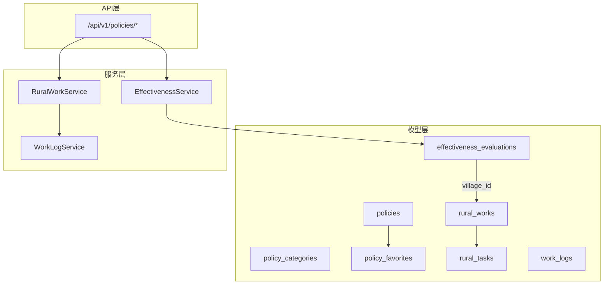
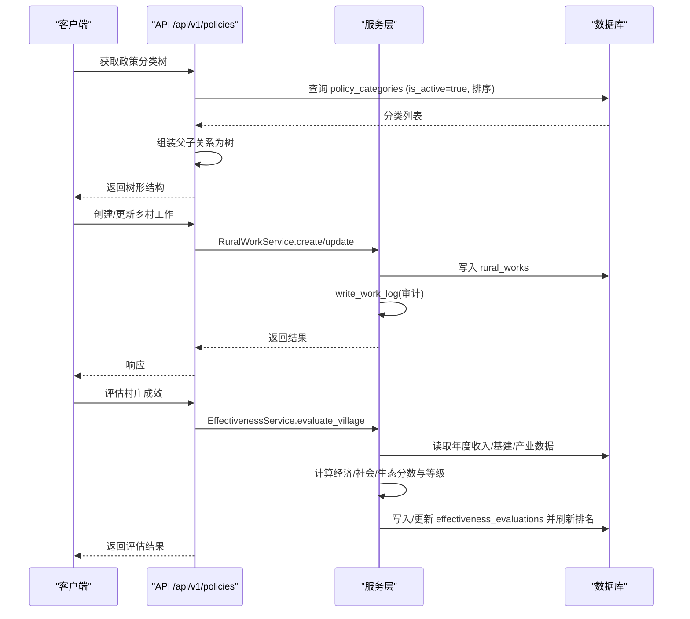
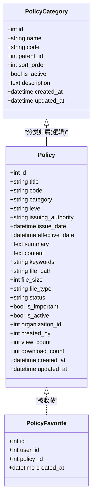
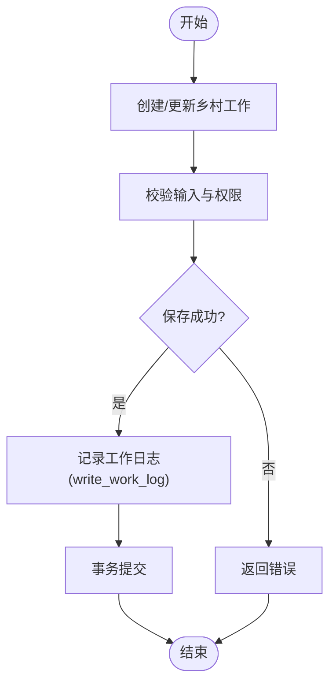
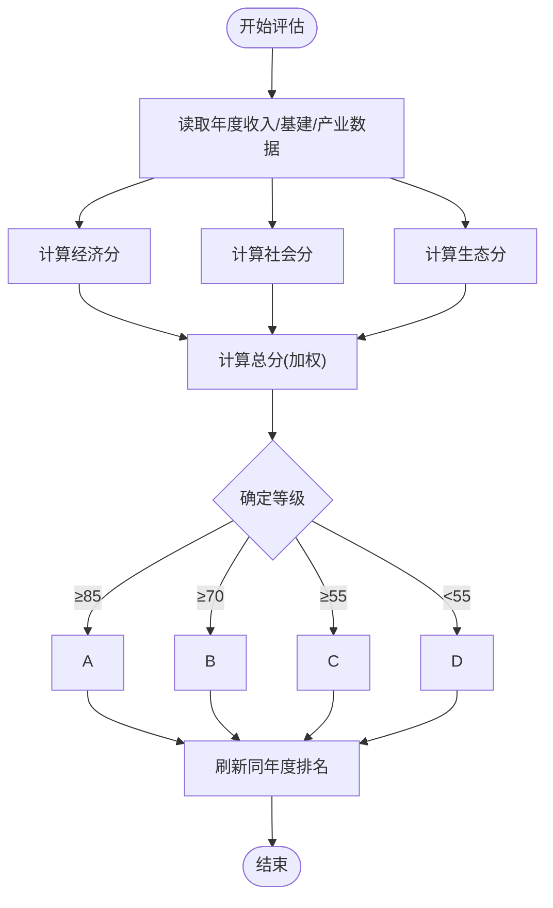
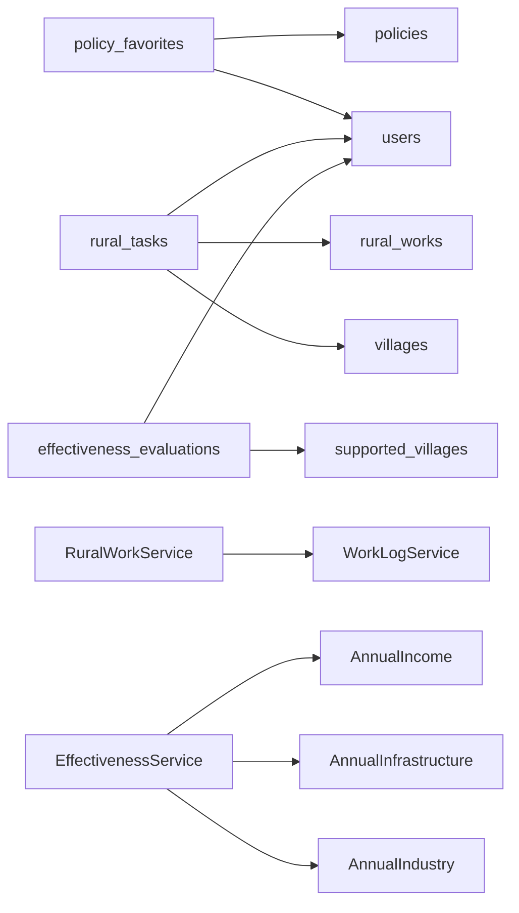

# 政策法规与乡村工作域表结构

<cite>
**本文引用的文件**
- [backend/app/models/policy.py](file://backend/app/models/policy.py)
- [backend/app/models/rural_work.py](file://backend/app/models/rural_work.py)
- [backend/app/models/rural_task.py](file://backend/app/models/rural_task.py)
- [backend/app/models/work_log.py](file://backend/app/models/work_log.py)
- [backend/app/models/effectiveness.py](file://backend/app/models/effectiveness.py)
- [backend/app/services/rural_work_service.py](file://backend/app/services/rural_work_service.py)
- [backend/app/services/work_log_service.py](file://backend/app/services/work_log_service.py)
- [backend/app/services/effectiveness_service.py](file://backend/app/services/effectiveness_service.py)
- [backend/alembic/versions/policy_audit_001_add_policy_fields.py](file://backend/alembic/versions/policy_audit_001_add_policy_fields.py)
- [backend/alembic/versions/recycle_retention_001_add_deleted_at.py](file://backend/alembic/versions/recycle_retention_001_add_deleted_at.py)
- [backend/app/api/v1/policy.py](file://backend/app/api/v1/policy.py)
</cite>

## 目录
1. [简介](#简介)
2. [项目结构](#项目结构)
3. [核心组件](#核心组件)
4. [架构总览](#架构总览)
5. [详细组件分析](#详细组件分析)
6. [依赖关系分析](#依赖关系分析)
7. [性能考虑](#性能考虑)
8. [故障排查指南](#故障排查指南)
9. [结论](#结论)
10. [附录](#附录)

## 简介
本文件面向“政策法规与乡村工作”领域，系统化说明以下7张核心表的设计与实现：
- 政策文件表 policies
- 政策分类表 policy_categories
- 政策收藏表 policy_favorites
- 乡村工作表 rural_works
- 任务表 rural_tasks
- 工作日志表 work_logs
- 成效评估表 effectiveness_evaluations

重点覆盖：
- 政策分类树结构与版本控制机制（状态、软删除、组织隔离）
- 收藏功能实现（用户-政策多对一）
- 乡村工作的任务分配、进度跟踪、日志记录机制
- 成效评估的多维度评分体系与等级评定标准
- 软删除实现、审计字段设计、数据完整性约束
- 业务流程示例与数据关系图

## 项目结构
该领域相关模型集中在 backend/app/models 下，服务逻辑在 backend/app/services 下，API 路由在 backend/app/api/v1 下。迁移脚本位于 backend/alembic/versions。

图表来源
- [backend/app/models/policy.py:38-145](file://backend/app/models/policy.py#L38-L145)
- [backend/app/models/rural_work.py:34-76](file://backend/app/models/rural_work.py#L34-L76)
- [backend/app/models/rural_task.py:56-133](file://backend/app/models/rural_task.py#L56-L133)
- [backend/app/models/work_log.py:10-79](file://backend/app/models/work_log.py#L10-L79)
- [backend/app/models/effectiveness.py:20-54](file://backend/app/models/effectiveness.py#L20-L54)
- [backend/app/services/rural_work_service.py:124-533](file://backend/app/services/rural_work_service.py#L124-L533)
- [backend/app/services/work_log_service.py:9-100](file://backend/app/services/work_log_service.py#L9-L100)
- [backend/app/services/effectiveness_service.py:22-360](file://backend/app/services/effectiveness_service.py#L22-L360)
- [backend/app/api/v1/policy.py:268-311](file://backend/app/api/v1/policy.py#L268-L311)

章节来源
- [backend/app/models/policy.py:38-145](file://backend/app/models/policy.py#L38-L145)
- [backend/app/models/rural_work.py:34-76](file://backend/app/models/rural_work.py#L34-L76)
- [backend/app/models/rural_task.py:56-133](file://backend/app/models/rural_task.py#L56-L133)
- [backend/app/models/work_log.py:10-79](file://backend/app/models/work_log.py#L10-L79)
- [backend/app/models/effectiveness.py:20-54](file://backend/app/models/effectiveness.py#L20-L54)

## 核心组件
- 政策模块
  - PolicyCategory：支持 parent_id 自关联，形成多级分类树；is_active 控制可见性；sort_order 控制排序。
  - Policy：包含发布机关、发布日期、生效日期、内容、附件、状态（active/invalid/draft）、是否重要、软删除 is_active、组织隔离 organization_id、创建人 created_by、查看/下载统计等。
  - PolicyFavorite：用户收藏政策，唯一约束保证同一用户不重复收藏同一政策。
- 乡村工作模块
  - RuralWork：工作项，含类型、状态、所属村、负责人、联系方式（加密）、起止时间、目标、进度、创建/更新人、组织隔离。
  - RuralTask：工作子任务，含年度/季度管理、审批流（提交/批准）、预算与实际花费、进度、责任人、计划/实际起止时间、附件JSON、创建/更新人。
  - WorkLog：工作日志，记录人、日期、内容、关联项目/帮扶村/学校、类别、地点、参与人员、附件路径。
- 成效评估模块
  - EffectivenessEvaluation：按村庄+年份评估，包含经济指标、社会指标、生态指标得分及总分、排名、等级、报告路径、评估人与时间。

章节来源
- [backend/app/models/policy.py:38-145](file://backend/app/models/policy.py#L38-L145)
- [backend/app/models/rural_work.py:34-76](file://backend/app/models/rural_work.py#L34-L76)
- [backend/app/models/rural_task.py:56-133](file://backend/app/models/rural_task.py#L56-L133)
- [backend/app/models/work_log.py:10-79](file://backend/app/models/work_log.py#L10-L79)
- [backend/app/models/effectiveness.py:20-54](file://backend/app/models/effectiveness.py#L20-L54)

## 架构总览
下图展示从API到模型与服务的数据流转，以及关键业务处理点（分类树构建、任务进度、日志记录、评估计算）。

图表来源
- [backend/app/api/v1/policy.py:291-311](file://backend/app/api/v1/policy.py#L291-L311)
- [backend/app/services/rural_work_service.py:260-368](file://backend/app/services/rural_work_service.py#L260-L368)
- [backend/app/services/work_log_service.py:58-100](file://backend/app/services/work_log_service.py#L58-L100)
- [backend/app/services/effectiveness_service.py:132-201](file://backend/app/services/effectiveness_service.py#L132-L201)

## 详细组件分析

### 政策文件与分类树
- 分类树
  - 通过 parent_id 自关联实现多级分类；is_active 控制是否启用；sort_order 控制顺序。
  - API 提供 /categories/tree 接口，将扁平列表转换为树形结构供前端渲染。
- 版本控制与状态
  - 使用 status 枚举（active/invalid/draft）表示政策生命周期；结合 effective_date、issue_date 控制生效与发布。
  - 软删除：is_active 默认 True，用于逻辑删除；配合组织隔离 organization_id 与创建人 created_by 进行权限过滤与审计追溯。
- 收藏功能
  - policy_favorites 表维护 user_id 与 policy_id 的唯一组合，防止重复收藏；删除政策时级联清除收藏记录。

图表来源
- [backend/app/models/policy.py:38-145](file://backend/app/models/policy.py#L38-L145)
- [backend/app/api/v1/policy.py:291-311](file://backend/app/api/v1/policy.py#L291-L311)

章节来源
- [backend/app/models/policy.py:38-145](file://backend/app/models/policy.py#L38-L145)
- [backend/app/api/v1/policy.py:291-311](file://backend/app/api/v1/policy.py#L291-L311)
- [backend/alembic/versions/policy_audit_001_add_policy_fields.py:23-44](file://backend/alembic/versions/policy_audit_001_add_policy_fields.py#L23-L44)

### 乡村工作与任务
- 任务分配与进度跟踪
  - RuralWork 作为工作项，RuralTask 为其子任务，通过 rural_work_id 关联。
  - 任务支持年度/季度管理、审批状态（draft/pending_approval/approved/rejected/in_progress/completed/cancelled）、优先级、预算与实际花费、进度百分比。
  - 责任人字段包括责任单位与负责人，联系方式采用透明加密存储。
- 日志记录机制
  - 所有写操作（创建/更新/删除）均调用 write_work_log 记录审计日志，包含操作类型、实体ID、名称、用户信息、详情等。
  - 日志表支持按用户、日期、关联项目/帮扶村/学校等多维检索。

图表来源
- [backend/app/services/rural_work_service.py:260-368](file://backend/app/services/rural_work_service.py#L260-L368)
- [backend/app/services/work_log_service.py:58-100](file://backend/app/services/work_log_service.py#L58-L100)

章节来源
- [backend/app/models/rural_work.py:34-76](file://backend/app/models/rural_work.py#L34-L76)
- [backend/app/models/rural_task.py:56-133](file://backend/app/models/rural_task.py#L56-L133)
- [backend/app/services/rural_work_service.py:260-368](file://backend/app/services/rural_work_service.py#L260-L368)
- [backend/app/services/work_log_service.py:58-100](file://backend/app/services/work_log_service.py#L58-L100)

### 成效评估多维度评分与等级
- 多维度评分
  - 经济指标：基于人均收入与增长率计算。
  - 社会指标：基于基础设施与产业覆盖数量计算。
  - 生态指标：中性基线加分，依据数据完整度与基建数量调整。
  - 总分 = 经济×0.4 + 社会×0.35 + 生态×0.25（四舍五入保留一位小数）。
- 等级评定
  - A: ≥85；B: ≥70；C: ≥55；D: <55。
- 排名更新
  - 每次评估后，同年度所有评估记录按总分降序重新计算 rank，确保排名一致性与原子提交。

图表来源
- [backend/app/services/effectiveness_service.py:64-129](file://backend/app/services/effectiveness_service.py#L64-L129)
- [backend/app/services/effectiveness_service.py:132-201](file://backend/app/services/effectiveness_service.py#L132-L201)

章节来源
- [backend/app/models/effectiveness.py:20-54](file://backend/app/models/effectiveness.py#L20-L54)
- [backend/app/services/effectiveness_service.py:64-201](file://backend/app/services/effectiveness_service.py#L64-L201)

### 软删除与审计字段设计
- 软删除
  - policies 表通过 is_active 标记逻辑删除；其他表如 supported_villages/projects/funds/schools 通过 deleted_at 时间戳支持回收站保留期计算。
- 审计字段
  - created_by、updated_by、created_at、updated_at 广泛存在于各表中，便于追踪变更历史。
  - 工作日志表 work_logs 集中记录跨模块的审计事件，便于问题定位与合规审计。

章节来源
- [backend/app/models/policy.py:126-141](file://backend/app/models/policy.py#L126-L141)
- [backend/alembic/versions/recycle_retention_001_add_deleted_at.py:29-41](file://backend/alembic/versions/recycle_retention_001_add_deleted_at.py#L29-L41)
- [backend/app/models/rural_work.py:58-65](file://backend/app/models/rural_work.py#L58-L65)
- [backend/app/models/rural_task.py:113-116](file://backend/app/models/rural_task.py#L113-L116)
- [backend/app/models/work_log.py:23-59](file://backend/app/models/work_log.py#L23-L59)

### 数据完整性约束
- 外键约束
  - policy_favorites.policy_id 级联删除；rural_tasks.rural_work_id 允许置空；effectiveness_evaluations.village_id 级联删除。
- 唯一索引
  - policy_categories.code 唯一；rural_tasks.code 唯一；policy_favorites.user_id+policy_id 唯一。
- 检查与枚举
  - 多项字段使用 SQL 枚举或字符串限制取值范围，如政策级别、任务状态、工作类型等。

章节来源
- [backend/app/models/policy.py:48-88](file://backend/app/models/policy.py#L48-L88)
- [backend/app/models/rural_task.py:59-116](file://backend/app/models/rural_task.py#L59-L116)
- [backend/app/models/effectiveness.py:25-41](file://backend/app/models/effectiveness.py#L25-L41)

## 依赖关系分析
- 模型间依赖
  - policy_favorites 引用 policies 与 users。
  - rural_tasks 引用 rural_works、users、villages。
  - effectiveness_evaluations 引用 supported_villages、users。
- 服务依赖
  - RuralWorkService 依赖 WorkLogService 记录审计日志。
  - EffectivenessService 依赖年度收入/基建/产业数据源计算指标。
- API 依赖
  - /api/v1/policies/categories/tree 依赖 PolicyCategory 表与树形组装逻辑。

图表来源
- [backend/app/models/policy.py:64-88](file://backend/app/models/policy.py#L64-L88)
- [backend/app/models/rural_task.py:118-124](file://backend/app/models/rural_task.py#L118-L124)
- [backend/app/models/effectiveness.py:25-41](file://backend/app/models/effectiveness.py#L25-L41)
- [backend/app/services/rural_work_service.py:124-533](file://backend/app/services/rural_work_service.py#L124-L533)
- [backend/app/services/work_log_service.py:9-100](file://backend/app/services/work_log_service.py#L9-L100)
- [backend/app/services/effectiveness_service.py:64-129](file://backend/app/services/effectiveness_service.py#L64-L129)

章节来源
- [backend/app/models/policy.py:64-88](file://backend/app/models/policy.py#L64-L88)
- [backend/app/models/rural_task.py:118-124](file://backend/app/models/rural_task.py#L118-L124)
- [backend/app/models/effectiveness.py:25-41](file://backend/app/models/effectiveness.py#L25-L41)
- [backend/app/services/rural_work_service.py:124-533](file://backend/app/services/rural_work_service.py#L124-L533)
- [backend/app/services/work_log_service.py:9-100](file://backend/app/services/work_log_service.py#L9-L100)
- [backend/app/services/effectiveness_service.py:64-129](file://backend/app/services/effectiveness_service.py#L64-L129)

## 性能考虑
- 索引优化
  - policies：status、level、category、issue_date、status+level 复合索引提升筛选与排序效率。
  - policy_categories：parent_id、is_active 索引加速树查询与过滤。
  - rural_tasks：work+year、status、category、village、year 索引提升多维查询性能。
  - work_logs：user_id、project_id、village_id、log_date 及 user_id+log_date 复合索引优化检索。
- 查询优化
  - 使用 extract(year,...) 进行年份筛选，避免全表扫描。
  - 评估排名在同一事务中批量更新，减少多次提交开销。

章节来源
- [backend/app/models/policy.py:96-102](file://backend/app/models/policy.py#L96-L102)
- [backend/app/models/policy.py:43-46](file://backend/app/models/policy.py#L43-L46)
- [backend/app/models/rural_task.py:126-132](file://backend/app/models/rural_task.py#L126-L132)
- [backend/app/models/work_log.py:15-21](file://backend/app/models/work_log.py#L15-L21)
- [backend/app/services/effectiveness_service.py:186-197](file://backend/app/services/effectiveness_service.py#L186-L197)

## 故障排查指南
- 工作日志写入失败
  - 现象：write_work_log 因 user_id 为 None 导致异常。
  - 处理：防御性检查跳过写入并记录警告，不影响主流程。
- 评估排名不一致
  - 现象：评估写入成功但排名未更新。
  - 处理：确保评估与排名更新在同一事务内提交，避免部分成功。
- 分类树为空
  - 现象：/categories/tree 返回空数组。
  - 处理：检查 policy_categories.is_active 与排序字段，确认数据存在且启用。

章节来源
- [backend/app/services/work_log_service.py:80-89](file://backend/app/services/work_log_service.py#L80-L89)
- [backend/app/services/effectiveness_service.py:186-197](file://backend/app/services/effectiveness_service.py#L186-L197)
- [backend/app/api/v1/policy.py:291-311](file://backend/app/api/v1/policy.py#L291-L311)

## 结论
本方案通过清晰的模型设计与服务编排，实现了政策法规与乡村工作域的核心能力：
- 政策分类树与版本控制满足复杂分类与生命周期管理需求。
- 乡村工作与任务体系支持全流程跟踪与审计。
- 成效评估提供多维度评分与等级评定，支撑决策与分析。
- 软删除与审计字段保障数据安全与可追溯性。
- 索引与事务优化提升系统性能与一致性。

## 附录
- 业务流程示例
  - 政策分类树查询：客户端请求 -> API 查询分类 -> 组装树 -> 返回。
  - 乡村工作创建：客户端请求 -> 服务校验 -> 写入工作 -> 记录日志 -> 提交事务 -> 返回。
  - 成效评估：客户端请求 -> 读取年度数据 -> 计算分数与等级 -> 写入评估 -> 刷新排名 -> 返回。
- 数据关系图
  - 见“架构总览”中的 ER 关系示意，涵盖政策、分类、收藏、工作、任务、日志、评估之间的关联。