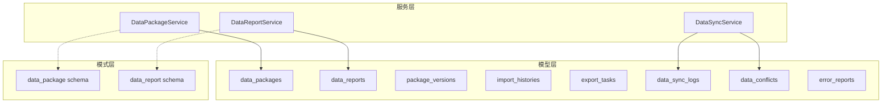
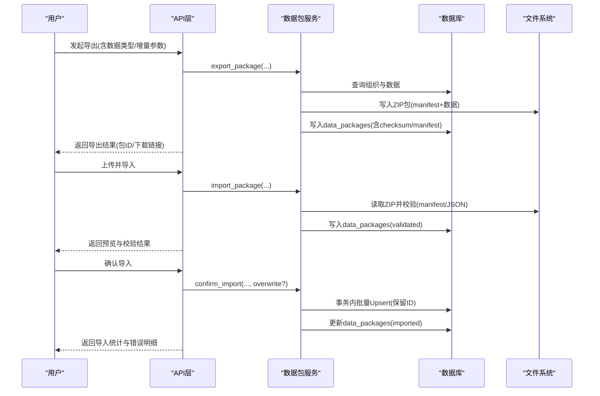
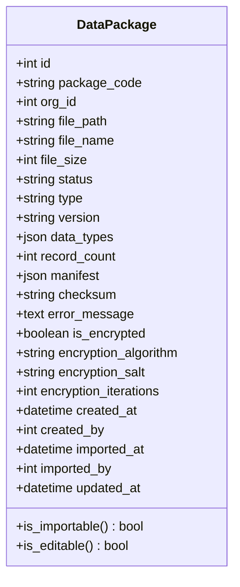
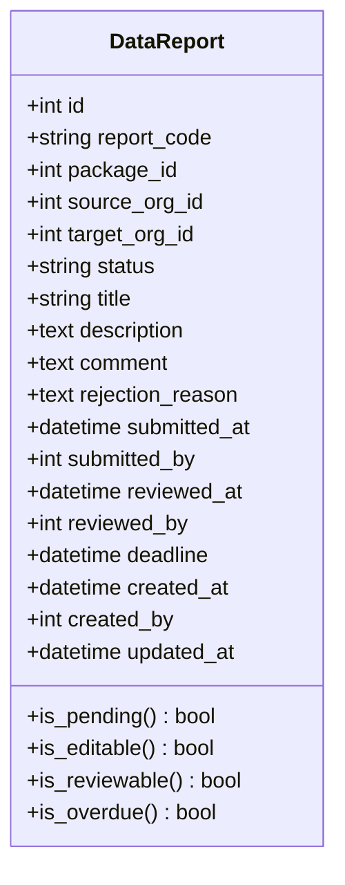
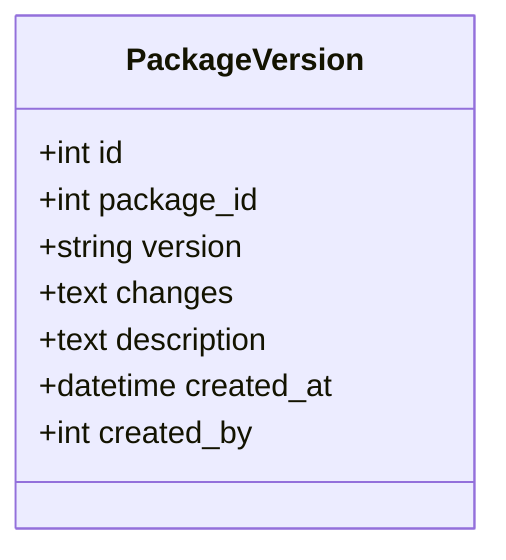
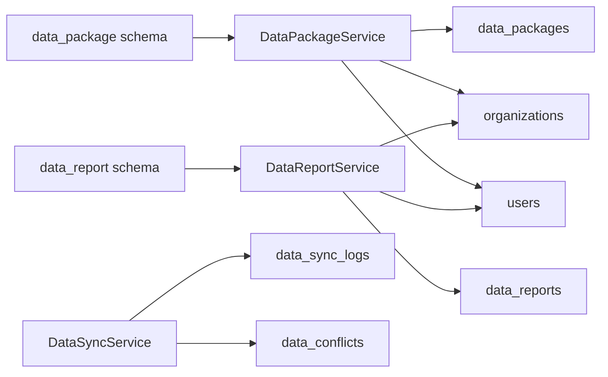
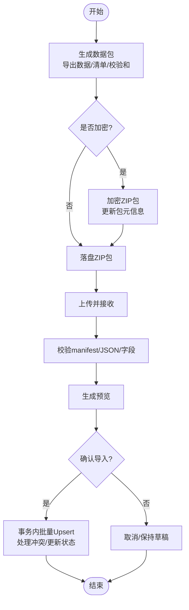
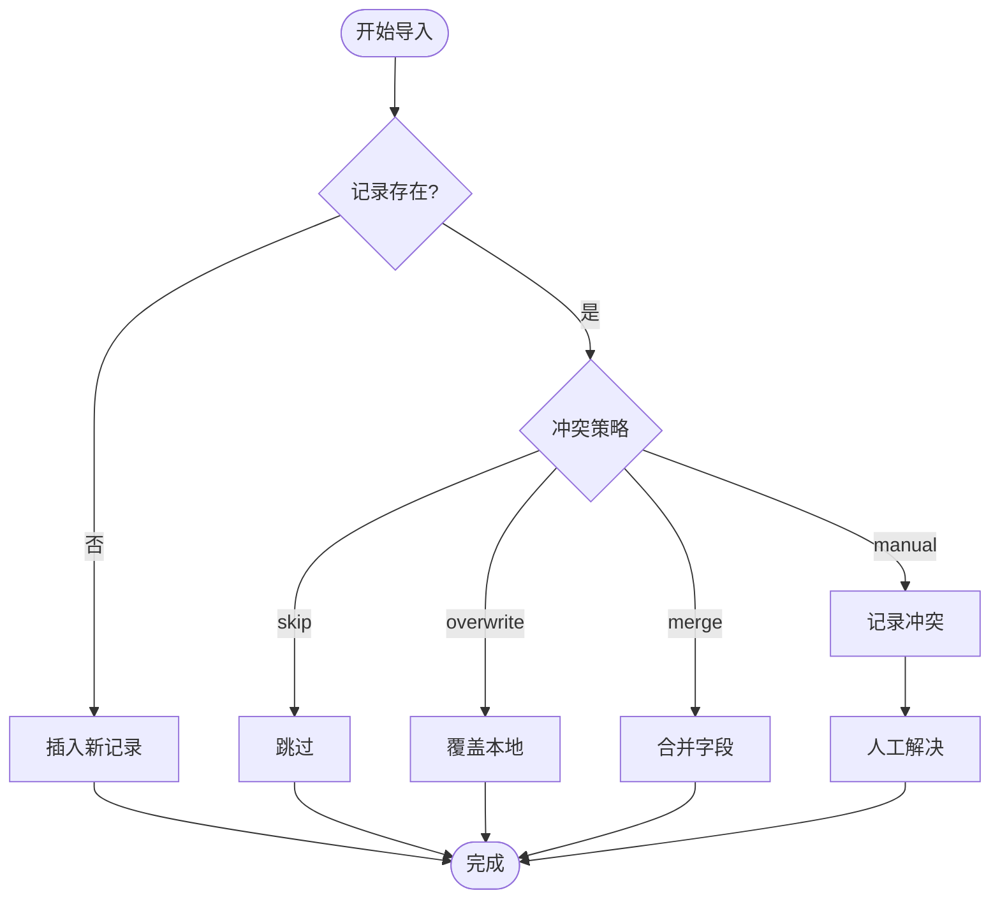

# 数据上报与同步域表结构

<cite>
**本文引用的文件**
- [data_package.py](file://backend/app/models/data_package.py)
- [data_report.py](file://backend/app/models/data_report.py)
- [package_version.py](file://backend/app/models/package_version.py)
- [data_sync.py](file://backend/app/models/data_sync.py)
- [import_history.py](file://backend/app/models/import_history.py)
- [export_task.py](file://backend/app/models/export_task.py)
- [import_export_history.py](file://backend/app/models/import_export_history.py)
- [error_report.py](file://backend/app/models/error_report.py)
- [data_package_service.py](file://backend/app/services/data_package_service.py)
- [data_report_service.py](file://backend/app/services/data_report_service.py)
- [data_sync_service.py](file://backend/app/services/data_sync_service.py)
- [data_package_schema.py](file://backend/app/schemas/data_package.py)
- [data_report_schema.py](file://backend/app/schemas/data_report.py)
</cite>

## 目录
1. [简介](#简介)
2. [项目结构](#项目结构)
3. [核心组件](#核心组件)
4. [架构总览](#架构总览)
5. [详细组件分析](#详细组件分析)
6. [依赖关系分析](#依赖关系分析)
7. [性能考量](#性能考量)
8. [故障排查指南](#故障排查指南)
9. [结论](#结论)
10. [附录](#附录)

## 简介
本文件围绕“数据上报与同步”领域，系统化说明8张数据同步相关表的设计与使用：数据包档案表、上报单表、包版本管理表、导入导出历史、异步导出任务、导入历史记录、数据同步日志与冲突记录、错误报告。重点覆盖两种数据包（Task任务包与Report上报包）的完整生命周期（生成、加密、导出、接收、校验、导入），增量同步机制（sync_version 版本号管理与冲突解决策略），Excel批量导入的历史记录与异步导出任务实现，以及数据完整性校验、错误处理与审计日志。文末提供多机协同同步示例与排障建议。

## 项目结构
该能力由模型层（models）、服务层（services）、模式定义（schemas）共同构成：
- 模型层：定义数据表结构与关系，如 data_packages、data_reports、package_versions、import_histories、export_tasks、data_sync_logs、data_conflicts、error_reports。
- 服务层：封装业务逻辑，如数据包导出/导入/验证/确认、上报工作流、增量同步与冲突处理、加密包处理等。
- 模式层：定义请求/响应数据结构，约束字段与枚举值，保障接口契约一致性。

图表来源
- [data_package.py:38-123](file://backend/app/models/data_package.py#L38-L123)
- [data_report.py:29-141](file://backend/app/models/data_report.py#L29-L141)
- [package_version.py:15-44](file://backend/app/models/package_version.py#L15-L44)
- [data_sync.py:8-72](file://backend/app/models/data_sync.py#L8-L72)
- [import_history.py:33-107](file://backend/app/models/import_history.py#L33-L107)
- [export_task.py:28-121](file://backend/app/models/export_task.py#L28-L121)
- [import_export_history.py:39-120](file://backend/app/models/import_export_history.py#L39-L120)
- [error_report.py:8-36](file://backend/app/models/error_report.py#L8-L36)
- [data_package_service.py:68-800](file://backend/app/services/data_package_service.py#L68-L800)
- [data_report_service.py:81-492](file://backend/app/services/data_report_service.py#L81-L492)
- [data_sync_service.py:87-933](file://backend/app/services/data_sync_service.py#L87-L933)

章节来源
- [data_package.py:38-123](file://backend/app/models/data_package.py#L38-L123)
- [data_report.py:29-141](file://backend/app/models/data_report.py#L29-L141)
- [package_version.py:15-44](file://backend/app/models/package_version.py#L15-L44)
- [data_sync.py:8-72](file://backend/app/models/data_sync.py#L8-L72)
- [import_history.py:33-107](file://backend/app/models/import_history.py#L33-L107)
- [export_task.py:28-121](file://backend/app/models/export_task.py#L28-L121)
- [import_export_history.py:39-120](file://backend/app/models/import_export_history.py#L39-L120)
- [error_report.py:8-36](file://backend/app/models/error_report.py#L8-L36)

## 核心组件
- 数据包档案表（data_packages）：记录每次导出的包元信息、状态、清单、校验和、加密信息等，支撑上报包与任务包的统一归档。
- 上报单表（data_reports）：描述从下级到上级的上报流程，包含提交、审批、拒绝、取消等状态流转及截止时间。
- 包版本管理表（package_versions）：对数据包进行版本化追踪，记录变更内容与说明。
- 导入导出历史（import_export_history）：审计所有导入/导出/预览/验证/确认等操作，支持合规追溯。
- 异步导出任务（export_tasks）：支持大数据量异步导出，跟踪任务状态、过期时间、下载链接等。
- 导入历史记录（import_histories）：记录Excel批量导入过程、成功失败行数、错误详情与成功率。
- 数据同步日志（data_sync_logs）：记录增量/全量导出与导入的执行情况、统计信息与错误明细。
- 数据冲突记录（data_conflicts）：记录导入时的冲突详情、本地与导入数据、解决策略与合并结果。
- 错误报告（error_reports）：持久化系统错误，便于问题定位与闭环处理。

章节来源
- [data_package.py:38-123](file://backend/app/models/data_package.py#L38-L123)
- [data_report.py:29-141](file://backend/app/models/data_report.py#L29-L141)
- [package_version.py:15-44](file://backend/app/models/package_version.py#L15-L44)
- [import_export_history.py:39-120](file://backend/app/models/import_export_history.py#L39-L120)
- [export_task.py:28-121](file://backend/app/models/export_task.py#L28-L121)
- [import_history.py:33-107](file://backend/app/models/import_history.py#L33-L107)
- [data_sync.py:8-72](file://backend/app/models/data_sync.py#L8-L72)
- [error_report.py:8-36](file://backend/app/models/error_report.py#L8-L36)

## 架构总览
数据上报与同步的核心流程包括：
- 导出：按组织或用户范围导出数据为ZIP包，生成manifest清单与校验和；可选增量导出（基于 sync_version 或 updated_at）。
- 加密：对ZIP包进行AES-256-Fernet-PBKDF2加密，更新包记录的加密元信息。
- 接收与校验：上传后读取manifest与数据文件，进行格式与字段级校验，生成预览。
- 导入：在事务中执行批量Upsert，保留原始ID避免外键孤儿；支持冲突策略（跳过/覆盖/合并/手动）。
- 上报：创建上报单，关联数据包，提交后进入审批流，支持通知与逾期检测。
- 同步：增量导出/导入，记录同步日志与冲突，支持手动解决。

图表来源
- [data_package_service.py:98-181](file://backend/app/services/data_package_service.py#L98-L181)
- [data_package_service.py:239-284](file://backend/app/services/data_package_service.py#L239-L284)
- [data_package_service.py:397-481](file://backend/app/services/data_package_service.py#L397-L481)
- [data_package.py:38-123](file://backend/app/models/data_package.py#L38-L123)

## 详细组件分析

### 数据包档案表（data_packages）
- 关键字段：包编码、组织ID、文件路径/名称/大小、状态、类型(task/report/update)、版本、数据类型、记录数、清单、校验和、错误信息、是否加密、加密算法/盐/迭代次数、创建/导入时间与人员。
- 状态机：草稿→待处理→已验证→已导入/失败/取消；is_importable/is_editable属性辅助前端控制。
- 索引：org_id、status、created_at提升查询性能。

图表来源
- [data_package.py:38-123](file://backend/app/models/data_package.py#L38-L123)

章节来源
- [data_package.py:38-123](file://backend/app/models/data_package.py#L38-L123)

### 上报单表（data_reports）
- 关键字段：上报编码、关联数据包、来源组织（下级）、目标组织（上级）、状态、标题/说明/意见/拒绝原因、提交/审批时间与人员、截止时间。
- 状态机：草稿→已提交→已批准/已拒绝/已取消；支持逾期判断与可编辑性检查。
- 索引：source_org_id、target_org_id、status、submitted_at、deadline。

图表来源
- [data_report.py:29-141](file://backend/app/models/data_report.py#L29-L141)

章节来源
- [data_report.py:29-141](file://backend/app/models/data_report.py#L29-L141)

### 包版本管理表（package_versions）
- 关键字段：关联数据包ID、版本号、变更记录(JSON)、版本说明、创建时间与人员。
- 用途：对数据包进行版本化追踪，便于回溯与审计。

图表来源
- [package_version.py:15-44](file://backend/app/models/package_version.py#L15-L44)

章节来源
- [package_version.py:15-44](file://backend/app/models/package_version.py#L15-L44)

### 导入导出历史（import_export_history）
- 关键字段：关联数据包、操作类型(export/import/preview/validate/confirm/cancel/delete)、组织ID、用户ID、操作时间、结果、详情JSON、错误信息、文件名/大小/记录数/耗时/IP/UA等。
- 用途：审计追踪所有数据包相关操作，满足合规要求。

章节来源
- [import_export_history.py:39-120](file://backend/app/models/import_export_history.py#L39-L120)

### 异步导出任务（export_tasks）
- 关键字段：用户ID、任务UUID、导出类型、查询参数、文件路径/名称/大小、记录数、状态(pending/processing/completed/failed/expired)、错误信息、过期时间、开始/完成时间。
- 用途：支持大数据量异步导出，提供下载与过期控制。

章节来源
- [export_task.py:28-121](file://backend/app/models/export_task.py#L28-L121)

### 导入历史记录（import_histories）
- 关键字段：用户ID、文件名/大小、导入模式(incremental/full)、实体类型、总行数/成功/失败、错误详情、状态、开始/完成时间。
- 用途：记录Excel批量导入过程与结果，计算成功率。

章节来源
- [import_history.py:33-107](file://backend/app/models/import_history.py#L33-L107)

### 数据同步日志（data_sync_logs）与冲突记录（data_conflicts）
- 同步日志：记录导出/导入类型、状态、包名/路径、since_time、模块列表、是否包含文件、冲突策略、冲突数量、总/成功/失败记录数、详情、错误信息、操作人、起止时间。
- 冲突记录：关联同步日志、表名/记录ID、冲突类型(duplicate/modified/deleted)、本地与导入数据、解决方案(keep_local/use_import/merge/skip)、是否已解决、解决人与时间、合并数据、备注。

章节来源
- [data_sync.py:8-72](file://backend/app/models/data_sync.py#L8-L72)

### 错误报告（error_reports）
- 关键字段：来源模块、错误类型、消息、堆栈、上下文(JSON)、严重程度、状态(open/resolved/ignored/in_progress)、报告人、解决时间、处理备注。
- 用途：持久化系统错误，便于问题定位与闭环。

章节来源
- [error_report.py:8-36](file://backend/app/models/error_report.py#L8-L36)

## 依赖关系分析
- 数据包服务依赖模型：DataPackage、Organization、User等；通过Schema约束输入输出。
- 上报服务依赖模型：DataReport、DataPackage、Organization、User；维护状态转换与通知。
- 同步服务依赖模型：DataSyncLog、DataConflict；通过白名单与敏感表限制确保导入安全。
- 模式层提供强类型契约，减少前后端不一致风险。

图表来源
- [data_package_service.py:68-800](file://backend/app/services/data_package_service.py#L68-L800)
- [data_report_service.py:81-492](file://backend/app/services/data_report_service.py#L81-L492)
- [data_sync_service.py:87-933](file://backend/app/services/data_sync_service.py#L87-L933)
- [data_package_schema.py:61-170](file://backend/app/schemas/data_package.py#L61-L170)
- [data_report_schema.py:17-107](file://backend/app/schemas/data_report.py#L17-L107)

章节来源
- [data_package_service.py:68-800](file://backend/app/services/data_package_service.py#L68-L800)
- [data_report_service.py:81-492](file://backend/app/services/data_report_service.py#L81-L492)
- [data_sync_service.py:87-933](file://backend/app/services/data_sync_service.py#L87-L933)
- [data_package_schema.py:61-170](file://backend/app/schemas/data_package.py#L61-L170)
- [data_report_schema.py:17-107](file://backend/app/schemas/data_report.py#L17-L107)

## 性能考量
- 批量Upsert：在服务层使用SQLite INSERT OR UPDATE/DO NOTHING，保留原始ID，避免外键孤儿，减少N+1插入开销。
- 独占写锁：导入时使用exclusive_write防止SQLite_BUSY，结合SAVEPOINT保证事务原子性。
- 增量导出：基于sync_version或updated_at过滤，降低带宽与存储压力。
- 索引优化：为常用查询字段建立索引（org_id、status、created_at、submitted_at、deadline等）。
- 大文件处理：ZIP打包与分块读取，避免一次性加载大对象到内存。

章节来源
- [data_package_service.py:412-559](file://backend/app/services/data_package_service.py#L412-L559)
- [data_sync_service.py:128-233](file://backend/app/services/data_sync_service.py#L128-L233)

## 故障排查指南
- 数据包校验失败：检查manifest.json是否存在、版本是否受支持、数据文件是否齐全、JSON格式是否正确；查看errors与warnings。
- 导入失败：确认数据包状态为validated；查看事务回滚后的错误信息；检查字段清洗与类型转换；核对组织映射与权限。
- 冲突处理：根据策略选择skip/overwrite/merge/manual；在data_conflicts中查看本地与导入数据差异，手动resolve。
- 加密包导入：确认密码正确；若提示解析失败，检查加密参数与salt/iterations；临时解密文件需清理。
- 异步导出超时：检查任务状态与过期时间；确认文件路径与权限；必要时重试或调整并发。
- Excel导入失败：查看import_histories中的错误详情与成功率；修正模板字段与数据类型后重试。
- 审计与日志：通过import_export_history与data_sync_logs定位操作轨迹；结合error_reports快速定位异常。

章节来源
- [data_package_service.py:286-365](file://backend/app/services/data_package_service.py#L286-L365)
- [data_package_service.py:613-687](file://backend/app/services/data_package_service.py#L613-L687)
- [data_sync_service.py:407-574](file://backend/app/services/data_sync_service.py#L407-L574)
- [import_history.py:33-107](file://backend/app/models/import_history.py#L33-L107)
- [import_export_history.py:39-120](file://backend/app/models/import_export_history.py#L39-L120)
- [data_sync.py:8-72](file://backend/app/models/data_sync.py#L8-L72)
- [error_report.py:8-36](file://backend/app/models/error_report.py#L8-L36)

## 结论
本方案通过统一的包模型与上报工作流，结合增量同步与冲突处理，实现了跨组织的数据上报与多机协同同步。借助完善的审计与错误报告机制，保障了数据的完整性与可追溯性。建议在大规模场景下持续优化索引与并发控制，并结合自动化测试与监控提升稳定性。

## 附录

### 两种数据包的生命周期（Task任务包与Report上报包）
- 生成：按组织/用户范围导出数据，生成manifest与校验和；可选增量导出。
- 加密：对ZIP包进行加密，更新包记录的加密元信息。
- 导出：落盘ZIP包，记录data_packages与审计历史。
- 接收：上传后读取manifest与数据文件，进行格式与字段级校验，生成预览。
- 校验：校验版本、清单、JSON格式、字段合法性，汇总warnings/errors。
- 导入：在事务中批量Upsert，保留原始ID；支持冲突策略；更新包状态为已导入。

图表来源
- [data_package_service.py:98-181](file://backend/app/services/data_package_service.py#L98-L181)
- [data_package_service.py:239-284](file://backend/app/services/data_package_service.py#L239-L284)
- [data_package_service.py:397-481](file://backend/app/services/data_package_service.py#L397-L481)
- [data_package_service.py:565-611](file://backend/app/services/data_package_service.py#L565-L611)

章节来源
- [data_package_service.py:98-181](file://backend/app/services/data_package_service.py#L98-L181)
- [data_package_service.py:239-284](file://backend/app/services/data_package_service.py#L239-L284)
- [data_package_service.py:397-481](file://backend/app/services/data_package_service.py#L397-L481)
- [data_package_service.py:565-611](file://backend/app/services/data_package_service.py#L565-L611)

### 增量同步机制（sync_version与冲突解决）
- 增量导出：当incremental=True时，按sync_version或updated_at过滤变更记录，仅导出变更数据。
- 冲突策略：
  - skip：跳过已有记录。
  - overwrite：覆盖本地记录。
  - merge：合并字段差异（智能策略依据更新时间与差异程度）。
  - manual：记录冲突供人工处理。
- 冲突记录：在data_conflicts中保存本地与导入数据、冲突类型与解决方案，支持后续resolve。

图表来源
- [data_sync_service.py:407-574](file://backend/app/services/data_sync_service.py#L407-L574)
- [data_package_service.py:689-755](file://backend/app/services/data_package_service.py#L689-L755)

章节来源
- [data_sync_service.py:407-574](file://backend/app/services/data_sync_service.py#L407-L574)
- [data_package_service.py:689-755](file://backend/app/services/data_package_service.py#L689-L755)

### Excel批量导入历史记录与异步导出任务
- 导入历史：记录文件名、大小、模式、实体类型、总/成功/失败行数、错误详情、状态、起止时间；计算成功率。
- 异步导出：创建任务记录，状态流转pending→processing→completed/failed/expired；支持过期控制与下载。

章节来源
- [import_history.py:33-107](file://backend/app/models/import_history.py#L33-L107)
- [export_task.py:28-121](file://backend/app/models/export_task.py#L28-L121)

### 数据完整性校验、错误处理与审计日志
- 完整性校验：manifest版本与清单校验、JSON格式校验、字段级校验（ok/corrected/rejected计数与明细）。
- 错误处理：捕获异常并记录错误信息；导入失败回滚事务；标记包状态为failed。
- 审计日志：import_export_history记录所有操作；data_sync_logs记录同步执行细节；error_reports持久化系统错误。

章节来源
- [data_package_service.py:286-365](file://backend/app/services/data_package_service.py#L286-L365)
- [data_package_service.py:397-481](file://backend/app/services/data_package_service.py#L397-L481)
- [import_export_history.py:39-120](file://backend/app/models/import_export_history.py#L39-L120)
- [data_sync.py:8-72](file://backend/app/models/data_sync.py#L8-L72)
- [error_report.py:8-36](file://backend/app/models/error_report.py#L8-L36)

### 多机协同数据同步使用示例
- 场景A：下级单位导出上报包（report），加密后传输至上级单位；上级接收、校验、预览、确认导入。
- 场景B：管理员分发任务包（task），下级导入并回填数据；再次导出增量包反馈变更。
- 场景C：跨机增量同步，基于sync_version或updated_at导出变更，导入时采用merge策略合并差异。

步骤要点：
- 导出：选择数据类型与增量参数，生成ZIP与manifest，计算校验和。
- 加密：设置密码，生成.enc文件，更新包元信息。
- 接收：上传后自动识别加密包，解密并校验。
- 导入：选择冲突策略，事务内批量Upsert，记录审计与同步日志。

章节来源
- [data_package_service.py:98-181](file://backend/app/services/data_package_service.py#L98-L181)
- [data_package_service.py:565-611](file://backend/app/services/data_package_service.py#L565-L611)
- [data_package_service.py:613-687](file://backend/app/services/data_package_service.py#L613-L687)
- [data_sync_service.py:576-800](file://backend/app/services/data_sync_service.py#L576-L800)