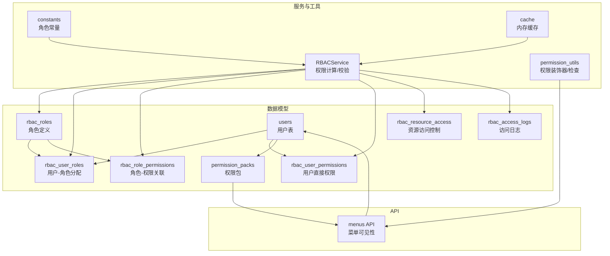
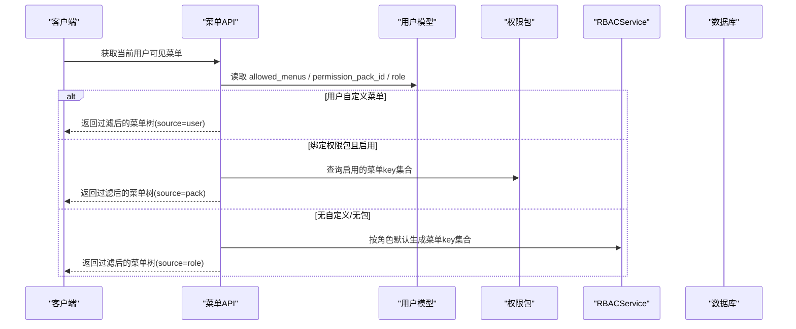
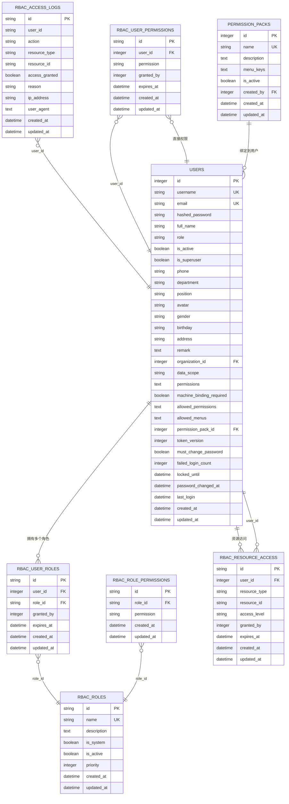
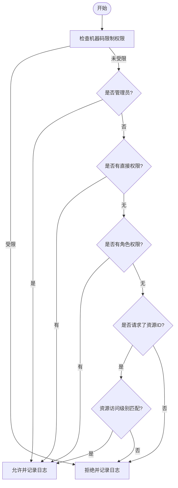
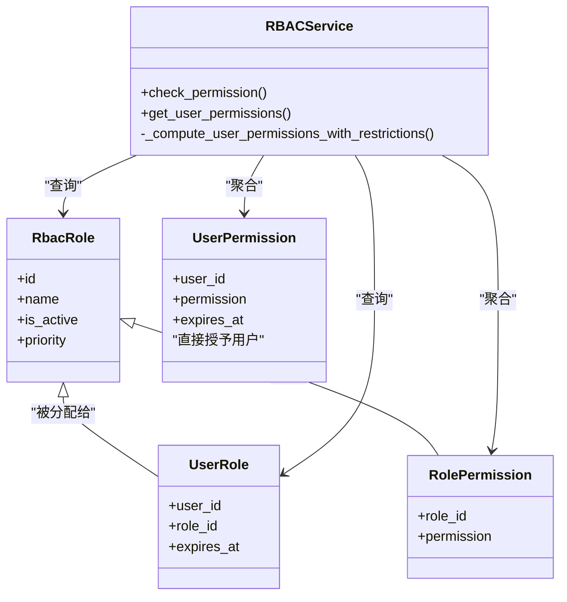
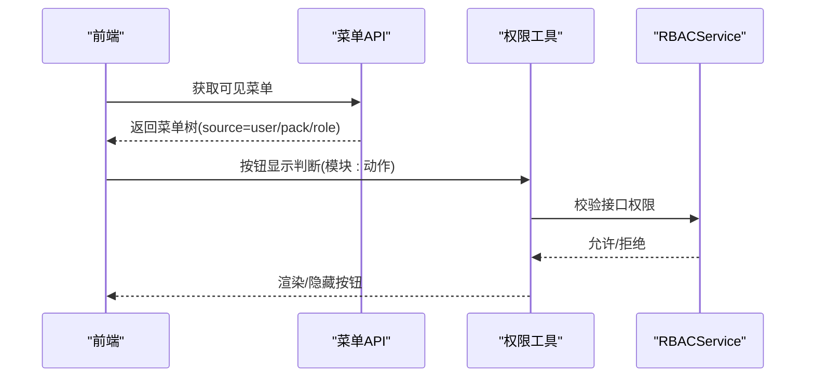
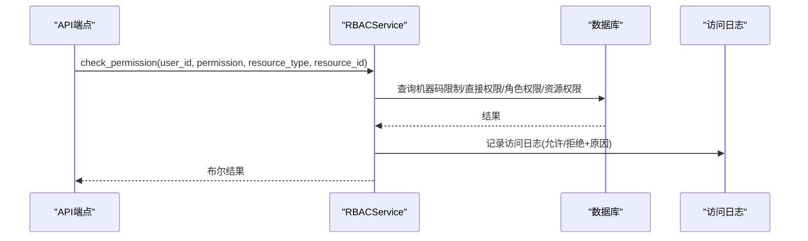
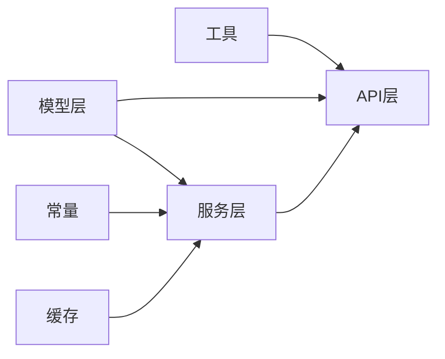

# RBAC权限系统表

<cite>
**本文引用的文件**
- [backend/app/models/rbac.py](file://backend/app/models/rbac.py)
- [backend/app/models/user.py](file://backend/app/models/user.py)
- [backend/app/models/permission_pack.py](file://backend/app/models/permission_pack.py)
- [backend/app/services/rbac_service.py](file://backend/app/services/rbac_service.py)
- [backend/app/core/constants.py](file://backend/app/core/constants.py)
- [backend/app/core/permission_utils.py](file://backend/app/core/permission_utils.py)
- [backend/app/api/v1/menus.py](file://backend/app/api/v1/menus.py)
- [backend/app/core/cache.py](file://backend/app/core/cache.py)
</cite>

## 目录
1. [简介](#简介)
2. [项目结构](#项目结构)
3. [核心组件](#核心组件)
4. [架构总览](#架构总览)
5. [详细组件分析](#详细组件分析)
6. [依赖关系分析](#依赖关系分析)
7. [性能与缓存](#性能与缓存)
8. [故障排查指南](#故障排查指南)
9. [结论](#结论)
10. [附录](#附录)

## 简介
本文件面向RBAC（基于角色的访问控制）权限系统的数据库表设计与实现，覆盖角色定义、用户角色分配、角色权限关联、资源访问控制、访问日志等核心表；并说明菜单权限、按钮权限、API权限的分级控制策略，以及权限验证流程、权限包机制、权限缓存与性能优化方案。文档同时给出最佳实践与常见使用模式，帮助开发者快速理解与正确使用该权限体系。

## 项目结构
本项目将RBAC相关的数据模型集中在后端模型层，服务层封装权限计算与校验逻辑，API层提供菜单与权限管理接口，常量与工具模块提供角色常量、权限装饰器与组织隔离能力。

图表来源
- [backend/app/models/rbac.py:31-218](file://backend/app/models/rbac.py#L31-L218)
- [backend/app/models/user.py:26-85](file://backend/app/models/user.py#L26-L85)
- [backend/app/models/permission_pack.py:16-47](file://backend/app/models/permission_pack.py#L16-L47)
- [backend/app/services/rbac_service.py:104-320](file://backend/app/services/rbac_service.py#L104-L320)
- [backend/app/core/constants.py:27-50](file://backend/app/core/constants.py#L27-L50)
- [backend/app/core/permission_utils.py:272-359](file://backend/app/core/permission_utils.py#L272-L359)
- [backend/app/api/v1/menus.py:50-607](file://backend/app/api/v1/menus.py#L50-L607)
- [backend/app/core/cache.py:14-137](file://backend/app/core/cache.py#L14-L137)

章节来源
- [backend/app/models/rbac.py:31-218](file://backend/app/models/rbac.py#L31-L218)
- [backend/app/models/user.py:26-85](file://backend/app/models/user.py#L26-L85)
- [backend/app/models/permission_pack.py:16-47](file://backend/app/models/permission_pack.py#L16-L47)
- [backend/app/services/rbac_service.py:104-320](file://backend/app/services/rbac_service.py#L104-L320)
- [backend/app/core/constants.py:27-50](file://backend/app/core/constants.py#L27-L50)
- [backend/app/core/permission_utils.py:272-359](file://backend/app/core/permission_utils.py#L272-L359)
- [backend/app/api/v1/menus.py:50-607](file://backend/app/api/v1/menus.py#L50-L607)
- [backend/app/core/cache.py:14-137](file://backend/app/core/cache.py#L14-L137)

## 核心组件
- 角色与权限模型：角色定义、用户角色分配、角色权限关联、用户直接权限、资源访问控制、访问日志。
- 用户模型：包含基础信息、角色字段、白名单权限、可见菜单配置、权限包绑定等。
- 权限包模型：用于批量授予菜单可见性的“套餐”。
- RBAC服务：权限计算、校验、授权/撤销、日志记录、机器码限制集成。
- 常量与工具：角色常量、管理员判定、权限装饰器、组织访问控制。
- 菜单API：根据用户配置、权限包、角色默认计算可见菜单树。
- 缓存：进程内内存缓存，支持TTL与键前缀清理。

章节来源
- [backend/app/models/rbac.py:31-218](file://backend/app/models/rbac.py#L31-L218)
- [backend/app/models/user.py:26-85](file://backend/app/models/user.py#L26-L85)
- [backend/app/models/permission_pack.py:16-47](file://backend/app/models/permission_pack.py#L16-L47)
- [backend/app/services/rbac_service.py:104-320](file://backend/app/services/rbac_service.py#L104-L320)
- [backend/app/core/constants.py:27-50](file://backend/app/core/constants.py#L27-L50)
- [backend/app/core/permission_utils.py:272-359](file://backend/app/core/permission_utils.py#L272-L359)
- [backend/app/api/v1/menus.py:50-607](file://backend/app/api/v1/menus.py#L50-L607)
- [backend/app/core/cache.py:14-137](file://backend/app/core/cache.py#L14-L137)

## 架构总览
RBAC权限体系由“角色-权限”为核心，辅以“用户直接权限”和“资源级访问控制”，并通过“权限包”对菜单可见性进行批量控制。权限校验在服务层统一完成，结合常量与工具模块在API层以装饰器形式落地。

图表来源
- [backend/app/api/v1/menus.py:560-607](file://backend/app/api/v1/menus.py#L560-L607)
- [backend/app/models/user.py:63-77](file://backend/app/models/user.py#L63-L77)
- [backend/app/models/permission_pack.py:16-47](file://backend/app/models/permission_pack.py#L16-L47)

章节来源
- [backend/app/api/v1/menus.py:560-607](file://backend/app/api/v1/menus.py#L560-L607)
- [backend/app/models/user.py:63-77](file://backend/app/models/user.py#L63-L77)
- [backend/app/models/permission_pack.py:16-47](file://backend/app/models/permission_pack.py#L16-L47)

## 详细组件分析

### 数据模型与表设计
- rbac_roles（角色定义）
  - 主键id、唯一name、描述、是否系统内置、是否启用、优先级、时间戳
  - 索引：name唯一
  - 用途：定义系统中的角色及其属性
- rbac_user_roles（用户角色分配）
  - 主键id、user_id、role_id、授权人、过期时间、时间戳
  - 索引：(user_id, role_id)
  - 用途：将用户与角色关联，支持临时授权与过期控制
- rbac_role_permissions（角色权限关联）
  - 主键id、role_id、permission（权限标识）、时间戳
  - 索引：(role_id, permission)
  - 用途：为角色赋予细粒度权限标识
- rbac_user_permissions（用户直接权限）
  - 主键id、user_id、permission、授权人、过期时间、时间戳
  - 索引：(user_id, permission)
  - 用途：对用户进行细粒度直接授权
- rbac_resource_access（资源访问控制）
  - 主键id、user_id、resource_type、resource_id、access_level、授权人、过期时间、时间戳
  - 索引：(user_id, resource_type, resource_id)
  - 用途：针对具体资源的读写删级别控制
- rbac_access_logs（访问日志）
  - 主键id、user_id、action、resource_type、resource_id、access_granted、reason、ip、ua、时间戳
  - 索引：(user_id, action)
  - 用途：审计与排障
- users（用户表）
  - 包含role、is_active、is_superuser、data_scope、permissions、allowed_permissions、allowed_menus、permission_pack_id等
  - 用途：承载用户基础信息与权限相关字段
- permission_packs（权限包）
  - 主键id、name、description、menu_keys(JSON数组)、is_active、创建人与时间戳
  - 用途：批量授予菜单可见性

图表来源
- [backend/app/models/rbac.py:31-218](file://backend/app/models/rbac.py#L31-L218)
- [backend/app/models/user.py:26-85](file://backend/app/models/user.py#L26-L85)
- [backend/app/models/permission_pack.py:16-47](file://backend/app/models/permission_pack.py#L16-L47)

章节来源
- [backend/app/models/rbac.py:31-218](file://backend/app/models/rbac.py#L31-L218)
- [backend/app/models/user.py:26-85](file://backend/app/models/user.py#L26-L85)
- [backend/app/models/permission_pack.py:16-47](file://backend/app/models/permission_pack.py#L16-L47)

### 权限枚举与细粒度控制
- 权限标识采用“模块:动作”格式，如 user:read、village:write、backup:create 等，便于细粒度控制。
- 服务层维护默认权限集与角色-权限映射，便于初始化与一致性保障。
- 通过RBACService.check_permission实现统一的权限校验入口，支持管理员特权、直接权限、角色权限、资源权限等多路径判定。

图表来源
- [backend/app/services/rbac_service.py:133-222](file://backend/app/services/rbac_service.py#L133-L222)

章节来源
- [backend/app/services/rbac_service.py:52-127](file://backend/app/services/rbac_service.py#L52-L127)
- [backend/app/services/rbac_service.py:133-222](file://backend/app/services/rbac_service.py#L133-L222)

### 角色继承机制
- 角色本身不直接继承其他角色，但可通过“角色-权限关联表”组合出不同权限集合，形成事实上的“继承效果”。
- 服务层在计算用户权限时，会聚合用户的直接权限与其所有激活角色的权限，再与用户白名单取交集，最后减去机器码限制权限，得到最终有效权限集合。
- 管理员角色具有特殊处理：若包含管理员权限标识，则视为拥有全部权限。

图表来源
- [backend/app/models/rbac.py:31-160](file://backend/app/models/rbac.py#L31-L160)
- [backend/app/services/rbac_service.py:256-320](file://backend/app/services/rbac_service.py#L256-L320)

章节来源
- [backend/app/models/rbac.py:31-160](file://backend/app/models/rbac.py#L31-L160)
- [backend/app/services/rbac_service.py:256-320](file://backend/app/services/rbac_service.py#L256-L320)

### 菜单权限、按钮权限、API权限分级控制
- 菜单权限
  - 通过菜单API根据用户配置、权限包、角色默认三级优先级计算可见菜单集合，并过滤菜单树。
  - 公开模块（政策法规、数据分析等）对所有角色强制可见。
- 按钮权限
  - 前端通过指令或状态判断渲染按钮，通常基于模块与动作（如 project:create），与后端权限标识一致。
- API权限
  - 后端通过装饰器 require_permission 与 RBACService.check_permission 进行校验，确保接口级安全。

图表来源
- [backend/app/api/v1/menus.py:560-607](file://backend/app/api/v1/menus.py#L560-L607)
- [backend/app/core/permission_utils.py:272-359](file://backend/app/core/permission_utils.py#L272-L359)
- [backend/app/services/rbac_service.py:133-222](file://backend/app/services/rbac_service.py#L133-L222)

章节来源
- [backend/app/api/v1/menus.py:560-607](file://backend/app/api/v1/menus.py#L560-L607)
- [backend/app/core/permission_utils.py:272-359](file://backend/app/core/permission_utils.py#L272-L359)
- [backend/app/services/rbac_service.py:133-222](file://backend/app/services/rbac_service.py#L133-L222)

### 权限包与菜单解析优先级
- 优先级顺序：用户级 allowed_menus > 绑定的启用中权限包 > 角色默认菜单。
- 公开模块（政策法规、数据分析等）无条件并入，保证普通用户与管理员在这些模块上的一致性。
- 权限包通过menu_keys(JSON数组)定义一组菜单key，便于批量授予。

章节来源
- [backend/app/api/v1/menus.py:560-607](file://backend/app/api/v1/menus.py#L560-L607)
- [backend/app/models/permission_pack.py:16-47](file://backend/app/models/permission_pack.py#L16-L47)
- [backend/app/models/user.py:63-77](file://backend/app/models/user.py#L63-L77)

### 权限验证流程与日志
- 验证流程：机器码限制 -> 管理员特权 -> 直接权限 -> 角色权限 -> 资源权限。
- 每次校验均记录访问日志，包括是否授权及原因，便于审计与排障。

图表来源
- [backend/app/services/rbac_service.py:133-222](file://backend/app/services/rbac_service.py#L133-L222)
- [backend/app/services/rbac_service.py:716-741](file://backend/app/services/rbac_service.py#L716-L741)

章节来源
- [backend/app/services/rbac_service.py:133-222](file://backend/app/services/rbac_service.py#L133-L222)
- [backend/app/services/rbac_service.py:716-741](file://backend/app/services/rbac_service.py#L716-L741)

## 依赖关系分析
- 模型层依赖：rbac模型依赖Base与SQLAlchemy类型；用户模型依赖组织与权限包外键；权限包独立。
- 服务层依赖：RBACService依赖rbac模型、用户模型、机器码权限服务、常量与工具。
- API层依赖：菜单API依赖用户模型、权限包模型、常量与安全依赖。
- 工具层依赖：权限工具依赖常量与HTTP异常；缓存提供进程内缓存能力。

图表来源
- [backend/app/models/rbac.py:31-218](file://backend/app/models/rbac.py#L31-L218)
- [backend/app/services/rbac_service.py:104-320](file://backend/app/services/rbac_service.py#L104-L320)
- [backend/app/core/constants.py:27-50](file://backend/app/core/constants.py#L27-L50)
- [backend/app/core/permission_utils.py:272-359](file://backend/app/core/permission_utils.py#L272-L359)
- [backend/app/api/v1/menus.py:50-607](file://backend/app/api/v1/menus.py#L50-L607)
- [backend/app/core/cache.py:14-137](file://backend/app/core/cache.py#L14-L137)

章节来源
- [backend/app/models/rbac.py:31-218](file://backend/app/models/rbac.py#L31-L218)
- [backend/app/services/rbac_service.py:104-320](file://backend/app/services/rbac_service.py#L104-L320)
- [backend/app/core/constants.py:27-50](file://backend/app/core/constants.py#L27-L50)
- [backend/app/core/permission_utils.py:272-359](file://backend/app/core/permission_utils.py#L272-L359)
- [backend/app/api/v1/menus.py:50-607](file://backend/app/api/v1/menus.py#L50-L607)
- [backend/app/core/cache.py:14-137](file://backend/app/core/cache.py#L14-L137)

## 性能与缓存
- 请求级缓存：RBACService使用ContextVar在单次请求内缓存机器码限制权限，避免重复查询。
- 内存缓存：SimpleCache提供线程安全的进程内缓存，支持TTL与键前缀删除，可用于权限相关热点数据的短期缓存。
- 批量操作：权限授予/撤销支持批量预查询与批量写入，减少数据库往返。
- 建议
  - 对高频读场景（如菜单可见性）可考虑引入Redis缓存，设置合理TTL并在权限变更时失效。
  - 对权限包与角色默认菜单的解析可使用lru_cache或应用级缓存。
  - 监控缓存命中率与延迟，定期评估TTL与容量。

章节来源
- [backend/app/services/rbac_service.py:45-47](file://backend/app/services/rbac_service.py#L45-L47)
- [backend/app/services/rbac_service.py:224-235](file://backend/app/services/rbac_service.py#L224-L235)
- [backend/app/core/cache.py:14-137](file://backend/app/core/cache.py#L14-L137)

## 故障排查指南
- 权限不足
  - 检查用户是否具备直接权限或角色权限；确认角色是否激活且未过期。
  - 检查是否存在机器码限制权限导致被拒绝。
  - 查看访问日志中的拒绝原因。
- 菜单不可见
  - 确认用户级allowed_menus、权限包、角色默认的优先级是否正确。
  - 检查公开模块是否被正确并入。
- 权限包问题
  - 确认权限包是否启用；menu_keys是否为合法JSON数组。
  - 解绑用户后再删除权限包，避免约束冲突。
- 缓存问题
  - 若权限变更后未生效，检查缓存TTL与失效策略；必要时清空相关键。

章节来源
- [backend/app/services/rbac_service.py:133-222](file://backend/app/services/rbac_service.py#L133-L222)
- [backend/app/services/rbac_service.py:716-741](file://backend/app/services/rbac_service.py#L716-L741)
- [backend/app/api/v1/menus.py:560-607](file://backend/app/api/v1/menus.py#L560-L607)
- [backend/app/core/cache.py:14-137](file://backend/app/core/cache.py#L14-L137)

## 结论
本RBAC权限系统通过清晰的表结构与分层实现，实现了角色-权限为核心的细粒度控制，并结合用户直接权限、资源访问控制与权限包机制，满足菜单、按钮、API的多级权限需求。服务层提供统一的权限校验与日志记录，工具层提供便捷的装饰器与组织隔离能力。配合进程内缓存与批量操作，系统在易用性与性能之间取得平衡。建议在生产环境中引入分布式缓存与更完善的监控指标，进一步提升可扩展性与可观测性。

## 附录
- 最佳实践
  - 使用“模块:动作”命名规范定义权限标识，保持前后端一致。
  - 优先通过角色-权限关联进行权限管理，用户直接权限仅用于例外场景。
  - 使用权限包批量授予菜单可见性，降低配置复杂度。
  - 对敏感操作开启访问日志，便于审计与排障。
  - 对高频读场景引入缓存，注意权限变更时的缓存失效。
- 常见使用模式
  - 管理员：拥有全部权限，可配置菜单与权限包。
  - 普通用户：通过角色与权限包获得有限菜单与API权限。
  - 访客：只读可见部分公共模块。
  - 资源级授权：对特定资源授予读写删级别，适用于协作场景。