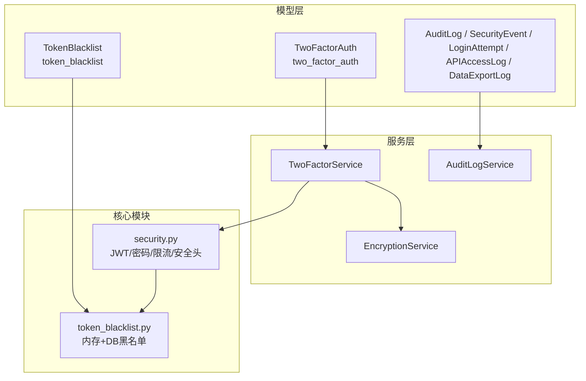
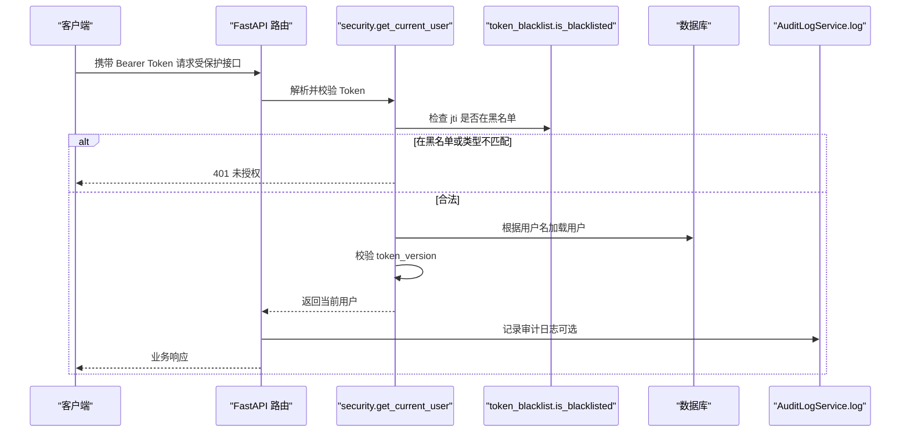
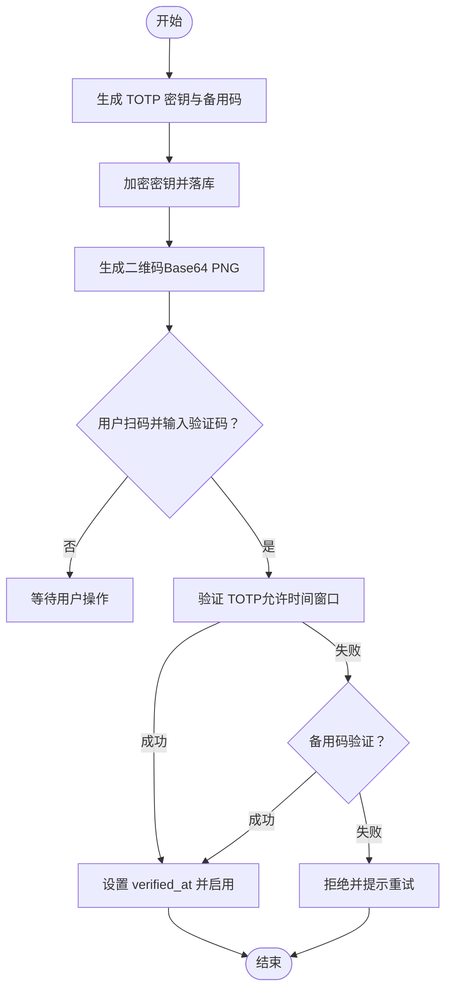
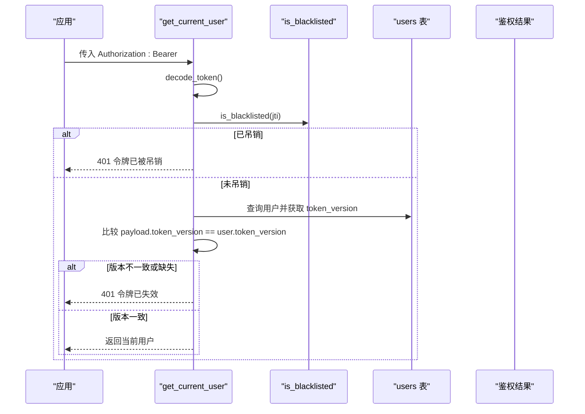
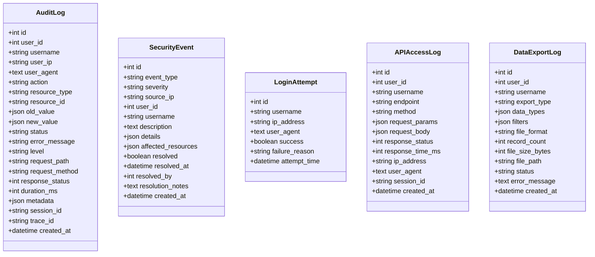
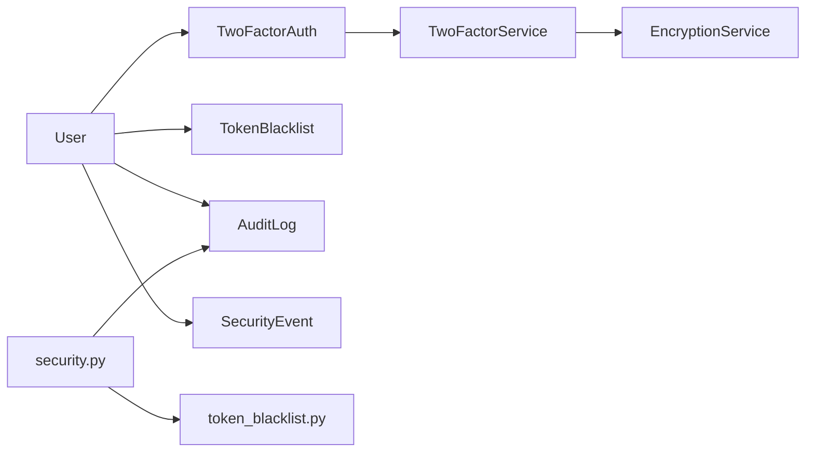

# 安全审计表设计

<cite>
**本文引用的文件**
- [two_factor_auth.py](file://backend/app/models/two_factor_auth.py)
- [token_blacklist.py](file://backend/app/models/token_blacklist.py)
- [audit.py](file://backend/app/models/audit.py)
- [two_factor_service.py](file://backend/app/services/two_factor_service.py)
- [security.py](file://backend/app/core/security.py)
- [token_blacklist.py](file://backend/app/core/token_blacklist.py)
- [encryption_service.py](file://backend/app/services/encryption_service.py)
- [004_add_security_tables.py](file://backend/alembic/versions/004_add_security_tables.py)
- [token_version_001_add_token_version.py](file://backend/alembic/versions/token_version_001_add_token_version.py)
</cite>

## 目录
1. [简介](#简介)
2. [项目结构](#项目结构)
3. [核心组件](#核心组件)
4. [架构总览](#架构总览)
5. [详细组件分析](#详细组件分析)
6. [依赖关系分析](#依赖关系分析)
7. [性能考虑](#性能考虑)
8. [故障排查指南](#故障排查指南)
9. [结论](#结论)
10. [附录](#附录)

## 简介
本文件面向安全审计与合规需求，系统性说明双因素认证（TOTP）与令牌黑名单等安全相关数据表的设计与实现，覆盖以下要点：
- two_factor_auth 双因素认证表字段、约束与生命周期
- token_blacklist 令牌黑名单表结构与索引策略
- TOTP 密钥生成、二维码生成与验证流程
- JWT 令牌版本控制、黑名单管理与会话安全策略
- 安全审计日志记录、异常检测机制与防护措施
- 密码加密算法、敏感数据保护与访问控制策略
- 安全配置最佳实践与安全事件响应流程

## 项目结构
围绕安全能力的关键代码分布在模型层、服务层与核心模块中：
- 模型层：定义数据库表结构（two_factor_auth、token_blacklist、审计与安全事件表）
- 服务层：封装业务逻辑（TOTP 生成/验证、二维码生成、黑名单持久化、审计写入）
- 核心模块：提供统一的安全能力（JWT 签发/校验、密码哈希、速率限制、安全头中间件、审计日志）

图表来源
- [two_factor_auth.py:13-39](file://backend/app/models/two_factor_auth.py#L13-L39)
- [token_blacklist.py:13-61](file://backend/app/models/token_blacklist.py#L13-L61)
- [audit.py:53-205](file://backend/app/models/audit.py#L53-L205)
- [two_factor_service.py:23-251](file://backend/app/services/two_factor_service.py#L23-L251)
- [security.py:210-336](file://backend/app/core/security.py#L210-L336)
- [token_blacklist.py:27-163](file://backend/app/core/token_blacklist.py#L27-L163)
- [encryption_service.py:233-261](file://backend/app/services/encryption_service.py#L233-L261)

章节来源
- [two_factor_auth.py:13-39](file://backend/app/models/two_factor_auth.py#L13-L39)
- [token_blacklist.py:13-61](file://backend/app/models/token_blacklist.py#L13-L61)
- [audit.py:53-205](file://backend/app/models/audit.py#L53-L205)

## 核心组件
- 双因素认证表（two_factor_auth）
  - 主键 id，用户唯一关联 user_id（外键到 users.id，级联删除）
  - secret_key 存储加密后的 TOTP 密钥
  - backup_codes JSON 备用恢复码列表
  - enabled 是否启用；verified_at 首次验证时间；created_at/updated_at 审计时间戳
  - 通过迁移脚本创建并建立 user_id 索引
- 令牌黑名单表（token_blacklist）
  - 主键 id，唯一且索引的 token_jti（JWT jti）
  - user_id 可选，便于按用户维度清理与审计
  - blacklisted_at 加入黑名单时间，expires_at 原始过期时间，reason 原因
  - 复合索引优化查询：(user_id, blacklisted_at)、expires_at
- 审计与安全事件表族
  - audit_logs：操作审计，包含动作、资源、状态、请求上下文、耗时、元数据等
  - security_events：安全事件，含严重级别、影响范围、处理状态
  - login_attempts：登录尝试记录，用于暴力破解检测
  - api_access_logs：API 访问日志，便于追踪接口调用
  - data_export_logs：数据导出审计，记录导出类型、范围、文件大小等

章节来源
- [004_add_security_tables.py:40-86](file://backend/alembic/versions/004_add_security_tables.py#L40-L86)
- [token_version_001_add_token_version.py:19-41](file://backend/alembic/versions/token_version_001_add_token_version.py#L19-L41)
- [token_blacklist.py:13-61](file://backend/app/models/token_blacklist.py#L13-L61)
- [audit.py:53-205](file://backend/app/models/audit.py#L53-L205)

## 架构总览
系统采用“模型-服务-核心”分层架构，安全能力由核心模块统一提供，服务层封装具体业务流程，模型层负责数据持久化。

图表来源
- [security.py:243-336](file://backend/app/core/security.py#L243-L336)
- [token_blacklist.py:60-70](file://backend/app/core/token_blacklist.py#L60-L70)
- [audit.py:53-95](file://backend/app/models/audit.py#L53-L95)

## 详细组件分析

### 双因素认证（TOTP）设计与实现
- 数据模型
  - TwoFactorAuth 表以 user_id 唯一约束绑定用户，secret_key 使用加密存储，backup_codes 为 JSON 数组，enabled 标记启用状态，verified_at 记录首次验证时间。
- 服务流程
  - 生成密钥：基于标准库生成 Base32 随机密钥
  - 生成备用码：固定长度数字码，用于紧急恢复
  - 生成二维码：构造 TOTP URI，动态导入 qrcode 生成 PNG 并转为 Base64 数据 URL
  - 启用流程：先禁用状态，待用户输入验证码通过后设置 verified_at 并启用
  - 登录验证：优先验证 TOTP，失败则回退至备用码，使用后移除该备用码
  - 禁用流程：删除记录并记录日志
- 安全要点
  - 密钥在入库前加密、读取时解密，避免明文落库
  - 备用码一次性使用，降低泄露风险
  - 时间窗口允许前后一个周期误差，兼顾网络与时钟偏差

图表来源
- [two_factor_service.py:26-148](file://backend/app/services/two_factor_service.py#L26-L148)
- [two_factor_auth.py:13-39](file://backend/app/models/two_factor_auth.py#L13-L39)
- [encryption_service.py:233-261](file://backend/app/services/encryption_service.py#L233-L261)

章节来源
- [two_factor_service.py:26-251](file://backend/app/services/two_factor_service.py#L26-L251)
- [two_factor_auth.py:13-39](file://backend/app/models/two_factor_auth.py#L13-L39)
- [encryption_service.py:233-261](file://backend/app/services/encryption_service.py#L233-L261)

### 令牌黑名单与 JWT 版本控制
- 黑名单机制
  - 内存集合维护被吊销的 jti 及过期时间，支持并发锁保护
  - 启动时从数据库加载未过期的黑名单条目，保证重启后仍有效
  - 支持持久化写入数据库，便于跨进程/多实例共享
- JWT 版本控制
  - 用户表新增 token_version 字段，登出或强制下线时递增版本号
  - 校验时要求 token 中的 token_version 与用户当前版本一致，否则拒绝
  - 结合黑名单与版本控制，实现“立即失效”与会话级强制下线
- 安全校验路径
  - get_current_user 对每个请求进行：解码、黑名单检查、类型校验、版本校验、用户存在性校验
  - 将当前用户 ID 写入审计上下文，供后续写操作可追责

图表来源
- [security.py:243-336](file://backend/app/core/security.py#L243-L336)
- [token_blacklist.py:60-103](file://backend/app/core/token_blacklist.py#L60-L103)
- [token_version_001_add_token_version.py:19-41](file://backend/alembic/versions/token_version_001_add_token_version.py#L19-L41)

章节来源
- [security.py:243-336](file://backend/app/core/security.py#L243-L336)
- [token_blacklist.py:27-163](file://backend/app/core/token_blacklist.py#L27-L163)
- [token_blacklist.py:13-61](file://backend/app/models/token_blacklist.py#L13-L61)
- [token_version_001_add_token_version.py:19-41](file://backend/alembic/versions/token_version_001_add_token_version.py#L19-L41)

### 安全审计日志与异常检测
- 审计日志
  - AuditLog 记录用户、动作、资源、状态、请求上下文、耗时、元数据等，具备多维度索引
  - AuditLogService 提供便捷写入接口，自动映射字段并安全提交
- 安全事件
  - SecurityEvent 记录高优安全事件，支持严重级别、影响范围、处理状态与处理人
- 登录尝试
  - LoginAttempt 记录登录成功/失败、失败原因、IP、UA，可用于暴力破解检测与封禁
- API 访问与导出审计
  - APIAccessLog 记录接口调用参数、响应状态与耗时
  - DataExportLog 记录导出范围、格式、大小与结果，便于数据泄露溯源

图表来源
- [audit.py:53-205](file://backend/app/models/audit.py#L53-L205)

章节来源
- [audit.py:53-205](file://backend/app/models/audit.py#L53-L205)
- [security.py:644-687](file://backend/app/core/security.py#L644-L687)

### 密码加密算法与敏感数据保护
- 密码哈希
  - 使用 bcrypt（passlib CryptContext），兼容新版 bcrypt 的行为差异
  - 提供密码截断策略，防止超长密码导致异常
- 敏感数据加密
  - 使用 Fernet 对称加密，密钥优先级：环境变量/配置 > 运行时密钥存储 > 自动生成并持久化
  - 提供字段级加解密工具，用于 TOTP 密钥等敏感字段
- 日志脱敏
  - 内置敏感字段识别与替换，避免敏感信息落入日志
- 速率限制
  - 内置滑动窗口限流器，默认 60 次/分钟，防暴力攻击与滥用
- 安全响应头
  - 中间件注入 X-Content-Type-Options、X-Frame-Options、Referrer-Policy 等头部

章节来源
- [security.py:107-148](file://backend/app/core/security.py#L107-L148)
- [security.py:180-203](file://backend/app/core/security.py#L180-L203)
- [security.py:414-517](file://backend/app/core/security.py#L414-L517)
- [security.py:598-637](file://backend/app/core/security.py#L598-L637)
- [encryption_service.py:181-261](file://backend/app/services/encryption_service.py#L181-L261)

### 访问控制策略
- 角色与权限
  - 内置角色常量与管理员判定，配合 require_admin 依赖实现细粒度控制
- 组织级权限
  - 组织权限服务提供组织访问与管理判断，失败时记录审计并抛出权限异常
- 零信任评估
  - 管理操作需超级管理员，非管理员尝试将被记录安全事件

章节来源
- [security.py:350-371](file://backend/app/core/security.py#L350-L371)
- [organization_permission_service.py:182-215](file://backend/app/services/organization_permission_service.py#L182-L215)
- [zero_trust.py:413-437](file://backend/app/api/v1/system/zero_trust.py#L413-L437)

## 依赖关系分析
- 模型依赖
  - TwoFactorAuth 依赖 User（外键级联删除）
  - TokenBlacklist 依赖 User（可选外键）
  - 审计与安全事件表均依赖 User（部分外键 SET NULL）
- 服务依赖
  - TwoFactorService 依赖加密服务与事务提交
  - 审计日志服务依赖数据库会话与事务提交
- 核心依赖
  - security.py 依赖 PyJWT、passlib、fastapi 安全组件
  - token_blacklist 模块依赖数据库模型与线程锁

图表来源
- [two_factor_auth.py:13-39](file://backend/app/models/two_factor_auth.py#L13-L39)
- [token_blacklist.py:13-61](file://backend/app/models/token_blacklist.py#L13-L61)
- [audit.py:53-205](file://backend/app/models/audit.py#L53-L205)
- [two_factor_service.py:23-251](file://backend/app/services/two_factor_service.py#L23-L251)
- [security.py:243-336](file://backend/app/core/security.py#L243-L336)
- [token_blacklist.py:27-163](file://backend/app/core/token_blacklist.py#L27-L163)

章节来源
- [two_factor_auth.py:13-39](file://backend/app/models/two_factor_auth.py#L13-L39)
- [token_blacklist.py:13-61](file://backend/app/models/token_blacklist.py#L13-L61)
- [audit.py:53-205](file://backend/app/models/audit.py#L53-L205)

## 性能考虑
- 黑名单查询
  - 内存集合 O(1) 查找，定期清理过期条目，减少内存占用
  - 数据库加载仅取未过期条目，避免全表扫描
- TOTP 验证
  - 时间窗口较小（±1 周期），降低重放攻击面
  - 二维码生成懒加载，避免模块导入开销
- 审计日志
  - 批量写入与事务提交，减少 IO 次数
  - 合理索引提升查询效率（用户、时间、资源维度）
- 速率限制
  - 滑动窗口算法，周期性清理过期键，防止内存泄漏

[本节为通用性能讨论，不直接分析具体文件]

## 故障排查指南
- 双因素认证问题
  - 无法启用：检查是否已启用、密钥是否加密存储、二维码是否正确生成
  - 验证失败：确认时间同步、备用码是否被使用、密钥解密是否正常
- 令牌无效
  - 检查 jti 是否在黑名单、token_version 是否匹配、type 是否为 access
  - 查看登出或强制下线流程是否正确递增版本
- 审计日志缺失
  - 检查审计写入是否被异常捕获、事务是否提交、数据库连接是否正常
- 登录失败频繁
  - 查看 login_attempts 表统计失败原因与 IP，必要时触发封禁

章节来源
- [two_factor_service.py:150-251](file://backend/app/services/two_factor_service.py#L150-L251)
- [security.py:243-336](file://backend/app/core/security.py#L243-L336)
- [audit.py:128-145](file://backend/app/models/audit.py#L128-L145)

## 结论
本方案通过完善的数据表设计与服务实现，构建了完整的双因素认证、令牌黑名单与审计体系。结合 JWT 版本控制与内存/数据库双层黑名单，实现了强化的会话安全与即时吊销能力。审计与安全事件表族提供了全面的可观测性与追溯能力，配合密码哈希、敏感数据加密与速率限制，形成纵深防御体系。建议在生产环境中严格管理密钥、开启安全响应头、持续监控登录失败与安全事件，并定期清理过期数据以保证性能与合规。

[本节为总结性内容，不直接分析具体文件]

## 附录
- 安全配置最佳实践
  - 使用强随机密钥与轮换策略，避免硬编码
  - 启用 HTTPS 与安全响应头，限制缓存策略
  - 最小权限原则与组织级访问控制
- 安全事件响应流程
  - 发现异常登录或越权访问，记录安全事件并升级处理
  - 对受影响账号执行强制下线与密码重置
  - 复盘根因并加固防护策略

[本节为通用指导，不直接分析具体文件]