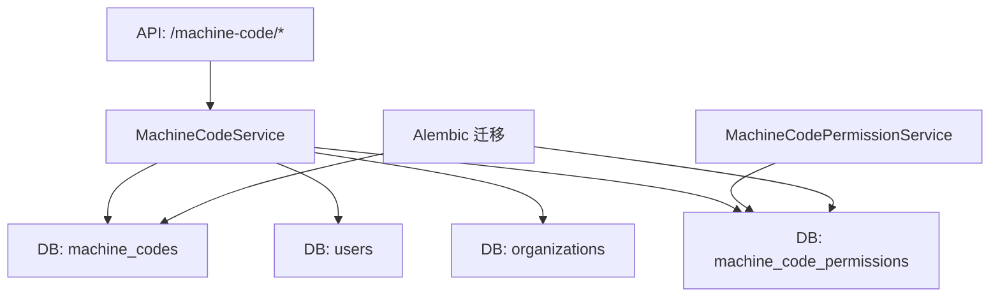
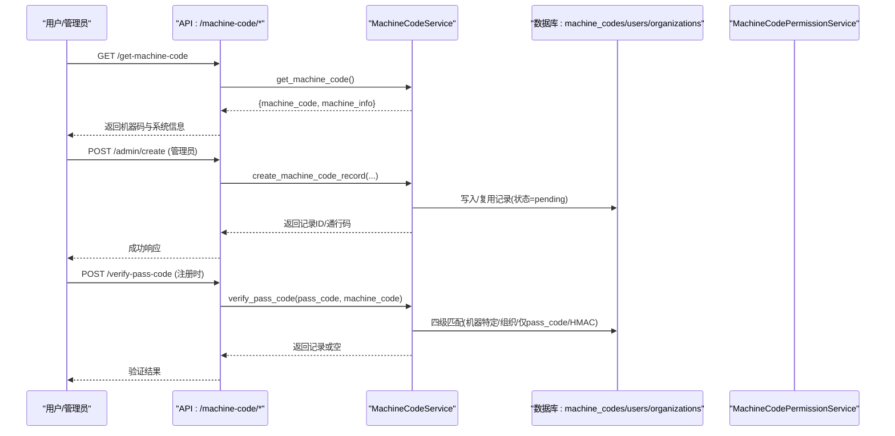
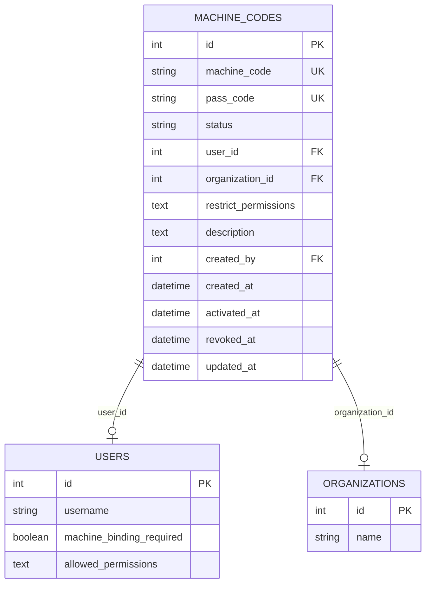
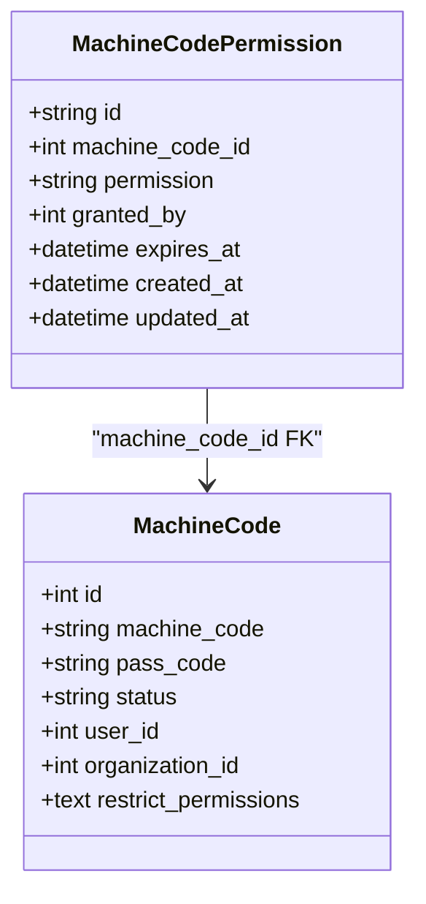
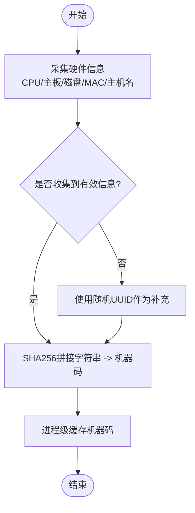
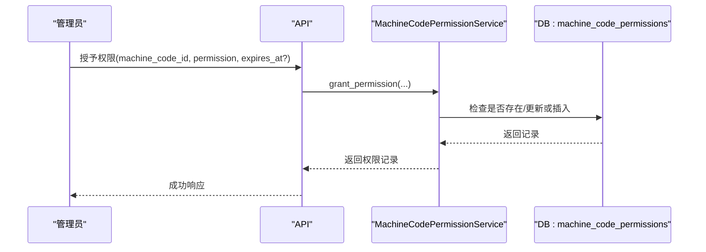
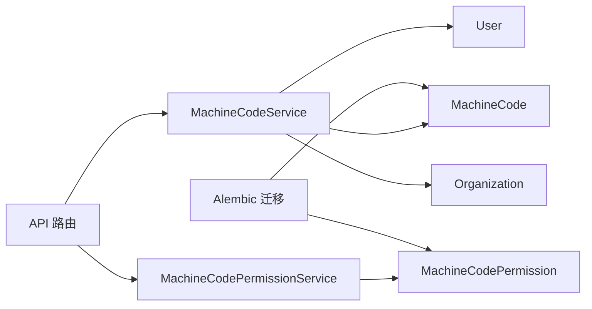

# 机器码授权表设计

<cite>
**本文引用的文件**
- [backend/app/models/machine_code.py](file://backend/app/models/machine_code.py)
- [backend/app/services/machine_code_service.py](file://backend/app/services/machine_code_service.py)
- [backend/app/api/v1/machine_code.py](file://backend/app/api/v1/machine_code.py)
- [backend/alembic/versions/009_add_machine_codes.py](file://backend/alembic/versions/009_add_machine_codes.py)
- [backend/alembic/versions/011_add_machine_code_permissions.py](file://backend/alembic/versions/011_add_machine_code_permissions.py)
- [backend/app/models/rbac.py](file://backend/app/models/rbac.py)
- [backend/app/services/machine_code_permission_service.py](file://backend/app/services/machine_code_permission_service.py)
</cite>

## 目录
1. [简介](#简介)
2. [项目结构](#项目结构)
3. [核心组件](#核心组件)
4. [架构总览](#架构总览)
5. [详细组件分析](#详细组件分析)
6. [依赖关系分析](#依赖关系分析)
7. [性能考量](#性能考量)
8. [故障排查指南](#故障排查指南)
9. [结论](#结论)
10. [附录](#附录)

## 简介
本文件围绕“machine_codes”机器码授权表及其相关能力，提供从数据模型、服务逻辑到API接口的完整说明。内容涵盖：
- 机器标识字段（machine_code、pass_code 等）
- 授权信息字段（状态、绑定关系、权限限制等）
- 审计字段（创建时间、激活时间、撤销时间、更新时间等）
- 机器码生成算法与校验机制
- 离线授权实现原理（HMAC 自验证）
- 多机登录限制与设备指纹识别策略
- 生命周期管理与过期处理
- 最佳实践与常见问题排查

## 项目结构
机器码授权体系由以下关键部分组成：
- 数据模型层：定义 machine_codes 表结构与扩展字段，以及 machine_code_permissions 关联表
- 服务层：MachineCodeService 负责机器码生成、通行码生成与验证、激活/撤销、列表查询等；MachineCodePermissionService 负责基于机器码的功能权限授予与撤销
- API 层：暴露管理员录入、列表查询、撤销、密码重置、组织通行码等接口
- 迁移脚本：通过 Alembic 版本化地创建/修改表结构与索引

图表来源
- [backend/app/api/v1/machine_code.py:157-400](file://backend/app/api/v1/machine_code.py#L157-L400)
- [backend/app/services/machine_code_service.py:121-333](file://backend/app/services/machine_code_service.py#L121-L333)
- [backend/app/services/machine_code_permission_service.py:22-92](file://backend/app/services/machine_code_permission_service.py#L22-L92)
- [backend/alembic/versions/009_add_machine_codes.py:42-66](file://backend/alembic/versions/009_add_machine_codes.py#L42-L66)
- [backend/alembic/versions/011_add_machine_code_permissions.py:20-55](file://backend/alembic/versions/011_add_machine_code_permissions.py#L20-L55)

章节来源
- [backend/app/models/machine_code.py:16-77](file://backend/app/models/machine_code.py#L16-L77)
- [backend/app/services/machine_code_service.py:121-333](file://backend/app/services/machine_code_service.py#L121-L333)
- [backend/app/api/v1/machine_code.py:157-400](file://backend/app/api/v1/machine_code.py#L157-L400)
- [backend/alembic/versions/009_add_machine_codes.py:42-66](file://backend/alembic/versions/009_add_machine_codes.py#L42-L66)
- [backend/alembic/versions/011_add_machine_code_permissions.py:20-55](file://backend/alembic/versions/011_add_machine_code_permissions.py#L20-L55)

## 核心组件
- 机器码模型 MachineCode：承载机器标识、通行码、状态、用户/组织绑定、权限限制、审计时间戳等
- 机器码服务 MachineCodeService：实现机器码采集与哈希、校验码生成、通行码 HMAC 生成与验证、激活/撤销、列表查询、回退改绑等
- 机器码权限服务 MachineCodePermissionService：管理 machine_code_permissions 表的授予/撤销/批量操作，支持过期控制
- API 路由：提供获取机器码、管理员录入/列表/撤销、密码重置、组织通行码等端点
- 迁移脚本：确保表结构与索引的幂等创建与变更

章节来源
- [backend/app/models/machine_code.py:16-77](file://backend/app/models/machine_code.py#L16-L77)
- [backend/app/services/machine_code_service.py:121-333](file://backend/app/services/machine_code_service.py#L121-L333)
- [backend/app/services/machine_code_permission_service.py:22-92](file://backend/app/services/machine_code_permission_service.py#L22-L92)
- [backend/app/api/v1/machine_code.py:157-400](file://backend/app/api/v1/machine_code.py#L157-L400)
- [backend/alembic/versions/009_add_machine_codes.py:42-66](file://backend/alembic/versions/009_add_machine_codes.py#L42-L66)
- [backend/alembic/versions/011_add_machine_code_permissions.py:20-55](file://backend/alembic/versions/011_add_machine_code_permissions.py#L20-L55)

## 架构总览
下图展示从客户端到数据库的关键交互路径，包括机器码获取、管理员录入、通行码验证与激活流程。

图表来源
- [backend/app/api/v1/machine_code.py:157-240](file://backend/app/api/v1/machine_code.py#L157-L240)
- [backend/app/services/machine_code_service.py:121-190](file://backend/app/services/machine_code_service.py#L121-L190)
- [backend/app/services/machine_code_service.py:267-333](file://backend/app/services/machine_code_service.py#L267-L333)
- [backend/app/services/machine_code_service.py:411-585](file://backend/app/services/machine_code_service.py#L411-L585)

## 详细组件分析

### 数据模型：machine_codes 表
- 主键：id
- 机器标识：machine_code（唯一、索引）
- 通行码：pass_code（唯一、索引）
- 状态：status（pending/active/revoked，索引）
- 绑定关系：user_id（外键至 users）、organization_id（外键至 organizations）
- 权限限制：restrict_permissions（JSON 数组文本）
- 备注：description
- 审计：created_by、created_at、activated_at、revoked_at、updated_at
- 关系：user、creator、organization

图表来源
- [backend/app/models/machine_code.py:16-77](file://backend/app/models/machine_code.py#L16-L77)
- [backend/alembic/versions/009_add_machine_codes.py:42-66](file://backend/alembic/versions/009_add_machine_codes.py#L42-L66)
- [backend/alembic/versions/011_add_machine_code_permissions.py:20-35](file://backend/alembic/versions/011_add_machine_code_permissions.py#L20-L35)

章节来源
- [backend/app/models/machine_code.py:16-77](file://backend/app/models/machine_code.py#L16-L77)
- [backend/alembic/versions/009_add_machine_codes.py:42-66](file://backend/alembic/versions/009_add_machine_codes.py#L42-L66)

### 数据模型：machine_code_permissions 表
- 主键：id（UUID）
- 机器码ID：machine_code_id（外键，级联删除）
- 权限标识：permission（唯一复合索引）
- 授权人：granted_by
- 过期时间：expires_at
- 审计：created_at、updated_at

图表来源
- [backend/app/models/rbac.py:221-257](file://backend/app/models/rbac.py#L221-L257)
- [backend/alembic/versions/011_add_machine_code_permissions.py:36-55](file://backend/alembic/versions/011_add_machine_code_permissions.py#L36-L55)

章节来源
- [backend/app/models/rbac.py:221-257](file://backend/app/models/rbac.py#L221-L257)
- [backend/alembic/versions/011_add_machine_code_permissions.py:36-55](file://backend/alembic/versions/011_add_machine_code_permissions.py#L36-L55)

### 服务层：MachineCodeService
- 机器码生成：收集 CPU/主板/磁盘序列号、MAC、主机名等硬件信息，拼接后 SHA256 得到 32 位十六进制机器码；进程级缓存避免重复调用外部命令
- 校验码生成：对机器码 MD5 取前8位转整数，模运算得到 1000-9999 的四位数字校验码
- 初始密码生成：用户名前4位+校验码+固定后缀
- 通行码生成：HMAC-SHA256(PASS_CODE_SECRET, machine_code)，截断32位并格式化为 XXXX-XXXX-... 形式
- 通行码验证（四级）：
  1) 机器特定通行码（pass_code + machine_code + pending/active未绑定）
  2) 组织通行码（pass_code + organization_id 非空 + pending/active未绑定）
  3) 仅凭 pass_code（限 pending 且无 organization_id），命中后自动将 machine_code 更新为当前值并写审计日志
  4) HMAC 自验证（跨机器场景，需显式配置 PASS_CODE_SECRET，否则 fail-closed）
- 激活/撤销：设置 status、user_id、时间戳
- 列表查询：支持按状态过滤，预加载用户关系避免 N+1

图表来源
- [backend/app/services/machine_code_service.py:55-152](file://backend/app/services/machine_code_service.py#L55-L152)

章节来源
- [backend/app/services/machine_code_service.py:55-152](file://backend/app/services/machine_code_service.py#L55-L152)
- [backend/app/services/machine_code_service.py:154-190](file://backend/app/services/machine_code_service.py#L154-L190)
- [backend/app/services/machine_code_service.py:267-333](file://backend/app/services/machine_code_service.py#L267-L333)
- [backend/app/services/machine_code_service.py:411-585](file://backend/app/services/machine_code_service.py#L411-L585)
- [backend/app/services/machine_code_service.py:587-691](file://backend/app/services/machine_code_service.py#L587-L691)
- [backend/app/services/machine_code_service.py:693-733](file://backend/app/services/machine_code_service.py#L693-L733)

### 服务层：MachineCodePermissionService
- 获取受限权限集合：查询 machine_code_permissions，考虑 expires_at 过期条件
- 授予/撤销权限：支持单条与批量操作，更新/创建记录并持久化
- 用户维度受限权限：先查用户激活的机器码，再取其受限权限集合

图表来源
- [backend/app/services/machine_code_permission_service.py:94-148](file://backend/app/services/machine_code_permission_service.py#L94-L148)

章节来源
- [backend/app/services/machine_code_permission_service.py:22-92](file://backend/app/services/machine_code_permission_service.py#L22-L92)
- [backend/app/services/machine_code_permission_service.py:94-148](file://backend/app/services/machine_code_permission_service.py#L94-L148)
- [backend/app/services/machine_code_permission_service.py:150-200](file://backend/app/services/machine_code_permission_service.py#L150-L200)

### API 层：机器码管理接口
- 获取机器码：公开接口，校验码仅本机回环地址返回
- 管理员录入机器码：生成/复用记录，状态置为 pending，可手动指定4位通行码
- 管理员列表：支持状态过滤，预加载用户信息
- 管理员撤销：将状态改为 revoked，记录撤销时间
- 密码重置：使用机器码和校验码重置用户密码，首次登录强制修改
- 组织通行码：支持组织维度通行码生成与管理（见后续章节）

章节来源
- [backend/app/api/v1/machine_code.py:157-240](file://backend/app/api/v1/machine_code.py#L157-L240)
- [backend/app/api/v1/machine_code.py:243-321](file://backend/app/api/v1/machine_code.py#L243-L321)
- [backend/app/api/v1/machine_code.py:324-400](file://backend/app/api/v1/machine_code.py#L324-L400)

## 依赖关系分析
- 模型依赖：machine_codes 通过外键关联 users、organizations；machine_code_permissions 通过外键关联 machine_codes
- 服务依赖：MachineCodeService 依赖数据库会话与事务工具；MachineCodePermissionService 依赖同一会话
- API 依赖：路由依赖认证中间件、速率限制、工作日志服务等
- 迁移依赖：Alembic 版本化维护表结构与索引

图表来源
- [backend/app/api/v1/machine_code.py:157-400](file://backend/app/api/v1/machine_code.py#L157-L400)
- [backend/app/services/machine_code_service.py:121-333](file://backend/app/services/machine_code_service.py#L121-L333)
- [backend/app/services/machine_code_permission_service.py:22-92](file://backend/app/services/machine_code_permission_service.py#L22-L92)
- [backend/alembic/versions/009_add_machine_codes.py:42-66](file://backend/alembic/versions/009_add_machine_codes.py#L42-L66)
- [backend/alembic/versions/011_add_machine_code_permissions.py:36-55](file://backend/alembic/versions/011_add_machine_code_permissions.py#L36-L55)

章节来源
- [backend/app/models/machine_code.py:16-77](file://backend/app/models/machine_code.py#L16-L77)
- [backend/app/models/rbac.py:221-257](file://backend/app/models/rbac.py#L221-L257)
- [backend/app/services/machine_code_service.py:121-333](file://backend/app/services/machine_code_service.py#L121-L333)
- [backend/app/services/machine_code_permission_service.py:22-92](file://backend/app/services/machine_code_permission_service.py#L22-L92)

## 性能考量
- 机器码计算缓存：进程级缓存避免重复执行 wmic 等外部命令，降低延迟
- 数据库查询优化：列表查询使用 joinedload 预加载用户关系，减少 N+1 问题
- 通行码验证快路径：先进行原文精确匹配，失败后再去连字符归一化重试，提升常见输入命中率
- 索引设计：machine_code、pass_code、status、user_id 均建立索引，加速检索
- 权限查询：按 expires_at 过滤，避免无效记录影响性能

章节来源
- [backend/app/services/machine_code_service.py:52-152](file://backend/app/services/machine_code_service.py#L52-L152)
- [backend/app/services/machine_code_service.py:411-458](file://backend/app/services/machine_code_service.py#L411-L458)
- [backend/app/services/machine_code_service.py:693-733](file://backend/app/services/machine_code_service.py#L693-L733)
- [backend/alembic/versions/009_add_machine_codes.py:62-66](file://backend/alembic/versions/009_add_machine_codes.py#L62-L66)
- [backend/app/services/machine_code_permission_service.py:44-65](file://backend/app/services/machine_code_permission_service.py#L44-L65)

## 故障排查指南
- 通行码验证失败
  - 检查是否包含连字符，服务会尝试去连字符归一化匹配
  - 确认状态是否为 pending 或 active 且未绑定用户
  - 若为组织通行码，确认 organization_id 非空
  - 若走 HMAC 自验证，确认已显式配置 PASS_CODE_SECRET，否则默认拒绝
- 机器码漂移导致无法激活
  - 服务会在仅凭 pass_code 命中时将 machine_code 更新为当前值，并记录审计日志
  - 若仍失败，检查 wmic 输出稳定性与平台差异
- 管理员无法录入/撤销
  - 确认当前用户具备管理员或超级管理员权限
  - 检查数据库会话是否正常初始化
- 权限未生效
  - 检查 machine_code_permissions 中对应记录的 expires_at 是否已过期
  - 确认用户绑定的激活机器码是否正确

章节来源
- [backend/app/services/machine_code_service.py:411-585](file://backend/app/services/machine_code_service.py#L411-L585)
- [backend/app/api/v1/machine_code.py:194-240](file://backend/app/api/v1/machine_code.py#L194-L240)
- [backend/app/api/v1/machine_code.py:290-321](file://backend/app/api/v1/machine_code.py#L290-L321)
- [backend/app/services/machine_code_permission_service.py:44-65](file://backend/app/services/machine_code_permission_service.py#L44-L65)

## 结论
machine_codes 表与服务共同实现了面向单机/离线场景的机器码授权体系：
- 通过硬件指纹生成稳定机器码，结合 HMAC 通行码实现跨机器自验证
- 四级验证机制兼顾用户体验与安全边界，支持组织通行码与回退改绑
- 权限粒度细化到机器码级别，支持过期控制与批量操作
- 完善的审计字段与日志记录便于追踪与合规
建议在生产环境显式配置 PASS_CODE_SECRET，启用强安全基线；结合 RBAC 与零信任设备指纹策略，进一步提升整体安全性。

## 附录

### 字段说明与用途
- 机器标识
  - machine_code：基于硬件信息生成的唯一标识
  - pass_code：激活码（可为4位数字或格式化32位串）
- 授权信息
  - status：pending/active/revoked
  - user_id：绑定用户
  - organization_id：组织通行码关联
  - restrict_permissions：功能权限限制（JSON 数组）
- 审计信息
  - created_by、created_at、activated_at、revoked_at、updated_at

章节来源
- [backend/app/models/machine_code.py:26-67](file://backend/app/models/machine_code.py#L26-L67)
- [backend/alembic/versions/009_add_machine_codes.py:42-66](file://backend/alembic/versions/009_add_machine_codes.py#L42-L66)

### 机器码生命周期
- 创建/复用：管理员录入时若存在记录则复用并重置状态为 pending，生成新通行码
- 激活：验证通过后绑定用户，状态改为 active，记录激活时间
- 撤销：状态改为 revoked，记录撤销时间
- 过期：权限层面通过 expires_at 控制；通行码本身无内置过期字段，可通过重新生成/撤销管理

章节来源
- [backend/app/services/machine_code_service.py:325-409](file://backend/app/services/machine_code_service.py#L325-L409)
- [backend/app/services/machine_code_service.py:587-633](file://backend/app/services/machine_code_service.py#L587-L633)
- [backend/app/services/machine_code_permission_service.py:94-148](file://backend/app/services/machine_code_permission_service.py#L94-L148)

### 多机登录限制与设备指纹
- 多机限制：通过用户绑定的激活机器码进行校验，未绑定允许登录（兼容旧用户），绑定后仅允许在授权机器登录
- 设备指纹：机器码采集包含 CPU/主板/磁盘序列号、MAC、主机名等；必要时可结合零信任设备指纹服务进行风控

章节来源
- [backend/app/services/machine_code_service.py:661-691](file://backend/app/services/machine_code_service.py#L661-L691)
- [backend/app/services/machine_code_service.py:55-152](file://backend/app/services/machine_code_service.py#L55-L152)

### 安全防护策略
- 校验码仅本机回环地址返回，防止远程探测
- 通行码 HMAC 自验证在未显式配置密钥时 fail-closed
- 回退改绑触发审计日志记录，敏感操作留痕
- 管理员操作需具备相应角色权限

章节来源
- [backend/app/api/v1/machine_code.py:145-191](file://backend/app/api/v1/machine_code.py#L145-L191)
- [backend/app/services/machine_code_service.py:296-323](file://backend/app/services/machine_code_service.py#L296-L323)
- [backend/app/services/machine_code_service.py:530-553](file://backend/app/services/machine_code_service.py#L530-L553)
- [backend/app/api/v1/machine_code.py:194-240](file://backend/app/api/v1/machine_code.py#L194-L240)