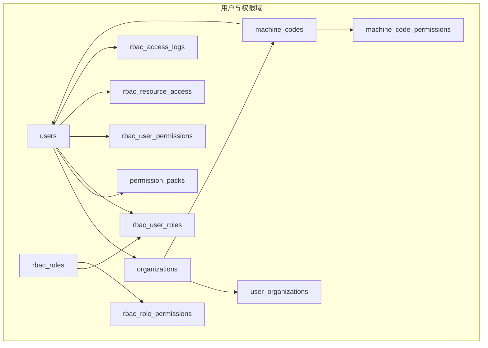
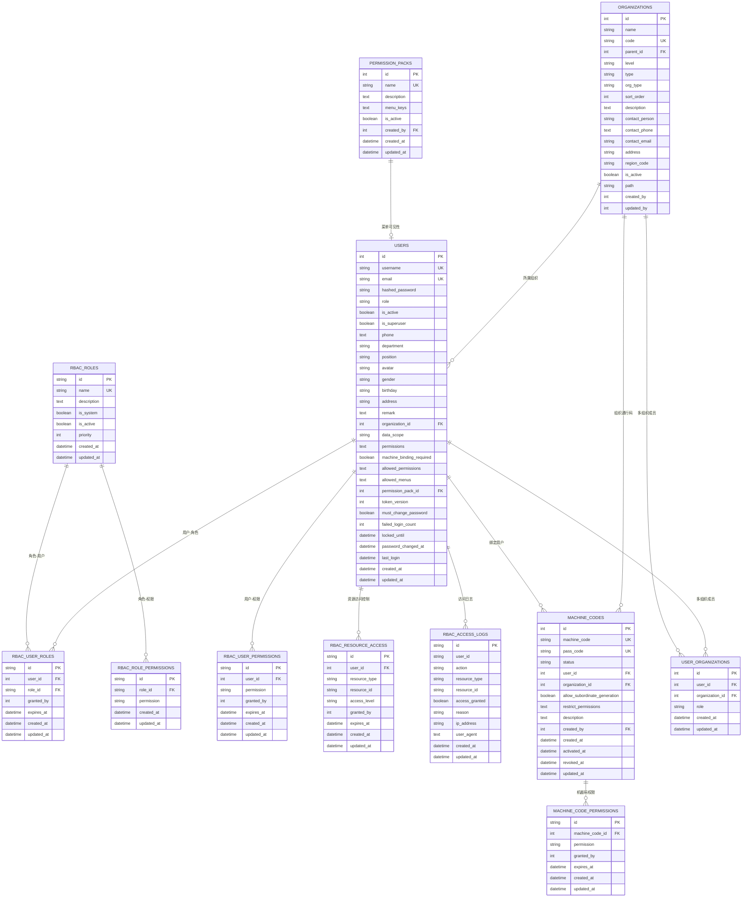
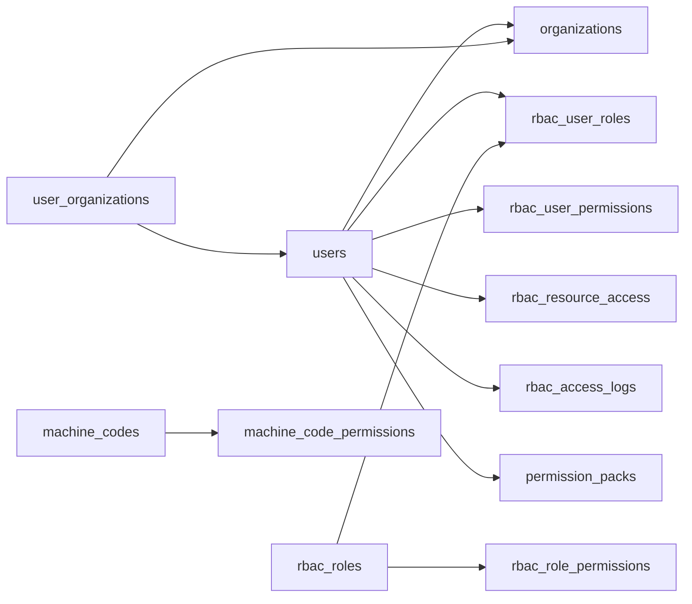
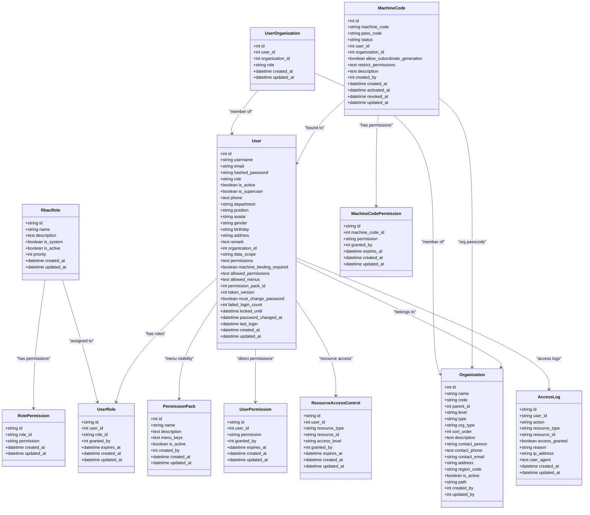

# 用户与权限域表结构

<cite>
**本文引用的文件**
- [backend/app/models/user.py](file://backend/app/models/user.py)
- [backend/app/models/organization.py](file://backend/app/models/organization.py)
- [backend/app/models/rbac.py](file://backend/app/models/rbac.py)
- [backend/app/models/machine_code.py](file://backend/app/models/machine_code.py)
- [backend/app/models/user_organization.py](file://backend/app/models/user_organization.py)
- [backend/app/models/permission_pack.py](file://backend/app/models/permission_pack.py)
- [backend/app/models/base.py](file://backend/app/models/base.py)
- [backend/app/core/constants.py](file://backend/app/core/constants.py)
- [backend/app/services/machine_code_service.py](file://backend/app/services/machine_code_service.py)
</cite>

## 目录
1. [简介](#简介)
2. [项目结构](#项目结构)
3. [核心组件](#核心组件)
4. [架构总览](#架构总览)
5. [详细组件分析](#详细组件分析)
6. [依赖关系分析](#依赖关系分析)
7. [性能考虑](#性能考虑)
8. [故障排查指南](#故障排查指南)
9. [结论](#结论)
10. [附录](#附录)

## 简介
本文件面向“用户与权限域”的数据库设计，系统性说明16张用户权限相关表的完整设计与实现机制。内容覆盖：
- 用户主表、组织机构表、角色定义表、用户角色分配表、机器码授权表等核心实体；
- 四级角色体系（super_admin/admin/user/viewer）的实现与继承规则；
- RBAC细粒度权限控制的“六件套”设计；
- 机器码绑定与离线授权的实现原理；
- 数据隔离策略、权限继承规则与安全审计字段设计；
- 表间关系图与使用示例。

## 项目结构
本项目将用户与权限相关的模型集中在 backend/app/models 下，采用按领域划分的单文件多模型方式组织：
- user.py：用户主表 User；
- organization.py：组织机构表 Organization；
- rbac.py：RBAC 系列表（角色、用户角色、角色权限、用户直接权限、资源访问控制、访问日志、机器码功能权限）；
- machine_code.py：机器码表 MachineCode；
- user_organization.py：用户-组织关联表 UserOrganization；
- permission_pack.py：权限包表 PermissionPack；
- base.py：基础基类、时间戳、软删除、加密文本类型等公共能力；
- core/constants.py：全局常量（含四级角色常量与归一化逻辑）。

图表来源
- [backend/app/models/user.py:26-85](file://backend/app/models/user.py#L26-L85)
- [backend/app/models/organization.py:31-73](file://backend/app/models/organization.py#L31-L73)
- [backend/app/models/rbac.py:31-257](file://backend/app/models/rbac.py#L31-L257)
- [backend/app/models/machine_code.py:16-72](file://backend/app/models/machine_code.py#L16-L72)
- [backend/app/models/user_organization.py:21-65](file://backend/app/models/user_organization.py#L21-L65)
- [backend/app/models/permission_pack.py:16-46](file://backend/app/models/permission_pack.py#L16-L46)

章节来源
- [backend/app/models/user.py:26-85](file://backend/app/models/user.py#L26-L85)
- [backend/app/models/organization.py:31-73](file://backend/app/models/organization.py#L31-L73)
- [backend/app/models/rbac.py:31-257](file://backend/app/models/rbac.py#L31-L257)
- [backend/app/models/machine_code.py:16-72](file://backend/app/models/machine_code.py#L16-L72)
- [backend/app/models/user_organization.py:21-65](file://backend/app/models/user_organization.py#L21-L65)
- [backend/app/models/permission_pack.py:16-46](file://backend/app/models/permission_pack.py#L16-L46)
- [backend/app/models/base.py:23-46](file://backend/app/models/base.py#L23-L46)
- [backend/app/core/constants.py:27-50](file://backend/app/core/constants.py#L27-L50)

## 核心组件
- 用户主表 users：承载用户身份、登录凭据、角色、数据范围、菜单可见性、安全锁等。
- 组织机构表 organizations：树形组织，支持层级、类型、区域编码、联系人信息。
- RBAC 角色与权限：
  - rbac_roles：角色定义（名称、描述、系统内置、优先级、启用状态）。
  - rbac_user_roles：用户与角色的多对多关系（可带过期时间、授权人）。
  - rbac_role_permissions：角色到权限标识的映射。
  - rbac_user_permissions：用户直接授予的细粒度权限（可带过期时间、授权人）。
  - rbac_resource_access：资源级访问控制（按资源类型+ID+访问级别）。
  - rbac_access_logs：访问审计日志（动作、资源、是否授权、拒绝原因、IP、UA）。
- 机器码与离线授权：
  - machine_codes：机器码与通行码绑定、状态、组织归属、限制权限、创建/激活/撤销时间。
  - machine_code_permissions：机器码维度的功能权限限制。
- 用户-组织关联：
  - user_organizations：用户可在多个组织中拥有不同角色（admin/member/viewer）。
- 权限包：
  - permission_packs：预定义的菜单集合，可批量绑定给用户，影响菜单可见性。

章节来源
- [backend/app/models/user.py:26-85](file://backend/app/models/user.py#L26-L85)
- [backend/app/models/rbac.py:31-257](file://backend/app/models/rbac.py#L31-L257)
- [backend/app/models/machine_code.py:16-72](file://backend/app/models/machine_code.py#L16-L72)
- [backend/app/models/user_organization.py:21-65](file://backend/app/models/user_organization.py#L21-L65)
- [backend/app/models/permission_pack.py:16-46](file://backend/app/models/permission_pack.py#L16-L46)

## 架构总览
下图展示用户与权限域的核心实体关系及关键外键约束。

图表来源
- [backend/app/models/user.py:26-85](file://backend/app/models/user.py#L26-L85)
- [backend/app/models/organization.py:31-73](file://backend/app/models/organization.py#L31-L73)
- [backend/app/models/rbac.py:31-257](file://backend/app/models/rbac.py#L31-L257)
- [backend/app/models/machine_code.py:16-72](file://backend/app/models/machine_code.py#L16-L72)
- [backend/app/models/user_organization.py:21-65](file://backend/app/models/user_organization.py#L21-L65)
- [backend/app/models/permission_pack.py:16-46](file://backend/app/models/permission_pack.py#L16-L46)

## 详细组件分析

### 用户主表 users
- 业务含义：用户身份与登录账户，承载角色、数据范围、菜单可见性、安全策略（锁定、失败次数、密码修改要求）、Token 版本控制等。
- 关键字段与约束：
  - id：自增主键。
  - username/email：唯一索引，用于登录识别。
  - hashed_password：加密存储。
  - role：四级角色之一（super_admin/admin/user/viewer），默认 user。
  - is_active/is_superuser：账户状态与超级管理员标记。
  - phone：透明加密存储（PII）。
  - organization_id：外键关联 organizations，支持置空。
  - data_scope：数据范围（all/org/org_children/self）。
  - permissions：逗号分隔的权限列表。
  - machine_binding_required：是否强制机器码绑定。
  - allowed_permissions：JSON数组白名单权限，为空则走角色默认。
  - allowed_menus：JSON数组菜单key，NULL表示继承角色默认菜单，[]表示无菜单。
  - permission_pack_id：外键关联 permission_packs，菜单解析优先级：allowed_menus > 权限包 > 角色默认。
  - token_version：递增使旧JWT失效。
  - must_change_password/failed_login_count/locked_until/password_changed_at/last_login：安全与审计字段。
  - created_at/updated_at：时间戳。
- 索引：role+is_active、department、organization_id。
- 关系：与 Organization、TwoFactorAuth、Project 等存在关系。

章节来源
- [backend/app/models/user.py:26-85](file://backend/app/models/user.py#L26-L85)

### 组织机构表 organizations
- 业务含义：树形组织架构，支持层级、类型、区域编码、联系人信息，支撑数据隔离与组织级通行码管理。
- 关键字段与约束：
  - id/name/code：单位标识，code唯一。
  - parent_id：自引用外键，形成树形结构。
  - level/type/org_type/sort_order/description：组织元信息。
  - contact_person/contact_phone/contact_email/address：联系信息（phone透明加密）。
  - region_code：行政区划编码，用于数据权限前缀匹配。
  - is_active/path：启用状态与路径。
  - created_by/updated_by：操作人。
- 关系：children 自引用关系，与 Fund 等业务实体关联。

章节来源
- [backend/app/models/organization.py:31-73](file://backend/app/models/organization.py#L31-L73)

### RBAC 角色与权限（六件套）
- rbac_roles（角色定义）：
  - 字段：id(name)、name(唯一)、description、is_system、is_active、priority、created_at/updated_at。
  - 用途：定义系统角色及其优先级与启用状态。
- rbac_user_roles（用户角色分配）：
  - 字段：id、user_id(FK users)、role_id(FK rbac_roles)、granted_by、expires_at、created_at/updated_at。
  - 用途：用户与角色的多对多关系，支持临时授权与过期控制。
- rbac_role_permissions（角色权限映射）：
  - 字段：id、role_id(FK)、permission、created_at/updated_at。
  - 用途：角色到权限标识的映射。
- rbac_user_permissions（用户直接权限）：
  - 字段：id、user_id(FK)、permission、granted_by、expires_at、created_at/updated_at。
  - 用途：对用户进行细粒度权限的直接授予，支持过期控制。
- rbac_resource_access（资源访问控制）：
  - 字段：id、user_id(FK)、resource_type、resource_id、access_level(read/write/delete)、granted_by、expires_at、created_at/updated_at。
  - 用途：针对具体资源的访问级别控制。
- rbac_access_logs（访问审计日志）：
  - 字段：id、user_id、action、resource_type、resource_id、access_granted、reason、ip_address、user_agent、created_at/updated_at。
  - 用途：记录每次访问决策与结果，便于审计与回溯。

章节来源
- [backend/app/models/rbac.py:31-257](file://backend/app/models/rbac.py#L31-L257)

### 机器码与离线授权
- machine_codes（机器码表）：
  - 字段：id、machine_code(唯一)、pass_code(唯一)、status(pending/active/revoked)、user_id(FK users)、organization_id(FK organizations)、allow_subordinate_generation、restrict_permissions(JSON)、description、created_by(FK users)、created_at、activated_at、revoked_at、updated_at。
  - 用途：实现基于硬件的注册与登录控制，支持组织级通行码管理与功能限制。
- machine_code_permissions（机器码功能权限）：
  - 字段：id、machine_code_id(FK)、permission、granted_by、expires_at、created_at/updated_at。
  - 用途：为特定机器码赋予或限制功能权限。
- 离线授权流程要点：
  - 生成与校验通行码：服务层通过 HMAC 计算并验证，未显式配置密钥时禁用自验证（fail-closed）。
  - 回退改绑机器码需写审计日志，确保可追溯。

章节来源
- [backend/app/models/machine_code.py:16-72](file://backend/app/models/machine_code.py#L16-L72)
- [backend/app/models/rbac.py:221-257](file://backend/app/models/rbac.py#L221-L257)
- [backend/app/services/machine_code_service.py:303-332](file://backend/app/services/machine_code_service.py#L303-L332)

### 用户-组织关联 user_organizations
- 业务含义：支持用户属于多个组织，并在每个组织中拥有不同角色（admin/member/viewer）。
- 关键字段与约束：
  - user_id(FK users)、organization_id(FK organizations)：联合唯一约束，避免重复。
  - role：在该组织中的角色。
  - created_at/updated_at：时间戳。
- 索引：user_id、organization_id 复合索引与单列索引。

章节来源
- [backend/app/models/user_organization.py:21-65](file://backend/app/models/user_organization.py#L21-L65)

### 权限包 permission_packs
- 业务含义：预定义一组菜单 key，批量绑定给普通用户(user/viewer)，简化菜单可见性管理。
- 关键字段与约束：
  - name(唯一)、description、menu_keys(JSON数组)、is_active。
  - created_by(FK users)、created_at/updated_at。
- 菜单解析优先级：用户级 allowed_menus > 绑定的启用中权限包 > 角色默认菜单。

章节来源
- [backend/app/models/permission_pack.py:16-46](file://backend/app/models/permission_pack.py#L16-L46)
- [backend/app/models/user.py:72-77](file://backend/app/models/user.py#L72-L77)

### 四级角色体系与继承规则
- 四级角色：super_admin、admin、user、viewer（常量定义于 constants.py）。
- 历史角色归一化：approval_leader/manager 归入 admin，operator 归入 user。
- 继承规则：
  - super_admin 在有效角色集合中包含 admin，体现更高权限的兼容与继承。
  - 前端与后端均通过 normalize_role/getEffectiveRoles 等逻辑进行角色归一化与继承处理。
- 应用点：
  - 用户主表 role 字段存储当前角色；
  - RBAC 角色表提供细粒度权限扩展；
  - 菜单可见性可通过权限包或用户级 allowed_menus 覆盖。

章节来源
- [backend/app/core/constants.py:27-50](file://backend/app/core/constants.py#L27-L50)
- [backend/app/models/user.py:42-46](file://backend/app/models/user.py#L42-L46)

### 数据隔离策略
- 组织维度：
  - users.organization_id：用户所属组织，作为数据范围的基础。
  - organizations.region_code：用于数据权限前缀匹配，结合 data_scope 实现跨组织数据隔离。
- 数据范围 data_scope：
  - all：所有数据；
  - org：仅本组织；
  - org_children：本组织及下级；
  - self：仅自己。
- 多组织成员：
  - user_organizations：用户在多个组织中的角色差异，影响该组织内的数据可见性与操作权限。

章节来源
- [backend/app/models/user.py:63-67](file://backend/app/models/user.py#L63-L67)
- [backend/app/models/organization.py:62-64](file://backend/app/models/organization.py#L62-L64)
- [backend/app/models/user_organization.py:21-65](file://backend/app/models/user_organization.py#L21-L65)

### 安全审计字段设计
- 通用时间戳：
  - created_at/updated_at：由 BaseModel/TimestampMixin 提供，自动维护。
- 敏感字段加密：
  - EncryptedText：对 phone、contact_phone 等 PII 字段进行透明加密存储与读取。
- 访问审计：
  - rbac_access_logs：记录每次访问的动作、资源、是否授权、拒绝原因、IP、UA。
- 安全策略：
  - users.failed_login_count/locked_until/must_change_password/token_version：账户锁定、密码强制修改、Token 失效控制。
  - machine_code_service 的 fail-closed 策略：未显式配置密钥时禁止自验证，防止离线伪造授权。

章节来源
- [backend/app/models/base.py:23-46](file://backend/app/models/base.py#L23-L46)
- [backend/app/models/rbac.py:191-218](file://backend/app/models/rbac.py#L191-L218)
- [backend/app/models/user.py:78-83](file://backend/app/models/user.py#L78-L83)
- [backend/app/services/machine_code_service.py:303-332](file://backend/app/services/machine_code_service.py#L303-L332)

## 依赖关系分析
- 用户与组织：
  - users.organization_id → organizations.id（可置空）。
  - user_organizations.user_id → users.id；user_organizations.organization_id → organizations.id。
- 用户与 RBAC：
  - rbac_user_roles.user_id → users.id；rbac_user_roles.role_id → rbac_roles.id。
  - rbac_user_permissions.user_id → users.id。
  - rbac_resource_access.user_id → users.id。
  - rbac_access_logs.user_id：记录用户ID（字符串型）。
- 角色与权限：
  - rbac_role_permissions.role_id → rbac_roles.id。
- 机器码与用户/组织：
  - machine_codes.user_id → users.id；machine_codes.organization_id → organizations.id。
  - machine_code_permissions.machine_code_id → machine_codes.id。
- 权限包与用户：
  - users.permission_pack_id → permission_packs.id。

图表来源
- [backend/app/models/user.py:26-85](file://backend/app/models/user.py#L26-L85)
- [backend/app/models/organization.py:31-73](file://backend/app/models/organization.py#L31-L73)
- [backend/app/models/rbac.py:31-257](file://backend/app/models/rbac.py#L31-L257)
- [backend/app/models/machine_code.py:16-72](file://backend/app/models/machine_code.py#L16-L72)
- [backend/app/models/user_organization.py:21-65](file://backend/app/models/user_organization.py#L21-L65)
- [backend/app/models/permission_pack.py:16-46](file://backend/app/models/permission_pack.py#L16-L46)

章节来源
- [backend/app/models/user.py:26-85](file://backend/app/models/user.py#L26-L85)
- [backend/app/models/organization.py:31-73](file://backend/app/models/organization.py#L31-L73)
- [backend/app/models/rbac.py:31-257](file://backend/app/models/rbac.py#L31-L257)
- [backend/app/models/machine_code.py:16-72](file://backend/app/models/machine_code.py#L16-L72)
- [backend/app/models/user_organization.py:21-65](file://backend/app/models/user_organization.py#L21-L65)
- [backend/app/models/permission_pack.py:16-46](file://backend/app/models/permission_pack.py#L16-L46)

## 性能考虑
- 索引优化：
  - users：role+is_active、department、organization_id 提升查询效率。
  - organizations：name、parent_id、org_type、is_active、level、created_by 索引。
  - rbac_*：user_id+permission、role_id+permission、user_id+resource_type+resource_id 等复合索引。
  - machine_codes：machine_code、pass_code、status、user_id、organization_id 索引。
  - user_organizations：user_id、organization_id 复合索引。
- 时间戳与同步版本：
  - TimestampMixin 提供 created_at/updated_at/sync_version，自动递增以支持增量同步。
- JSON 字段解析：
  - allowed_permissions/allowed_menus/menu_keys/restrict_permissions 使用 JSON 存储，注意解析异常时的容错处理。

章节来源
- [backend/app/models/user.py:31-35](file://backend/app/models/user.py#L31-L35)
- [backend/app/models/organization.py:36-43](file://backend/app/models/organization.py#L36-L43)
- [backend/app/models/rbac.py:35-116](file://backend/app/models/rbac.py#L35-L116)
- [backend/app/models/machine_code.py:26-39](file://backend/app/models/machine_code.py#L26-L39)
- [backend/app/models/user_organization.py:58-63](file://backend/app/models/user_organization.py#L58-L63)
- [backend/app/models/base.py:65-106](file://backend/app/models/base.py#L65-L106)

## 故障排查指南
- 通行码自验证失败：
  - 现象：HMAC 自验证被拒绝。
  - 原因：未显式配置 PASS_CODE_SECRET（fail-closed 策略）。
  - 解决：部署时显式配置密钥，或由管理员预录入通行码。
- 机器码回退改绑未留痕：
  - 现象：回退改绑机器码未写入审计日志。
  - 原因：未调用审计写入。
  - 解决：确保回退路径调用审计写入，保证可追溯。
- 菜单可见性不生效：
  - 现象：用户看不到预期菜单。
  - 原因：allowed_menus 为空数组表示无菜单；权限包未启用；角色默认菜单不包含目标菜单。
  - 解决：检查 allowed_menus、权限包启用状态、角色默认菜单配置。
- 数据范围不符合预期：
  - 现象：用户看到的数据超出或不足。
  - 原因：data_scope 设置不当或 region_code 前缀不匹配。
  - 解决：调整 data_scope 与 region_code，确认组织层级关系。

章节来源
- [backend/app/services/machine_code_service.py:303-332](file://backend/app/services/machine_code_service.py#L303-L332)
- [backend/app/models/user.py:68-77](file://backend/app/models/user.py#L68-L77)
- [backend/app/models/organization.py:62-64](file://backend/app/models/organization.py#L62-L64)

## 结论
本设计通过用户主表、组织机构、RBAC 角色与权限、机器码与离线授权、用户-组织关联、权限包等模块，构建了完整的用户与权限域数据模型。四级角色体系与继承规则清晰，RBAC 六件套实现细粒度权限控制，机器码绑定与离线授权保障安全与可追溯。配合完善的索引、时间戳、加密与审计字段，满足高安全、高可用、易扩展的业务需求。

## 附录

### 表间关系图（代码级）

图表来源
- [backend/app/models/user.py:26-85](file://backend/app/models/user.py#L26-L85)
- [backend/app/models/organization.py:31-73](file://backend/app/models/organization.py#L31-L73)
- [backend/app/models/rbac.py:31-257](file://backend/app/models/rbac.py#L31-L257)
- [backend/app/models/machine_code.py:16-72](file://backend/app/models/machine_code.py#L16-L72)
- [backend/app/models/user_organization.py:21-65](file://backend/app/models/user_organization.py#L21-L65)
- [backend/app/models/permission_pack.py:16-46](file://backend/app/models/permission_pack.py#L16-L46)

### 使用示例（概念性）
- 创建用户并分配角色：
  - 在 users 表中创建用户，设置 role 为 user；
  - 在 rbac_user_roles 中为用户分配 rbac_roles 的角色；
  - 如需细粒度权限，可在 rbac_user_permissions 中直接授予权限。
- 设置菜单可见性：
  - 在 users.allowed_menus 中指定菜单 key 列表；
  - 或绑定启用的 permission_pack，菜单解析优先级：allowed_menus > 权限包 > 角色默认。
- 机器码绑定与离线授权：
  - 在 machine_codes 中录入机器码与通行码，设置状态为 pending；
  - 用户输入通行码后，服务层校验并通过后将状态改为 active；
  - 如需限制功能，可在 machine_code_permissions 中为该机器码添加权限限制。
- 数据隔离：
  - 设置 users.data_scope 为 org/org_children/self；
  - 结合 organizations.region_code 与前缀匹配，实现跨组织数据隔离。

[本节为概念性示例，不直接分析具体文件]