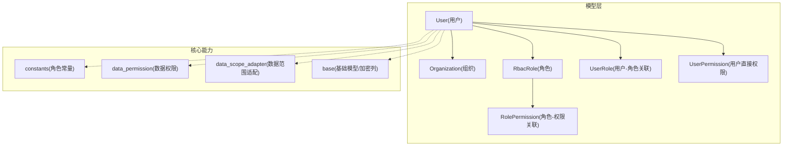
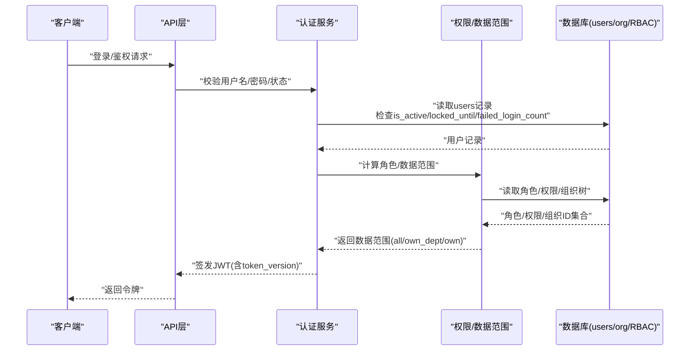
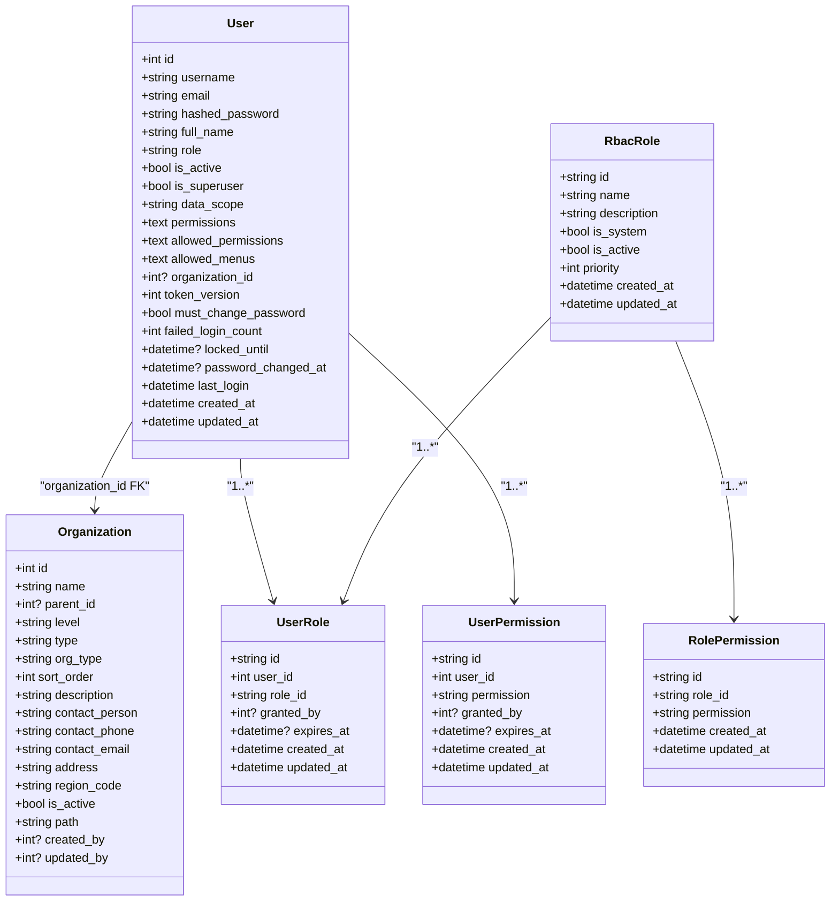
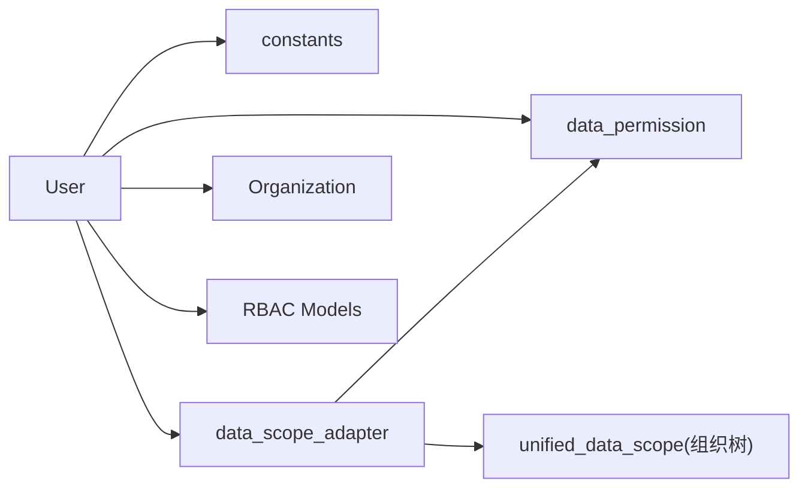

# 用户核心表设计

<cite>
**本文引用的文件**
- [backend/app/models/user.py](file://backend/app/models/user.py)
- [backend/app/core/constants.py](file://backend/app/core/constants.py)
- [backend/app/core/data_permission.py](file://backend/app/core/data_permission.py)
- [backend/app/core/data_scope_adapter.py](file://backend/app/core/data_scope_adapter.py)
- [backend/app/models/organization.py](file://backend/app/models/organization.py)
- [backend/app/models/rbac.py](file://backend/app/models/rbac.py)
- [backend/app/models/base.py](file://backend/app/models/base.py)
- [backend/alembic/versions/token_version_001_add_token_version.py](file://backend/alembic/versions/token_version_001_add_token_version.py)
</cite>

## 目录
1. [简介](#简介)
2. [项目结构](#项目结构)
3. [核心组件](#核心组件)
4. [架构总览](#架构总览)
5. [详细组件分析](#详细组件分析)
6. [依赖关系分析](#依赖关系分析)
7. [性能考虑](#性能考虑)
8. [故障排查指南](#故障排查指南)
9. [结论](#结论)
10. [附录](#附录)

## 简介
本文件围绕“用户核心表”（users）进行系统化、可落地的设计说明，覆盖字段定义、类型约束与默认值、业务含义、四级角色体系、数据范围隔离策略、用户状态管理、索引优化以及与组织、RBAC 的关系映射。文档同时给出基于源码的架构图、类图、时序图和流程图，帮助读者快速理解并正确扩展该表。

## 项目结构
用户核心表位于后端模型层，配合常量、权限计算、数据范围适配以及迁移脚本共同实现完整能力：
- 模型定义：backend/app/models/user.py
- 角色常量与归一化：backend/app/core/constants.py
- 数据权限判定与过滤：backend/app/core/data_permission.py
- 统一数据范围适配层：backend/app/core/data_scope_adapter.py
- 组织树与层级：backend/app/models/organization.py
- RBAC 相关表与关系：backend/app/models/rbac.py
- 基础模型与加密列：backend/app/models/base.py
- Token 版本迁移：backend/alembic/versions/token_version_001_add_token_version.py



图表来源
- [backend/app/models/user.py:26-85](file://backend/app/models/user.py#L26-L85)
- [backend/app/models/organization.py:31-78](file://backend/app/models/organization.py#L31-L78)
- [backend/app/models/rbac.py:31-160](file://backend/app/models/rbac.py#L31-L160)
- [backend/app/core/constants.py:27-50](file://backend/app/core/constants.py#L27-L50)
- [backend/app/core/data_permission.py:20-80](file://backend/app/core/data_permission.py#L20-L80)
- [backend/app/core/data_scope_adapter.py:58-183](file://backend/app/core/data_scope_adapter.py#L58-L183)
- [backend/app/models/base.py:23-45](file://backend/app/models/base.py#L23-L45)

章节来源
- [backend/app/models/user.py:26-85](file://backend/app/models/user.py#L26-L85)
- [backend/app/core/constants.py:27-50](file://backend/app/core/constants.py#L27-L50)
- [backend/app/core/data_permission.py:20-80](file://backend/app/core/data_permission.py#L20-L80)
- [backend/app/core/data_scope_adapter.py:58-183](file://backend/app/core/data_scope_adapter.py#L58-L183)
- [backend/app/models/organization.py:31-78](file://backend/app/models/organization.py#L31-L78)
- [backend/app/models/rbac.py:31-160](file://backend/app/models/rbac.py#L31-L160)
- [backend/app/models/base.py:23-45](file://backend/app/models/base.py#L23-L45)

## 核心组件
- 用户模型 User：承载用户主信息、安全认证、权限控制、审计追踪等全部核心字段，并提供便捷属性与方法（如权限列表解析、菜单白名单解析、Token 版本管理与失效）。
- 角色常量与归一化：集中维护四级角色（super_admin/admin/user/viewer），并对历史角色值进行归一化处理，确保前后端一致。
- 数据权限与范围适配：提供基于角色的数据范围判定（all/own_dept/own）与基于用户 data_scope 字段的组织树展开能力，统一查询过滤入口。
- 组织模型 Organization：支持树形结构与层级，支撑“本组织及下级”的数据范围语义。
- RBAC 模型族：通过 rbac_roles、rbac_user_roles、rbac_role_permissions、rbac_user_permissions 等表实现细粒度权限控制，并与 users 建立多对多/一对多关系。
- 基础模型 Base/BaseModel：提供 id、时间戳、同步版本号、软删除、PII 透明加密等通用能力。

章节来源
- [backend/app/models/user.py:26-152](file://backend/app/models/user.py#L26-L152)
- [backend/app/core/constants.py:27-87](file://backend/app/core/constants.py#L27-L87)
- [backend/app/core/data_permission.py:20-187](file://backend/app/core/data_permission.py#L20-L187)
- [backend/app/core/data_scope_adapter.py:58-225](file://backend/app/core/data_scope_adapter.py#L58-L225)
- [backend/app/models/organization.py:31-78](file://backend/app/models/organization.py#L31-L78)
- [backend/app/models/rbac.py:31-160](file://backend/app/models/rbac.py#L31-L160)
- [backend/app/models/base.py:23-185](file://backend/app/models/base.py#L23-L185)

## 架构总览
下图展示用户核心表与其在系统内的关键交互：认证与会话、角色与权限、数据范围过滤、组织树访问。



图表来源
- [backend/app/models/user.py:37-85](file://backend/app/models/user.py#L37-L85)
- [backend/app/core/constants.py:27-50](file://backend/app/core/constants.py#L27-L50)
- [backend/app/core/data_permission.py:33-80](file://backend/app/core/data_permission.py#L33-L80)
- [backend/app/core/data_scope_adapter.py:58-183](file://backend/app/core/data_scope_adapter.py#L58-L183)
- [backend/app/models/organization.py:31-78](file://backend/app/models/organization.py#L31-L78)
- [backend/app/models/rbac.py:31-160](file://backend/app/models/rbac.py#L31-L160)

## 详细组件分析

### 用户表（users）字段规范
- 基本信息
  - username：字符串，唯一且非空，用于登录标识。
  - email：字符串，唯一，用于通知与账号恢复。
  - full_name：字符串，显示名称。
  - phone：加密文本（PII 透明加密），存储联系电话。
  - department/position/avatar/gender/birthday/address/remark：辅助信息，便于展示与检索。
- 安全认证
  - hashed_password：非空，存储哈希后的密码。
  - token_version：整数，递增后使旧 JWT 立即失效；配合密码修改时间使用。
  - must_change_password：布尔，强制首次登录改密。
  - failed_login_count：整数，连续失败计数，结合锁定策略使用。
  - locked_until：带时区的时间，账户锁定截止时间。
  - password_changed_at：带时区时间，记录最近一次密码修改时间。
- 权限控制
  - role：字符串，默认 user；取值 super_admin/admin/user/viewer。
  - is_superuser：布尔，超级管理员标记。
  - data_scope：字符串，默认 org；取值 all/org/org_children/self。
  - permissions：文本，逗号分隔的权限列表。
  - allowed_permissions：文本，JSON 数组，用户级白名单权限。
  - allowed_menus：文本，JSON 数组或 NULL，控制可见菜单（NULL 继承角色默认，[] 表示无菜单）。
  - permission_pack_id：外键，绑定权限包，影响菜单解析优先级。
- 组织归属
  - organization_id：外键，指向 organizations.id，可为空（SET NULL）。
- 审计追踪
  - last_login：带时区时间，最后登录时间。
  - created_at/updated_at：带时区时间，自动创建/更新时间。

章节来源
- [backend/app/models/user.py:37-85](file://backend/app/models/user.py#L37-L85)
- [backend/app/models/base.py:66-84](file://backend/app/models/base.py#L66-L84)
- [backend/app/models/base.py:23-45](file://backend/app/models/base.py#L23-L45)

### 四级角色体系（super_admin/admin/user/viewer）
- 角色常量与归一化
  - 统一常量：ROLE_SUPER_ADMIN、ROLE_ADMIN、ROLE_USER、ROLE_VIEWER。
  - 历史兼容：approval_leader/manager/operator 会被归一化为 admin/user。
  - 实用角色集合：PRACTICAL_ROLES 仅包含四个角色；ALL_ROLES 为合法角色集。
- 管理员判定
  - is_admin(user)：当 is_superuser 为真或 role 经 normalize_role 后为 admin/super_admin 时返回真。
- 数据范围映射
  - super_admin → ALL（全量）
  - admin → OWN_DEPT（本组织）
  - user/viewer → OWN（仅本人）

章节来源
- [backend/app/core/constants.py:27-87](file://backend/app/core/constants.py#L27-L87)
- [backend/app/core/data_permission.py:33-80](file://backend/app/core/data_permission.py#L33-L80)

### 数据范围隔离策略（org/org_children/self/all）
- 用户 data_scope 字段
  - all：不限制（管理员或显式配置）。
  - org：仅本组织。
  - org_children：本组织及其下级（需传入 db 会话以展开组织树）。
  - self：仅本人创建的数据。
- 统一适配层
  - get_accessible_org_ids：根据角色与 data_scope 计算可访问组织 ID 列表；self 返回空列表，all 返回 None（不限制）。
  - apply_scope_filter：统一注入 WHERE 条件；当模型缺少组织/所有者字段时 fail-closed，降级为仅本人或抛错拒绝。
- 组织树展开
  - 当需要 org_children 语义时，传入 db 会话以递归获取下级组织 ID。

```mermaid
flowchart TD
Start(["开始"]) --> CheckAdmin{"是否管理员或super_admin?"}
CheckAdmin --> |是| NoFilter["不过滤(全量)"]
CheckAdmin --> |否| CheckScope{"data_scope 是否为 all/self?"}
CheckScope --> |all| NoFilter
CheckScope --> |self| OwnerFilter["按所有者过滤(created_by == user.id)"]
CheckScope --> |其他| RoleScope["按角色计算范围(own_dept/own)"]
RoleScope --> OrgIds{"可访问组织ID?"}
OrgIds --> |None| NoFilter
OrgIds --> |[]| OwnerFilter
OrgIds --> |[ids]| OrgFilter["按组织ID IN (ids) 过滤"]
OrgFilter --> End(["结束"])
OwnerFilter --> End
NoFilter --> End
```

图表来源
- [backend/app/core/data_scope_adapter.py:58-183](file://backend/app/core/data_scope_adapter.py#L58-L183)
- [backend/app/core/data_permission.py:54-134](file://backend/app/core/data_permission.py#L54-L134)

章节来源
- [backend/app/core/data_scope_adapter.py:58-225](file://backend/app/core/data_scope_adapter.py#L58-L225)
- [backend/app/core/data_permission.py:54-187](file://backend/app/core/data_permission.py#L54-L187)

### 用户状态管理机制（is_active/must_change_password/locked_until）
- is_active：控制账号激活状态，未激活通常拒绝登录。
- must_change_password：首次登录或安全策略要求时强制改密。
- failed_login_count：累计失败次数，达到阈值可触发锁定。
- locked_until：锁定截止时间，超过时间后可重试。
- 与认证流程联动：登录成功更新 last_login；失败增加 failed_login_count；必要时设置 locked_until。

章节来源
- [backend/app/models/user.py:47-83](file://backend/app/models/user.py#L47-L83)

### 索引优化设计
- 单列索引
  - username、email：唯一且高频查询，提升登录与查找效率。
  - organization_id：组织维度筛选与报表统计。
  - department：部门筛选。
- 复合索引
  - ix_users_role_active：role + is_active，加速按角色与激活状态的组合查询。
- 建议
  - 若存在按 last_login 排序或筛选的场景，可考虑添加相应索引。
  - 对频繁过滤的 JSON 字段（allowed_permissions/allowed_menus）可通过应用层解析与缓存降低数据库压力。

章节来源
- [backend/app/models/user.py:31-35](file://backend/app/models/user.py#L31-L35)

### 关系映射配置
- 与组织
  - organization_id 外键指向 organizations.id，ondelete SET NULL，允许解绑。
- 与 RBAC
  - 通过 rbac_user_roles 将 users 与 rbac_roles 多对多关联。
  - 通过 rbac_role_permissions 将角色与权限关联。
  - 通过 rbac_user_permissions 将用户直接权限关联。
  - 通过 rbac_resource_access 实现资源级访问控制。
- 与 TwoFactorAuth
  - one-to-one 双向关系，用于二次认证。



图表来源
- [backend/app/models/user.py:26-90](file://backend/app/models/user.py#L26-L90)
- [backend/app/models/organization.py:31-78](file://backend/app/models/organization.py#L31-L78)
- [backend/app/models/rbac.py:31-160](file://backend/app/models/rbac.py#L31-L160)

章节来源
- [backend/app/models/user.py:26-90](file://backend/app/models/user.py#L26-L90)
- [backend/app/models/organization.py:31-78](file://backend/app/models/organization.py#L31-L78)
- [backend/app/models/rbac.py:31-160](file://backend/app/models/rbac.py#L31-L160)

### Token 版本与失效机制
- token_version：每次密码修改或安全事件时递增，使所有现有 JWT 失效。
- 迁移脚本：确保数据库中存在 token_version 字段并具备合理默认值。
- 最佳实践：在密码变更、批量重置、安全审计后调用 revoke_all_tokens() 方法。

章节来源
- [backend/app/models/user.py:78-83](file://backend/app/models/user.py#L78-L83)
- [backend/app/models/user.py:145-149](file://backend/app/models/user.py#L145-L149)
- [backend/alembic/versions/token_version_001_add_token_version.py](file://backend/alembic/versions/token_version_001_add_token_version.py)

## 依赖关系分析
- 模块耦合
  - User 依赖 constants（角色常量）、data_permission（数据范围判定）、data_scope_adapter（统一过滤）、organization（组织归属）、rbac（角色与权限）。
  - data_scope_adapter 依赖 data_permission 与 unified_data_scope（组织树展开）。
- 外部依赖
  - 数据库：SQLAlchemy ORM、Alembic 迁移。
  - 加密：PII 透明加密（EncryptedText）。
- 潜在循环依赖
  - 通过延迟导入与字符串引用避免循环导入（例如 models/user.py 中对 Organization、PermissionPack 的字符串引用）。



图表来源
- [backend/app/models/user.py:17-22](file://backend/app/models/user.py#L17-L22)
- [backend/app/core/data_scope_adapter.py:76-107](file://backend/app/core/data_scope_adapter.py#L76-L107)
- [backend/app/core/data_permission.py:14-16](file://backend/app/core/data_permission.py#L14-L16)

章节来源
- [backend/app/models/user.py:17-22](file://backend/app/models/user.py#L17-L22)
- [backend/app/core/data_scope_adapter.py:76-107](file://backend/app/core/data_scope_adapter.py#L76-L107)
- [backend/app/core/data_permission.py:14-16](file://backend/app/core/data_permission.py#L14-L16)

## 性能考虑
- 索引策略
  - 已为 username、email、organization_id、department、role+is_active 建立索引，覆盖常见查询路径。
  - 建议在高频排序/过滤字段上按需追加索引（如 last_login）。
- 查询优化
  - 使用统一数据范围适配层减少重复逻辑，避免 N+1 查询。
  - 对 JSON 字段（allowed_permissions/allowed_menus）采用应用层解析与缓存，降低数据库负担。
- 并发与安全
  - token_version 与密码修改时间保证会话一致性。
  - 失败登录计数与锁定截止时间防止暴力破解。

[本节为通用指导，无需特定文件来源]

## 故障排查指南
- 登录失败与锁定
  - 现象：登录被拒绝或提示账户锁定。
  - 排查：检查 failed_login_count、locked_until、is_active、must_change_password。
  - 处理：解锁账户、重置失败计数、引导改密。
- 数据不可见
  - 现象：用户无法看到应有权限的数据。
  - 排查：确认 role、data_scope、organization_id 是否正确；检查 apply_scope_filter 是否因模型缺字段而 fail-closed。
  - 处理：修正 data_scope、补充组织归属或模型字段。
- 权限不生效
  - 现象：菜单或功能按钮未显示。
  - 排查：检查 allowed_menus、permissions、permission_pack_id 与角色默认菜单的优先级。
  - 处理：调整 allowed_menus 或权限包绑定。

章节来源
- [backend/app/models/user.py:47-83](file://backend/app/models/user.py#L47-L83)
- [backend/app/core/data_scope_adapter.py:170-183](file://backend/app/core/data_scope_adapter.py#L170-L183)
- [backend/app/models/user.py:98-139](file://backend/app/models/user.py#L98-L139)

## 结论
用户核心表通过清晰的字段划分、严格的类型约束与默认值、完善的角色与数据范围机制，实现了高内聚、低耦合的安全与权限体系。配合统一的权限适配层与组织树展开能力，既能满足当前业务需求，又具备良好的可扩展性。建议在新增字段或扩展权限策略时，遵循本文件的约定与最佳实践，确保系统的一致性与稳定性。

## 附录
- 常用操作建议
  - 创建用户：设置 username/email/hashed_password/role/organization_id，并根据策略设置 data_scope。
  - 修改密码：更新 hashed_password 并调用 revoke_all_tokens() 使旧令牌失效。
  - 数据范围：优先使用 apply_scope_filter 统一注入过滤条件。
- 参考实现路径
  - 用户模型：backend/app/models/user.py
  - 角色常量：backend/app/core/constants.py
  - 数据权限：backend/app/core/data_permission.py
  - 数据范围适配：backend/app/core/data_scope_adapter.py
  - 组织模型：backend/app/models/organization.py
  - RBAC 模型：backend/app/models/rbac.py
  - 基础模型：backend/app/models/base.py
  - Token 版本迁移：backend/alembic/versions/token_version_001_add_token_version.py

[本节为概览性内容，无需特定文件来源]