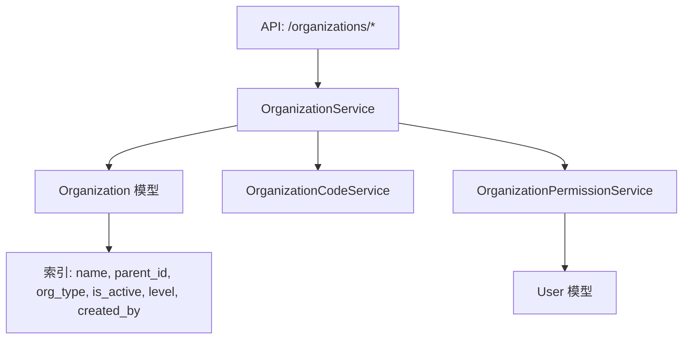
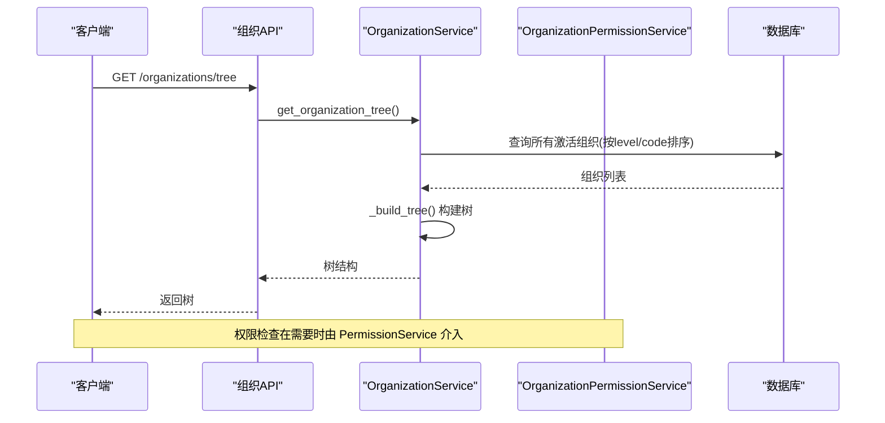
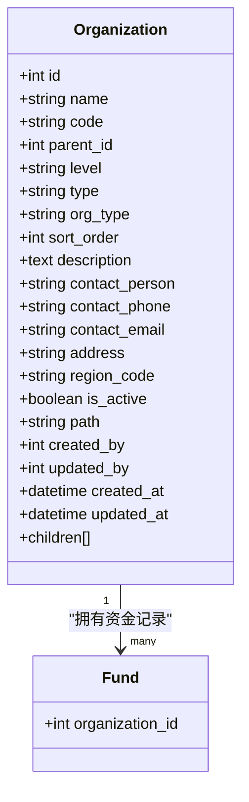
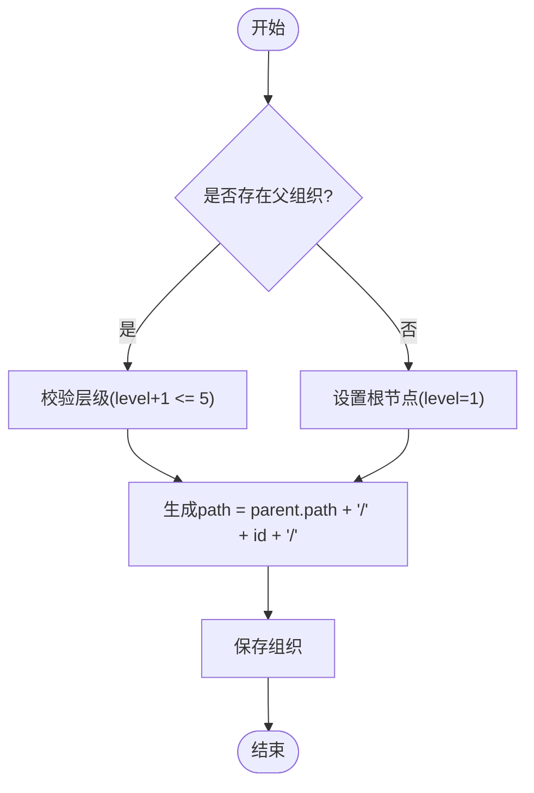
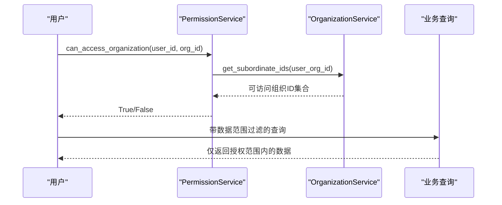
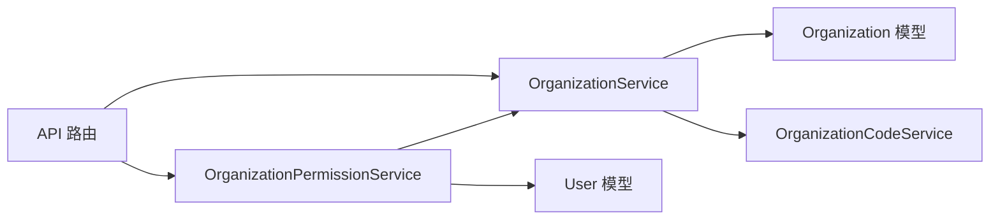
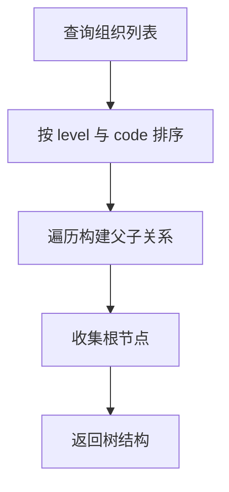

# 组织机构表设计

<cite>
**本文引用的文件**
- [backend/app/models/organization.py](file://backend/app/models/organization.py)
- [backend/app/schemas/organization.py](file://backend/app/schemas/organization.py)
- [backend/app/services/organization_service.py](file://backend/app/services/organization_service.py)
- [backend/app/services/organization_permission_service.py](file://backend/app/services/organization_permission_service.py)
- [backend/app/services/organization_code_service.py](file://backend/app/services/organization_code_service.py)
- [backend/app/api/v1/organization.py](file://backend/app/api/v1/organization.py)
</cite>

## 目录
1. [简介](#简介)
2. [项目结构](#项目结构)
3. [核心组件](#核心组件)
4. [架构总览](#架构总览)
5. [详细组件分析](#详细组件分析)
6. [依赖关系分析](#依赖关系分析)
7. [性能考虑](#性能考虑)
8. [故障排查指南](#故障排查指南)
9. [结论](#结论)
10. [附录：组织树构建算法与使用示例](#附录：组织树构建算法与使用示例)

## 简介
本文件围绕“organizations”组织机构表的完整设计进行说明，涵盖字段定义、层级结构与父子关系管理、状态控制、权限继承与数据范围、查询优化与性能策略，以及组织树构建算法和使用示例。目标是帮助开发者与运维人员准确理解并高效使用该模块。

## 项目结构
与组织机构相关的代码主要分布在以下位置：
- 数据模型：backend/app/models/organization.py
- 接口校验与响应模型：backend/app/schemas/organization.py
- 业务服务：backend/app/services/organization_service.py、organization_permission_service.py、organization_code_service.py
- API 路由：backend/app/api/v1/organization.py

图表来源
- [backend/app/api/v1/organization.py:126-285](file://backend/app/api/v1/organization.py#L126-L285)
- [backend/app/services/organization_service.py:70-156](file://backend/app/services/organization_service.py#L70-L156)
- [backend/app/models/organization.py:31-43](file://backend/app/models/organization.py#L31-L43)

章节来源
- [backend/app/models/organization.py:31-78](file://backend/app/models/organization.py#L31-L78)
- [backend/app/api/v1/organization.py:126-285](file://backend/app/api/v1/organization.py#L126-L285)

## 核心组件
- 数据模型 Organization：定义 organizations 表结构与自引用关系，提供基础索引。
- Schema：定义创建、更新、响应、树节点、统计等数据结构。
- OrganizationService：实现组织的创建、查询、更新、删除、树构建、祖先/后代获取、排序批量更新等。
- OrganizationPermissionService：基于用户所属组织实现数据范围过滤与访问控制。
- OrganizationCodeService：生成唯一组织编码（支持前缀）。
- API：提供组织列表、树、统计、导出、CRUD、移动、排序等端点。

章节来源
- [backend/app/models/organization.py:31-78](file://backend/app/models/organization.py#L31-L78)
- [backend/app/schemas/organization.py:9-100](file://backend/app/schemas/organization.py#L9-L100)
- [backend/app/services/organization_service.py:70-521](file://backend/app/services/organization_service.py#L70-L521)
- [backend/app/services/organization_permission_service.py:45-452](file://backend/app/services/organization_permission_service.py#L45-L452)
- [backend/app/services/organization_code_service.py:11-55](file://backend/app/services/organization_code_service.py#L11-L55)
- [backend/app/api/v1/organization.py:126-800](file://backend/app/api/v1/organization.py#L126-L800)

## 架构总览
组织模块采用分层设计：API 层负责参数校验与权限拦截；Service 层封装业务逻辑（含树形结构操作、编码生成、权限计算）；Model 层映射数据库表与关系；Schema 层统一输入输出契约。

图表来源
- [backend/app/api/v1/organization.py:259-285](file://backend/app/api/v1/organization.py#L259-L285)
- [backend/app/services/organization_service.py:182-243](file://backend/app/services/organization_service.py#L182-L243)

## 详细组件分析

### 数据模型与字段设计
- 基本信息字段
  - name：单位名称，必填
  - code：单位编号，唯一且可选
  - description：描述
  - address：地址
  - region_code：行政区划编码，用于数据权限前缀匹配
- 层级与结构字段
  - parent_id：上级单位ID，自引用外键，级联删除
  - level：层级（枚举：level_1~level_5）
  - path：路径（如 /1/5/12/），用于快速子树检索
  - sort_order：同级排序
- 管理信息字段
  - contact_person：联系人
  - contact_phone：联系电话（透明加密存储）
  - contact_email：联系邮箱
  - manager_id：未在模型中直接定义，可通过用户-组织关联或扩展字段实现
  - contact_info：未作为独立字段存在，可组合 contact_* 字段表达
- 状态控制字段
  - is_active：是否启用（默认启用）
  - is_deleted：未在该模型中使用软删除标记；删除通过 is_active 置为 False 的逻辑删除实现
- 审计字段
  - created_by、updated_by、created_at、updated_at（继承 BaseModel）

图表来源
- [backend/app/models/organization.py:31-78](file://backend/app/models/organization.py#L31-L78)

章节来源
- [backend/app/models/organization.py:31-78](file://backend/app/models/organization.py#L31-L78)
- [backend/app/schemas/organization.py:9-100](file://backend/app/schemas/organization.py#L9-L100)

### 层级结构与父子关系管理
- 父级验证：创建时若指定 parent_id，需确保父组织存在；更新时禁止将自身设为父级。
- 循环引用防护：移动组织到新父级时，沿父链向上检查，防止形成环。
- 路径维护：新增组织后根据父级路径拼接当前 ID，形成 path，便于子树范围查询。
- 层级深度限制：level 使用枚举 level_1~level_5，最大层级为 5。
- 删除保护：删除前检查是否存在激活的子组织；同时检查业务数据引用（项目、用户）以阻止硬删风险。

图表来源
- [backend/app/services/organization_service.py:82-156](file://backend/app/services/organization_service.py#L82-L156)
- [backend/app/api/v1/organization.py:742-783](file://backend/app/api/v1/organization.py#L742-L783)

章节来源
- [backend/app/services/organization_service.py:82-156](file://backend/app/services/organization_service.py#L82-L156)
- [backend/app/api/v1/organization.py:742-783](file://backend/app/api/v1/organization.py#L742-L783)

### 权限与数据继承机制
- 访问范围：用户可访问其所属组织及其所有下级组织；超级管理员可访问全部组织。
- 管理权限：仅管理员/超级管理员可创建、更新、删除组织；普通用户不能管理自己所属组织本身，只能管理其下级。
- 数据范围过滤：通过 get_data_scope_filter 生成 in_(accessible_orgs) 条件，应用到业务查询中。
- 访问日志：记录每次访问尝试的允许/拒绝情况，便于审计。

图表来源
- [backend/app/services/organization_permission_service.py:90-141](file://backend/app/services/organization_permission_service.py#L90-L141)
- [backend/app/services/organization_permission_service.py:278-297](file://backend/app/services/organization_permission_service.py#L278-L297)

章节来源
- [backend/app/services/organization_permission_service.py:90-141](file://backend/app/services/organization_permission_service.py#L90-L141)
- [backend/app/services/organization_permission_service.py:202-243](file://backend/app/services/organization_permission_service.py#L202-L243)
- [backend/app/services/organization_permission_service.py:278-297](file://backend/app/services/organization_permission_service.py#L278-L297)

### 组织编码体系
- 生成规则：基于名称、父编码与随机串哈希生成短码，支持前缀（如 ORG-XXXXXXXX）。
- 冲突处理：内存注册表检测碰撞，必要时追加随机后缀保证唯一性。
- 校验规则：长度≥4且仅包含字母数字。

章节来源
- [backend/app/services/organization_code_service.py:22-46](file://backend/app/services/organization_code_service.py#L22-L46)

### API 能力概览
- 列表分页：支持类型、父级、状态、关键词搜索，默认无过滤请求缓存。
- 树结构：返回扁平化组织并按 parent_id 组装为树。
- 统计：总数、活跃数、类型分布、层级分布、成员数等。
- 导出：Excel 导出组织列表（含成员数）。
- CRUD：创建、更新、删除（逻辑删除）、移动、批量排序。
- 祖先/子级：获取祖先链与子级列表。

章节来源
- [backend/app/api/v1/organization.py:126-800](file://backend/app/api/v1/organization.py#L126-L800)

## 依赖关系分析
- OrganizationService 依赖：
  - Organization 模型（读写）
  - OrganizationCodeService（编码生成）
  - 事务工具 safe_commit（提交）
- OrganizationPermissionService 依赖：
  - User 模型（用户归属）
  - OrganizationService（获取下级/祖先）
  - 权限工具 is_admin/is_superuser
- API 依赖：
  - 认证与权限中间件
  - 缓存管理器（列表缓存与失效）
  - 工作日志服务（写操作记录）

图表来源
- [backend/app/api/v1/organization.py:126-800](file://backend/app/api/v1/organization.py#L126-L800)
- [backend/app/services/organization_service.py:70-156](file://backend/app/services/organization_service.py#L70-L156)
- [backend/app/services/organization_permission_service.py:45-141](file://backend/app/services/organization_permission_service.py#L45-L141)

章节来源
- [backend/app/services/organization_service.py:70-156](file://backend/app/services/organization_service.py#L70-L156)
- [backend/app/services/organization_permission_service.py:45-141](file://backend/app/services/organization_permission_service.py#L45-L141)
- [backend/app/api/v1/organization.py:126-800](file://backend/app/api/v1/organization.py#L126-L800)

## 性能考虑
- 索引优化：对 name、parent_id、org_type、is_active、level、created_by 建立索引，提升常见查询效率。
- 路径前缀查询：利用 path LIKE 'xxx%' 快速获取子树，避免递归 JOIN。
- 缓存策略：默认无过滤的组织列表请求使用缓存（TTL 5分钟），写操作后主动失效。
- 批量操作：提供批量排序更新接口，减少多次请求开销。
- 统计聚合：使用 SQL 聚合函数（count、group by）减少应用层计算。

章节来源
- [backend/app/models/organization.py:36-43](file://backend/app/models/organization.py#L36-L43)
- [backend/app/api/v1/organization.py:126-182](file://backend/app/api/v1/organization.py#L126-L182)
- [backend/app/services/organization_service.py:400-437](file://backend/app/services/organization_service.py#L400-L437)

## 故障排查指南
- 删除失败
  - 存在激活子组织：需先删除或停用子组织
  - 被业务数据引用：项目或用户仍绑定该组织，需先迁移或清理
- 移动失败
  - 目标父组织不存在
  - 移动会导致循环引用（将组织移动到其子组织下）
- 权限不足
  - 非管理员/超级管理员无法执行组织管理操作
  - 普通用户无法管理自己所属组织本身
- 编码重复
  - 手动设置的 code 已存在，需更换或留空由系统自动生成

章节来源
- [backend/app/services/organization_service.py:351-398](file://backend/app/services/organization_service.py#L351-L398)
- [backend/app/api/v1/organization.py:632-700](file://backend/app/api/v1/organization.py#L632-L700)
- [backend/app/api/v1/organization.py:742-783](file://backend/app/api/v1/organization.py#L742-L783)

## 结论
organizations 表通过明确的字段设计、完善的索引与路径前缀机制，实现了高效的层级管理与子树查询。配合权限服务的数据范围过滤，既保证了数据安全隔离，又提升了查询性能。建议在实际使用中遵循层级深度限制、谨慎移动组织以避免环路，并利用缓存与批量接口优化性能。

## 附录：组织树构建算法与使用示例

### 树构建算法
- 单次查询：获取所有（或指定根下的）组织，按 level 与 code 排序。
- 内存组装：遍历结果，将每个节点挂到其父节点 children 列表中，最终返回根节点集合。
- 复杂度：时间 O(n)，空间 O(n)。

图表来源
- [backend/app/services/organization_service.py:182-243](file://backend/app/services/organization_service.py#L182-L243)
- [backend/app/api/v1/organization.py:247-285](file://backend/app/api/v1/organization.py#L247-L285)

### 使用示例（概念性）
- 获取组织树：调用 /organizations/tree，返回按层级与排序组织的树形结构。
- 获取子组织：调用 /organizations/{id}/children，返回直接子级列表。
- 获取祖先链：调用 /organizations/{id}/ancestors，返回从根到父的链式组织。
- 创建组织：POST /organizations，传入 name、parent_id、type/level 等，系统自动分配 code 与 path。
- 移动组织：POST /organizations/{id}/move，指定 new_parent_id，系统将校验循环引用并更新。
- 批量排序：POST /organizations/batch-update-sort，传入 [{id, sort_order}, ...] 批量更新同级顺序。

章节来源
- [backend/app/api/v1/organization.py:259-285](file://backend/app/api/v1/organization.py#L259-L285)
- [backend/app/api/v1/organization.py:511-577](file://backend/app/api/v1/organization.py#L511-L577)
- [backend/app/api/v1/organization.py:703-733](file://backend/app/api/v1/organization.py#L703-L733)
- [backend/app/api/v1/organization.py:742-783](file://backend/app/api/v1/organization.py#L742-L783)
- [backend/app/api/v1/organization.py:786-800](file://backend/app/api/v1/organization.py#L786-L800)