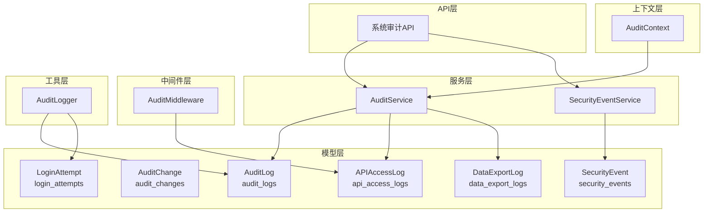
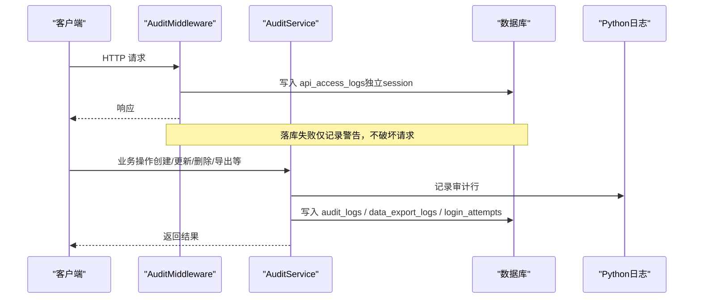
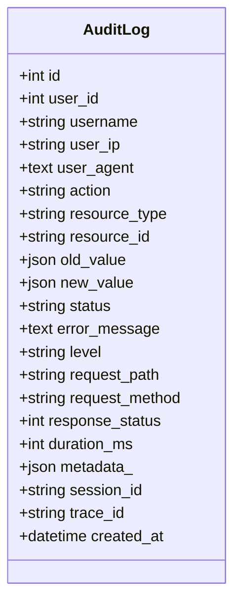
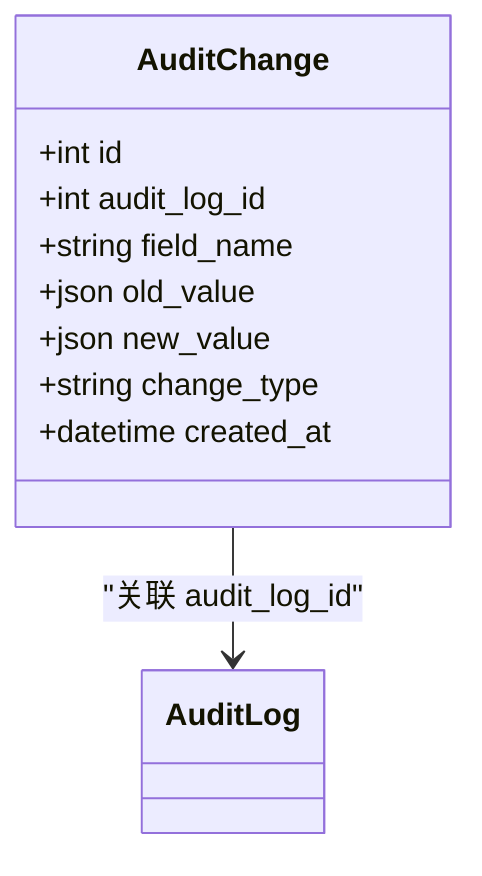
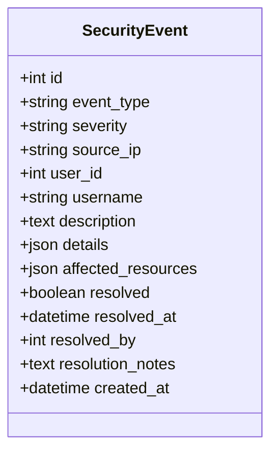
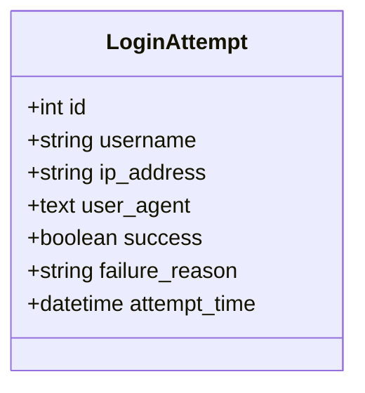
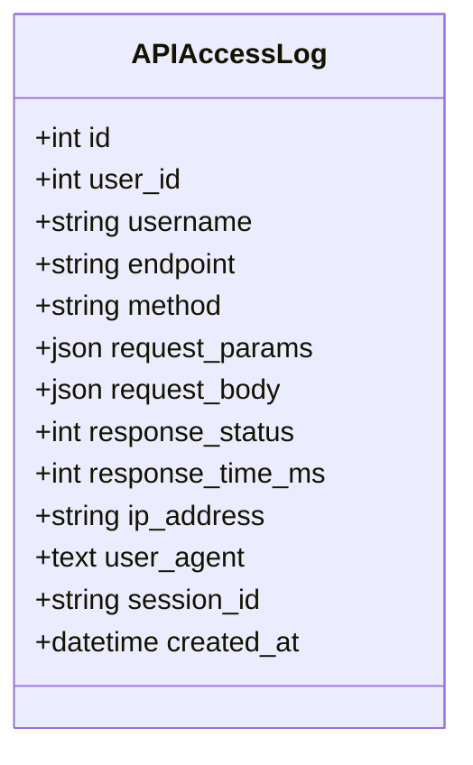
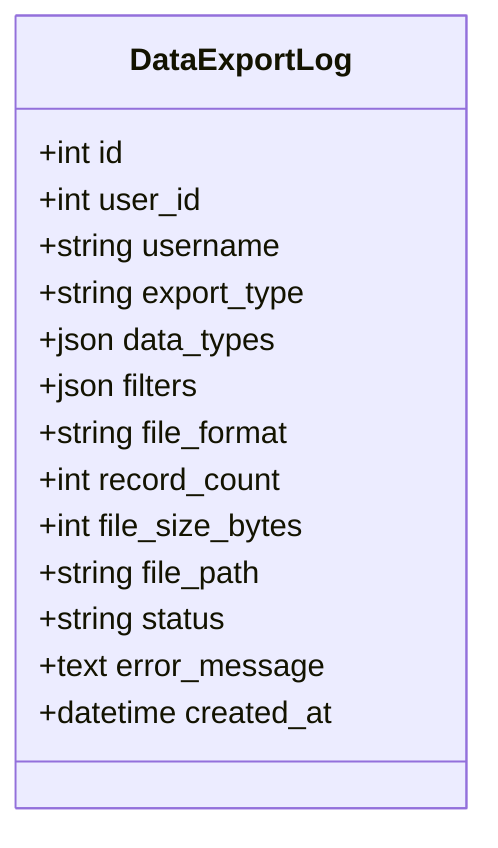
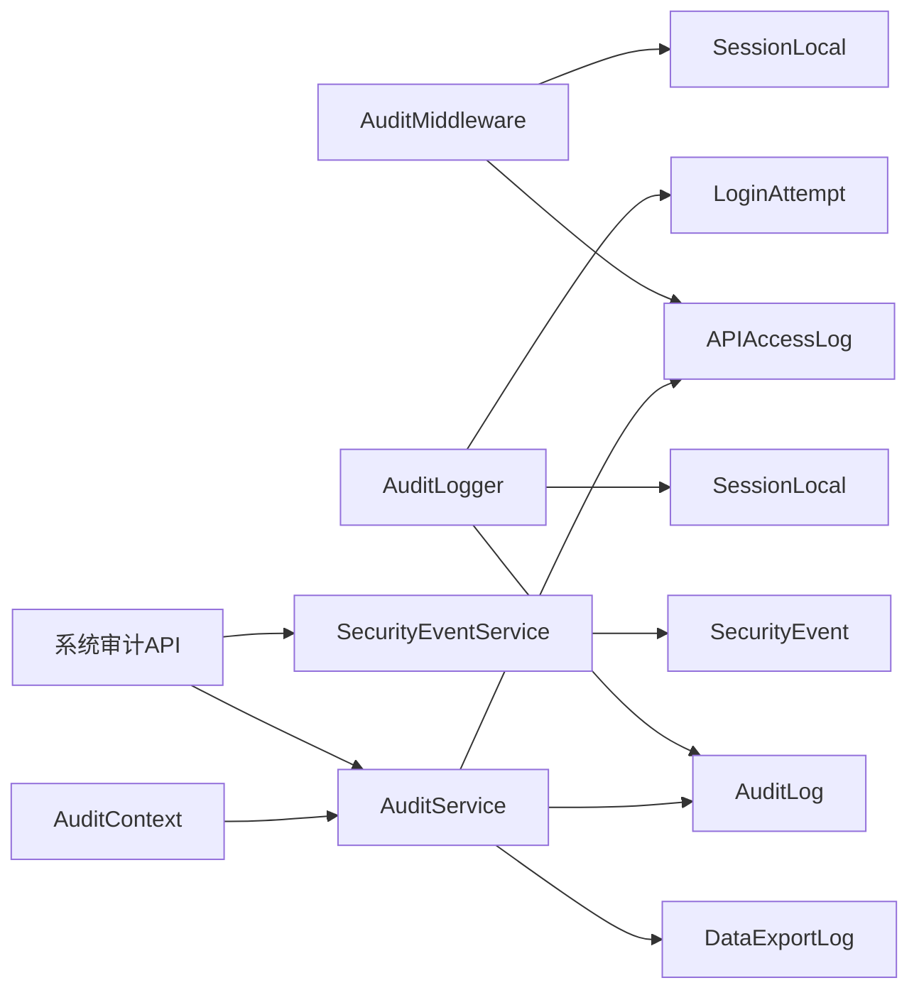
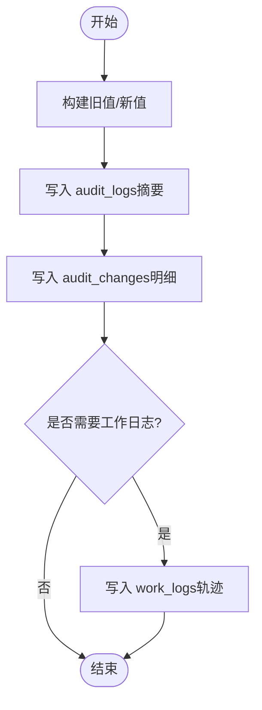

# 审计日志表结构

<cite>
**本文引用的文件**
- [backend/app/models/audit.py](file://backend/app/models/audit.py)
- [backend/app/models/audit_change.py](file://backend/app/models/audit_change.py)
- [backend/app/core/audit_middleware.py](file://backend/app/core/audit_middleware.py)
- [backend/app/services/audit_service.py](file://backend/app/services/audit_service.py)
- [backend/app/utils/audit_logger.py](file://backend/app/utils/audit_logger.py)
- [backend/app/middleware/audit_context.py](file://backend/app/middleware/audit_context.py)
- [backend/app/api/v1/system/audit.py](file://backend/app/api/v1/system/audit.py)
- [backend/alembic/versions/003_add_performance_indexes.py](file://backend/alembic/versions/003_add_performance_indexes.py)
- [backend/alembic/versions/004_add_security_tables.py](file://backend/alembic/versions/004_add_security_tables.py)
- [backend/alembic/versions/008_add_advanced_performance_indexes.py](file://backend/alembic/versions/008_add_advanced_performance_indexes.py)
</cite>

## 目录
1. [简介](#简介)
2. [项目结构](#项目结构)
3. [核心组件](#核心组件)
4. [架构总览](#架构总览)
5. [详细组件分析](#详细组件分析)
6. [依赖关系分析](#依赖关系分析)
7. [性能与查询优化](#性能与查询优化)
8. [故障排查指南](#故障排查指南)
9. [结论](#结论)
10. [附录：字段级变更记录（双写机制）](#附录字段级变更记录双写机制)

## 简介
本文件面向“审计七件套”的数据库表结构与实现，聚焦以下目标：
- 完整说明 audit_logs 表的“用户操作、数据变更、权限访问”全链路追踪能力。
- 详细说明 audit_changes 表的字段级变更记录，支撑“双写审计机制”确保一致性。
- 解释安全事件表 security_events、登录尝试表 login_attempts、API 访问日志表 api_access_logs、数据导出日志表 data_export_logs 的职责与使用场景。
- 结合军用合规要求，给出审计策略、归档思路与查询优化方案。

## 项目结构
审计相关代码主要分布在以下模块：
- 模型层：定义审计七件套表结构及枚举类型
- 服务层：封装审计写入、查询、统计与安全事件处理
- 中间件层：自动记录 API 访问日志并提取用户身份
- 工具层：统一审计日志双写（文件日志 + 数据库）
- 上下文层：通过 ContextVar 传递当前用户与请求标识
- API 层：提供审计日志、安全事件、登录尝试、API 访问、导出日志的查询与管理接口
- 迁移脚本：为审计表添加索引与建表逻辑

图表来源
- [backend/app/models/audit.py:53-205](file://backend/app/models/audit.py#L53-L205)
- [backend/app/models/audit_change.py:13-33](file://backend/app/models/audit_change.py#L13-L33)
- [backend/app/core/audit_middleware.py:11-109](file://backend/app/core/audit_middleware.py#L11-L109)
- [backend/app/services/audit_service.py:58-510](file://backend/app/services/audit_service.py#L58-L510)
- [backend/app/utils/audit_logger.py:60-297](file://backend/app/utils/audit_logger.py#L60-L297)
- [backend/app/middleware/audit_context.py:15-58](file://backend/app/middleware/audit_context.py#L15-L58)
- [backend/app/api/v1/system/audit.py:19-615](file://backend/app/api/v1/system/audit.py#L19-L615)

章节来源
- [backend/app/models/audit.py:53-205](file://backend/app/models/audit.py#L53-L205)
- [backend/app/models/audit_change.py:13-33](file://backend/app/models/audit_change.py#L13-L33)
- [backend/app/core/audit_middleware.py:11-109](file://backend/app/core/audit_middleware.py#L11-L109)
- [backend/app/services/audit_service.py:58-510](file://backend/app/services/audit_service.py#L58-L510)
- [backend/app/utils/audit_logger.py:60-297](file://backend/app/utils/audit_logger.py#L60-L297)
- [backend/app/middleware/audit_context.py:15-58](file://backend/app/middleware/audit_context.py#L15-L58)
- [backend/app/api/v1/system/audit.py:19-615](file://backend/app/api/v1/system/audit.py#L19-L615)

## 核心组件
- AuditLog（audit_logs）：通用操作审计主表，记录用户、动作、资源、状态、级别、请求路径、耗时、会话与追踪ID等，支持分页与多维过滤查询。
- AuditChange（audit_changes）：字段级变更记录，关联到 audit_logs.id，用于细粒度差异追溯。
- SecurityEvent（security_events）：安全事件记录，包含事件类型、严重等级、影响资源、解决状态与备注。
- LoginAttempt（login_attempts）：登录尝试记录，成功与失败均落库，支持按用户名/IP与时间范围查询。
- APIAccessLog（api_access_logs）：每次HTTP请求的独立短事务落库，记录端点、方法、状态码、耗时、IP、UA与会话。
- DataExportLog（data_export_logs）：数据导出审计，记录导出类型、数据类型、格式、记录数、文件大小、状态与错误信息。

章节来源
- [backend/app/models/audit.py:53-205](file://backend/app/models/audit.py#L53-L205)
- [backend/app/models/audit_change.py:13-33](file://backend/app/models/audit_change.py#L13-L33)

## 架构总览
审计体系由“中间件自动采集 + 工具/服务统一写入 + 模型持久化 + API 可观测”构成。关键流程如下：
- 请求进入时，AuditMiddleware 解析 JWT 获取用户身份，记录 API 访问日志（独立 session）。
- 业务调用 AuditLogger/AuditService 进行审计写入，同时写 Python 日志与数据库（双写）。
- SQLAlchemy 事件监听器在写操作后触发工作日志写入（非审计表），用于操作轨迹补充。
- 管理员通过系统审计 API 对审计日志、安全事件、登录尝试、API 访问、导出日志进行查询与管理。

图表来源
- [backend/app/core/audit_middleware.py:18-109](file://backend/app/core/audit_middleware.py#L18-L109)
- [backend/app/services/audit_service.py:62-273](file://backend/app/services/audit_service.py#L62-L273)
- [backend/app/utils/audit_logger.py:67-184](file://backend/app/utils/audit_logger.py#L67-L184)

## 详细组件分析

### audit_logs（通用操作审计主表）
- 作用：记录所有关键操作的“谁、做了什么、对什么资源、结果如何”，支持后续审计与合规检查。
- 关键字段：
  - 用户与上下文：user_id、username、user_ip、user_agent、session_id、trace_id
  - 操作与资源：action、resource_type、resource_id
  - 值快照：old_value、new_value（JSON）
  - 状态与级别：status、level、error_message
  - 请求与耗时：request_path、request_method、response_status、duration_ms
  - 元数据：metadata_（JSON）
  - 时间：created_at
- 索引：针对 user_id、action、created_at、resource_type/resource_id 等多维查询优化。

图表来源
- [backend/app/models/audit.py:53-96](file://backend/app/models/audit.py#L53-L96)

章节来源
- [backend/app/models/audit.py:53-96](file://backend/app/models/audit.py#L53-L96)
- [backend/alembic/versions/003_add_performance_indexes.py:41-45](file://backend/alembic/versions/003_add_performance_indexes.py#L41-L45)
- [backend/alembic/versions/008_add_advanced_performance_indexes.py:51-53](file://backend/alembic/versions/008_add_advanced_performance_indexes.py#L51-L53)

### audit_changes（字段级变更记录）
- 作用：记录具体字段的旧值与新值，形成“双写审计”中的细粒度变更明细，便于回溯与取证。
- 关键字段：
  - audit_log_id（外键，级联删除）
  - field_name、change_type（create/update/delete）
  - old_value、new_value（JSON）
  - created_at
- 索引：audit_log_id、field_name 提升关联与字段维度查询效率。

图表来源
- [backend/app/models/audit_change.py:13-33](file://backend/app/models/audit_change.py#L13-L33)
- [backend/alembic/versions/004_add_security_tables.py:60-74](file://backend/alembic/versions/004_add_security_tables.py#L60-L74)

章节来源
- [backend/app/models/audit_change.py:13-33](file://backend/app/models/audit_change.py#L13-L33)
- [backend/alembic/versions/004_add_security_tables.py:60-74](file://backend/alembic/versions/004_add_security_tables.py#L60-L74)

### security_events（安全事件表）
- 作用：记录异常行为与安全事件，如暴力破解、越权访问等，支持严重等级、解决状态与备注。
- 关键字段：event_type、severity、source_ip、user_id、username、description、details、affected_resources、resolved、resolved_at、resolved_by、resolution_notes、created_at。
- 索引：severity+created_at、event_type+created_at。

图表来源
- [backend/app/models/audit.py:98-126](file://backend/app/models/audit.py#L98-L126)

章节来源
- [backend/app/models/audit.py:98-126](file://backend/app/models/audit.py#L98-L126)

### login_attempts（登录尝试表）
- 作用：记录每次登录尝试（成功/失败），用于暴力破解防护与账号风控。
- 关键字段：username、ip_address、user_agent、success、failure_reason、attempt_time。
- 索引：username+attempt_time、ip_address+attempt_time。

图表来源
- [backend/app/models/audit.py:128-146](file://backend/app/models/audit.py#L128-L146)

章节来源
- [backend/app/models/audit.py:128-146](file://backend/app/models/audit.py#L128-L146)

### api_access_logs（API访问日志表）
- 作用：每次HTTP请求的独立短事务落库，记录端点、方法、状态码、耗时、IP、UA与会话，用于性能监控与问题定位。
- 关键字段：user_id、username、endpoint、method、request_params、request_body、response_status、response_time_ms、ip_address、user_agent、session_id、created_at。
- 索引：user_id+created_at、endpoint+created_at。

图表来源
- [backend/app/models/audit.py:148-176](file://backend/app/models/audit.py#L148-L176)

章节来源
- [backend/app/models/audit.py:148-176](file://backend/app/models/audit.py#L148-L176)

### data_export_logs（数据导出日志表）
- 作用：记录数据导出操作，包括导出类型、数据类型、文件格式、记录数、文件大小、状态与错误信息，用于数据泄露防护与合规审计。
- 关键字段：user_id、username、export_type、data_types、filters、file_format、record_count、file_size_bytes、file_path、status、error_message、created_at。
- 索引：user_id+created_at、export_type+created_at。

图表来源
- [backend/app/models/audit.py:178-205](file://backend/app/models/audit.py#L178-L205)

章节来源
- [backend/app/models/audit.py:178-205](file://backend/app/models/audit.py#L178-L205)

## 依赖关系分析
- 中间件依赖：JWT 解析、数据库 SessionLocal、APIAccessLog 模型。
- 服务依赖：AuditLog、LoginAttempt、APIAccessLog、DataExportLog、SecurityEvent 模型；事务提交 safe_commit。
- 工具依赖：AuditLogger 将审计事件同时写入 Python 日志与数据库（audit_logs/login_attempts）。
- 上下文依赖：AuditContext 通过 ContextVar 传递当前用户与请求ID，供审计事件处理器归因。
- API 依赖：系统审计路由对审计日志、安全事件、登录尝试、API 访问、导出日志提供查询与管理。

图表来源
- [backend/app/core/audit_middleware.py:18-109](file://backend/app/core/audit_middleware.py#L18-L109)
- [backend/app/utils/audit_logger.py:67-184](file://backend/app/utils/audit_logger.py#L67-L184)
- [backend/app/services/audit_service.py:58-510](file://backend/app/services/audit_service.py#L58-L510)
- [backend/app/middleware/audit_context.py:15-58](file://backend/app/middleware/audit_context.py#L15-L58)
- [backend/app/api/v1/system/audit.py:19-615](file://backend/app/api/v1/system/audit.py#L19-L615)

章节来源
- [backend/app/core/audit_middleware.py:18-109](file://backend/app/core/audit_middleware.py#L18-L109)
- [backend/app/utils/audit_logger.py:67-184](file://backend/app/utils/audit_logger.py#L67-L184)
- [backend/app/services/audit_service.py:58-510](file://backend/app/services/audit_service.py#L58-L510)
- [backend/app/middleware/audit_context.py:15-58](file://backend/app/middleware/audit_context.py#L15-L58)
- [backend/app/api/v1/system/audit.py:19-615](file://backend/app/api/v1/system/audit.py#L19-L615)

## 性能与查询优化
- 索引设计：
  - audit_logs：user_id、action、created_at、resource_type/resource_id、组合索引（user_id+timestamp、entity_type+action+timestamp、timestamp+action）以提升常见查询与聚合性能。
  - audit_changes：audit_log_id、field_name 加速字段级变更检索。
  - login_attempts：username+attempt_time、ip_address+attempt_time 支持按时间与主体快速筛选。
  - api_access_logs：user_id+created_at、endpoint+created_at 支持按用户与端点的时序查询。
  - data_export_logs：user_id+created_at、export_type+created_at 支持按用户与导出类型的时序查询。
- 查询模式：
  - 分页查询：基于 created_at 或主键排序，配合 offset/limit。
  - 条件过滤：按用户、动作、资源类型、时间范围、状态、级别等维度组合过滤。
  - 统计聚合：按 action/status/level 分组计数，Top 用户与近期活动。
- 建议：
  - 大表定期归档与分区（结合保留策略与导出功能）。
  - 避免在高频写入路径中进行复杂计算，尽量在服务层完成轻量预处理。
  - 对 JSON 字段查询谨慎使用，必要时引入辅助列或物化视图。

章节来源
- [backend/alembic/versions/003_add_performance_indexes.py:41-45](file://backend/alembic/versions/003_add_performance_indexes.py#L41-L45)
- [backend/alembic/versions/008_add_advanced_performance_indexes.py:51-53](file://backend/alembic/versions/008_add_advanced_performance_indexes.py#L51-L53)
- [backend/app/services/audit_service.py:275-376](file://backend/app/services/audit_service.py#L275-L376)

## 故障排查指南
- API 访问日志落库失败：
  - 现象：请求正常但 api_access_logs 未写入。
  - 原因：数据库连接异常或写入超时。
  - 处理：检查日志 WARNING，确认数据库可用性与连接池配置；不影响业务请求。
- 审计日志持久化失败：
  - 现象：Python 日志有审计行但数据库无记录。
  - 原因：数据库写入异常或事务回滚。
  - 处理：检查 ERROR 日志，确认数据库连接与权限；必要时重试或告警。
- 批量删除审计日志误删风险：
  - 现象：删除数量异常或误删。
  - 原因：过滤条件为空或未指定有效条件。
  - 处理：API 层在无有效过滤时跳过删除；管理员需明确 ids/actions/before_date。
- 登录尝试风暴：
  - 现象：大量失败登录记录。
  - 原因：暴力破解或凭证泄露。
  - 处理：结合 security_events 严重等级与阈值告警；限制 IP/账号锁定策略。

章节来源
- [backend/app/core/audit_middleware.py:80-109](file://backend/app/core/audit_middleware.py#L80-L109)
- [backend/app/utils/audit_logger.py:121-184](file://backend/app/utils/audit_logger.py#L121-L184)
- [backend/app/api/v1/system/audit.py:80-141](file://backend/app/api/v1/system/audit.py#L80-L141)
- [backend/app/services/audit_service.py:411-442](file://backend/app/services/audit_service.py#L411-L442)

## 结论
本审计体系以“七件套”为核心，覆盖用户操作、数据变更、权限访问、安全事件、登录尝试、API 访问与数据导出的全链路追踪。通过中间件自动采集、工具/服务统一写入、模型持久化与 API 可观测，满足军用合规的审计要求。结合完善的索引设计与查询优化，可在高吞吐场景下保持良好性能。建议在生产环境启用保留策略与归档机制，确保审计数据的长期可用性与可追溯性。

## 附录：字段级变更记录（双写机制）
- 双写机制说明：
  - 审计事件同时写入 Python 日志系统与数据库表，确保文件可归档、数据库可查。
  - 对于写操作，可通过 SQLAlchemy 事件监听器在工作日志中记录操作轨迹；字段级变更通过 audit_changes 表记录 old/new 值。
- 典型流程：
  - 业务更新数据 → 生成 old_value/new_value → 写入 audit_logs（摘要）→ 写入 audit_changes（明细）→ 可选写入 work_logs（轨迹）。
- 查询示例（概念）：
  - 按 audit_log_id 关联查询某次操作的字段级变更。
  - 按 field_name 与 change_type 统计特定字段的变更频率。

图表来源
- [backend/app/utils/audit_logger.py:67-184](file://backend/app/utils/audit_logger.py#L67-L184)
- [backend/app/models/audit_change.py:13-33](file://backend/app/models/audit_change.py#L13-L33)
- [backend/app/services/audit_event_handler.py:84-176](file://backend/app/services/audit_event_handler.py#L84-L176)

章节来源
- [backend/app/utils/audit_logger.py:67-184](file://backend/app/utils/audit_logger.py#L67-L184)
- [backend/app/models/audit_change.py:13-33](file://backend/app/models/audit_change.py#L13-L33)
- [backend/app/services/audit_event_handler.py:84-176](file://backend/app/services/audit_event_handler.py#L84-L176)