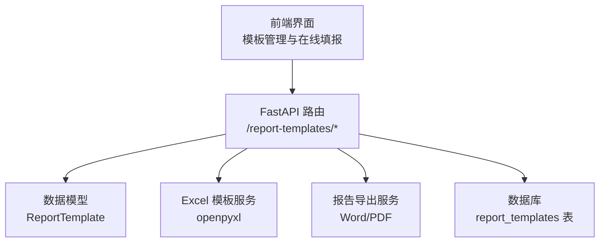
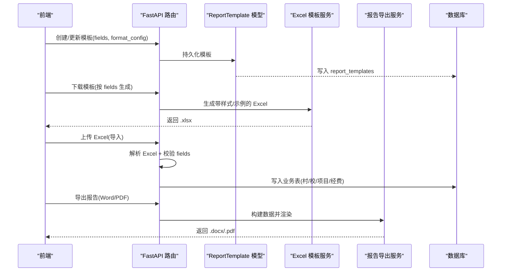
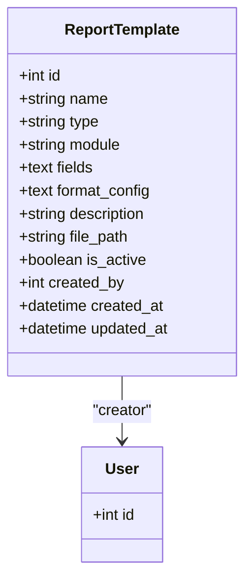
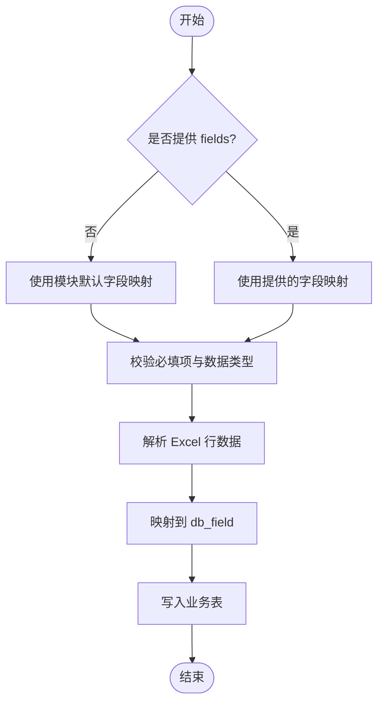
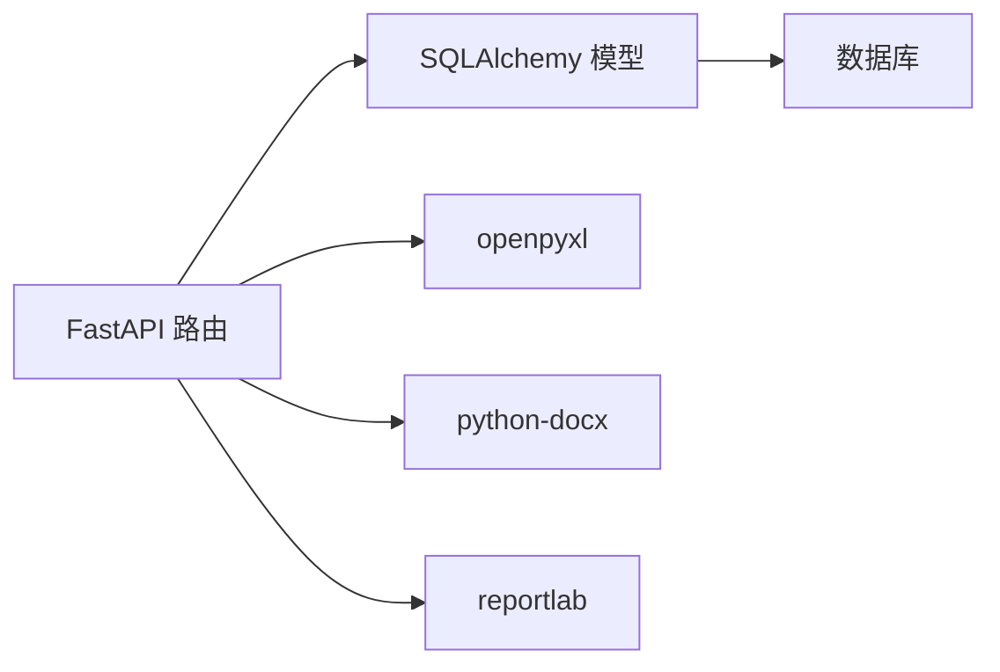

# 报表模板表结构

<cite>
**本文引用的文件**
- [report_template.py](file://backend/app/models/report_template.py)
- [report_templates.py](file://backend/app/api/v1/report_templates.py)
- [village_templates.py](file://backend/app/api/v1/village_templates.py)
- [excel_template_service.py](file://backend/app/services/excel_template_service.py)
- [report_export_service.py](file://backend/app/services/report_export_service.py)
- [Index.vue](file://frontend/src/views/reportTemplates/Index.vue)
- [test_report_templates_api.py](file://backend/tests/unit/test_report_templates_api.py)
</cite>

## 目录
1. [简介](#简介)
2. [项目结构](#项目结构)
3. [核心组件](#核心组件)
4. [架构总览](#架构总览)
5. [详细组件分析](#详细组件分析)
6. [依赖关系分析](#依赖关系分析)
7. [性能考虑](#性能考虑)
8. [故障排查指南](#故障排查指南)
9. [结论](#结论)
10. [附录](#附录)

## 简介
本文件围绕“报表模板”能力，系统化说明 report_templates 表的列映射配置机制、数据源绑定、字段映射、格式化规则、计算字段定义、报表布局与样式、导出格式支持（Excel、PDF、CSV）、模板版本管理、模板继承机制、动态模板生成、报表预览、批量生成、以及模板分享与协作的实现方案。内容基于后端模型、API、服务层与前端界面的实际实现进行梳理与归纳。

## 项目结构
报表模板相关代码主要分布在以下位置：
- 数据模型：后端 models 中定义 report_templates 表结构与枚举类型
- API 层：FastAPI 路由提供模板的增删改查、下载、可用字段查询等接口
- 服务层：Excel 模板生成、Word/PDF 报告导出、导入解析与校验
- 前端：模板创建、字段组合、在线填报、导入/导出交互

图表来源
- [report_templates.py:298-443](file://backend/app/api/v1/report_templates.py#L298-L443)
- [report_template.py:44-73](file://backend/app/models/report_template.py#L44-L73)
- [excel_template_service.py:256-269](file://backend/app/services/excel_template_service.py#L256-L269)
- [report_export_service.py:318-443](file://backend/app/services/report_export_service.py#L318-L443)

章节来源
- [report_template.py:44-73](file://backend/app/models/report_template.py#L44-L73)
- [report_templates.py:298-443](file://backend/app/api/v1/report_templates.py#L298-L443)
- [village_templates.py:109-177](file://backend/app/api/v1/village_templates.py#L109-L177)
- [excel_template_service.py:256-269](file://backend/app/services/excel_template_service.py#L256-L269)
- [report_export_service.py:318-443](file://backend/app/services/report_export_service.py#L318-L443)
- [Index.vue:106-560](file://frontend/src/views/reportTemplates/Index.vue#L106-L560)

## 核心组件
- 数据模型 ReportTemplate：定义 report_templates 表结构，包含模板名称、类型、关联模块、字段映射 JSON、格式配置 JSON、描述、文件路径、启用状态、创建人与审计时间戳。
- API 路由：提供模板列表、详情、创建、更新、删除、下载模板 Excel、获取可用字段等接口；内置默认字段映射与校验。
- Excel 模板服务：按模块生成带样式的 Excel 模板，支持示例行、冻结首行、填写说明页。
- 报告导出服务：统一数据结构渲染为 Word 或 PDF，支持标题、段落、表格与空数据提示。
- 前端模板管理：支持选择模块、组合字段、在线填报、导入/导出流程。

章节来源
- [report_template.py:44-73](file://backend/app/models/report_template.py#L44-L73)
- [report_templates.py:38-72](file://backend/app/api/v1/report_templates.py#L38-L72)
- [report_templates.py:112-293](file://backend/app/api/v1/report_templates.py#L112-L293)
- [village_templates.py:109-177](file://backend/app/api/v1/village_templates.py#L109-L177)
- [excel_template_service.py:256-269](file://backend/app/services/excel_template_service.py#L256-L269)
- [report_export_service.py:46-448](file://backend/app/services/report_export_service.py#L46-L448)
- [Index.vue:106-560](file://frontend/src/views/reportTemplates/Index.vue#L106-L560)

## 架构总览
报表模板从“配置—生成—使用—导出”的全链路如下：
- 配置：通过 API 创建模板，fields 存储 Excel 列与数据库字段的映射，format_config 存储纸张大小、页眉页脚、列宽等格式信息。
- 生成：根据 fields 动态生成 Excel 模板，支持必填标注、样式、示例数据与说明页。
- 使用：前端可在线填报或下载模板后导入；后端解析 Excel，依据 fields 映射写入业务表。
- 导出：统一数据构建后，导出为 Word 或 PDF，支持表格与段落排版。

图表来源
- [report_templates.py:335-378](file://backend/app/api/v1/report_templates.py#L335-L378)
- [report_templates.py:446-502](file://backend/app/api/v1/report_templates.py#L446-L502)
- [report_templates.py:508-546](file://backend/app/api/v1/report_templates.py#L508-L546)
- [report_export_service.py:318-443](file://backend/app/services/report_export_service.py#L318-L443)

## 详细组件分析

### 数据模型与列映射配置机制
- 表名：report_templates
- 关键字段：
  - name：模板名称
  - type：模板类型（import/export）
  - module：关联模块（village/school/fund/project/rural_work/comprehensive）
  - fields：JSON 字符串，定义 Excel 列与数据库字段的映射，如 excel_col、excel_header、db_field、required
  - format_config：JSON 字符串，存储纸张大小、页眉页脚、列宽等格式配置
  - description：模板描述
  - file_path：模板文件路径（可选）
  - is_active：是否启用
  - created_by、created_at、updated_at：审计字段
- 关系：creator 指向用户表，用于记录创建人

图表来源
- [report_template.py:44-73](file://backend/app/models/report_template.py#L44-L73)

章节来源
- [report_template.py:44-73](file://backend/app/models/report_template.py#L44-L73)

### 数据源绑定与字段映射
- 数据源绑定：通过 module 字段将模板与具体业务模块绑定（如 village、school、fund、project、rural_work）。
- 字段映射：fields 中的每个条目指定：
  - excel_col：Excel 列标识（如 A、B）
  - excel_header：显示列头（中文）
  - db_field：目标数据库字段名
  - required：是否必填
- 默认字段映射：当未提供 fields 时，后端会根据 module 自动填充默认映射（例如 village、school、fund、project、rural_work 的默认字段集）。
- 可用字段：提供 /available-fields 接口，返回模块可用的字段列表，供前端组合生成模板。

图表来源
- [report_templates.py:112-293](file://backend/app/api/v1/report_templates.py#L112-L293)
- [report_templates.py:508-546](file://backend/app/api/v1/report_templates.py#L508-L546)

章节来源
- [report_templates.py:112-293](file://backend/app/api/v1/report_templates.py#L112-L293)
- [report_templates.py:381-385](file://backend/app/api/v1/report_templates.py#L381-L385)
- [report_templates.py:508-546](file://backend/app/api/v1/report_templates.py#L508-L546)

### 格式化规则与报表布局
- 格式配置：format_config 以 JSON 存储纸张大小、页眉页脚、列宽等，便于不同模板差异化排版。
- 样式设置：
  - Excel：表头绿色背景、加粗白字、边框、列宽固定、必填标注红色小字。
  - Word/PDF：标题黑体居中、正文宋体、表格网格线、数字右对齐、无数据时输出提示段落。
- 布局：
  - Excel：合并标题行、冻结首行、示例数据行浅绿背景、说明页。
  - Word/PDF：标题、元信息（年度、生成时间）、分段标题、段落文本、表格。

章节来源
- [report_templates.py:446-502](file://backend/app/api/v1/report_templates.py#L446-L502)
- [village_templates.py:800-876](file://backend/app/api/v1/village_templates.py#L800-L876)
- [report_export_service.py:318-443](file://backend/app/services/report_export_service.py#L318-L443)

### 计算字段定义
- 当前 report_templates 的 fields 未直接定义“计算字段”表达式。
- 可在导入阶段通过转换函数对原始值进行计算（如布尔转换、日期解析、数值安全转换），再写入业务表。
- 若需更复杂的计算字段，建议在 fields 中扩展“formula”或“transform”字段，并在解析阶段执行计算逻辑。

章节来源
- [report_templates.py:552-615](file://backend/app/api/v1/report_templates.py#L552-L615)

### 导出格式支持（Excel、PDF、CSV）
- Excel：支持下载模板与导入数据；模板含样式、示例、说明页。
- PDF：通过报告导出服务生成，支持标题、段落、表格与空数据提示。
- CSV：当前未发现直接的 CSV 导出实现；如需支持，可在导出服务中新增 CSV 渲染方法。

章节来源
- [report_templates.py:446-502](file://backend/app/api/v1/report_templates.py#L446-L502)
- [report_export_service.py:370-443](file://backend/app/services/report_export_service.py#L370-L443)

### 模板版本管理与模板继承机制
- 版本管理：当前 report_templates 表未包含显式 version 字段；可通过外部版本表或变更日志表实现版本控制（例如记录每次修改的字段差异与操作人）。
- 模板继承：当前未实现模板继承；可在 fields 中引入“base_template_id”，在加载时合并基础模板字段与覆盖字段，形成最终映射。

章节来源
- [report_template.py:44-73](file://backend/app/models/report_template.py#L44-L73)

### 动态模板生成
- 动态生成：根据 module 与 fields 动态生成 Excel 模板，支持必填标注、样式、示例数据与说明页。
- 在线生成：前端可选择模块与字段组合，调用后端接口生成模板并下载。

章节来源
- [report_templates.py:446-502](file://backend/app/api/v1/report_templates.py#L446-L502)
- [village_templates.py:109-177](file://backend/app/api/v1/village_templates.py#L109-L177)
- [excel_template_service.py:256-269](file://backend/app/services/excel_template_service.py#L256-L269)

### 报表预览功能
- 预览方式：前端打开在线填报对话框，根据模板字段动态生成表单；若无字段配置，则加载模块默认字段。
- 预览内容：字段键值对、标签、必填提示；支持提交与导出。

章节来源
- [Index.vue:543-560](file://frontend/src/views/reportTemplates/Index.vue#L543-L560)

### 批量生成机制
- 批量导入：后端解析 Excel，逐行校验并写入业务表；支持增量模式（跳过重复）与覆盖模式（仅删除当前数据范围内的旧记录）。
- 批量导出：报告导出服务聚合多模块数据，生成统一结构的报告文档。

章节来源
- [report_templates.py:617-740](file://backend/app/api/v1/report_templates.py#L617-L740)
- [report_export_service.py:55-300](file://backend/app/services/report_export_service.py#L55-L300)

### 模板分享与协作
- 分享：模板由创建人拥有，可通过权限控制共享给其他用户；当前未见专门的“分享”接口，可通过组织/角色权限实现。
- 协作：工作流实例表可用于协作场景（如审批、流转），但报表模板本身未内置协作字段；可在模板上增加“协作者”或“共享范围”字段。

章节来源
- [report_template.py:66-73](file://backend/app/models/report_template.py#L66-L73)

## 依赖关系分析
- API 依赖：
  - FastAPI：路由、请求/响应处理
  - openpyxl：Excel 读写与样式
  - python-docx：Word 导出
  - reportlab：PDF 导出
  - SQLAlchemy：ORM 与数据库访问
- 模型依赖：
  - Base：基础模型类
  - User：创建人关系
- 服务依赖：
  - ExcelTemplateService：模板生成
  - ReportExportService：报告导出

图表来源
- [report_templates.py:1-33](file://backend/app/api/v1/report_templates.py#L1-L33)
- [report_export_service.py:318-443](file://backend/app/services/report_export_service.py#L318-L443)

章节来源
- [report_templates.py:1-33](file://backend/app/api/v1/report_templates.py#L1-L33)
- [report_export_service.py:318-443](file://backend/app/services/report_export_service.py#L318-L443)

## 性能考虑
- Excel 解析：使用只读模式加载工作簿，减少内存占用。
- 批量导入：采用增量与覆盖两种模式，避免全表扫描；覆盖模式下仅删除当前数据范围内的记录，降低风险。
- 导出渲染：统一数据结构迭代渲染，避免重复查询；空数据时输出提示段落，提升用户体验。
- 索引优化：建议对 report_templates 的 module、is_active、created_at 建立索引以提升查询性能。

章节来源
- [report_templates.py:508-546](file://backend/app/api/v1/report_templates.py#L508-L546)
- [report_templates.py:617-740](file://backend/app/api/v1/report_templates.py#L617-L740)
- [report_export_service.py:304-317](file://backend/app/services/report_export_service.py#L304-L317)

## 故障排查指南
- 模板不存在：GET/PUT/DELETE 模板时若 ID 无效，返回 404。
- 非法类型/模块：创建模板时 type 或 module 不在允许集合内，返回 400。
- 导入错误：解析 Excel 时必填项缺失或数据类型不合法，返回行级错误信息。
- 导出失败：报告导出服务捕获异常并记录警告，确保输出非空文档。

章节来源
- [report_templates.py:388-443](file://backend/app/api/v1/report_templates.py#L388-L443)
- [report_templates.py:335-378](file://backend/app/api/v1/report_templates.py#L335-L378)
- [report_templates.py:508-546](file://backend/app/api/v1/report_templates.py#L508-L546)
- [report_export_service.py:140-146](file://backend/app/services/report_export_service.py#L140-L146)

## 结论
report_templates 表通过 fields 与 format_config 实现了灵活的字段映射与格式配置，结合 API 与服务层提供了完整的模板生命周期管理能力。系统已支持 Excel 模板下载与导入、Word/PDF 报告导出，具备批量导入与在线填报能力。未来可扩展版本管理、模板继承、CSV 导出与协作分享功能，以满足更复杂的使用场景。

## 附录
- 测试用例参考：创建模板时携带 fields 与 format_config、非法类型/模块校验等。
- 前端交互：模板创建对话框、字段组合、在线填报、导入结果展示。

章节来源
- [test_report_templates_api.py:135-159](file://backend/tests/unit/test_report_templates_api.py#L135-L159)
- [Index.vue:106-560](file://frontend/src/views/reportTemplates/Index.vue#L106-L560)