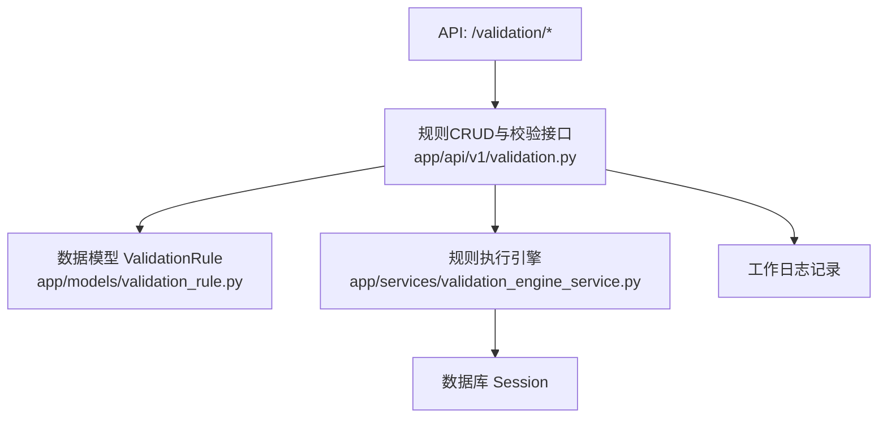
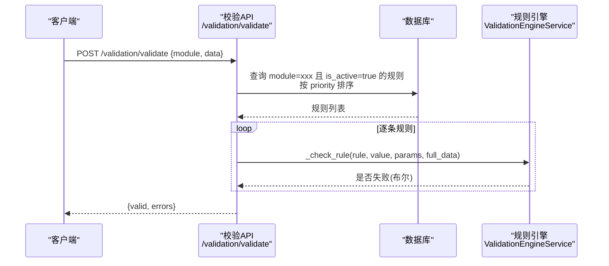
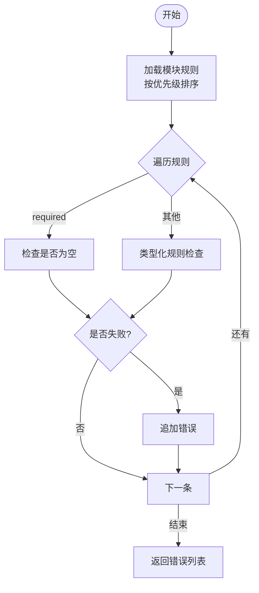
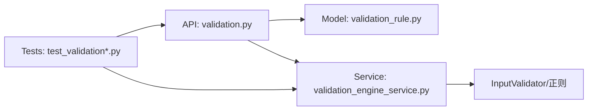
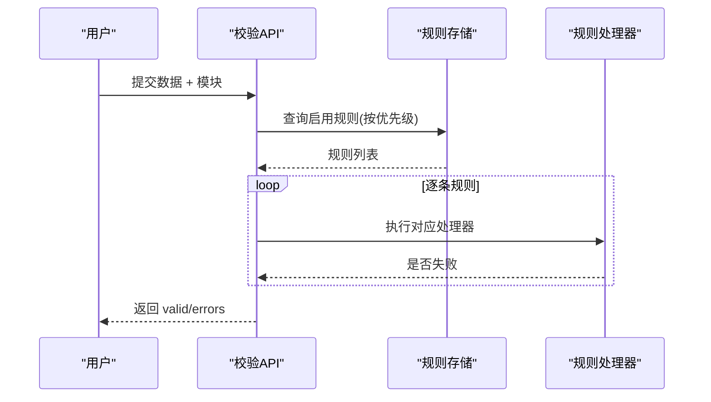

# 校验规则表结构

<cite>
**本文引用的文件**
- [backend/app/models/validation_rule.py](file://backend/app/models/validation_rule.py)
- [backend/app/services/validation_engine_service.py](file://backend/app/services/validation_engine_service.py)
- [backend/app/api/v1/validation.py](file://backend/app/api/v1/validation.py)
- [backend/tests/unit/test_validation.py](file://backend/tests/unit/test_validation.py)
- [backend/tests/unit/test_cov_final_validation_engine_service.py](file://backend/tests/unit/test_cov_final_validation_engine_service.py)
</cite>

## 目录
1. [简介](#简介)
2. [项目结构](#项目结构)
3. [核心组件](#核心组件)
4. [架构总览](#架构总览)
5. [详细组件分析](#详细组件分析)
6. [依赖关系分析](#依赖关系分析)
7. [性能与缓存](#性能与缓存)
8. [故障排查指南](#故障排查指南)
9. [结论](#结论)
10. [附录](#附录)

## 简介
本文件围绕“校验规则表结构”展开，系统化说明 validation_rules 表的字段设计、11种规则类型的实现方式、规则配置的 JSON 结构、规则执行引擎的工作流程、规则组合与优先级管理、动态规则加载机制、以及测试覆盖情况。同时给出可落地的优化建议（缓存策略、版本管理与冲突检测），帮助读者在现有代码基础上扩展与维护校验能力。

## 项目结构
与校验规则相关的核心代码分布在以下位置：
- 数据模型定义：backend/app/models/validation_rule.py
- 规则执行服务：backend/app/services/validation_engine_service.py
- 规则 API 与校验入口：backend/app/api/v1/validation.py
- 单元测试：backend/tests/unit/test_validation.py、backend/tests/unit/test_cov_final_validation_engine_service.py

图表来源
- [backend/app/api/v1/validation.py:65-231](file://backend/app/api/v1/validation.py#L65-L231)
- [backend/app/models/validation_rule.py:31-54](file://backend/app/models/validation_rule.py#L31-L54)
- [backend/app/services/validation_engine_service.py:93-123](file://backend/app/services/validation_engine_service.py#L93-L123)

章节来源
- [backend/app/models/validation_rule.py:1-54](file://backend/app/models/validation_rule.py#L1-L54)
- [backend/app/services/validation_engine_service.py:1-217](file://backend/app/services/validation_engine_service.py#L1-L217)
- [backend/app/api/v1/validation.py:1-508](file://backend/app/api/v1/validation.py#L1-L508)

## 核心组件
- 规则模型 ValidationRule：定义 validation_rules 表结构与规则类型枚举 RuleType。
- 规则执行引擎 ValidationEngineService：提供内存规则验证与从数据库加载并执行规则的两种模式。
- 规则 API：提供规则的增删改查、按模块校验数据、查询式条件校验等能力。

章节来源
- [backend/app/models/validation_rule.py:15-54](file://backend/app/models/validation_rule.py#L15-L54)
- [backend/app/services/validation_engine_service.py:26-177](file://backend/app/services/validation_engine_service.py#L26-L177)
- [backend/app/api/v1/validation.py:26-60](file://backend/app/api/v1/validation.py#L26-L60)

## 架构总览
系统通过 API 暴露规则管理能力与数据校验能力；校验时根据模块名从数据库读取启用的规则，按优先级顺序逐一执行，收集错误信息并返回结构化结果。

图表来源
- [backend/app/api/v1/validation.py:195-231](file://backend/app/api/v1/validation.py#L195-L231)
- [backend/app/api/v1/validation.py:234-341](file://backend/app/api/v1/validation.py#L234-L341)
- [backend/app/services/validation_engine_service.py:93-123](file://backend/app/services/validation_engine_service.py#L93-L123)

## 详细组件分析

### 1) 数据模型与表结构
- 表名：validation_rules
- 关键字段
  - id：自增主键
  - module：所属模块（如 village/school/fund/project/rural_task）
  - field：字段名
  - rule_type：规则类型（枚举）
  - params：JSON 字符串，存放规则参数
  - error_message：错误提示文案
  - description：规则描述
  - is_active：是否启用
  - priority：优先级（数字越小优先级越高）
  - created_at/updated_at：审计时间
  - created_by：创建者ID

- 规则类型枚举（共11种）
  - required：必填
  - positive：正数
  - non_negative：非负数
  - date_format：日期格式
  - file_type：文件类型限制
  - max_length：最大长度
  - min_length：最小长度
  - range：数值范围
  - regex：正则表达式
  - cross_field：跨字段逻辑
  - enum_values：枚举值限制

章节来源
- [backend/app/models/validation_rule.py:15-54](file://backend/app/models/validation_rule.py#L15-L54)

### 2) 规则配置 JSON 结构
不同 rule_type 对应不同的 params 结构（以下为约定用法，具体以各处理器为准）：
- required：无需 params
- positive/non_negative：无需 params
- date_format：{"format": "YYYY-MM-DD"} 等
- file_type：{"allowed": ["jpg","png"]}
- max_length/min_length：{"max": N} 或 {"min": N}
- range：{"min": X, "max": Y}
- regex：{"pattern": "^...$"}
- cross_field：{"other_field": "字段名", "operator": "<=|>=|<|>|=="}
- enum_values：{"values": ["a","b"]}

章节来源
- [backend/app/api/v1/validation.py:244-341](file://backend/app/api/v1/validation.py#L244-L341)
- [backend/app/services/validation_engine_service.py:125-157](file://backend/app/services/validation_engine_service.py#L125-L157)

### 3) 规则执行引擎工作流程
- 内存规则验证：ValidationEngineService.validate(data, rules)
  - 支持 required、range、regex、enum、length 等规则
  - 返回错误消息列表
- 数据库规则验证：ValidationEngineService.validate_with_db_rules(data, module)
  - 从数据库加载指定模块的启用规则，按优先级降序执行
  - 对每条规则调用内部 _check_typed_rule 进行判断
  - 异常时降级为空规则集，避免阻塞业务

图表来源
- [backend/app/services/validation_engine_service.py:93-123](file://backend/app/services/validation_engine_service.py#L93-L123)
- [backend/app/services/validation_engine_service.py:125-157](file://backend/app/services/validation_engine_service.py#L125-L157)

章节来源
- [backend/app/services/validation_engine_service.py:38-123](file://backend/app/services/validation_engine_service.py#L38-L123)

### 4) 规则组合与优先级管理
- 组合方式：同一模块下可对多个字段分别定义多条规则；校验时按字段维度依次应用各自规则。
- 优先级：规则按 priority 升序执行（API 侧查询使用 order_by(priority)），数字越小越先执行；引擎侧加载时使用 desc 排序，但实际校验顺序由 API 侧决定。
- 错误聚合：所有失败的规则都会收集到 errors 列表中，便于前端统一展示。

章节来源
- [backend/app/api/v1/validation.py:206-231](file://backend/app/api/v1/validation.py#L206-L231)
- [backend/app/services/validation_engine_service.py:98-104](file://backend/app/services/validation_engine_service.py#L98-L104)

### 5) 动态规则加载机制
- 运行时加载：每次调用 /validation/validate 都会从数据库查询当前模块的启用规则，保证规则变更即时生效。
- 安全降级：当未传入 db 或查询异常时，引擎会退化为空规则集，确保服务可用性。

章节来源
- [backend/app/services/validation_engine_service.py:93-123](file://backend/app/services/validation_engine_service.py#L93-L123)
- [backend/app/api/v1/validation.py:206-211](file://backend/app/api/v1/validation.py#L206-L211)

### 6) 规则测试框架与覆盖
- 单元测试覆盖点
  - 规则 CRUD：创建、更新、删除、过滤查询
  - 校验流程：必填、多规则、正则、范围、长度等
  - 引擎分支：_check_typed_rule 的多类型分支覆盖
- 典型断言示例路径
  - 必填失败、多规则失败、正则失败等用例位于测试文件中

章节来源
- [backend/tests/unit/test_validation.py:14-200](file://backend/tests/unit/test_validation.py#L14-L200)
- [backend/tests/unit/test_cov_final_validation_engine_service.py:31-170](file://backend/tests/unit/test_cov_final_validation_engine_service.py#L31-L170)

## 依赖关系分析
- API 层依赖模型与数据库会话，负责规则 CRUD 与校验入口。
- 引擎层依赖输入校验工具类与正则库，封装通用校验逻辑。
- 测试层通过 Mock 数据库会话与构造规则对象，验证行为正确性。

图表来源
- [backend/app/api/v1/validation.py:1-20](file://backend/app/api/v1/validation.py#L1-L20)
- [backend/app/models/validation_rule.py:1-13](file://backend/app/models/validation_rule.py#L1-L13)
- [backend/app/services/validation_engine_service.py:1-15](file://backend/app/services/validation_engine_service.py#L1-L15)
- [backend/tests/unit/test_validation.py:1-10](file://backend/tests/unit/test_validation.py#L1-L10)

章节来源
- [backend/app/api/v1/validation.py:1-20](file://backend/app/api/v1/validation.py#L1-L20)
- [backend/app/services/validation_engine_service.py:1-15](file://backend/app/services/validation_engine_service.py#L1-L15)
- [backend/tests/unit/test_validation.py:1-10](file://backend/tests/unit/test_validation.py#L1-L10)

## 性能与缓存
现状与建议
- 现状
  - 校验接口每次从数据库查询规则，无进程内缓存。
  - 规则数量较大时可能带来额外 IO 开销。
- 建议方案
  - 引入本地缓存：按 module 维度缓存规则列表，设置合理 TTL，并在规则增删改后失效对应模块缓存。
  - 异步预热：启动时或定时任务预加载常用模块规则至缓存。
  - 批量读取：合并同模块多次请求为一次查询，减少重复 IO。
  - 索引优化：确保 module、is_active、priority 有合适索引以提升查询效率。
  - 限流与熔断：在高并发场景对校验接口做限流，异常时快速降级。

[本节为通用性能建议，不直接引用具体代码行]

## 故障排查指南
常见问题与定位要点
- params 非法 JSON
  - 现象：创建/更新规则时报错
  - 定位：API 层对 params 进行 JSON 解析校验
  - 参考路径
    - [backend/app/api/v1/validation.py:89-94](file://backend/app/api/v1/validation.py#L89-L94)
    - [backend/app/api/v1/validation.py:128-132](file://backend/app/api/v1/validation.py#L128-L132)
- 规则未生效
  - 检查 is_active 是否为 True
  - 检查 module 与 field 是否匹配
  - 检查 priority 是否正确
  - 参考路径
    - [backend/app/api/v1/validation.py:206-211](file://backend/app/api/v1/validation.py#L206-L211)
- 引擎异常导致校验跳过
  - 现象：validate_with_db_rules 返回空错误
  - 原因：数据库访问异常时捕获并降级
  - 参考路径
    - [backend/app/services/validation_engine_service.py:121-123](file://backend/app/services/validation_engine_service.py#L121-L123)
- 跨字段校验失败
  - 检查 other_field 是否存在于提交数据中
  - 检查 operator 与数据类型转换
  - 参考路径
    - [backend/app/api/v1/validation.py:308-327](file://backend/app/api/v1/validation.py#L308-L327)

章节来源
- [backend/app/api/v1/validation.py:89-94](file://backend/app/api/v1/validation.py#L89-L94)
- [backend/app/api/v1/validation.py:128-132](file://backend/app/api/v1/validation.py#L128-L132)
- [backend/app/api/v1/validation.py:206-211](file://backend/app/api/v1/validation.py#L206-L211)
- [backend/app/services/validation_engine_service.py:121-123](file://backend/app/services/validation_engine_service.py#L121-L123)
- [backend/app/api/v1/validation.py:308-327](file://backend/app/api/v1/validation.py#L308-L327)

## 结论
该校验规则体系通过统一的模型与引擎实现了可扩展、可配置的字段级校验能力，支持 11 种规则类型，具备动态加载与优先级控制。结合完善的单元测试，已覆盖主要分支。建议在后续迭代中引入缓存与更完善的版本管理、冲突检测机制，以进一步提升性能与可维护性。

## 附录

### A. 规则类型与参数对照表
- required：无参
- positive/non_negative：无参
- date_format：{"format": "..."}
- file_type：{"allowed": [...]}
- max_length/min_length：{"max": N} 或 {"min": N}
- range：{"min": X, "max": Y}
- regex：{"pattern": "..."}
- cross_field：{"other_field": "...", "operator": "<=|>=|<|>|=="}
- enum_values：{"values": [...]}

章节来源
- [backend/app/api/v1/validation.py:244-341](file://backend/app/api/v1/validation.py#L244-L341)
- [backend/app/services/validation_engine_service.py:125-157](file://backend/app/services/validation_engine_service.py#L125-L157)

### B. 规则执行序列图（API 侧）

图表来源
- [backend/app/api/v1/validation.py:195-231](file://backend/app/api/v1/validation.py#L195-L231)
- [backend/app/api/v1/validation.py:234-341](file://backend/app/api/v1/validation.py#L234-L341)

### C. 建议：版本管理与冲突检测（设计建议）
- 版本管理
  - 在规则表中增加 version 字段或使用独立版本表，记录规则快照与生效时间。
  - 发布流程：灰度发布、回滚策略、审计日志。
- 冲突检测
  - 同模块同字段的互斥规则检测（例如同时存在 required 与特定枚举限制时的语义冲突）。
  - 优先级冲突告警：相邻规则相互覆盖或矛盾时提示。
- 缓存一致性
  - 规则变更后主动失效对应模块缓存，采用事件驱动或版本号作为缓存键。

[本节为概念性设计建议，不直接映射到具体代码文件]