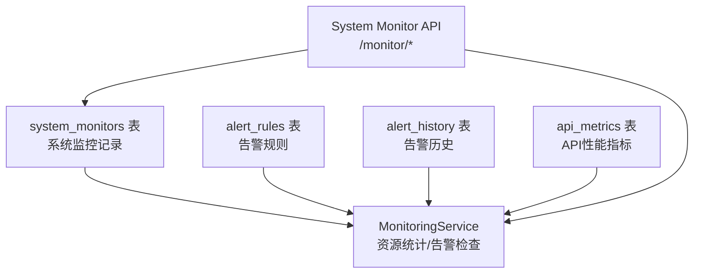
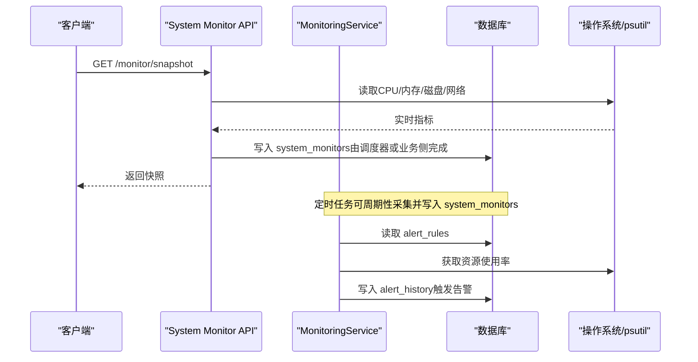
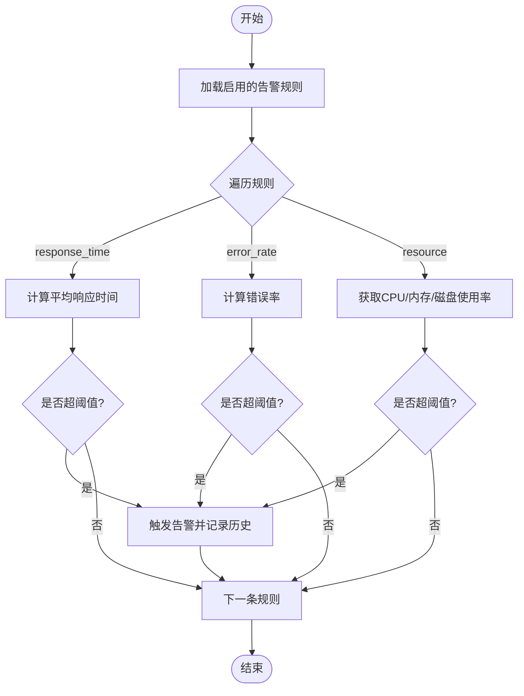
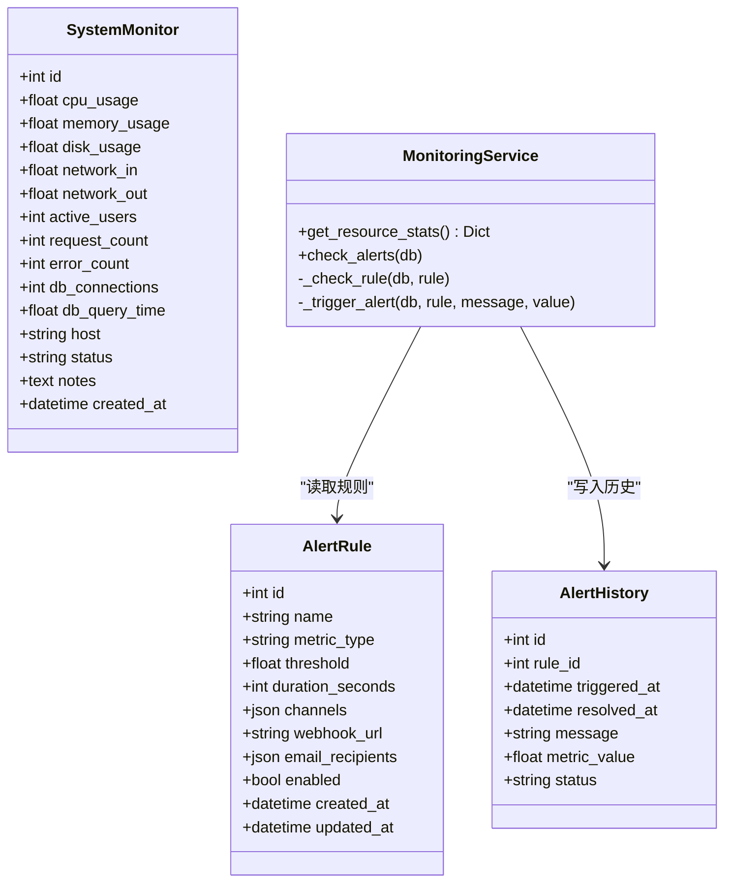

# 系统监控表结构

<cite>
**本文引用的文件**
- [backend/app/models/system_monitor.py](file://backend/app/models/system_monitor.py)
- [backend/app/models/monitoring.py](file://backend/app/models/monitoring.py)
- [backend/app/services/monitoring_service.py](file://backend/app/services/monitoring_service.py)
- [backend/app/api/v1/system/monitor.py](file://backend/app/api/v1/system/monitor.py)
</cite>

## 目录
1. [简介](#简介)
2. [项目结构](#项目结构)
3. [核心组件](#核心组件)
4. [架构总览](#架构总览)
5. [详细组件分析](#详细组件分析)
6. [依赖关系分析](#依赖关系分析)
7. [性能与存储策略](#性能与存储策略)
8. [故障排查指南](#故障排查指南)
9. [结论](#结论)
10. [附录：字段与查询建议](#附录字段与查询建议)

## 简介
本文件围绕 system_monitors 表，系统化说明其数据模型、指标采集机制（CPU/内存/磁盘/网络/应用/数据库）、主机信息与状态管理、告警阈值配置与触发流程，以及存储策略、查询优化与实践建议。该表用于持久化系统级与应用级关键指标，支撑运维看板、容量规划与告警联动。

## 项目结构
与 system_monitors 表直接相关的代码主要分布在以下位置：
- 数据模型定义：backend/app/models/system_monitor.py
- 监控服务与告警逻辑：backend/app/services/monitoring_service.py
- 系统监控API（快照、资源详情、告警规则等）：backend/app/api/v1/system/monitor.py
- 告警规则与历史模型（支撑阈值与通知）：backend/app/models/monitoring.py

图表来源
- [backend/app/models/system_monitor.py:11-46](file://backend/app/models/system_monitor.py#L11-L46)
- [backend/app/models/monitoring.py:22-84](file://backend/app/models/monitoring.py#L22-L84)
- [backend/app/services/monitoring_service.py:157-270](file://backend/app/services/monitoring_service.py#L157-L270)
- [backend/app/api/v1/system/monitor.py:54-108](file://backend/app/api/v1/system/monitor.py#L54-L108)

章节来源
- [backend/app/models/system_monitor.py:11-46](file://backend/app/models/system_monitor.py#L11-L46)
- [backend/app/models/monitoring.py:22-84](file://backend/app/models/monitoring.py#L22-L84)
- [backend/app/services/monitoring_service.py:157-270](file://backend/app/services/monitoring_service.py#L157-L270)
- [backend/app/api/v1/system/monitor.py:54-108](file://backend/app/api/v1/system/monitor.py#L54-L108)

## 核心组件
- SystemMonitor 模型：定义 system_monitors 表的字段、索引与注释，涵盖系统指标、网络指标、应用指标、数据库指标及元数据。
- MonitoringService：提供系统资源统计、告警规则检查与触发、通知发送等能力。
- 监控API：提供系统快照、资源详情、告警规则与历史、API调用统计等接口。
- 告警相关模型：alert_rules 与 alert_history 支撑阈值配置与告警生命周期管理。

章节来源
- [backend/app/models/system_monitor.py:11-46](file://backend/app/models/system_monitor.py#L11-L46)
- [backend/app/services/monitoring_service.py:157-270](file://backend/app/services/monitoring_service.py#L157-L270)
- [backend/app/api/v1/system/monitor.py:54-108](file://backend/app/api/v1/system/monitor.py#L54-L108)
- [backend/app/models/monitoring.py:37-84](file://backend/app/models/monitoring.py#L37-L84)

## 架构总览
下图展示了从指标采集到存储、查询与告警触发的整体流程。

图表来源
- [backend/app/api/v1/system/monitor.py:54-108](file://backend/app/api/v1/system/monitor.py#L54-L108)
- [backend/app/services/monitoring_service.py:157-270](file://backend/app/services/monitoring_service.py#L157-L270)
- [backend/app/models/system_monitor.py:11-46](file://backend/app/models/system_monitor.py#L11-L46)
- [backend/app/models/monitoring.py:37-84](file://backend/app/models/monitoring.py#L37-L84)

## 详细组件分析

### 数据模型：system_monitors 表
- 表名：system_monitors
- 主键：id
- 系统指标
  - cpu_usage：CPU使用率（浮点）
  - memory_usage：内存使用率（浮点）
  - disk_usage：磁盘使用率（浮点）
- 网络指标
  - network_in：网络入流量（浮点）
  - network_out：网络出流量（浮点）
- 应用指标
  - active_users：活跃用户数（整型）
  - request_count：请求数（整型）
  - error_count：错误数（整型）
- 数据库指标
  - db_connections：数据库连接数（整型）
  - db_query_time：数据库查询平均时间（浮点）
- 元数据
  - host：主机名（字符串）
  - status：状态（字符串）
  - notes：备注（文本）
  - created_at：记录时间（带时区）
- 索引
  - ix_system_monitors_created_at：按创建时间加速时序查询
  - ix_system_monitors_host：按主机过滤聚合
  - ix_system_monitors_status：按状态筛选

章节来源
- [backend/app/models/system_monitor.py:11-46](file://backend/app/models/system_monitor.py#L11-L46)

### 指标采集与写入机制
- 系统资源采集
  - CPU/内存/磁盘/进程信息通过 psutil 获取，API 层提供 snapshot/resources 接口用于即时查看。
  - 资源统计方法在 MonitoringService.get_resource_stats 中封装，便于复用。
- 网络指标
  - 快照接口通过 psutil.net_io_counters 获取累计收发字节，可用于计算瞬时速率；network_in/network_out 字段适合保存增量或速率值。
- 应用指标
  - active_users/request_count/error_count 可由业务侧在请求处理链路中更新（例如中间件计数），或通过外部系统对接后批量写入。
- 数据库指标
  - db_connections/db_query_time 可通过数据库连接池监控或慢查询日志聚合得到，再写入 system_monitors。
- 写入时机
  - 建议通过后台定时任务（如线程定时器或调度框架）周期性采集并批量写入 system_monitors，避免阻塞请求路径。

章节来源
- [backend/app/api/v1/system/monitor.py:54-108](file://backend/app/api/v1/system/monitor.py#L54-L108)
- [backend/app/services/monitoring_service.py:157-181](file://backend/app/services/monitoring_service.py#L157-L181)

### 主机信息、状态管理与备注
- host：标识采集来源主机，结合索引可按主机维度进行趋势分析与对比。
- status：用于表达当前主机或系统的健康状态（如 healthy/degraded/unhealthy），便于快速定位异常。
- notes：自由文本，支持记录临时变更、维护窗口、已知问题等上下文信息。

章节来源
- [backend/app/models/system_monitor.py:42-46](file://backend/app/models/system_monitor.py#L42-L46)

### 告警阈值配置与触发
- 规则模型：alert_rules 支持按 metric_type（response_time/error_rate/resource）配置阈值、持续时间、通知渠道等。
- 检查逻辑：MonitoringService.check_alerts/_check_rule 会基于最近 duration_seconds 的指标计算均值或比率，超过阈值则触发告警。
- 防抖与去重：_trigger_alert 会检查是否存在未解决的告警，避免重复触发。
- 通知方式：支持邮件与 Webhook 异步通知，失败时记录日志。

图表来源
- [backend/app/services/monitoring_service.py:184-270](file://backend/app/services/monitoring_service.py#L184-L270)
- [backend/app/models/monitoring.py:37-84](file://backend/app/models/monitoring.py#L37-L84)

章节来源
- [backend/app/services/monitoring_service.py:184-270](file://backend/app/services/monitoring_service.py#L184-L270)
- [backend/app/models/monitoring.py:37-84](file://backend/app/models/monitoring.py#L37-L84)

### 监控API与查询
- /monitor/snapshot：返回当前时刻的系统快照（CPU/内存/磁盘/网络/进程等）。
- /monitor/resources：返回更详细的资源使用报告与健康评估。
- /monitor/alerts：返回告警规则列表（优先数据库规则，否则返回默认规则）。
- /monitor/alerts/history：分页查询告警历史，支持按状态筛选。
- /monitor/api-stats：返回API调用统计（优先内存指标存储，无写入方时回退为空统计）。

章节来源
- [backend/app/api/v1/system/monitor.py:54-108](file://backend/app/api/v1/system/monitor.py#L54-L108)
- [backend/app/api/v1/system/monitor.py:111-183](file://backend/app/api/v1/system/monitor.py#L111-L183)
- [backend/app/api/v1/system/monitor.py:186-239](file://backend/app/api/v1/system/monitor.py#L186-L239)
- [backend/app/api/v1/system/monitor.py:242-275](file://backend/app/api/v1/system/monitor.py#L242-L275)
- [backend/app/api/v1/system/monitor.py:278-324](file://backend/app/api/v1/system/monitor.py#L278-L324)

## 依赖关系分析
- 模型依赖
  - system_monitors 独立于其他业务表，仅依赖基础模型 Base。
  - 告警规则与历史表（alert_rules、alert_history）与 MonitoringService 紧密耦合。
- 服务依赖
  - MonitoringService 依赖 psutil 获取系统资源，依赖 SQLAlchemy Session 读写数据库。
- API 依赖
  - 监控API依赖安全鉴权、数据库会话与响应封装。

图表来源
- [backend/app/models/system_monitor.py:11-46](file://backend/app/models/system_monitor.py#L11-L46)
- [backend/app/models/monitoring.py:37-84](file://backend/app/models/monitoring.py#L37-L84)
- [backend/app/services/monitoring_service.py:157-270](file://backend/app/services/monitoring_service.py#L157-L270)

章节来源
- [backend/app/models/system_monitor.py:11-46](file://backend/app/models/system_monitor.py#L11-L46)
- [backend/app/models/monitoring.py:37-84](file://backend/app/models/monitoring.py#L37-L84)
- [backend/app/services/monitoring_service.py:157-270](file://backend/app/services/monitoring_service.py#L157-L270)

## 性能与存储策略
- 采集频率与批量化
  - 建议以固定间隔（如每10-30秒）采集一次，采用批量插入减少事务开销。
  - 对高吞吐场景，可在内存中缓冲多条记录后一次性提交。
- 索引与查询优化
  - 已为 created_at、host、status 建立索引，利于按时间范围、主机维度与状态筛选。
  - 常见查询模式：按主机+时间范围聚合（avg/max/min），建议在应用层使用分组聚合SQL。
- 数据保留与归档
  - 建议设置数据保留策略（如保留90天），定期归档或清理旧数据，避免单表过大影响查询性能。
- 网络指标计算
  - network_in/network_out 建议使用“增量差值”表示单位时间内的流量速率，避免累计值导致曲线失真。
- 告警性能
  - 告警检查应限制扫描窗口（duration_seconds），并使用聚合查询减少IO。
  - 避免频繁重复告警，利用已实现的未解决告警去重逻辑。

[本节为通用性能建议，不直接引用具体文件]

## 故障排查指南
- 指标缺失或不更新
  - 检查采集任务是否正常运行（后台定时任务/调度器）。
  - 确认数据库连接与权限正常，写入是否有异常日志。
- 告警不触发
  - 核对 alert_rules 中的 metric_type、threshold、duration_seconds 配置是否正确。
  - 检查 MonitoringService.check_alerts 是否被调用，以及 _check_rule 分支是否符合预期。
- 网络指标异常
  - 确认 network_in/network_out 是否为增量值；若为累计值，需在前端或报表层做差分计算。
- 资源监控受限
  - 若 psutil 未安装或权限不足，snapshot/resources 将降级返回有限数据，请检查运行环境与依赖。

章节来源
- [backend/app/api/v1/system/monitor.py:54-108](file://backend/app/api/v1/system/monitor.py#L54-L108)
- [backend/app/services/monitoring_service.py:184-270](file://backend/app/services/monitoring_service.py#L184-L270)

## 结论
system_monitors 表提供了统一的系统与应用指标存储载体，配合 MonitoringService 的告警能力与监控API的可视化能力，形成“采集—存储—查询—告警”的闭环。通过合理的采集频率、索引设计、数据保留策略与告警阈值配置，可实现稳定高效的系统监控体系。

[本节为总结性内容，不直接引用具体文件]

## 附录：字段与查询建议
- 常用查询示例（概念性）
  - 近N小时某主机的CPU均值：SELECT avg(cpu_usage) FROM system_monitors WHERE host=? AND created_at>=?
  - 各主机内存使用率TopN：SELECT host, avg(memory_usage) FROM system_monitors WHERE created_at>=? GROUP BY host ORDER BY avg DESC LIMIT N
  - 错误率趋势：SELECT hour(created_at), sum(error_count)/sum(request_count) FROM system_monitors WHERE created_at>=? GROUP BY hour
- 字段语义建议
  - network_in/network_out：建议保存单位时间内的增量（KB/MB/s），便于绘制速率曲线。
  - db_query_time：建议保存P50/P95/P99等多分位值，或在应用层分别记录不同分位指标。
  - status：统一枚举值（如 healthy/degraded/unhealthy），便于快速筛选。
  - notes：记录维护窗口、已知问题、临时规避措施等。

[本节为通用实践建议，不直接引用具体文件]