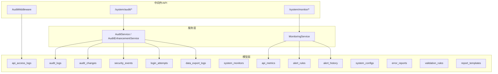
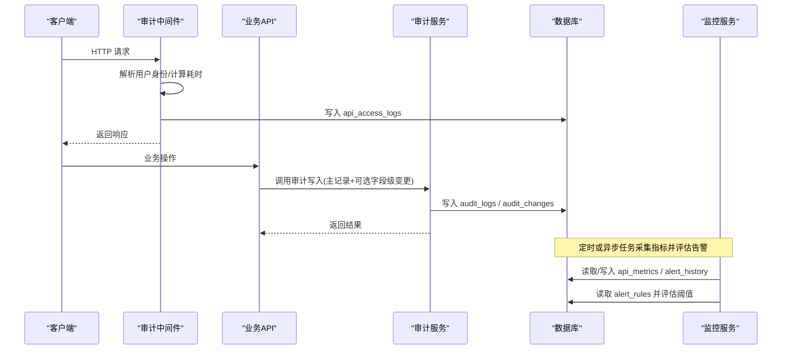
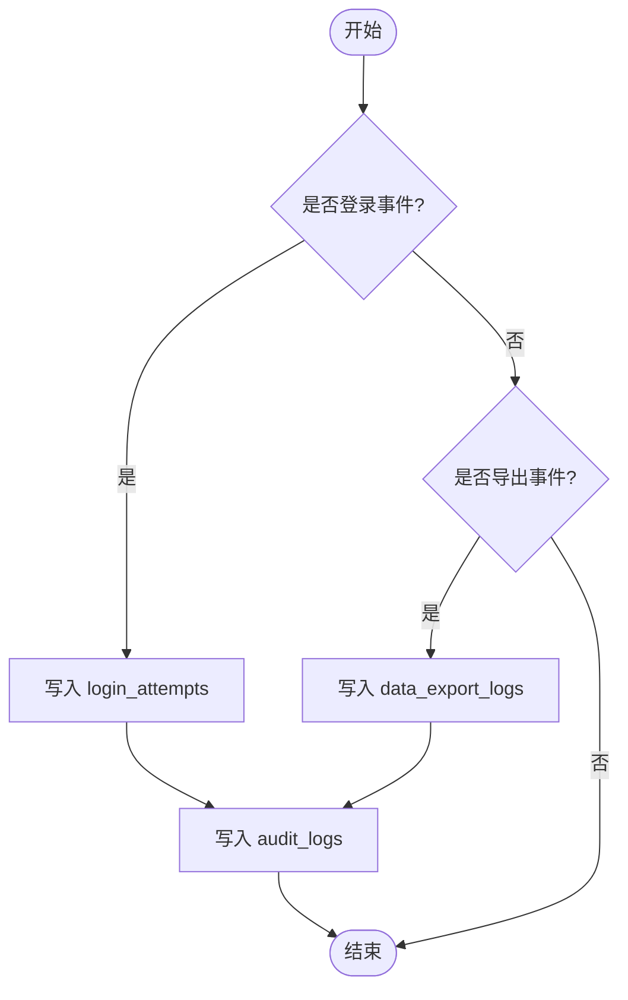
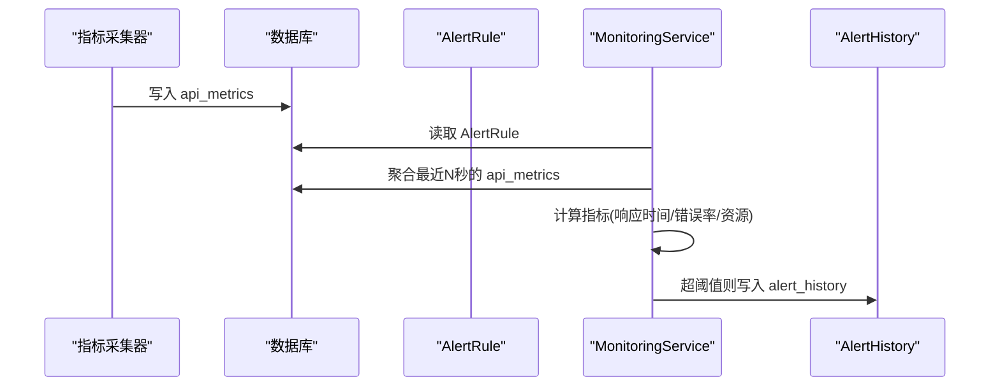
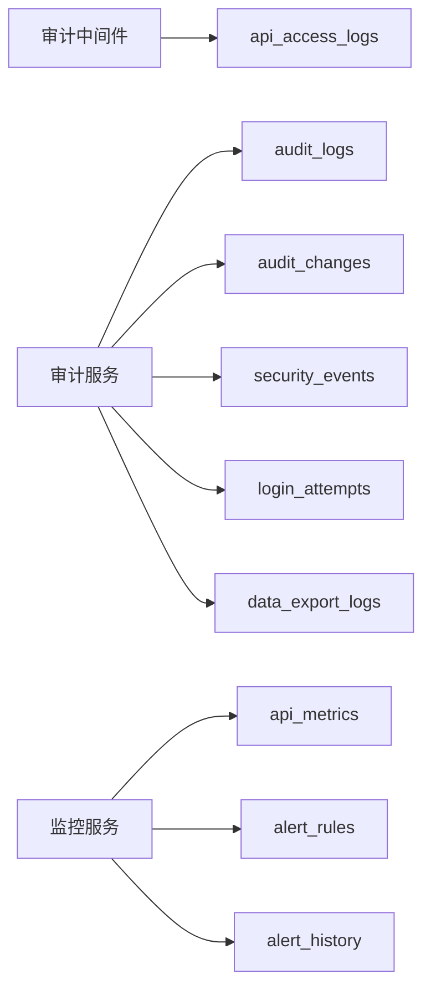

# 系统运维域表结构

<cite>
**本文引用的文件**
- [backend/app/models/audit.py](file://backend/app/models/audit.py)
- [backend/app/models/audit_change.py](file://backend/app/models/audit_change.py)
- [backend/app/models/system_monitor.py](file://backend/app/models/system_monitor.py)
- [backend/app/models/monitoring.py](file://backend/app/models/monitoring.py)
- [backend/app/models/system_config.py](file://backend/app/models/system_config.py)
- [backend/app/models/error_report.py](file://backend/app/models/error_report.py)
- [backend/app/models/validation_rule.py](file://backend/app/models/validation_rule.py)
- [backend/app/models/report_template.py](file://backend/app/models/report_template.py)
- [backend/app/core/audit_middleware.py](file://backend/app/core/audit_middleware.py)
- [backend/app/services/audit_service.py](file://backend/app/services/audit_service.py)
- [backend/app/services/audit_enhancement_service.py](file://backend/app/services/audit_enhancement_service.py)
- [backend/app/services/monitoring_service.py](file://backend/app/services/monitoring_service.py)
- [backend/app/api/v1/system/audit.py](file://backend/app/api/v1/system/audit.py)
- [backend/app/api/v1/system/monitor.py](file://backend/app/api/v1/system/monitor.py)
</cite>

## 目录
1. [简介](#简介)
2. [项目结构](#项目结构)
3. [核心组件](#核心组件)
4. [架构总览](#架构总览)
5. [详细组件分析](#详细组件分析)
6. [依赖关系分析](#依赖关系分析)
7. [性能考量](#性能考量)
8. [故障排查指南](#故障排查指南)
9. [结论](#结论)
10. [附录](#附录)

## 简介
本文件面向系统运维域，围绕20张与审计、监控、配置、错误报告、校验规则、报表模板相关的数据库表进行结构化说明。重点覆盖：
- 审计“七件套”（audit_logs、audit_changes、security_events、login_attempts、api_access_logs、data_export_logs）的军用合规实现要点与双写机制
- 监控系统表（system_monitors、api_metrics、alert_rules、alert_history）的性能指标收集与告警触发流程
- 系统配置表（system_configs）的键值对管理
- 错误报告表（error_reports）的前端错误持久化
- 字段校验规则引擎（validation_rules）的11种规则类型
- 报表模板表（report_templates）的列映射配置
- 双写审计机制、告警规则配置、系统健康检查的实现方案

## 项目结构
系统运维相关能力由“模型层 + 服务层 + 中间件/API层”协同完成：
- 模型层：定义各运维表的字段、索引与约束
- 服务层：封装审计写入、安全事件、导出日志、监控指标采集与告警评估等核心逻辑
- 中间件/API层：在请求链路中自动记录API访问日志，并提供查询审计、安全事件、告警历史等接口

图表来源
- [backend/app/models/audit.py:53-205](file://backend/app/models/audit.py#L53-L205)
- [backend/app/models/audit_change.py:13-33](file://backend/app/models/audit_change.py#L13-L33)
- [backend/app/models/system_monitor.py:11-50](file://backend/app/models/system_monitor.py#L11-L50)
- [backend/app/models/monitoring.py:22-84](file://backend/app/models/monitoring.py#L22-L84)
- [backend/app/core/audit_middleware.py:11-109](file://backend/app/core/audit_middleware.py#L11-L109)
- [backend/app/services/audit_service.py:58-510](file://backend/app/services/audit_service.py#L58-L510)
- [backend/app/services/monitoring_service.py:194-225](file://backend/app/services/monitoring_service.py#L194-L225)
- [backend/app/api/v1/system/audit.py:389-432](file://backend/app/api/v1/system/audit.py#L389-L432)
- [backend/app/api/v1/system/monitor.py:239-275](file://backend/app/api/v1/system/monitor.py#L239-L275)

章节来源
- [backend/app/models/audit.py:53-205](file://backend/app/models/audit.py#L53-L205)
- [backend/app/models/monitoring.py:22-84](file://backend/app/models/monitoring.py#L22-L84)
- [backend/app/core/audit_middleware.py:11-109](file://backend/app/core/audit_middleware.py#L11-L109)
- [backend/app/services/audit_service.py:58-510](file://backend/app/services/audit_service.py#L58-L510)
- [backend/app/services/monitoring_service.py:194-225](file://backend/app/services/monitoring_service.py#L194-L225)
- [backend/app/api/v1/system/audit.py:389-432](file://backend/app/api/v1/system/audit.py#L389-L432)
- [backend/app/api/v1/system/monitor.py:239-275](file://backend/app/api/v1/system/monitor.py#L239-L275)

## 核心组件
- 审计七件套：以 audit_logs 为主记录，配合 audit_changes 做字段级变更；security_events 记录安全事件；login_attempts 记录登录尝试；api_access_logs 记录每次HTTP访问；data_export_logs 记录数据导出行为。
- 监控系统：system_monitors 记录主机与应用资源指标；api_metrics 记录API性能指标；alert_rules 配置阈值与通知渠道；alert_history 记录告警触发与恢复历史。
- 配置与错误：system_configs 提供键值对配置；error_reports 持久化前端上报的错误上下文。
- 校验与报表：validation_rules 支持11种字段级规则；report_templates 通过 fields 配置Excel列到数据库字段的映射。

章节来源
- [backend/app/models/audit.py:53-205](file://backend/app/models/audit.py#L53-L205)
- [backend/app/models/audit_change.py:13-33](file://backend/app/models/audit_change.py#L13-L33)
- [backend/app/models/system_monitor.py:11-50](file://backend/app/models/system_monitor.py#L11-L50)
- [backend/app/models/monitoring.py:22-84](file://backend/app/models/monitoring.py#L22-L84)
- [backend/app/models/system_config.py:11-51](file://backend/app/models/system_config.py#L11-L51)
- [backend/app/models/error_report.py:8-36](file://backend/app/models/error_report.py#L8-L36)
- [backend/app/models/validation_rule.py:15-55](file://backend/app/models/validation_rule.py#L15-L55)
- [backend/app/models/report_template.py:44-73](file://backend/app/models/report_template.py#L44-L73)

## 架构总览
下图展示从请求进入、审计双写到监控指标采集与告警触发的整体链路。

图表来源
- [backend/app/core/audit_middleware.py:18-109](file://backend/app/core/audit_middleware.py#L18-L109)
- [backend/app/services/audit_service.py:62-273](file://backend/app/services/audit_service.py#L62-L273)
- [backend/app/services/monitoring_service.py:194-225](file://backend/app/services/monitoring_service.py#L194-L225)
- [backend/app/models/audit.py:53-205](file://backend/app/models/audit.py#L53-L205)
- [backend/app/models/monitoring.py:22-84](file://backend/app/models/monitoring.py#L22-L84)

## 详细组件分析

### 审计“七件套”与双写机制
- 表职责
  - audit_logs：统一审计主记录，包含用户、动作、资源、状态、级别、请求路径、耗时、元数据等
  - audit_changes：字段级变更明细，关联到 audit_logs.id
  - security_events：安全事件（如暴力破解、多次失败登录），含严重等级、处理状态
  - login_attempts：登录尝试记录（成功/失败原因、时间）
  - api_access_logs：每次HTTP访问的端点、方法、状态码、耗时、IP、UA等
  - data_export_logs：数据导出行为（类型、格式、记录数、文件大小、状态）

- 双写机制
  - 登录事件：在审计服务中同时写入 login_attempts 与 audit_logs，确保可追溯性与可统计性
  - API访问：中间件独立会话写入 api_access_logs，不影响业务事务
  - 导出：先写 data_export_logs，再写 audit_logs 的 EXPORT 动作，形成“导出明细 + 审计主记录”的双写

图表来源
- [backend/app/services/audit_service.py:168-273](file://backend/app/services/audit_service.py#L168-L273)
- [backend/app/core/audit_middleware.py:80-109](file://backend/app/core/audit_middleware.py#L80-L109)

章节来源
- [backend/app/models/audit.py:53-205](file://backend/app/models/audit.py#L53-L205)
- [backend/app/models/audit_change.py:13-33](file://backend/app/models/audit_change.py#L13-L33)
- [backend/app/services/audit_service.py:168-273](file://backend/app/services/audit_service.py#L168-L273)
- [backend/app/core/audit_middleware.py:80-109](file://backend/app/core/audit_middleware.py#L80-L109)

### 监控系统表与指标收集
- 表职责
  - system_monitors：主机CPU/内存/磁盘、网络流量、应用活跃用户/请求/错误、数据库连接与查询耗时等
  - api_metrics：API端点、方法、响应耗时、状态码、时间戳、错误信息
  - alert_rules：按 metric_type（response_time/error_rate/resource）配置阈值、持续时间、通知渠道
  - alert_history：告警触发与恢复的历史记录

- 指标收集与告警评估
  - 监控服务根据规则的时间窗口聚合 api_metrics，计算平均响应时间、错误率或资源使用率
  - 超过阈值时触发告警，写入 alert_history，并通过配置的渠道通知

图表来源
- [backend/app/models/monitoring.py:22-84](file://backend/app/models/monitoring.py#L22-L84)
- [backend/app/services/monitoring_service.py:194-225](file://backend/app/services/monitoring_service.py#L194-L225)

章节来源
- [backend/app/models/system_monitor.py:11-50](file://backend/app/models/system_monitor.py#L11-L50)
- [backend/app/models/monitoring.py:22-84](file://backend/app/models/monitoring.py#L22-L84)
- [backend/app/services/monitoring_service.py:194-225](file://backend/app/services/monitoring_service.py#L194-L225)

### 系统配置表（system_configs）
- 设计要点
  - key 唯一且索引，便于快速检索
  - value 为文本型，支持复杂配置内容
  - description 用于说明配置项用途
  - created_at/updated_at 记录创建与更新时间

- 使用建议
  - 将敏感参数与开关类配置集中管理
  - 结合缓存或配置中心提升读取性能（按需扩展）

章节来源
- [backend/app/models/system_config.py:11-51](file://backend/app/models/system_config.py#L11-L51)

### 错误报告表（error_reports）
- 设计要点
  - source：错误来源模块
  - error_type：错误类型
  - message：错误消息
  - stack_trace：堆栈跟踪
  - context：上下文信息（JSON）
  - severity：严重程度（info/warning/error/critical）
  - status：处理状态（open/resolved/ignored/in_progress）
  - reporter：报告人
  - resolved_at：解决时间
  - resolution_note：处理备注

- 前端集成
  - 前端捕获异常后调用后端接口持久化，便于后续分析与闭环处理

章节来源
- [backend/app/models/error_report.py:8-36](file://backend/app/models/error_report.py#L8-L36)

### 字段校验规则引擎（validation_rules）
- 支持的11种规则类型
  - required：必填
  - positive：正数
  - non_negative：非负数
  - date_format：日期格式
  - file_type：文件类型限制
  - max_length：最大长度
  - min_length：最小长度
  - range：数值范围
  - regex：正则表达式
  - cross_field：跨字段逻辑（如帮扶经费≤项目总预算）
  - enum_values：枚举值限制

- 模型字段
  - module：所属模块
  - field：字段名
  - rule_type：规则类型（枚举）
  - params：规则参数（JSON）
  - error_message：错误提示
  - is_active/priority：启用与优先级
  - created_at/updated_at/created_by：审计字段

章节来源
- [backend/app/models/validation_rule.py:15-55](file://backend/app/models/validation_rule.py#L15-L55)

### 报表模板表（report_templates）
- 设计要点
  - name/type/module：模板名称、类型（导入/导出）、关联模块
  - fields：列映射配置（JSON），定义Excel列与数据库字段的对应关系
  - format_config：格式配置（纸张大小、页眉页脚、列宽等）
  - file_path：模板文件路径
  - is_active/created_by/审计字段：启用与创建者、时间

- 使用场景
  - 上级下发模板，下级下载填写后上传，后端按 fields 映射自动导入目标模块数据表

章节来源
- [backend/app/models/report_template.py:44-73](file://backend/app/models/report_template.py#L44-L73)

### 审计增强与字段级Diff
- 功能概述
  - 基于 AuditLog + AuditChange 实现字段级变更留痕
  - 支持 create/update/delete 三种变更类型
  - 自动序列化值（字符串、数字、布尔、时间、列表、字典等）

- 关键流程
  - 创建审计主记录并显式提交，避免依赖调用方事务
  - 对比新旧数据生成字段级变更记录
  - 支持仅记录关键字段（key_fields）

章节来源
- [backend/app/services/audit_enhancement_service.py:20-215](file://backend/app/services/audit_enhancement_service.py#L20-L215)
- [backend/app/models/audit_change.py:13-33](file://backend/app/models/audit_change.py#L13-L33)

### 安全事件与登录尝试
- 安全事件
  - 支持按严重等级分类（low/medium/high）
  - 支持标记已解决及处理备注
  - 提供统计与分页查询接口

- 登录尝试
  - 记录用户名、IP、UA、成功与否、失败原因、时间
  - 与审计主记录联动，便于追踪登录行为

章节来源
- [backend/app/models/audit.py:98-175](file://backend/app/models/audit.py#L98-L175)
- [backend/app/services/audit_service.py:379-510](file://backend/app/services/audit_service.py#L379-L510)
- [backend/app/api/v1/system/audit.py:389-432](file://backend/app/api/v1/system/audit.py#L389-L432)

### 告警规则配置与健康检查
- 告警规则
  - metric_type：response_time/error_rate/resource
  - threshold：阈值
  - duration_seconds：持续时间窗口
  - channels/webhook_url/email_recipients：通知渠道配置
  - enabled：是否启用

- 健康检查
  - 通过监控服务周期性评估指标，触发告警并记录历史
  - 提供告警历史查询接口，支持按状态筛选

章节来源
- [backend/app/models/monitoring.py:37-84](file://backend/app/models/monitoring.py#L37-L84)
- [backend/app/services/monitoring_service.py:194-225](file://backend/app/services/monitoring_service.py#L194-L225)
- [backend/app/api/v1/system/monitor.py:239-275](file://backend/app/api/v1/system/monitor.py#L239-L275)

## 依赖关系分析
- 审计链路
  - 中间件负责写入 api_access_logs，不阻塞业务
  - 审计服务负责写入 audit_logs、audit_changes、login_attempts、data_export_logs、security_events
- 监控链路
  - 指标采集写入 api_metrics
  - 监控服务读取 alert_rules，评估指标并写入 alert_history
- 配置与错误
  - system_configs 作为配置源
  - error_reports 接收前端错误上报

图表来源
- [backend/app/core/audit_middleware.py:80-109](file://backend/app/core/audit_middleware.py#L80-L109)
- [backend/app/services/audit_service.py:62-273](file://backend/app/services/audit_service.py#L62-L273)
- [backend/app/services/monitoring_service.py:194-225](file://backend/app/services/monitoring_service.py#L194-L225)
- [backend/app/models/audit.py:53-205](file://backend/app/models/audit.py#L53-L205)
- [backend/app/models/monitoring.py:22-84](file://backend/app/models/monitoring.py#L22-L84)

章节来源
- [backend/app/core/audit_middleware.py:80-109](file://backend/app/core/audit_middleware.py#L80-L109)
- [backend/app/services/audit_service.py:62-273](file://backend/app/services/audit_service.py#L62-L273)
- [backend/app/services/monitoring_service.py:194-225](file://backend/app/services/monitoring_service.py#L194-L225)

## 性能考量
- 审计写入隔离
  - API访问日志使用独立短会话写入，失败仅记录警告，不破坏业务请求
  - 审计主记录与字段级变更均显式提交，避免静默丢失
- 索引优化
  - 审计与安全事件表针对常用查询字段建立复合索引（如 user_id+action、severity+created_at、endpoint+created_at）
- 监控聚合
  - 告警评估基于时间窗口聚合 api_metrics，减少全表扫描
- 配置读取
  - system_configs 可通过缓存或配置中心加速读取（按需扩展）

[本节为通用指导，无需特定文件引用]

## 故障排查指南
- 审计落库失败
  - 现象：审计日志未持久化
  - 排查：检查中间件与服务层的异常日志，确认数据库连接与会话关闭
  - 参考：中间件与审计服务的异常处理与回滚逻辑

- 告警未触发
  - 现象：指标超标但未产生告警
  - 排查：检查 alert_rules 的 metric_type、threshold、duration_seconds 配置；确认 api_metrics 数据是否按时写入；查看监控服务日志

- 前端错误未持久化
  - 现象：前端上报错误但数据库无记录
  - 排查：检查 error_reports 写入接口与权限；确认 context JSON 格式正确

章节来源
- [backend/app/core/audit_middleware.py:100-109](file://backend/app/core/audit_middleware.py#L100-L109)
- [backend/app/services/audit_service.py:170-183](file://backend/app/services/audit_service.py#L170-L183)
- [backend/app/services/monitoring_service.py:194-225](file://backend/app/services/monitoring_service.py#L194-L225)
- [backend/app/models/error_report.py:8-36](file://backend/app/models/error_report.py#L8-L36)

## 结论
本系统运维域通过“审计七件套”实现可追溯、可审计的军用合规要求；借助监控系统表与告警规则实现性能指标的持续采集与阈值告警；通过系统配置与错误报告提升运维可观测性与问题闭环能力；校验规则与报表模板增强了数据质量与报表自动化水平。建议在大规模部署中结合缓存与异步任务进一步优化性能与可靠性。

[本节为总结性内容，无需特定文件引用]

## 附录
- 审计“七件套”表清单
  - audit_logs、audit_changes、security_events、login_attempts、api_access_logs、data_export_logs
- 监控系统表清单
  - system_monitors、api_metrics、alert_rules、alert_history
- 其他运维表
  - system_configs、error_reports、validation_rules、report_templates

[本节为概览性内容，无需特定文件引用]