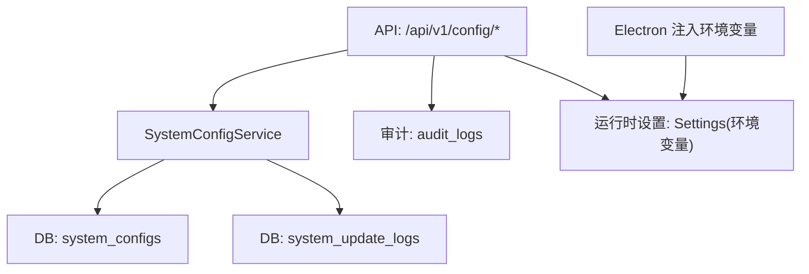
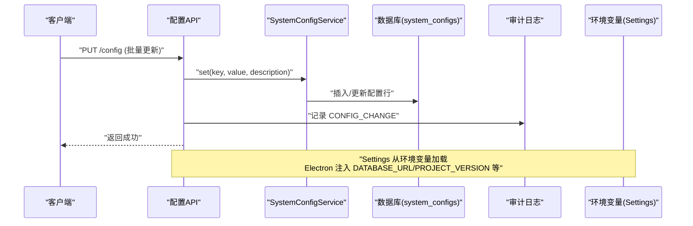
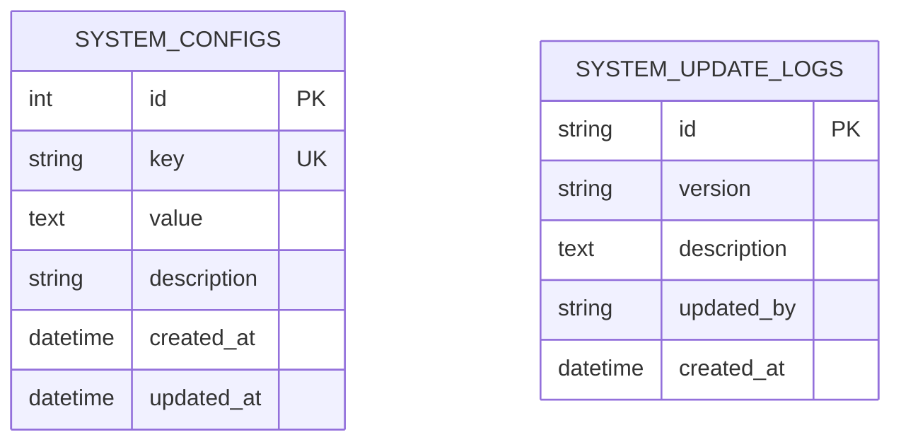
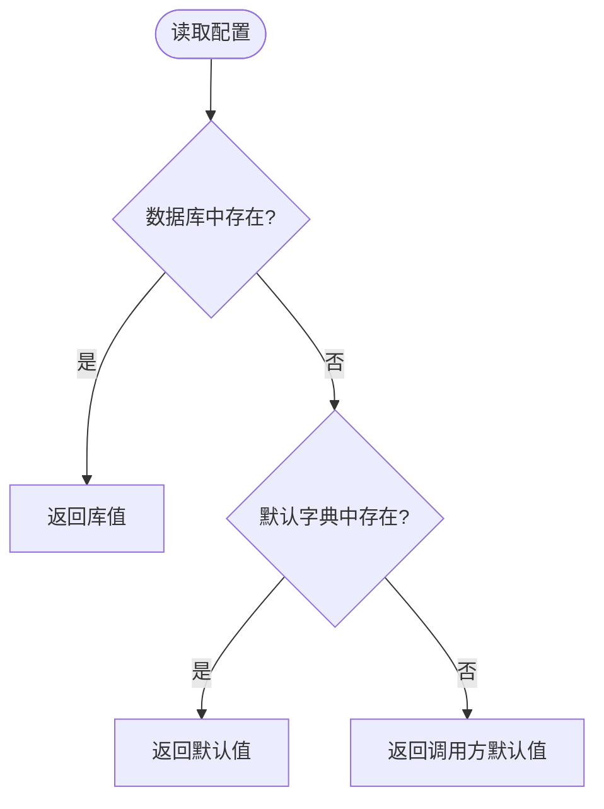
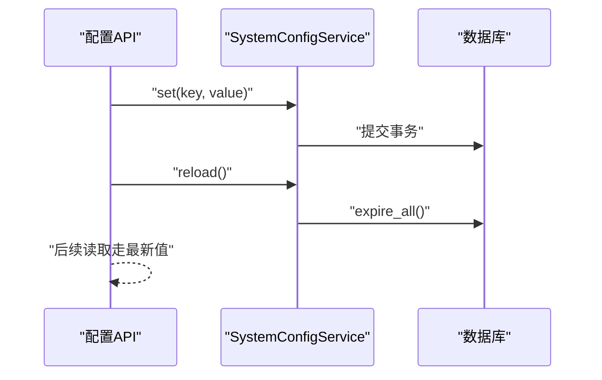
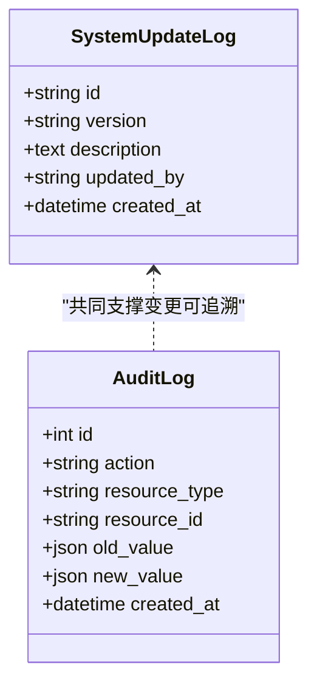
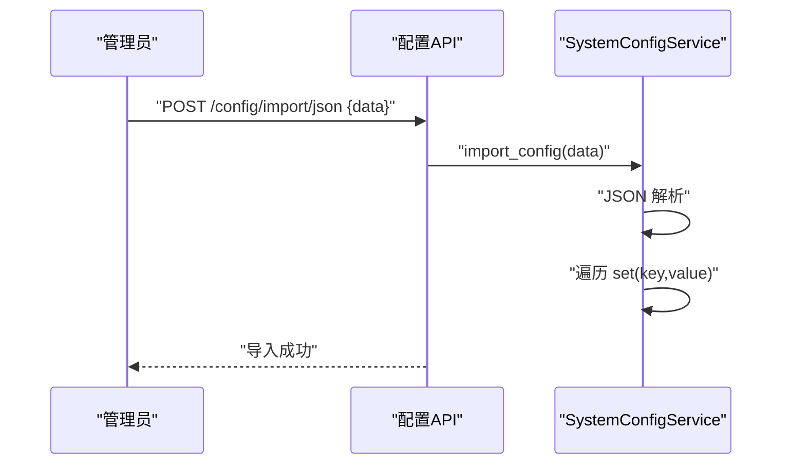
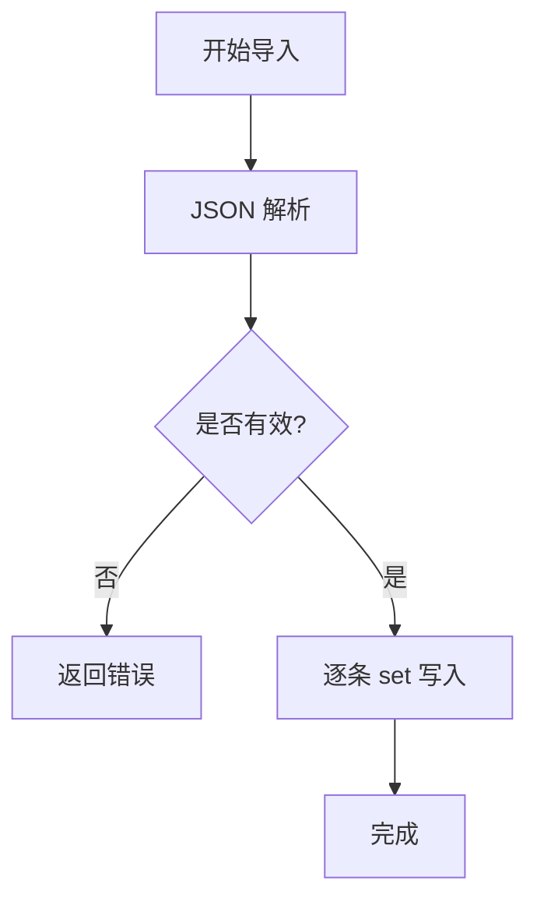
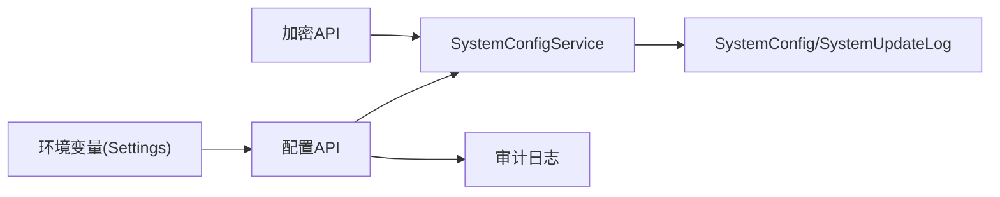

# 系统配置表结构

<cite>
**本文引用的文件**
- [backend/app/models/system_config.py](file://backend/app/models/system_config.py)
- [backend/app/services/system_config_service.py](file://backend/app/services/system_config_service.py)
- [backend/app/api/v1/system/system_config.py](file://backend/app/api/v1/system/system_config.py)
- [backend/app/api/v1/system/admin.py](file://backend/app/api/v1/system/admin.py)
- [backend/app/core/config.py](file://backend/app/core/config.py)
- [backend/app/models/audit.py](file://backend/app/models/audit.py)
- [backend/app/services/audit_service.py](file://backend/app/services/audit_service.py)
- [backend/app/api/v1/encryption.py](file://backend/app/api/v1/encryption.py)
- [electron/main.js](file://electron/main.js)
</cite>

## 目录
1. [简介](#简介)
2. [项目结构](#项目结构)
3. [核心组件](#核心组件)
4. [架构总览](#架构总览)
5. [详细组件分析](#详细组件分析)
6. [依赖关系分析](#依赖关系分析)
7. [性能考虑](#性能考虑)
8. [故障排查指南](#故障排查指南)
9. [结论](#结论)
10. [附录](#附录)

## 简介
本文件围绕 system_configs 键值对配置机制，系统化说明配置项分类组织、数据类型支持、默认值与回退策略、环境变量覆盖、热更新、版本控制、审计追踪、加密存储与敏感信息保护、导入导出、批量修改、验证与回滚等能力。文档以代码为依据，提供可追溯的源码路径与可视化图示，帮助读者快速理解并安全使用系统配置能力。

## 项目结构
与系统配置相关的核心位置如下：
- 数据模型：system_configs 表定义及系统更新日志表
- 服务层：SystemConfigService 提供配置的读写、类型转换、导入导出、初始化、重载等能力
- API 层：系统配置管理接口（查询、批量更新、导入导出、删除）
- 运行期配置：Settings 从环境变量加载应用级配置，部分配置项通过 system_configs 持久化
- 审计与版本：审计日志记录配置变更；系统更新日志用于版本变更记录
- 加密与安全：加密相关开关与密钥参数通过 system_configs 管理，并由 API 驱动

**图表来源**
- [backend/app/api/v1/system/system_config.py:46-281](file://backend/app/api/v1/system/system_config.py#L46-L281)
- [backend/app/services/system_config_service.py:68-266](file://backend/app/services/system_config_service.py#L68-L266)
- [backend/app/models/system_config.py:11-51](file://backend/app/models/system_config.py#L11-L51)
- [backend/app/models/audit.py:19-65](file://backend/app/models/audit.py#L19-L65)
- [backend/app/core/config.py:54-200](file://backend/app/core/config.py#L54-L200)
- [electron/main.js:274-289](file://electron/main.js#L274-L289)

**章节来源**
- [backend/app/models/system_config.py:11-51](file://backend/app/models/system_config.py#L11-L51)
- [backend/app/services/system_config_service.py:68-266](file://backend/app/services/system_config_service.py#L68-L266)
- [backend/app/api/v1/system/system_config.py:46-281](file://backend/app/api/v1/system/system_config.py#L46-L281)
- [backend/app/core/config.py:54-200](file://backend/app/core/config.py#L54-L200)
- [electron/main.js:274-289](file://electron/main.js#L274-L289)

## 核心组件
- 数据模型
  - system_configs：键值对配置表，包含 key、value、description、创建/更新时间戳
  - system_update_logs：系统更新日志表，记录版本、描述、操作人、时间
- 服务层 SystemConfigService
  - 默认配置字典 DEFAULT_CONFIGS，集中维护内置键及其默认值与说明
  - get/get_int/get_bool/get_json：统一读取与类型转换
  - set/delete：写入或移除配置，自动处理布尔/JSON序列化
  - initialize_defaults：启动时按默认字典填充缺失配置
  - export_config/import_config：配置导入导出
  - reload：会话级缓存失效
- API 层
  - GET /config：获取所有配置（附带默认说明）
  - PUT /config：批量更新
  - GET /config/{key}：获取单个配置
  - PUT /config/{key}：更新单个配置
  - DELETE /config/{key}：删除非核心配置
  - GET /config/export/json：导出为 JSON
  - POST /config/import/json：从 JSON 导入
  - GET /config/defaults：查看默认配置清单
- 运行期配置与环境变量
  - Settings 从 .env 与环境变量加载应用配置；Electron 在进程启动时注入 DATABASE_URL、PROJECT_VERSION、LOG_FILE、CACHE_DIR、EXPORT_DIR 等
- 审计与版本
  - 配置变更通过工作日志/审计日志记录（action=CONFIG_CHANGE 等）
  - 系统更新日志记录版本演进

**章节来源**
- [backend/app/models/system_config.py:11-51](file://backend/app/models/system_config.py#L11-L51)
- [backend/app/services/system_config_service.py:68-266](file://backend/app/services/system_config_service.py#L68-L266)
- [backend/app/api/v1/system/system_config.py:46-281](file://backend/app/api/v1/system/system_config.py#L46-L281)
- [backend/app/core/config.py:54-200](file://backend/app/core/config.py#L54-L200)
- [backend/app/models/audit.py:19-65](file://backend/app/models/audit.py#L19-L65)
- [backend/app/services/audit_service.py:58-106](file://backend/app/services/audit_service.py#L58-L106)
- [electron/main.js:274-289](file://electron/main.js#L274-L289)

## 架构总览
下图展示“请求—服务—存储—审计”的完整链路，以及环境变量到运行时设置的注入路径。

**图表来源**
- [backend/app/api/v1/system/system_config.py:69-106](file://backend/app/api/v1/system/system_config.py#L69-L106)
- [backend/app/services/system_config_service.py:155-189](file://backend/app/services/system_config_service.py#L155-L189)
- [backend/app/models/audit.py:19-65](file://backend/app/models/audit.py#L19-L65)
- [backend/app/core/config.py:54-200](file://backend/app/core/config.py#L54-L200)
- [electron/main.js:274-289](file://electron/main.js#L274-L289)

## 详细组件分析

### 数据模型与字段语义
- system_configs
  - id：自增主键
  - key：唯一索引的配置键
  - value：文本型配置值（字符串/JSON/布尔序列化的字符串）
  - description：配置说明
  - created_at/updated_at：自动时间戳
- system_update_logs
  - id/version/description/updated_by/created_at：版本与更新内容记录

**图表来源**
- [backend/app/models/system_config.py:11-51](file://backend/app/models/system_config.py#L11-L51)

**章节来源**
- [backend/app/models/system_config.py:11-51](file://backend/app/models/system_config.py#L11-L51)

### 配置键值对管理与默认值
- 默认配置集中在 DEFAULT_CONFIGS，涵盖系统标识、备份策略、打包策略、异常检测阈值、系统版本等
- 读取优先级：数据库存在则取库值；不存在则回退到默认字典；再不存在则返回调用方提供的默认值
- 写入时自动类型转换：布尔转 true/false 字符串；dict/list 转 JSON；其他转为字符串
- 初始化：服务启动时可调用 initialize_defaults 将缺失键写入数据库

**图表来源**
- [backend/app/services/system_config_service.py:100-126](file://backend/app/services/system_config_service.py#L100-L126)

**章节来源**
- [backend/app/services/system_config_service.py:71-126](file://backend/app/services/system_config_service.py#L71-L126)

### 数据类型支持与转换
- 字符串：直接存取
- 整数：get_int 将字符串解析为 int，失败返回默认值
- 布尔：get_bool 识别 true/1/yes/on 等常见真值
- JSON：get_json 解析 JSON 字符串，失败返回默认值
- 写入时自动序列化：bool→true/false；dict/list→JSON 字符串

**章节来源**
- [backend/app/services/system_config_service.py:128-153](file://backend/app/services/system_config_service.py#L128-L153)
- [backend/app/services/system_config_service.py:155-189](file://backend/app/services/system_config_service.py#L155-L189)

### 环境变量覆盖与运行时配置
- Settings 从 .env 与环境变量加载应用配置（如 PROJECT_VERSION、DATABASE_URL、端口、缓存目录等）
- Electron 在启动后端进程时注入环境变量，确保离线单机版正确运行
- 部分运行期配置（如系统版本）同时通过 system_configs 持久化，便于跨实例共享与迁移

**章节来源**
- [backend/app/core/config.py:54-200](file://backend/app/core/config.py#L54-L200)
- [electron/main.js:274-289](file://electron/main.js#L274-L289)
- [backend/app/services/system_config_service.py:71-95](file://backend/app/services/system_config_service.py#L71-L95)

### 配置热更新机制
- 写操作通过 safe_commit 提交事务，立即生效于数据库
- reload 方法会触发会话级缓存失效（expire_all），保证后续读取刷新
- 对于模块内缓存（如 dashboard/map），可通过对应清理接口配合使用

**图表来源**
- [backend/app/services/system_config_service.py:155-189](file://backend/app/services/system_config_service.py#L155-L189)
- [backend/app/services/system_config_service.py:246-251](file://backend/app/services/system_config_service.py#L246-L251)
- [backend/app/api/v1/system/admin.py:269-298](file://backend/app/api/v1/system/admin.py#L269-L298)

**章节来源**
- [backend/app/services/system_config_service.py:155-189](file://backend/app/services/system_config_service.py#L155-L189)
- [backend/app/services/system_config_service.py:246-251](file://backend/app/services/system_config_service.py#L246-L251)
- [backend/app/api/v1/system/admin.py:269-298](file://backend/app/api/v1/system/admin.py#L269-L298)

### 配置版本控制与审计追踪
- 版本控制：system_update_logs 记录版本、描述、操作人与时间；版本回滚由版本服务结合备份恢复实现
- 审计追踪：配置变更通过工作日志/审计日志记录（action 包含 CONFIG_CHANGE），包含操作人、资源、新旧值等上下文

**图表来源**
- [backend/app/models/system_config.py:32-51](file://backend/app/models/system_config.py#L32-L51)
- [backend/app/models/audit.py:19-65](file://backend/app/models/audit.py#L19-L65)
- [backend/app/services/audit_service.py:58-106](file://backend/app/services/audit_service.py#L58-L106)

**章节来源**
- [backend/app/models/system_config.py:32-51](file://backend/app/models/system_config.py#L32-L51)
- [backend/app/models/audit.py:19-65](file://backend/app/models/audit.py#L19-L65)
- [backend/app/services/audit_service.py:58-106](file://backend/app/services/audit_service.py#L58-L106)

### 配置加密存储与敏感信息保护
- 加密开关与参数（如 data_package_encryption、encryption_salt、encryption_iterations、encryption_verify_hash）通过 system_configs 管理
- 加密 API 通过 SystemConfigService 读写这些键，实现动态启用/禁用与密码轮换
- 建议：对高敏感键（如密钥、盐、迭代次数）限制访问权限，并在审计日志中记录变更

**章节来源**
- [backend/app/services/system_config_service.py:71-95](file://backend/app/services/system_config_service.py#L71-L95)
- [backend/app/api/v1/encryption.py:14-184](file://backend/app/api/v1/encryption.py#L14-L184)

### 配置导入导出与批量修改
- 导出：export_config 将所有配置序列化为 JSON 字符串
- 导入：import_config 接收 JSON 字符串，逐项写入（set）
- 批量更新：API 提供 PUT /config 批量写入，减少多次网络往返
- 校验：导入时若 JSON 格式无效，返回错误；写入时对类型进行规范化

**图表来源**
- [backend/app/api/v1/system/system_config.py:130-159](file://backend/app/api/v1/system/system_config.py#L130-L159)
- [backend/app/services/system_config_service.py:252-266](file://backend/app/services/system_config_service.py#L252-L266)

**章节来源**
- [backend/app/api/v1/system/system_config.py:69-106](file://backend/app/api/v1/system/system_config.py#L69-L106)
- [backend/app/api/v1/system/system_config.py:130-159](file://backend/app/api/v1/system/system_config.py#L130-L159)
- [backend/app/services/system_config_service.py:252-266](file://backend/app/services/system_config_service.py#L252-L266)

### 配置验证与回滚
- 验证：导入前进行 JSON 解析校验；写入时对类型进行转换与兜底（如 get_int/get_bool 失败返回默认）
- 回滚：结合 system_update_logs 与备份恢复流程，可按目标版本回滚；也可删除自定义配置项回退到默认值

**图表来源**
- [backend/app/services/system_config_service.py:252-266](file://backend/app/services/system_config_service.py#L252-L266)
- [backend/app/services/system_config_service.py:128-153](file://backend/app/services/system_config_service.py#L128-L153)

**章节来源**
- [backend/app/services/system_config_service.py:128-153](file://backend/app/services/system_config_service.py#L128-L153)
- [backend/app/services/system_config_service.py:252-266](file://backend/app/services/system_config_service.py#L252-L266)

## 依赖关系分析
- API 依赖 Service 进行配置读写；Service 依赖数据库模型与事务工具
- 审计服务记录配置变更；Settings 提供运行期配置；Electron 注入环境变量
- 加密 API 依赖 Service 管理加密相关配置键

**图表来源**
- [backend/app/api/v1/system/system_config.py:46-281](file://backend/app/api/v1/system/system_config.py#L46-L281)
- [backend/app/services/system_config_service.py:68-266](file://backend/app/services/system_config_service.py#L68-L266)
- [backend/app/models/system_config.py:11-51](file://backend/app/models/system_config.py#L11-L51)
- [backend/app/models/audit.py:19-65](file://backend/app/models/audit.py#L19-L65)
- [backend/app/core/config.py:54-200](file://backend/app/core/config.py#L54-L200)
- [backend/app/api/v1/encryption.py:14-184](file://backend/app/api/v1/encryption.py#L14-L184)

**章节来源**
- [backend/app/api/v1/system/system_config.py:46-281](file://backend/app/api/v1/system/system_config.py#L46-L281)
- [backend/app/services/system_config_service.py:68-266](file://backend/app/services/system_config_service.py#L68-L266)
- [backend/app/models/system_config.py:11-51](file://backend/app/models/system_config.py#L11-L51)
- [backend/app/models/audit.py:19-65](file://backend/app/models/audit.py#L19-L65)
- [backend/app/core/config.py:54-200](file://backend/app/core/config.py#L54-L200)
- [backend/app/api/v1/encryption.py:14-184](file://backend/app/api/v1/encryption.py#L14-L184)

## 性能考虑
- 批量更新：通过 PUT /config 一次性写入多项，减少网络与事务开销
- 类型转换：get_int/get_bool/get_json 提供快速转换与容错，避免业务层重复处理
- 会话缓存：reload 使用 expire_all 快速失效，降低读放大
- 大对象：value 为 Text 类型，适合存储 JSON 配置；注意控制单条大小与导入体积

[本节为通用指导，不直接分析具体文件]

## 故障排查指南
- 导入失败：检查 JSON 格式是否正确；确认导入数据键是否存在或允许覆盖
- 读取为空：确认是否已初始化默认配置；必要时调用 initialize_defaults
- 热更新未生效：调用 reload 使会话缓存失效；必要时清理模块级缓存
- 权限不足：修改/导入/删除需管理员权限；检查当前用户角色
- 审计缺失：确认审计日志写入是否成功；核对 action 与资源标识

**章节来源**
- [backend/app/api/v1/system/system_config.py:130-159](file://backend/app/api/v1/system/system_config.py#L130-L159)
- [backend/app/services/system_config_service.py:203-218](file://backend/app/services/system_config_service.py#L203-L218)
- [backend/app/services/system_config_service.py:246-251](file://backend/app/services/system_config_service.py#L246-L251)
- [backend/app/models/audit.py:19-65](file://backend/app/models/audit.py#L19-L65)

## 结论
system_configs 提供了健壮的键值对配置管理能力：通过默认配置集中治理、灵活的类型转换、安全的导入导出与批量修改、完善的热更新与审计追踪、以及与加密和版本控制的深度集成。结合环境变量与 Settings，系统在离线单机与多环境部署下均能保持一致性与可运维性。

[本节为总结性内容，不直接分析具体文件]

## 附录
- 常用配置键示例（来自默认字典）：system_id、organization_id、initialized、data_package_encryption、auto_backup、backup_retention_days、backup_interval_days、max_backup_count、backup_target_dir、backup_encrypt、backup_reminder_days、auto_package_enabled、auto_package_interval_months、auto_package_dir、last_package_time、data_retention_days、package_max_size_mb、last_backup_time、system_version、anomaly_zscore_threshold、anomaly_overspend_threshold_pct、anomaly_detection_enabled
- 相关 API 端点：GET/PUT/DELETE /config、GET /config/{key}、GET /config/export/json、POST /config/import/json、GET /config/defaults

**章节来源**
- [backend/app/services/system_config_service.py:71-95](file://backend/app/services/system_config_service.py#L71-L95)
- [backend/app/api/v1/system/system_config.py:46-281](file://backend/app/api/v1/system/system_config.py#L46-L281)