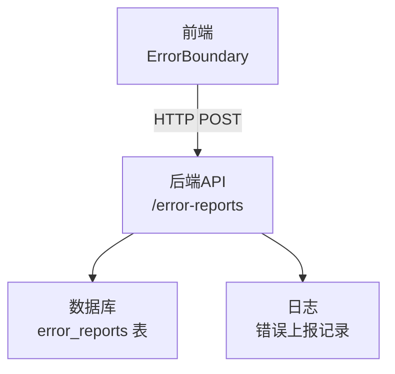
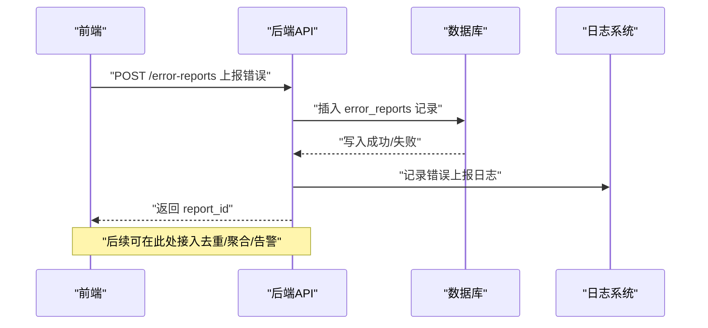
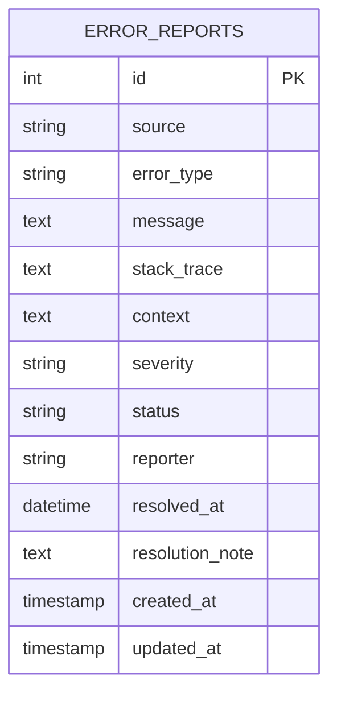
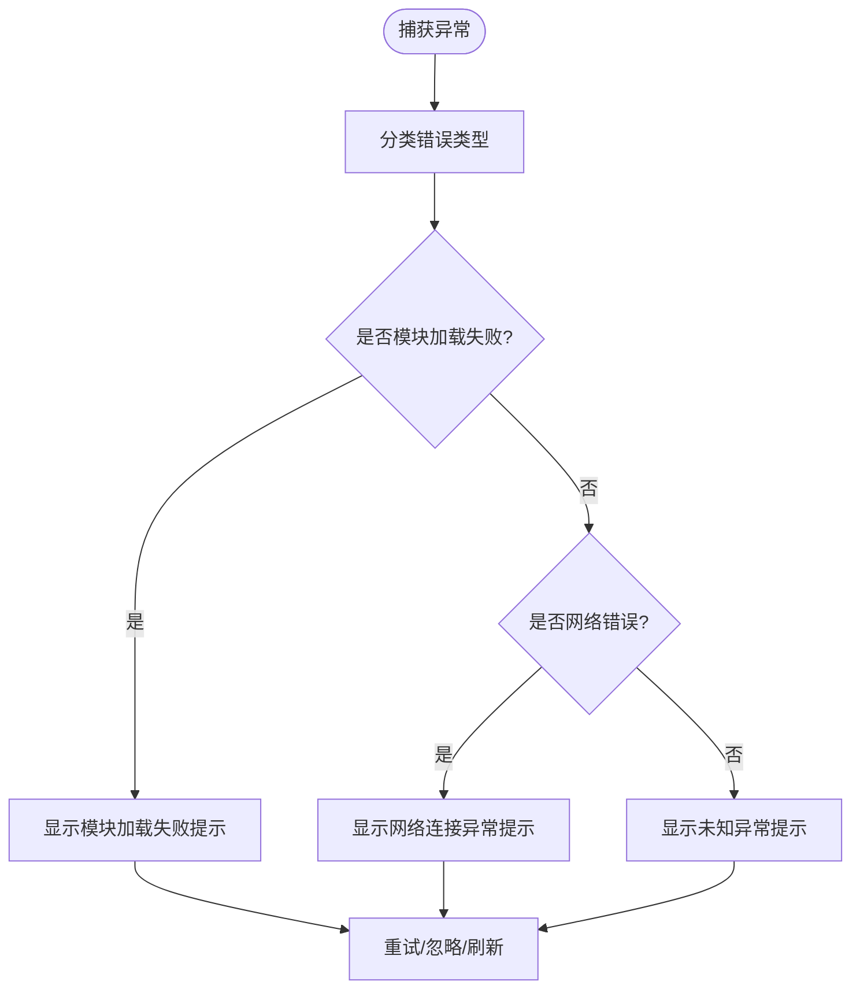
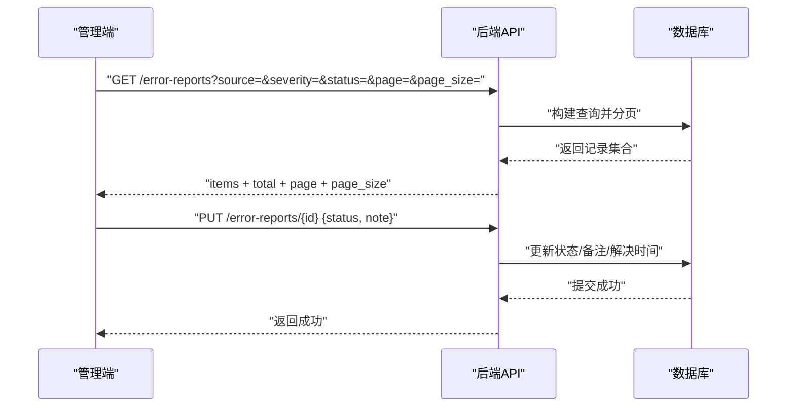
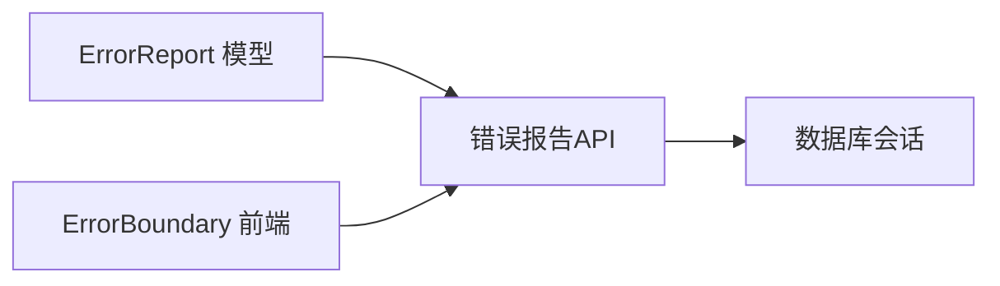

# 错误报告表结构

<cite>
**本文引用的文件**
- [backend/app/models/error_report.py](file://backend/app/models/error_report.py)
- [backend/app/api/v1/system/error_report.py](file://backend/app/api/v1/system/error_report.py)
- [frontend/src/components/common/ErrorBoundary.vue](file://frontend/src/components/common/ErrorBoundary.vue)
- [frontend/tests/unit/components/common/ErrorBoundary.test.ts](file://frontend/tests/unit/components/common/ErrorBoundary.test.ts)
- [backend/tests/unit/test_error_report_api_cov.py](file://backend/tests/unit/test_error_report_api_cov.py)
</cite>

## 目录
1. [简介](#简介)
2. [项目结构](#项目结构)
3. [核心组件](#核心组件)
4. [架构总览](#架构总览)
5. [详细组件分析](#详细组件分析)
6. [依赖关系分析](#依赖关系分析)
7. [性能与可扩展性](#性能与可扩展性)
8. [故障排查指南](#故障排查指南)
9. [结论](#结论)
10. [附录](#附录)

## 简介
本文件围绕错误报告持久化机制，系统化说明 error_reports 表的前端异常捕获、后端接口与模型设计、错误分类与状态流转、统计查询能力，以及可落地的告警与聚合策略建议。文档以仓库现有实现为依据，并给出面向生产环境的扩展建议（如去重、聚合、通知），确保非技术读者也能理解整体方案。

## 项目结构
- 前端：通过 ErrorBoundary 统一捕获组件渲染异常，进行错误分类（chunk/network/unknown）并展示兜底界面；当前未直接调用后端上报接口，但具备上报所需的数据字段（类型、消息、堆栈）。
- 后端：提供 /api/v1/system/error-reports 系列接口，支持错误上报、列表查询、详情获取、状态更新与统计；数据持久化到 error_reports 表。
- 测试：覆盖 API 各端点行为与 to_dict 序列化逻辑，验证上下文 JSON 解析、默认值、权限校验等。

图表来源
- [frontend/src/components/common/ErrorBoundary.vue:1-194](file://frontend/src/components/common/ErrorBoundary.vue#L1-L194)
- [backend/app/api/v1/system/error_report.py:1-260](file://backend/app/api/v1/system/error_report.py#L1-L260)
- [backend/app/models/error_report.py:1-36](file://backend/app/models/error_report.py#L1-L36)

章节来源
- [backend/app/models/error_report.py:1-36](file://backend/app/models/error_report.py#L1-L36)
- [backend/app/api/v1/system/error_report.py:1-260](file://backend/app/api/v1/system/error_report.py#L1-L260)
- [frontend/src/components/common/ErrorBoundary.vue:1-194](file://frontend/src/components/common/ErrorBoundary.vue#L1-L194)

## 核心组件
- 错误报告模型（ErrorReport）：定义 error_reports 表的字段与序列化方法，包含来源、类型、消息、堆栈、上下文、严重级别、状态、报告人、解决时间与备注等。
- 错误报告API：提供创建、查询、详情、更新与统计等端点，使用 SQLAlchemy 会话与事务封装，返回统一响应格式。
- 前端错误边界（ErrorBoundary）：捕获子组件未处理异常，按错误类型分类并呈现友好提示，支持重试、忽略、刷新与返回首页。

章节来源
- [backend/app/models/error_report.py:1-36](file://backend/app/models/error_report.py#L1-L36)
- [backend/app/api/v1/system/error_report.py:1-260](file://backend/app/api/v1/system/error_report.py#L1-L260)
- [frontend/src/components/common/ErrorBoundary.vue:1-194](file://frontend/src/components/common/ErrorBoundary.vue#L1-L194)

## 架构总览
前端在组件层捕获异常，构造结构化错误信息；后端提供 RESTful 接口接收并持久化到 error_reports 表；管理端可通过列表与统计接口进行运维监控与问题定位。

图表来源
- [backend/app/api/v1/system/error_report.py:49-87](file://backend/app/api/v1/system/error_report.py#L49-L87)
- [backend/app/models/error_report.py:8-20](file://backend/app/models/error_report.py#L8-L20)

## 详细组件分析

### 错误报告表结构与字段语义
- 表名：error_reports
- 关键字段
  - source：错误来源模块（字符串）
  - error_type：错误类型（字符串）
  - message：错误消息（文本）
  - stack_trace：堆栈跟踪（可选文本）
  - context：上下文信息（JSON 文本）
  - severity：严重程度（info/warning/error/critical）
  - status：状态（open/resolved/ignored/in_progress）
  - reporter：报告人（用户名或匿名）
  - resolved_at：解决时间（带时区）
  - resolution_note：处理备注（文本）
- 序列化：to_dict 将 context 从 JSON 文本解析为对象，并支持键名驼峰转换。

图表来源
- [backend/app/models/error_report.py:8-20](file://backend/app/models/error_report.py#L8-L20)

章节来源
- [backend/app/models/error_report.py:1-36](file://backend/app/models/error_report.py#L1-L36)

### 前端错误捕获与分类
- 捕获机制：使用 onErrorCaptured 捕获子组件未处理异常，阻止冒泡避免白屏。
- 错误分类：
  - chunk：动态导入失败（Vite 相关错误）
  - network：网络请求失败（fetch/xhr 错误）
  - unknown：未知运行时异常
- 用户交互：提供重试、忽略、刷新页面、返回首页等操作；未知错误支持展开堆栈查看详情。
- 上报准备：已收集 type、message、stack，便于后续接入后端上报接口。

图表来源
- [frontend/src/components/common/ErrorBoundary.vue:72-120](file://frontend/src/components/common/ErrorBoundary.vue#L72-L120)

章节来源
- [frontend/src/components/common/ErrorBoundary.vue:1-194](file://frontend/src/components/common/ErrorBoundary.vue#L1-L194)
- [frontend/tests/unit/components/common/ErrorBoundary.test.ts:90-149](file://frontend/tests/unit/components/common/ErrorBoundary.test.ts#L90-L149)

### 后端错误上报与处理流程
- 上报接口：POST /error-reports，接收 source、error_type、message、stack_trace、context、severity，自动设置 status=open 与 reporter。
- 列表接口：GET /error-reports，支持按 source、severity、status 筛选与分页。
- 详情接口：GET /error-reports/{id}，返回单条记录的完整信息。
- 更新接口：PUT /error-reports/{id}，仅本人或管理员可修改状态，resolved 时自动记录 resolved_at。
- 统计接口：GET /error-reports/stats，返回总数、未处理数、严重错误数、按来源与严重级别的分布。
- 简化上报：POST /error-reports/report-exception，用于快速上报运行时异常。

图表来源
- [backend/app/api/v1/system/error_report.py:90-128](file://backend/app/api/v1/system/error_report.py#L90-L128)
- [backend/app/api/v1/system/error_report.py:184-223](file://backend/app/api/v1/system/error_report.py#L184-L223)

章节来源
- [backend/app/api/v1/system/error_report.py:1-260](file://backend/app/api/v1/system/error_report.py#L1-L260)
- [backend/tests/unit/test_error_report_api_cov.py:52-250](file://backend/tests/unit/test_error_report_api_cov.py#L52-L250)

### 错误分类与优先级管理
- 前端分类：chunk、network、unknown，用于不同兜底提示与操作。
- 后端严重级别：info、warning、error、critical，用于统计与告警阈值判断。
- 状态流转：open → in_progress → resolved/ignored，支持备注与解决时间记录。

章节来源
- [frontend/src/components/common/ErrorBoundary.vue:72-120](file://frontend/src/components/common/ErrorBoundary.vue#L72-L120)
- [backend/app/models/error_report.py:11-19](file://backend/app/models/error_report.py#L11-L19)
- [backend/app/api/v1/system/error_report.py:184-223](file://backend/app/api/v1/system/error_report.py#L184-L223)

### 错误聚合与去重策略（建议）
- 去重键建议：基于 source + error_type + 摘要哈希（对 message 做规范化后取哈希），结合时间窗口（如 5 分钟内相同键只保留一条）。
- 聚合维度：按 source、error_type、severity、status 聚合计数，支撑统计面板与趋势图。
- 存储优化：可在应用层维护最近去重缓存（内存或 Redis），减少重复写入；或在数据库层增加唯一约束与触发器（需评估写入量）。
- 历史归档：对 resolved/ignored 超过阈值的记录定期归档至历史表，降低主表压力。

[本节为通用建议，不直接对应具体代码文件]

### 错误通知与告警触发条件（建议）
- 实时告警：当 severity=critical 且 status=open 时，立即触发告警（邮件/IM/短信）。
- 阈值告警：单位时间内某 source 的错误数量超过阈值，或 open 错误占比上升，触发预警。
- 恢复通知：当错误由 open 转为 resolved，发送恢复通知。
- 通知渠道：可集成企业微信、钉钉、邮件或内部工单系统。

[本节为通用建议，不直接对应具体代码文件]

### 前端错误上报接口（对接建议）
- 目标接口：POST /error-reports
- 必填字段：source、error_type、message
- 可选字段：stack_trace、context、severity（默认 warning）
- 鉴权：当前接口依赖 get_current_user，建议在网关层或中间件层允许匿名上报，或在客户端携带匿名标识。
- 批量上报：可将多次错误合并为批次，降低网络开销。

章节来源
- [backend/app/api/v1/system/error_report.py:49-87](file://backend/app/api/v1/system/error_report.py#L49-L87)

### 后端错误处理中间件（现状与建议）
- 现状：错误上报接口独立于全局异常处理，使用 safe_commit 保证事务一致性，并在失败时回滚与记录日志。
- 建议：在全局异常中间件中统一捕获未处理异常，自动调用 /error-reports 上报，并附带 request_id、trace_id、用户上下文等。

章节来源
- [backend/app/api/v1/system/error_report.py:49-87](file://backend/app/api/v1/system/error_report.py#L49-L87)

### 错误统计分析报表（实现要点）
- 统计指标：total、open、critical、by_source、by_severity。
- 查询方式：使用 group_by 与 count 聚合，按来源与严重级别分组统计。
- 可视化：前端可基于 stats 接口绘制饼图、柱状图与趋势折线图。

章节来源
- [backend/app/api/v1/system/error_report.py:131-165](file://backend/app/api/v1/system/error_report.py#L131-L165)

## 依赖关系分析
- 模型依赖：ErrorReport 继承 BaseModel，定义表结构与序列化。
- API 依赖：使用 SessionLocal、get_current_user、safe_commit、SQLAlchemy func 进行数据访问与事务控制。
- 前端依赖：Vue 组合式 API、路由、UI 组件库（Element Plus）用于错误展示与交互。

图表来源
- [backend/app/models/error_report.py:1-36](file://backend/app/models/error_report.py#L1-L36)
- [backend/app/api/v1/system/error_report.py:1-260](file://backend/app/api/v1/system/error_report.py#L1-L260)
- [frontend/src/components/common/ErrorBoundary.vue:1-194](file://frontend/src/components/common/ErrorBoundary.vue#L1-L194)

章节来源
- [backend/app/models/error_report.py:1-36](file://backend/app/models/error_report.py#L1-L36)
- [backend/app/api/v1/system/error_report.py:1-260](file://backend/app/api/v1/system/error_report.py#L1-L260)
- [frontend/src/components/common/ErrorBoundary.vue:1-194](file://frontend/src/components/common/ErrorBoundary.vue#L1-L194)

## 性能与可扩展性
- 写入性能：批量上报与异步上报可降低瞬时压力；必要时引入消息队列缓冲。
- 查询性能：对 source、severity、status、created_at 建立索引以提升筛选与排序效率。
- 存储增长：定期归档 resolved/ignored 的历史记录，保持主表轻量化。
- 可扩展点：接入去重缓存、聚合服务、告警引擎、审计日志与追踪链路。

[本节为通用建议，不直接对应具体代码文件]

## 故障排查指南
- 上报失败：检查数据库连接与事务提交，确认 safe_commit 的异常回滚路径；查看服务端日志中的“错误报告写入失败”记录。
- 列表为空：确认筛选参数是否正确，status=all 会跳过状态过滤；检查分页参数。
- 详情缺失：确认 report_id 是否存在；不存在时返回 404。
- 权限不足：更新状态时仅报告者本人或管理员可修改；否则返回 403。
- 上下文解析：to_dict 会将 context JSON 文本解析为对象；若解析失败则保留原始文本。

章节来源
- [backend/app/api/v1/system/error_report.py:49-87](file://backend/app/api/v1/system/error_report.py#L49-L87)
- [backend/app/api/v1/system/error_report.py:90-128](file://backend/app/api/v1/system/error_report.py#L90-L128)
- [backend/app/api/v1/system/error_report.py:168-181](file://backend/app/api/v1/system/error_report.py#L168-L181)
- [backend/app/api/v1/system/error_report.py:184-223](file://backend/app/api/v1/system/error_report.py#L184-L223)
- [backend/app/models/error_report.py:22-35](file://backend/app/models/error_report.py#L22-L35)
- [backend/tests/unit/test_error_report_api_cov.py:52-250](file://backend/tests/unit/test_error_report_api_cov.py#L52-L250)

## 结论
error_reports 表为前端错误持久化的核心载体，配合 ErrorBoundary 的统一捕获与后端完善的 CRUD 与统计接口，形成了完整的错误收集与运维监控闭环。当前实现已满足基础需求，建议在生产环境补充去重、聚合与告警机制，进一步提升稳定性与可观测性。

## 附录
- 关键端点
  - POST /error-reports：上报错误
  - GET /error-reports：列表查询（支持筛选与分页）
  - GET /error-reports/{id}：详情
  - PUT /error-reports/{id}：更新状态
  - GET /error-reports/stats：统计
  - POST /error-reports/report-exception：简化上报
- 字段字典
  - severity：info/warning/error/critical
  - status：open/resolved/ignored/in_progress

章节来源
- [backend/app/api/v1/system/error_report.py:49-260](file://backend/app/api/v1/system/error_report.py#L49-L260)
- [backend/app/models/error_report.py:8-20](file://backend/app/models/error_report.py#L8-L20)