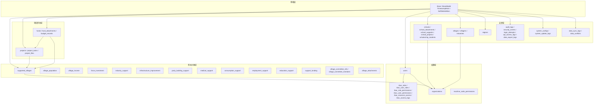
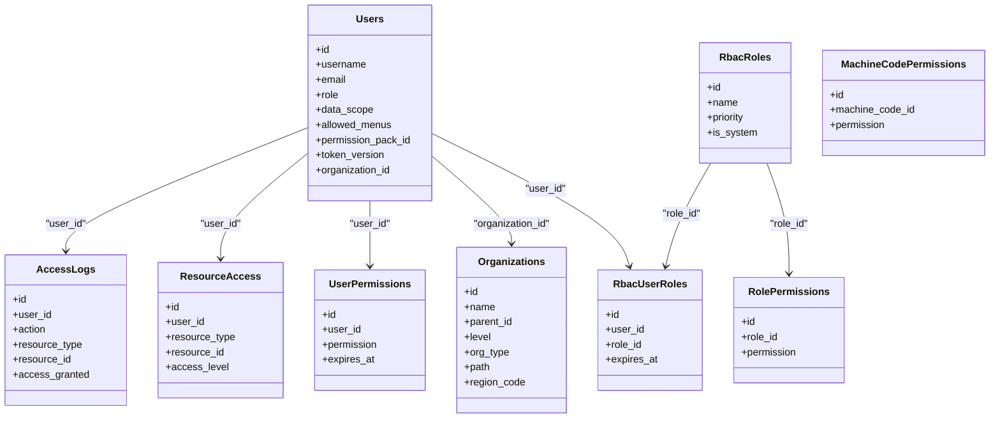
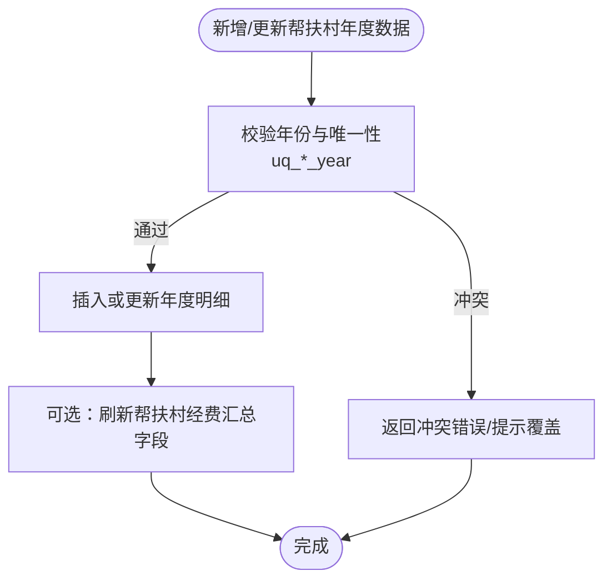
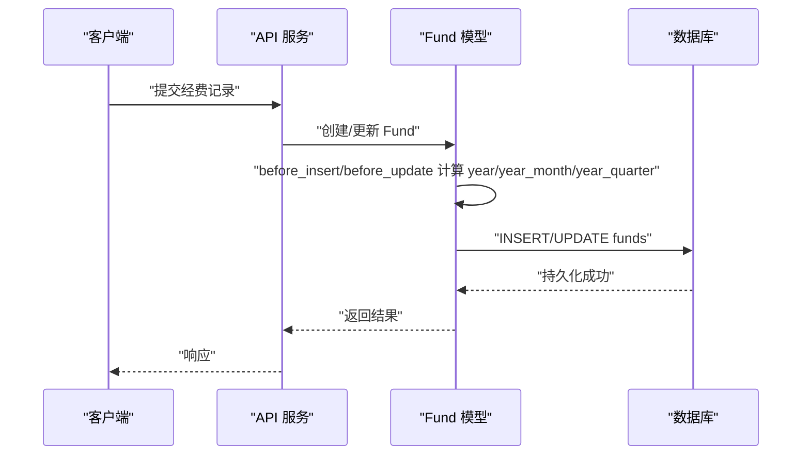

# 表结构设计

<cite>
**本文引用的文件**
- [backend/app/models/base.py](file://backend/app/models/base.py)
- [backend/app/models/user.py](file://backend/app/models/user.py)
- [backend/app/models/rbac.py](file://backend/app/models/rbac.py)
- [backend/app/models/organization.py](file://backend/app/models/organization.py)
- [backend/app/models/supported_village.py](file://backend/app/models/supported_village.py)
- [backend/app/models/fund.py](file://backend/app/models/fund.py)
- [backend/app/models/project.py](file://backend/app/models/project.py)
- [backend/app/models/school.py](file://backend/app/models/school.py)
- [backend/app/models/village.py](file://backend/app/models/village.py)
- [backend/app/models/audit.py](file://backend/app/models/audit.py)
- [backend/app/models/region.py](file://backend/app/models/region.py)
- [backend/app/models/system_config.py](file://backend/app/models/system_config.py)
- [backend/app/models/data_sync.py](file://backend/app/models/data_sync.py)
- [backend/alembic/versions/001_baseline.py](file://backend/alembic/versions/001_baseline.py)
- [backend/alembic/versions/002_add_fund_management_tables.py](file://backend/alembic/versions/002_add_fund_management_tables.py)
- [backend/alembic/versions/003_add_performance_indexes.py](file://backend/alembic/versions/003_add_performance_indexes.py)
- [backend/alembic/versions/recycle_retention_001_add_deleted_at.py](file://backend/alembic/versions/recycle_retention_001_add_deleted_at.py)
- [backend/alembic/versions/fund_project_softdel_001_add_is_active.py](file://backend/alembic/versions/fund_project_softdel_001_add_is_active.py)
- [backend/alembic/versions/village_softdel_001_add_is_active.py](file://backend/alembic/versions/village_softdel_001_add_is_active.py)
</cite>

## 目录
1. [简介](#简介)
2. [项目结构](#项目结构)
3. [核心组件](#核心组件)
4. [架构总览](#架构总览)
5. [详细组件分析](#详细组件分析)
6. [依赖关系分析](#依赖关系分析)
7. [性能考虑](#性能考虑)
8. [故障排查指南](#故障排查指南)
9. [结论](#结论)
10. [附录](#附录)

## 简介
本文件面向“乡村振兴帮扶管理系统”的数据库表结构设计，聚焦以下目标：
- 全面说明各业务域的表结构定义、字段类型选择与约束条件设置
- 重点覆盖用户权限域（约16张表）、帮扶对象域（约30张表）、项目资金域（约24张表）等核心模块
- 明确主外键关系、索引策略、数据完整性约束
- 提供表结构变更管理、版本控制与迁移脚本编写规范
- 统一软删除实现、审计字段设计、性能优化技巧

## 项目结构
后端采用 SQLAlchemy 声明式模型组织表结构，基类与混入在 base.py 中集中定义；业务表按领域拆分到 models 目录下；数据库迁移使用 Alembic 管理。

图表来源
- [backend/app/models/base.py:1-185](file://backend/app/models/base.py#L1-L185)
- [backend/app/models/user.py:26-86](file://backend/app/models/user.py#L26-L86)
- [backend/app/models/rbac.py:31-263](file://backend/app/models/rbac.py#L31-L263)
- [backend/app/models/organization.py:31-78](file://backend/app/models/organization.py#L31-L78)
- [backend/app/models/supported_village.py:42-800](file://backend/app/models/supported_village.py#L42-L800)
- [backend/app/models/project.py:47-320](file://backend/app/models/project.py#L47-L320)
- [backend/app/models/fund.py:61-299](file://backend/app/models/fund.py#L61-L299)
- [backend/app/models/school.py:43-375](file://backend/app/models/school.py#L43-L375)
- [backend/app/models/village.py:14-130](file://backend/app/models/village.py#L14-L130)
- [backend/app/models/audit.py:53-205](file://backend/app/models/audit.py#L53-L205)
- [backend/app/models/region.py:11-40](file://backend/app/models/region.py#L11-L40)
- [backend/app/models/system_config.py:11-51](file://backend/app/models/system_config.py#L11-L51)
- [backend/app/models/data_sync.py:8-72](file://backend/app/models/data_sync.py#L8-L72)

章节来源
- [backend/app/models/base.py:1-185](file://backend/app/models/base.py#L1-L185)

## 核心组件
- 基础模型与混入
  - BaseModel：统一 id、created_at、updated_at、to_dict 序列化能力
  - TimestampMixin：自动时间戳与同步版本号 sync_version（更新时自增）
  - SoftDeleteMixin：is_deleted/deleted_at/deleted_by 软删除与恢复方法
  - EncryptedText：PII 透明加密类型（写入加密、读取解密），用于敏感字段
- 权限域核心表
  - users：用户主表，含角色、数据范围、菜单白名单、设备绑定、Token 版本等
  - rbac_*：RBAC 角色、用户-角色、角色-权限、用户直接权限、资源访问控制、访问日志
  - organizations：树形组织，支持层级、类型、路径、区域编码等
  - machine_code_permissions：机器码功能权限
- 帮扶对象域核心表
  - supported_villages：帮扶村主表，包含地理、振兴标记、经费汇总、软删标记、组织关联
  - 年度子表：人口、收入、专项投入、产业、基建、党建、医疗、消费、就业、教育、村委会信息/成员、附件等
  - support_funding：过渡期经费跟踪
- 项目资金域核心表
  - projects：项目主表，状态、预算、起止时间、负责人、资金来源、软删标记等
  - funds：经费记录，含金额流水、生命周期、健康度、异常标记、统计冗余字段（year/year_month/year_quarter）
  - project_tasks / project_files：任务与阶段附件
  - budget_records：年度预算记录
- 支撑域
  - schools / school_*：学校及资助、项目、附件
  - villages / villagers / industries：村庄基础与产业
  - regions：行政区划编码与几何
  - audit_*：审计与安全事件、登录尝试、API 访问、导出日志
  - system_configs / system_update_logs：系统配置与更新日志
  - data_sync_logs / data_conflicts：数据同步与冲突处理

章节来源
- [backend/app/models/base.py:23-185](file://backend/app/models/base.py#L23-L185)
- [backend/app/models/user.py:26-86](file://backend/app/models/user.py#L26-L86)
- [backend/app/models/rbac.py:31-263](file://backend/app/models/rbac.py#L31-L263)
- [backend/app/models/organization.py:31-78](file://backend/app/models/organization.py#L31-L78)
- [backend/app/models/supported_village.py:42-800](file://backend/app/models/supported_village.py#L42-L800)
- [backend/app/models/project.py:47-320](file://backend/app/models/project.py#L47-L320)
- [backend/app/models/fund.py:61-299](file://backend/app/models/fund.py#L61-L299)
- [backend/app/models/school.py:43-375](file://backend/app/models/school.py#L43-L375)
- [backend/app/models/village.py:14-130](file://backend/app/models/village.py#L14-L130)
- [backend/app/models/audit.py:53-205](file://backend/app/models/audit.py#L53-L205)
- [backend/app/models/region.py:11-40](file://backend/app/models/region.py#L11-L40)
- [backend/app/models/system_config.py:11-51](file://backend/app/models/system_config.py#L11-L51)
- [backend/app/models/data_sync.py:8-72](file://backend/app/models/data_sync.py#L8-L72)

## 架构总览
下图展示核心实体间的主外键关系与关键索引策略，体现数据隔离（organization_id）、软删除（is_active/deleted_at）、以及高频查询的复合索引。

```mermaid
erDiagram
ORGANIZATIONS ||--o{ USERS : "所属组织"
ORGANIZATIONS ||--o{ SUPPORTED_VILLAGES : "所属组织"
ORGANIZATIONS ||--o{ PROJECTS : "负责单位"
ORGANIZATIONS ||--o{ FUNDS : "所属组织"
ORGANIZATIONS ||--o{ SCHOOLS : "所属组织"
ORGANIZATIONS ||--o{ VILLAGES : "所属组织"
USERS ||--o{ RBAC_USER_ROLES : "用户-角色"
RBAC_ROLES ||--o{ RBAC_USER_ROLES : "角色-用户"
RBAC_ROLES ||--o{ RBAC_ROLE_PERMISSIONS : "角色-权限"
USERS ||--o{ RBAC_USER_PERMISSIONS : "用户-权限"
USERS ||--o{ RBAC_RESOURCE_ACCESS : "资源访问控制"
USERS ||--o{ AUDIT_LOGS : "操作审计"
USERS ||--o{ DATA_SYNC_LOGS : "同步操作人"
SUPPORTED_VILLAGES ||--o{ VILLAGE_POPULATION : "年度人口"
SUPPORTED_VILLAGES ||--o{ VILLAGE_INCOME : "年度收入"
SUPPORTED_VILLAGES ||--o{ FORCE_INVESTMENT : "专项投入"
SUPPORTED_VILLAGES ||--o{ INDUSTRY_SUPPORT : "产业帮扶"
SUPPORTED_VILLAGES ||--o{ INFRASTRUCTURE_IMPROVEMENT : "基础设施改善"
SUPPORTED_VILLAGES ||--o{ PARTY_BUILDING_SUPPORT : "党建帮扶"
SUPPORTED_VILLAGES ||--o{ MEDICAL_SUPPORT : "医疗帮扶"
SUPPORTED_VILLAGES ||--o{ CONSUMPTION_SUPPORT : "消费帮扶"
SUPPORTED_VILLAGES ||--o{ EMPLOYMENT_SUPPORT : "就业帮扶"
SUPPORTED_VILLAGES ||--o{ EDUCATION_SUPPORT : "教育帮扶"
SUPPORTED_VILLAGES ||--o{ SUPPORT_FUNDING : "过渡期经费"
SUPPORTED_VILLAGES ||--o{ VILLAGE_COMMITTEE_INFO : "村委会信息"
VILLAGE_COMMITTEE_INFO ||--o{ VILLAGE_COMMITTEE_MEMBERS : "村委会成员"
SUPPORTED_VILLAGES ||--o{ VILLAGE_ATTACHMENTS : "附件"
PROJECTS ||--o{ PROJECT_TASKS : "项目任务"
PROJECTS ||--o{ PROJECT_FILES : "项目附件"
PROJECTS ||--o{ FUNDS : "经费归属"
SCHOOLS ||--o{ SCHOOL_ATTACHMENTS : "附件"
SCHOOLS ||--o{ SCHOOL_SUPPORTS : "帮扶记录"
SCHOOLS ||--o{ SCHOOL_PROJECTS : "助学项目"
SCHOOLS ||--o{ SCHOLARSHIP_STUDENTS : "资助学生"
REGIONS ||--|| USERS : "数据权限前缀(间接)"
REGIONS ||--|| SUPPORTED_VILLAGES : "数据权限前缀(间接)"
REGIONS ||--|| ORGANIZATIONS : "数据权限前缀(间接)"
REGIONS ||--|| VILLAGES : "数据权限前缀(间接)"
```

图表来源
- [backend/app/models/user.py:26-86](file://backend/app/models/user.py#L26-L86)
- [backend/app/models/rbac.py:31-263](file://backend/app/models/rbac.py#L31-L263)
- [backend/app/models/organization.py:31-78](file://backend/app/models/organization.py#L31-L78)
- [backend/app/models/supported_village.py:42-800](file://backend/app/models/supported_village.py#L42-L800)
- [backend/app/models/project.py:47-320](file://backend/app/models/project.py#L47-L320)
- [backend/app/models/fund.py:61-299](file://backend/app/models/fund.py#L61-L299)
- [backend/app/models/school.py:43-375](file://backend/app/models/school.py#L43-L375)
- [backend/app/models/village.py:14-130](file://backend/app/models/village.py#L14-L130)
- [backend/app/models/audit.py:53-205](file://backend/app/models/audit.py#L53-L205)
- [backend/app/models/region.py:11-40](file://backend/app/models/region.py#L11-L40)

## 详细组件分析

### 用户权限域（约16表）
- 用户与组织
  - users：用户名、邮箱、角色、数据范围、菜单白名单、设备绑定、Token 版本、密码安全相关字段；组织外键 SET NULL；多索引优化查询
  - organizations：树形组织，层级、类型、路径、区域编码、联系人加密电话；自引用 parent_id
- RBAC 权限
  - rbac_roles：角色名称唯一、优先级、是否系统内置
  - rbac_user_roles：用户-角色关联，授权人与过期时间
  - rbac_role_permissions：角色-权限标识
  - rbac_user_permissions：用户直接权限，授权人与过期时间
  - rbac_resource_access：资源级访问控制（user/resource_type/resource_id/access_level）
  - rbac_access_logs：访问日志（action、resource、granted/reason、IP/UA）
  - machine_code_permissions：机器码功能权限绑定
- 审计与安全
  - audit_logs：操作审计（old/new JSON、请求元数据、耗时）
  - security_events：安全事件（严重级别、解决状态）
  - login_attempts：登录尝试记录
  - api_access_logs：API 访问日志
  - data_export_logs：数据导出日志

图表来源
- [backend/app/models/user.py:26-86](file://backend/app/models/user.py#L26-L86)
- [backend/app/models/rbac.py:31-263](file://backend/app/models/rbac.py#L31-L263)
- [backend/app/models/organization.py:31-78](file://backend/app/models/organization.py#L31-L78)

章节来源
- [backend/app/models/user.py:26-86](file://backend/app/models/user.py#L26-L86)
- [backend/app/models/rbac.py:31-263](file://backend/app/models/rbac.py#L31-L263)
- [backend/app/models/organization.py:31-78](file://backend/app/models/organization.py#L31-L78)
- [backend/app/models/audit.py:53-205](file://backend/app/models/audit.py#L53-L205)

### 帮扶对象域（约30表）
- 主表 supported_villages：基本信息、地理坐标、振兴标记、跨区域标记、经费汇总、软删标记 is_active/deleted_at、组织与创建者外键、区域编码
- 年度子表（均带 year 维度与唯一约束 uq_*_year）：
  - village_population：人口指标
  - village_income：收入指标
  - force_investment：专项投入
  - industry_support：产业帮扶
  - infrastructure_improvement：基础设施改善
  - party_building_support：党建帮扶
  - medical_support：医疗帮扶
  - consumption_support：消费帮扶
  - employment_support：就业帮扶
  - education_support：教育帮扶
- 其他：
  - support_funding：过渡期经费跟踪（village+year+funding_type 唯一）
  - village_committee_info / village_committee_members：村委会信息与成员
  - village_attachments：帮扶村附件

图表来源
- [backend/app/models/supported_village.py:313-670](file://backend/app/models/supported_village.py#L313-L670)

章节来源
- [backend/app/models/supported_village.py:42-800](file://backend/app/models/supported_village.py#L42-L800)

### 项目资金域（约24表）
- 项目主表 projects：状态机、预算与实际花费、起止时间、负责人、资金来源、软删标记、组织与创建者外键；多复合索引优化状态/时间/村庄/组织过滤
- 经费主表 funds：金额流水、生命周期阶段、健康度、异常标记、决算状态；统计冗余字段 year/year_month/year_quarter 配合复合索引加速大屏聚合；自动事件填充时间维度
- 项目任务与附件：project_tasks、project_files
- 预算记录：budget_records（年度类别预算与使用）

图表来源
- [backend/app/models/fund.py:61-299](file://backend/app/models/fund.py#L61-L299)

章节来源
- [backend/app/models/project.py:47-320](file://backend/app/models/project.py#L47-L320)
- [backend/app/models/fund.py:61-299](file://backend/app/models/fund.py#L61-L299)

### 支撑域（学校、村庄、区划、审计、配置、同步）
- 学校：schools、school_attachments、school_supports、school_projects、scholarship_students
- 村庄：villages、villagers、industries
- 区划：regions（code 唯一、层级、父编码、几何）
- 审计：audit_logs、security_events、login_attempts、api_access_logs、data_export_logs
- 配置：system_configs、system_update_logs
- 同步：data_sync_logs、data_conflicts

章节来源
- [backend/app/models/school.py:43-375](file://backend/app/models/school.py#L43-L375)
- [backend/app/models/village.py:14-130](file://backend/app/models/village.py#L14-L130)
- [backend/app/models/region.py:11-40](file://backend/app/models/region.py#L11-L40)
- [backend/app/models/audit.py:53-205](file://backend/app/models/audit.py#L53-L205)
- [backend/app/models/system_config.py:11-51](file://backend/app/models/system_config.py#L11-L51)
- [backend/app/models/data_sync.py:8-72](file://backend/app/models/data_sync.py#L8-L72)

## 依赖关系分析
- 外键约束
  - 多数从表对主表使用 ondelete=CASCADE（如年度子表对 supported_villages、任务对 projects、经费对项目和村庄）
  - 用户与组织、项目与组织、学校与组织等使用 ondelete=SET NULL，保证数据可独立存在
- 索引策略
  - 单列索引：status、type、date、organization_id、created_by 等
  - 复合索引：项目（status+type、status+created_at、village_id+status、organization_id+status）、经费（year_month+status、year_quarter+fund_source、year+fund_source）
- 数据完整性
  - 唯一约束：users.username/email、projects.code、regions.code、年度子表 uq_*_year
  - 枚举与校验：SQLAlchemy Enum 与 Pydantic Schema 共同保障
- 耦合与内聚
  - 高内聚：每个业务域集中在一个 models 文件
  - 低耦合：通过字符串 relationship 引用避免循环导入

章节来源
- [backend/app/models/project.py:47-320](file://backend/app/models/project.py#L47-L320)
- [backend/app/models/fund.py:61-299](file://backend/app/models/fund.py#L61-L299)
- [backend/app/models/supported_village.py:42-800](file://backend/app/models/supported_village.py#L42-L800)
- [backend/app/models/user.py:26-86](file://backend/app/models/user.py#L26-L86)
- [backend/app/models/region.py:11-40](file://backend/app/models/region.py#L11-L40)

## 性能考虑
- 统计冗余字段
  - funds.year/year_month/year_quarter 由 before_insert/before_update 自动填充，配合复合索引直接命中 GROUP BY 聚合，消除 func.strftime 全表扫描
- 索引设计
  - 高频过滤字段建立单列索引；组合查询建立复合索引（如 status+date、village_id+status、organization_id+status）
- 懒加载与显式加载
  - 部分关系使用 lazy="noload"/"selectin"，列表查询时按需 selectinload，减少 N+1 问题
- PII 透明加密
  - EncryptedText 对敏感字段透明加解密，避免应用层侵入；注意查询命中密文需确定性加密策略
- 软删除
  - is_active/deleted_at 结合索引，避免物理删除带来的历史数据丢失与级联风险

[本节为通用性能建议，不直接分析具体文件]

## 故障排查指南
- 常见错误定位
  - 唯一约束冲突：检查 username/code/uq_*_year 等唯一字段重复
  - 外键约束失败：确认主表记录是否存在，必要时调整 ondelete 策略
  - 枚举值非法：检查 Pydantic Schema 与 SQL 枚举一致性
- 审计与追踪
  - 通过 audit_logs 查看操作前后 JSON 差异、请求路径与方法、耗时
  - 通过 api_access_logs 定位接口调用链路与响应状态
- 数据同步问题
  - data_sync_logs 记录同步类型、包名、状态、冲突数、成功/失败记录数
  - data_conflicts 记录本地与导入数据差异及解决方案

章节来源
- [backend/app/models/audit.py:53-205](file://backend/app/models/audit.py#L53-L205)
- [backend/app/models/data_sync.py:8-72](file://backend/app/models/data_sync.py#L8-L72)

## 结论
本表结构设计以“基础混入 + 领域模型 + 迁移管理”为核心，围绕用户权限、帮扶对象、项目资金三大域构建完整的数据体系。通过统一的软删除、审计字段、PII 加密与精细化的索引策略，兼顾数据安全、可追溯性与查询性能。后续扩展应遵循现有模式，确保一致性与可维护性。

[本节为总结性内容，不直接分析具体文件]

## 附录

### 软删除与审计字段设计
- 软删除
  - 新模型建议使用 SoftDeleteMixin（is_deleted/deleted_at/deleted_by）
  - 已有模型（SupportedVillage/School/Project/Fund）使用 is_active/deleted_at 保持一致性
- 审计字段
  - created_at/updated_at 由 TimestampMixin 提供
  - 审计日志表记录操作详情、请求元数据、耗时与错误信息

章节来源
- [backend/app/models/base.py:66-185](file://backend/app/models/base.py#L66-L185)
- [backend/app/models/supported_village.py:103-125](file://backend/app/models/supported_village.py#L103-L125)
- [backend/app/models/project.py:143-165](file://backend/app/models/project.py#L143-L165)
- [backend/app/models/fund.py:145-155](file://backend/app/models/fund.py#L145-L155)
- [backend/app/models/audit.py:53-205](file://backend/app/models/audit.py#L53-L205)

### 表结构变更管理与迁移规范
- 版本控制
  - 所有 DDL 变更通过 Alembic 迁移脚本管理，命名清晰、顺序递增
- 迁移脚本编写规范
  - 新增表/字段：明确注释、默认值、约束
  - 索引优化：先评估查询场景，再添加单列/复合索引
  - 软删除：优先使用 is_active/deleted_at 渐进式改造，避免破坏既有查询
  - 回滚策略：尽量保持可逆，复杂变更提供 backfill 脚本
- 参考迁移
  - 基线与资金表、性能索引、安全表、协作表、效果与情感表、加密字段、高级索引、机器码、合并分支、权限包、PII 回填、回收站保留期、区域编码、下级控制、令牌版本、村庄软删、村庄状态、工作流待办等

章节来源
- [backend/alembic/versions/001_baseline.py](file://backend/alembic/versions/001_baseline.py)
- [backend/alembic/versions/002_add_fund_management_tables.py](file://backend/alembic/versions/002_add_fund_management_tables.py)
- [backend/alembic/versions/003_add_performance_indexes.py](file://backend/alembic/versions/003_add_performance_indexes.py)
- [backend/alembic/versions/recycle_retention_001_add_deleted_at.py](file://backend/alembic/versions/recycle_retention_001_add_deleted_at.py)
- [backend/alembic/versions/fund_project_softdel_001_add_is_active.py](file://backend/alembic/versions/fund_project_softdel_001_add_is_active.py)
- [backend/alembic/versions/village_softdel_001_add_is_active.py](file://backend/alembic/versions/village_softdel_001_add_is_active.py)