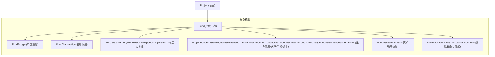
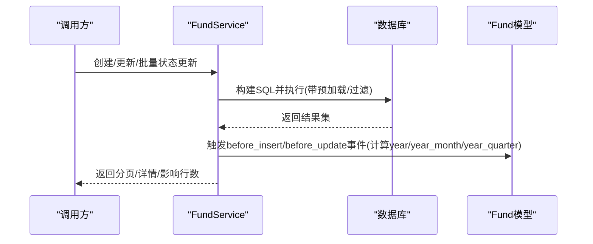
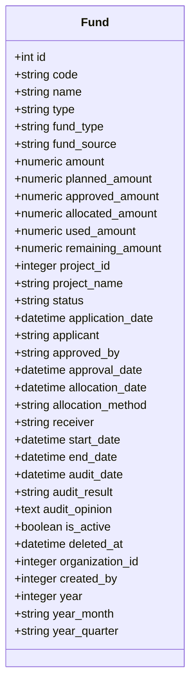
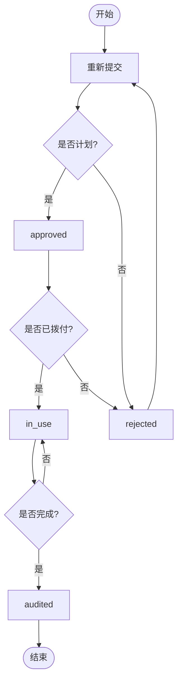
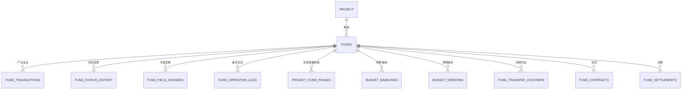
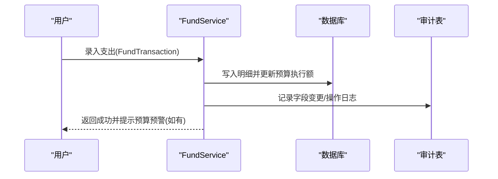
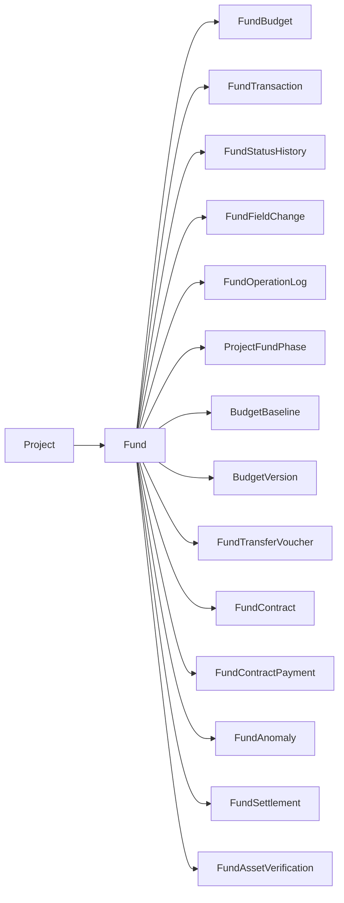

# 经费核心表结构

<cite>
**本文引用的文件**
- [backend/app/models/fund.py](file://backend/app/models/fund.py)
- [backend/app/models/fund_budget.py](file://backend/app/models/fund_budget.py)
- [backend/app/models/fund_history.py](file://backend/app/models/fund_history.py)
- [backend/app/models/fund_lifecycle.py](file://backend/app/models/fund_lifecycle.py)
- [backend/app/models/fund_asset_verification.py](file://backend/app/models/fund_asset_verification.py)
- [backend/app/models/fund_allocation_order.py](file://backend/app/models/fund_allocation_order.py)
- [backend/app/schemas/fund.py](file://backend/app/schemas/fund.py)
- [backend/app/services/fund_service.py](file://backend/app/services/fund_service.py)
- [backend/app/models/project.py](file://backend/app/models/project.py)
</cite>

## 目录
1. [引言](#引言)
2. [项目结构](#项目结构)
3. [核心组件](#核心组件)
4. [架构总览](#架构总览)
5. [详细组件分析](#详细组件分析)
6. [依赖关系分析](#依赖关系分析)
7. [性能考虑](#性能考虑)
8. [故障排查指南](#故障排查指南)
9. [结论](#结论)
10. [附录](#附录)

## 引言
本文件围绕“经费核心表结构”进行系统化说明，重点覆盖：
- 经费主表（funds）的完整设计：基本信息、项目管理关联、金额管理、时间管理、审批流程字段。
- 经费状态机与生命周期管理：状态流转规则、阶段跟踪、预算锁定与版本化。
- 与项目的关联关系及数据一致性保障：外键约束、软删除、审计追踪。
- 经费分类体系与统计指标设计：类型/来源枚举、聚合冗余字段与索引优化。
- 经费流向追踪与审计追溯机制：交易明细、划转凭证、合同付款、决算与资产联动校验。

## 项目结构
经费相关的数据模型分布在多个文件中，形成“主表 + 预算/交易 + 历史/审计 + 生命周期/决算 + 资产/拨款”的清晰分层：
- 主表与基础枚举：fund.py
- 预算与使用明细：fund_budget.py
- 历史与审计：fund_history.py
- 生命周期与决算：fund_lifecycle.py
- 资产联动校验：fund_asset_verification.py
- 拨款指令与拆分：fund_allocation_order.py
- API输入输出契约：schemas/fund.py
- 业务服务层（状态机、批量更新等）：services/fund_service.py
- 项目实体（与经费一对多）：project.py

图表来源
- [backend/app/models/fund.py:61-167](file://backend/app/models/fund.py#L61-L167)
- [backend/app/models/fund_budget.py:19-141](file://backend/app/models/fund_budget.py#L19-L141)
- [backend/app/models/fund_history.py:18-159](file://backend/app/models/fund_history.py#L18-L159)
- [backend/app/models/fund_lifecycle.py:119-449](file://backend/app/models/fund_lifecycle.py#L119-L449)
- [backend/app/models/fund_asset_verification.py:22-60](file://backend/app/models/fund_asset_verification.py#L22-L60)
- [backend/app/models/fund_allocation_order.py:23-113](file://backend/app/models/fund_allocation_order.py#L23-L113)
- [backend/app/models/project.py:47-175](file://backend/app/models/project.py#L47-L175)

章节来源
- [backend/app/models/fund.py:61-167](file://backend/app/models/fund.py#L61-L167)
- [backend/app/models/fund_budget.py:19-141](file://backend/app/models/fund_budget.py#L19-L141)
- [backend/app/models/fund_history.py:18-159](file://backend/app/models/fund_history.py#L18-L159)
- [backend/app/models/fund_lifecycle.py:119-449](file://backend/app/models/fund_lifecycle.py#L119-L449)
- [backend/app/models/fund_asset_verification.py:22-60](file://backend/app/models/fund_asset_verification.py#L22-L60)
- [backend/app/models/fund_allocation_order.py:23-113](file://backend/app/models/fund_allocation_order.py#L23-L113)
- [backend/app/models/project.py:47-175](file://backend/app/models/project.py#L47-L175)

## 核心组件
- Fund（经费主表）：承载经费全量信息，含编号、名称、类型、来源、金额、时间、审批、审计、组织与项目关联、软删标记、统计聚合冗余字段等。
- FundBudget/FundTransaction：年度预算与使用明细台账，支撑预算执行率与预警。
- FundStatusHistory/FundFieldChange/FundOperationLog：状态变更、字段修改、操作日志，满足审计可追溯。
- 生命周期与决算：ProjectFundPhase、BudgetBaseline、FundTransferVoucher、FundContract/Payment、FundAnomaly、FundSettlement、BudgetVersion。
- 资产联动校验：FundAssetVerification，用于销号前资金与资产价值核对。
- 拨款指令：FundAllocationOrder/AllocationOrderItem，实现指标文数字化解析与多级分配。

章节来源
- [backend/app/models/fund.py:30-167](file://backend/app/models/fund.py#L30-L167)
- [backend/app/models/fund_budget.py:19-141](file://backend/app/models/fund_budget.py#L19-L141)
- [backend/app/models/fund_history.py:18-159](file://backend/app/models/fund_history.py#L18-L159)
- [backend/app/models/fund_lifecycle.py:24-449](file://backend/app/models/fund_lifecycle.py#L24-L449)
- [backend/app/models/fund_asset_verification.py:22-60](file://backend/app/models/fund_asset_verification.py#L22-L60)
- [backend/app/models/fund_allocation_order.py:23-113](file://backend/app/models/fund_allocation_order.py#L23-L113)

## 架构总览
经费模块采用“领域模型 + 服务层 + 契约Schema”的分层设计：
- 领域模型：定义表结构与关系，提供枚举、索引、事件监听（如自动填充year/year_month/year_quarter）。
- 服务层：封装创建、查询、批量状态更新、事务控制、N+1优化等。
- Schema：统一API输入输出校验与类型约束。

图表来源
- [backend/app/services/fund_service.py:40-130](file://backend/app/services/fund_service.py#L40-L130)
- [backend/app/models/fund.py:199-226](file://backend/app/models/fund.py#L199-L226)

章节来源
- [backend/app/services/fund_service.py:40-130](file://backend/app/services/fund_service.py#L40-L130)
- [backend/app/models/fund.py:199-226](file://backend/app/models/fund.py#L199-L226)

## 详细组件分析

### 经费主表（funds）设计
- 基本信息：name、code、type、fund_type、fund_source、purpose、source、operator、remarks。
- 项目管理关联：project_id（外键）、project_name（冗余），支持按项目维度统计与过滤。
- 金额管理：amount（申请）、planned_amount（计划）、approved_amount（批准）、allocated_amount（拨付）、used_amount（使用）、remaining_amount（剩余）。
- 时间管理：date（业务发生日期）、application_date（申请）、start_date/end_date（周期）、allocation_date（拨付）、audit_date（审计）。
- 审批流程：status（状态）、applicant（申请人）、approved_by（审批人）、approval_date（审批时间）。
- 审计与风控：audit_result、audit_opinion、lifecycle_phase、budget_locked、deviation_rate、health_score、has_anomaly、settlement_status。
- 软删与权限：is_active、deleted_at、organization_id、created_by。
- 统计聚合冗余：year、year_month、year_quarter，配合复合索引加速大屏统计与报表。

图表来源
- [backend/app/models/fund.py:61-167](file://backend/app/models/fund.py#L61-L167)

章节来源
- [backend/app/models/fund.py:61-167](file://backend/app/models/fund.py#L61-L167)

### 经费状态机与生命周期管理
- 状态枚举：pending、planned、approved、rejected、allocated、in_use、completed、audited。
- 合法流转：由服务层维护白名单，批量更新时校验当前状态到目标状态的合法性，任一非法则整体拒绝。
- 生命周期七阶段：论证立项→汇总审核→计划下达与资金拨付→对接与资金划转→组织实施与过程监管→核查督查与效益评估→常态监管与项目决算。通过ProjectFundPhase记录各阶段进入/完成时间与状态。
- 预算锁定与版本化：BudgetBaseline在阶段2锁定基线；BudgetVersion记录每次预算调整快照，支持变更原因与审批痕迹。

图表来源
- [backend/app/services/fund_service.py:230-243](file://backend/app/services/fund_service.py#L230-L243)
- [backend/app/models/fund_lifecycle.py:24-54](file://backend/app/models/fund_lifecycle.py#L24-L54)

章节来源
- [backend/app/services/fund_service.py:230-288](file://backend/app/services/fund_service.py#L230-L288)
- [backend/app/models/fund_lifecycle.py:24-54](file://backend/app/models/fund_lifecycle.py#L24-L54)

### 与项目的关联关系与数据一致性
- 外键约束：Fund.project_id → Project.id（ondelete=CASCADE），确保项目删除时级联清理经费。
- 软删除：Project.is_active/deleted_at 与 Fund.is_active/deleted_at 共同支持回收站与保留期策略。
- 数据一致性：服务层批量状态更新使用事务与白名单校验；预算执行率与预警在预算模型中计算并检查阈值。

图表来源
- [backend/app/models/fund.py:104-167](file://backend/app/models/fund.py#L104-L167)
- [backend/app/models/fund_budget.py:91-141](file://backend/app/models/fund_budget.py#L91-L141)
- [backend/app/models/fund_history.py:18-159](file://backend/app/models/fund_history.py#L18-L159)
- [backend/app/models/fund_lifecycle.py:119-449](file://backend/app/models/fund_lifecycle.py#L119-L449)

章节来源
- [backend/app/models/fund.py:104-167](file://backend/app/models/fund.py#L104-L167)
- [backend/app/models/project.py:47-175](file://backend/app/models/project.py#L47-L175)

### 经费分类体系与统计指标设计
- 分类体系：
  - 经费类型（fund_type）：project、operation、education、infrastructure、emergency、other。
  - 经费来源（fund_source）：military、government、donation、enterprise、other。
  - 大类（type）：兼容前端传入，同时映射到fund_type。
- 统计指标：
  - 预算执行率：executed_amount / budget_amount（FundBudget）。
  - 偏差率：deviation_rate（Fund）。
  - 健康度：health_score（Fund）。
  - 年/月/季度聚合：year、year_month、year_quarter（自动填充，配合复合索引）。
- 预警机制：预算使用率超过阈值（黄/橙/红）触发告警，禁止超支。

章节来源
- [backend/app/models/fund.py:30-167](file://backend/app/models/fund.py#L30-L167)
- [backend/app/models/fund_budget.py:19-76](file://backend/app/models/fund_budget.py#L19-L76)
- [backend/app/models/fund_budget.py:143-202](file://backend/app/models/fund_budget.py#L143-L202)

### 经费流向追踪与审计追溯机制
- 使用明细台账（FundTransaction）：记录每笔支出的金额、科目、用途、日期、凭证编号与附件、经办/报销/审批人、状态。
- 资金划转凭证（FundTransferVoucher）：记录军地双向划转方向、金额、账户、日期、确认人与附件，支持同步状态。
- 合同与付款（FundContract/FundContractPayment）：合同金额、进度、付款明细、WBS/任务关联，支撑合同-支付联动。
- 决算（FundSettlement）：汇总预算、支出、结余，记录绩效评分与等级，支持资产联动校验。
- 资产联动校验（FundAssetVerification）：对比已付款总额与转固资产价值，差异率与状态作为销号前置条件。
- 审计追踪：
  - 状态历史（FundStatusHistory）：from_status→to_status、操作人、时间、备注。
  - 字段变更（FundFieldChange）：字段名、旧值/新值（JSON）、修改人、时间。
  - 操作日志（FundOperationLogs）：附件上传/删除等操作记录。

图表来源
- [backend/app/models/fund_budget.py:78-141](file://backend/app/models/fund_budget.py#L78-L141)
- [backend/app/models/fund_history.py:18-159](file://backend/app/models/fund_history.py#L18-L159)
- [backend/app/models/fund_lifecycle.py:191-322](file://backend/app/models/fund_lifecycle.py#L191-L322)
- [backend/app/models/fund_asset_verification.py:22-60](file://backend/app/models/fund_asset_verification.py#L22-L60)

章节来源
- [backend/app/models/fund_budget.py:78-141](file://backend/app/models/fund_budget.py#L78-L141)
- [backend/app/models/fund_history.py:18-159](file://backend/app/models/fund_history.py#L18-L159)
- [backend/app/models/fund_lifecycle.py:191-322](file://backend/app/models/fund_lifecycle.py#L191-L322)
- [backend/app/models/fund_asset_verification.py:22-60](file://backend/app/models/fund_asset_verification.py#L22-L60)

### API契约与输入校验
- Pydantic Schema定义了经费创建、更新、响应结构，包含金额范围、枚举校验、必填项约束。
- 支持从属性映射（from_attributes=True），便于ORM对象序列化。
- 交易记录Schema定义了交易类型、金额、日期等字段校验。

章节来源
- [backend/app/schemas/fund.py:41-148](file://backend/app/schemas/fund.py#L41-L148)

## 依赖关系分析
- 模型间耦合：
  - Fund与Project为强关联（外键级联删除），保证项目与经费的一致性。
  - Fund与FundBudget/FundTransaction为弱关联（可空），支持无项目经费场景。
  - 生命周期模型与Fund/Project双向关联，形成完整的阶段跟踪闭环。
- 外部依赖：
  - SQLAlchemy ORM与事件监听（before_insert/before_update）用于自动填充统计字段。
  - 服务层使用SQLAlchemy 2.0语句与joinedload/selectinload优化查询。
- 潜在循环导入：
  - 通过延迟导入或字符串引用避免循环依赖（如Fund中引用Project/School/Organization）。

图表来源
- [backend/app/models/fund.py:104-167](file://backend/app/models/fund.py#L104-L167)
- [backend/app/models/fund_budget.py:19-141](file://backend/app/models/fund_budget.py#L19-L141)
- [backend/app/models/fund_history.py:18-159](file://backend/app/models/fund_history.py#L18-L159)
- [backend/app/models/fund_lifecycle.py:119-449](file://backend/app/models/fund_lifecycle.py#L119-L449)
- [backend/app/models/fund_asset_verification.py:22-60](file://backend/app/models/fund_asset_verification.py#L22-L60)

章节来源
- [backend/app/models/fund.py:104-167](file://backend/app/models/fund.py#L104-L167)
- [backend/app/models/fund_budget.py:19-141](file://backend/app/models/fund_budget.py#L19-L141)
- [backend/app/models/fund_history.py:18-159](file://backend/app/models/fund_history.py#L18-L159)
- [backend/app/models/fund_lifecycle.py:119-449](file://backend/app/models/fund_lifecycle.py#L119-L449)
- [backend/app/models/fund_asset_verification.py:22-60](file://backend/app/models/fund_asset_verification.py#L22-L60)

## 性能考虑
- 索引优化：
  - 单列索引：status、fund_type、fund_source、project_id、village_id、date、is_active。
  - 复合索引：project_id+status、village_id+status、status+date、status+fund_type、year_month+status、year_quarter+fund_type、year+fund_source。
- 统计聚合冗余：
  - year、year_month、year_quarter在插入/更新前自动计算，避免GROUP BY函数开销。
- 查询优化：
  - 列表查询使用select(func.count())与joinedload/selectinload，减少N+1与重复行。
- 预算预警：
  - 执行率阈值判断在内存中进行，避免频繁数据库交互。

章节来源
- [backend/app/models/fund.py:66-86](file://backend/app/models/fund.py#L66-L86)
- [backend/app/models/fund.py:199-226](file://backend/app/models/fund.py#L199-L226)
- [backend/app/services/fund_service.py:40-99](file://backend/app/services/fund_service.py#L40-L99)
- [backend/app/models/fund_budget.py:143-202](file://backend/app/models/fund_budget.py#L143-L202)

## 故障排查指南
- 状态流转错误：
  - 现象：批量更新状态时报错“非法经费状态”。
  - 排查：检查当前状态是否在FUND_TRANSITIONS白名单内允许跳转到目标状态。
- 预算超支：
  - 现象：预算使用率接近或达到禁止线，系统阻止继续核销。
  - 排查：查看FundBudget执行率与预警阈值，必要时调整预算或冻结支出。
- 审计缺失：
  - 现象：无法追溯某条经费的状态变更或字段修改。
  - 排查：检查FundStatusHistory、FundFieldChange、FundOperationLogs是否记录完整。
- 资产校验失败：
  - 现象：项目销号前资产联动校验未通过。
  - 排查：核对已付款总额与转固资产价值差异率，确认FundAssetVerification状态。

章节来源
- [backend/app/services/fund_service.py:230-288](file://backend/app/services/fund_service.py#L230-L288)
- [backend/app/models/fund_budget.py:143-202](file://backend/app/models/fund_budget.py#L143-L202)
- [backend/app/models/fund_history.py:18-159](file://backend/app/models/fund_history.py#L18-L159)
- [backend/app/models/fund_asset_verification.py:22-60](file://backend/app/models/fund_asset_verification.py#L22-L60)

## 结论
本方案以Fund为核心，结合预算、交易、历史审计、生命周期、决算与资产联动校验，构建了完整的经费管理体系。通过状态机与生命周期阶段管理，确保经费从立项到决算的全流程可控；通过聚合冗余字段与复合索引，提升统计与报表性能；通过多层审计与预警机制，保障资金使用的合规性与可追溯性。

## 附录
- 关键枚举与常量：
  - FundType/FundSource/FundStatus：经费类型、来源、状态。
  - LifecyclePhase/PhaseStatus：生命周期阶段与状态。
  - VoucherDirection/VoucherStatus：划转方向与凭证状态。
  - ContractStatus/AnomalyType/AnomalySeverity/SettlementStatus/PerformanceLevel：合同、异常、决算、绩效等级。
- 预算预警阈值：
  - 80%提醒、90%警告、100%禁止线。

章节来源
- [backend/app/models/fund.py:30-59](file://backend/app/models/fund.py#L30-L59)
- [backend/app/models/fund_lifecycle.py:24-114](file://backend/app/models/fund_lifecycle.py#L24-L114)
- [backend/app/models/fund_budget.py:143-202](file://backend/app/models/fund_budget.py#L143-L202)