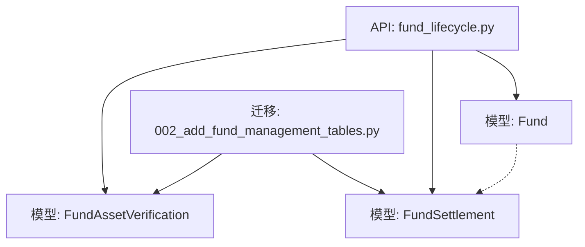
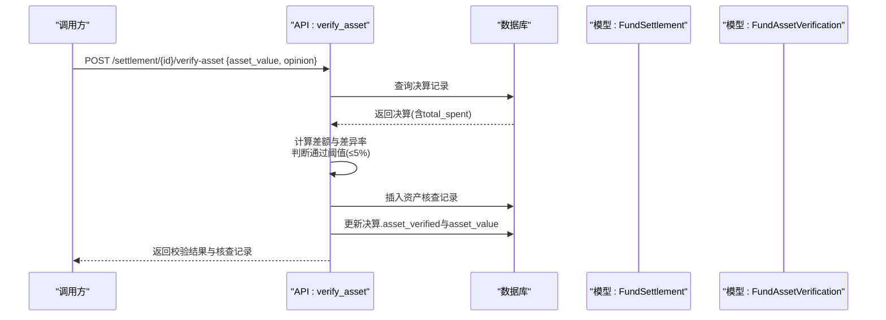
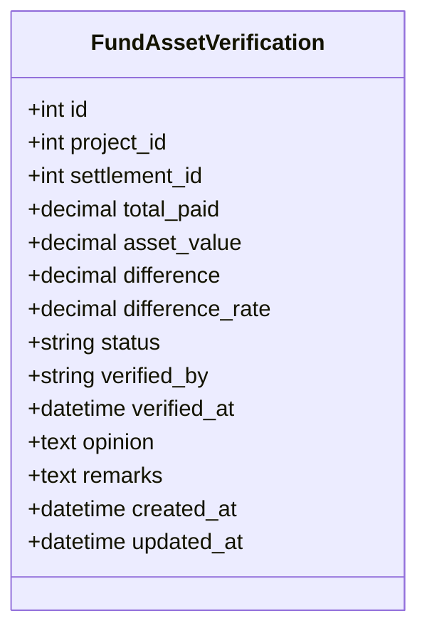
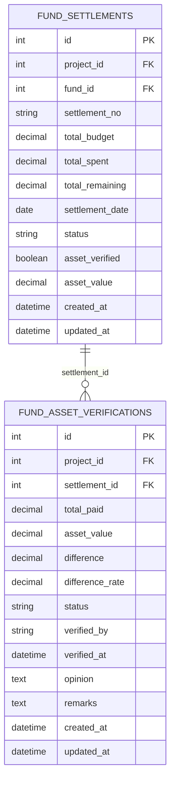
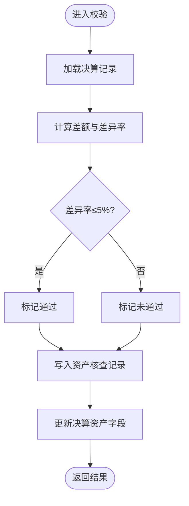
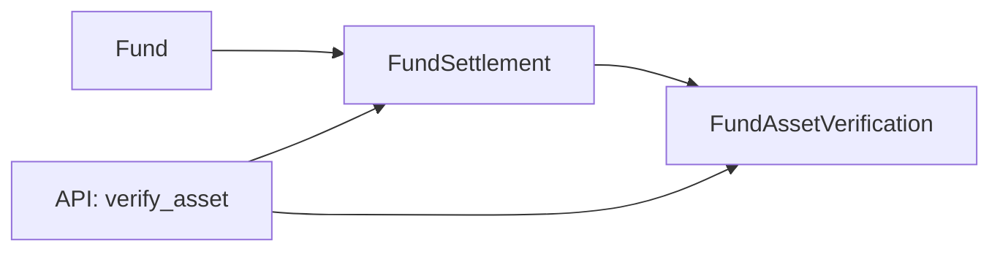

# 资产核查与决算表结构

<cite>
**本文引用的文件**
- [backend/app/models/fund_asset_verification.py](file://backend/app/models/fund_asset_verification.py)
- [backend/alembic/versions/002_add_fund_management_tables.py](file://backend/alembic/versions/002_add_fund_management_tables.py)
- [backend/app/api/v1/fund_lifecycle.py](file://backend/app/api/v1/fund_lifecycle.py)
- [backend/app/models/fund_lifecycle.py](file://backend/app/models/fund_lifecycle.py)
- [backend/app/models/fund.py](file://backend/app/models/fund.py)
</cite>

## 目录
1. [简介](#简介)
2. [项目结构](#项目结构)
3. [核心组件](#核心组件)
4. [架构总览](#架构总览)
5. [详细组件分析](#详细组件分析)
6. [依赖关系分析](#依赖关系分析)
7. [性能考虑](#性能考虑)
8. [故障排查指南](#故障排查指南)
9. [结论](#结论)
10. [附录](#附录)

## 简介
本文件围绕“资产核查与决算表结构”进行系统化说明，重点阐述 fund_asset_verifications（资产联动校验）表的设计与使用方式，并基于现有代码梳理资产全生命周期管理在系统中的落地路径：登记入库→日常维护→定期盘点→报废处置。同时解释资产与经费的关联关系及价值对应，明确当前系统已实现的资产校验流程、差异率判定与决算联动更新；并对尚未实现但业务上常见的折旧计算、减值准备、处置收益处理给出扩展建议。最后提供资产清查报告生成与监管报送能力的规划建议。

## 项目结构
与资产核查与决算相关的后端代码主要分布在以下位置：
- 数据模型层：资产核查记录、决算表、经费主表等
- 迁移脚本：数据库表结构与索引创建
- API层：资产联动校验接口、决算相关接口
- 服务层：资金流向树、绩效报告等（与本主题间接相关）

图表来源
- [backend/app/api/v1/fund_lifecycle.py:1930-1982](file://backend/app/api/v1/fund_lifecycle.py#L1930-L1982)
- [backend/app/models/fund_asset_verification.py:22-56](file://backend/app/models/fund_asset_verification.py#L22-L56)
- [backend/app/models/fund_lifecycle.py:364-408](file://backend/app/models/fund_lifecycle.py#L364-L408)
- [backend/alembic/versions/002_add_fund_management_tables.py:146-167](file://backend/alembic/versions/002_add_fund_management_tables.py#L146-L167)

章节来源
- [backend/app/models/fund_asset_verification.py:22-56](file://backend/app/models/fund_asset_verification.py#L22-L56)
- [backend/app/models/fund_lifecycle.py:364-408](file://backend/app/models/fund_lifecycle.py#L364-L408)
- [backend/app/api/v1/fund_lifecycle.py:1930-1982](file://backend/app/api/v1/fund_lifecycle.py#L1930-L1982)
- [backend/alembic/versions/002_add_fund_management_tables.py:146-167](file://backend/alembic/versions/002_add_fund_management_tables.py#L146-L167)

## 核心组件
- 资产联动校验记录（fund_asset_verifications）
  - 作用：记录项目已付款总额与转固资产价值的比对结果，作为项目销号的前置校验条件之一
  - 关键字段：项目ID、关联决算ID、已付款总额、转固资产价值、差额、差异率、校验状态、校验人、校验时间、意见、备注
  - 索引：按项目ID、决算ID、状态建立索引以优化查询
- 决算表（fund_settlements）
  - 作用：汇总项目预算、支出、结余，并承载资产联动校验标记与转固资产价值
  - 关键字段：项目ID、经费ID、决算编号、总预算、总支出、总结余、决算日期、状态、审核信息、资产是否已校验、转固资产价值
- 经费主表（funds）
  - 作用：承载经费申请、批准、拨付、使用等全量数据，为决算与资产价值对比提供基础数据源
  - 关键字段：金额类字段、状态、生命周期阶段、决算状态等

章节来源
- [backend/app/models/fund_asset_verification.py:22-56](file://backend/app/models/fund_asset_verification.py#L22-L56)
- [backend/app/models/fund_lifecycle.py:364-408](file://backend/app/models/fund_lifecycle.py#L364-L408)
- [backend/app/models/fund.py:61-169](file://backend/app/models/fund.py#L61-L169)

## 架构总览
资产核查与决算的核心交互由API触发，读取决算数据，计算差异率，写入资产核查记录，并回写决算表的资产校验标记与资产价值。

图表来源
- [backend/app/api/v1/fund_lifecycle.py:1930-1982](file://backend/app/api/v1/fund_lifecycle.py#L1930-L1982)
- [backend/app/models/fund_lifecycle.py:364-408](file://backend/app/models/fund_lifecycle.py#L364-L408)
- [backend/app/models/fund_asset_verification.py:22-56](file://backend/app/models/fund_asset_verification.py#L22-L56)

## 详细组件分析

### 资产核查表（fund_asset_verifications）设计
- 设计目标
  - 将“已付款总额”与“转固资产价值”进行比对，形成可审计的核查记录
  - 支持按项目、决算、状态快速检索
- 字段语义
  - 项目ID：关联到具体项目，便于按项目维度统计与追踪
  - 决算ID：关联到决算记录，支撑决算闭环
  - 已付款总额/转固资产价值/差额/差异率：用于量化比对结果
  - 校验状态：pending/passed/failed/waived，体现不同处理分支
  - 校验人/校验时间/意见/备注：审计留痕
- 索引策略
  - 针对project_id、settlement_id、status建立索引，提升常见过滤与聚合效率

图表来源
- [backend/app/models/fund_asset_verification.py:22-56](file://backend/app/models/fund_asset_verification.py#L22-L56)

章节来源
- [backend/app/models/fund_asset_verification.py:22-56](file://backend/app/models/fund_asset_verification.py#L22-L56)
- [backend/alembic/versions/002_add_fund_management_tables.py:146-167](file://backend/alembic/versions/002_add_fund_management_tables.py#L146-L167)

### 决算表（fund_settlements）与资产联动
- 决算表承载资产联动字段
  - asset_verified：布尔标记，表示是否已完成资产校验
  - asset_value：转固资产价值（万元），与核查记录保持一致
- 与资产核查记录的关联
  - 通过settlement_id建立外键关系，确保数据一致性
  - 删除决算时允许核查记录保留（SET NULL），便于历史追溯

图表来源
- [backend/app/models/fund_lifecycle.py:364-408](file://backend/app/models/fund_lifecycle.py#L364-L408)
- [backend/app/models/fund_asset_verification.py:22-56](file://backend/app/models/fund_asset_verification.py#L22-L56)

章节来源
- [backend/app/models/fund_lifecycle.py:364-408](file://backend/app/models/fund_lifecycle.py#L364-L408)
- [backend/app/models/fund_asset_verification.py:22-56](file://backend/app/models/fund_asset_verification.py#L22-L56)

### 资产联动校验API流程
- 输入参数
  - settlement_id：决算ID
  - asset_value：转固资产价值（万元）
  - opinion：校验意见（可选）
- 处理逻辑
  - 读取决算记录的total_spent
  - 计算差额与差异率（差异率=差额/已付款总额×100%）
  - 差异率≤5%视为通过，否则失败
  - 写入资产核查记录，并更新决算的asset_verified与asset_value
- 输出结果
  - 返回校验消息与核查记录详情

图表来源
- [backend/app/api/v1/fund_lifecycle.py:1930-1982](file://backend/app/api/v1/fund_lifecycle.py#L1930-L1982)

章节来源
- [backend/app/api/v1/fund_lifecycle.py:1930-1982](file://backend/app/api/v1/fund_lifecycle.py#L1930-L1982)

### 资产与经费的关联关系与价值对应
- 关联路径
  - 经费（funds）→ 决算（fund_settlements）：通过fund_id关联
  - 决算（fund_settlements）→ 资产核查（fund_asset_verifications）：通过settlement_id关联
- 价值对应
  - 决算.total_spent 与 资产核查.asset_value 进行比对
  - 差异率阈值控制（≤5%通过），保障账实相符
- 数据一致性
  - 资产核查通过后，决算记录同步asset_verified与asset_value，形成闭环

章节来源
- [backend/app/models/fund.py:61-169](file://backend/app/models/fund.py#L61-L169)
- [backend/app/models/fund_lifecycle.py:364-408](file://backend/app/models/fund_lifecycle.py#L364-L408)
- [backend/app/models/fund_asset_verification.py:22-56](file://backend/app/models/fund_asset_verification.py#L22-L56)

### 资产全生命周期管理（系统现状与建议）
- 登记入库
  - 现状：系统通过经费与决算记录体现项目投入与支出，资产价值在决算中体现
  - 建议：引入资产台账（名称、类别、价值、位置等）并与决算资产价值对齐
- 日常维护
  - 现状：经费使用记录与交易明细可用于追踪资产形成过程
  - 建议：增加资产维护日志（维修、保养、变更）
- 定期盘点
  - 现状：资产核查表支持差异率校验，可作为盘点依据
  - 建议：周期性盘点任务，自动生成盘点报告与问题清单
- 报废处置
  - 现状：未发现专门的资产报废处置表或流程
  - 建议：新增资产处置表（处置方式、残值、收益、审批流），与决算结余联动

[本节为概念性说明，不直接分析具体文件]

### 折旧计算、减值准备、处置收益处理（扩展建议）
- 折旧计算
  - 建议：在资产台账中增加原值、累计折旧、净值、折旧方法、使用年限等字段，按规则自动计提
- 减值准备
  - 建议：当资产可收回金额低于账面价值时，计提减值准备，影响净值与决算报表
- 处置收益处理
  - 建议：处置收益计入决算结余或专项收入，并在决算表中体现

[本节为概念性说明，不直接分析具体文件]

### 资产清查报告生成与监管报送（扩展建议）
- 清查报告
  - 建议：基于资产台账与核查记录，生成清查报告（含差异项、整改项、责任人、时限）
- 监管报送
  - 建议：提供标准化导出接口（如Excel/JSON），对接上级监管平台

[本节为概念性说明，不直接分析具体文件]

## 依赖关系分析
- 模型间依赖
  - FundAssetVerification 依赖 FundSettlement（settlement_id）
  - FundSettlement 依赖 Fund（fund_id）与 Project（project_id）
- API依赖
  - verify_asset 依赖 FundSettlement 与 FundAssetVerification 模型
- 迁移依赖
  - 迁移脚本创建 fund_asset_verifications 表及索引

图表来源
- [backend/app/models/fund.py:61-169](file://backend/app/models/fund.py#L61-L169)
- [backend/app/models/fund_lifecycle.py:364-408](file://backend/app/models/fund_lifecycle.py#L364-L408)
- [backend/app/models/fund_asset_verification.py:22-56](file://backend/app/models/fund_asset_verification.py#L22-L56)
- [backend/app/api/v1/fund_lifecycle.py:1930-1982](file://backend/app/api/v1/fund_lifecycle.py#L1930-L1982)

章节来源
- [backend/app/models/fund.py:61-169](file://backend/app/models/fund.py#L61-L169)
- [backend/app/models/fund_lifecycle.py:364-408](file://backend/app/models/fund_lifecycle.py#L364-L408)
- [backend/app/models/fund_asset_verification.py:22-56](file://backend/app/models/fund_asset_verification.py#L22-L56)
- [backend/app/api/v1/fund_lifecycle.py:1930-1982](file://backend/app/api/v1/fund_lifecycle.py#L1930-L1982)

## 性能考虑
- 索引优化
  - 对 fund_asset_verifications 的 project_id、settlement_id、status 建立索引，提升过滤与聚合效率
- 查询优化
  - 在资金流向树等复杂查询中使用预加载避免N+1问题（参考API中的批量预加载实践）
- 事务与一致性
  - 资产核查与决算更新在同一事务中提交，保证数据一致性

章节来源
- [backend/alembic/versions/002_add_fund_management_tables.py:146-167](file://backend/alembic/versions/002_add_fund_management_tables.py#L146-L167)
- [backend/app/api/v1/fund_lifecycle.py:2023-2127](file://backend/app/api/v1/fund_lifecycle.py#L2023-L2127)

## 故障排查指南
- 常见问题
  - 决算记录不存在：检查settlement_id是否正确
  - 差异率超限：核对已付款总额与转固资产价值，确认是否符合阈值
  - 权限不足：需具备相应角色权限才能执行资产校验
- 定位步骤
  - 查看API返回的错误信息
  - 检查数据库中决算与核查记录的状态与数值
  - 核对迁移脚本是否成功执行，索引是否存在

章节来源
- [backend/app/api/v1/fund_lifecycle.py:1930-1982](file://backend/app/api/v1/fund_lifecycle.py#L1930-L1982)
- [backend/alembic/versions/002_add_fund_management_tables.py:146-167](file://backend/alembic/versions/002_add_fund_management_tables.py#L146-L167)

## 结论
- 系统已通过 fund_asset_verifications 表与 API 实现了资产与经费的价值比对与决算联动，满足“账实相符”的基础要求
- 资产全生命周期的登记、维护、盘点、处置可在现有基础上扩展完善，形成更完整的资产管理闭环
- 建议在后续迭代中补充资产台账、折旧与减值、处置收益以及报告与报送能力，以提升合规性与可审计性

## 附录
- 关键接口
  - 资产联动校验：POST /api/v1/fund-lifecycle/settlement/{settlement_id}/verify-asset
- 关键数据表
  - fund_asset_verifications：资产核查记录
  - fund_settlements：决算表
  - funds：经费主表

章节来源
- [backend/app/api/v1/fund_lifecycle.py:1930-1982](file://backend/app/api/v1/fund_lifecycle.py#L1930-L1982)
- [backend/app/models/fund_asset_verification.py:22-56](file://backend/app/models/fund_asset_verification.py#L22-L56)
- [backend/app/models/fund_lifecycle.py:364-408](file://backend/app/models/fund_lifecycle.py#L364-L408)
- [backend/app/models/fund.py:61-169](file://backend/app/models/fund.py#L61-L169)