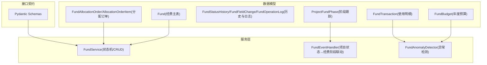
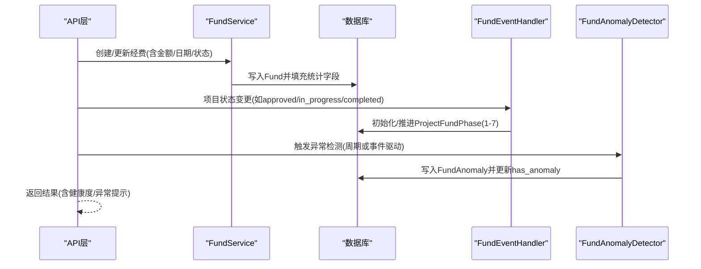
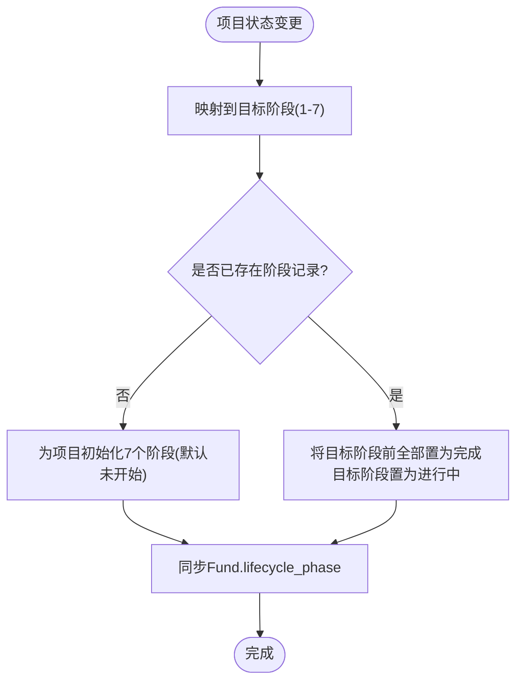
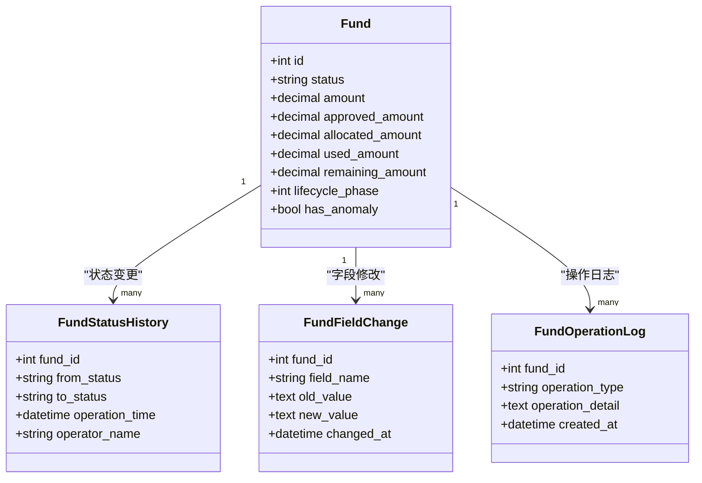
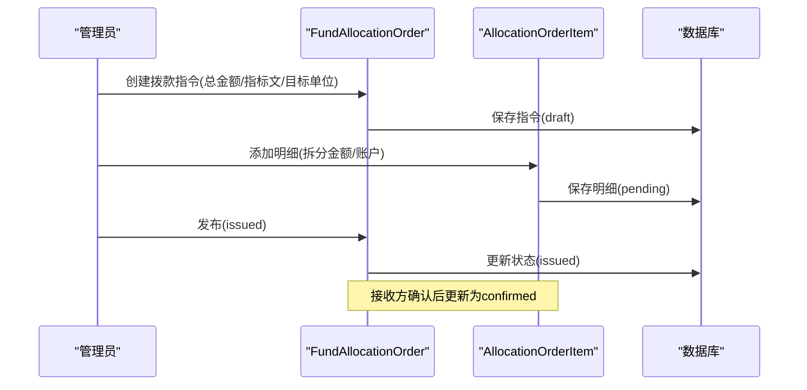
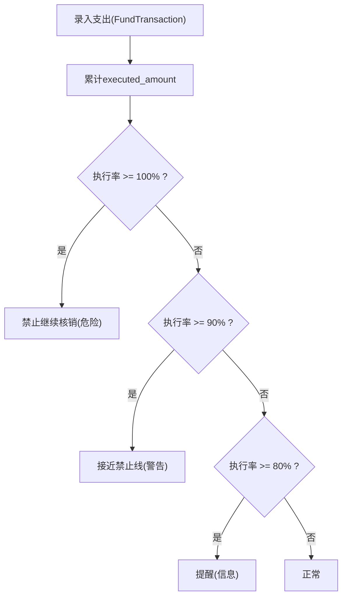
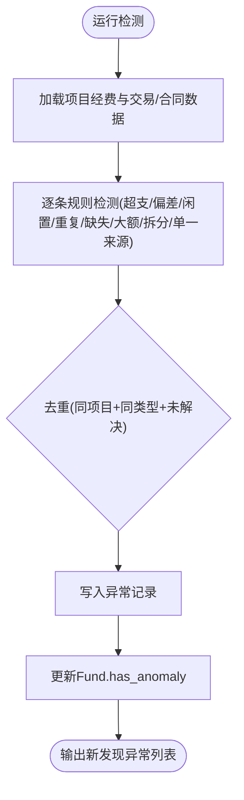
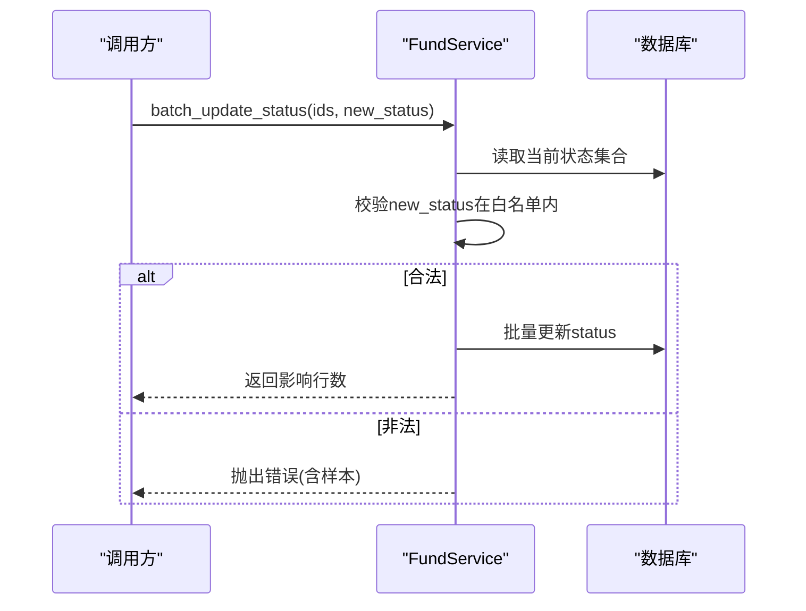
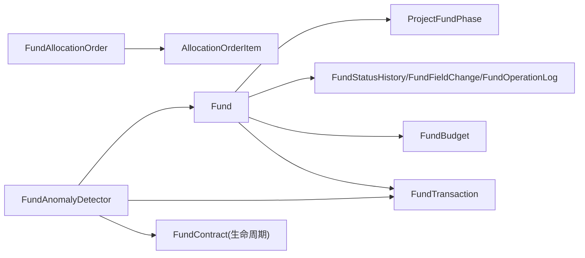

# 资金流转表结构

<cite>
**本文引用的文件**
- [backend/app/models/fund.py](file://backend/app/models/fund.py)
- [backend/app/models/fund_lifecycle.py](file://backend/app/models/fund_lifecycle.py)
- [backend/app/models/fund_history.py](file://backend/app/models/fund_history.py)
- [backend/app/models/fund_allocation_order.py](file://backend/app/models/fund_allocation_order.py)
- [backend/app/models/fund_budget.py](file://backend/app/models/fund_budget.py)
- [backend/app/services/fund_service.py](file://backend/app/services/fund_service.py)
- [backend/app/services/fund_event_handler.py](file://backend/app/services/fund_event_handler.py)
- [backend/app/services/fund_anomaly_detector.py](file://backend/app/services/fund_anomaly_detector.py)
- [backend/app/schemas/fund.py](file://backend/app/schemas/fund.py)
</cite>

## 目录
1. [简介](#简介)
2. [项目结构](#项目结构)
3. [核心组件](#核心组件)
4. [架构总览](#架构总览)
5. [详细组件分析](#详细组件分析)
6. [依赖关系分析](#依赖关系分析)
7. [性能考量](#性能考量)
8. [故障排查指南](#故障排查指南)
9. [结论](#结论)
10. [附录](#附录)

## 简介
本文件围绕“资金流转”主题，系统化梳理并说明以下核心数据模型与业务流程：
- fund_lifecycle（资金生命周期）：以七阶段机制贯穿经费从立项到结项的全流程。
- fund_history（资金历史）：记录状态变更、字段修改与操作日志，形成可审计的追溯链。
- fund_allocation_order（资金分配订单）：管理指标文解析、拨款指令下发与明细拆分，支撑多级单位资金调度。
- 配套预算与交易台账：fund_budget（年度预算）、fund_transactions（使用明细），以及异常检测引擎，保障合规与风控。

该设计支持资金流向追踪、异常检测、合规性检查，并提供完整的审计追溯链与监管报表所需的数据基础。

## 项目结构
资金流转相关代码主要分布在后端 models、services、schemas 三层：
- 数据模型层：定义经费主表、生命周期、历史、分配订单、预算与交易等实体及索引。
- 服务层：封装状态机、事件联动、异常检测、预算预警等业务逻辑。
- 接口契约层：Pydantic Schema 用于输入校验与响应结构。

图表来源
- [backend/app/models/fund.py:61-169](file://backend/app/models/fund.py#L61-L169)
- [backend/app/models/fund_lifecycle.py:119-153](file://backend/app/models/fund_lifecycle.py#L119-L153)
- [backend/app/models/fund_history.py:18-159](file://backend/app/models/fund_history.py#L18-L159)
- [backend/app/models/fund_allocation_order.py:23-113](file://backend/app/models/fund_allocation_order.py#L23-L113)
- [backend/app/models/fund_budget.py:19-141](file://backend/app/models/fund_budget.py#L19-L141)
- [backend/app/services/fund_service.py:29-288](file://backend/app/services/fund_service.py#L29-L288)
- [backend/app/services/fund_event_handler.py:17-97](file://backend/app/services/fund_event_handler.py#L17-L97)
- [backend/app/services/fund_anomaly_detector.py:1-333](file://backend/app/services/fund_anomaly_detector.py#L1-L333)
- [backend/app/schemas/fund.py:41-148](file://backend/app/schemas/fund.py#L41-L148)

章节来源
- [backend/app/models/fund.py:61-169](file://backend/app/models/fund.py#L61-L169)
- [backend/app/models/fund_lifecycle.py:21-115](file://backend/app/models/fund_lifecycle.py#L21-L115)
- [backend/app/models/fund_history.py:18-159](file://backend/app/models/fund_history.py#L18-L159)
- [backend/app/models/fund_allocation_order.py:23-113](file://backend/app/models/fund_allocation_order.py#L23-L113)
- [backend/app/models/fund_budget.py:19-141](file://backend/app/models/fund_budget.py#L19-L141)
- [backend/app/services/fund_service.py:29-288](file://backend/app/services/fund_service.py#L29-L288)
- [backend/app/services/fund_event_handler.py:17-97](file://backend/app/services/fund_event_handler.py#L17-L97)
- [backend/app/services/fund_anomaly_detector.py:1-333](file://backend/app/services/fund_anomaly_detector.py#L1-L333)
- [backend/app/schemas/fund.py:41-148](file://backend/app/schemas/fund.py#L41-L148)

## 核心组件
- 经费主表 Fund：承载申请、计划、批准、拨付、使用、结余等核心金额与时间戳；内置统计冗余字段（year/year_month/year_quarter）与生命周期阶段标记，配合复合索引提升聚合查询性能。
- 生命周期 ProjectFundPhase：按七阶段跟踪每个项目的进度与状态，支持进入/完成时间与操作人记录。
- 历史与审计 FundStatusHistory/FundFieldChange/FundOperationLog：记录状态变更、字段级修改与附件等操作日志，提供完整审计线索。
- 分配订单 FundAllocationOrder/AllocationOrderItem：将指标文拆分为下级单位的虚拟账户分配，支持状态跟踪与划转确认。
- 预算与交易 FundBudget/FundTransaction：年度预算科目与执行明细，提供执行率与剩余金额计算，并内置预算预警阈值。
- 异常检测 FundAnomalyDetector：覆盖超支、偏差、闲置、重复支付、缺失凭证、大额提现、合同拆分、单一来源等规则，生成异常记录并更新健康度标志。

章节来源
- [backend/app/models/fund.py:61-169](file://backend/app/models/fund.py#L61-L169)
- [backend/app/models/fund_lifecycle.py:119-153](file://backend/app/models/fund_lifecycle.py#L119-L153)
- [backend/app/models/fund_history.py:18-159](file://backend/app/models/fund_history.py#L18-L159)
- [backend/app/models/fund_allocation_order.py:23-113](file://backend/app/models/fund_allocation_order.py#L23-L113)
- [backend/app/models/fund_budget.py:19-141](file://backend/app/models/fund_budget.py#L19-L141)
- [backend/app/services/fund_anomaly_detector.py:1-333](file://backend/app/services/fund_anomaly_detector.py#L1-L333)

## 架构总览
资金流转通过“模型—服务—事件—检测”闭环实现：
- 业务入口通过 FundService 进行 CRUD 与状态机校验。
- 项目状态变更触发 FundEventHandler，推进经费生命周期阶段。
- 预算与交易数据驱动 FundAnomalyDetector 进行合规与风控检测。
- 分配订单贯穿指标文解析与多级单位资金调度。

图表来源
- [backend/app/services/fund_service.py:114-185](file://backend/app/services/fund_service.py#L114-L185)
- [backend/app/services/fund_event_handler.py:27-65](file://backend/app/services/fund_event_handler.py#L27-L65)
- [backend/app/services/fund_anomaly_detector.py:34-93](file://backend/app/services/fund_anomaly_detector.py#L34-L93)
- [backend/app/models/fund.py:199-226](file://backend/app/models/fund.py#L199-L226)

## 详细组件分析

### 资金生命周期（七阶段）
七阶段定义与标签：
- 1 论证立项
- 2 汇总审核
- 3 计划下达与资金拨付
- 4 对接与资金划转
- 5 组织实施与过程监管
- 6 核查督查与效益评估
- 7 常态监管与项目决算

阶段跟踪由 ProjectFundPhase 维护，包含阶段编号、状态、进入/完成时间与操作人。项目状态变更时，FundEventHandler 自动推进对应阶段，并同步 Fund.lifecycle_phase。

图表来源
- [backend/app/models/fund_lifecycle.py:24-44](file://backend/app/models/fund_lifecycle.py#L24-L44)
- [backend/app/models/fund_lifecycle.py:119-153](file://backend/app/models/fund_lifecycle.py#L119-L153)
- [backend/app/services/fund_event_handler.py:17-65](file://backend/app/services/fund_event_handler.py#L17-L65)

章节来源
- [backend/app/models/fund_lifecycle.py:24-44](file://backend/app/models/fund_lifecycle.py#L24-L44)
- [backend/app/models/fund_lifecycle.py:119-153](file://backend/app/models/fund_lifecycle.py#L119-L153)
- [backend/app/services/fund_event_handler.py:17-65](file://backend/app/services/fund_event_handler.py#L17-L65)

### 资金历史与审计追溯
- FundStatusHistory：记录状态变更的前后状态、操作人与时间，便于审计回溯。
- FundFieldChange：记录字段级变更的旧值与新值（JSON序列化），支持细粒度审计。
- FundOperationLog：记录附件上传/删除等操作类型与详情，辅助问题定位。

图表来源
- [backend/app/models/fund.py:61-169](file://backend/app/models/fund.py#L61-L169)
- [backend/app/models/fund_history.py:18-159](file://backend/app/models/fund_history.py#L18-L159)

章节来源
- [backend/app/models/fund_history.py:18-159](file://backend/app/models/fund_history.py#L18-L159)

### 资金分配订单（指标文解析与调度）
- FundAllocationOrder：代表一条拨款指令，包含指标文编号、总金额、目标单位/账户、生效/失效日期与状态。
- AllocationOrderItem：将总额拆分至多个接收单位，记录分配金额、账户、划转与确认时间。

图表来源
- [backend/app/models/fund_allocation_order.py:23-113](file://backend/app/models/fund_allocation_order.py#L23-L113)

章节来源
- [backend/app/models/fund_allocation_order.py:23-113](file://backend/app/models/fund_allocation_order.py#L23-L113)

### 预算与使用明细（含预警）
- FundBudget：年度预算科目与执行额，提供剩余金额与执行率属性。
- FundTransaction：支出明细台账，关联预算与项目/村/学校，支持凭证号与审批流。
- 预算预警阈值：80%提醒、90%警告、100%禁止线，用于控制继续核销。

图表来源
- [backend/app/models/fund_budget.py:19-141](file://backend/app/models/fund_budget.py#L19-L141)
- [backend/app/models/fund_budget.py:143-202](file://backend/app/models/fund_budget.py#L143-L202)

章节来源
- [backend/app/models/fund_budget.py:19-141](file://backend/app/models/fund_budget.py#L19-L141)
- [backend/app/models/fund_budget.py:143-202](file://backend/app/models/fund_budget.py#L143-L202)

### 异常检测引擎（合规与风控）
覆盖规则：
- 超支：used ≥ approved × 阈值
- 偏差：|实际进度 - 计划进度| > 阈值
- 闲置：allocated 后超过固定天数未使用
- 重复支付：同一凭证号或多笔相近金额+日期
- 缺失凭证：used > 0 但无支出明细
- 大额提现：单笔支出超过阈值
- 合同拆分：短期内多笔小额合同指向同一乙方
- 单一来源：所有合同均指向同一供应商

检测结果写入 FundAnomaly，并更新 Fund.has_anomaly。

图表来源
- [backend/app/services/fund_anomaly_detector.py:34-93](file://backend/app/services/fund_anomaly_detector.py#L34-L93)
- [backend/app/services/fund_anomaly_detector.py:99-315](file://backend/app/services/fund_anomaly_detector.py#L99-L315)

章节来源
- [backend/app/services/fund_anomaly_detector.py:34-93](file://backend/app/services/fund_anomaly_detector.py#L34-L93)
- [backend/app/services/fund_anomaly_detector.py:99-315](file://backend/app/services/fund_anomaly_detector.py#L99-L315)

### 经费状态机与服务层
- FundService 提供 CRUD、批量状态更新，内置合法流转白名单，确保状态机约束。
- 自动编号生成：ZJ+年份+6位流水，保证唯一性。
- 预加载优化：列表与详情查询使用 joinedload/selectinload 避免 N+1。

图表来源
- [backend/app/services/fund_service.py:230-288](file://backend/app/services/fund_service.py#L230-L288)

章节来源
- [backend/app/services/fund_service.py:230-288](file://backend/app/services/fund_service.py#L230-L288)

## 依赖关系分析
- Fund 与生命周期：Fund.lifecycle_phase 与 ProjectFundPhase 双向联动，项目状态变更驱动阶段推进。
- Fund 与历史：FundStatusHistory/FundFieldChange/FundOperationLog 通过外键关联 Fund，形成审计链。
- Fund 与预算/交易：FundTransaction 关联 Fund/Budget，驱动执行率与预警。
- 分配订单：FundAllocationOrder 与 AllocationOrderItem 构成一对多关系，支撑多级单位资金调度。
- 异常检测：依赖 Fund、FundTransaction、FundContract（生命周期模块）进行跨表规则检测。

图表来源
- [backend/app/models/fund.py:61-169](file://backend/app/models/fund.py#L61-L169)
- [backend/app/models/fund_lifecycle.py:119-153](file://backend/app/models/fund_lifecycle.py#L119-L153)
- [backend/app/models/fund_history.py:18-159](file://backend/app/models/fund_history.py#L18-L159)
- [backend/app/models/fund_budget.py:19-141](file://backend/app/models/fund_budget.py#L19-L141)
- [backend/app/models/fund_allocation_order.py:23-113](file://backend/app/models/fund_allocation_order.py#L23-L113)
- [backend/app/services/fund_anomaly_detector.py:1-333](file://backend/app/services/fund_anomaly_detector.py#L1-L333)

章节来源
- [backend/app/models/fund.py:61-169](file://backend/app/models/fund.py#L61-L169)
- [backend/app/models/fund_lifecycle.py:119-153](file://backend/app/models/fund_lifecycle.py#L119-L153)
- [backend/app/models/fund_history.py:18-159](file://backend/app/models/fund_history.py#L18-L159)
- [backend/app/models/fund_budget.py:19-141](file://backend/app/models/fund_budget.py#L19-L141)
- [backend/app/models/fund_allocation_order.py:23-113](file://backend/app/models/fund_allocation_order.py#L23-L113)
- [backend/app/services/fund_anomaly_detector.py:1-333](file://backend/app/services/fund_anomaly_detector.py#L1-L333)

## 性能考量
- 统计冗余字段：Fund.year/year_month/year_quarter 在插入/更新前自动填充，配合复合索引直接命中 GROUP BY，避免全表扫描。
- 预加载策略：列表与详情查询使用 joinedload/selectinload 减少 N+1 查询。
- 批量更新：状态机批量更新采用 bulk update，降低循环开销。
- 预算预警：基于内存计算执行率，阈值判断快速返回告警级别。

章节来源
- [backend/app/models/fund.py:156-226](file://backend/app/models/fund.py#L156-L226)
- [backend/app/services/fund_service.py:40-112](file://backend/app/services/fund_service.py#L40-L112)
- [backend/app/services/fund_service.py:245-288](file://backend/app/services/fund_service.py#L245-L288)
- [backend/app/models/fund_budget.py:63-73](file://backend/app/models/fund_budget.py#L63-L73)

## 故障排查指南
- 状态流转失败：检查 FundService 的状态机白名单，确认当前状态到目标状态的合法性。
- 预算超限无法核销：核对 FundBudget 执行率是否达到禁止线（100%），必要时调整预算或暂停新增支出。
- 异常频繁触发：查看 FundAnomaly 记录，定位具体规则（超支/闲置/重复支付等），修正业务数据或调整阈值。
- 分配订单未到账：检查 AllocationOrderItem 状态是否为 confirmed，确认接收方账户与划转时间。
- 审计追溯困难：通过 FundStatusHistory/FundFieldChange/FundOperationLog 按 fund_id 检索变更记录与操作日志。

章节来源
- [backend/app/services/fund_service.py:230-288](file://backend/app/services/fund_service.py#L230-L288)
- [backend/app/models/fund_budget.py:143-202](file://backend/app/models/fund_budget.py#L143-L202)
- [backend/app/services/fund_anomaly_detector.py:34-93](file://backend/app/services/fund_anomaly_detector.py#L34-L93)
- [backend/app/models/fund_history.py:18-159](file://backend/app/models/fund_history.py#L18-L159)

## 结论
本方案以 Fund 为核心，结合生命周期、历史审计、分配订单、预算与交易台账以及异常检测引擎，构建了完整的资金流转体系。七阶段机制确保流程可控，历史与审计提供可追溯性，异常检测保障合规与风控，分配订单支撑多级资金调度。整体设计兼顾性能与可扩展性，为监管报表与决策分析提供了坚实的数据基础。

## 附录
- 关键枚举与标签：
  - 生命周期阶段：1-7（论证立项→汇总审核→计划下达与资金拨付→对接与资金划转→组织实施与过程监管→核查督查与效益评估→常态监管与项目决算）
  - 经费状态：pending/planned/approved/rejected/allocated/in_use/completed/audited
  - 预算预警阈值：80%/90%/100%
- 常用查询维度：
  - 按项目/村/组织/状态/年月/季度聚合统计
  - 按凭证号/用途/经办人/审批人检索明细
  - 按异常类型/严重程度筛选风险项