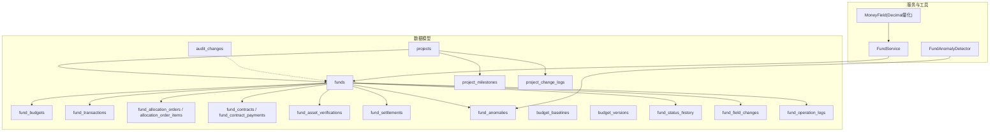
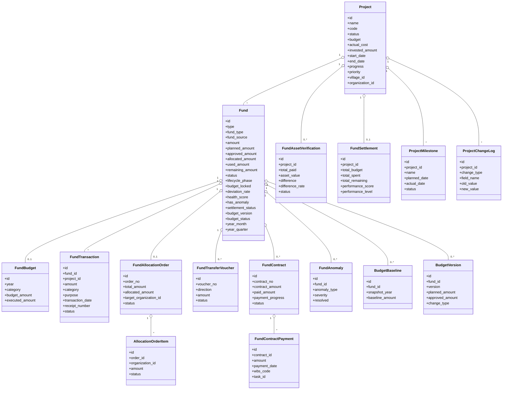
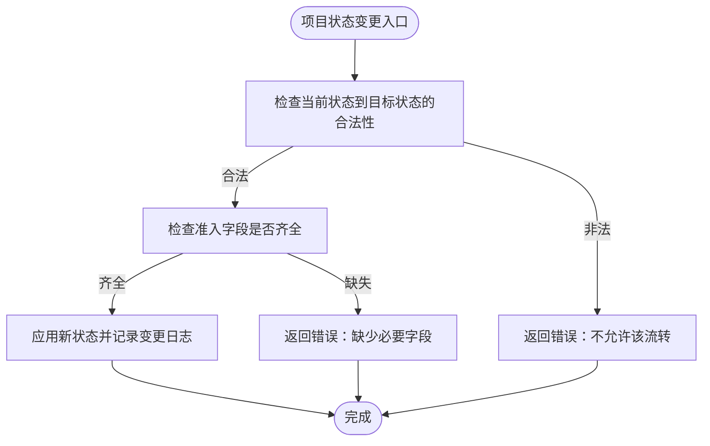
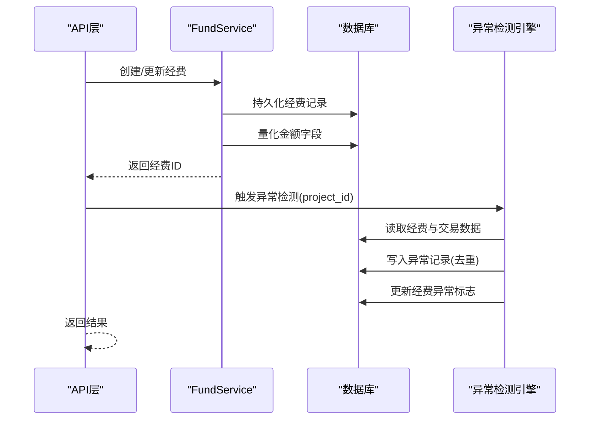
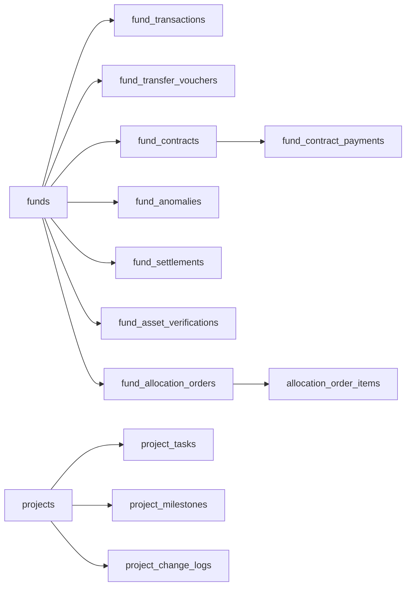

# 项目与资金域表结构

<cite>
**本文引用的文件**
- [backend/app/models/project.py](file://backend/app/models/project.py)
- [backend/app/models/fund.py](file://backend/app/models/fund.py)
- [backend/app/models/fund_budget.py](file://backend/app/models/fund_budget.py)
- [backend/app/models/fund_allocation_order.py](file://backend/app/models/fund_allocation_order.py)
- [backend/app/models/fund_asset_verification.py](file://backend/app/models/fund_asset_verification.py)
- [backend/app/models/fund_lifecycle.py](file://backend/app/models/fund_lifecycle.py)
- [backend/app/models/project_milestone.py](file://backend/app/models/project_milestone.py)
- [backend/app/models/audit_change.py](file://backend/app/models/audit_change.py)
- [backend/app/models/fund_history.py](file://backend/app/models/fund_history.py)
- [backend/app/core/money.py](file://backend/app/core/money.py)
- [backend/app/services/fund_service.py](file://backend/app/services/fund_service.py)
- [backend/app/services/fund_anomaly_detector.py](file://backend/app/services/fund_anomaly_detector.py)
</cite>

## 目录
1. [引言](#引言)
2. [项目结构](#项目结构)
3. [核心组件](#核心组件)
4. [架构总览](#架构总览)
5. [详细组件分析](#详细组件分析)
6. [依赖关系分析](#依赖关系分析)
7. [性能考量](#性能考量)
8. [故障排查指南](#故障排查指南)
9. [结论](#结论)
10. [附录](#附录)

## 引言
本文件围绕“项目与资金域”的数据库表结构进行系统化说明，覆盖24张与项目、资金相关的核心表。重点阐述：
- 项目主表 projects 与经费主表 funds 的完整结构与索引设计
- 经费全生命周期（七阶段）及配套的19张业务表：预算编制、资金流转、合同管理、资产核查、决算审计、异常监控等
- 状态机实现、金额精度控制、项目任务与里程碑、变更日志
- 资金流向追踪与审计追溯机制

## 项目结构
本项目采用分层模型组织：
- 数据模型层：SQLAlchemy 模型定义于 backend/app/models/*
- 服务层：业务编排与事务控制位于 backend/app/services/*
- 核心工具：金额精度、事务封装等位于 backend/app/core/*

图表来源
- [backend/app/models/project.py:47-175](file://backend/app/models/project.py#L47-L175)
- [backend/app/models/fund.py:61-167](file://backend/app/models/fund.py#L61-L167)
- [backend/app/models/fund_budget.py:19-141](file://backend/app/models/fund_budget.py#L19-L141)
- [backend/app/models/fund_allocation_order.py:23-113](file://backend/app/models/fund_allocation_order.py#L23-L113)
- [backend/app/models/fund_asset_verification.py:22-60](file://backend/app/models/fund_asset_verification.py#L22-L60)
- [backend/app/models/fund_lifecycle.py:119-449](file://backend/app/models/fund_lifecycle.py#L119-L449)
- [backend/app/models/project_milestone.py:12-105](file://backend/app/models/project_milestone.py#L12-L105)
- [backend/app/models/audit_change.py:13-33](file://backend/app/models/audit_change.py#L13-L33)
- [backend/app/models/fund_history.py:18-159](file://backend/app/models/fund_history.py#L18-L159)
- [backend/app/core/money.py:1-32](file://backend/app/core/money.py#L1-L32)
- [backend/app/services/fund_service.py:29-200](file://backend/app/services/fund_service.py#L29-L200)
- [backend/app/services/fund_anomaly_detector.py:1-200](file://backend/app/services/fund_anomaly_detector.py#L1-L200)

章节来源
- [backend/app/models/project.py:47-175](file://backend/app/models/project.py#L47-L175)
- [backend/app/models/fund.py:61-167](file://backend/app/models/fund.py#L61-L167)

## 核心组件
- 项目主表 projects：承载项目基本信息、时间进度、资金账户信息、扩展指标与软删除标记，提供多维度索引优化查询。
- 经费主表 funds：承载经费申请、审批、拨付、使用、剩余、审计等全量字段；内置生命周期阶段、预算锁定、偏差率、健康度、异常标志、决算状态、预算版本/状态；自动填充年/月/季度聚合字段以支撑大屏统计。
- 预算与明细：fund_budgets 年度预算科目；fund_transactions 支出明细台账；budget_baselines 基线快照；budget_versions 版本痕迹。
- 资金流转：fund_allocation_orders 与 allocation_order_items 支持指标文解析与拆分下拨；fund_transfer_vouchers 记录军地划转凭证。
- 合同管理：fund_contracts 与 fund_contract_payments 关联 WBS/任务，跟踪付款进度。
- 资产核查：fund_asset_verifications 校验已付款与转固资产价值差异。
- 决算审计：fund_settlements 汇总预算/支出/结余，含绩效评分与等级。
- 异常监控：fund_anomalies 记录超支、偏差、闲置、重复支付、缺失凭证等异常。
- 项目任务与里程碑：project_tasks、project_milestones、project_change_logs。
- 审计与历史：fund_status_history、fund_field_changes、fund_operation_logs、audit_changes。

章节来源
- [backend/app/models/project.py:47-175](file://backend/app/models/project.py#L47-L175)
- [backend/app/models/fund.py:61-167](file://backend/app/models/fund.py#L61-L167)
- [backend/app/models/fund_budget.py:19-141](file://backend/app/models/fund_budget.py#L19-L141)
- [backend/app/models/fund_lifecycle.py:119-449](file://backend/app/models/fund_lifecycle.py#L119-L449)
- [backend/app/models/project_milestone.py:12-105](file://backend/app/models/project_milestone.py#L12-L105)
- [backend/app/models/fund_history.py:18-159](file://backend/app/models/fund_history.py#L18-L159)
- [backend/app/models/audit_change.py:13-33](file://backend/app/models/audit_change.py#L13-L33)

## 架构总览
下图展示项目与资金域的核心实体关系与关键流程：

图表来源
- [backend/app/models/project.py:47-175](file://backend/app/models/project.py#L47-L175)
- [backend/app/models/fund.py:61-167](file://backend/app/models/fund.py#L61-L167)
- [backend/app/models/fund_budget.py:19-141](file://backend/app/models/fund_budget.py#L19-L141)
- [backend/app/models/fund_allocation_order.py:23-113](file://backend/app/models/fund_allocation_order.py#L23-L113)
- [backend/app/models/fund_lifecycle.py:191-449](file://backend/app/models/fund_lifecycle.py#L191-L449)
- [backend/app/models/project_milestone.py:12-105](file://backend/app/models/project_milestone.py#L12-L105)

## 详细组件分析

### 项目主表 projects
- 关键字段：项目编号 code（唯一）、名称 name、类型 type、状态 status、预算与实际花费、起止日期、进度与优先级、帮扶村与负责单位、资金来源与收付款账户信息、预期效益与成果、标签与备注、软删除标记。
- 索引策略：按状态、类型、村庄、组织、创建人、开始/结束日期、复合条件（状态+类型、状态+创建时间、状态+村庄、组织+状态）等多维索引，提升筛选与排序效率。
- 关联关系：一对多关联项目任务与附件；通过外键关联帮扶村与组织。

章节来源
- [backend/app/models/project.py:47-175](file://backend/app/models/project.py#L47-L175)

### 经费主表 funds
- 关键字段：经费大类与细类、来源、申请/计划/批准/拨付/使用/剩余金额、编号与名称、关联项目/帮扶村/学校、用途与来源说明、经办人与申请人、审批流时间戳、使用说明、起止日期、审计信息与备注。
- 生命周期与风控：当前阶段 lifecycle_phase、预算锁定 budget_locked、支出偏差率 deviation_rate、健康度 health_score、是否异常 has_anomaly、决算状态 settlement_status、预算版本与状态。
- 统计聚合冗余：year、year_month、year_quarter 在插入/更新前自动计算，配合专用索引加速年/月/季度聚合统计。
- 索引策略：单列与复合索引覆盖常见过滤（状态、类型、来源、项目、村庄、日期、年月季度组合、启用标记）。
- 事件增强：before_insert/before_update 自动填充时间与聚合字段，统一 date 类型避免驱动兼容问题。

章节来源
- [backend/app/models/fund.py:61-167](file://backend/app/models/fund.py#L61-L167)
- [backend/app/models/fund.py:199-226](file://backend/app/models/fund.py#L199-L226)

### 预算编制：fund_budgets、budget_baselines、budget_versions
- fund_budgets：年度预算科目维度，记录预算金额与执行金额，支持帮扶村/组织维度隔离，提供剩余金额与执行率计算属性。
- budget_baselines：阶段2锁定的基线快照，记录年度、科目、基线金额与锁定信息，用于后续偏差对比。
- budget_versions：预算版本痕迹，记录版本号、计划/批准金额、变更原因与类型、状态、操作人、审批信息与完整快照 JSON。

章节来源
- [backend/app/models/fund_budget.py:19-76](file://backend/app/models/fund_budget.py#L19-L76)
- [backend/app/models/fund_lifecycle.py:156-189](file://backend/app/models/fund_lifecycle.py#L156-L189)
- [backend/app/models/fund_lifecycle.py:411-449](file://backend/app/models/fund_lifecycle.py#L411-L449)

### 资金流转：fund_transactions、fund_transfer_vouchers、fund_allocation_orders
- fund_transactions：支出明细台账，关联经费/项目/预算/帮扶村，记录金额、科目、用途、日期、凭证号与附件、经办/报销/审批人、状态。
- fund_transfer_vouchers：军地与地方之间的资金划转凭证，记录方向、金额、账户、日期、状态、确认信息与协同字段（专项/地方项目编号、同步状态）。
- fund_allocation_orders 与 allocation_order_items：指标文数字化解析与拨款指令拆分，支持目标单位虚拟账户分配与状态跟踪（下达/接收/完成/取消），明细项记录接收单位、金额、账户与划转确认时间。

章节来源
- [backend/app/models/fund_budget.py:78-141](file://backend/app/models/fund_budget.py#L78-L141)
- [backend/app/models/fund_lifecycle.py:191-238](file://backend/app/models/fund_lifecycle.py#L191-L238)
- [backend/app/models/fund_allocation_order.py:23-113](file://backend/app/models/fund_allocation_order.py#L23-L113)

### 合同管理：fund_contracts、fund_contract_payments
- fund_contracts：合同主记录，关联经费/项目，记录甲乙双方、合同金额、已付金额、付款进度、签订与截止日期、状态。
- fund_contract_payments：合同付款明细，关联合同、WBS编码与项目任务，记录付款编号、金额、日期、用途、凭证号、状态与经办人。

章节来源
- [backend/app/models/fund_lifecycle.py:240-322](file://backend/app/models/fund_lifecycle.py#L240-L322)

### 资产核查：fund_asset_verifications
- 记录项目已付款总额、转固资产价值、差额与差异率，校验状态（待检/通过/失败/豁免），支持决算前置校验。

章节来源
- [backend/app/models/fund_asset_verification.py:22-60](file://backend/app/models/fund_asset_verification.py#L22-L60)

### 决算审计：fund_settlements
- 汇总总预算、总支出、总结余，记录决算日期、审核人/意见、绩效评分与等级，支持资产联动校验字段。

章节来源
- [backend/app/models/fund_lifecycle.py:364-409](file://backend/app/models/fund_lifecycle.py#L364-L409)

### 异常监控：fund_anomalies
- 记录异常类型（超支、偏差、闲置、重复、缺失凭证）、严重程度、描述、检测时间、解决状态与处理信息。
- 配套检测引擎：基于阈值规则对经费与交易进行扫描，写入异常并更新经费异常标志。

章节来源
- [backend/app/models/fund_lifecycle.py:324-362](file://backend/app/models/fund_lifecycle.py#L324-L362)
- [backend/app/services/fund_anomaly_detector.py:1-200](file://backend/app/services/fund_anomaly_detector.py#L1-L200)

### 项目任务、里程碑与变更日志
- project_tasks：项目任务，关联项目，记录名称、描述、状态、优先级、负责人、截止日期与时间戳。
- project_milestones：里程碑，记录名称、描述、计划/实际完成日期、负责人、状态与排序。
- project_change_logs：变更记录，记录变更类型、字段名、新旧值、原因、操作人与时间。

章节来源
- [backend/app/models/project.py:239-276](file://backend/app/models/project.py#L239-L276)
- [backend/app/models/project_milestone.py:12-105](file://backend/app/models/project_milestone.py#L12-L105)

### 七阶段生命周期管理机制与状态机
- 七阶段：论证立项、汇总审核、计划下达与资金拨付、对接与资金划转、组织实施与过程监管、核查督查与效益评估、常态监管与项目决算。
- 阶段跟踪：project_fund_phases 记录每个阶段的进入/完成时间、操作人与备注。
- 项目状态机：VALID_TRANSITIONS 定义合法流转路径，TRANSITION_REQUIREMENTS 定义准入条件，validate_status_transition 校验并返回错误或缺失字段提示。

图表来源
- [backend/app/models/project_milestone.py:110-178](file://backend/app/models/project_milestone.py#L110-L178)

章节来源
- [backend/app/models/fund_lifecycle.py:24-54](file://backend/app/models/fund_lifecycle.py#L24-L54)
- [backend/app/models/project_milestone.py:110-178](file://backend/app/models/project_milestone.py#L110-L178)

### 金额精度控制
- 使用 MoneyField 在 Pydantic 验证阶段将输入量化为四位小数（ROUND_HALF_UP），保证前后端一致性与 JSON 兼容。
- 服务层在创建经费时调用 quantize_money_fields 对金额字段进行统一量化，避免浮点误差。

章节来源
- [backend/app/core/money.py:1-32](file://backend/app/core/money.py#L1-L32)
- [backend/app/services/fund_service.py:153-155](file://backend/app/services/fund_service.py#L153-L155)

### 资金流向追踪与审计追溯
- 资金流向：从 funds 出发，经 fund_transactions（支出）、fund_transfer_vouchers（划转）、fund_allocation_orders/items（下拨）、fund_contracts/payments（合同付款）形成完整链路。
- 审计追溯：
  - fund_status_history：经费状态变更历史
  - fund_field_changes：字段级修改历史
  - fund_operation_logs：操作日志（如附件上传/删除）
  - audit_changes：通用审计变更明细（JSON 旧/新值）
  - project_change_logs：项目维度变更记录

图表来源
- [backend/app/services/fund_service.py:114-185](file://backend/app/services/fund_service.py#L114-L185)
- [backend/app/services/fund_anomaly_detector.py:34-93](file://backend/app/services/fund_anomaly_detector.py#L34-L93)

章节来源
- [backend/app/models/fund_history.py:18-159](file://backend/app/models/fund_history.py#L18-L159)
- [backend/app/models/audit_change.py:13-33](file://backend/app/models/audit_change.py#L13-L33)
- [backend/app/models/project_milestone.py:60-105](file://backend/app/models/project_milestone.py#L60-L105)

## 依赖关系分析
- 强耦合：
  - funds 与 fund_transactions、fund_transfer_vouchers、fund_contracts/payments、fund_anomalies、fund_settlements 存在直接外键或逻辑关联
  - project 与 project_tasks、project_milestones、project_change_logs 紧密关联
- 间接依赖：
  - fund_allocation_orders 通过明细项关联组织，影响资金下拨路径
  - fund_asset_verifications 与 fund_settlements 形成销号前置约束
- 外部依赖：
  - 金额精度由 core/money.py 提供
  - 异常检测由 services/fund_anomaly_detector.py 提供

图表来源
- [backend/app/models/fund.py:61-167](file://backend/app/models/fund.py#L61-L167)
- [backend/app/models/fund_budget.py:78-141](file://backend/app/models/fund_budget.py#L78-L141)
- [backend/app/models/fund_lifecycle.py:191-449](file://backend/app/models/fund_lifecycle.py#L191-L449)
- [backend/app/models/project.py:47-175](file://backend/app/models/project.py#L47-L175)

章节来源
- [backend/app/models/fund.py:61-167](file://backend/app/models/fund.py#L61-L167)
- [backend/app/models/fund_lifecycle.py:191-449](file://backend/app/models/fund_lifecycle.py#L191-L449)
- [backend/app/models/project.py:47-175](file://backend/app/models/project.py#L47-L175)

## 性能考量
- 索引优化：
  - funds 针对状态、类型、来源、项目、村庄、日期以及年月季度组合建立复合索引，直接命中聚合查询，减少全表扫描
  - projects 针对状态、类型、村庄、组织、创建人、起止日期建立多维索引
  - fund_transactions、fund_allocation_orders、fund_contracts/payments 等高频查询字段均建立索引
- 统计冗余：
  - funds.year、year_month、year_quarter 在写入时自动填充，替代运行时函数计算，显著提升 GROUP BY 性能
- 查询优化：
  - FundService 列表查询使用 joinedload/selectinload 预加载关联，避免 N+1
  - count 查询独立构建语句，不包含 eager_loads，提升计数性能

章节来源
- [backend/app/models/fund.py:66-86](file://backend/app/models/fund.py#L66-L86)
- [backend/app/models/fund.py:199-226](file://backend/app/models/fund.py#L199-L226)
- [backend/app/models/project.py:52-68](file://backend/app/models/project.py#L52-L68)
- [backend/app/services/fund_service.py:55-99](file://backend/app/services/fund_service.py#L55-L99)

## 故障排查指南
- 金额精度问题：
  - 确保前端传入金额经 MoneyField 量化；服务层使用 quantize_money_fields 统一处理
- 状态流转异常：
  - 使用 validate_status_transition 校验；若返回 missing_fields，需补齐必填字段后再提交
- 异常未触发：
  - 检查 fund_anomaly_detector 阈值配置与检测范围；确认 fund_transactions 与 funds 数据完整性
- 预算超支拦截：
  - 参考预算预警阈值常量；当执行率超过禁止线时应阻止继续核销
- 审计追溯困难：
  - 核对 fund_status_history、fund_field_changes、fund_operation_logs、audit_changes 是否记录完整；必要时补充操作日志

章节来源
- [backend/app/core/money.py:1-32](file://backend/app/core/money.py#L1-L32)
- [backend/app/models/project_milestone.py:110-178](file://backend/app/models/project_milestone.py#L110-L178)
- [backend/app/services/fund_anomaly_detector.py:21-31](file://backend/app/services/fund_anomaly_detector.py#L21-L31)
- [backend/app/models/fund_budget.py:143-202](file://backend/app/models/fund_budget.py#L143-L202)
- [backend/app/models/fund_history.py:18-159](file://backend/app/models/fund_history.py#L18-L159)
- [backend/app/models/audit_change.py:13-33](file://backend/app/models/audit_change.py#L13-L33)

## 结论
本套表结构围绕“项目—经费—预算—流转—合同—资产—决算—异常”的全链路闭环设计，结合七阶段生命周期管理与严格的状态机控制，辅以金额精度与统计冗余优化，实现了高可用、可审计、可追溯的项目与资金管理体系。通过完善的索引与查询优化，满足大屏统计与复杂筛选的性能需求；异常检测与审计历史保障合规与风控。

## 附录
- 常用枚举与常量：
  - 经费类型、来源、状态
  - 生命周期阶段与阶段状态
  - 凭证方向与状态、合同状态、异常类型与严重级别、决算状态、绩效等级
- 建议实践：
  - 所有金额字段统一使用 MoneyField 与服务层量化
  - 在业务编排中合理使用 auto_commit 控制事务边界
  - 利用聚合冗余字段与复合索引优化报表查询
  - 通过异常检测与审计历史持续完善风控与合规