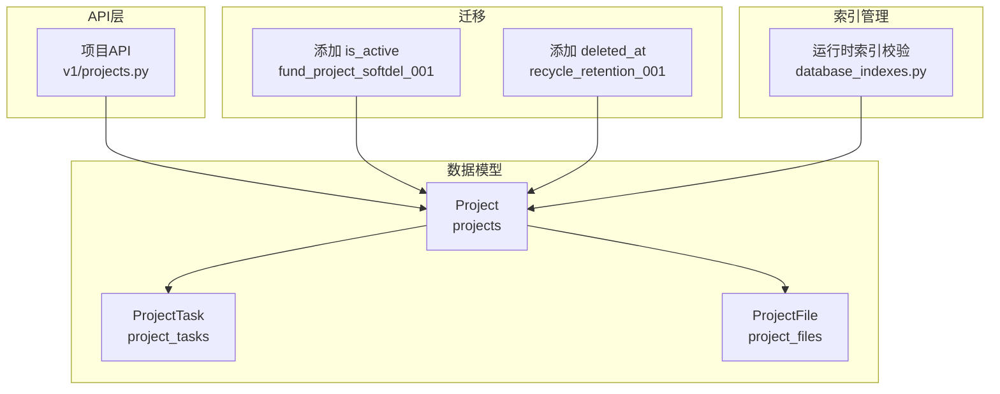
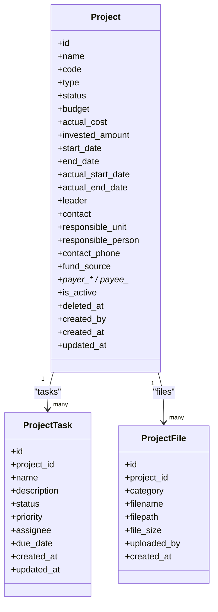
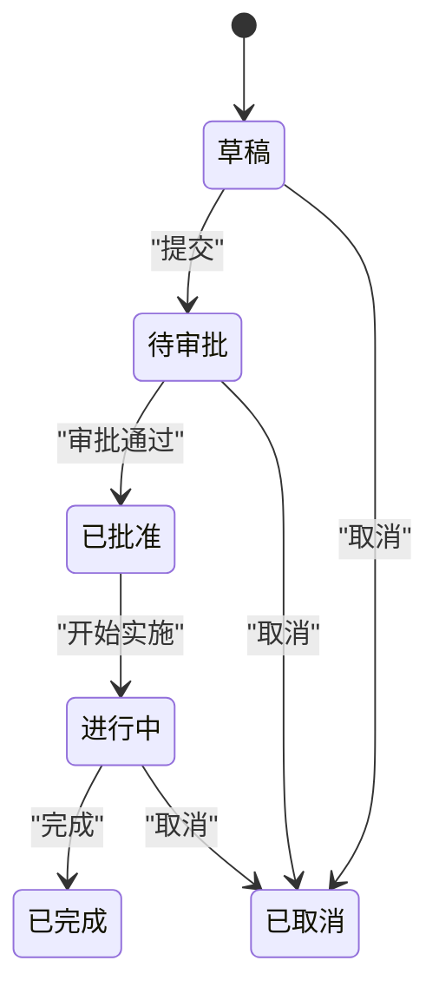
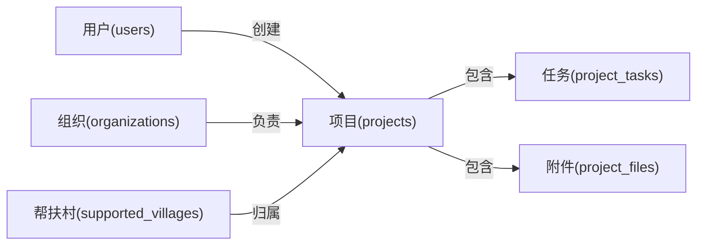

# 项目核心表结构

<cite>
**本文引用的文件**
- [backend/app/models/project.py](file://backend/app/models/project.py)
- [backend/alembic/versions/fund_project_softdel_001_add_is_active.py](file://backend/alembic/versions/fund_project_softdel_001_add_is_active.py)
- [backend/alembic/versions/recycle_retention_001_add_deleted_at.py](file://backend/alembic/versions/recycle_retention_001_add_deleted_at.py)
- [backend/app/api/v1/projects.py](file://backend/app/api/v1/projects.py)
- [backend/app/core/database_indexes.py](file://backend/app/core/database_indexes.py)
</cite>

## 目录
1. [简介](#简介)
2. [项目结构](#项目结构)
3. [核心组件](#核心组件)
4. [架构总览](#架构总览)
5. [详细组件分析](#详细组件分析)
6. [依赖关系分析](#依赖关系分析)
7. [性能考虑](#性能考虑)
8. [故障排查指南](#故障排查指南)
9. [结论](#结论)
10. [附录](#附录)

## 简介
本文件聚焦“项目”领域核心表结构的设计与实现，围绕 projects 主表展开，覆盖项目基本信息、时间管理、预算管理、负责人信息、资金来源与拨付信息；明确 ProjectStatus 与 ProjectType 枚举定义及七种状态流转机制；解释软删除机制（is_active、deleted_at）与审计字段（created_by、created_at、updated_at）；说明项目任务 project_tasks 与项目附件 project_files 的关联设计；并提供索引优化策略与查询性能建议。

## 项目结构
- 模型定义位于后端 ORM 层：projects、project_tasks、project_files 均在同一模型文件中集中定义，便于维护与一致性约束。
- 迁移脚本通过 Alembic 为软删能力提供数据库级保障（新增 is_active、deleted_at 列）。
- API 层对状态值进行校验，并在审批通过后回写项目状态，形成业务闭环。
- 索引既在模型 __table_args__ 中声明，也在启动时由索引管理模块校验并补建，确保生产环境可用。

图表来源
- [backend/app/models/project.py:47-175](file://backend/app/models/project.py#L47-L175)
- [backend/app/models/project.py:239-320](file://backend/app/models/project.py#L239-L320)
- [backend/alembic/versions/fund_project_softdel_001_add_is_active.py:32-68](file://backend/alembic/versions/fund_project_softdel_001_add_is_active.py#L32-L68)
- [backend/alembic/versions/recycle_retention_001_add_deleted_at.py:29-41](file://backend/alembic/versions/recycle_retention_001_add_deleted_at.py#L29-L41)
- [backend/app/core/database_indexes.py:18-42](file://backend/app/core/database_indexes.py#L18-L42)

章节来源
- [backend/app/models/project.py:47-175](file://backend/app/models/project.py#L47-L175)
- [backend/app/models/project.py:239-320](file://backend/app/models/project.py#L239-L320)
- [backend/alembic/versions/fund_project_softdel_001_add_is_active.py:32-68](file://backend/alembic/versions/fund_project_softdel_001_add_is_active.py#L32-L68)
- [backend/alembic/versions/recycle_retention_001_add_deleted_at.py:29-41](file://backend/alembic/versions/recycle_retention_001_add_deleted_at.py#L29-L41)
- [backend/app/core/database_indexes.py:18-42](file://backend/app/core/database_indexes.py#L18-L42)

## 核心组件
- Project（projects 表）：项目主实体，承载项目全生命周期信息与资金、时间、组织等维度数据。
- ProjectTask（project_tasks 表）：项目下的可执行任务，支持状态、优先级、截止日期等。
- ProjectFile（project_files 表）：项目附件，按阶段分类存储，记录上传人与时间。

章节来源
- [backend/app/models/project.py:47-175](file://backend/app/models/project.py#L47-L175)
- [backend/app/models/project.py:239-320](file://backend/app/models/project.py#L239-L320)

## 架构总览
下图展示项目核心表与其相关组件的关系，包括枚举、关联表、迁移与索引管理。

图表来源
- [backend/app/models/project.py:47-175](file://backend/app/models/project.py#L47-L175)
- [backend/app/models/project.py:239-320](file://backend/app/models/project.py#L239-L320)

## 详细组件分析

### 项目主表（projects）设计
- 基本信息
  - 名称 name、编号 code（唯一）、类型 type、状态 status。
- 时间管理
  - 计划开始/结束 start_date/end_date，实际开始/结束 actual_start_date/actual_end_date。
- 预算管理
  - 预算金额 budget、实际花费 actual_cost、已投资金额 invested_amount（单位：万元）。
- 负责人信息
  - 项目负责人 leader、联系方式 contact、负责单位 responsible_unit、负责人 responsible_person、联系电话 contact_phone（透明加密）。
- 资金来源与拨付信息
  - 资金来源 fund_source；拨款方 payer_account_name/payer_account_number/payer_bank/payer_handler/payer_contact；收款方 payee_account_name/payee_account_number/payee_bank/payee_handler/payee_contact。
- 扩展字段
  - 紧急程度 urgency_level、合同编号 contract_number、资金负责人 fund_manager、资金使用计划 fund_usage_plan、是否延期 is_delayed、延期原因 delay_reason、预期效益 expected_benefits、项目成果 achievements、标签 tags、备注 remarks。
  - 经费管理扩展：总预算估算 total_budget_estimate、资金来源分类 fund_source_category（JSON）、预期经济效益量化指标 expected_economic_benefit、预期效益量化指标 expected_military_benefit。
- 软删除与审计
  - 软删除：is_active（默认启用）、deleted_at（软删时间戳，用于回收站保留期计算）。
  - 审计：created_by（创建人ID）、created_at（创建时间）、updated_at（更新时间）。

章节来源
- [backend/app/models/project.py:47-175](file://backend/app/models/project.py#L47-L175)
- [backend/alembic/versions/fund_project_softdel_001_add_is_active.py:32-68](file://backend/alembic/versions/fund_project_softdel_001_add_is_active.py#L32-L68)
- [backend/alembic/versions/recycle_retention_001_add_deleted_at.py:29-41](file://backend/alembic/versions/recycle_retention_001_add_deleted_at.py#L29-L41)

### 项目任务（project_tasks）与项目附件（project_files）
- project_tasks
  - 与 projects 通过 project_id 外键关联，支持任务名、描述、状态、优先级、负责人、截止日期、创建/更新时间。
  - 针对 project_id、status、priority 建立索引以优化列表与筛选。
- project_files
  - 与 projects 通过 project_id 外键关联，按 category（如 research/implementation/acceptance/photo）分类存储，记录文件名、路径、大小、上传人与上传时间。
  - 针对 project_id、category 建立索引以优化按项目与类别检索。

章节来源
- [backend/app/models/project.py:239-320](file://backend/app/models/project.py#L239-L320)

### 枚举定义与状态流转
- 项目类型 ProjectType
  - infrastructure、education、healthcare、agriculture、industry、other。
- 项目状态 ProjectStatus
  - draft（草稿）、pending（待审批）、approved（已批准）、in_progress（进行中）、completed（已完成）、cancelled（已取消）。
- 七种状态流转机制
  - 初始状态为 draft。
  - 提交后进入 pending，等待审批。
  - 审批通过后转为 approved。
  - 批准后进入 in_progress。
  - 完成后标记为 completed。
  - 任意阶段可取消至 cancelled。
  - 审批终态回写：当审批任务结果为 approved 且项目当前为 pending 时，将项目状态更新为 approved。

图表来源
- [backend/app/models/project.py:25-34](file://backend/app/models/project.py#L25-L34)
- [backend/app/api/v1/projects.py:100-112](file://backend/app/api/v1/projects.py#L100-L112)

章节来源
- [backend/app/models/project.py:25-34](file://backend/app/models/project.py#L25-L34)
- [backend/app/api/v1/projects.py:100-112](file://backend/app/api/v1/projects.py#L100-L112)

### 软删除机制与审计字段
- 软删除
  - is_active：布尔标记，默认 True；删除操作置 False，列表默认过滤隐藏。
  - deleted_at：带时区的时间戳，记录软删时间，用于回收站保留期计算。
  - 迁移保证：Alembic 迁移为 projects 表增加 is_active 与 deleted_at，并创建相应索引。
- 审计字段
  - created_by：创建人 ID（外键指向 users）。
  - created_at：创建时间（服务器默认当前时间）。
  - updated_at：更新时间（服务器默认当前时间，更新时自动刷新）。

章节来源
- [backend/app/models/project.py:143-165](file://backend/app/models/project.py#L143-L165)
- [backend/alembic/versions/fund_project_softdel_001_add_is_active.py:32-68](file://backend/alembic/versions/fund_project_softdel_001_add_is_active.py#L32-L68)
- [backend/alembic/versions/recycle_retention_001_add_deleted_at.py:29-41](file://backend/alembic/versions/recycle_retention_001_add_deleted_at.py#L29-L41)

### 索引设计与查询优化
- 单列索引
  - status、type、village_id、organization_id、created_by、is_active、start_date、end_date。
- 复合索引
  - (status, type)、(status, created_at)、(village_id, status)、(organization_id, status)、(status, village_id)。
- 运行时索引校验
  - 启动时通过 database_indexes 模块校验并补建必要索引，确保 FK 与常用查询列具备索引支撑。
- 查询建议
  - 列表与筛选：优先使用 status、type、village_id、organization_id 组合条件，命中复合索引。
  - 时间范围：利用 start_date/end_date 单列索引进行范围扫描。
  - 软删过滤：统一加上 is_active=True 条件，避免无效数据参与计算。
  - 关联查询：借助 village_id、organization_id 的外键索引提升 JOIN 效率。

章节来源
- [backend/app/models/project.py:52-68](file://backend/app/models/project.py#L52-L68)
- [backend/app/core/database_indexes.py:18-42](file://backend/app/core/database_indexes.py#L18-L42)

## 依赖关系分析
- 模型间关系
  - Project 一对多关联 ProjectTask、ProjectFile。
  - Project 通过 village_id、organization_id 分别关联帮扶村与负责单位（lazy="noload"，按需加载）。
  - Project.created_by 关联用户表，用于审计追踪。
- API 与模型耦合
  - API 层对 ProjectStatus 进行校验，并在审批回调中将 pending 项目更新为 approved，形成业务闭环。
- 迁移与索引
  - 迁移脚本确保 is_active、deleted_at 存在并建立索引；索引管理模块在应用启动时校验并补建。

图表来源
- [backend/app/models/project.py:47-175](file://backend/app/models/project.py#L47-L175)
- [backend/app/models/project.py:239-320](file://backend/app/models/project.py#L239-L320)

章节来源
- [backend/app/models/project.py:47-175](file://backend/app/models/project.py#L47-L175)
- [backend/app/models/project.py:239-320](file://backend/app/models/project.py#L239-L320)

## 性能考虑
- 索引策略
  - 充分利用模型定义的复合索引，减少全表扫描。
  - 结合运行时索引管理，确保 FK 列与高频查询列具备索引。
- 查询模式
  - 列表页：按 status/type/village_id/organization_id 过滤，并按 created_at 排序，命中复合索引。
  - 统计聚合：基于 is_active=True 过滤后再聚合，避免无效数据干扰。
- 关联加载
  - 使用 selectinload 显式加载 village、organization，避免 N+1 问题。
- 软删与回收站
  - 统一在查询中附加 is_active=True，必要时结合 deleted_at 做保留期判断。

[本节为通用性能建议，不直接分析具体文件]

## 故障排查指南
- 状态异常
  - 若项目未从 pending 转为 approved，检查审批回调是否触发以及状态校验逻辑。
- 软删数据可见
  - 确认查询是否遗漏 is_active=True 过滤条件；检查迁移是否正确执行。
- 索引缺失导致慢查询
  - 查看启动日志中索引创建结果；必要时手动运行索引校验与补建流程。
- 日期格式错误
  - API 层对 start_date/end_date 进行格式校验，确保传入 YYYY-MM-DD。

章节来源
- [backend/app/api/v1/projects.py:100-112](file://backend/app/api/v1/projects.py#L100-L112)
- [backend/app/api/v1/projects.py:188-203](file://backend/app/api/v1/projects.py#L188-L203)
- [backend/app/core/database_indexes.py:59-95](file://backend/app/core/database_indexes.py#L59-L95)

## 结论
本项目通过清晰的模型定义、完善的迁移与索引管理、严格的 API 校验与审批回写机制，构建了稳健的项目核心表结构。projects 主表覆盖项目全生命周期所需的关键字段，配合 project_tasks 与 project_files 形成完整的项目执行与资料管理体系。软删除与审计字段保障了数据安全与可追溯性。建议在业务侧严格遵循状态机与查询规范，持续优化索引与查询路径，以获得稳定高效的系统表现。

## 附录
- 字段字典（节选）
  - 基本信息：name、code、type、status、description、objectives。
  - 时间管理：start_date、end_date、actual_start_date、actual_end_date。
  - 预算管理：budget、actual_cost、invested_amount。
  - 负责人信息：leader、contact、responsible_unit、responsible_person、contact_phone。
  - 资金拨付：fund_source、payer_*、payee_*。
  - 扩展：urgency_level、contract_number、fund_manager、fund_usage_plan、is_delayed、delay_reason、expected_benefits、achievements、tags、remarks。
  - 经费扩展：total_budget_estimate、fund_source_category、expected_economic_benefit、expected_military_benefit。
  - 软删与审计：is_active、deleted_at、created_by、created_at、updated_at。

章节来源
- [backend/app/models/project.py:47-175](file://backend/app/models/project.py#L47-L175)