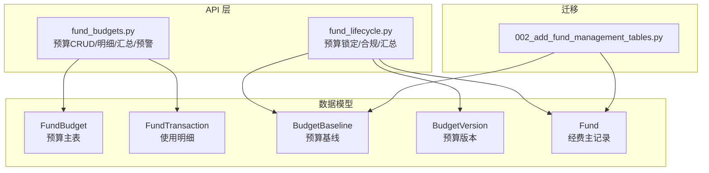
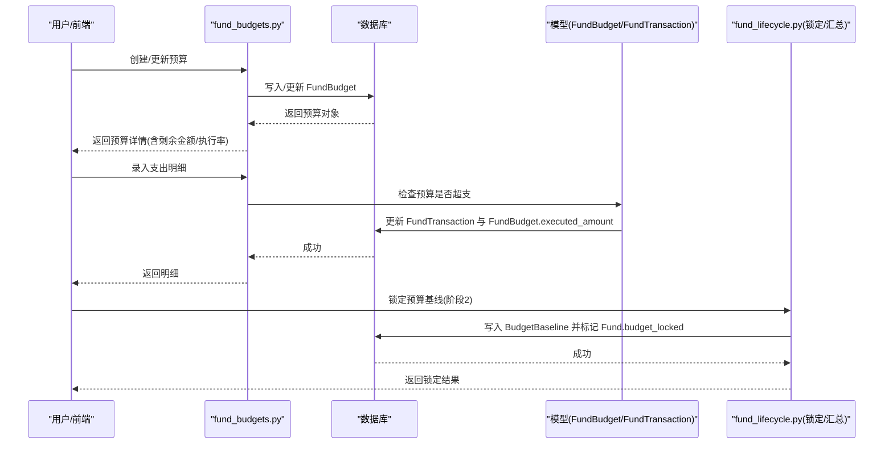
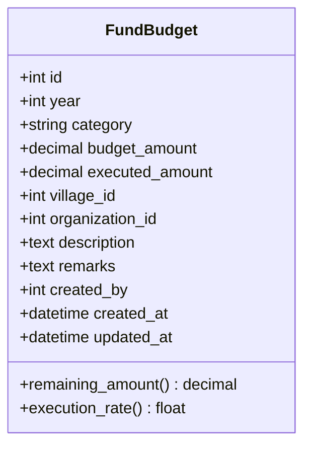
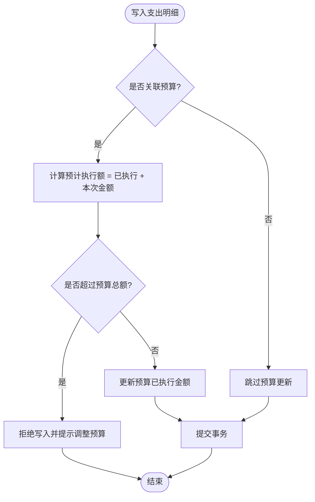
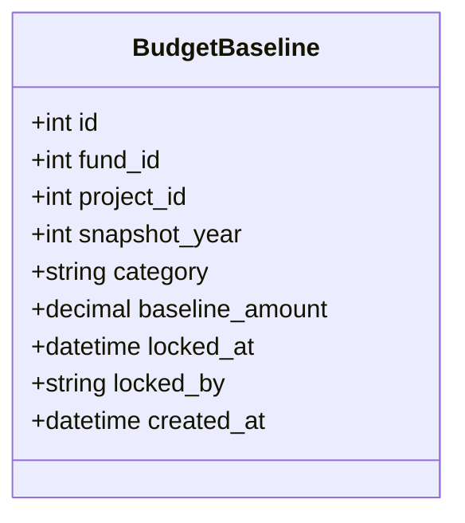
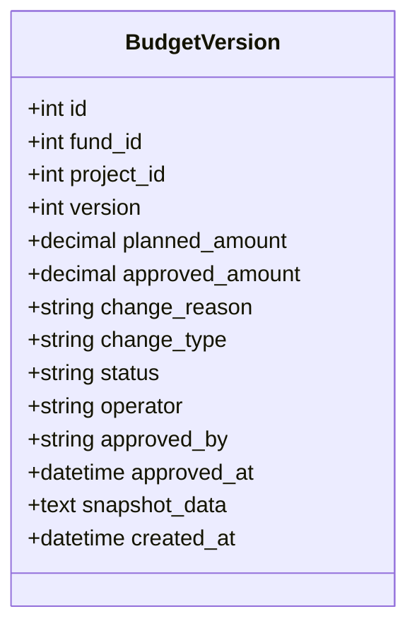
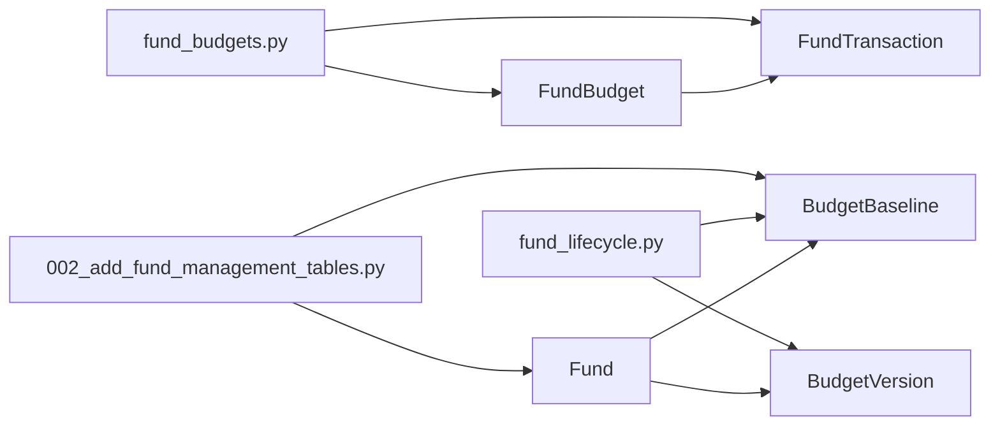

# 预算编制表结构

<cite>
**本文引用的文件**
- [backend/app/models/fund_budget.py](file://backend/app/models/fund_budget.py)
- [backend/app/models/fund_lifecycle.py](file://backend/app/models/fund_lifecycle.py)
- [backend/app/models/fund.py](file://backend/app/models/fund.py)
- [backend/app/api/v1/fund_budgets.py](file://backend/app/api/v1/fund_budgets.py)
- [backend/app/api/v1/fund_lifecycle.py](file://backend/app/api/v1/fund_lifecycle.py)
- [backend/alembic/versions/002_add_fund_management_tables.py](file://backend/alembic/versions/002_add_fund_management_tables.py)
</cite>

## 目录
1. [简介](#简介)
2. [项目结构](#项目结构)
3. [核心组件](#核心组件)
4. [架构总览](#架构总览)
5. [详细组件分析](#详细组件分析)
6. [依赖关系分析](#依赖关系分析)
7. [性能考虑](#性能考虑)
8. [故障排查指南](#故障排查指南)
9. [结论](#结论)
10. [附录](#附录)

## 简介
本文件围绕“预算编制表结构”进行系统化说明，重点覆盖：
- fund_budgets 预算主表设计：预算基本信息（年度、科目、金额）、项目与组织关联、执行进度与剩余额度。
- 预算版本控制机制：budget_versions 表用于记录每次预算变更的快照与审批轨迹。
- 基线管理：budget_baselines 表在汇总审核阶段锁定预算基线，作为后续拨付与执行的约束基准。
- 预算编制流程、审批流程与变更管理：从创建、提交、批准到锁定的全链路。
- 预算执行监控与偏差分析：通过已执行金额、预警阈值、偏差率与健康度字段实现。
- 预算与实际支出对比分析与预警：提供按科目汇总、执行率、超支禁止等能力。

## 项目结构
与预算相关的核心代码分布在以下位置：
- 数据模型：fund_budget.py（FundBudget、FundTransaction）、fund_lifecycle.py（BudgetBaseline、BudgetVersion）、fund.py（Fund 基础字段与预算状态/版本）
- API 层：fund_budgets.py（预算CRUD、明细、汇总、预警）、fund_lifecycle.py（预算锁定、合规校验、多维度汇总）
- 迁移脚本：002_add_fund_management_tables.py（经费相关扩展表定义）

**图表来源**
- [backend/app/models/fund_budget.py:19-76](file://backend/app/models/fund_budget.py#L19-L76)
- [backend/app/models/fund_lifecycle.py:156-188](file://backend/app/models/fund_lifecycle.py#L156-L188)
- [backend/app/models/fund_lifecycle.py:411-449](file://backend/app/models/fund_lifecycle.py#L411-L449)
- [backend/app/models/fund.py:130-160](file://backend/app/models/fund.py#L130-L160)
- [backend/app/api/v1/fund_budgets.py:114-290](file://backend/app/api/v1/fund_budgets.py#L114-L290)
- [backend/app/api/v1/fund_lifecycle.py:378-541](file://backend/app/api/v1/fund_lifecycle.py#L378-L541)
- [backend/alembic/versions/002_add_fund_management_tables.py:48-167](file://backend/alembic/versions/002_add_fund_management_tables.py#L48-L167)

**章节来源**
- [backend/app/models/fund_budget.py:19-76](file://backend/app/models/fund_budget.py#L19-L76)
- [backend/app/models/fund_lifecycle.py:156-188](file://backend/app/models/fund_lifecycle.py#L156-L188)
- [backend/app/models/fund_lifecycle.py:411-449](file://backend/app/models/fund_lifecycle.py#L411-L449)
- [backend/app/models/fund.py:130-160](file://backend/app/models/fund.py#L130-L160)
- [backend/app/api/v1/fund_budgets.py:114-290](file://backend/app/api/v1/fund_budgets.py#L114-L290)
- [backend/app/api/v1/fund_lifecycle.py:378-541](file://backend/app/api/v1/fund_lifecycle.py#L378-L541)
- [backend/alembic/versions/002_add_fund_management_tables.py:48-167](file://backend/alembic/versions/002_add_fund_management_tables.py#L48-L167)

## 核心组件
- FundBudget（预算主表）：以年度+科目为维度记录预算总额与已执行金额，支持帮扶村与所属单位维度；提供剩余金额与执行率计算。
- FundTransaction（使用明细）：记录每笔支出用途、日期、凭证等，并联动更新对应预算的已执行金额。
- BudgetBaseline（预算基线）：在汇总审核阶段对经费进行基线锁定，形成不可随意更改的执行基准。
- BudgetVersion（预算版本）：记录每次预算变更的版本快照、变更原因与类型，以及审批结果与时间。
- Fund（经费主记录）：包含预算版本号、预算状态、偏差率、健康度等风控字段，支撑整体生命周期管理。

**章节来源**
- [backend/app/models/fund_budget.py:19-76](file://backend/app/models/fund_budget.py#L19-L76)
- [backend/app/models/fund_budget.py:78-141](file://backend/app/models/fund_budget.py#L78-L141)
- [backend/app/models/fund_lifecycle.py:156-188](file://backend/app/models/fund_lifecycle.py#L156-L188)
- [backend/app/models/fund_lifecycle.py:411-449](file://backend/app/models/fund_lifecycle.py#L411-L449)
- [backend/app/models/fund.py:130-160](file://backend/app/models/fund.py#L130-L160)

## 架构总览
预算系统采用“模型-服务-API”分层架构：
- 模型层：定义预算、明细、基线、版本等实体及索引。
- API 层：提供预算CRUD、明细录入、汇总统计、预警查询、预算锁定与合规校验等接口。
- 业务规则：在执行明细时自动扣减预算已执行金额，并在达到阈值时触发预警或禁止核销；在汇总审核阶段锁定基线，限制后续拨付与执行。

**图表来源**
- [backend/app/api/v1/fund_budgets.py:146-204](file://backend/app/api/v1/fund_budgets.py#L146-L204)
- [backend/app/api/v1/fund_budgets.py:324-376](file://backend/app/api/v1/fund_budgets.py#L324-L376)
- [backend/app/api/v1/fund_lifecycle.py:378-418](file://backend/app/api/v1/fund_lifecycle.py#L378-L418)
- [backend/app/models/fund_budget.py:19-76](file://backend/app/models/fund_budget.py#L19-L76)
- [backend/app/models/fund_budget.py:78-141](file://backend/app/models/fund_budget.py#L78-L141)
- [backend/app/models/fund_lifecycle.py:156-188](file://backend/app/models/fund_lifecycle.py#L156-L188)

## 详细组件分析

### FundBudget（预算主表）
- 关键字段
  - 年度、科目：用于分类与聚合统计
  - 预算金额、已执行金额：用于计算剩余金额与执行率
  - 帮扶村ID、所属单位ID：支持组织与区域维度隔离
  - 描述、备注：附加信息
  - 创建人、创建时间、更新时间：审计追踪
- 计算属性
  - 剩余金额 = 预算金额 - 已执行金额
  - 执行率 = 已执行金额 / 预算金额 × 100%
- 索引优化
  - 针对年度、科目、年度+科目、帮扶村ID建立索引，提升查询效率

**图表来源**
- [backend/app/models/fund_budget.py:19-76](file://backend/app/models/fund_budget.py#L19-L76)

**章节来源**
- [backend/app/models/fund_budget.py:19-76](file://backend/app/models/fund_budget.py#L19-L76)

### FundTransaction（使用明细）
- 作用：记录每笔支出的用途、日期、凭证编号与附件路径，支持按经费、项目、帮扶村、预算维度筛选。
- 联动逻辑：
  - 若关联预算ID，则在写入明细时自动增加对应预算的已执行金额，并校验是否超过预算总额（超支禁止）。
  - 若关联经费ID，则同步更新经费的已用金额与剩余金额。
- 删除回滚：删除明细时，相应扣减预算与经费的已用金额，确保数据一致性。

**图表来源**
- [backend/app/api/v1/fund_budgets.py:324-376](file://backend/app/api/v1/fund_budgets.py#L324-L376)
- [backend/app/models/fund_budget.py:78-141](file://backend/app/models/fund_budget.py#L78-L141)

**章节来源**
- [backend/app/api/v1/fund_budgets.py:324-376](file://backend/app/api/v1/fund_budgets.py#L324-L376)
- [backend/app/models/fund_budget.py:78-141](file://backend/app/models/fund_budget.py#L78-L141)

### BudgetBaseline（预算基线）
- 作用：在汇总审核阶段对经费进行基线锁定，形成不可随意更改的执行基准。
- 关键字段：经费ID、项目ID、快照年度、科目、基线金额、锁定时间与锁定人。
- 约束效果：后续拨付与执行需受基线金额约束，防止超拨与超支。

**图表来源**
- [backend/app/models/fund_lifecycle.py:156-188](file://backend/app/models/fund_lifecycle.py#L156-L188)

**章节来源**
- [backend/app/models/fund_lifecycle.py:156-188](file://backend/app/models/fund_lifecycle.py#L156-L188)

### BudgetVersion（预算版本）
- 作用：记录每次预算变更的版本快照与审批轨迹，支持追溯与回滚。
- 关键字段：经费ID、项目ID、版本号、计划金额、批准金额、变更原因与类型、状态、操作人、审批人与审批时间、完整快照数据（JSON）。
- 版本递增：在预算变更时自动递增版本号，并保存快照。

**图表来源**
- [backend/app/models/fund_lifecycle.py:411-449](file://backend/app/models/fund_lifecycle.py#L411-L449)

**章节来源**
- [backend/app/models/fund_lifecycle.py:411-449](file://backend/app/models/fund_lifecycle.py#L411-L449)

### Fund（经费主记录）中的预算相关字段
- 预算状态：draft/submitted/approved，反映预算当前所处阶段。
- 预算版本号：随变更递增，配合预算版本表进行痕迹追踪。
- 偏差率与健康度：用于偏差分析与资金健康评估。
- 预算锁定标志：在汇总审核阶段锁定后，限制后续操作。

**章节来源**
- [backend/app/models/fund.py:130-160](file://backend/app/models/fund.py#L130-L160)

## 依赖关系分析
- FundBudget 与 FundTransaction：明细写入会联动更新预算已执行金额，删除明细会回滚已执行金额。
- Fund 与 BudgetBaseline/BudgetVersion：基线锁定影响拨付与执行；版本表记录变更历史。
- API 层依赖模型与权限控制：所有写操作均要求管理角色，读操作应用数据范围过滤。
- 迁移脚本确保扩展表与字段存在，保证系统启动时的数据结构一致性。

**图表来源**
- [backend/app/models/fund_budget.py:19-76](file://backend/app/models/fund_budget.py#L19-L76)
- [backend/app/models/fund_budget.py:78-141](file://backend/app/models/fund_budget.py#L78-L141)
- [backend/app/models/fund_lifecycle.py:156-188](file://backend/app/models/fund_lifecycle.py#L156-L188)
- [backend/app/models/fund_lifecycle.py:411-449](file://backend/app/models/fund_lifecycle.py#L411-L449)
- [backend/app/models/fund.py:130-160](file://backend/app/models/fund.py#L130-L160)
- [backend/app/api/v1/fund_budgets.py:114-290](file://backend/app/api/v1/fund_budgets.py#L114-L290)
- [backend/app/api/v1/fund_lifecycle.py:378-541](file://backend/app/api/v1/fund_lifecycle.py#L378-L541)
- [backend/alembic/versions/002_add_fund_management_tables.py:48-167](file://backend/alembic/versions/002_add_fund_management_tables.py#L48-L167)

**章节来源**
- [backend/app/models/fund_budget.py:19-76](file://backend/app/models/fund_budget.py#L19-L76)
- [backend/app/models/fund_budget.py:78-141](file://backend/app/models/fund_budget.py#L78-L141)
- [backend/app/models/fund_lifecycle.py:156-188](file://backend/app/models/fund_lifecycle.py#L156-L188)
- [backend/app/models/fund_lifecycle.py:411-449](file://backend/app/models/fund_lifecycle.py#L411-L449)
- [backend/app/models/fund.py:130-160](file://backend/app/models/fund.py#L130-L160)
- [backend/app/api/v1/fund_budgets.py:114-290](file://backend/app/api/v1/fund_budgets.py#L114-L290)
- [backend/app/api/v1/fund_lifecycle.py:378-541](file://backend/app/api/v1/fund_lifecycle.py#L378-L541)
- [backend/alembic/versions/002_add_fund_management_tables.py:48-167](file://backend/alembic/versions/002_add_fund_management_tables.py#L48-L167)

## 性能考虑
- 索引策略：为高频查询字段（年度、科目、年度+科目、帮扶村ID、经费ID、项目ID、交易日期）建立索引，提升列表与统计查询性能。
- 聚合冗余：在 Fund 中预计算年份、年月、年季度字段，避免 GROUP BY 时使用函数导致索引失效。
- 事务与批量：明细写入与预算更新在同一事务中完成，减少不一致风险；批量导入建议使用批处理接口（如有）。
- 缓存建议：对汇总统计与预警结果可引入缓存层，降低重复计算开销。

[本节为通用性能建议，不直接分析具体文件]

## 故障排查指南
- 超支禁止：当明细写入导致预计执行额超过预算总额时，将返回错误并禁止继续核销。请检查预算金额与已执行金额，必要时调整预算。
- 未锁定基线：若尝试拨付或执行前未锁定基线，将提示先完成汇总审核阶段的基线锁定。
- 权限不足：所有写操作需要管理角色，如出现权限错误，请确认当前用户角色。
- 数据范围：读取预算列表时应用数据范围过滤，确保仅看到授权范围内的数据。

**章节来源**
- [backend/app/api/v1/fund_budgets.py:324-376](file://backend/app/api/v1/fund_budgets.py#L324-L376)
- [backend/app/api/v1/fund_lifecycle.py:378-418](file://backend/app/api/v1/fund_lifecycle.py#L378-L418)

## 结论
本预算编制体系通过 FundBudget 主表、FundTransaction 明细、BudgetBaseline 基线与 BudgetVersion 版本表，构建了完整的预算编制、审批、执行与监控闭环。结合预警阈值与偏差分析，能够有效管控预算执行风险，保障资金使用的合规性与透明度。建议在后续迭代中进一步完善预警通知与可视化报表，提升管理效率。

[本节为总结性内容，不直接分析具体文件]

## 附录

### 预算预警与偏差分析
- 预警阈值：
  - 80%：提醒（黄）
  - 90%：警告（橙）
  - 100%：禁止线（红），超支禁止核销
- 偏差率与健康度：在 Fund 中维护偏差率与健康度，用于整体资金健康评估。

**章节来源**
- [backend/app/models/fund_budget.py:143-202](file://backend/app/models/fund_budget.py#L143-L202)
- [backend/app/models/fund.py:130-160](file://backend/app/models/fund.py#L130-L160)

### 预算汇总与对比分析
- 按年度/科目汇总：提供预算总额、已执行、剩余与执行率。
- 多维度汇总：支持按年度、类型、村、单位、组织分组，生成饼图与柱状图数据。

**章节来源**
- [backend/app/api/v1/fund_budgets.py:249-290](file://backend/app/api/v1/fund_budgets.py#L249-L290)
- [backend/app/api/v1/fund_lifecycle.py:435-541](file://backend/app/api/v1/fund_lifecycle.py#L435-L541)

### 预算版本与基线管理流程
- 版本控制：每次预算变更生成新版本快照，记录变更原因与类型，支持审批流。
- 基线锁定：汇总审核阶段锁定基线，作为后续拨付与执行的约束基准。

**章节来源**
- [backend/app/models/fund_lifecycle.py:156-188](file://backend/app/models/fund_lifecycle.py#L156-L188)
- [backend/app/models/fund_lifecycle.py:411-449](file://backend/app/models/fund_lifecycle.py#L411-L449)
- [backend/app/api/v1/fund_lifecycle.py:378-418](file://backend/app/api/v1/fund_lifecycle.py#L378-L418)