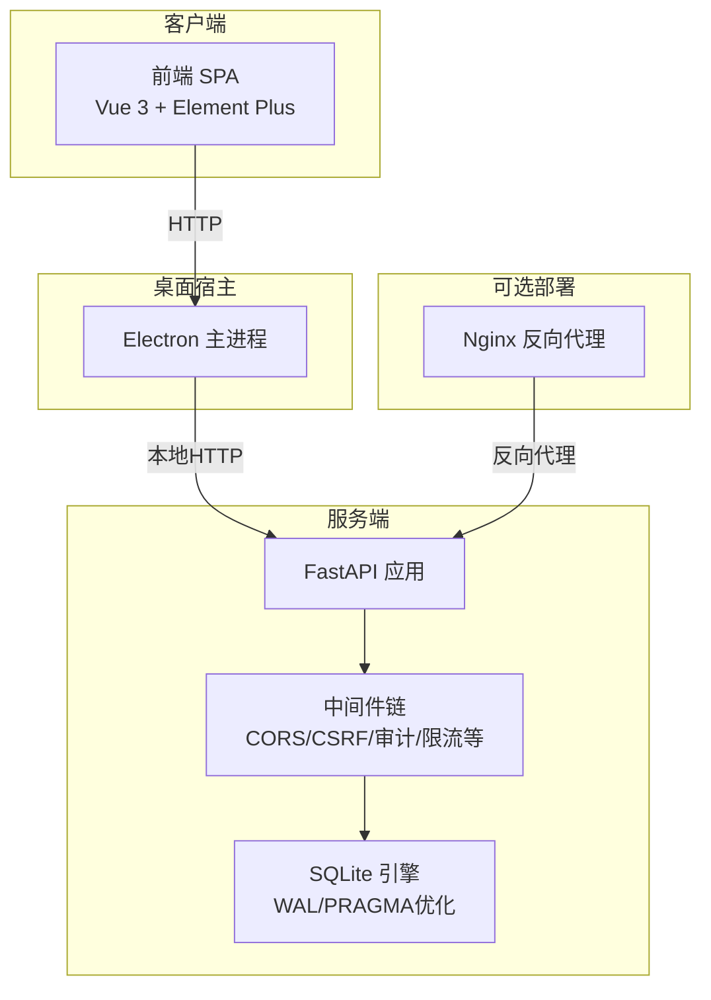
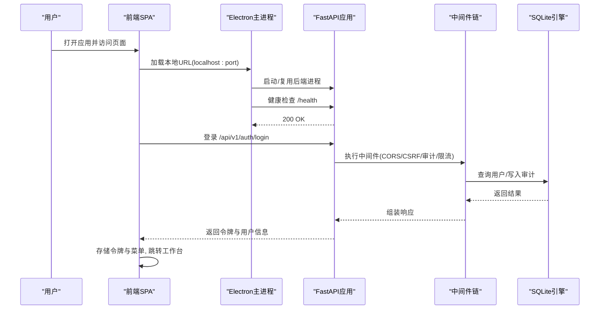
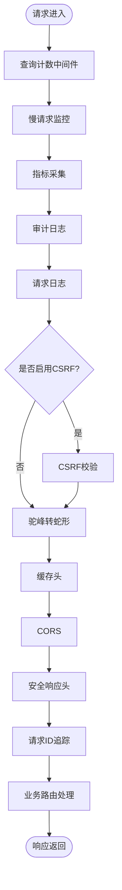
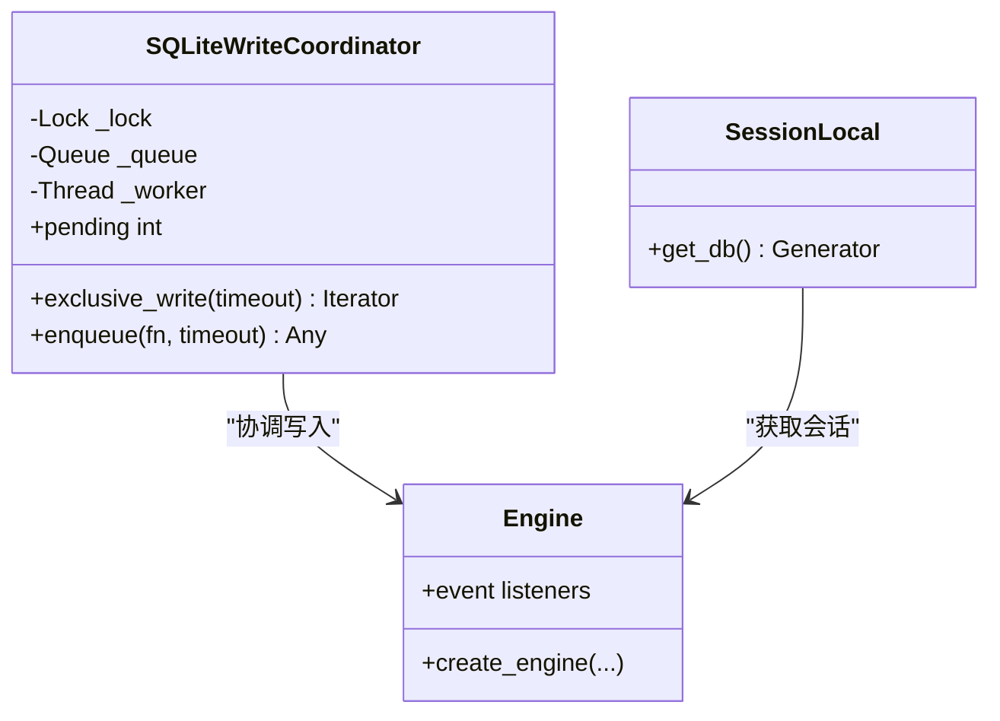
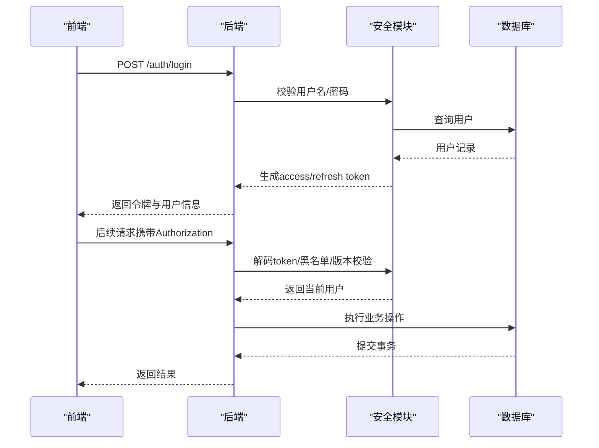
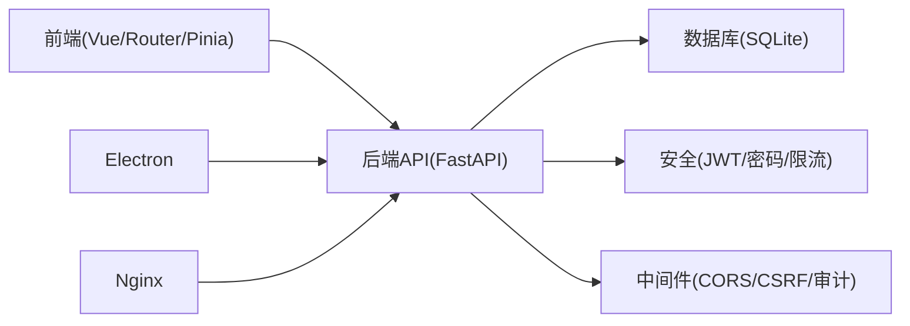

# 架构设计

<cite>
**本文引用的文件**
- [backend/app/main.py](file://backend/app/main.py)
- [backend/app/core/config.py](file://backend/app/core/config.py)
- [backend/app/core/database.py](file://backend/app/core/database.py)
- [backend/app/core/security.py](file://backend/app/core/security.py)
- [backend/app/api/v1/__init__.py](file://backend/app/api/v1/__init__.py)
- [electron/main.js](file://electron/main.js)
- [frontend/src/main.ts](file://frontend/src/main.ts)
- [frontend/src/router/index.ts](file://frontend/src/router/index.ts)
- [nginx/conf.d/assistance.conf](file://nginx/conf.d/assistance.conf)
</cite>

## 目录
1. [引言](#引言)
2. [项目结构](#项目结构)
3. [核心组件](#核心组件)
4. [架构总览](#架构总览)
5. [详细组件分析](#详细组件分析)
6. [依赖关系分析](#依赖关系分析)
7. [性能与扩展性](#性能与扩展性)
8. [故障排查指南](#故障排查指南)
9. [结论](#结论)

## 引言
本章节阐述帮扶管理信息系统的整体架构模式、技术选型与设计理念。系统采用前后端分离的桌面应用形态：前端基于 Vue 3 + Element Plus，后端基于 FastAPI + SQLAlchemy（SQLite），通过 Electron 将前后端打包为单机可执行程序；在容器化部署时可通过 Nginx 反向代理对外暴露服务。系统遵循分层架构与模块化组织，强调安全基线、离线可用、数据一致性与可维护性。

## 项目结构
- 前端（frontend）：Vue 3 单页应用，路由集中定义，状态管理使用 Pinia，UI 组件按需引入，全局错误处理与主题统一。
- 后端（backend）：FastAPI 应用，模块化 API v1 路由注册，核心配置与数据库引擎在 core 层，业务逻辑在 services 层，模型在 models 层，中间件在 middleware 层。
- 桌面壳（electron）：负责启动后端进程、端口探测、健康检查、窗口管理、托盘、自动重启与日志诊断。
- 部署（nginx/docker）：Nginx 作为反向代理转发静态资源与 API，支持缓存与健康检查；Docker 提供多平台镜像构建。

图表来源
- [electron/main.js:200-382](file://electron/main.js#L200-L382)
- [backend/app/main.py:98-179](file://backend/app/main.py#L98-L179)
- [backend/app/core/database.py:55-67](file://backend/app/core/database.py#L55-L67)
- [nginx/conf.d/assistance.conf:1-49](file://nginx/conf.d/assistance.conf#L1-L49)

章节来源
- [backend/app/main.py:98-179](file://backend/app/main.py#L98-L179)
- [frontend/src/main.ts:1-69](file://frontend/src/main.ts#L1-L69)
- [electron/main.js:200-382](file://electron/main.js#L200-L382)
- [nginx/conf.d/assistance.conf:1-49](file://nginx/conf.d/assistance.conf#L1-L49)

## 核心组件
- 应用入口与生命周期：FastAPI 应用初始化、中间件注册、路由加载、静态资源挂载、健康检查与关闭钩子。
- 配置中心：集中式 Settings，环境变量驱动，动态路径解析，加密密钥管理，生产环境安全加固。
- 数据库层：SQLAlchemy 引擎与连接池，SQLite PRAGMA 调优，长事务独占写协调器，磁盘空间检查。
- 安全与认证：JWT 签发与校验、密码策略、速率限制、安全响应头、审计上下文注入。
- 路由与模块：v1 路由聚合，按序注册业务模块，保证匹配优先级与快速失败。
- 桌面宿主：Electron 主进程管理后端生命周期、端口选择、健康检查、崩溃恢复、托盘与导航安全。
- 前端应用：Vue 应用初始化、路由守卫、权限指令、全局错误处理、主题与样式体系。

章节来源
- [backend/app/main.py:66-179](file://backend/app/main.py#L66-L179)
- [backend/app/core/config.py:54-383](file://backend/app/core/config.py#L54-L383)
- [backend/app/core/database.py:55-187](file://backend/app/core/database.py#L55-L187)
- [backend/app/core/security.py:209-371](file://backend/app/core/security.py#L209-L371)
- [backend/app/api/v1/__init__.py:29-148](file://backend/app/api/v1/__init__.py#L29-L148)
- [electron/main.js:200-537](file://electron/main.js#L200-L537)
- [frontend/src/main.ts:1-69](file://frontend/src/main.ts#L1-L69)

## 架构总览
系统采用“桌面宿主 + 前后端分离”的混合架构：
- 桌面宿主（Electron）负责进程编排、用户界面承载、本地安全策略与用户体验增强。
- 前端（Vue SPA）负责交互与展示，通过 HTTP 调用后端 API。
- 后端（FastAPI）提供 RESTful API，内置中间件链实现跨域、CSRF、审计、限流与安全头。
- 数据持久化（SQLite）通过 WAL 模式与 PRAGMA 调优提升并发读写性能，并提供长事务独占写保障。
- 可选 Nginx 反向代理用于容器化部署时的请求转发与静态资源缓存。

图表来源
- [electron/main.js:430-537](file://electron/main.js#L430-L537)
- [backend/app/main.py:235-371](file://backend/app/main.py#L235-L371)
- [backend/app/core/security.py:243-336](file://backend/app/core/security.py#L243-L336)
- [backend/app/core/database.py:70-187](file://backend/app/core/database.py#L70-L187)

## 详细组件分析

### 后端应用与中间件链
- 应用初始化：创建 FastAPI 实例，注册异常处理器，设置文档开关。
- 中间件顺序：从内到外依次执行慢请求监控、指标采集、审计、请求日志、CSRF、驼峰转换、缓存头、CORS、安全头、请求ID、查询计数等。
- 路由加载：v1 路由聚合模块静态导入并按序注册，确保 PyInstaller 环境下完整收集与快速失败。
- 静态资源与SPA回退：根据构建产物挂载 assets/images/static，index.html 不缓存，非 API 请求回退到 index.html。

图表来源
- [backend/app/main.py:111-179](file://backend/app/main.py#L111-L179)
- [backend/app/api/v1/__init__.py:29-148](file://backend/app/api/v1/__init__.py#L29-L148)

章节来源
- [backend/app/main.py:98-179](file://backend/app/main.py#L98-L179)
- [backend/app/api/v1/__init__.py:29-148](file://backend/app/api/v1/__init__.py#L29-L148)

### 配置与运行时环境
- 配置来源：环境变量优先，支持 .env 文件，生产环境强制关闭 SQL echo，自动生成并持久化密钥。
- 路径解析：动态计算数据目录、数据库路径、上传与导出目录，避免安装版权限问题。
- 安全基线：默认开启 CSRF，限制 Token 有效期，严格代理头信任策略。

章节来源
- [backend/app/core/config.py:54-383](file://backend/app/core/config.py#L54-L383)

### 数据库与一致性保障
- 引擎与连接池：针对 SQLite 使用 QueuePool，控制连接数与超时，启用预检查与回收。
- PRAGMA 调优：WAL 模式、外键约束、同步级别、忙等待超时、内存缓存、临时表存储、自动索引、WAL checkpoint。
- 长事务协调器：exclusive_write 上下文管理器串行化大批量写入，避免 SQLITE_BUSY。
- 磁盘空间检查：备份与导入前检测剩余空间，防止写入失败。

图表来源
- [backend/app/core/database.py:198-289](file://backend/app/core/database.py#L198-L289)
- [backend/app/core/database.py:55-67](file://backend/app/core/database.py#L55-L67)
- [backend/app/core/database.py:174-187](file://backend/app/core/database.py#L174-L187)

章节来源
- [backend/app/core/database.py:55-187](file://backend/app/core/database.py#L55-L187)
- [backend/app/core/database.py:198-289](file://backend/app/core/database.py#L198-L289)

### 安全与认证机制
- JWT：生成 access/refresh token，解码校验，黑名单与版本校验，防越权。
- 密码策略：bcrypt 哈希，长度与复杂度校验，弱密码黑名单。
- 速率限制：滑动窗口算法，内存存储，定期清理过期键。
- 安全头：X-Content-Type-Options、X-Frame-Options、Referrer-Policy 等。
- 审计上下文：当前用户 ID 注入 ContextVar，写操作可追责到人。

图表来源
- [backend/app/core/security.py:209-371](file://backend/app/core/security.py#L209-L371)
- [backend/app/core/security.py:439-488](file://backend/app/core/security.py#L439-L488)
- [backend/app/core/security.py:598-637](file://backend/app/core/security.py#L598-L637)

章节来源
- [backend/app/core/security.py:209-371](file://backend/app/core/security.py#L209-L371)
- [backend/app/core/security.py:439-488](file://backend/app/core/security.py#L439-L488)
- [backend/app/core/security.py:598-637](file://backend/app/core/security.py#L598-L637)

### 前端路由与状态管理
- 路由：集中式定义，懒加载组件，公共路由与主布局分离，旧路径重定向兼容。
- 状态：Pinia 管理认证、菜单、权限等，登录后预取菜单与 CSRF token。
- 指令：权限指令与水印指令，全局错误处理与消息去重。

章节来源
- [frontend/src/router/index.ts:1-800](file://frontend/src/router/index.ts#L1-L800)
- [frontend/src/main.ts:1-69](file://frontend/src/main.ts#L1-L69)
- [frontend/src/stores/auth.ts:31-295](file://frontend/src/stores/auth.ts#L31-L295)

### 桌面宿主与进程编排
- 后端启动：首次启动探测端口，后续重启复用端口，避免前端连接失效。
- 健康检查：轮询 /health，超时提示与重试加载页面。
- 崩溃恢复：渲染进程崩溃自动重载一次，失败提示用户；后端异常退出最多自动重启次数。
- 安全导航：仅允许白名单协议与精确 origin 匹配，防止恶意跳转。

章节来源
- [electron/main.js:200-537](file://electron/main.js#L200-L537)

### 部署与反向代理
- Nginx：统一监听 80，静态资源与 API 转发至后端，文档与健康检查直透，静态资源长期缓存。
- 容器化：Dockerfile 与 docker-compose 支持多平台构建与运行。

章节来源
- [nginx/conf.d/assistance.conf:1-49](file://nginx/conf.d/assistance.conf#L1-L49)

## 依赖关系分析
- 前端依赖：Vue Router、Pinia、Element Plus、全局样式与指令。
- 后端依赖：FastAPI、Starlette、SQLAlchemy、Alembic、PyJWT、passlib、cryptography。
- 桌面宿主依赖：Electron、Node.js 文件系统与网络模块。
- 部署依赖：Nginx、Docker。

图表来源
- [backend/app/main.py:98-179](file://backend/app/main.py#L98-L179)
- [backend/app/core/config.py:54-383](file://backend/app/core/config.py#L54-L383)
- [backend/app/core/database.py:55-187](file://backend/app/core/database.py#L55-L187)
- [backend/app/core/security.py:209-371](file://backend/app/core/security.py#L209-L371)
- [electron/main.js:200-537](file://electron/main.js#L200-L537)
- [nginx/conf.d/assistance.conf:1-49](file://nginx/conf.d/assistance.conf#L1-L49)

章节来源
- [backend/app/main.py:98-179](file://backend/app/main.py#L98-L179)
- [backend/app/core/config.py:54-383](file://backend/app/core/config.py#L54-L383)
- [backend/app/core/database.py:55-187](file://backend/app/core/database.py#L55-L187)
- [backend/app/core/security.py:209-371](file://backend/app/core/security.py#L209-L371)
- [electron/main.js:200-537](file://electron/main.js#L200-L537)
- [nginx/conf.d/assistance.conf:1-49](file://nginx/conf.d/assistance.conf#L1-L49)

## 性能与扩展性
- 数据库性能：WAL 模式与 PRAGMA 调优提升并发读写；连接池参数可调；长事务独占写避免阻塞。
- 缓存策略：静态资源长期缓存与 immutable，参考数据短缓存，变更数据不缓存。
- 中间件开销：指标与慢请求监控可配置；CSRF 仅在需要时启用；请求日志与审计按需开启。
- 扩展性：模块化路由与 services 层便于新增功能；配置与环境变量驱动便于多环境部署；Nginx 反向代理支持横向扩展。

[本节为通用指导，无需特定文件引用]

## 故障排查指南
- 后端启动失败：检查端口占用、Python 依赖缺失、数据库路径与权限、杀软拦截；查看诊断日志与应用日志。
- 页面加载失败：健康检查未通过则等待后端就绪后重试；渲染进程崩溃自动恢复一次，失败提示重启。
- 认证失败：检查 JWT 令牌类型与版本、黑名单、CSRF token 预取；确认安全头与代理头信任策略。
- 数据库写入冲突：长事务使用 exclusive_write 串行化；关注 SQLITE_BUSY 与 busy_timeout 配置。

章节来源
- [electron/main.js:188-197](file://electron/main.js#L188-L197)
- [electron/main.js:430-537](file://electron/main.js#L430-L537)
- [backend/app/core/security.py:243-336](file://backend/app/core/security.py#L243-L336)
- [backend/app/core/database.py:198-289](file://backend/app/core/database.py#L198-L289)

## 结论
本系统以“桌面宿主 + 前后端分离”为核心架构，结合 FastAPI 的高性能与 SQLite 的轻量可靠，满足离线单机与容器化部署的双重需求。通过严格的中间件链、安全基线与数据库调优，系统在可用性、安全性与可维护性之间取得平衡。模块化路由与服务层设计为未来扩展提供了良好基础，配合 Nginx 反向代理可实现更灵活的部署形态。