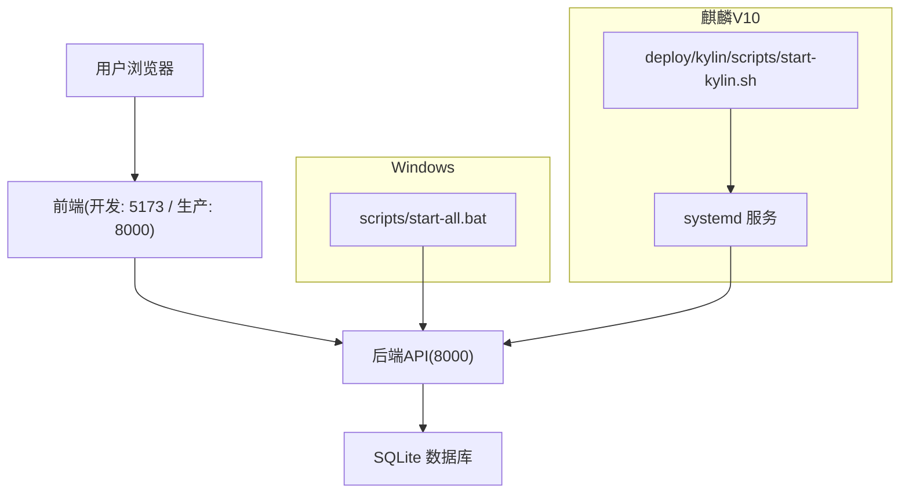
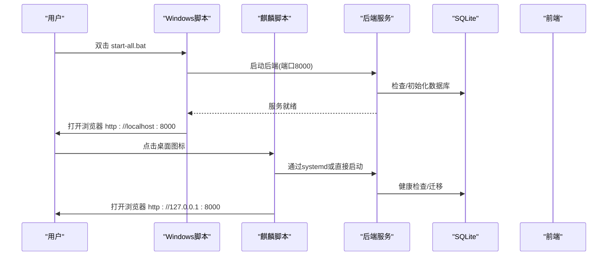
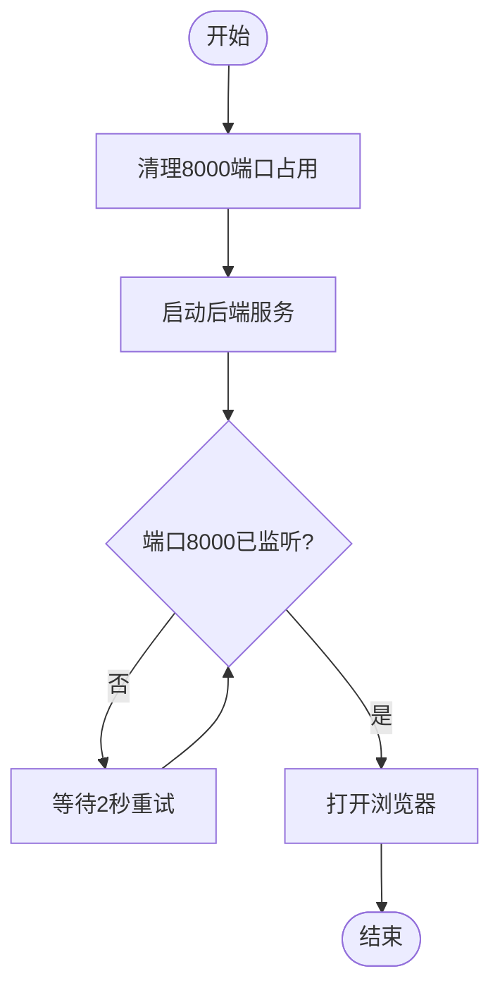
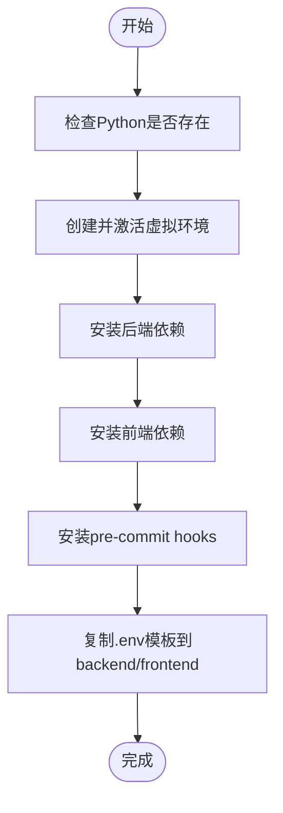
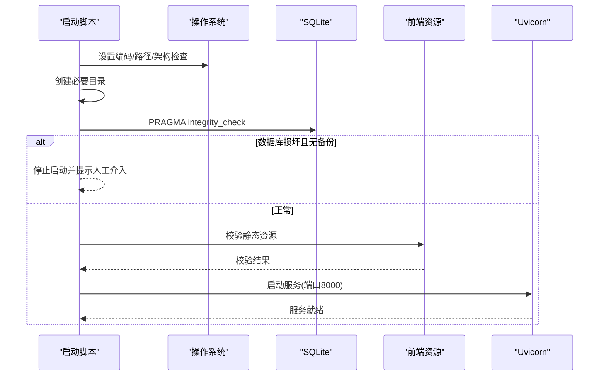
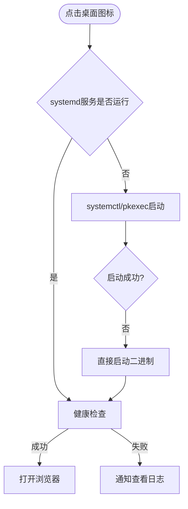
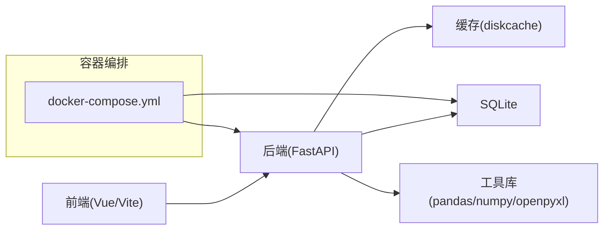

# 快速开始

<cite>
**本文引用的文件**
- [README.md](file://README.md)
- [启动指南.md](file://docs/01-快速开始/启动指南.md)
- [start-all.bat](file://scripts/start-all.bat)
- [dev-setup.bat](file://scripts/dev-setup.bat)
- [start.py](file://backend/start.py)
- [main.py](file://backend/app/main.py)
- [.env.example（后端）](file://backend/.env.example)
- [.env.example（前端）](file://frontend/.env.example)
- [package.json（前端）](file://frontend/package.json)
- [requirements.txt（后端）](file://backend/requirements.txt)
- [docker-compose.yml](file://docker-compose.yml)
- [kylin.env（麒麟配置）](file://deploy/kylin/config/kylin.env)
- [start-kylin.sh（麒麟桌面启动脚本）](file://deploy/kylin/scripts/start-kylin.sh)
</cite>

## 目录
1. [简介](#简介)
2. [项目结构](#项目结构)
3. [核心组件](#核心组件)
4. [架构总览](#架构总览)
5. [详细组件分析](#详细组件分析)
6. [依赖关系分析](#依赖关系分析)
7. [性能注意事项](#性能注意事项)
8. [故障排除指南](#故障排除指南)
9. [结论](#结论)
10. [附录](#附录)

## 简介
本指南面向首次接触“乡村振兴帮扶管理信息系统”的用户，目标是帮助你在最短时间内完成环境准备、安装配置与首次运行，并顺利访问前端界面与API文档。系统支持 Windows 10/11 与 麒麟 V10 ARM64，提供一键启动脚本与开发环境初始化脚本，内置 SQLite 数据库，默认管理员账号在首次启动时创建或从环境变量注入，首次登录强制修改密码。

## 项目结构
- 后端：FastAPI + SQLAlchemy + Alembic，默认使用 SQLite 数据文件；提供健康检查与 API 文档端点。
- 前端：Vue 3 + TypeScript + Vite，开发模式监听本地端口并提供热更新。
- 桌面集成：Windows 批处理一键启动；麒麟 V10 systemd 服务与桌面启动脚本。
- 部署：提供 Docker Compose 编排，便于容器化运行。

图表来源
- [start-all.bat:1-73](file://scripts/start-all.bat#L1-L73)
- [start-kylin.sh:1-167](file://deploy/kylin/scripts/start-kylin.sh#L1-L167)
- [docker-compose.yml:15-72](file://docker-compose.yml#L15-L72)

章节来源
- [README.md:30-70](file://README.md#L30-L70)
- [启动指南.md:12-57](file://docs/01-快速开始/启动指南.md#L12-L57)

## 核心组件
- 后端启动入口：负责环境预检、目录创建、数据库完整性检查、静态资源校验、Uvicorn 启动。
- 一键启动脚本：Windows 下清理端口、启动后端、等待就绪并打开浏览器。
- 开发环境初始化：创建 Python 虚拟环境、安装前后端依赖、生成 .env 模板、安装 Git hooks。
- 麒麟桌面启动：通过 systemd 或直启二进制，健康检查后自动打开浏览器。
- 环境变量：后端 SECRET_KEY、CORS、CSRF、数据库路径等；前端 API 地址、离线地图等。

章节来源
- [start.py:484-559](file://backend/start.py#L484-L559)
- [start-all.bat:13-70](file://scripts/start-all.bat#L13-L70)
- [dev-setup.bat:10-69](file://scripts/dev-setup.bat#L10-L69)
- [start-kylin.sh:78-162](file://deploy/kylin/scripts/start-kylin.sh#L78-L162)
- [.env.example（后端）:1-80](file://backend/.env.example#L1-L80)
- [.env.example（前端）:1-51](file://frontend/.env.example#L1-L51)

## 架构总览
系统采用前后端分离架构：前端通过 Vite 提供开发服务器，生产模式下由后端静态托管或通过 Nginx 反向代理；后端以 FastAPI 暴露 RESTful API，使用 Alembic 进行数据库迁移，SQLite 作为默认存储。桌面侧提供跨平台启动能力，确保在 Windows 和麒麟 V10 上均可一键运行。

图表来源
- [start-all.bat:27-70](file://scripts/start-all.bat#L27-L70)
- [start-kylin.sh:78-162](file://deploy/kylin/scripts/start-kylin.sh#L78-L162)
- [start.py:513-559](file://backend/start.py#L513-L559)

## 详细组件分析

### 一键启动（Windows）
- 功能：清理占用端口、启动后端、轮询等待服务就绪、自动打开浏览器。
- 关键行为：
  - 检测并终止占用 8000 端口的进程。
  - 启动后端服务后，循环检查端口监听状态直至就绪。
  - 成功后提示访问地址与默认管理员账号信息。

图表来源
- [start-all.bat:13-70](file://scripts/start-all.bat#L13-L70)

章节来源
- [start-all.bat:13-70](file://scripts/start-all.bat#L13-L70)

### 开发环境初始化
- 功能：创建 Python 虚拟环境、安装后端依赖、安装前端依赖、安装 pre-commit hooks、复制 .env 模板。
- 关键行为：
  - 若未找到 Python 则提示安装 3.11 64-bit。
  - 自动创建 backend/.venv 并安装 requirements.txt。
  - 前端执行 npm install 并使用 legacy peer deps。
  - 生成 backend/.env 与 frontend/.env（如不存在）。

图表来源
- [dev-setup.bat:10-69](file://scripts/dev-setup.bat#L10-L69)

章节来源
- [dev-setup.bat:10-69](file://scripts/dev-setup.bat#L10-L69)

### 后端启动流程与健壮性
- 功能：编码修复、路径修正、架构检查、VC++运行时检查、端口可用性检查、目录创建、数据库完整性检查、静态资源校验、Uvicorn 启动。
- 关键行为：
  - 修复无控制台模式下的 stdout/stderr 重定向问题。
  - 检查 Python 架构与 VC++ DLL。
  - 每24小时对 SQLite 执行完整性检查，异常时尝试从备份恢复或按策略停止启动。
  - 校验前端静态资源完整性，缺失则拒绝启动并给出修复指引。
  - 启动前打印 API 文档地址。

图表来源
- [start.py:13-24](file://backend/start.py#L13-L24)
- [start.py:77-123](file://backend/start.py#L77-L123)
- [start.py:217-347](file://backend/start.py#L217-L347)
- [start.py:376-482](file://backend/start.py#L376-L482)
- [start.py:484-559](file://backend/start.py#L484-L559)

章节来源
- [start.py:484-559](file://backend/start.py#L484-L559)

### 麒麟 V10 桌面启动
- 功能：优先通过 systemd 启动服务，失败则回退直接启动二进制；健康检查后自动打开浏览器。
- 关键行为：
  - 使用 systemctl 或 pkexec 启动服务。
  - 健康检查支持 curl/wget 或 bash /dev/tcp 回退。
  - 若系统目录不可写，自动降级至用户目录并重新导出环境变量。
  - 按优先级尝试多种浏览器打开应用。

图表来源
- [start-kylin.sh:78-162](file://deploy/kylin/scripts/start-kylin.sh#L78-L162)

章节来源
- [start-kylin.sh:78-162](file://deploy/kylin/scripts/start-kylin.sh#L78-L162)
- [kylin.env:6-49](file://deploy/kylin/config/kylin.env#L6-L49)

### 默认管理员与初始设置
- 管理员账户：首次启动时自动创建或从环境变量注入；首次登录强制修改密码。
- 密码来源优先级：DEFAULT_ADMIN_PASSWORD 环境变量 > 出厂默认密码；均标记为必须修改。
- 解锁机制：每次启动自动解锁过期锁定账户，避免离线单机场景下被永久锁定。
- 安全建议：生产环境务必设置 DEFAULT_ADMIN_PASSWORD，避免使用出厂默认密码。

章节来源
- [main.py:666-707](file://backend/app/main.py#L666-L707)
- [kylin.env:46-49](file://deploy/kylin/config/kylin.env#L46-L49)

### 访问地址与文档
- 前端（开发）：http://localhost:5173
- 前端（生产）：http://localhost:8000
- API 文档：http://localhost:8000/docs
- 健康检查：http://localhost:8000/health

章节来源
- [README.md:61-69](file://README.md#L61-L69)
- [启动指南.md:169-179](file://docs/01-快速开始/启动指南.md#L169-L179)

## 依赖关系分析
- 后端依赖：FastAPI、SQLAlchemy、Alembic、PyJWT、bcrypt、pydantic、openpyxl、pandas、numpy 等。
- 前端依赖：Vue 3、TypeScript、Vite、Element Plus、ECharts、Pinia、Axios 等。
- 容器化：Docker Compose 定义 assistance-system、可选 postgres/redis/nginx 服务，端口映射与环境变量可配置。

图表来源
- [requirements.txt:1-137](file://backend/requirements.txt#L1-L137)
- [package.json:1-73](file://frontend/package.json#L1-L73)
- [docker-compose.yml:15-72](file://docker-compose.yml#L15-L72)

章节来源
- [requirements.txt:1-137](file://backend/requirements.txt#L1-L137)
- [package.json:1-73](file://frontend/package.json#L1-L73)
- [docker-compose.yml:15-72](file://docker-compose.yml#L15-L72)

## 性能注意事项
- 内存与CPU：推荐至少 8GB 内存，CPU 2核以上；容器限制可参考 compose 中的 memory/cpus 配置。
- 数据库：SQLite 适合单机离线场景；生产或多机协同建议使用 PostgreSQL（compose 已提供 profile）。
- 缓存：启用 diskcache 与内存 LRU 提升热点数据访问性能。
- 静态资源：生产构建前端并通过后端或 Nginx 托管，减少请求开销。

[本节为通用指导，不直接分析具体文件]

## 故障排除指南
- 端口被占用
  - 现象：启动时报端口占用或无法监听。
  - 解决：使用一键脚本自动清理；或手动关闭占用进程；修改端口后重启。
  - 参考：脚本会检测并终止占用进程，必要时提示手动释放。

- Python 模块未找到
  - 现象：ModuleNotFoundError。
  - 解决：进入 backend 目录安装依赖；或使用 dev-setup 脚本初始化。

- Node.js 依赖安装失败
  - 现象：npm install 报错。
  - 解决：删除 node_modules 与 lock 文件后重试；或使用 dev-setup 脚本。

- 数据库初始化失败
  - 现象：数据库无法创建或迁移失败。
  - 解决：删除现有数据库文件后重新启动；或检查磁盘权限与备份目录。

- CORS 错误
  - 现象：浏览器控制台 CORS 拦截。
  - 解决：检查后端 .env 中 CORS_ORIGINS，包含前端开发地址。

- 前端无法连接后端
  - 现象：ERR_CONNECTION_REFUSED。
  - 解决：确认后端已启动且端口正确；检查防火墙；核对前端 .env 的 API 地址。

- 页面白屏或加载失败
  - 现象：前端白屏或资源404。
  - 解决：执行前端构建并同步静态资源；清除浏览器缓存后重试。

- 麒麟服务启动超时
  - 现象：桌面启动后长时间无响应。
  - 解决：查看 systemd 日志或应用日志；检查系统目录权限与降级路径。

章节来源
- [start-all.bat:13-46](file://scripts/start-all.bat#L13-L46)
- [start.py:126-214](file://backend/start.py#L126-L214)
- [启动指南.md:182-251](file://docs/01-快速开始/启动指南.md#L182-L251)
- [start-kylin.sh:104-136](file://deploy/kylin/scripts/start-kylin.sh#L104-L136)

## 结论
通过一键启动脚本与完善的启动自检逻辑，系统可在 Windows 与麒麟 V10 上快速运行。首次启动会自动创建管理员账户并提示修改密码，同时提供 API 文档与健康检查端点。建议在生产环境设置强密码与合适的数据库与缓存配置，以获得更稳定与安全的运行体验。

[本节为总结，不直接分析具体文件]

## 附录

### 环境要求与一键命令
- 最低要求：Windows 10/11 或 麒麟 V10 ARM64；内存 4GB；硬盘 2GB。
- 推荐配置：内存 8GB；硬盘 5GB。
- 一键启动：
  - Windows：scripts\start-all.bat
  - Linux/麒麟：deploy/kylin/scripts/start-kylin.sh 或 systemd 服务
- 开发环境：
  - Windows：scripts\dev-setup.bat
  - Linux：bash scripts/dev-setup.sh

章节来源
- [README.md:30-59](file://README.md#L30-L59)
- [启动指南.md:12-57](file://docs/01-快速开始/启动指南.md#L12-L57)

### 默认账号与首次登录
- 默认管理员：admin
- 密码来源：
  - 环境变量 DEFAULT_ADMIN_PASSWORD（推荐）
  - 出厂默认密码（安装包开箱即用，首次登录强制修改）
- 首次登录后请立即修改密码。

章节来源
- [main.py:666-707](file://backend/app/main.py#L666-L707)
- [kylin.env:46-49](file://deploy/kylin/config/kylin.env#L46-L49)

### 访问地址与文档
- 前端（开发）：http://localhost:5173
- 前端（生产）：http://localhost:8000
- API 文档：http://localhost:8000/docs
- 健康检查：http://localhost:8000/health

章节来源
- [README.md:61-69](file://README.md#L61-L69)
- [启动指南.md:169-179](file://docs/01-快速开始/启动指南.md#L169-L179)

### 环境变量要点
- 后端（backend/.env.example）
  - SECRET_KEY、DATABASE_URL、HOST、PORT、DEBUG、CORS_ORIGINS、CSRF_ENABLED、LOG_LEVEL、UPLOAD_DIR、EXPORT_DIR、CACHE_DIR、BACKUP_DIR、ENABLE_AUTO_MIGRATION 等。
- 前端（frontend/.env.example）
  - VITE_API_BASE_URL、VITE_APP_TITLE、VITE_APP_MODE、VITE_DEBUG、VITE_CSRF_ENABLED、VITE_OFFLINE_MODE、地图相关配置等。
- 麒麟专用（deploy/kylin/config/kylin.env）
  - 数据库路径、数据目录、日志目录、前端静态路径、CORS、CSRF、默认管理员用户名与密码策略。

章节来源
- [.env.example（后端）:1-80](file://backend/.env.example#L1-L80)
- [.env.example（前端）:1-51](file://frontend/.env.example#L1-L51)
- [kylin.env:6-49](file://deploy/kylin/config/kylin.env#L6-L49)

### 容器化运行
- 使用 docker-compose 启动 assistance-system 服务，端口映射 HTTP_PORT=8000、FRONTEND_PORT=3000。
- 可选服务：postgres、redis、nginx（通过 profiles 控制）。
- 数据持久化：data、logs、backups 目录挂载。

章节来源
- [docker-compose.yml:15-72](file://docker-compose.yml#L15-L72)