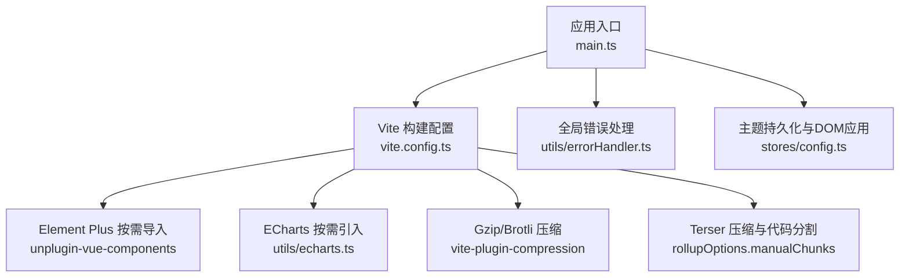
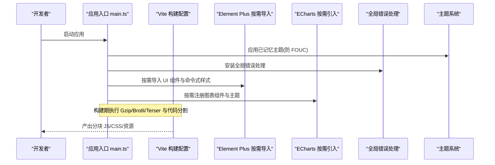
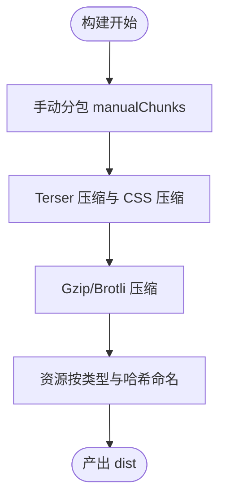
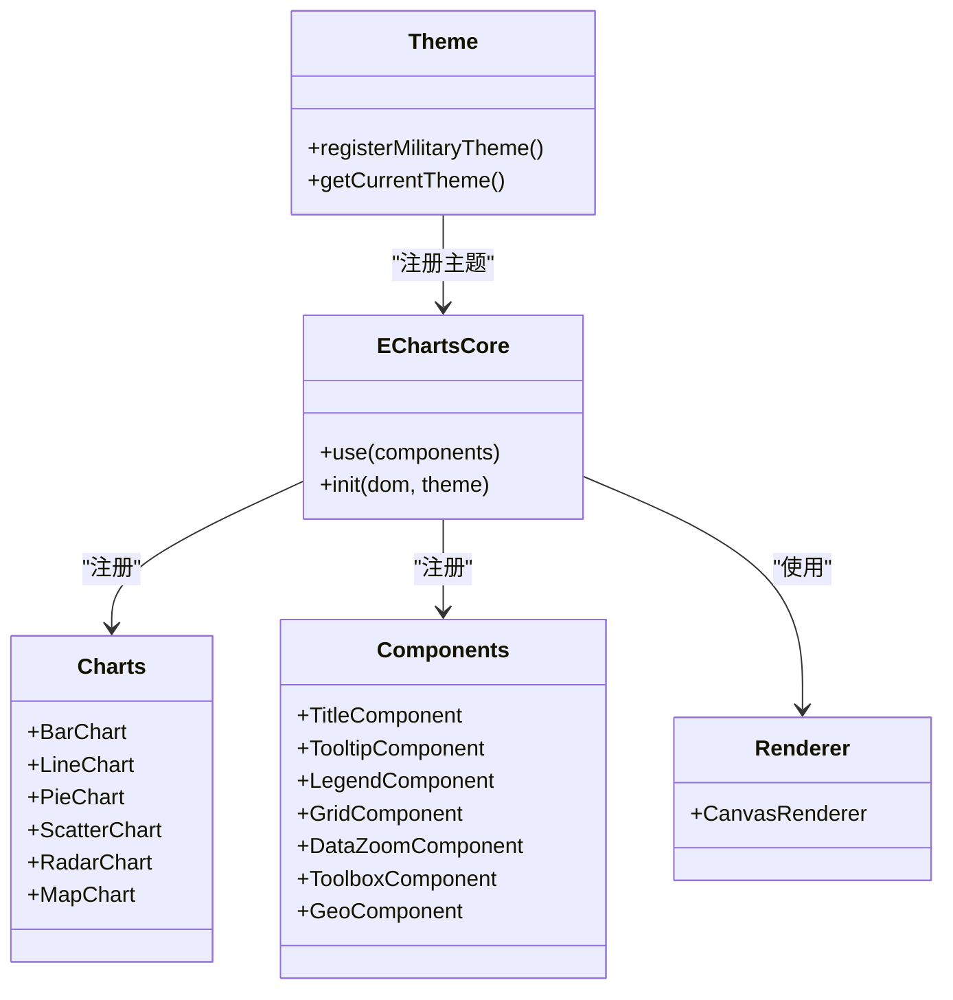
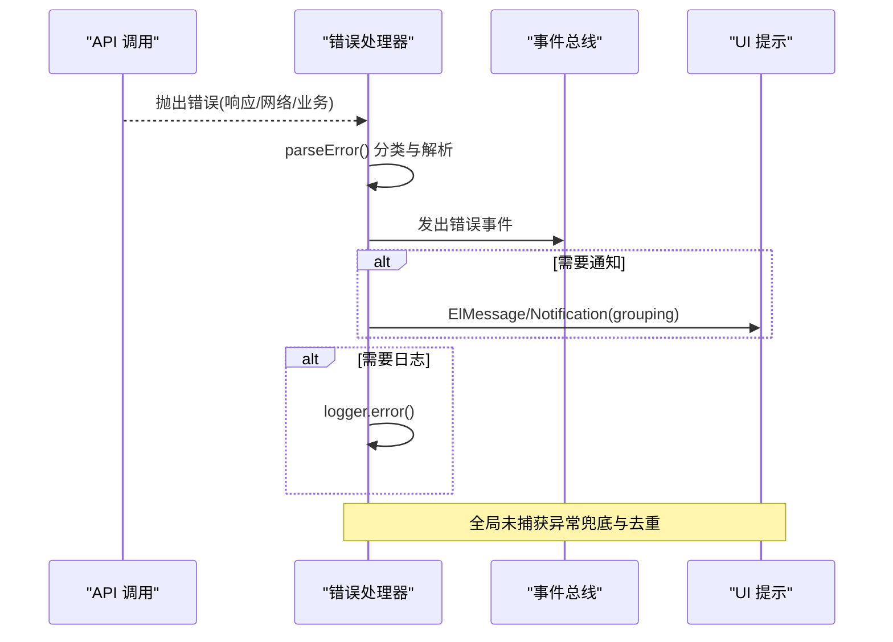
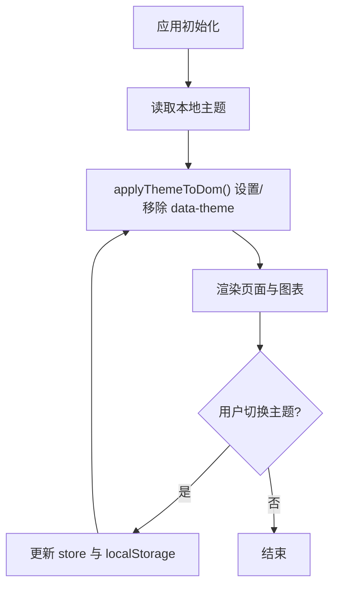
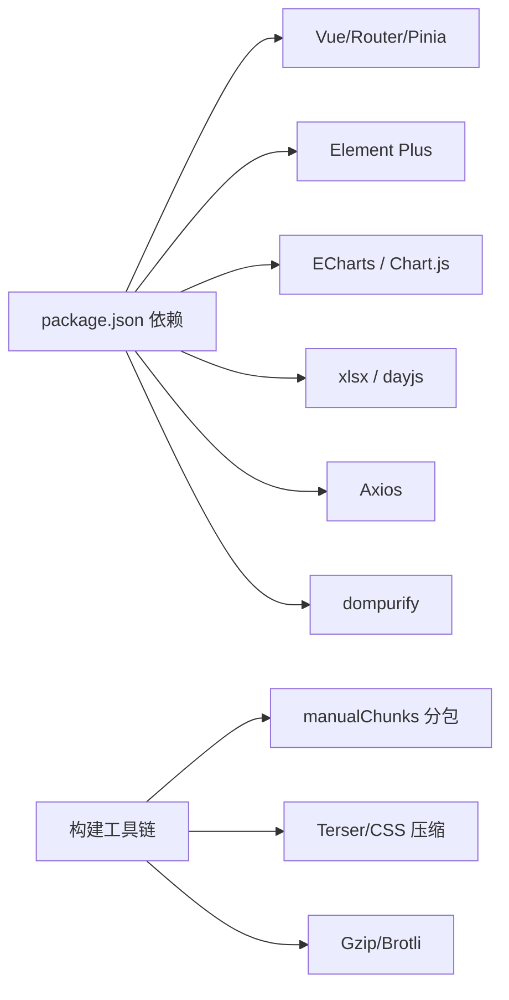

# 前端性能优化

<cite>
**本文引用的文件**
- [frontend/package.json](file://frontend/package.json)
- [frontend/vite.config.ts](file://frontend/vite.config.ts)
- [frontend/src/main.ts](file://frontend/src/main.ts)
- [frontend/src/utils/echarts.ts](file://frontend/src/utils/echarts.ts)
- [frontend/src/utils/echarts-theme.ts](file://frontend/src/utils/echarts-theme.ts)
- [frontend/src/utils/errorHandler.ts](file://frontend/src/utils/errorHandler.ts)
- [frontend/src/stores/config.ts](file://frontend/src/stores/config.ts)
</cite>

## 目录
1. [简介](#简介)
2. [项目结构](#项目结构)
3. [核心组件](#核心组件)
4. [架构总览](#架构总览)
5. [详细组件分析](#详细组件分析)
6. [依赖分析](#依赖分析)
7. [性能考量](#性能考量)
8. [故障排查指南](#故障排查指南)
9. [结论](#结论)
10. [附录](#附录)

## 简介
本文件聚焦于本项目的前端性能优化实践，覆盖 Vue 3 渲染优化、虚拟滚动与懒加载、ECharts 图表性能优化、大数据量渲染与内存泄漏防护、构建期资源压缩与代码分割、缓存策略、性能监控、用户体验优化、移动端适配、浏览器兼容性、网络请求优化与前端错误监控等主题。内容基于仓库中 Vite 构建配置、入口初始化、ECharts 按需引入与主题注册、全局错误处理与提示去重、主题持久化等实现进行系统化梳理与可视化说明。

## 项目结构
前端采用 Vue 3 + Vite 技术栈，通过插件与构建配置实现：
- Element Plus 按需自动导入与样式注入
- ECharts 按需引入与主题注册
- Gzip/Brotli 压缩、Terser 压缩与 CSS 压缩
- 精细化的 chunk 拆分与静态资源命名
- SPA 历史路由回退、开发代理与预览服务
- 版本信息生成与模块预加载

**图示来源**
- [frontend/src/main.ts:1-69](file://frontend/src/main.ts#L1-L69)
- [frontend/vite.config.ts:1-472](file://frontend/vite.config.ts#L1-L472)
- [frontend/src/utils/echarts.ts:1-37](file://frontend/src/utils/echarts.ts#L1-L37)
- [frontend/src/utils/errorHandler.ts:1-487](file://frontend/src/utils/errorHandler.ts#L1-L487)
- [frontend/src/stores/config.ts:1-51](file://frontend/src/stores/config.ts#L1-L51)

**章节来源**
- [frontend/vite.config.ts:1-472](file://frontend/vite.config.ts#L1-L472)
- [frontend/package.json:1-73](file://frontend/package.json#L1-L73)

## 核心组件
- 构建与打包（Vite）：提供按需导入、压缩、代码分割、资源命名、SPA 回退、代理与预览等能力。
- 图表库（ECharts）：按需注册组件与渲染器，统一科技风主题，避免全量引入。
- 错误处理与提示：统一错误解析、策略分发、事件总线通知、全局未捕获异常兜底与消息去重。
- 主题系统：持久化主题并应用到 DOM，避免首屏闪烁（FOUC），为 ECharts 暗色模式提供依据。

**章节来源**
- [frontend/vite.config.ts:1-472](file://frontend/vite.config.ts#L1-L472)
- [frontend/src/utils/echarts.ts:1-37](file://frontend/src/utils/echarts.ts#L1-L37)
- [frontend/src/utils/errorHandler.ts:1-487](file://frontend/src/utils/errorHandler.ts#L1-L487)
- [frontend/src/stores/config.ts:1-51](file://frontend/src/stores/config.ts#L1-L51)

## 架构总览
下图展示从应用启动到构建产物的关键路径：入口初始化、按需导入、主题应用、错误处理安装、以及构建期的压缩与分包。

**图示来源**
- [frontend/src/main.ts:1-69](file://frontend/src/main.ts#L1-L69)
- [frontend/vite.config.ts:1-472](file://frontend/vite.config.ts#L1-L472)
- [frontend/src/utils/echarts.ts:1-37](file://frontend/src/utils/echarts.ts#L1-L37)
- [frontend/src/utils/errorHandler.ts:1-487](file://frontend/src/utils/errorHandler.ts#L1-L487)
- [frontend/src/stores/config.ts:1-51](file://frontend/src/stores/config.ts#L1-L51)

## 详细组件分析

### Vite 构建与代码分割
- 按需导入：Element Plus 通过 unplugin-vue-components 与 ElementPlusResolver 实现组件与样式按需引入，减少首屏体积。
- 压缩策略：生产环境启用 Gzip 与 Brotli 双压缩；Terser 移除 console/debugger、死代码、内联变量、合并声明等；CSS 压缩开启。
- 代码分割：manualChunks 将 Vue/Pinia/Router/Axios/ECharts/Chart.js/XLSX/SortableJS/安全库等拆分为独立 chunk，避免 vendor 整包过大；视图与第三方库按类型输出到不同目录。
- 资源命名：JS/CSS/图片/字体等资源按类型与哈希命名，利于长期缓存。
- 其他优化：跳过损坏目录监听、SPA 回退中间件、JSON 命名导出、Worker ES 格式、模块预加载 polyfill。

**图示来源**
- [frontend/vite.config.ts:211-426](file://frontend/vite.config.ts#L211-L426)

**章节来源**
- [frontend/vite.config.ts:1-472](file://frontend/vite.config.ts#L1-L472)

### ECharts 按需引入与主题
- 按需注册：仅引入需要的图表类型与组件（柱/线/饼/散点/雷达/地图、标题/提示框/图例/网格/缩放/工具箱/地理），并使用 CanvasRenderer，避免全量引入。
- 主题注册：在应用初始化时注册“科技风”浅色与深色主题，支持根据 DOM data-theme 动态选择。
- 性能要点：按需引入显著降低首包体积；Canvas 渲染在大图数据下更稳定；主题注册幂等，避免重复开销。

**图示来源**
- [frontend/src/utils/echarts.ts:1-37](file://frontend/src/utils/echarts.ts#L1-L37)
- [frontend/src/utils/echarts-theme.ts:1-474](file://frontend/src/utils/echarts-theme.ts#L1-L474)

**章节来源**
- [frontend/src/utils/echarts.ts:1-37](file://frontend/src/utils/echarts.ts#L1-L37)
- [frontend/src/utils/echarts-theme.ts:1-474](file://frontend/src/utils/echarts-theme.ts#L1-L474)

### 全局错误处理与提示去重
- 错误分类：网络、认证、权限、校验、未找到、服务器、超时、业务、未知等，并提供默认策略（是否通知、日志、跳转、可重试）。
- 统一解析：Axios 响应/网络/超时/业务错误统一解析为 AppError，便于上层一致处理。
- 事件与通知：通过事件总线发布错误事件；根据策略选择 ElMessage 或自定义通知；支持 grouping 合并相同文案。
- 全局兜底：window.onerror 与 unhandledrejection 拦截，忽略 ChunkLoadError 与 ResizeObserver 良性警告；对 401、用户取消、已处理错误做静默或复用提示；同类消息短窗口去重，防止并发失败刷屏。

**图示来源**
- [frontend/src/utils/errorHandler.ts:1-487](file://frontend/src/utils/errorHandler.ts#L1-L487)

**章节来源**
- [frontend/src/utils/errorHandler.ts:1-487](file://frontend/src/utils/errorHandler.ts#L1-L487)

### 主题系统与 FOUC 防护
- 启动即应用：在挂载前读取本地存储的主题并立即应用到 DOM，避免首屏主题闪烁。
- 持久化：Pinia store 管理主题状态，变更时写入 localStorage 并同步到 DOM。
- 与 ECharts 联动：通过 data-theme 属性切换 ECharts 的浅色/深色主题。

**图示来源**
- [frontend/src/stores/config.ts:1-51](file://frontend/src/stores/config.ts#L1-L51)
- [frontend/src/main.ts:39-42](file://frontend/src/main.ts#L39-L42)

**章节来源**
- [frontend/src/stores/config.ts:1-51](file://frontend/src/stores/config.ts#L1-L51)
- [frontend/src/main.ts:1-69](file://frontend/src/main.ts#L1-L69)

## 依赖分析
- 运行时依赖：Vue、Vue Router、Pinia、Axios、ECharts、Chart.js、Element Plus、xlsx、dayjs、dompurify、sortablejs 等。
- 构建依赖：Vite、@vitejs/plugin-vue、unplugin-auto-import、unplugin-vue-components、terser、vite-plugin-compression、vitest、eslint 系列等。
- 分包策略：将高频库（vue-core、pinia、axios）、图表库（echarts、chartjs）、表格库（xlsx）、拖拽（sortable）、安全（dompurify）等独立成 chunk，避免首屏冗余。

**图示来源**
- [frontend/package.json:1-73](file://frontend/package.json#L1-L73)
- [frontend/vite.config.ts:286-359](file://frontend/vite.config.ts#L286-L359)

**章节来源**
- [frontend/package.json:1-73](file://frontend/package.json#L1-L73)
- [frontend/vite.config.ts:286-359](file://frontend/vite.config.ts#L286-L359)

## 性能考量
- Vue 3 渲染优化
  - 组件级按需导入：通过 unplugin-vue-components 与 ElementPlusResolver，仅引入模板中使用的组件与样式，减少首屏体积与解析时间。
  - 路由与重型依赖懒加载：ECharts、Chart.js、xlsx、driver.js 等通过 manualChunks 与源码侧动态 import 实现按需加载，避免进入首屏依赖图。
  - 主题提前应用：在挂载前应用主题，避免 FOUC 导致的重排与重绘。
- 虚拟滚动与大数据渲染
  - 列表页建议结合虚拟滚动方案（如基于 IntersectionObserver 的分片渲染或专用虚拟列表组件），仅渲染可视区域节点，降低 DOM 节点数量与重排成本。
  - 图表大数据场景优先使用 Canvas 渲染（ECharts 默认），配合 dataZoom 与分页/采样策略，避免一次性绘制过多数据点。
- 懒加载与资源优化
  - 构建期 Gzip/Brotli 压缩与 Terser 深度优化，移除无用代码与调试输出，提升传输与执行效率。
  - 资源按类型与哈希命名，配合服务端缓存策略（Cache-Control/ETag）实现长期缓存。
- 内存泄漏防护
  - 图表实例销毁：在组件卸载时调用 dispose() 释放 Canvas 与事件监听，避免内存累积。
  - 事件与定时器清理：确保在 onUnmounted 中移除全局事件监听与定时任务。
  - 大对象引用释放：避免在闭包中持有长生命周期引用，及时置空或替换为弱引用。
- 网络请求优化
  - 统一错误处理与提示去重：减少并发失败时的重复 UI 抖动与日志噪声。
  - 合理超时与重试：对可重试错误提供指数退避与最大重试次数，避免雪崩。
  - 接口层缓存：对读多写少的数据使用短期缓存（内存/IndexedDB），降低重复请求。
- 移动端适配与体验
  - 视口与触摸交互：确保点击区域与滑动流畅，避免阻塞主线程的重计算。
  - 图片与媒体：使用合适尺寸与格式（WebP/AVIF），按需加载与懒加载。
- 浏览器兼容性
  - 目标环境 es2020，兼容现代浏览器；Safari 10 相关选项已开启；按需 polyfill 与特性检测保证降级体验。
- 性能监控
  - 利用构建产物大小报告（reportCompressedSize）评估影响；结合浏览器 Performance API 与错误上报，持续追踪 LCP/FID/CLS 等指标。

[本节为通用指导，不直接分析具体文件]

## 故障排查指南
- 常见问题定位
  - 首屏体积过大：检查 manualChunks 是否生效，确认 ECharts/Chart.js/xlsx 等是否被正确拆分；查看构建报告中的 chunk 大小。
  - 图表卡顿或内存增长：确认是否每次创建新实例而未销毁旧实例；检查数据量是否过大，考虑分页/采样/dataZoom。
  - 提示刷屏：确认全局错误处理是否启用 grouping 与去重逻辑；检查是否在多处重复触发相同错误提示。
  - 主题闪烁：确认在挂载前是否正确应用主题；检查是否存在异步覆盖 data-theme 的行为。
- 快速验证步骤
  - 使用 vite preview 模拟生产环境，观察网络面板与性能面板。
  - 在控制台搜索 ChunkLoadError 与 ResizeObserver 相关日志，确认已被忽略或正确处理。
  - 切换主题后刷新页面，验证 localStorage 与 DOM data-theme 的一致性。

**章节来源**
- [frontend/src/utils/errorHandler.ts:393-473](file://frontend/src/utils/errorHandler.ts#L393-L473)
- [frontend/vite.config.ts:211-426](file://frontend/vite.config.ts#L211-L426)
- [frontend/src/stores/config.ts:25-47](file://frontend/src/stores/config.ts#L25-L47)

## 结论
本项目在前端性能方面已形成较为完善的体系：以 Vite 为核心的构建优化（按需导入、压缩、代码分割）、ECharts 按需引入与主题管理、全局错误处理与提示去重、主题持久化与 FOUC 防护。在此基础上，建议继续推进虚拟滚动、图表大数据优化、内存泄漏治理与性能监控闭环，持续提升首屏性能与运行稳定性。

## 附录
- 关键配置位置参考
  - 构建与分包：[frontend/vite.config.ts:211-426](file://frontend/vite.config.ts#L211-L426)
  - 按需导入与插件：[frontend/vite.config.ts:97-154](file://frontend/vite.config.ts#L97-L154)
  - ECharts 按需引入：[frontend/src/utils/echarts.ts:1-37](file://frontend/src/utils/echarts.ts#L1-L37)
  - ECharts 主题：[frontend/src/utils/echarts-theme.ts:1-474](file://frontend/src/utils/echarts-theme.ts#L1-L474)
  - 全局错误处理：[frontend/src/utils/errorHandler.ts:1-487](file://frontend/src/utils/errorHandler.ts#L1-L487)
  - 主题系统：[frontend/src/stores/config.ts:1-51](file://frontend/src/stores/config.ts#L1-L51)
  - 应用入口：[frontend/src/main.ts:1-69](file://frontend/src/main.ts#L1-L69)
  - 依赖清单：[frontend/package.json:1-73](file://frontend/package.json#L1-L73)