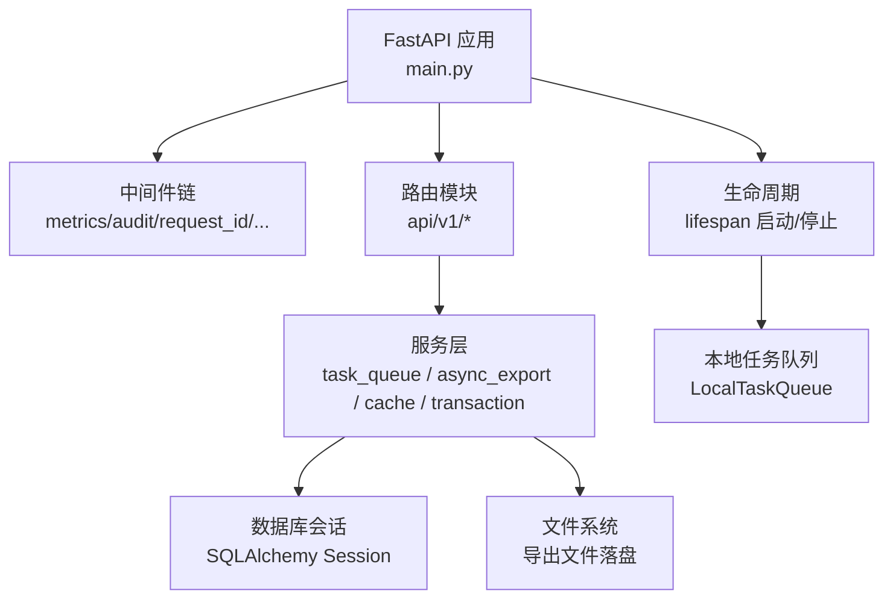
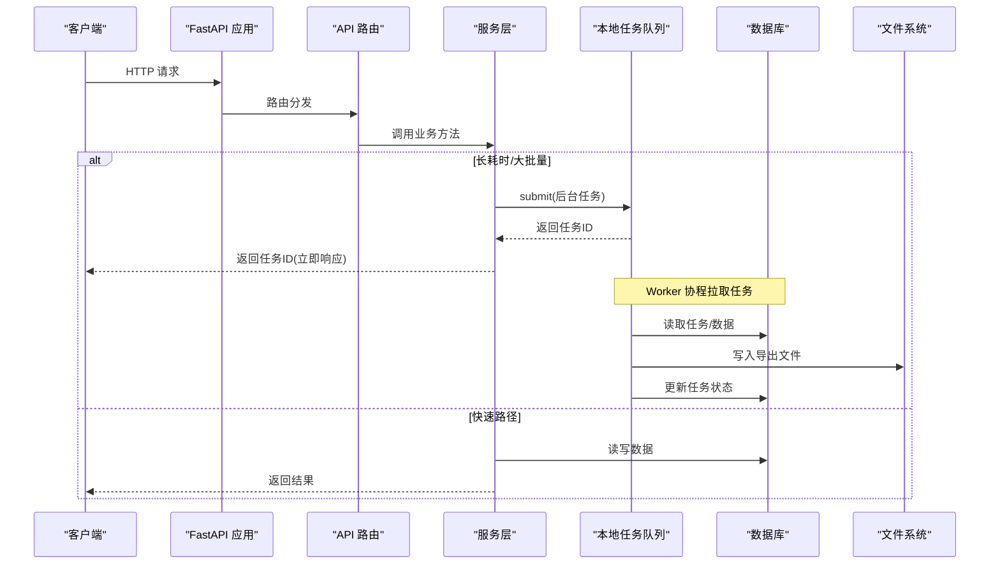
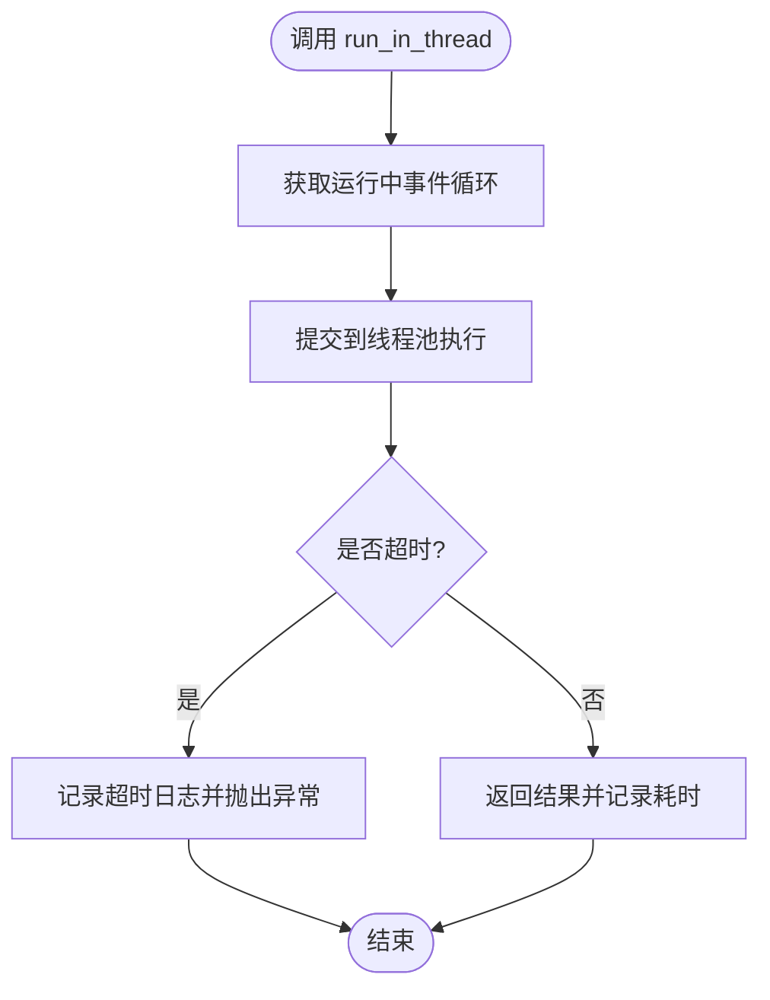
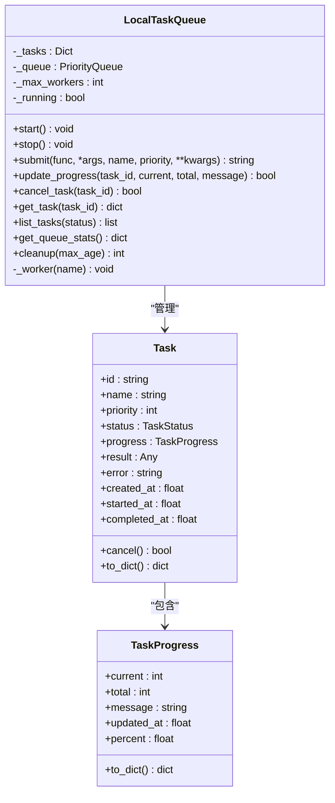
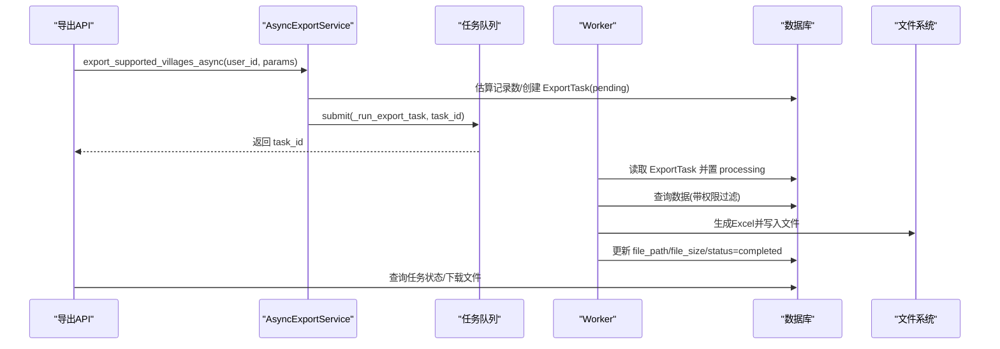
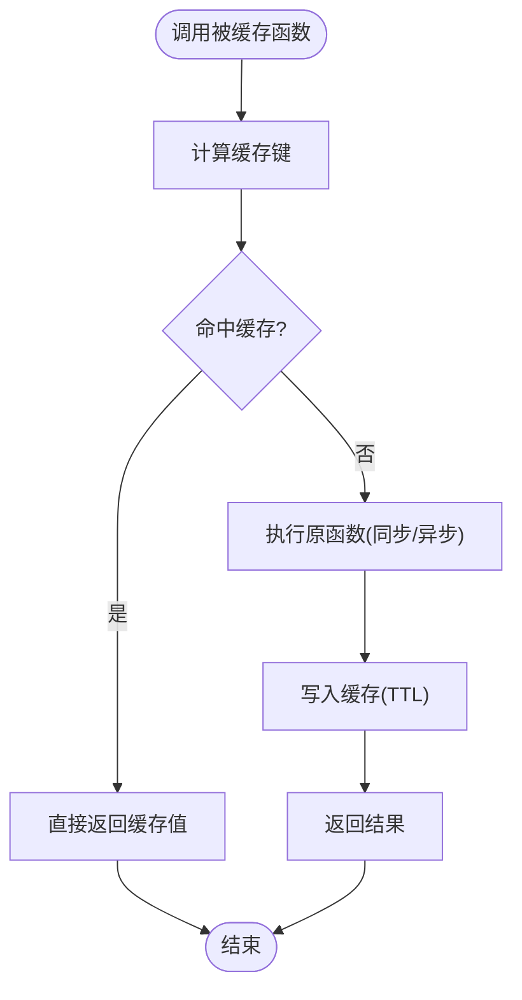
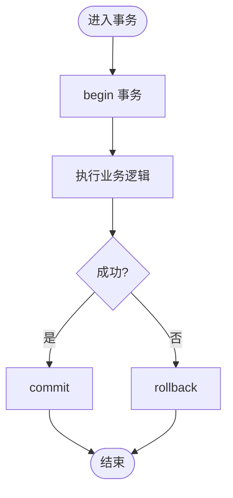
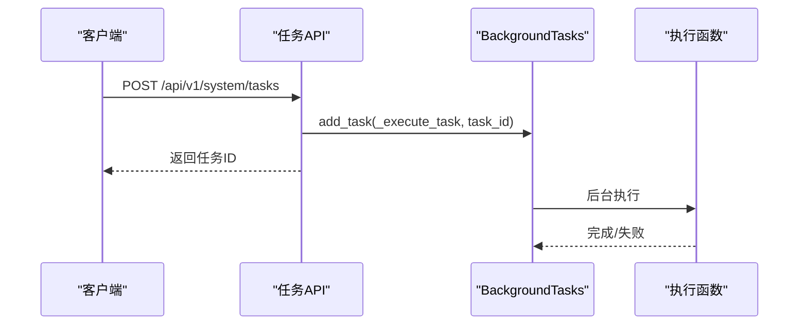
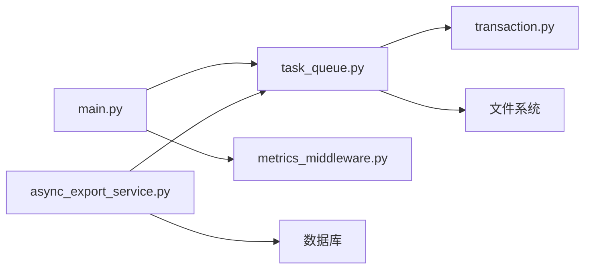

# 异步处理

<cite>
**本文引用的文件**
- [backend/app/main.py](file://backend/app/main.py)
- [backend/app/core/async_utils.py](file://backend/app/core/async_utils.py)
- [backend/app/utils/async_executor.py](file://backend/app/utils/async_executor.py)
- [backend/app/services/task_queue.py](file://backend/app/services/task_queue.py)
- [backend/app/services/async_export_service.py](file://backend/app/services/async_export_service.py)
- [backend/app/core/cache.py](file://backend/app/core/cache.py)
- [backend/app/middleware/metrics_middleware.py](file://backend/app/middleware/metrics_middleware.py)
- [backend/app/core/transaction.py](file://backend/app/core/transaction.py)
- [backend/app/api/v1/system/tasks.py](file://backend/app/api/v1/system/tasks.py)
</cite>

## 目录
1. [简介](#简介)
2. [项目结构](#项目结构)
3. [核心组件](#核心组件)
4. [架构总览](#架构总览)
5. [详细组件分析](#详细组件分析)
6. [依赖关系分析](#依赖关系分析)
7. [性能与并发优化](#性能与并发优化)
8. [故障排查指南](#故障排查指南)
9. [结论](#结论)
10. [附录](#附录)

## 简介
本文件面向“乡村振兴系统”后端，系统性梳理 FastAPI 异步编程模式、协程优化、任务队列管理、异步 I/O、并发控制、资源竞争避免等最佳实践；覆盖后台任务调度、长耗时操作处理、WebSocket 实时通信（当前实现以 HTTP 轮询为主）等场景；并提供异步错误处理、超时控制、重试机制、性能监控、调试技巧与常见问题解决方案。

## 项目结构
后端采用分层组织：入口应用、中间件、核心工具、服务层、API 路由、模型与配置。异步能力贯穿各层：
- 入口应用负责生命周期管理、中间件注册、任务队列启动/停止
- 核心工具提供线程池执行、协程聚合、事件循环安全访问
- 服务层封装业务逻辑，如异步导出、缓存、事务
- API 层通过 FastAPI 的 async/await、BackgroundTasks 暴露接口
- 中间件采集指标、审计、请求日志等横切关注点

图表来源
- [backend/app/main.py:68-98](file://backend/app/main.py#L68-L98)
- [backend/app/services/task_queue.py:124-156](file://backend/app/services/task_queue.py#L124-L156)

章节来源
- [backend/app/main.py:68-181](file://backend/app/main.py#L68-L181)

## 核心组件
- 异步工具集：线程池执行同步阻塞代码、协程限流并发、延迟与事件循环安全获取
- 本地任务队列：内存优先级队列 + 多 worker 协程，支持进度追踪、取消、清理
- 异步导出服务：大文件导出走后台任务，独立会话生成 Excel 并落盘，状态持久化
- 缓存：线程安全内存缓存，提供 async 包装与装饰器
- 事务与重试：统一事务上下文、保存点、死锁重试装饰器
- 指标中间件：ASGI 原生指标采集，记录请求数、耗时、慢请求、活跃请求

章节来源
- [backend/app/core/async_utils.py:1-124](file://backend/app/core/async_utils.py#L1-L124)
- [backend/app/utils/async_executor.py:1-127](file://backend/app/utils/async_executor.py#L1-L127)
- [backend/app/services/task_queue.py:1-307](file://backend/app/services/task_queue.py#L1-L307)
- [backend/app/services/async_export_service.py:1-516](file://backend/app/services/async_export_service.py#L1-L516)
- [backend/app/core/cache.py:1-166](file://backend/app/core/cache.py#L1-L166)
- [backend/app/core/transaction.py:1-457](file://backend/app/core/transaction.py#L1-L457)
- [backend/app/middleware/metrics_middleware.py:1-177](file://backend/app/middleware/metrics_middleware.py#L1-L177)

## 架构总览
FastAPI 应用启动时初始化数据库、迁移、默认管理员、监控与任务队列；请求进入中间件链后由路由处理，路由调用服务层完成业务逻辑；长耗时或 CPU/IO 密集型操作通过线程池或任务队列异步执行；结果可写回数据库或落盘，并通过查询接口返回任务状态。

图表来源
- [backend/app/main.py:68-98](file://backend/app/main.py#L68-L98)
- [backend/app/services/task_queue.py:158-188](file://backend/app/services/task_queue.py#L158-L188)
- [backend/app/services/async_export_service.py:330-387](file://backend/app/services/async_export_service.py#L330-L387)

## 详细组件分析

### 异步工具与协程优化
- 线程池执行同步函数：避免在事件循环中阻塞，提供超时与慢操作日志
- 协程并发限制：基于信号量的 gather_limited，控制最大并发度
- 事件循环安全：在非 async 上下文中安全获取或创建事件循环
- 后台任务创建：自动选择运行中的事件循环或缓存循环

图表来源
- [backend/app/utils/async_executor.py:47-96](file://backend/app/utils/async_executor.py#L47-L96)
- [backend/app/core/async_utils.py:35-55](file://backend/app/core/async_utils.py#L35-L55)
- [backend/app/core/async_utils.py:75-93](file://backend/app/core/async_utils.py#L75-L93)
- [backend/app/core/async_utils.py:104-123](file://backend/app/core/async_utils.py#L104-L123)

章节来源
- [backend/app/core/async_utils.py:1-124](file://backend/app/core/async_utils.py#L1-L124)
- [backend/app/utils/async_executor.py:1-127](file://backend/app/utils/async_executor.py#L1-L127)

### 本地任务队列（优先级、进度、取消）
- 任务模型：包含 ID、名称、优先级、状态、进度、时间戳、结果与错误信息
- 工作协程：从优先级队列拉取任务，支持协程函数与同步函数执行
- 进度更新：可在任务执行过程中更新 current/total/message
- 取消机制：仅对 pending/running 状态有效，worker 在执行前后检查取消标志
- 清理策略：按完成时间清理旧任务，防止内存增长

图表来源
- [backend/app/services/task_queue.py:20-122](file://backend/app/services/task_queue.py#L20-L122)
- [backend/app/services/task_queue.py:124-250](file://backend/app/services/task_queue.py#L124-L250)
- [backend/app/services/task_queue.py:251-288](file://backend/app/services/task_queue.py#L251-L288)

章节来源
- [backend/app/services/task_queue.py:1-307](file://backend/app/services/task_queue.py#L1-L307)

### 异步导出服务（长耗时操作）
- 阈值判断：超过一定记录数自动切换为异步导出
- 真实查库：按实体类型动态加载模型并构建查询，保证与同步导出口径一致
- 后台执行：通过任务队列提交 _run_export_task，使用独立会话生成 Excel 并落盘
- 状态流转：pending → processing → completed/failed，失败时记录错误信息
- 下载接口：根据 task_id 读取已生成的文件内容

图表来源
- [backend/app/services/async_export_service.py:330-387](file://backend/app/services/async_export_service.py#L330-L387)
- [backend/app/services/async_export_service.py:454-481](file://backend/app/services/async_export_service.py#L454-L481)
- [backend/app/services/task_queue.py:158-188](file://backend/app/services/task_queue.py#L158-L188)

章节来源
- [backend/app/services/async_export_service.py:1-516](file://backend/app/services/async_export_service.py#L1-L516)

### 缓存与异步兼容
- SimpleCache：线程安全内存缓存，支持 TTL、前缀删除、容量淘汰
- CacheManager：提供 await 风格的 get/set/delete
- cached 装饰器：同时支持同步与异步函数，自动缓存返回值

图表来源
- [backend/app/core/cache.py:14-95](file://backend/app/core/cache.py#L14-L95)
- [backend/app/core/cache.py:98-132](file://backend/app/core/cache.py#L98-L132)

章节来源
- [backend/app/core/cache.py:1-166](file://backend/app/core/cache.py#L1-L166)

### 事务管理与重试
- 事务上下文：统一 begin/commit/rollback，支持嵌套事务与保存点
- safe_commit：安全提交，失败时自动 rollback 并记录日志
- with_transaction：高级装饰器，支持隔离级别与只读事务
- retry_on_deadlock：检测死锁并指数退避式重试

图表来源
- [backend/app/core/transaction.py:31-73](file://backend/app/core/transaction.py#L31-L73)
- [backend/app/core/transaction.py:200-233](file://backend/app/core/transaction.py#L200-L233)
- [backend/app/core/transaction.py:292-319](file://backend/app/core/transaction.py#L292-L319)
- [backend/app/core/transaction.py:323-362](file://backend/app/core/transaction.py#L323-L362)

章节来源
- [backend/app/core/transaction.py:1-457](file://backend/app/core/transaction.py#L1-L457)

### 后台任务 API（FastAPI BackgroundTasks）
- 提供任务列表、统计、详情、创建、取消、删除等接口
- 使用 FastAPI 的 BackgroundTasks 添加后台任务，适合轻量级一次性任务
- 适用于系统维护、重启、备份等场景

图表来源
- [backend/app/api/v1/system/tasks.py:172-226](file://backend/app/api/v1/system/tasks.py#L172-L226)

章节来源
- [backend/app/api/v1/system/tasks.py:1-263](file://backend/app/api/v1/system/tasks.py#L1-L263)

### WebSocket 实时通信现状
- 前端消息中心注释表明单机版暂不启用 WebSocket，采用 HTTP 轮询获取消息
- 后端未实现 WebSocket 端点，建议后续扩展基于 Redis Pub/Sub 或内存广播的实时推送

[本节为概念性说明，不直接分析具体文件]

## 依赖关系分析
- main.py 在 lifespan 中启动任务队列，并在关闭时停止
- 异步导出服务依赖任务队列进行后台执行
- 任务队列在工作协程中使用事件循环执行同步函数（run_in_executor）
- 指标中间件采集所有 HTTP 请求的性能数据，用于监控与诊断
- 事务模块为服务层提供一致的数据库事务语义

图表来源
- [backend/app/main.py:68-98](file://backend/app/main.py#L68-L98)
- [backend/app/services/async_export_service.py:454-481](file://backend/app/services/async_export_service.py#L454-L481)
- [backend/app/services/task_queue.py:251-288](file://backend/app/services/task_queue.py#L251-L288)
- [backend/app/middleware/metrics_middleware.py:132-177](file://backend/app/middleware/metrics_middleware.py#L132-L177)

章节来源
- [backend/app/main.py:68-98](file://backend/app/main.py#L68-L98)
- [backend/app/services/async_export_service.py:454-481](file://backend/app/services/async_export_service.py#L454-L481)
- [backend/app/services/task_queue.py:251-288](file://backend/app/services/task_queue.py#L251-L288)
- [backend/app/middleware/metrics_middleware.py:132-177](file://backend/app/middleware/metrics_middleware.py#L132-L177)

## 性能与并发优化
- 线程池大小：CPU/IO 密集型操作使用固定大小的线程池，避免 SQLite 写冲突与事件循环饥饿
- 协程并发限制：使用信号量限制并发协程数量，保护下游资源（数据库、外部 API）
- 缓存：对热点查询结果设置 TTL，减少重复计算与数据库压力
- 指标监控：通过中间件采集请求耗时、错误率、慢请求，定位瓶颈
- 事务优化：批量操作分批次 flush，避免内存峰值；死锁自动重试提升鲁棒性

[本节提供通用指导，不直接分析具体文件]

## 故障排查指南
- 任务永远 pending：确认任务队列已启动且 submit 成功；检查 worker 是否正常运行
- 导出为空文件：确保异步导出服务真实查库而非依赖预置 items；核对实体映射与查询条件
- 线程池超时：调整 run_in_thread 的 timeout 参数；检查同步函数是否存在长时间阻塞
- 数据库死锁：启用 retry_on_deadlock；降低并发或优化索引以减少锁竞争
- 慢请求：查看 metrics 中间件的 slow_requests 列表；结合 SQL 查询计数中间件定位慢查询
- 事件循环问题：Windows Proactor 模式下已做修复；若出现连接重置错误，检查网络与客户端行为

章节来源
- [backend/app/services/task_queue.py:134-156](file://backend/app/services/task_queue.py#L134-L156)
- [backend/app/services/async_export_service.py:330-387](file://backend/app/services/async_export_service.py#L330-L387)
- [backend/app/utils/async_executor.py:47-96](file://backend/app/utils/async_executor.py#L47-L96)
- [backend/app/core/transaction.py:323-362](file://backend/app/core/transaction.py#L323-L362)
- [backend/app/middleware/metrics_middleware.py:42-125](file://backend/app/middleware/metrics_middleware.py#L42-L125)

## 结论
本项目在后端实现了完善的异步处理能力：通过 FastAPI 的 async/await 与 BackgroundTasks 处理短耗时任务；通过本地任务队列与线程池处理长耗时与 CPU/IO 密集型操作；配合缓存、事务、重试与指标监控，形成高可用、高性能的异步处理体系。未来可扩展 WebSocket 实时通信与分布式任务队列，进一步提升实时性与横向扩展能力。

## 附录
- 关键实践清单
  - 使用 run_in_thread 包裹同步阻塞操作，设置合理超时
  - 使用 gather_limited 控制协程并发，避免资源争用
  - 长耗时任务通过任务队列提交，返回任务 ID 供前端轮询
  - 对热点数据使用缓存，设置合适 TTL 与前缀清理
  - 使用事务上下文与保存点保证数据一致性
  - 启用指标中间件，定期分析慢请求与错误率
  - 对数据库写操作启用死锁重试，提升鲁棒性

[本节为总结性内容，不直接分析具体文件]