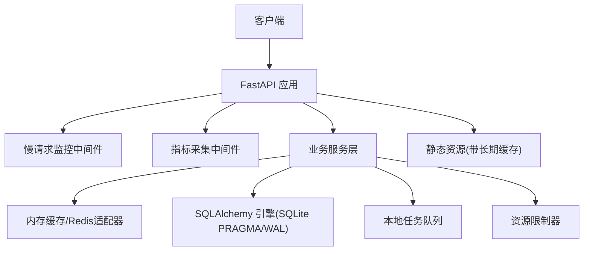
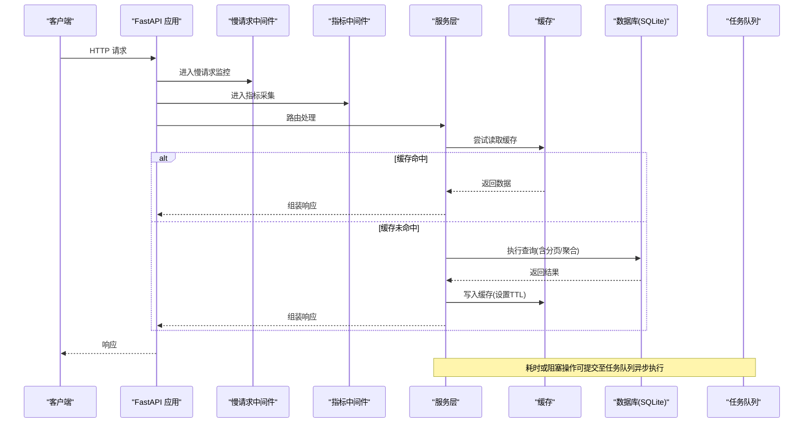
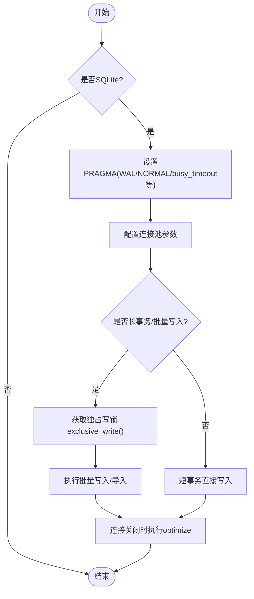
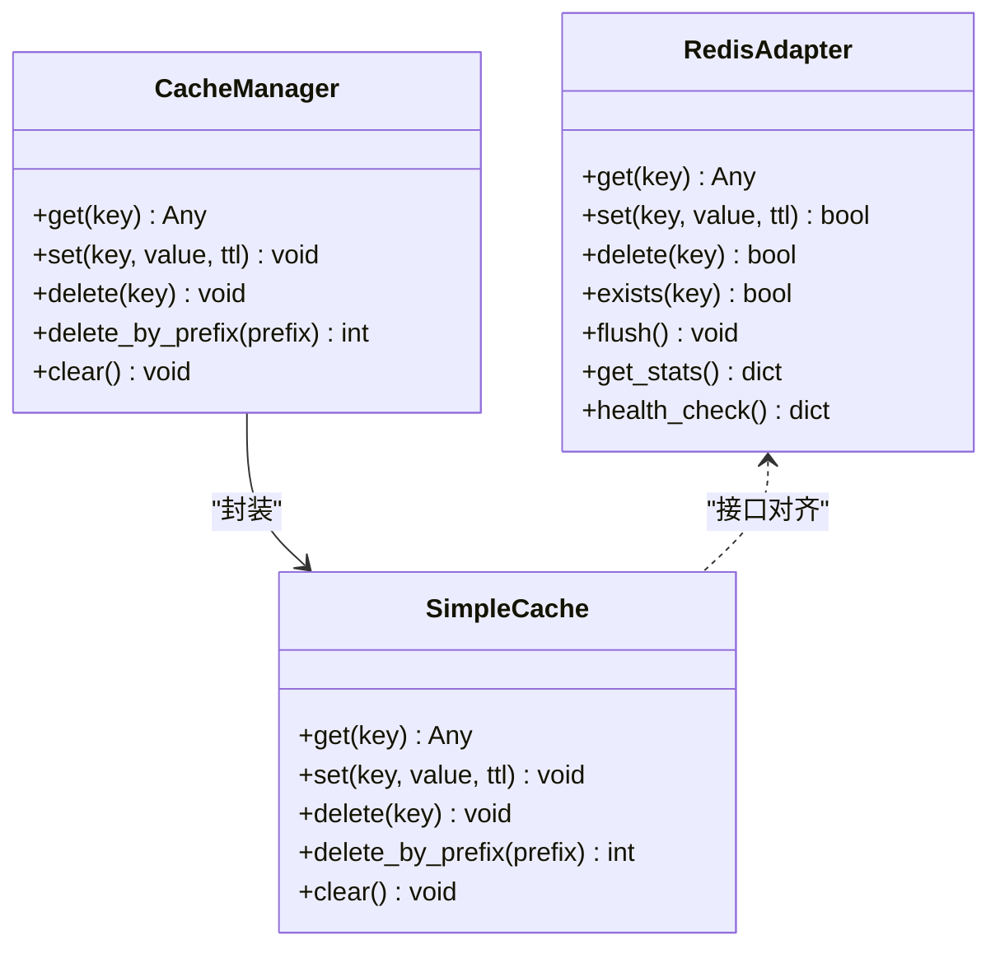
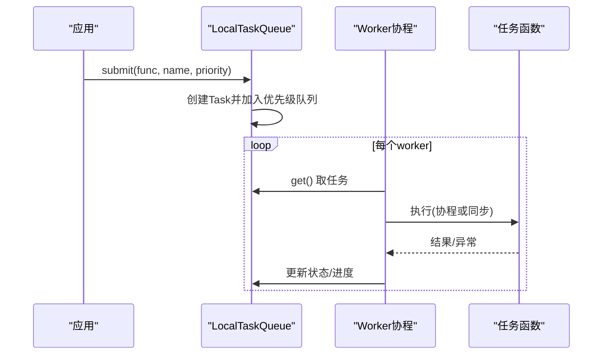
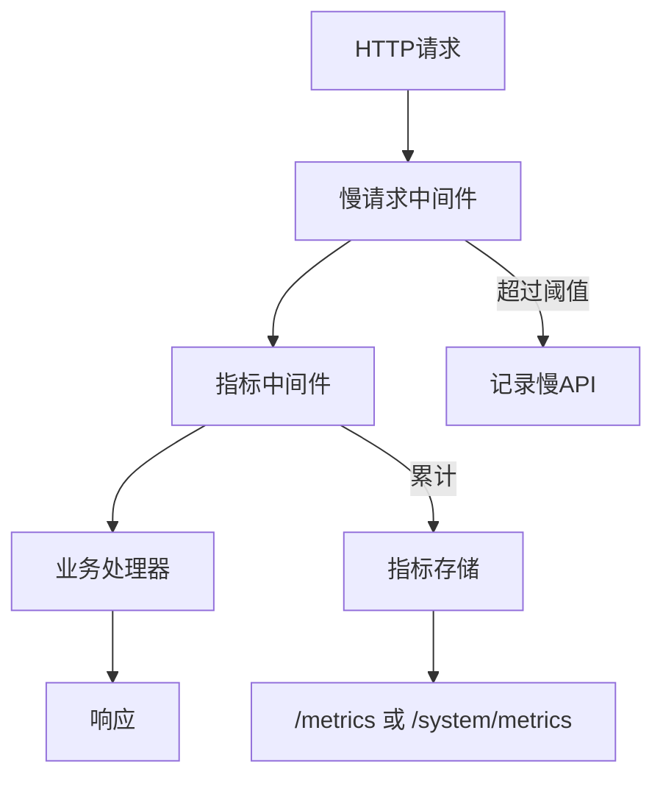
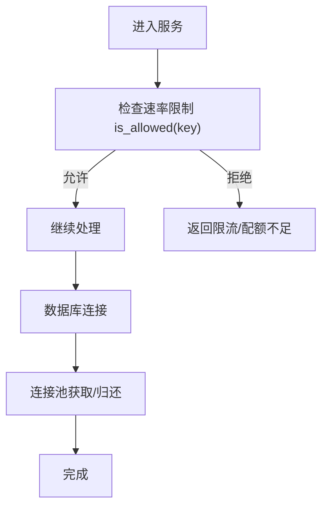
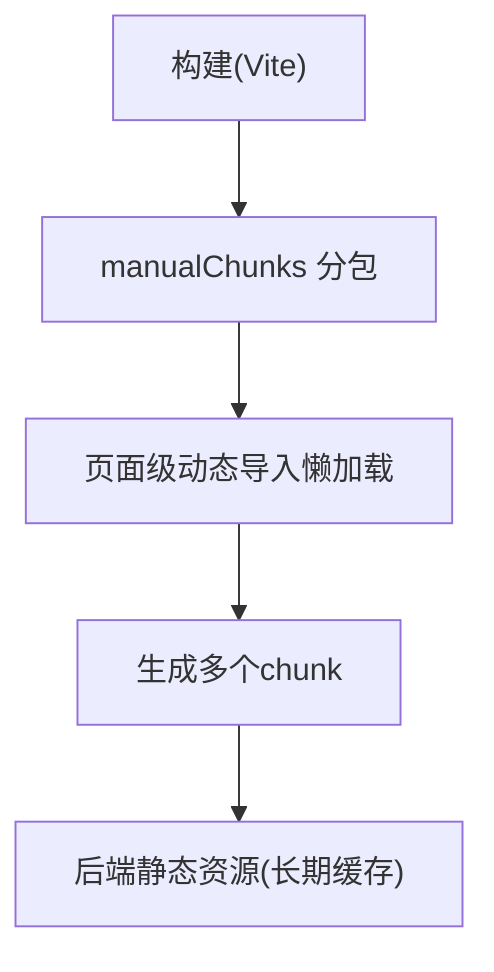
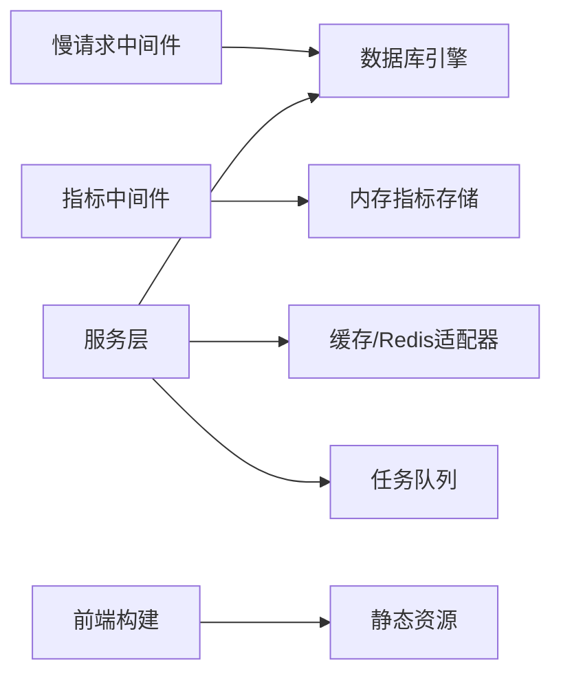

# 性能优化

<cite>
**本文引用的文件**
- [backend/app/core/database.py](file://backend/app/core/database.py)
- [backend/app/core/cache.py](file://backend/app/core/cache.py)
- [backend/app/core/query_optimizer.py](file://backend/app/core/query_optimizer.py)
- [backend/app/middleware/slow_request_monitor.py](file://backend/app/middleware/slow_request_monitor.py)
- [backend/app/middleware/metrics_middleware.py](file://backend/app/middleware/metrics_middleware.py)
- [backend/app/services/task_queue.py](file://backend/app/services/task_queue.py)
- [backend/app/services/resource_limiter.py](file://backend/app/services/resource_limiter.py)
- [backend/app/core/redis_adapter.py](file://backend/app/core/redis_adapter.py)
- [backend/scripts/performance_benchmark.py](file://backend/scripts/performance_benchmark.py)
- [backend/scripts/optimize_database.py](file://backend/scripts/optimize_database.py)
- [frontend/vite.config.ts](file://frontend/vite.config.ts)
- [backend/app/main.py](file://backend/app/main.py)
- [backend/app/api/v1/system/metrics.py](file://backend/app/api/v1/system/metrics.py)
- [docs/03-开发文档/05-性能优化/性能需求.md](file://docs/03-开发文档/05-性能优化/性能需求.md)
</cite>

## 目录
1. [简介](#简介)
2. [项目结构](#项目结构)
3. [核心组件](#核心组件)
4. [架构总览](#架构总览)
5. [详细组件分析](#详细组件分析)
6. [依赖关系分析](#依赖关系分析)
7. [性能考量](#性能考量)
8. [故障排查指南](#故障排查指南)
9. [结论](#结论)
10. [附录](#附录)

## 简介
本文件面向系统在高负载下的稳定性与响应性，围绕数据库查询优化、缓存策略、异步处理机制、前端渲染优化、慢请求监控、资源限制、连接池管理等关键能力进行系统化说明。内容基于代码库中的实际实现，提供可操作的调优建议、测试方法与问题定位技巧，帮助团队在开发与运维阶段持续保障性能指标达成。

## 项目结构
后端采用 FastAPI + SQLAlchemy（SQLite 深度优化）+ 中间件体系（慢请求、指标采集），配合本地任务队列与资源限制器；前端通过 Vite 构建产物拆分与懒加载降低首屏体积；整体形成“请求进入→中间件度量→服务层缓存/异步→数据库优化”的闭环。

**图表来源**
- [backend/app/middleware/slow_request_monitor.py:55-132](file://backend/app/middleware/slow_request_monitor.py#L55-L132)
- [backend/app/middleware/metrics_middleware.py:132-177](file://backend/app/middleware/metrics_middleware.py#L132-L177)
- [backend/app/core/database.py:55-65](file://backend/app/core/database.py#L55-L65)
- [backend/app/core/cache.py:14-96](file://backend/app/core/cache.py#L14-L96)
- [backend/app/services/task_queue.py:124-188](file://backend/app/services/task_queue.py#L124-L188)
- [backend/app/services/resource_limiter.py:41-96](file://backend/app/services/resource_limiter.py#L41-L96)
- [backend/app/main.py:290-298](file://backend/app/main.py#L290-L298)

**章节来源**
- [backend/app/middleware/slow_request_monitor.py:55-132](file://backend/app/middleware/slow_request_monitor.py#L55-L132)
- [backend/app/middleware/metrics_middleware.py:132-177](file://backend/app/middleware/metrics_middleware.py#L132-L177)
- [backend/app/core/database.py:55-65](file://backend/app/core/database.py#L55-L65)
- [backend/app/core/cache.py:14-96](file://backend/app/core/cache.py#L14-L96)
- [backend/app/services/task_queue.py:124-188](file://backend/app/services/task_queue.py#L124-L188)
- [backend/app/services/resource_limiter.py:41-96](file://backend/app/services/resource_limiter.py#L41-L96)
- [backend/app/main.py:290-298](file://backend/app/main.py#L290-L298)

## 核心组件
- 数据库引擎与连接池：启用 WAL、NORMAL 同步、PRAGMA 调优、连接池参数配置、长事务独占写协调器，避免 SQLITE_BUSY。
- 查询优化与监控：分页工具、慢查询跟踪、N+1 检测装饰器。
- 缓存：线程安全内存缓存 + 异步包装 + 装饰器；离线 Redis 适配器用于统一接口。
- 异步任务：本地优先级任务队列，支持进度、取消、统计与清理。
- 资源限制：滑动窗口限流与配额管理，线程安全。
- 监控与度量：慢请求记录、HTTP 指标采集、系统/数据库指标暴露。
- 前端构建：Vite manualChunks 分包与懒加载，减少首屏体积。

**章节来源**
- [backend/app/core/database.py:78-157](file://backend/app/core/database.py#L78-L157)
- [backend/app/core/query_optimizer.py:23-49](file://backend/app/core/query_optimizer.py#L23-L49)
- [backend/app/core/query_optimizer.py:62-108](file://backend/app/core/query_optimizer.py#L62-L108)
- [backend/app/core/query_optimizer.py:137-177](file://backend/app/core/query_optimizer.py#L137-L177)
- [backend/app/core/cache.py:14-137](file://backend/app/core/cache.py#L14-L137)
- [backend/app/core/redis_adapter.py:7-43](file://backend/app/core/redis_adapter.py#L7-L43)
- [backend/app/services/task_queue.py:20-122](file://backend/app/services/task_queue.py#L20-L122)
- [backend/app/services/resource_limiter.py:14-96](file://backend/app/services/resource_limiter.py#L14-L96)
- [backend/app/middleware/slow_request_monitor.py:19-52](file://backend/app/middleware/slow_request_monitor.py#L19-L52)
- [backend/app/middleware/metrics_middleware.py:26-125](file://backend/app/middleware/metrics_middleware.py#L26-L125)
- [frontend/vite.config.ts:286-332](file://frontend/vite.config.ts#L286-L332)

## 架构总览
下图展示一次典型请求从进入应用到落库的全链路，包含中间件度量、缓存命中、数据库访问与异步任务分流。

**图表来源**
- [backend/app/middleware/slow_request_monitor.py:103-132](file://backend/app/middleware/slow_request_monitor.py#L103-L132)
- [backend/app/middleware/metrics_middleware.py:142-177](file://backend/app/middleware/metrics_middleware.py#L142-L177)
- [backend/app/core/cache.py:72-96](file://backend/app/core/cache.py#L72-L96)
- [backend/app/core/query_optimizer.py:23-49](file://backend/app/core/query_optimizer.py#L23-L49)
- [backend/app/services/task_queue.py:158-188](file://backend/app/services/task_queue.py#L158-L188)

## 详细组件分析

### 数据库查询优化与连接池管理
- SQLite PRAGMA 调优：WAL 模式、NORMAL 同步、busy_timeout、cache_size、mmap_size、temp_store=MEMORY、自动索引、自动 checkpoint、连接关闭时 optimize。
- 连接池：QueuePool（仅 SQLite）、pool_size/max_overflow/pool_pre_ping/pool_recycle/pool_timeout。
- 长事务独占写：exclusive_write 上下文管理器，避免大批量导入时的 SQLITE_BUSY。
- N+1 与慢查询：track_query 记录慢查询日志，analyze_n_plus_one 装饰器检测高查询次数。

**图表来源**
- [backend/app/core/database.py:78-157](file://backend/app/core/database.py#L78-L157)
- [backend/app/core/database.py:55-65](file://backend/app/core/database.py#L55-L65)
- [backend/app/core/database.py:198-237](file://backend/app/core/database.py#L198-L237)
- [backend/app/core/query_optimizer.py:62-108](file://backend/app/core/query_optimizer.py#L62-L108)
- [backend/app/core/query_optimizer.py:137-177](file://backend/app/core/query_optimizer.py#L137-L177)

**章节来源**
- [backend/app/core/database.py:78-157](file://backend/app/core/database.py#L78-L157)
- [backend/app/core/database.py:55-65](file://backend/app/core/database.py#L55-L65)
- [backend/app/core/database.py:198-237](file://backend/app/core/database.py#L198-L237)
- [backend/app/core/query_optimizer.py:62-108](file://backend/app/core/query_optimizer.py#L62-L108)
- [backend/app/core/query_optimizer.py:137-177](file://backend/app/core/query_optimizer.py#L137-L177)

### 缓存策略设计
- 内存缓存 SimpleCache：线程安全、按 key TTL、容量上限 LRU 式淘汰、前缀删除。
- 异步包装 CacheManager：提供 await 风格 API。
- 装饰器 cached/cached_result：对同步/异步函数透明缓存。
- Redis 适配器：离线部署使用内存适配器，保持接口一致，便于扩展。

**图表来源**
- [backend/app/core/cache.py:14-96](file://backend/app/core/cache.py#L14-L96)
- [backend/app/core/cache.py:72-96](file://backend/app/core/cache.py#L72-L96)
- [backend/app/core/cache.py:98-137](file://backend/app/core/cache.py#L98-L137)
- [backend/app/core/redis_adapter.py:7-43](file://backend/app/core/redis_adapter.py#L7-L43)

**章节来源**
- [backend/app/core/cache.py:14-137](file://backend/app/core/cache.py#L14-L137)
- [backend/app/core/redis_adapter.py:7-43](file://backend/app/core/redis_adapter.py#L7-L43)

### 异步处理机制
- 本地任务队列 LocalTaskQueue：优先级调度、进度追踪、取消、统计、清理。
- 工作协程模型：asyncio.PriorityQueue + 多 worker，支持同步/异步函数执行。
- 向后兼容 TaskQueue 包装器。

**图表来源**
- [backend/app/services/task_queue.py:124-188](file://backend/app/services/task_queue.py#L124-L188)
- [backend/app/services/task_queue.py:251-285](file://backend/app/services/task_queue.py#L251-L285)

**章节来源**
- [backend/app/services/task_queue.py:20-122](file://backend/app/services/task_queue.py#L20-L122)
- [backend/app/services/task_queue.py:124-188](file://backend/app/services/task_queue.py#L124-L188)
- [backend/app/services/task_queue.py:251-285](file://backend/app/services/task_queue.py#L251-L285)

### 慢请求监控与指标采集
- 慢请求中间件：环形缓冲区记录最近慢 API/慢 SQL，统计计数与峰值。
- 指标中间件：记录请求数、错误率、活跃请求、路径耗时、慢请求列表。
- 系统指标端点：暴露数据库连接池状态、系统指标等。

**图表来源**
- [backend/app/middleware/slow_request_monitor.py:55-132](file://backend/app/middleware/slow_request_monitor.py#L55-L132)
- [backend/app/middleware/metrics_middleware.py:132-177](file://backend/app/middleware/metrics_middleware.py#L132-L177)
- [backend/app/api/v1/system/metrics.py:123-157](file://backend/app/api/v1/system/metrics.py#L123-L157)

**章节来源**
- [backend/app/middleware/slow_request_monitor.py:19-52](file://backend/app/middleware/slow_request_monitor.py#L19-L52)
- [backend/app/middleware/slow_request_monitor.py:55-132](file://backend/app/middleware/slow_request_monitor.py#L55-L132)
- [backend/app/middleware/metrics_middleware.py:26-125](file://backend/app/middleware/metrics_middleware.py#L26-L125)
- [backend/app/middleware/metrics_middleware.py:132-177](file://backend/app/middleware/metrics_middleware.py#L132-L177)
- [backend/app/api/v1/system/metrics.py:123-157](file://backend/app/api/v1/system/metrics.py#L123-L157)

### 资源限制与连接池管理
- 资源限制器：滑动窗口限流、配额管理、使用统计，线程安全。
- 连接池：根据环境调整 pool_size、max_overflow、pre_ping、recycle、timeout，避免连接泄漏与过度竞争。

**图表来源**
- [backend/app/services/resource_limiter.py:41-96](file://backend/app/services/resource_limiter.py#L41-L96)
- [backend/app/core/database.py:55-65](file://backend/app/core/database.py#L55-L65)

**章节来源**
- [backend/app/services/resource_limiter.py:14-96](file://backend/app/services/resource_limiter.py#L14-L96)
- [backend/app/core/database.py:55-65](file://backend/app/core/database.py#L55-L65)

### 前端渲染优化
- Vite 手动分包：将 Vue、Router、Pinia、ECharts、xlsx、driver.js、sortablejs 等拆分为独立 chunk，按需懒加载，避免首屏过大。
- 静态资源长期缓存：后端挂载静态资源时使用长期缓存头，提升浏览器缓存命中率。

**图表来源**
- [frontend/vite.config.ts:286-332](file://frontend/vite.config.ts#L286-L332)
- [backend/app/main.py:290-298](file://backend/app/main.py#L290-L298)

**章节来源**
- [frontend/vite.config.ts:286-332](file://frontend/vite.config.ts#L286-L332)
- [backend/app/main.py:290-298](file://backend/app/main.py#L290-L298)

## 依赖关系分析
- 中间件依赖：慢请求中间件依赖 SQLAlchemy 事件钩子；指标中间件独立于业务逻辑。
- 服务层依赖：缓存与数据库解耦，通过适配器统一接口；任务队列与服务层松耦合。
- 前端与后端：通过静态资源与 API 交互，前端构建产物由后端托管。

**图表来源**
- [backend/app/middleware/slow_request_monitor.py:70-101](file://backend/app/middleware/slow_request_monitor.py#L70-L101)
- [backend/app/middleware/metrics_middleware.py:26-125](file://backend/app/middleware/metrics_middleware.py#L26-L125)
- [backend/app/core/cache.py:72-96](file://backend/app/core/cache.py#L72-L96)
- [backend/app/core/redis_adapter.py:7-43](file://backend/app/core/redis_adapter.py#L7-L43)
- [backend/app/services/task_queue.py:124-188](file://backend/app/services/task_queue.py#L124-L188)
- [backend/app/main.py:290-298](file://backend/app/main.py#L290-L298)

**章节来源**
- [backend/app/middleware/slow_request_monitor.py:70-101](file://backend/app/middleware/slow_request_monitor.py#L70-L101)
- [backend/app/middleware/metrics_middleware.py:26-125](file://backend/app/middleware/metrics_middleware.py#L26-L125)
- [backend/app/core/cache.py:72-96](file://backend/app/core/cache.py#L72-L96)
- [backend/app/core/redis_adapter.py:7-43](file://backend/app/core/redis_adapter.py#L7-L43)
- [backend/app/services/task_queue.py:124-188](file://backend/app/services/task_queue.py#L124-L188)
- [backend/app/main.py:290-298](file://backend/app/main.py#L290-L298)

## 性能考量
- 数据库层面
  - 优先使用分页与必要字段投影，避免全表扫描与大对象传输。
  - 利用 analyze_n_plus_one 装饰器识别潜在 N+1，结合 eager loading 或批量查询优化。
  - 长事务/批量导入使用 exclusive_write 避免 SQLITE_BUSY。
  - 定期运行 ANALYZE 与 optimize 维护统计信息。
- 缓存层面
  - 热点读路径优先走缓存，合理设置 TTL 与前缀清理策略。
  - 使用装饰器简化缓存接入，注意键构造唯一性与失效策略。
- 异步层面
  - 将耗时/阻塞任务提交到任务队列，避免阻塞请求线程。
  - 关注队列积压与 worker 数量，必要时扩容或降级。
- 监控与限流
  - 开启慢请求与指标采集，结合 /metrics 与系统指标端点观察趋势。
  - 对高频接口实施限流与配额，保护后端资源。
- 前端层面
  - 分包与懒加载减少首屏体积，静态资源长期缓存提升重复访问速度。

[本节为通用指导，不直接分析具体文件]

## 故障排查指南
- 慢请求定位
  - 查看慢 API/慢 SQL 记录，结合路径、状态码与耗时定位瓶颈。
  - 使用 track_query 与 analyze_n_plus_one 快速发现低效查询。
- 数据库问题
  - 检查连接池状态（size/checkedin/overflow）与 busy_timeout 是否合理。
  - 长事务导致 SQLITE_BUSY：确认是否使用了 exclusive_write，或调整超时。
- 缓存问题
  - 检查缓存命中率与键空间规模，必要时清理前缀或重置 TTL。
  - 离线模式下使用内存适配器，确保健康检查与统计可用。
- 任务队列问题
  - 检查队列统计（pending/running/completed/failed），清理过期任务。
  - 关注 worker 数量与任务失败日志，必要时重试或降级。
- 前端问题
  - 检查构建产物分包是否生效，懒加载是否触发。
  - 验证静态资源缓存头是否正确设置。

**章节来源**
- [backend/app/middleware/slow_request_monitor.py:19-52](file://backend/app/middleware/slow_request_monitor.py#L19-L52)
- [backend/app/middleware/slow_request_monitor.py:55-132](file://backend/app/middleware/slow_request_monitor.py#L55-L132)
- [backend/app/core/query_optimizer.py:62-108](file://backend/app/core/query_optimizer.py#L62-L108)
- [backend/app/core/query_optimizer.py:137-177](file://backend/app/core/query_optimizer.py#L137-L177)
- [backend/app/api/v1/system/metrics.py:123-157](file://backend/app/api/v1/system/metrics.py#L123-L157)
- [backend/app/core/database.py:198-237](file://backend/app/core/database.py#L198-L237)
- [backend/app/core/cache.py:14-96](file://backend/app/core/cache.py#L14-L96)
- [backend/app/core/redis_adapter.py:7-43](file://backend/app/core/redis_adapter.py#L7-L43)
- [backend/app/services/task_queue.py:223-249](file://backend/app/services/task_queue.py#L223-L249)
- [frontend/vite.config.ts:286-332](file://frontend/vite.config.ts#L286-L332)
- [backend/app/main.py:290-298](file://backend/app/main.py#L290-L298)

## 结论
本系统通过 SQLite 深度优化、缓存与异步机制、中间件监控与限流、以及前端分包懒加载，构建了覆盖全链路的性能保障体系。建议在开发中持续使用慢查询与 N+1 检测、在上线前进行基准测试与压测、在生产环境通过指标与慢请求记录进行持续观测与调优，确保在高负载下稳定运行。

[本节为总结，不直接分析具体文件]

## 附录

### 性能测试方法
- 基准脚本：使用 performance_benchmark.py 对比不同查询场景的平均/最小/最大耗时，并与慢查询阈值对比。
- 数据库优化：使用 optimize_database.py 执行 ANALYZE 与维护操作，评估优化前后效果。
- 负载测试：参考性能需求文档中的目标与验收标准，结合 Locust/Gatling 等进行压测。

**章节来源**
- [backend/scripts/performance_benchmark.py:21-43](file://backend/scripts/performance_benchmark.py#L21-L43)
- [backend/scripts/performance_benchmark.py:46-149](file://backend/scripts/performance_benchmark.py#L46-L149)
- [backend/scripts/optimize_database.py:40-72](file://backend/scripts/optimize_database.py#L40-L72)
- [docs/03-开发文档/05-性能优化/性能需求.md:126-169](file://docs/03-开发文档/05-性能优化/性能需求.md#L126-L169)

### 常见性能问题与解决方案
- 慢查询频发：启用 track_query 与 slow request 监控，结合 explain/ANALYZE 优化 SQL 与索引。
- N+1 查询：使用 analyze_n_plus_one 装饰器定位，改用批量查询或预加载。
- 连接池耗尽：调整 pool_size/max_overflow/recycle/timeout，检查连接泄露。
- 缓存穿透/雪崩：合理设置 TTL、空值缓存、前缀清理与降级策略。
- 任务堆积：增加 worker 数量、限制入队速率、清理过期任务。
- 首屏过大：确认 Vite 分包与懒加载生效，静态资源长期缓存正确。

**章节来源**
- [backend/app/core/query_optimizer.py:62-108](file://backend/app/core/query_optimizer.py#L62-L108)
- [backend/app/core/query_optimizer.py:137-177](file://backend/app/core/query_optimizer.py#L137-L177)
- [backend/app/core/database.py:55-65](file://backend/app/core/database.py#L55-L65)
- [backend/app/core/cache.py:14-96](file://backend/app/core/cache.py#L14-L96)
- [backend/app/services/task_queue.py:223-249](file://backend/app/services/task_queue.py#L223-L249)
- [frontend/vite.config.ts:286-332](file://frontend/vite.config.ts#L286-L332)