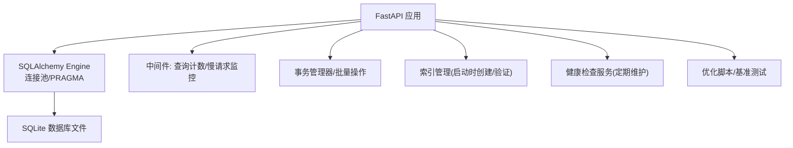
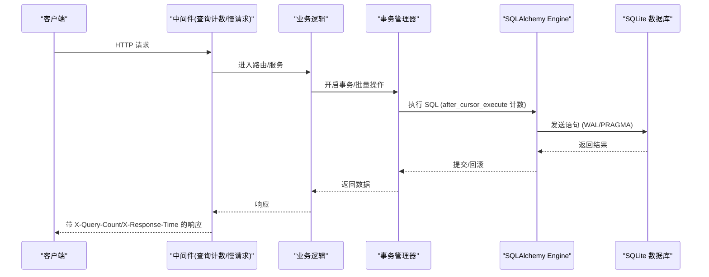
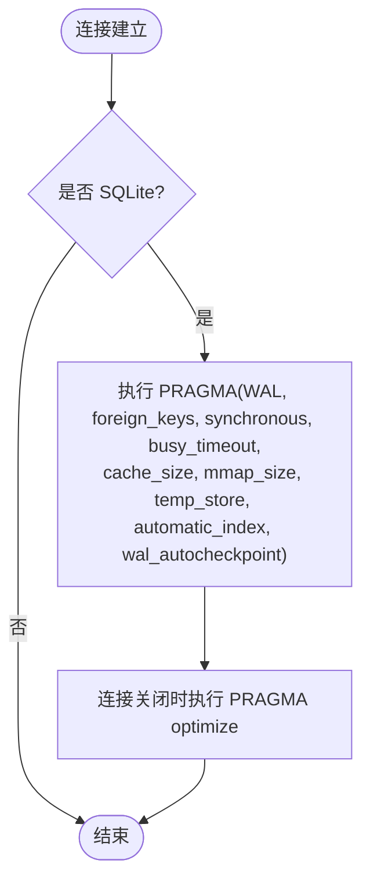
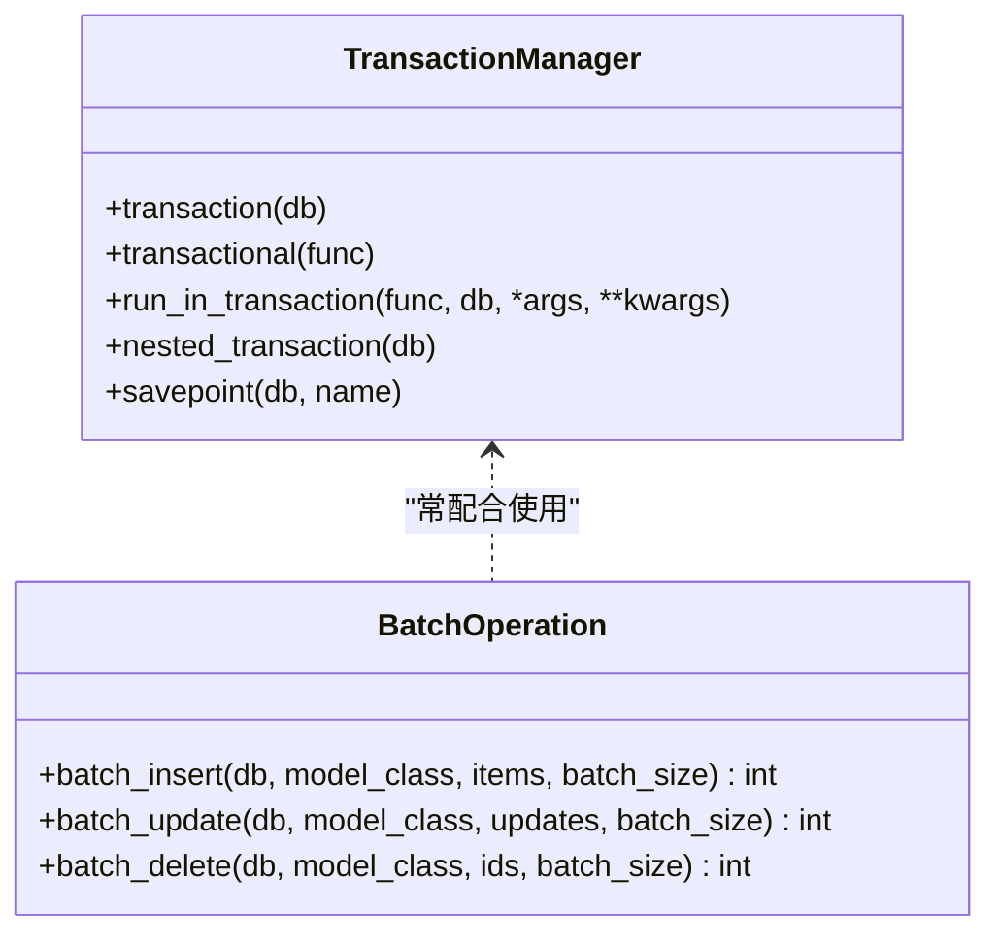
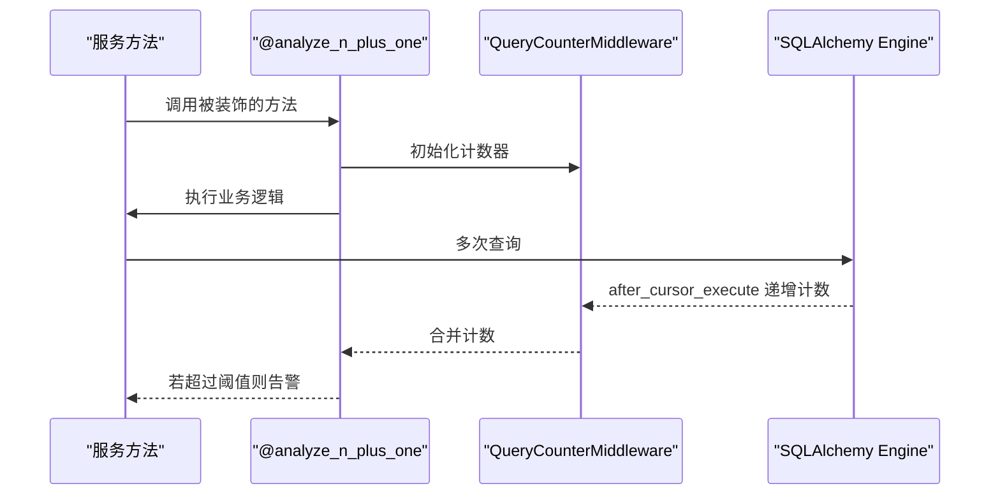
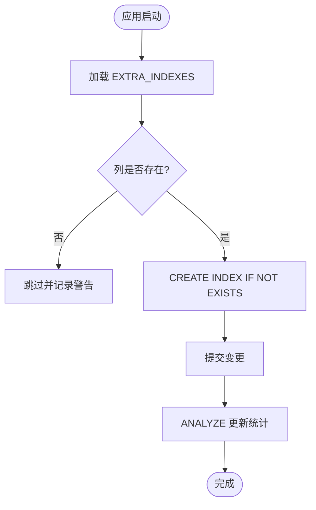
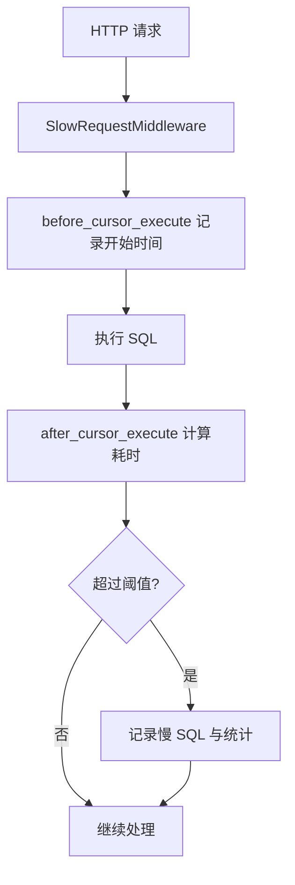
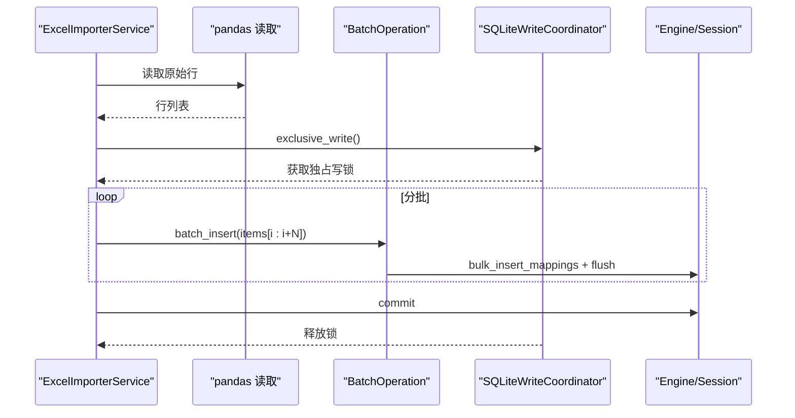
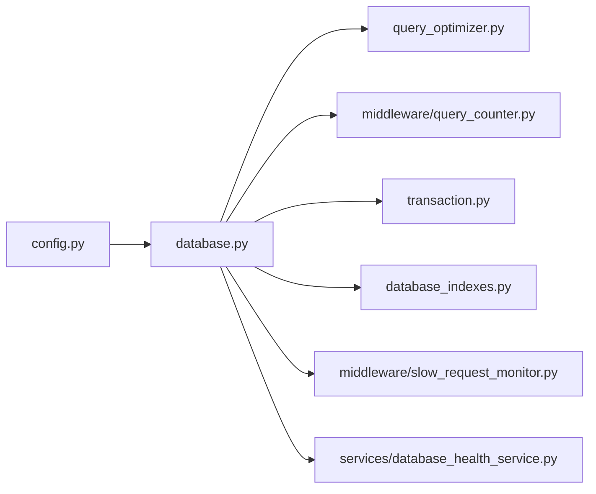

# 数据库优化

<cite>
**本文引用的文件**
- [backend/app/core/database.py](file://backend/app/core/database.py)
- [backend/app/core/query_optimizer.py](file://backend/app/core/query_optimizer.py)
- [backend/app/core/database_indexes.py](file://backend/app/core/database_indexes.py)
- [backend/app/core/transaction.py](file://backend/app/core/transaction.py)
- [backend/app/middleware/query_counter.py](file://backend/app/middleware/query_counter.py)
- [backend/app/middleware/slow_request_monitor.py](file://backend/app/middleware/slow_request_monitor.py)
- [backend/app/services/batch_import_optimizer.py](file://backend/app/services/batch_import_optimizer.py)
- [backend/app/services/database_health_service.py](file://backend/app/services/database_health_service.py)
- [backend/scripts/optimize_database.py](file://backend/scripts/optimize_database.py)
- [backend/scripts/performance_benchmark.py](file://backend/scripts/performance_benchmark.py)
- [backend/app/core/config.py](file://backend/app/core/config.py)
</cite>

## 目录
1. [简介](#简介)
2. [项目结构](#项目结构)
3. [核心组件](#核心组件)
4. [架构总览](#架构总览)
5. [详细组件分析](#详细组件分析)
6. [依赖关系分析](#依赖关系分析)
7. [性能考量](#性能考量)
8. [故障排查指南](#故障排查指南)
9. [结论](#结论)
10. [附录](#附录)

## 简介
本文件面向数据访问层与数据库运维，系统性梳理本项目在 SQLAlchemy 查询优化、索引策略、连接池配置、事务管理、慢查询分析、查询计划优化、批量操作处理等方面的实践，并给出 SQLite 特定优化、内存与磁盘 I/O 调优、监控指标、性能测试方法与常见问题解决方案，确保在高并发与大数据量场景下数据访问层稳定高效运行。

## 项目结构
围绕数据库性能优化的关键代码分布在以下模块：
- 数据库引擎与连接池、SQLite PRAGMA 调优、写入协调器：backend/app/core/database.py
- 查询优化与 N+1 检测、慢查询记录：backend/app/core/query_optimizer.py
- 索引定义与启动时创建/删除、统计信息分析：backend/app/core/database_indexes.py
- 事务上下文、保存点、批量操作工具、死锁重试：backend/app/core/transaction.py
- 请求级 SQL 计数中间件（N+1 告警）：backend/app/middleware/query_counter.py
- 慢 API/慢 SQL 监控中间件：backend/app/middleware/slow_request_monitor.py
- Excel 批量导入优化（pandas + bulk_insert_mappings）：backend/app/services/batch_import_optimizer.py
- 数据库健康检查服务（完整性、VACUUM、ANALYZE、碎片率等）：backend/app/services/database_health_service.py
- 数据库优化脚本（WAL/PRAGMA/VACUUM/ANALYZE）：backend/scripts/optimize_database.py
- 性能基准测试脚本（对比不同查询模式）：backend/scripts/performance_benchmark.py
- 应用配置（连接池大小、慢查询阈值等）：backend/app/core/config.py

图表来源
- [backend/app/core/database.py:55-65](file://backend/app/core/database.py#L55-L65)
- [backend/app/middleware/query_counter.py:39-77](file://backend/app/middleware/query_counter.py#L39-L77)
- [backend/app/middleware/slow_request_monitor.py:55-132](file://backend/app/middleware/slow_request_monitor.py#L55-L132)
- [backend/app/core/database_indexes.py:59-95](file://backend/app/core/database_indexes.py#L59-L95)
- [backend/app/services/database_health_service.py:80-133](file://backend/app/services/database_health_service.py#L80-L133)

章节来源
- [backend/app/core/database.py:1-172](file://backend/app/core/database.py#L1-L172)
- [backend/app/core/config.py:95-104](file://backend/app/core/config.py#L95-L104)

## 核心组件
- 数据库引擎与连接池：基于 SQLAlchemy 的 QueuePool，针对 SQLite 限制连接数、启用连接预检与回收，避免过多连接导致文件锁竞争。
- SQLite PRAGMA 调优：WAL 模式、NORMAL 同步、busy_timeout、cache_size、mmap_size、temp_store=MEMORY、自动索引、optimize 等。
- 写入协调器：长事务独占写，避免大批量导入时的 SQLITE_BUSY；短事务走 WAL + busy_timeout 自动重试。
- 事务管理：统一事务上下文、保存点、只读/隔离级别（非 SQLite）、安全提交、死锁重试、批量插入/更新/删除。
- 查询优化：分页、慢查询跟踪、N+1 检测装饰器。
- 索引管理：集中式 EXTRA_INDEXES，启动时幂等创建/删除，列存在性校验。
- 监控与诊断：请求级 SQL 计数、慢 API/慢 SQL 日志、健康检查（完整性、碎片率、表行数）。
- 优化脚本与基准测试：VACUUM/ANALYZE、PRAGMA 设置、多类查询性能对比。

章节来源
- [backend/app/core/database.py:55-172](file://backend/app/core/database.py#L55-L172)
- [backend/app/core/transaction.py:48-197](file://backend/app/core/transaction.py#L48-L197)
- [backend/app/core/query_optimizer.py:23-177](file://backend/app/core/query_optimizer.py#L23-L177)
- [backend/app/core/database_indexes.py:14-95](file://backend/app/core/database_indexes.py#L14-L95)
- [backend/app/middleware/query_counter.py:39-77](file://backend/app/middleware/query_counter.py#L39-L77)
- [backend/app/middleware/slow_request_monitor.py:55-132](file://backend/app/middleware/slow_request_monitor.py#L55-L132)
- [backend/app/services/database_health_service.py:80-133](file://backend/app/services/database_health_service.py#L80-L133)

## 架构总览
下图展示了从请求到数据库的关键路径与优化点：

图表来源
- [backend/app/middleware/query_counter.py:47-77](file://backend/app/middleware/query_counter.py#L47-L77)
- [backend/app/core/database.py:70-76](file://backend/app/core/database.py#L70-L76)
- [backend/app/core/transaction.py:52-74](file://backend/app/core/transaction.py#L52-L74)

## 详细组件分析

### 数据库引擎与连接池（SQLite 深度调优）
- 连接池：使用 QueuePool 限制连接规模，启用 pool_pre_ping、pool_recycle、pool_timeout，避免连接泄漏与长时间占用。
- PRAGMA 初始化：每次连接建立时执行 WAL、foreign_keys、synchronous=NORMAL、busy_timeout、cache_size、mmap_size、temp_store=MEMORY、automatic_index、wal_autocheckpoint。
- 连接关闭优化：触发 PRAGMA optimize 帮助优化查询计划。
- 加密支持：可选 SQLCipher 探测与密钥校验，失败快速失败。
- 写入协调器：exclusive_write 提供进程内互斥锁，保障长事务串行化，避免 SQLITE_BUSY；短事务依赖 WAL + busy_timeout。

图表来源
- [backend/app/core/database.py:78-172](file://backend/app/core/database.py#L78-L172)

章节来源
- [backend/app/core/database.py:55-172](file://backend/app/core/database.py#L55-L172)
- [backend/app/core/config.py:95-104](file://backend/app/core/config.py#L95-L104)

### 事务管理与批量操作
- 事务上下文：统一的 transaction/nested_transaction/savepoint，异常时自动回滚并抛出标准化错误。
- 安全提交：safe_commit 封装 commit，失败时 rollback 并记录日志。
- 隔离级别与只读：非 SQLite 可设置隔离级别与只读事务；SQLite 直接短路。
- 死锁重试：retry_on_deadlock 对包含 deadlock/lock 的异常进行有限次重试。
- 批量操作：batch_insert/batch_update/batch_delete 使用 bulk_*_mappings 与 flush，控制批次大小避免内存膨胀。

图表来源
- [backend/app/core/transaction.py:48-197](file://backend/app/core/transaction.py#L48-L197)
- [backend/app/core/transaction.py:366-457](file://backend/app/core/transaction.py#L366-L457)

章节来源
- [backend/app/core/transaction.py:48-197](file://backend/app/core/transaction.py#L48-L197)
- [backend/app/core/transaction.py:323-362](file://backend/app/core/transaction.py#L323-L362)
- [backend/app/core/transaction.py:366-457](file://backend/app/core/transaction.py#L366-L457)

### 查询优化与 N+1 检测
- 分页：paginate 提供安全的 page_size 上限与 offset/limit 分页。
- 慢查询跟踪：track_query 包装查询函数，超过阈值记录慢查询并维护最近 500 条。
- N+1 检测：analyze_n_plus_one 装饰器统计方法内 SQL 次数，超过阈值告警；结合 after_cursor_execute 事件累计计数。
- 中间件计数：QueryCounterMiddleware 在每个请求中通过 contextvar 收集 SQL 次数，并在响应头返回 X-Query-Count，超阈值告警。

图表来源
- [backend/app/core/query_optimizer.py:62-108](file://backend/app/core/query_optimizer.py#L62-L108)
- [backend/app/core/query_optimizer.py:137-177](file://backend/app/core/query_optimizer.py#L137-L177)
- [backend/app/middleware/query_counter.py:47-77](file://backend/app/middleware/query_counter.py#L47-L77)
- [backend/app/core/database.py:70-76](file://backend/app/core/database.py#L70-L76)

章节来源
- [backend/app/core/query_optimizer.py:23-177](file://backend/app/core/query_optimizer.py#L23-L177)
- [backend/app/middleware/query_counter.py:39-77](file://backend/app/middleware/query_counter.py#L39-L77)

### 索引策略设计与管理
- 集中式索引定义：EXTRA_INDEXES 列出高频查询所需的单列/复合索引，覆盖外键、状态、日期等常见过滤/排序字段。
- 启动时创建：create_indexes 使用 CREATE INDEX IF NOT EXISTS 保证幂等，并对列存在性进行校验，缺失列跳过并记录警告。
- 删除与分析：drop_indexes 用于清理；analyze_table_stats 执行 ANALYZE 并统计各表行数。

图表来源
- [backend/app/core/database_indexes.py:14-95](file://backend/app/core/database_indexes.py#L14-L95)
- [backend/app/core/database_indexes.py:121-148](file://backend/app/core/database_indexes.py#L121-L148)

章节来源
- [backend/app/core/database_indexes.py:14-95](file://backend/app/core/database_indexes.py#L14-L95)
- [backend/app/core/database_indexes.py:98-148](file://backend/app/core/database_indexes.py#L98-L148)

### 慢查询分析与监控
- 慢 API/慢 SQL 监控：SlowRequestMiddleware 通过 before/after_cursor_execute 捕获慢 SQL，记录 SQL 片段与参数摘要，统计峰值与均值。
- 请求级 SQL 计数：QueryCounterMiddleware 输出 X-Query-Count，便于前端或网关侧识别 N+1。
- 慢查询阈值：SLOW_QUERY_THRESHOLD_MS 默认 200ms，可在配置中调整。

图表来源
- [backend/app/middleware/slow_request_monitor.py:70-101](file://backend/app/middleware/slow_request_monitor.py#L70-L101)
- [backend/app/middleware/slow_request_monitor.py:103-132](file://backend/app/middleware/slow_request_monitor.py#L103-L132)
- [backend/app/core/config.py:104](file://backend/app/core/config.py#L104)

章节来源
- [backend/app/middleware/slow_request_monitor.py:55-132](file://backend/app/middleware/slow_request_monitor.py#L55-L132)
- [backend/app/middleware/query_counter.py:39-77](file://backend/app/middleware/query_counter.py#L39-L77)
- [backend/app/core/config.py:95-104](file://backend/app/core/config.py#L95-L104)

### 批量操作与导入优化
- Excel 导入：batch_import_optimizer 使用 pandas 向量化读取原始行，配合 openpyxl 回退，减少解析开销。
- 批量写入：BatchOperation 使用 bulk_insert_mappings/bulk_update_mappings，按批次 flush 与提交，避免内存压力。
- 长事务写入：SQLiteWriteCoordinator.exclusive_write 为大型导入提供独占写上下文，避免 SQLITE_BUSY。

图表来源
- [backend/app/services/batch_import_optimizer.py:26-46](file://backend/app/services/batch_import_optimizer.py#L26-L46)
- [backend/app/core/transaction.py:366-398](file://backend/app/core/transaction.py#L366-L398)
- [backend/app/core/database.py:211-237](file://backend/app/core/database.py#L211-L237)

章节来源
- [backend/app/services/batch_import_optimizer.py:1-73](file://backend/app/services/batch_import_optimizer.py#L1-L73)
- [backend/app/core/transaction.py:366-457](file://backend/app/core/transaction.py#L366-L457)
- [backend/app/core/database.py:198-289](file://backend/app/core/database.py#L198-L289)

### SQLite 特定优化与内存/磁盘 I/O
- WAL 模式：提升并发读能力，降低写阻塞。
- 同步模式：NORMAL 平衡性能与安全。
- 缓存与映射：cache_size 与 mmap_size 放大内存缓存与内存映射 I/O，temp_store=MEMORY 加速临时对象。
- 自动索引与优化：automatic_index 允许临时索引，连接关闭时 optimize 优化查询计划。
- VACUUM 与 ANALYZE：定期回收空间、整理碎片、更新统计信息。

章节来源
- [backend/app/core/database.py:78-172](file://backend/app/core/database.py#L78-L172)
- [backend/scripts/optimize_database.py:18-38](file://backend/scripts/optimize_database.py#L18-L38)
- [backend/scripts/optimize_database.py:65-102](file://backend/scripts/optimize_database.py#L65-L102)

### 数据库健康检查与监控指标
- 健康检查：周期性执行完整性检查、快速检查、VACUUM，统计碎片率、表数量、索引数量、页大小/数量。
- 监控指标：慢 API/慢 SQL 计数与平均耗时、峰值耗时；请求级 SQL 计数；数据库大小与碎片率。
- 启动自检：启动时执行 quick_check，尽早发现损坏或不可用问题。

章节来源
- [backend/app/services/database_health_service.py:80-133](file://backend/app/services/database_health_service.py#L80-L133)
- [backend/app/services/database_health_service.py:135-184](file://backend/app/services/database_health_service.py#L135-L184)
- [backend/app/services/database_health_service.py:186-222](file://backend/app/services/database_health_service.py#L186-L222)
- [backend/app/services/database_health_service.py:224-262](file://backend/app/services/database_health_service.py#L224-L262)
- [backend/app/services/database_health_service.py:264-306](file://backend/app/services/database_health_service.py#L264-L306)
- [backend/app/services/database_health_service.py:308-378](file://backend/app/services/database_health_service.py#L308-L378)
- [backend/app/middleware/slow_request_monitor.py:42-52](file://backend/app/middleware/slow_request_monitor.py#L42-L52)

## 依赖关系分析
- database.py 依赖 config.py 中的 DATABASE_URL 与连接池配置；注册 SQLAlchemy 事件监听 to 注入 query_counter 与 PRAGMA。
- query_optimizer.py 与 middleware/query_counter.py 协作，通过 after_cursor_execute 事件累计 SQL 次数。
- transaction.py 依赖 database.py 的 get_db 与 IS_SQLITE，提供跨库兼容的事务与批量操作。
- database_indexes.py 通过 engine 连接执行索引创建/删除与统计信息分析。
- slow_request_monitor.py 通过 SQLAlchemy 事件监听捕获慢 SQL，并与中间件聚合统计。
- database_health_service.py 独立于 ORM，直接 sqlite3 连接执行 PRAGMA 与系统表查询。

图表来源
- [backend/app/core/config.py:95-104](file://backend/app/core/config.py#L95-L104)
- [backend/app/core/database.py:55-76](file://backend/app/core/database.py#L55-L76)
- [backend/app/core/query_optimizer.py:62-108](file://backend/app/core/query_optimizer.py#L62-L108)
- [backend/app/middleware/query_counter.py:47-77](file://backend/app/middleware/query_counter.py#L47-L77)
- [backend/app/core/transaction.py:48-74](file://backend/app/core/transaction.py#L48-L74)
- [backend/app/core/database_indexes.py:59-95](file://backend/app/core/database_indexes.py#L59-L95)
- [backend/app/middleware/slow_request_monitor.py:70-101](file://backend/app/middleware/slow_request_monitor.py#L70-L101)
- [backend/app/services/database_health_service.py:80-133](file://backend/app/services/database_health_service.py#L80-L133)

章节来源
- [backend/app/core/database.py:55-172](file://backend/app/core/database.py#L55-L172)
- [backend/app/core/config.py:95-104](file://backend/app/core/config.py#L95-L104)

## 性能考量
- 连接池容量：根据并发压测结果调整 DB_POOL_SIZE 与 DB_MAX_OVERFLOW，避免排队耗尽。
- WAL 与同步：WAL + NORMAL 适合单机/多机物理协同环境，兼顾并发与一致性。
- 内存与 I/O：合理设置 cache_size 与 mmap_size，temp_store=MEMORY 提升临时对象性能。
- 索引命中：确保高频 WHERE/ORDER BY/JION 字段具备合适索引，避免全表扫描。
- 批量写入：使用 bulk_*_mappings 与 flush，控制批次大小，避免内存溢出。
- 慢查询治理：通过 @analyze_n_plus_one、X-Query-Count、慢 SQL 日志定位瓶颈。
- 定期维护：ANALYZE 更新统计，VACUUM 回收空间，optimize 优化查询计划。

[本节为通用指导，不直接分析具体文件]

## 故障排查指南
- SQLITE_BUSY：长事务使用 exclusive_write 独占写；短事务依赖 busy_timeout 自动重试；必要时扩大超时或拆分任务。
- 慢查询：查看慢 SQL 日志与 X-Query-Count，结合 @analyze_n_plus_one 定位 N+1；检查索引是否命中。
- 连接池耗尽：调整 DB_POOL_SIZE、DB_MAX_OVERFLOW、DB_POOL_TIMEOUT；确认连接正确关闭。
- 数据损坏：使用健康检查服务的完整性检查与 VACUUM；必要时恢复备份。
- 权限与路径：确保数据库文件路径可写，加密密钥文件存在且有效（如启用 SQLCipher）。

章节来源
- [backend/app/core/database.py:198-289](file://backend/app/core/database.py#L198-L289)
- [backend/app/middleware/slow_request_monitor.py:70-101](file://backend/app/middleware/slow_request_monitor.py#L70-L101)
- [backend/app/services/database_health_service.py:135-184](file://backend/app/services/database_health_service.py#L135-L184)
- [backend/app/services/database_health_service.py:224-262](file://backend/app/services/database_health_service.py#L224-L262)

## 结论
本项目在 SQLite 环境下实现了从连接池、PRAGMA、事务、索引、批量操作到监控与维护的全链路性能优化。通过 WAL、合理的内存与 I/O 配置、集中式索引管理、N+1 检测与慢查询监控、以及周期性的 VACUUM/ANALYZE，显著提升了数据访问层的吞吐与稳定性。建议在生产环境中持续监控慢查询与连接池使用情况，按需调整索引与连接池参数，并结合基准测试评估优化效果。

[本节为总结，不直接分析具体文件]

## 附录
- 常用命令与脚本
  - 数据库优化：backend/scripts/optimize_database.py（WAL/PRAGMA/VACUUM/ANALYZE）
  - 性能基准：backend/scripts/performance_benchmark.py（对比多种查询模式）
- 关键配置项
  - 连接池：DB_POOL_SIZE、DB_MAX_OVERFLOW、DB_POOL_TIMEOUT、DB_POOL_RECYCLE、DB_POOL_PRE_PING
  - 慢查询阈值：SLOW_QUERY_THRESHOLD_MS
  - 加密：DB_ENCRYPTION_ENABLED、DB_ENCRYPTION_KEY_PATH

章节来源
- [backend/scripts/optimize_database.py:40-102](file://backend/scripts/optimize_database.py#L40-L102)
- [backend/scripts/performance_benchmark.py:46-149](file://backend/scripts/performance_benchmark.py#L46-L149)
- [backend/app/core/config.py:95-104](file://backend/app/core/config.py#L95-L104)