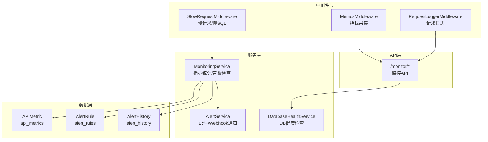
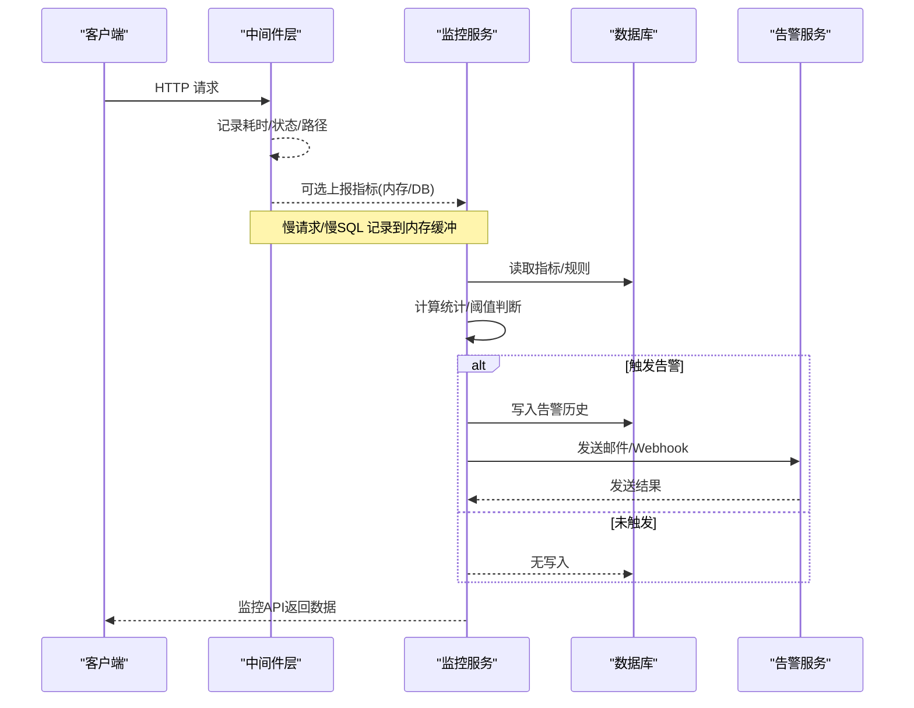
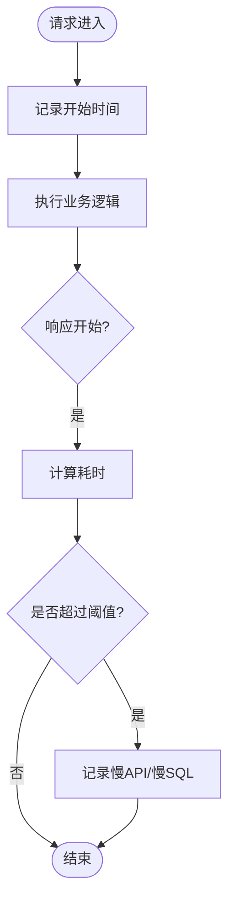
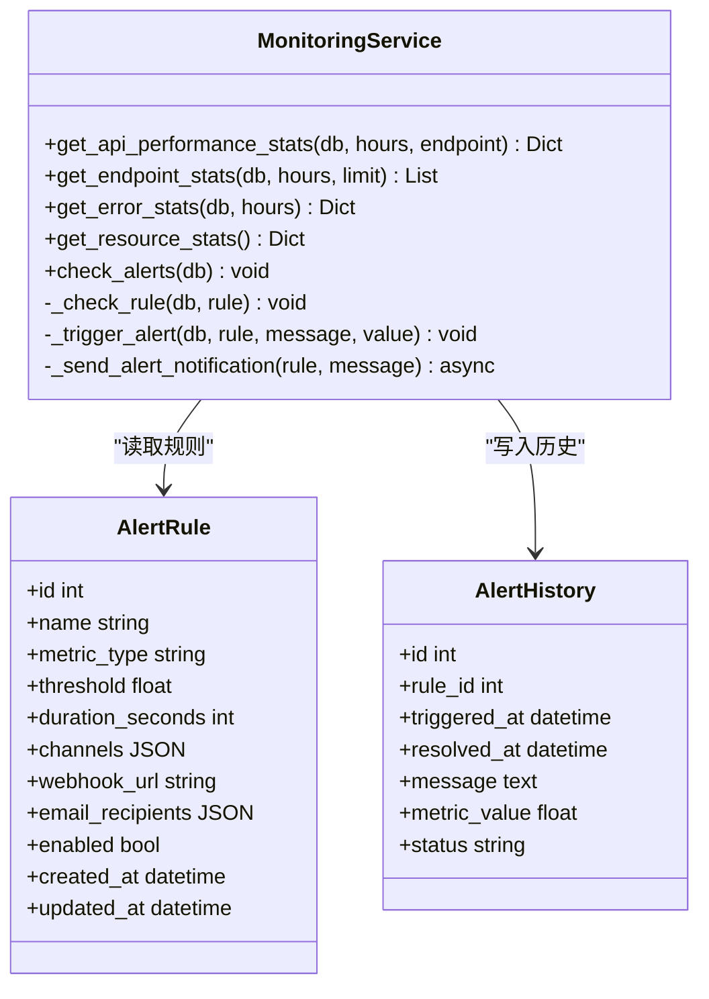
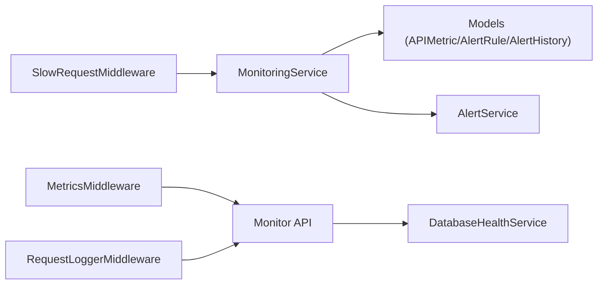

# 监控告警

<cite>
**本文引用的文件**
- [slow_request_monitor.py](file://backend/app/middleware/slow_request_monitor.py)
- [metrics_middleware.py](file://backend/app/middleware/metrics_middleware.py)
- [request_logger.py](file://backend/app/middleware/request_logger.py)
- [monitoring_service.py](file://backend/app/services/monitoring_service.py)
- [alert_service.py](file://backend/app/services/alert_service.py)
- [monitoring.py](file://backend/app/models/monitoring.py)
- [monitor.py](file://backend/app/api/v1/system/monitor.py)
- [database_health_service.py](file://backend/app/services/database_health_service.py)
</cite>

## 目录
1. [简介](#简介)
2. [项目结构](#项目结构)
3. [核心组件](#核心组件)
4. [架构总览](#架构总览)
5. [详细组件分析](#详细组件分析)
6. [依赖关系分析](#依赖关系分析)
7. [性能考量](#性能考量)
8. [故障排查指南](#故障排查指南)
9. [结论](#结论)
10. [附录](#附录)

## 简介
本文件面向运维与研发人员，系统化说明本项目的系统监控与告警能力，覆盖慢请求监控、性能指标采集、系统健康检查、日志聚合与错误追踪、性能瓶颈识别、自定义指标与告警规则、数据存储与查询、部署与通知配置、数据分析实践，以及可扩展性与高可用保障方案。内容基于后端代码实现进行梳理，确保可落地、可操作。

## 项目结构
监控相关能力主要分布在以下层次：
- ASGI 中间件层：请求级指标采集、慢请求记录、请求日志记录
- 服务层：监控指标统计、告警规则检查与触发、多渠道通知
- 数据模型层：API 指标、告警规则、告警历史等持久化模型
- API 层：对外暴露监控快照、资源详情、告警规则与历史、API 调用统计、数据库大小等接口
- 健康检查：数据库健康检查服务（完整性、快速检查、VACUUM、索引检查与分析）

图表来源
- [slow_request_monitor.py:55-132](file://backend/app/middleware/slow_request_monitor.py#L55-L132)
- [metrics_middleware.py:132-177](file://backend/app/middleware/metrics_middleware.py#L132-L177)
- [request_logger.py:52-114](file://backend/app/middleware/request_logger.py#L52-L114)
- [monitoring_service.py:26-312](file://backend/app/services/monitoring_service.py#L26-L312)
- [alert_service.py:20-111](file://backend/app/services/alert_service.py#L20-L111)
- [monitoring.py:22-84](file://backend/app/models/monitoring.py#L22-L84)
- [monitor.py:54-352](file://backend/app/api/v1/system/monitor.py#L54-L352)
- [database_health_service.py:16-413](file://backend/app/services/database_health_service.py#L16-L413)

章节来源
- [slow_request_monitor.py:55-132](file://backend/app/middleware/slow_request_monitor.py#L55-L132)
- [metrics_middleware.py:132-177](file://backend/app/middleware/metrics_middleware.py#L132-L177)
- [request_logger.py:52-114](file://backend/app/middleware/request_logger.py#L52-L114)
- [monitoring_service.py:26-312](file://backend/app/services/monitoring_service.py#L26-L312)
- [alert_service.py:20-111](file://backend/app/services/alert_service.py#L20-L111)
- [monitoring.py:22-84](file://backend/app/models/monitoring.py#L22-L84)
- [monitor.py:54-352](file://backend/app/api/v1/system/monitor.py#L54-L352)
- [database_health_service.py:16-413](file://backend/app/services/database_health_service.py#L16-L413)

## 核心组件
- 慢请求与慢 SQL 监控：通过 ASGI 中间件与 SQLAlchemy 事件钩子捕获超过阈值的 API 请求与 SQL 执行，维护环形缓冲区与计数器，提供统计摘要与最近记录查询。
- 指标采集：ASGI 中间件在请求生命周期内记录请求数、错误数、平均耗时、活跃请求、Top 端点与慢请求列表，供监控面板展示。
- 监控服务：按时间窗口聚合 API 指标，计算百分位、错误率；按规则检查响应时间、错误率、资源使用率并触发告警；支持异步通知。
- 告警通知：支持邮件与 Webhook（通用、钉钉、企业微信），具备失败重试与异常日志。
- 健康检查：数据库健康检查服务周期性执行完整性检查、快速检查、VACUUM、索引检查与分析，并提供状态与统计。
- 监控 API：提供系统快照、资源详情、告警规则与历史、API 调用统计、数据库大小等查询接口。

章节来源
- [slow_request_monitor.py:19-52](file://backend/app/middleware/slow_request_monitor.py#L19-L52)
- [metrics_middleware.py:26-129](file://backend/app/middleware/metrics_middleware.py#L26-L129)
- [monitoring_service.py:29-181](file://backend/app/services/monitoring_service.py#L29-L181)
- [alert_service.py:20-111](file://backend/app/services/alert_service.py#L20-L111)
- [database_health_service.py:80-134](file://backend/app/services/database_health_service.py#L80-L134)
- [monitor.py:54-352](file://backend/app/api/v1/system/monitor.py#L54-L352)

## 架构总览
监控体系以“中间件采集 + 服务处理 + 模型存储 + API 暴露”的分层架构组织，关键流程如下：
- 请求进入后，由指标采集与慢请求中间件记录耗时、状态码、路径与方法，同时记录慢请求与慢 SQL。
- 监控服务定时或按需读取指标，计算统计值并按规则判断是否触发告警。
- 告警触发后写入历史表并通过邮件或 Webhook 发送通知。
- 监控 API 提供实时快照、资源详情、告警规则与历史、API 统计等查询。

图表来源
- [metrics_middleware.py:132-177](file://backend/app/middleware/metrics_middleware.py#L132-L177)
- [slow_request_monitor.py:55-132](file://backend/app/middleware/slow_request_monitor.py#L55-L132)
- [monitoring_service.py:184-312](file://backend/app/services/monitoring_service.py#L184-L312)
- [alert_service.py:20-111](file://backend/app/services/alert_service.py#L20-L111)
- [monitor.py:278-324](file://backend/app/api/v1/system/monitor.py#L278-L324)

## 详细组件分析

### 慢请求与慢 SQL 监控
- 功能要点
  - 通过 ASGI 中间件拦截 HTTP 响应开始消息，计算耗时并记录慢 API。
  - 通过 SQLAlchemy before/after cursor execute 事件钩子捕获慢 SQL，记录 SQL 片段与参数。
  - 使用双端队列维护最近 N 条慢记录，避免无限增长。
  - 提供统计摘要：总请求数、慢 API/SQL 计数、峰值与近 50 条平均值。
- 复杂度与性能
  - 内存环形缓冲 O(1) 追加，查询 O(N) 取前 N 条。
  - 事件钩子仅在慢 SQL 时写日志与缓冲，降低开销。
- 扩展点
  - 调整慢阈值、缓冲大小、采样策略。
  - 对接外部日志系统或指标平台。

图表来源
- [slow_request_monitor.py:55-132](file://backend/app/middleware/slow_request_monitor.py#L55-L132)

章节来源
- [slow_request_monitor.py:19-52](file://backend/app/middleware/slow_request_monitor.py#L19-L52)
- [slow_request_monitor.py:55-132](file://backend/app/middleware/slow_request_monitor.py#L55-L132)

### 指标采集中间件
- 功能要点
  - 记录请求计数、错误计数、活跃请求、平均耗时、Top 端点、慢请求列表。
  - 跳过健康检查与指标自身路径，减少噪音。
  - 线程安全存储，提供汇总接口供监控 API 使用。
- 复杂度与性能
  - 每次请求 O(1) 更新计数器与列表，限制慢请求记录数量。
- 扩展点
  - 增加更多维度标签（如用户角色、租户）。
  - 导出为 Prometheus 格式或推送到时序数据库。

章节来源
- [metrics_middleware.py:26-129](file://backend/app/middleware/metrics_middleware.py#L26-L129)
- [metrics_middleware.py:132-177](file://backend/app/middleware/metrics_middleware.py#L132-L177)

### 请求日志中间件
- 功能要点
  - 记录方法、路径、查询串、客户端 IP、User-Agent、状态码、耗时。
  - 跳过静态与健康路径，避免冗余日志。
- 扩展点
  - 接入结构化日志与集中式日志平台。
  - 脱敏敏感字段。

章节来源
- [request_logger.py:52-114](file://backend/app/middleware/request_logger.py#L52-L114)

### 监控服务与告警规则
- 功能要点
  - 按小时窗口聚合 API 指标，计算平均响应时间与 p50/p95/p99 百分位、错误率。
  - 按端点分组统计 Top 接口与错误分布。
  - 规则类型：响应时间、错误率、资源使用率；支持持续时间窗口。
  - 触发告警时去重（同一规则未解决不重复触发），写入历史表并异步发送通知。
- 复杂度与性能
  - 聚合查询按时间范围过滤，注意索引优化。
  - 通知走后台任务，避免阻塞主流程。
- 扩展点
  - 新增规则类型（如磁盘 IO、连接池占用）。
  - 多通道通知（短信、飞书、Slack）。

图表来源
- [monitoring_service.py:26-312](file://backend/app/services/monitoring_service.py#L26-L312)
- [monitoring.py:22-84](file://backend/app/models/monitoring.py#L22-L84)

章节来源
- [monitoring_service.py:29-181](file://backend/app/services/monitoring_service.py#L29-L181)
- [monitoring_service.py:184-312](file://backend/app/services/monitoring_service.py#L184-L312)
- [monitoring.py:22-84](file://backend/app/models/monitoring.py#L22-L84)

### 告警通知服务
- 功能要点
  - 邮件通知：SMTP 配置校验、TLS、登录与发送。
  - Webhook 通知：支持通用、钉钉、企业微信格式，超时控制。
  - 异常捕获与日志记录，保证通知失败不影响主流程。
- 扩展点
  - 增加更多渠道（短信、IM）。
  - 模板化消息与富文本。

章节来源
- [alert_service.py:20-111](file://backend/app/services/alert_service.py#L20-L111)

### 监控 API
- 功能要点
  - /monitor/snapshot：系统快照（CPU、内存、磁盘、网络、进程信息）。
  - /monitor/resources：资源使用详情与健康评估。
  - /monitor/alerts：告警规则列表（数据库优先，否则默认规则）。
  - /monitor/alerts/history：告警历史分页查询。
  - /monitor/api-stats：API 调用统计（优先内存指标，回退为空）。
  - /monitor/database-size：数据库文件大小。
- 扩展点
  - 增加权限控制与审计。
  - 导出报表与趋势图。

章节来源
- [monitor.py:54-352](file://backend/app/api/v1/system/monitor.py#L54-L352)

### 数据库健康检查服务
- 功能要点
  - 启动自检：快速检查数据库可访问性。
  - 周期监控：完整性检查（每日）、快速检查（每小时）、VACUUM（每周）、索引检查与分析。
  - 提供健康状态与统计信息。
- 扩展点
  - 适配不同数据库引擎（当前针对 SQLite）。
  - 集成外部健康检查与告警。

章节来源
- [database_health_service.py:80-134](file://backend/app/services/database_health_service.py#L80-L134)
- [database_health_service.py:135-413](file://backend/app/services/database_health_service.py#L135-L413)

## 依赖关系分析
- 中间件与服务耦合度低，通过内存存储与数据库会话解耦。
- 监控服务依赖模型层（APIMetric、AlertRule、AlertHistory）与告警服务。
- API 层依赖监控服务与数据库健康服务，提供统一入口。
- 潜在循环依赖：无直接循环，模块间职责清晰。

图表来源
- [slow_request_monitor.py:55-132](file://backend/app/middleware/slow_request_monitor.py#L55-L132)
- [metrics_middleware.py:132-177](file://backend/app/middleware/metrics_middleware.py#L132-L177)
- [request_logger.py:52-114](file://backend/app/middleware/request_logger.py#L52-L114)
- [monitoring_service.py:26-312](file://backend/app/services/monitoring_service.py#L26-L312)
- [monitoring.py:22-84](file://backend/app/models/monitoring.py#L22-L84)
- [alert_service.py:20-111](file://backend/app/services/alert_service.py#L20-L111)
- [monitor.py:54-352](file://backend/app/api/v1/system/monitor.py#L54-L352)
- [database_health_service.py:16-413](file://backend/app/services/database_health_service.py#L16-L413)

章节来源
- [monitoring_service.py:26-312](file://backend/app/services/monitoring_service.py#L26-L312)
- [monitor.py:54-352](file://backend/app/api/v1/system/monitor.py#L54-L352)

## 性能考量
- 中间件开销最小化：仅对慢请求与必要路径记录，跳过健康与指标路径。
- 内存缓冲限制：慢请求与慢 SQL 记录上限，防止内存膨胀。
- 数据库查询优化：按时间范围过滤，建议为 timestamp、endpoint、status_code 建立索引。
- 异步通知：告警通知走后台任务或线程池，避免阻塞请求处理。
- 资源监控频率：psutil 采样间隔合理设置，避免频繁系统调用。

[本节为通用指导，无需特定文件引用]

## 故障排查指南
- 慢请求过多
  - 查看慢 API/SQL 记录与统计摘要，定位热点接口与慢查询。
  - 调整阈值与采样策略，结合业务负载优化。
- 告警风暴
  - 检查规则持续时间与去重逻辑，避免重复触发。
  - 确认通知渠道配置与连通性。
- 指标缺失
  - 确认指标中间件已注册且未被跳过路径影响。
  - 检查监控 API 回退逻辑与异常日志。
- 数据库健康异常
  - 查看完整性检查与快速检查结果，必要时执行 VACUUM 与索引修复。
  - 关注启动自检结果与监控线程状态。

章节来源
- [slow_request_monitor.py:19-52](file://backend/app/middleware/slow_request_monitor.py#L19-L52)
- [monitoring_service.py:184-312](file://backend/app/services/monitoring_service.py#L184-L312)
- [metrics_middleware.py:132-177](file://backend/app/middleware/metrics_middleware.py#L132-L177)
- [database_health_service.py:80-134](file://backend/app/services/database_health_service.py#L80-L134)

## 结论
本项目构建了完整的监控与告警体系：从请求级指标采集、慢请求与慢 SQL 监控，到规则驱动的告警与多渠道通知，再到数据库健康检查与监控 API 暴露。整体设计低侵入、易扩展，适合在生产环境持续运行与演进。建议结合日志平台与时序数据库进一步打通观测链路，完善可视化与自动化处置。

[本节为总结，无需特定文件引用]

## 附录

### 监控数据存储与查询
- APIMetric：记录接口调用耗时、状态码、时间戳与错误信息，用于性能统计与错误分析。
- AlertRule：定义告警规则（指标类型、阈值、持续时间、通道）。
- AlertHistory：记录告警触发与恢复时间、消息与指标值。

章节来源
- [monitoring.py:22-84](file://backend/app/models/monitoring.py#L22-L84)

### 告警规则配置与通知
- 规则类型：响应时间、错误率、资源使用率。
- 通知渠道：邮件（SMTP）、Webhook（通用、钉钉、企业微信）。
- 配置项：收件人、Webhook URL、类型、持续时间窗口。

章节来源
- [monitoring_service.py:184-312](file://backend/app/services/monitoring_service.py#L184-L312)
- [alert_service.py:20-111](file://backend/app/services/alert_service.py#L20-L111)
- [monitor.py:186-239](file://backend/app/api/v1/system/monitor.py#L186-L239)

### 监控数据采集与导出
- 内存指标：请求数、错误数、平均耗时、Top 端点、慢请求列表。
- 导出建议：Prometheus 指标、时序数据库推送、CSV/JSON 报表。

章节来源
- [metrics_middleware.py:26-129](file://backend/app/middleware/metrics_middleware.py#L26-L129)
- [monitor.py:278-324](file://backend/app/api/v1/system/monitor.py#L278-L324)

### 部署与运维实践
- 中间件注册：确保指标与慢请求中间件生效，跳过健康与指标路径。
- 日志聚合：将请求日志与慢请求日志接入集中式日志平台。
- 健康检查：启用数据库健康监控线程，定期执行完整性检查与 VACUUM。
- 告警通知：配置 SMTP 与 Webhook，验证连通性与失败重试。

章节来源
- [metrics_middleware.py:132-177](file://backend/app/middleware/metrics_middleware.py#L132-L177)
- [request_logger.py:52-114](file://backend/app/middleware/request_logger.py#L52-L114)
- [database_health_service.py:80-134](file://backend/app/services/database_health_service.py#L80-L134)
- [alert_service.py:20-111](file://backend/app/services/alert_service.py#L20-L111)

### 可扩展性与高可用
- 可扩展性
  - 新增指标维度与规则类型，保持中间件与服务解耦。
  - 支持多通道通知与模板化消息。
  - 指标导出至外部系统，便于横向扩展分析能力。
- 高可用
  - 告警去重与异步通知，避免风暴与阻塞。
  - 健康检查与自愈（VACUUM、索引修复）。
  - 中间件容错：异常捕获与降级（如 psutil 不可用时的有限模式）。

章节来源
- [monitoring_service.py:184-312](file://backend/app/services/monitoring_service.py#L184-L312)
- [database_health_service.py:80-134](file://backend/app/services/database_health_service.py#L80-L134)
- [monitor.py:54-108](file://backend/app/api/v1/system/monitor.py#L54-L108)