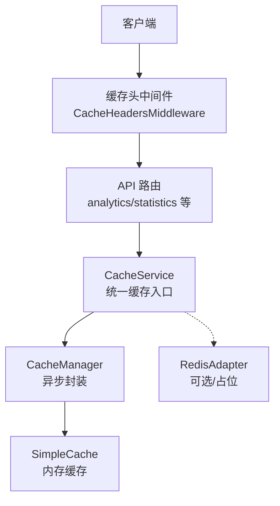
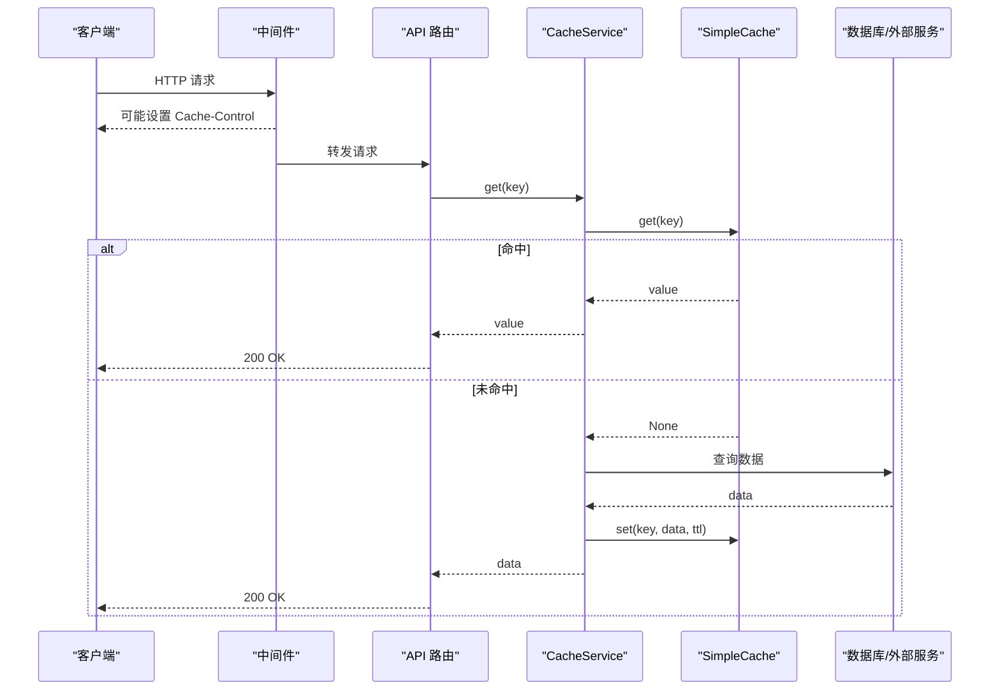
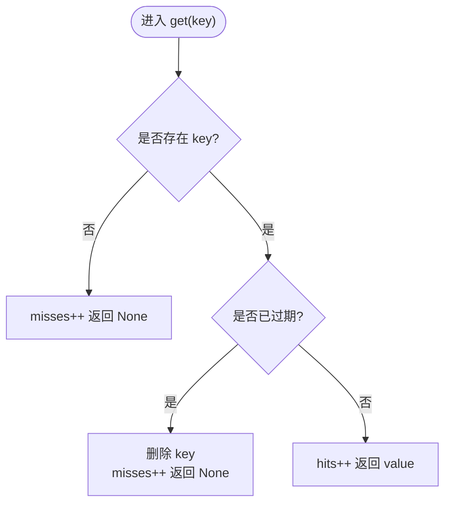
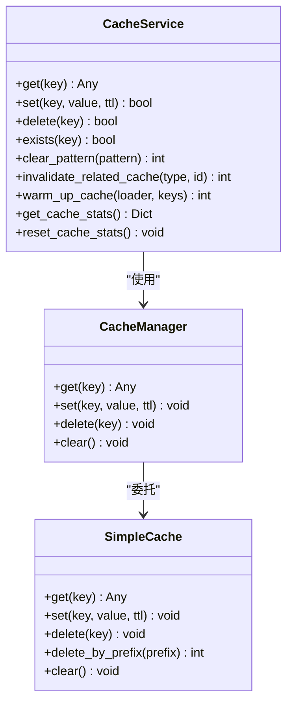
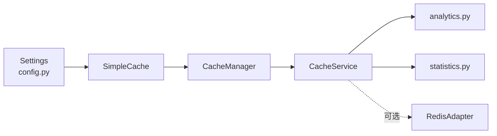
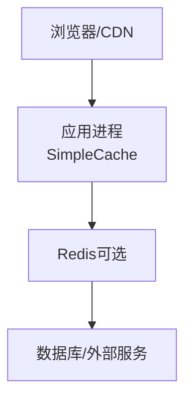

# 缓存策略

<cite>
**本文引用的文件**
- [backend/app/core/cache.py](file://backend/app/core/cache.py)
- [backend/app/services/cache_service.py](file://backend/app/services/cache_service.py)
- [backend/app/core/redis_adapter.py](file://backend/app/core/redis_adapter.py)
- [backend/app/core/config.py](file://backend/app/core/config.py)
- [backend/app/middleware/cache_headers.py](file://backend/app/middleware/cache_headers.py)
- [backend/app/api/v1/data/data/analytics.py](file://backend/app/api/v1/data/data/analytics.py)
- [backend/app/api/v1/data/data/statistics.py](file://backend/app/api/v1/data/data/statistics.py)
</cite>

## 目录
1. [简介](#简介)
2. [项目结构](#项目结构)
3. [核心组件](#核心组件)
4. [架构总览](#架构总览)
5. [详细组件分析](#详细组件分析)
6. [依赖关系分析](#依赖关系分析)
7. [性能考量](#性能考量)
8. [故障排查指南](#故障排查指南)
9. [结论](#结论)
10. [附录](#附录)

## 简介
本文件系统性梳理本项目的缓存策略设计，覆盖内存缓存实现、TTL 管理、内存淘汰、多级缓存架构、键命名规范、一致性保证、前端与 API 响应缓存、数据查询缓存、命中率监控、失效策略、分布式扩展、性能测试与优化、常见问题排查等。目标是让读者在不深入代码的情况下也能理解并正确使用缓存体系。

## 项目结构
后端采用“本地内存缓存 + 可选 Redis 适配器”的多级缓存思路：
- 进程内 SimpleCache：线程安全、按 key TTL、容量上限 LRU-like 淘汰。
- CacheManager：为异步调用提供 await 风格的封装。
- CacheService：业务层统一入口，提供统计、预热、批量失效、装饰器工具等。
- RedisAdapter：离线模式下的无操作适配器（可替换为真实 Redis）。
- 中间件：对静态/低变化接口添加浏览器缓存头，减少重复请求。
- API 层：在高频读路径中集成缓存读写与 TTL 控制。

图表来源
- [backend/app/middleware/cache_headers.py:1-31](file://backend/app/middleware/cache_headers.py#L1-L31)
- [backend/app/api/v1/data/data/analytics.py:1-200](file://backend/app/api/v1/data/data/analytics.py#L1-L200)
- [backend/app/api/v1/data/data/statistics.py:1-200](file://backend/app/api/v1/data/data/statistics.py#L1-L200)
- [backend/app/services/cache_service.py:1-477](file://backend/app/services/cache_service.py#L1-L477)
- [backend/app/core/cache.py:1-166](file://backend/app/core/cache.py#L1-L166)
- [backend/app/core/redis_adapter.py:1-44](file://backend/app/core/redis_adapter.py#L1-L44)

章节来源
- [backend/app/core/config.py:114-183](file://backend/app/core/config.py#L114-L183)
- [backend/app/middleware/cache_headers.py:1-31](file://backend/app/middleware/cache_headers.py#L1-L31)

## 核心组件
- SimpleCache：线程安全的进程内字典缓存，支持 per-key TTL、容量上限、前缀删除、清空。
- CacheManager：将同步 SimpleCache 暴露为 async 风格，便于在协程中使用。
- CacheService：业务侧统一缓存服务，提供 get/set/delete/exists/pattern 清除、相关缓存失效、预热、统计、装饰器（@cached/@cache_result/@cache_invalidate）和实体缓存管理器 EntityCacheManager。
- RedisAdapter：离线模式下的内存占位实现，提供健康检查与基础统计。
- 配置项：CACHE_ENABLED、CACHE_DEFAULT_TTL、CACHE_MAX_SIZE、REDIS_* 等。

章节来源
- [backend/app/core/cache.py:14-137](file://backend/app/core/cache.py#L14-L137)
- [backend/app/services/cache_service.py:20-477](file://backend/app/services/cache_service.py#L20-L477)
- [backend/app/core/redis_adapter.py:7-44](file://backend/app/core/redis_adapter.py#L7-L44)
- [backend/app/core/config.py:114-183](file://backend/app/core/config.py#L114-L183)

## 架构总览
- 读取路径：API -> CacheService.get -> CacheManager.get -> SimpleCache.get（命中则返回；未命中则回源数据库/服务，再写入缓存）。
- 写入路径：写操作后通过 @cache_invalidate 或显式调用 invalidate_related_cache 清理相关键。
- 前端缓存：中间件为特定路径设置 Cache-Control，降低重复请求。
- 可扩展性：RedisAdapter 作为抽象，可在生产环境替换为真实 Redis，实现跨进程/分布式缓存。

图表来源
- [backend/app/middleware/cache_headers.py:1-31](file://backend/app/middleware/cache_headers.py#L1-L31)
- [backend/app/api/v1/data/data/analytics.py:30-45](file://backend/app/api/v1/data/data/analytics.py#L30-L45)
- [backend/app/api/v1/data/data/statistics.py:27-56](file://backend/app/api/v1/data/data/statistics.py#L27-L56)
- [backend/app/services/cache_service.py:44-90](file://backend/app/services/cache_service.py#L44-L90)
- [backend/app/core/cache.py:24-43](file://backend/app/core/cache.py#L24-L43)

## 详细组件分析

### SimpleCache：内存缓存与 TTL 管理
- 数据结构：dict[str, (expires_at, value)]，expires_at 使用 monotonic 时间计算绝对过期点。
- 并发安全：内部使用 threading.Lock 保护所有读写。
- TTL 机制：get 时若 expires_at > 0 且当前时间超过过期点，则删除并视为 miss；set 时根据 ttl 计算 expires_at。
- 内存淘汰：当存储大小达到 max_size，优先删除最早插入的键（基于 dict 迭代顺序），近似 LRU 但非严格 LRU。
- 批量删除：delete_by_prefix 支持按前缀批量删除，返回删除数量。
- 指标：维护 hits/misses 计数，便于统计命中率。

图表来源
- [backend/app/core/cache.py:24-36](file://backend/app/core/cache.py#L24-L36)
- [backend/app/core/cache.py:63-69](file://backend/app/core/cache.py#L63-L69)

章节来源
- [backend/app/core/cache.py:14-70](file://backend/app/core/cache.py#L14-L70)

### CacheManager：异步封装
- 目的：以 await cache_manager.get/set/delete/clear 的方式使用底层 SimpleCache。
- 行为：直接委托给 SimpleCache，保持语义一致。

章节来源
- [backend/app/core/cache.py:72-96](file://backend/app/core/cache.py#L72-L96)

### CacheService：业务缓存服务
- 统一入口：get/set/delete/exists/clear_pattern/invalidate_related_cache/warm_up_cache。
- 统计：维护 hits/misses/sets/deletes 计数器，并提供获取与重置方法。
- 装饰器：
  - @cached(ttl, key_prefix, key_func)：异步函数结果缓存。
  - @cache_result(ttl, key_generator)：同步/异步通用结果缓存。
  - @cache_invalidate(resource_type, resource_id_arg)：写操作后自动失效相关缓存。
- 键生成：cache_key 将参数序列化为稳定字符串，复杂对象使用哈希。
- 实体缓存管理器：EntityCacheManager 提供统一的 entity:list/detail/stats 键约定与失效方法。

图表来源
- [backend/app/services/cache_service.py:37-227](file://backend/app/services/cache_service.py#L37-L227)
- [backend/app/core/cache.py:72-96](file://backend/app/core/cache.py#L72-L96)
- [backend/app/core/cache.py:14-70](file://backend/app/core/cache.py#L14-L70)

章节来源
- [backend/app/services/cache_service.py:20-477](file://backend/app/services/cache_service.py#L20-L477)

### RedisAdapter：分布式扩展占位
- 作用：在离线/单机部署下提供内存占位实现，保持上层接口一致。
- 能力：get/set/delete/exists/flush/get_stats/health_check。
- 扩展点：生产环境可替换为真实 Redis 客户端，实现跨进程/分布式缓存。

章节来源
- [backend/app/core/redis_adapter.py:7-44](file://backend/app/core/redis_adapter.py#L7-L44)

### 配置与开关
- CACHE_ENABLED：全局开关，关闭后统计/分析等模块跳过缓存。
- CACHE_DEFAULT_TTL：默认缓存时长（秒）。
- CACHE_MAX_SIZE：SimpleCache 最大条目数。
- REDIS_*：Redis 连接参数（当前默认禁用）。

章节来源
- [backend/app/core/config.py:114-183](file://backend/app/core/config.py#L114-L183)

### 前端缓存策略（HTTP 缓存头）
- 中间件对特定路径添加 Cache-Control，如筛选选项、组织树、静态资源等，减少重复请求。
- 注意：统计/概览类端点不缓存，确保增删改后可见性。

章节来源
- [backend/app/middleware/cache_headers.py:1-31](file://backend/app/middleware/cache_headers.py#L1-L31)

### API 响应缓存与数据查询缓存
- 数据分析：analytics 模块使用 ANALYTICS_CACHE_PREFIX 前缀，TTL=300s，按用户维度缓存仪表盘、帮扶村分析、资金趋势、绩效指标等。
- 统计分析：statistics 模块使用 STATS_CACHE_PREFIX 前缀，TTL=300s，缓存系统概览、总览等聚合数据。
- 写后失效：通过 @cache_invalidate 或 invalidate_related_cache 清理相关键，保证一致性。

章节来源
- [backend/app/api/v1/data/data/analytics.py:24-45](file://backend/app/api/v1/data/data/analytics.py#L24-L45)
- [backend/app/api/v1/data/data/statistics.py:21-56](file://backend/app/api/v1/data/data/statistics.py#L21-L56)
- [backend/app/services/cache_service.py:150-186](file://backend/app/services/cache_service.py#L150-L186)

## 依赖关系分析
- SimpleCache 依赖配置中的 CACHE_MAX_SIZE。
- CacheManager 依赖 SimpleCache。
- CacheService 依赖 CacheManager 与 settings。
- API 路由依赖 CacheService 进行缓存读写。
- RedisAdapter 作为可选后端，当前为内存占位。

图表来源
- [backend/app/core/config.py:114-183](file://backend/app/core/config.py#L114-L183)
- [backend/app/core/cache.py:135-137](file://backend/app/core/cache.py#L135-L137)
- [backend/app/services/cache_service.py:13-15](file://backend/app/services/cache_service.py#L13-L15)
- [backend/app/api/v1/data/data/analytics.py:15-19](file://backend/app/api/v1/data/data/analytics.py#L15-L19)
- [backend/app/api/v1/data/data/statistics.py:8-15](file://backend/app/api/v1/data/data/statistics.py#L8-L15)
- [backend/app/core/redis_adapter.py:7-44](file://backend/app/core/redis_adapter.py#L7-L44)

章节来源
- [backend/app/core/cache.py:135-137](file://backend/app/core/cache.py#L135-L137)
- [backend/app/services/cache_service.py:13-15](file://backend/app/services/cache_service.py#L13-L15)

## 性能考量
- 命中率监控：CacheService 维护 hits/misses/sets/deletes；SimpleCache 也维护 hits/misses；可通过定期导出或日志观察。
- 内存占用：SimpleCache 受 CACHE_MAX_SIZE 限制，超出时按插入顺序淘汰最早键；建议结合业务热点调整大小。
- TTL 调优：不同场景使用不同 TTL（如分析 300s、统计 300s、默认 3600s），避免过短导致频繁回源或过长导致数据陈旧。
- 批量失效：使用 delete_by_prefix 或 invalidate_related_cache 减少热更新时的风暴。
- 前端缓存：利用中间件为静态/低频变更接口设置 Cache-Control，降低带宽与服务器压力。
- 分布式扩展：将 RedisAdapter 替换为真实 Redis，可实现跨进程共享缓存，提升整体吞吐与容错。

[本节为通用指导，无需具体文件引用]

## 故障排查指南
- 缓存未命中率高：
  - 检查 TTL 是否过短；确认 key 生成是否稳定（避免随机参数）。
  - 查看 CacheService 的 stats 与 SimpleCache 的 hits/misses。
- 内存增长过快：
  - 检查是否大量长 TTL 大对象；适当缩短 TTL 或增加 CACHE_MAX_SIZE。
  - 使用 delete_by_prefix 清理异常键空间。
- 数据不一致：
  - 确认写操作后是否调用 invalidate_related_cache 或 @cache_invalidate。
  - 检查前缀命名是否统一，避免遗漏失效。
- 前端缓存导致数据不刷新：
  - 检查中间件规则，必要时调整 Cache-Control 或强制刷新。
- 分布式切换问题：
  - 确认 RedisAdapter 已正确替换为真实 Redis 客户端，并校验连接与健康检查。

章节来源
- [backend/app/services/cache_service.py:44-110](file://backend/app/services/cache_service.py#L44-L110)
- [backend/app/core/cache.py:24-70](file://backend/app/core/cache.py#L24-L70)
- [backend/app/middleware/cache_headers.py:1-31](file://backend/app/middleware/cache_headers.py#L1-L31)
- [backend/app/core/redis_adapter.py:30-40](file://backend/app/core/redis_adapter.py#L30-L40)

## 结论
本项目构建了以 SimpleCache 为核心的进程内缓存层，并通过 CacheService 提供统一的业务缓存能力，配合 API 层的精细化 TTL 与键前缀管理，实现了高效的数据查询缓存。中间件的前端缓存策略进一步降低了重复请求。通过 RedisAdapter 的抽象，系统具备向分布式缓存平滑扩展的能力。建议在后续演进中完善模式匹配清除、更精确的淘汰策略与更丰富的缓存指标采集，以满足更大规模的生产需求。

## 附录

### 多级缓存架构说明
- 第一级：浏览器/CDN（由中间件设置 Cache-Control）。
- 第二级：应用进程内 SimpleCache（快速命中，低延迟）。
- 第三级：可选 Redis（跨进程共享，高可用）。
- 第四级：数据库/外部服务（最终数据源）。

[此图为概念示意，不映射到具体源码文件]

### 缓存键命名规范
- 资源类型前缀：user:/village:/data:/api:/stats:
- 实体键格式：{entity}:{suffix}，例如 village:list、village:detail、village:stats
- 分析/统计前缀：ANALYTICS_CACHE_PREFIX、STATS_CACHE_PREFIX
- 复合键：将关键参数序列化后拼接，复杂对象使用哈希

章节来源
- [backend/app/services/cache_service.py:20-35](file://backend/app/services/cache_service.py#L20-L35)
- [backend/app/services/cache_service.py:229-257](file://backend/app/services/cache_service.py#L229-L257)
- [backend/app/api/v1/data/data/analytics.py:24-28](file://backend/app/api/v1/data/data/analytics.py#L24-L28)
- [backend/app/api/v1/data/data/statistics.py:21-25](file://backend/app/api/v1/data/data/statistics.py#L21-L25)

### 缓存一致性保证机制
- 写后失效：通过 @cache_invalidate 或 invalidate_related_cache 清理相关键。
- 前缀管理：统一前缀便于批量失效。
- TTL 控制：合理 TTL 降低脏读概率。
- 前端缓存：对强实时接口不设置浏览器缓存头。

章节来源
- [backend/app/services/cache_service.py:150-186](file://backend/app/services/cache_service.py#L150-L186)
- [backend/app/middleware/cache_headers.py:1-31](file://backend/app/middleware/cache_headers.py#L1-L31)

### 缓存命中率监控与指标
- 进程内：SimpleCache.hits/misses；CacheService.cache_stats。
- 扩展：可在 RedisAdapter 中接入更丰富的命中率统计（当前为 None）。
- 建议：对外暴露 /metrics 或日志聚合，持续观察命中率与延迟。

章节来源
- [backend/app/core/cache.py:17-22](file://backend/app/core/cache.py#L17-L22)
- [backend/app/services/cache_service.py:40-43](file://backend/app/services/cache_service.py#L40-L43)
- [backend/app/core/redis_adapter.py:30-36](file://backend/app/core/redis_adapter.py#L30-L36)

### 性能测试与优化建议
- 压测关注点：QPS、P95/P99 延迟、命中率、内存占用。
- 优化方向：
  - 调整 TTL 与 CACHE_MAX_SIZE。
  - 热点数据预热（warm_up_cache）。
  - 批量失效减少抖动。
  - 前端缓存头优化减少重复请求。
  - 引入分布式缓存提升吞吐。

[本节为通用指导，无需具体文件引用]