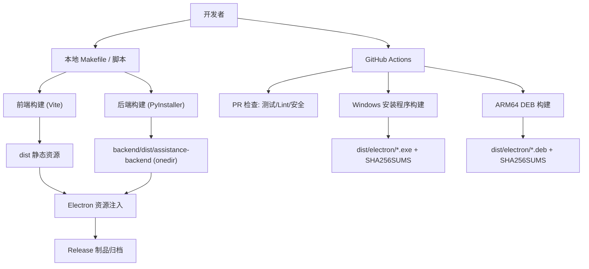
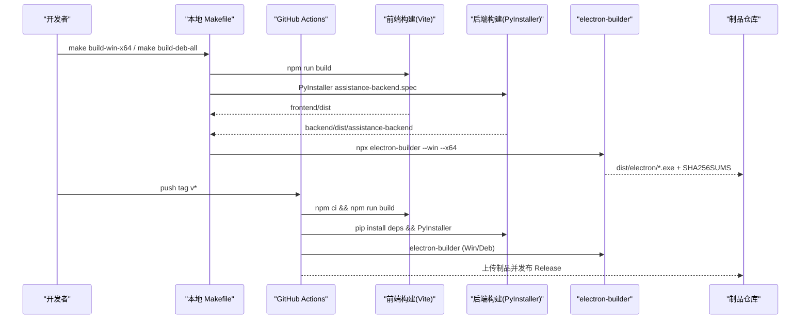
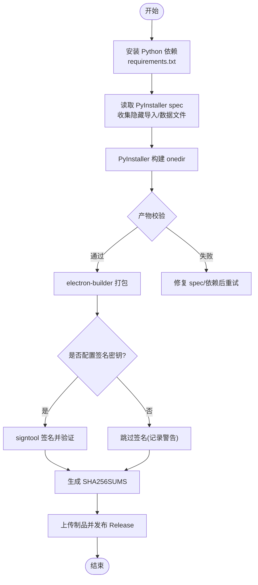
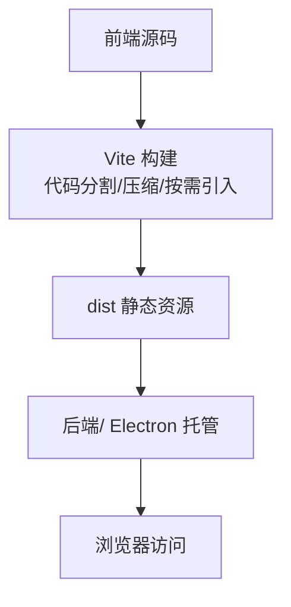
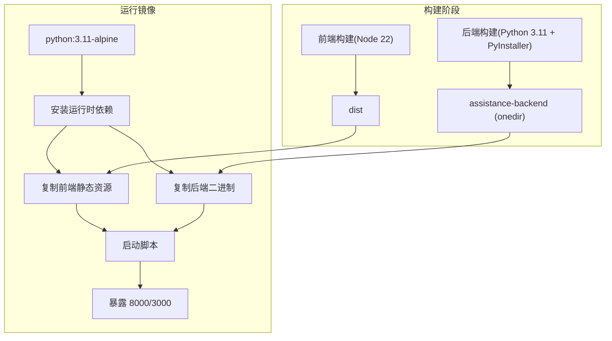
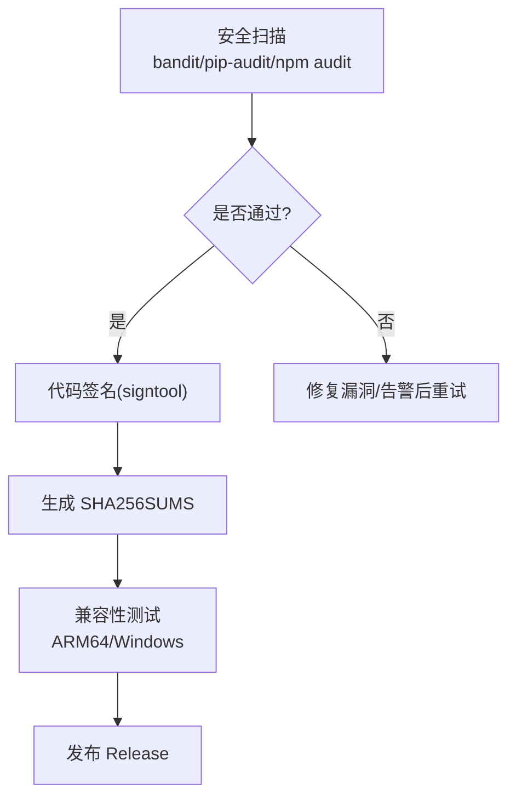
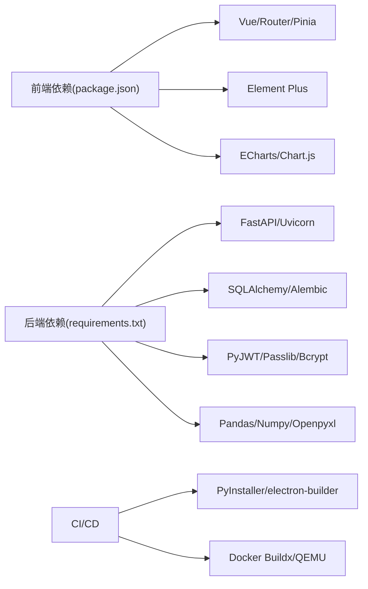

# 扩展包打包发布

<cite>
**本文引用的文件**
- [backend/pyproject.toml](file://backend/pyproject.toml)
- [backend/requirements.txt](file://backend/requirements.txt)
- [backend/version.json](file://backend/version.json)
- [backend/assistance-backend.spec](file://backend/assistance-backend.spec)
- [backend/backend_linux_arm64.spec](file://backend/backend_linux_arm64.spec)
- [frontend/package.json](file://frontend/package.json)
- [frontend/vite.config.ts](file://frontend/vite.config.ts)
- [docker/Dockerfile](file://docker/Dockerfile)
- [.github/workflows/build-windows.yml](file://.github/workflows/build-windows.yml)
- [.github/workflows/build-arm64.yml](file://.github/workflows/build-arm64.yml)
- [.github/workflows/pr-checks.yml](file://.github/workflows/pr-checks.yml)
- [Makefile](file://Makefile)
</cite>

## 目录
1. [简介](#简介)
2. [项目结构](#项目结构)
3. [核心组件](#核心组件)
4. [架构总览](#架构总览)
5. [详细组件分析](#详细组件分析)
6. [依赖关系分析](#依赖关系分析)
7. [性能与体积优化](#性能与体积优化)
8. [故障排查指南](#故障排查指南)
9. [结论](#结论)
10. [附录：命令速查](#附录命令速查)

## 简介
本指南面向“帮扶管理信息系统”的扩展包打包与发布，覆盖以下目标：
- Python 后端扩展包的打包格式、依赖声明、版本管理与发布流程
- 前端组件库的构建配置、模块导出策略与 npm 发布方法
- Docker 容器化打包方案（镜像构建、多架构支持、部署配置）
- 扩展包签名验证、安全扫描与兼容性测试
- CI/CD 流水线配置、自动化测试与持续集成最佳实践

## 项目结构
仓库采用前后端分离与多产物交付的结构：
- 后端：FastAPI + PyInstaller 打包为 onedir 可执行；提供 ARM64 专用 spec；依赖通过 requirements 锁定
- 前端：Vite + Vue3，生产构建输出静态资源；通过 electron-builder 生成 Windows 安装包与 Linux DEB
- 容器：Dockerfile 多阶段构建前端与后端，并产出运行镜像；另有麒麟/DEB 专用 Dockerfile
- CI：GitHub Actions 工作流负责 PR 检查、Windows 安装程序构建、ARM64 DEB 构建与 Release 发布
- Makefile：统一本地开发、测试、构建、打包入口

图表来源
- [Makefile:100-160](file://Makefile#L100-L160)
- [.github/workflows/build-windows.yml:55-262](file://.github/workflows/build-windows.yml#L55-L262)
- [.github/workflows/build-arm64.yml:17-385](file://.github/workflows/build-arm64.yml#L17-L385)

章节来源
- [Makefile:1-341](file://Makefile#L1-L341)
- [.github/workflows/build-windows.yml:1-262](file://.github/workflows/build-windows.yml#L1-L262)
- [.github/workflows/build-arm64.yml:1-385](file://.github/workflows/build-arm64.yml#L1-L385)

## 核心组件
- Python 后端打包
  - 使用 PyInstaller onedir 模式，将 FastAPI 应用与依赖打包为独立目录，便于白名单审批与 Electron 集成
  - 隐藏导入与数据文件通过 spec 集中管理，避免动态导入遗漏
  - 提供 ARM64 专用 spec 用于跨平台交叉编译
- 前端构建与导出
  - Vite 生产构建启用代码分割、压缩与按需引入，输出到 dist
  - 构建时自动生成 version.json，供运行时版本校验
  - 通过 electron-builder 将前端资源与后端二进制组装为安装包/DEB
- Docker 多阶段构建
  - 阶段1：Node 构建前端
  - 阶段2：Python + PyInstaller 构建后端
  - 阶段3：最小运行镜像，包含 serve 与后端二进制，暴露端口并启动服务
- CI/CD 与质量门禁
  - PR 检查：覆盖率门禁、Lint、类型检查、安全扫描、SBOM 生成
  - 发布构建：Windows x64 安装程序、ARM64 DEB、SHA256 清单、Release 发布
  - 可选代码签名：signtool 对后端 exe 签名并验证

章节来源
- [backend/assistance-backend.spec:1-204](file://backend/assistance-backend.spec#L1-L204)
- [backend/backend_linux_arm64.spec:1-46](file://backend/backend_linux_arm64.spec#L1-L46)
- [frontend/vite.config.ts:55-472](file://frontend/vite.config.ts#L55-L472)
- [docker/Dockerfile:1-173](file://docker/Dockerfile#L1-L173)
- [.github/workflows/pr-checks.yml:17-134](file://.github/workflows/pr-checks.yml#L17-L134)
- [.github/workflows/build-windows.yml:155-262](file://.github/workflows/build-windows.yml#L155-L262)
- [.github/workflows/build-arm64.yml:96-385](file://.github/workflows/build-arm64.yml#L96-L385)

## 架构总览
下图展示从源码到最终产物的端到端流程，包括本地与 CI 两条路径。

图表来源
- [Makefile:126-160](file://Makefile#L126-L160)
- [.github/workflows/build-windows.yml:91-213](file://.github/workflows/build-windows.yml#L91-L213)
- [.github/workflows/build-arm64.yml:81-199](file://.github/workflows/build-arm64.yml#L81-L199)

## 详细组件分析

### Python 后端打包与发布
- 打包格式
  - onedir 模式：主程序与依赖位于同一目录，便于 Electron 集成与系统白名单审批
  - 隐藏导入：显式列出 uvicorn/fastapi/sqlalchemy 等动态加载模块，确保冻结后仍可运行
  - 数据文件：alembic 迁移目录、配置文件作为 data 注入
- 依赖声明
  - 使用 requirements.txt 锁定关键依赖版本，避免构建漂移
  - 可选依赖（如 prophet）在构建失败时降级处理
- 版本管理
  - 版本号由 scripts/sync_version.py 与 CI 同步，保证 package.json、version.json、构建元数据一致
  - 构建产物附带 SHA256SUMS，用于完整性校验
- 发布流程
  - Windows：PyInstaller 构建后端 -> electron-builder 打包安装程序 -> 生成 SHA256SUMS -> 发布 Release
  - Linux ARM64：QEMU + Buildx 构建后端二进制 -> electron-builder 生成 DEB -> postinst 修复权限 -> 发布 Release

图表来源
- [backend/assistance-backend.spec:151-204](file://backend/assistance-backend.spec#L151-L204)
- [.github/workflows/build-windows.yml:125-213](file://.github/workflows/build-windows.yml#L125-L213)
- [.github/workflows/build-windows.yml:217-262](file://.github/workflows/build-windows.yml#L217-L262)

章节来源
- [backend/assistance-backend.spec:1-204](file://backend/assistance-backend.spec#L1-L204)
- [backend/backend_linux_arm64.spec:1-46](file://backend/backend_linux_arm64.spec#L1-L46)
- [backend/requirements.txt:1-137](file://backend/requirements.txt#L1-L137)
- [backend/version.json:1-16](file://backend/version.json#L1-L16)
- [.github/workflows/build-windows.yml:115-213](file://.github/workflows/build-windows.yml#L115-L213)
- [.github/workflows/build-arm64.yml:17-68](file://.github/workflows/build-arm64.yml#L17-L68)

### 前端组件库打包配置与 npm 发布
- 构建配置
  - Vite 生产构建启用代码分割、Gzip/Brotli 压缩、按需引入 Element Plus/ECharts
  - 自动注入 version.json，供运行时版本指纹校验
  - 路由懒加载与 chunk 命名策略优化首屏与缓存命中
- 模块导出
  - 以 SPA 形式构建，静态资源输出至 dist，由后端或 Electron 托管
  - 若需作为 npm 包分发，可将公共组件抽取为独立包，并通过 vite-plugin-dts 生成类型声明
- npm 发布方法（建议）
  - 将公共组件目录抽离为子包，维护独立的 package.json 与依赖
  - 使用 npm publish 发布到私有/公共 registry
  - 在业务前端通过依赖引用该包，保持版本一致性

图表来源
- [frontend/vite.config.ts:55-472](file://frontend/vite.config.ts#L55-L472)
- [frontend/package.json:1-73](file://frontend/package.json#L1-L73)

章节来源
- [frontend/vite.config.ts:55-472](file://frontend/vite.config.ts#L55-L472)
- [frontend/package.json:1-73](file://frontend/package.json#L1-L73)

### Docker 容器化打包方案
- 多阶段构建
  - 阶段1：Node 22 构建前端静态资源
  - 阶段2：Python 3.11 + PyInstaller 构建后端二进制
  - 阶段3：最小运行镜像，安装运行时依赖，复制产物并启动服务
- 多架构支持
  - 通过 docker buildx 与 QEMU 实现 linux/arm64 交叉构建
  - 麒麟/DEB 专用 Dockerfile 支持 standalone 模式（无 Electron）
- 部署配置
  - 暴露 8000（后端）与 3000（前端），非 root 用户运行
  - 启动脚本拉起后端与前端服务，等待进程退出

图表来源
- [docker/Dockerfile:6-173](file://docker/Dockerfile#L6-L173)

章节来源
- [docker/Dockerfile:1-173](file://docker/Dockerfile#L1-L173)
- [.github/workflows/build-arm64.yml:23-68](file://.github/workflows/build-arm64.yml#L23-L68)

### 签名验证、安全扫描与兼容性测试
- 签名验证
  - Windows：使用 signtool 对后端 exe 进行 Authenticode 签名并验证（可选，需配置证书 secret）
  - 产物附带 SHA256SUMS，下载后可校验完整性
- 安全扫描
  - 后端：bandit 安全扫描、pip-audit 依赖漏洞扫描、flake8/mypy 代码质量检查
  - 前端：npm audit（high+阻断）、ESLint/Vitest 检查
  - SBOM：生成许可证清单供军口白名单审查
- 兼容性测试
  - ARM64：QEMU + Buildx 构建后端二进制与 DEB，postinst 修复权限，dpkg 内容校验
  - Windows：VC++ Redistributable 钉扎下载与校验，electron-builder 打包验证

图表来源
- [.github/workflows/pr-checks.yml:68-134](file://.github/workflows/pr-checks.yml#L68-L134)
- [.github/workflows/build-windows.yml:155-190](file://.github/workflows/build-windows.yml#L155-L190)
- [.github/workflows/build-arm64.yml:270-286](file://.github/workflows/build-arm64.yml#L270-L286)

章节来源
- [.github/workflows/pr-checks.yml:68-134](file://.github/workflows/pr-checks.yml#L68-L134)
- [.github/workflows/build-windows.yml:155-190](file://.github/workflows/build-windows.yml#L155-L190)
- [.github/workflows/build-arm64.yml:270-286](file://.github/workflows/build-arm64.yml#L270-L286)

## 依赖关系分析
- 后端依赖
  - Web 框架：fastapi、uvicorn、starlette
  - 数据库：SQLAlchemy、alembic
  - 认证与安全：PyJWT、passlib、bcrypt、cryptography
  - 数据处理：pandas、numpy、openpyxl、reportlab
  - 工具：python-dotenv、diskcache、psutil
- 前端依赖
  - Vue 生态：vue、vue-router、pinia
  - UI 组件：element-plus、@element-plus/icons-vue
  - 图表：echarts、chart.js
  - 构建工具：vite、vitest、eslint、typescript
- 构建与 CI
  - PyInstaller、electron-builder、docker buildx、QEMU
  - GitHub Actions 工作流协调各阶段构建与发布

图表来源
- [frontend/package.json:26-68](file://frontend/package.json#L26-L68)
- [backend/requirements.txt:1-137](file://backend/requirements.txt#L1-L137)
- [.github/workflows/build-windows.yml:125-213](file://.github/workflows/build-windows.yml#L125-L213)
- [.github/workflows/build-arm64.yml:23-68](file://.github/workflows/build-arm64.yml#L23-L68)

章节来源
- [frontend/package.json:1-73](file://frontend/package.json#L1-L73)
- [backend/requirements.txt:1-137](file://backend/requirements.txt#L1-L137)
- [.github/workflows/build-windows.yml:125-213](file://.github/workflows/build-windows.yml#L125-L213)
- [.github/workflows/build-arm64.yml:23-68](file://.github/workflows/build-arm64.yml#L23-L68)

## 性能与体积优化
- 前端
  - 代码分割：按功能域拆分 vendor、views、图表等 chunk，减少首屏体积
  - 压缩：Gzip/Brotli 双算法，Terser 移除 console/debugger，ASCII 输出避免编码问题
  - 按需引入：Element Plus/ECharts 按需加载，避免整包引入
- 后端
  - onedir 模式避免 onefile 冷启动慢与杀软误报
  - 排除不必要模块（pytest、matplotlib 等）减小体积
- 容器
  - 多阶段构建仅保留运行时依赖，缩小镜像体积
  - 非 root 用户运行，提升安全性

[本节为通用指导，不直接分析具体文件]

## 故障排查指南
- 构建失败
  - 前端：检查 node_modules 缓存、依赖冲突（legacy-peer-deps）、Vite 构建日志
  - 后端：确认 PyInstaller spec 中隐藏导入完整，依赖安装成功
  - Electron：检查 VC++ Redistributable 是否拉取成功、签名证书是否可用
- 运行异常
  - 权限：Linux DEB 安装后 postinst 修复可执行位与 chrome-sandbox 权限
  - 端口：确认 8000/3000 未被占用，防火墙放行
- 安全告警
  - bandit 高严重级别告警需修复后再发布
  - pip-audit/npm audit 高危漏洞需升级依赖

章节来源
- [.github/workflows/build-windows.yml:192-213](file://.github/workflows/build-windows.yml#L192-L213)
- [.github/workflows/build-arm64.yml:201-268](file://.github/workflows/build-arm64.yml#L201-L268)
- [.github/workflows/pr-checks.yml:68-134](file://.github/workflows/pr-checks.yml#L68-L134)

## 结论
本项目提供了完整的扩展包打包与发布体系：
- Python 后端通过 PyInstaller onedir 打包，spec 集中管理依赖与数据文件
- 前端基于 Vite 构建，配合 electron-builder 生成多平台安装包/DEB
- Docker 多阶段构建支持多架构，麒麟 standalone 模式满足无 Electron 场景
- CI/CD 覆盖 PR 检查、安全扫描、签名验证、兼容性测试与 Release 发布
- 通过 Makefile 统一本地与 CI 的构建入口，提升效率与一致性

[本节为总结性内容，不直接分析具体文件]

## 附录：命令速查
- 本地构建
  - Windows 安装程序：make build-win-x64 / make build-win-x86 / make build-win-all
  - DEB 包：make build-deb-amd64 / make build-deb-arm64 / make build-deb-all
  - 麒麟 standalone：make build-kylin-arm64
- 测试与质量
  - 全部测试：make test
  - 覆盖率：make coverage
  - 部署前检查：make deploy-check
  - 安全扫描：make security
- CI 触发
  - 推送标签 v* 触发 Windows/ARM64 构建与 Release 发布
  - PR 合并前自动运行 PR Checks

章节来源
- [Makefile:100-341](file://Makefile#L100-L341)
- [.github/workflows/build-windows.yml:1-262](file://.github/workflows/build-windows.yml#L1-L262)
- [.github/workflows/build-arm64.yml:1-385](file://.github/workflows/build-arm64.yml#L1-L385)
- [.github/workflows/pr-checks.yml:1-134](file://.github/workflows/pr-checks.yml#L1-L134)