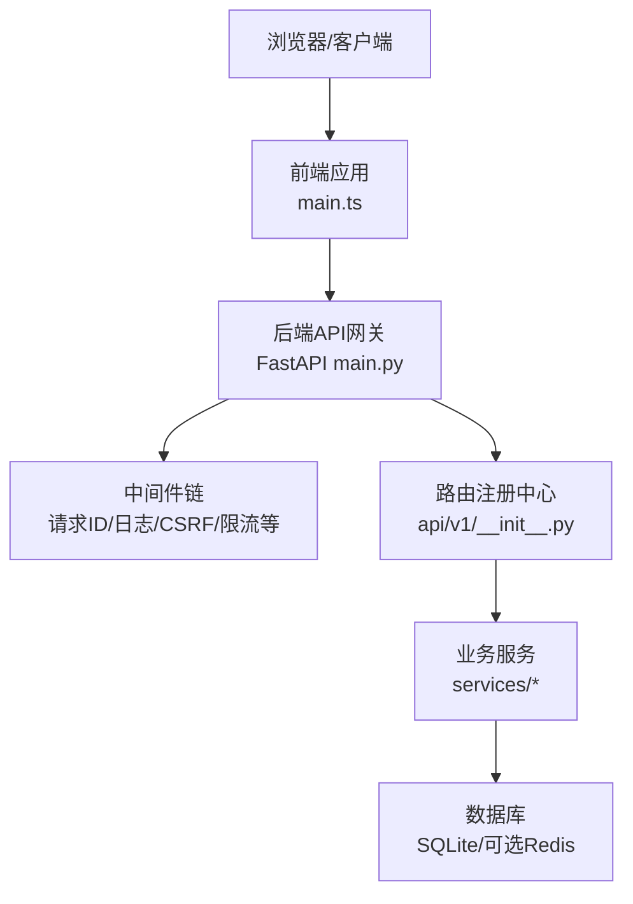
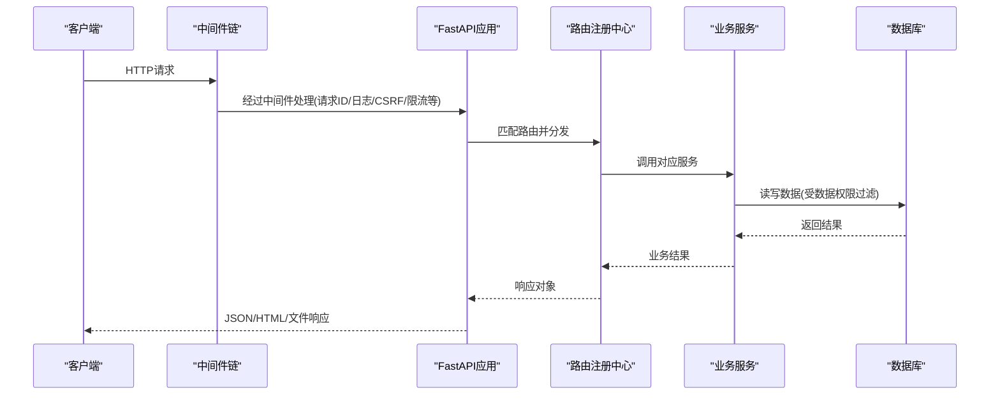
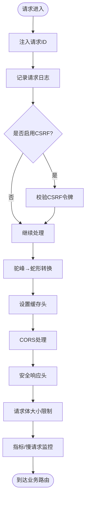
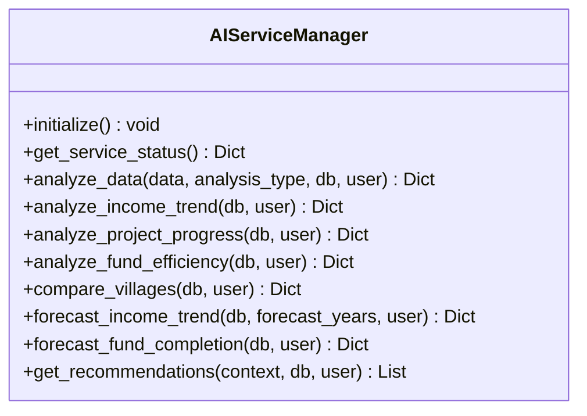
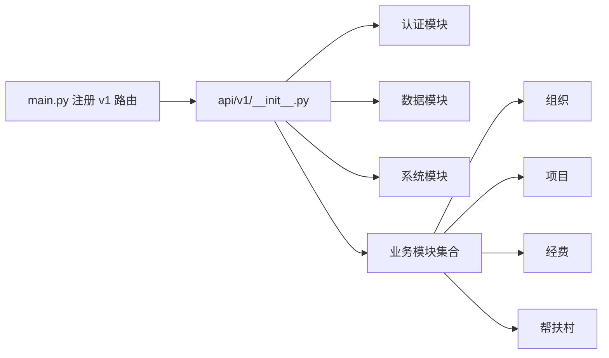
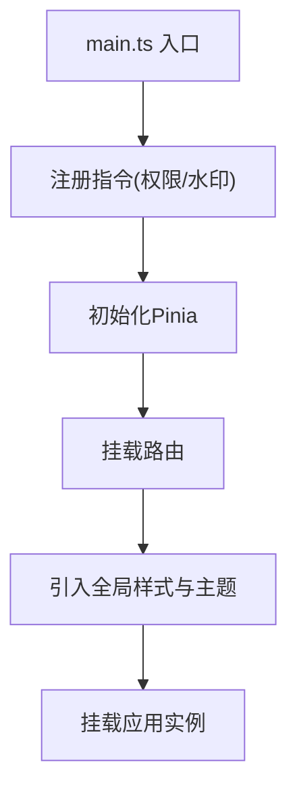
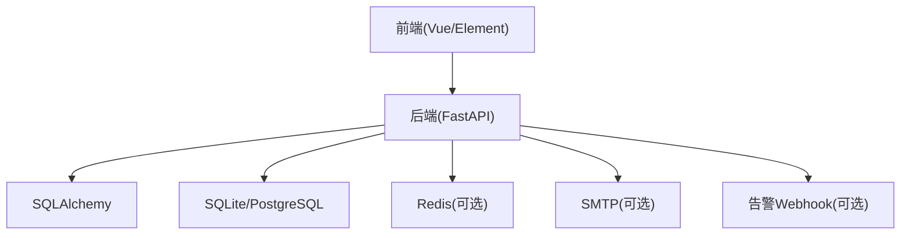

# 扩展开发

<cite>
**本文引用的文件**
- [backend/app/main.py](file://backend/app/main.py)
- [backend/app/core/config.py](file://backend/app/core/config.py)
- [backend/app/api/v1/__init__.py](file://backend/app/api/v1/__init__.py)
- [backend/app/services/ai_service.py](file://backend/app/services/ai_service.py)
- [backend/app/middleware/request_id.py](file://backend/app/middleware/request_id.py)
- [backend/app/middleware/request_logger.py](file://backend/app/middleware/request_logger.py)
- [backend/app/middleware/csrf_middleware.py](file://backend/app/middleware/csrf_middleware.py)
- [backend/app/middleware/query_counter.py](file://backend/app/middleware/query_counter.py)
- [backend/app/middleware/slow_request_monitor.py](file://backend/app/middleware/slow_request_monitor.py)
- [backend/app/middleware/cache_headers.py](file://backend/app/middleware/cache_headers.py)
- [backend/app/middleware/body_size_limit.py](file://backend/app/middleware/body_size_limit.py)
- [frontend/src/main.ts](file://frontend/src/main.ts)
</cite>

## 目录
1. [简介](#简介)
2. [项目结构](#项目结构)
3. [核心组件](#核心组件)
4. [架构总览](#架构总览)
5. [详细组件分析](#详细组件分析)
6. [依赖关系分析](#依赖关系分析)
7. [性能考量](#性能考量)
8. [故障排查指南](#故障排查指南)
9. [结论](#结论)
10. [附录](#附录)

## 简介
本指导文档面向希望在本系统中进行“系统扩展”的开发者，覆盖插件化机制、第三方服务集成、自定义报表、移动端适配、中间件与后端服务扩展、前端组件扩展等主题。文档基于当前代码库的实际实现，给出可操作的扩展点、最佳实践、代码规范、集成测试方法以及打包发布与版本兼容性建议，帮助构建可复用的扩展功能。

## 项目结构
系统采用前后端分离架构：
- 后端：FastAPI + SQLAlchemy，模块化路由与服务层，集中式中间件链，配置集中管理。
- 前端：Vue 3 + Element Plus，统一入口挂载指令与全局样式，按需自动导入组件。
- 部署：支持 Electron 桌面应用与 Docker/Kylin 环境，静态资源由后端托管并提供 SPA fallback。

**图示来源**
- [backend/app/main.py:98-178](file://backend/app/main.py#L98-L178)
- [backend/app/api/v1/__init__.py:29-140](file://backend/app/api/v1/__init__.py#L29-L140)
- [frontend/src/main.ts:46-66](file://frontend/src/main.ts#L46-L66)

**章节来源**
- [backend/app/main.py:98-178](file://backend/app/main.py#L98-L178)
- [backend/app/api/v1/__init__.py:29-140](file://backend/app/api/v1/__init__.py#L29-L140)
- [frontend/src/main.ts:46-66](file://frontend/src/main.ts#L46-L66)

## 核心组件
- 应用生命周期与启动流程：在 FastAPI lifespan 中初始化数据库、迁移、任务队列、监控与备份调度等。
- 配置管理：集中通过 Settings 类从环境变量加载，动态计算路径与安全策略（如生产环境强制关闭 SQL echo）。
- 路由注册：v1 路由模块以静态导入方式集中注册所有业务模块，保证打包与快速失败。
- 中间件链：按逆序执行，包含审计、日志、CSRF、驼峰转换、缓存头、CORS、安全响应头、请求体大小限制、慢请求监控、查询计数、请求ID等。
- 服务层：领域服务与通用服务（AI分析、缓存、备份、RBAC等）解耦于路由，便于复用与测试。

**章节来源**
- [backend/app/main.py:66-178](file://backend/app/main.py#L66-L178)
- [backend/app/core/config.py:54-383](file://backend/app/core/config.py#L54-L383)
- [backend/app/api/v1/__init__.py:29-140](file://backend/app/api/v1/__init__.py#L29-L140)

## 架构总览
下图展示了请求进入后的处理链路，包括中间件顺序、路由分发到具体业务模块，以及服务层调用。

**图示来源**
- [backend/app/main.py:111-178](file://backend/app/main.py#L111-L178)
- [backend/app/api/v1/__init__.py:102-140](file://backend/app/api/v1/__init__.py#L102-L140)

## 详细组件分析

### 中间件扩展点
- 扩展位置：在 main.py 中通过 add_middleware 或 @app.middleware("http") 注册。
- 典型中间件：
  - 请求ID追踪：为每个请求生成唯一ID，贯穿日志与审计。
  - 请求日志：记录入参、出参与耗时。
  - CSRF保护：仅在启用时注册，防止跨站请求伪造。
  - 驼峰转蛇形：将前端 camelCase 转为后端 snake_case。
  - 缓存头：对静态资源设置长期缓存。
  - CORS：允许跨域访问。
  - 安全响应头：统一注入安全相关头部。
  - 请求体大小限制：防止超大上传。
  - 慢请求监控与查询计数：用于性能分析与优化。
- 扩展建议：
  - 新增中间件应遵循单一职责，避免阻塞主流程。
  - 使用异步函数，确保非阻塞。
  - 在异常分支中记录上下文信息（请求ID、用户、URL等）。
  - 通过配置开关控制是否启用（如 CSRF_ENABLED）。

**图示来源**
- [backend/app/main.py:111-178](file://backend/app/main.py#L111-L178)
- [backend/app/middleware/request_id.py](file://backend/app/middleware/request_id.py)
- [backend/app/middleware/request_logger.py](file://backend/app/middleware/request_logger.py)
- [backend/app/middleware/csrf_middleware.py](file://backend/app/middleware/csrf_middleware.py)
- [backend/app/middleware/camel_to_snake.py](file://backend/app/middleware/camel_to_snake.py)
- [backend/app/middleware/cache_headers.py](file://backend/app/middleware/cache_headers.py)
- [backend/app/middleware/body_size_limit.py](file://backend/app/middleware/body_size_limit.py)
- [backend/app/middleware/slow_request_monitor.py](file://backend/app/middleware/slow_request_monitor.py)
- [backend/app/middleware/query_counter.py](file://backend/app/middleware/query_counter.py)

**章节来源**
- [backend/app/main.py:111-178](file://backend/app/main.py#L111-L178)

### 服务扩展点（含AI分析服务示例）
- 服务组织：按领域划分 services 子目录，提供独立的服务类与方法；通过 __init__.py 显式导出，便于打包与测试。
- AI分析服务：提供本地统计分析引擎，包括收入趋势、项目进度、经费效率、村庄对比、预测与建议等。
- 扩展建议：
  - 新增服务类应遵循接口清晰、参数校验、错误处理与日志记录。
  - 使用数据权限过滤（filter_by_data_scope）确保多租户隔离。
  - 对外暴露的方法尽量幂等，便于重试与编排。
  - 提供状态查询与健康检查方法，便于运维监控。

**图示来源**
- [backend/app/services/ai_service.py:18-616](file://backend/app/services/ai_service.py#L18-L616)

**章节来源**
- [backend/app/services/ai_service.py:18-616](file://backend/app/services/ai_service.py#L18-L616)

### 路由与模块扩展点
- 路由注册：v1 路由模块通过静态导入集中注册所有业务模块，保证 PyInstaller 打包正确性与快速失败。
- 扩展建议：
  - 新增业务模块应在 api/v1 下创建独立模块，并在 __init__.py 中静态导入与 include_router。
  - 注意路由优先级：动态路由与精确路径的顺序需合理设计，避免误匹配。
  - 为每个模块提供清晰的文档与单元测试，确保扩展稳定性。

**图示来源**
- [backend/app/main.py:173-178](file://backend/app/main.py#L173-L178)
- [backend/app/api/v1/__init__.py:29-140](file://backend/app/api/v1/__init__.py#L29-L140)

**章节来源**
- [backend/app/api/v1/__init__.py:29-140](file://backend/app/api/v1/__init__.py#L29-L140)

### 前端组件扩展点
- 入口挂载：main.ts 中注册全局指令（权限、水印）、Pinia、路由与全局错误处理，并引入统一样式与主题。
- 扩展建议：
  - 新增指令或插件应在 main.ts 中集中注册，保持可维护性。
  - 组件样式通过 SCSS 统一管理，避免硬编码颜色与重复样式。
  - 命令式 UI（消息、通知）需显式引入样式，确保渲染正常。
  - 移动端适配：通过响应式布局与媒体查询，结合 Element Plus 的栅格与表单组件，提升小屏体验。

**图示来源**
- [frontend/src/main.ts:46-66](file://frontend/src/main.ts#L46-L66)

**章节来源**
- [frontend/src/main.ts:46-66](file://frontend/src/main.ts#L46-L66)

### 第三方服务集成
- 配置驱动：通过 Settings 集中管理外部服务配置（如 Redis、SMTP、告警 Webhook），支持加密密钥与运行时密钥存储。
- 集成模式：
  - 可选依赖：通过 try/except 或配置开关控制是否启用外部服务。
  - 健康检查：在服务层提供状态查询，便于监控与降级。
  - 容错与重试：对网络请求增加超时、重试与熔断策略。
- 扩展建议：
  - 新增第三方服务应封装为独立服务类，提供统一的接口与错误处理。
  - 敏感配置通过环境变量或加密文件注入，避免硬编码。
  - 提供离线降级方案，确保核心功能不受外部依赖影响。

**章节来源**
- [backend/app/core/config.py:54-383](file://backend/app/core/config.py#L54-L383)

### 自定义报表开发
- 数据源：基于 SQLAlchemy 聚合查询，结合数据权限过滤，确保多租户隔离。
- 分析能力：参考 AI 分析服务，提供趋势、对比、预测与建议等能力。
- 输出格式：支持 JSON、Excel、PDF 等格式，便于导出与展示。
- 扩展建议：
  - 报表逻辑封装为服务方法，便于复用与测试。
  - 提供分页与增量更新，提升大数据量下的性能。
  - 对复杂查询建立索引与物化视图，优化性能。

**章节来源**
- [backend/app/services/ai_service.py:74-558](file://backend/app/services/ai_service.py#L74-L558)

### 移动端适配
- 布局：使用 Element Plus 栅格与响应式组件，结合媒体查询调整布局。
- 交互：简化表单与列表操作，减少点击次数，提升触控体验。
- 性能：懒加载图片与数据，减少首屏体积。
- 扩展建议：
  - 针对小屏设备优化字体大小与间距，提升可读性。
  - 使用触摸友好的控件（如滑动删除、长按菜单）。
  - 在网络不稳定环境下提供离线缓存与重试机制。

[本节为概念性内容，不直接分析具体文件]

## 依赖关系分析
- 后端依赖：
  - FastAPI/Starlette：HTTP框架与中间件体系。
  - SQLAlchemy：ORM与数据库访问。
  - Alembic：数据库迁移。
  - 可选：Redis、SMTP、告警Webhook等外部服务。
- 前端依赖：
  - Vue 3、Element Plus、Pinia、Vite 构建工具。
- 打包与部署：
  - PyInstaller/Electron/Docker/Kylin 环境。

**图示来源**
- [backend/app/core/config.py:114-198](file://backend/app/core/config.py#L114-L198)

**章节来源**
- [backend/app/core/config.py:114-198](file://backend/app/core/config.py#L114-L198)

## 性能考量
- 中间件顺序：将轻量级中间件置于外层，重量级或阻塞型中间件置于内层，减少不必要的开销。
- 数据库优化：合理使用索引、分页与聚合查询，避免全表扫描。
- 缓存策略：对静态资源与低变化数据设置合理的缓存头，减少重复请求。
- 监控与诊断：通过慢请求监控与查询计数定位性能瓶颈。
- 资源限制：设置请求体大小限制与连接池参数，防止资源耗尽。

[本节为通用性能建议，不直接分析具体文件]

## 故障排查指南
- 启动失败：检查路由模块导入是否正确，确保静态导入无语法错误。
- 路由冲突：核对路由优先级，避免动态路由误匹配。
- 中间件异常：查看请求日志与审计日志，定位问题所在中间件。
- 数据库迁移：通过 /health 端点检查迁移状态，必要时手动执行 Alembic 升级。
- 前端样式缺失：确认命令式 UI 样式已显式引入，避免 FOUC 或样式未生效。

**章节来源**
- [backend/app/main.py:235-257](file://backend/app/main.py#L235-L257)
- [frontend/src/main.ts:16-37](file://frontend/src/main.ts#L16-L37)

## 结论
本系统提供了完善的扩展机制与清晰的扩展点，涵盖中间件、服务、路由与前端组件。通过配置驱动、模块化设计与严格的打包策略，开发者可以高效地构建可复用的扩展功能。建议在扩展过程中遵循最佳实践与代码规范，完善测试与监控，确保系统的稳定性与可维护性。

[本节为总结性内容，不直接分析具体文件]

## 附录
- 最佳实践
  - 新增中间件：单一职责、异步处理、异常记录、配置开关。
  - 新增服务：接口清晰、参数校验、错误处理、数据权限过滤。
  - 新增路由：静态导入、明确优先级、完整测试。
  - 新增前端组件：集中注册、样式管理、移动端适配。
- 代码规范
  - 命名约定：模块、类、方法名语义清晰。
  - 注释与文档：关键逻辑添加注释，提供 API 文档。
  - 错误处理：统一异常类型与错误码，便于前端处理。
- 集成测试
  - 单元测试：覆盖核心逻辑与边界条件。
  - 集成测试：模拟数据库与外部服务，验证端到端流程。
  - 性能测试：压测关键接口，评估性能瓶颈。
- 打包发布
  - 版本管理：使用版本号与环境变量区分不同环境。
  - 兼容性：确保向后兼容，避免破坏性变更。
  - 发布流程：自动化构建与测试，确保质量门禁。

[本节为通用指导内容，不直接分析具体文件]