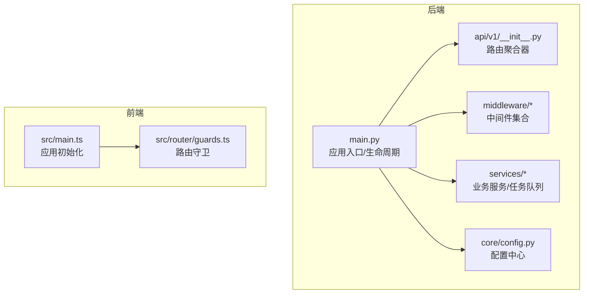
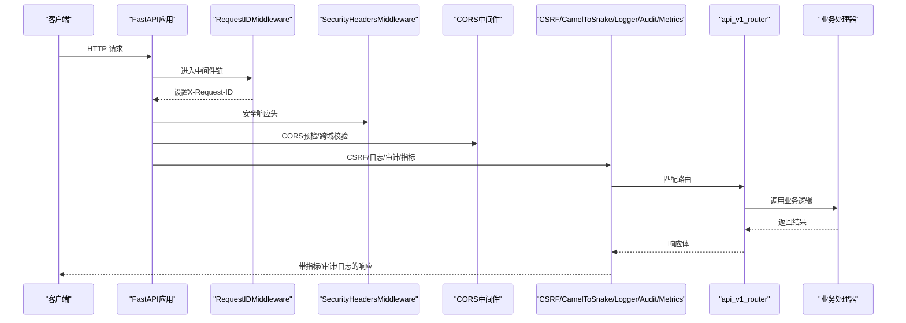
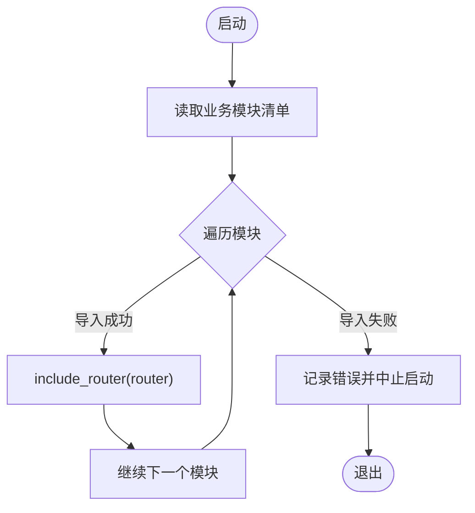
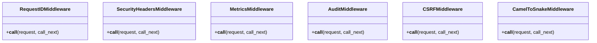
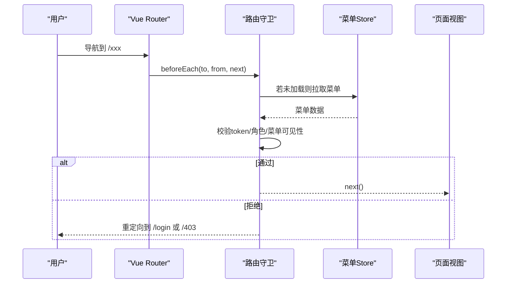
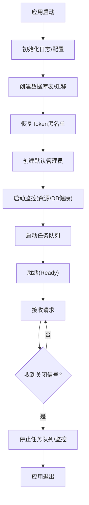
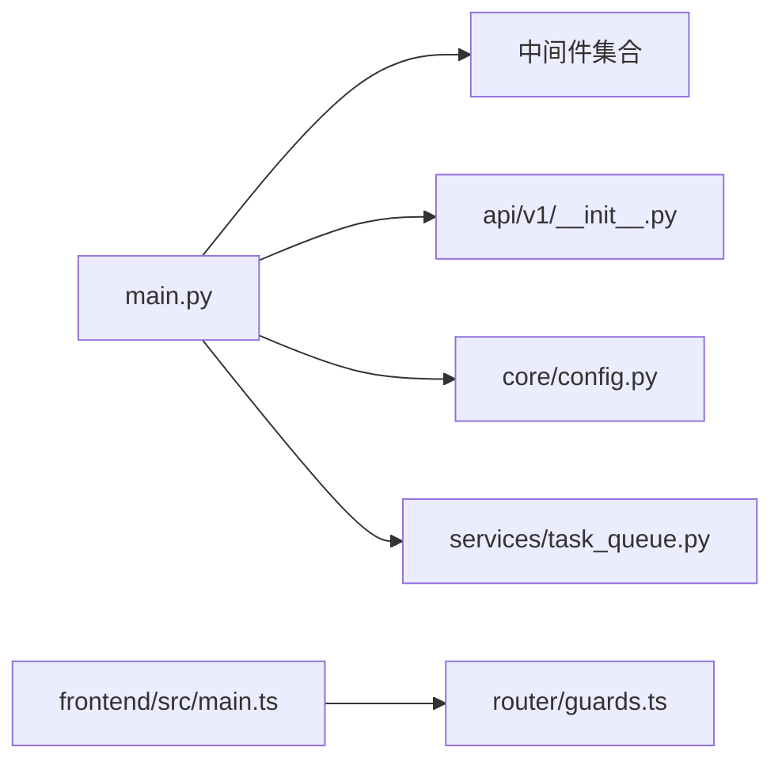

# 插件开发机制

<cite>
**本文引用的文件**
- [backend/app/main.py](file://backend/app/main.py)
- [backend/app/api/v1/__init__.py](file://backend/app/api/v1/__init__.py)
- [backend/app/core/config.py](file://backend/app/core/config.py)
- [backend/app/middleware/request_id.py](file://backend/app/middleware/request_id.py)
- [backend/app/middleware/audit_context.py](file://backend/app/middleware/audit_context.py)
- [backend/app/services/task_queue.py](file://backend/app/services/task_queue.py)
- [frontend/src/main.ts](file://frontend/src/main.ts)
- [frontend/src/router/guards.ts](file://frontend/src/router/guards.ts)
- [docs/03-开发文档/01-架构设计/框架架构.md](file://docs/03-开发文档/01-架构设计/框架架构.md)
</cite>

## 目录
1. [简介](#简介)
2. [项目结构](#项目结构)
3. [核心组件](#核心组件)
4. [架构总览](#架构总览)
5. [详细组件分析](#详细组件分析)
6. [依赖关系分析](#依赖关系分析)
7. [性能考虑](#性能考虑)
8. [故障排查指南](#故障排查指南)
9. [结论](#结论)
10. [附录](#附录)

## 简介
本文件面向“乡村振兴系统”的插件化扩展需求，围绕后端服务层、API 中间件与前端 Vue 组件三大扩展点，给出可落地的插件开发机制说明。内容涵盖：
- 插件注册机制（路由模块、中间件、前端指令/全局配置）
- 生命周期管理（应用启动/关闭钩子、任务队列、健康检查）
- 依赖注入与事件系统（数据库审计事件、请求上下文、任务队列）
- 插件配置、权限控制、版本兼容性与热重载策略
- 插件打包、分发、安装与卸载流程建议

本说明严格基于仓库现有实现进行归纳与映射，避免凭空臆造；对尚未实现的通用插件框架能力，以“建议与最佳实践”形式给出落地路径。

## 项目结构
系统采用前后端分离架构：
- 后端：FastAPI + SQLAlchemy，模块化路由、中间件与服务分层清晰
- 前端：Vue 3 + Pinia + Vue Router，指令与全局错误处理集中初始化

图表来源
- [backend/app/main.py:66-179](file://backend/app/main.py#L66-L179)
- [backend/app/api/v1/__init__.py:123-147](file://backend/app/api/v1/__init__.py#L123-L147)
- [backend/app/core/config.py:54-183](file://backend/app/core/config.py#L54-L183)
- [frontend/src/main.ts:46-66](file://frontend/src/main.ts#L46-L66)
- [frontend/src/router/guards.ts:13-85](file://frontend/src/router/guards.ts#L13-L85)

章节来源
- [backend/app/main.py:66-179](file://backend/app/main.py#L66-L179)
- [backend/app/api/v1/__init__.py:123-147](file://backend/app/api/v1/__init__.py#L123-L147)
- [backend/app/core/config.py:54-183](file://backend/app/core/config.py#L54-L183)
- [frontend/src/main.ts:46-66](file://frontend/src/main.ts#L46-L66)
- [frontend/src/router/guards.ts:13-85](file://frontend/src/router/guards.ts#L13-L85)

## 核心组件
- 应用生命周期（lifespan）：在启动时完成数据库表初始化、迁移、默认管理员创建、监控与任务队列启动；在关闭时有序停止后台任务与监控。
- 路由聚合：通过静态列表逐一 include_router，快速失败模式便于定位损坏模块。
- 中间件链：按添加逆序执行，覆盖请求ID、安全头、CORS、CSRF、日志、审计、指标等横切关注点。
- 配置中心：集中式 Settings，支持环境变量、加密密钥加载、路径动态解析、生产环境安全降级。
- 前端初始化：挂载指令、Pinia、Router、全局错误处理与消息默认行为。

章节来源
- [backend/app/main.py:66-179](file://backend/app/main.py#L66-L179)
- [backend/app/api/v1/__init__.py:123-147](file://backend/app/api/v1/__init__.py#L123-L147)
- [backend/app/core/config.py:54-183](file://backend/app/core/config.py#L54-L183)
- [frontend/src/main.ts:46-66](file://frontend/src/main.ts#L46-L66)

## 架构总览
下图展示一次 API 请求从进入 FastAPI 到返回响应的完整链路，体现中间件与路由的协作方式，以及插件扩展点的位置。

图表来源
- [backend/app/main.py:111-179](file://backend/app/main.py#L111-L179)
- [backend/app/api/v1/__init__.py:123-147](file://backend/app/api/v1/__init__.py#L123-L147)

章节来源
- [backend/app/main.py:111-179](file://backend/app/main.py#L111-L179)
- [backend/app/api/v1/__init__.py:123-147](file://backend/app/api/v1/__init__.py#L123-L147)

## 详细组件分析

### 后端服务层插件（路由模块）
- 注册机制：在 api/v1/__init__.py 中维护一个业务模块清单，循环 include_router。新增插件只需将模块加入清单并保证 router 导出正确。
- 快速失败：任一模块导入失败即中止启动，利于早期发现错误。
- 版本兼容：可通过路由前缀或版本号区分接口版本；结合配置中心开关功能特性。

图表来源
- [backend/app/api/v1/__init__.py:123-147](file://backend/app/api/v1/__init__.py#L123-L147)

章节来源
- [backend/app/api/v1/__init__.py:123-147](file://backend/app/api/v1/__init__.py#L123-L147)

### 后端中间件插件
- 注册位置：main.py 中集中 add_middleware，顺序决定执行栈。
- 典型插件：
  - RequestID：为每个请求生成唯一ID，贯穿日志与审计
  - SecurityHeaders：统一安全响应头
  - CORS/CSRF：跨域与跨站保护
  - Audit/RequestLogger/Metrics：审计、日志、指标采集
- 扩展建议：新增中间件遵循 Starlette BaseHTTPMiddleware 规范，并在 main.py 指定合适位置插入。

图表来源
- [backend/app/main.py:111-179](file://backend/app/main.py#L111-L179)
- [backend/app/middleware/request_id.py](file://backend/app/middleware/request_id.py)
- [backend/app/middleware/audit_context.py](file://backend/app/middleware/audit_context.py)

章节来源
- [backend/app/main.py:111-179](file://backend/app/main.py#L111-L179)

### 前端组件插件
- 指令与全局能力：main.ts 中注册自定义指令（如权限、水印）、全局错误处理、消息默认行为。
- 路由守卫：guards.ts 实现认证、角色与菜单可见性双重校验，是前端权限控制的入口。
- 扩展建议：新增组件插件可通过指令、组合式函数（composables）或全局 store 暴露能力，并在 main.ts 中集中装配。

图表来源
- [frontend/src/main.ts:46-66](file://frontend/src/main.ts#L46-L66)
- [frontend/src/router/guards.ts:13-85](file://frontend/src/router/guards.ts#L13-L85)

章节来源
- [frontend/src/main.ts:46-66](file://frontend/src/main.ts#L46-L66)
- [frontend/src/router/guards.ts:13-85](file://frontend/src/router/guards.ts#L13-L85)

### 生命周期管理与事件系统
- 启动阶段：创建数据库表、运行 Alembic 升级、恢复 token 黑名单、创建默认管理员、启动资源/数据库健康监控、启动任务队列。
- 关闭阶段：停止任务队列与各类监控。
- 事件系统：通过 SQLAlchemy 事件监听（如审计事件）实现写操作自动记录；可在 lifespan 中按需启用。

图表来源
- [backend/app/main.py:66-95](file://backend/app/main.py#L66-L95)
- [backend/app/main.py:397-500](file://backend/app/main.py#L397-L500)
- [backend/app/services/task_queue.py](file://backend/app/services/task_queue.py)

章节来源
- [backend/app/main.py:66-95](file://backend/app/main.py#L66-L95)
- [backend/app/main.py:397-500](file://backend/app/main.py#L397-L500)

### 依赖注入与配置
- 配置中心：Settings 提供统一配置入口，支持环境变量、加密密钥、路径动态解析、生产环境安全降级。
- 依赖注入：FastAPI 依赖注入用于服务间解耦；中间件与路由通过 app.add_middleware/include_router 装配。
- 插件配置：建议通过 Settings 或运行时配置项暴露插件开关、阈值、白名单等。

章节来源
- [backend/app/core/config.py:54-183](file://backend/app/core/config.py#L54-L183)
- [backend/app/main.py:111-179](file://backend/app/main.py#L111-L179)

### 权限控制与版本兼容性
- 后端：RBAC 模型与权限服务位于 models/rbac.py 与 services/rbac_service.py，配合中间件与路由级鉴权。
- 前端：路由守卫结合菜单可见性实现细粒度访问控制。
- 版本兼容：API 前缀与路由分组便于多版本并存；前端通过 version.json 与 useVersionCheck 实现前端版本检测与刷新。

章节来源
- [frontend/src/router/guards.ts:13-85](file://frontend/src/router/guards.ts#L13-L85)
- [docs/03-开发文档/01-架构设计/框架架构.md:395-457](file://docs/03-开发文档/01-架构设计/框架架构.md#L395-L457)

## 依赖关系分析
- 主入口 main.py 依赖：
  - 中间件模块（request_id、security、cors、csrf、logger、audit、metrics）
  - 路由聚合器 api/v1/__init__.py
  - 配置中心 core/config.py
  - 任务队列 services/task_queue.py
- 前端 main.ts 依赖：
  - 路由守卫 guards.ts
  - 全局错误处理与指令

图表来源
- [backend/app/main.py:111-179](file://backend/app/main.py#L111-L179)
- [backend/app/api/v1/__init__.py:123-147](file://backend/app/api/v1/__init__.py#L123-L147)
- [backend/app/core/config.py:54-183](file://backend/app/core/config.py#L54-L183)
- [backend/app/services/task_queue.py](file://backend/app/services/task_queue.py)
- [frontend/src/main.ts:46-66](file://frontend/src/main.ts#L46-L66)
- [frontend/src/router/guards.ts:13-85](file://frontend/src/router/guards.ts#L13-L85)

章节来源
- [backend/app/main.py:111-179](file://backend/app/main.py#L111-L179)
- [backend/app/api/v1/__init__.py:123-147](file://backend/app/api/v1/__init__.py#L123-L147)
- [backend/app/core/config.py:54-183](file://backend/app/core/config.py#L54-L183)
- [backend/app/services/task_queue.py](file://backend/app/services/task_queue.py)
- [frontend/src/main.ts:46-66](file://frontend/src/main.ts#L46-L66)
- [frontend/src/router/guards.ts:13-85](file://frontend/src/router/guards.ts#L13-L85)

## 性能考虑
- 中间件顺序：将轻量且必要的中间件置于外层（如 RequestID），将较重或可选的置于内层，减少不必要的开销。
- 路由加载：静态清单 include_router 快速失败，便于定位问题；建议保持模块小而精。
- 缓存与静态资源：使用带哈希的文件名与长期缓存策略，提升前端加载性能。
- 数据库：连接池参数与慢查询阈值可调；生产环境关闭 DB_ECHO 防止敏感信息泄露。

[本节为通用指导，不直接分析具体文件]

## 故障排查指南
- 启动失败：检查路由模块清单是否包含损坏模块；查看启动日志中的导入错误。
- 迁移失败：health 接口暴露 at_head 与 error 字段；生产环境迁移失败会中止启动，需回滚或修复迁移脚本。
- 权限问题：确认前端路由守卫与后端 RBAC 策略一致；检查菜单可见性与角色映射。
- 中间件异常：逐层注释中间件定位问题；优先验证 RequestID、CORS、CSRF 等基础中间件。

章节来源
- [backend/app/main.py:235-257](file://backend/app/main.py#L235-L257)
- [backend/app/main.py:431-500](file://backend/app/main.py#L431-L500)
- [frontend/src/router/guards.ts:13-85](file://frontend/src/router/guards.ts#L13-L85)

## 结论
本系统已具备清晰的插件扩展基座：后端通过路由聚合与中间件链提供可扩展点，前端通过指令、路由守卫与全局配置实现组件级扩展。结合生命周期管理与事件系统，可实现服务层、中间件层与前端组件层的插件化演进。建议在后续迭代中完善统一的插件元数据、注册表与热重载机制，进一步提升扩展性与可维护性。

[本节为总结，不直接分析具体文件]

## 附录

### 插件开发示例（基于现有机制的建议）
- 后端服务插件（路由模块）
  - 新建模块，定义 router 并实现若干端点
  - 将模块加入 api/v1/__init__.py 的业务清单
  - 通过 Settings 暴露插件开关与配置项
  - 参考：[backend/app/api/v1/__init__.py:123-147](file://backend/app/api/v1/__init__.py#L123-L147)
- 后端中间件插件
  - 实现 BaseHTTPMiddleware，封装横切逻辑
  - 在 main.py 指定顺序注册
  - 参考：[backend/app/main.py:111-179](file://backend/app/main.py#L111-L179)
- 前端组件插件
  - 以指令/组合式函数/全局 store 形式提供能力
  - 在 main.ts 中集中装配
  - 通过路由守卫控制可见性与权限
  - 参考：[frontend/src/main.ts:46-66](file://frontend/src/main.ts#L46-L66)、[frontend/src/router/guards.ts:13-85](file://frontend/src/router/guards.ts#L13-L85)

### 插件配置、权限控制、版本兼容性与热重载
- 配置：通过 Settings 与环境变量统一管理，支持加密密钥与路径动态解析
- 权限：后端 RBAC + 前端路由守卫双重校验
- 版本：API 前缀与前端 version.json 检测
- 热重载：开发期可使用 Vite/HMR；生产期建议灰度发布与滚动更新

章节来源
- [backend/app/core/config.py:54-183](file://backend/app/core/config.py#L54-L183)
- [docs/03-开发文档/01-架构设计/框架架构.md:395-457](file://docs/03-开发文档/01-架构设计/框架架构.md#L395-L457)

### 插件打包、分发、安装与卸载流程（建议）
- 打包：后端模块以独立包发布（含 requirements），前端组件以 npm 包或静态资源发布
- 分发：内部制品库或私有 npm registry
- 安装：后端通过 pip 安装并更新路由清单；前端通过构建集成或 CDN 引入
- 卸载：移除路由清单/中间件注册与前端引用，清理配置项与数据库迁移（如需）

[本节为通用流程建议，不直接分析具体文件]