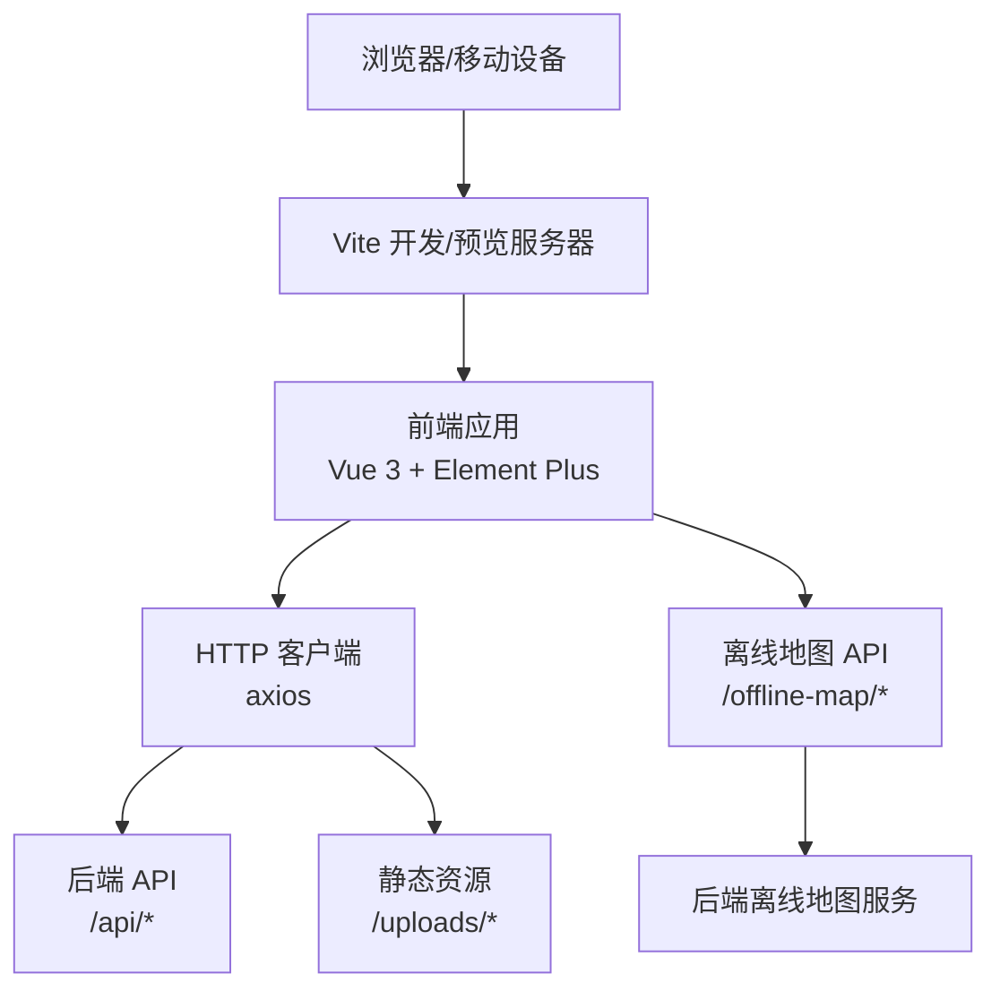
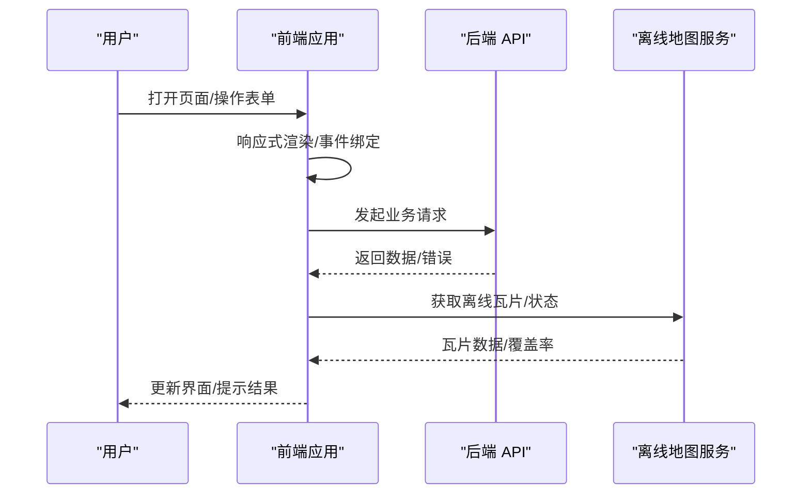
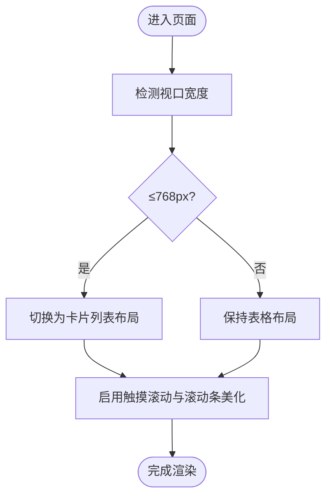
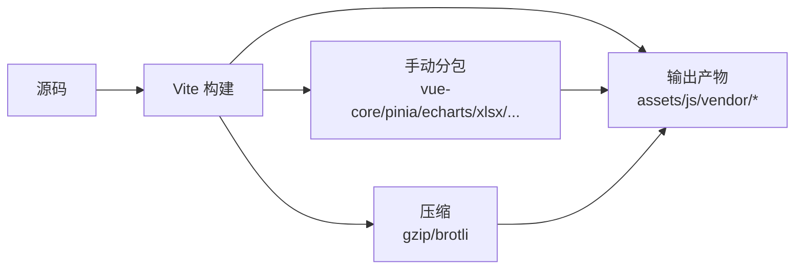
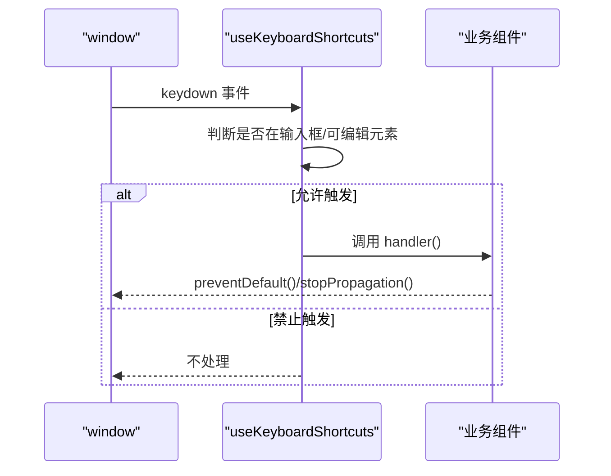
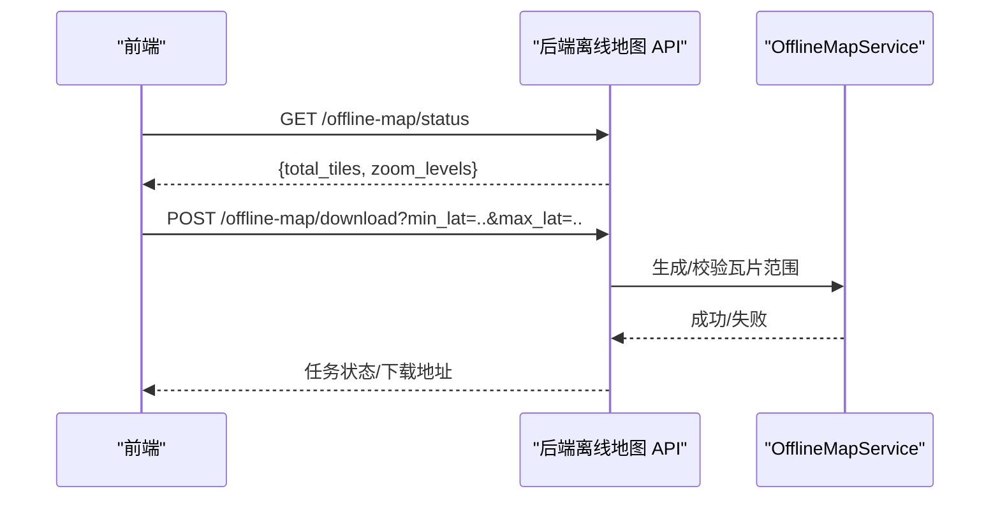
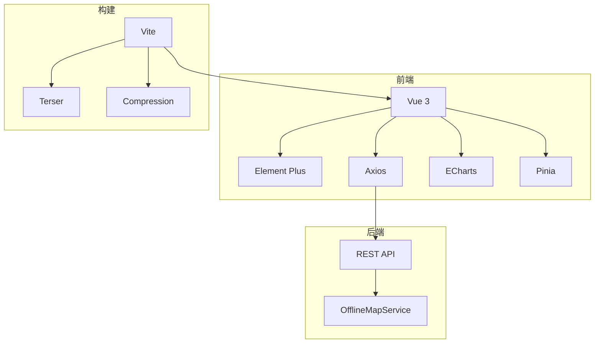

# 移动端适配

<cite>
**本文引用的文件**
- [frontend/index.html](file://frontend/index.html)
- [frontend/vite.config.ts](file://frontend/vite.config.ts)
- [frontend/package.json](file://frontend/package.json)
- [frontend/src/styles/index.scss](file://frontend/src/styles/index.scss)
- [frontend/src/styles/responsive.scss](file://frontend/src/styles/responsive.scss)
- [frontend/src/styles/components/layout.scss](file://frontend/src/styles/components/layout.scss)
- [frontend/src/composables/useKeyboardShortcuts.ts](file://frontend/src/composables/useKeyboardShortcuts.ts)
- [frontend/src/api/offlineMap.ts](file://frontend/src/api/offlineMap.ts)
- [backend/app/services/offline_map_service.py](file://backend/app/services/offline_map_service.py)
- [backend/tests/unit/test_offline_map_service.py](file://backend/tests/unit/test_offline_map_service.py)
- [frontend/tests/unit/api/requestErrorHandling.test.ts](file://frontend/tests/unit/api/requestErrorHandling.test.ts)
</cite>

## 目录
1. [简介](#简介)
2. [项目结构](#项目结构)
3. [核心组件](#核心组件)
4. [架构总览](#架构总览)
5. [详细组件分析](#详细组件分析)
6. [依赖关系分析](#依赖关系分析)
7. [性能考虑](#性能考虑)
8. [故障排查指南](#故障排查指南)
9. [结论](#结论)
10. [附录](#附录)

## 简介
本指南面向移动端适配与优化，结合当前代码库中的响应式样式、构建配置、离线地图能力与前端交互逻辑，提供从布局适配、触摸交互、性能调优到离线支持的一体化方案。文档同时给出移动端特有功能（如地理位置、相机拍照、文件上传）的实现建议与最佳实践，并覆盖 PWA 支持、跨平台兼容性与用户体验优化策略。

## 项目结构
本项目采用前后端分离架构：
- 前端基于 Vue 3 + Vite，使用 SCSS 实现响应式样式与主题变量，通过按需引入与分包优化首屏加载。
- 后端提供 RESTful API，包含离线地图瓦片服务，用于在无网络环境下展示地图数据。
- 构建阶段启用 Gzip/Brotli 压缩、代码分割与资源内联，提升移动端加载速度。

图表来源
- [frontend/vite.config.ts:190-205](file://frontend/vite.config.ts#L190-L205)
- [frontend/src/api/offlineMap.ts:1-21](file://frontend/src/api/offlineMap.ts#L1-L21)
- [backend/app/services/offline_map_service.py](file://backend/app/services/offline_map_service.py)

章节来源
- [frontend/index.html:1-14](file://frontend/index.html#L1-L14)
- [frontend/vite.config.ts:1-472](file://frontend/vite.config.ts#L1-L472)
- [frontend/package.json:1-73](file://frontend/package.json#L1-L73)

## 核心组件
- 响应式样式系统：集中定义断点、媒体查询 Mixin、容器与栅格、移动端卡片化表格等，确保多尺寸屏幕一致体验。
- 构建与打包优化：按模块拆分 vendor、视图与第三方库，启用 Gzip/Brotli 压缩与 CSS 代码分割，减少首屏体积。
- 键盘快捷键 Composable：统一注册与冲突检测，默认在输入框中禁用快捷键，避免误触发。
- 离线地图能力：前端提供离线地图 API，后端维护瓦片缓存并提供状态与下载接口，支撑弱网或离线场景。

章节来源
- [frontend/src/styles/responsive.scss:1-381](file://frontend/src/styles/responsive.scss#L1-L381)
- [frontend/src/styles/index.scss:1-459](file://frontend/src/styles/index.scss#L1-L459)
- [frontend/vite.config.ts:133-153](file://frontend/vite.config.ts#L133-L153)
- [frontend/vite.config.ts:286-410](file://frontend/vite.config.ts#L286-L410)
- [frontend/src/composables/useKeyboardShortcuts.ts:1-80](file://frontend/src/composables/useKeyboardShortcuts.ts#L1-L80)
- [frontend/src/api/offlineMap.ts:1-21](file://frontend/src/api/offlineMap.ts#L1-L21)

## 架构总览
移动端适配涉及三层协作：
- 表现层：SCSS 响应式规则与组件样式，保证在不同视口下的可读性与可用性。
- 交互层：Composables 管理全局事件（如键盘快捷键），结合路由与状态管理驱动页面行为。
- 数据层：API 请求封装与离线能力，保障在网络不稳定时的基本可用。

图表来源
- [frontend/src/api/offlineMap.ts:1-21](file://frontend/src/api/offlineMap.ts#L1-L21)
- [backend/app/services/offline_map_service.py](file://backend/app/services/offline_map_service.py)

## 详细组件分析

### 响应式布局与样式体系
- 断点与媒体查询：集中定义 xs/sm/md/lg/xl/xxl 断点，提供 min-width、max-width、between、mobile-only、tablet-up、desktop-only 等 Mixin，便于快速编写响应式规则。
- 容器与栅格：container/container-fluid 与 row 栅格类，配合断点控制最大宽度与间距，保证内容在不同设备上对齐与留白一致。
- 移动端卡片化表格：在小屏下将表格转为卡片列表，提升信息密度与可扫读性；表格容器支持横向滚动与触摸滚动优化。
- 对话框与弹出层：小屏下自动调整宽度与边距，弹窗 body 可滚动且 footer 常驻可见；下拉选择器与 popper 层级与高度进行修复，避免被裁剪。

图表来源
- [frontend/src/styles/index.scss:344-409](file://frontend/src/styles/index.scss#L344-L409)
- [frontend/src/styles/responsive.scss:106-140](file://frontend/src/styles/responsive.scss#L106-L140)

章节来源
- [frontend/src/styles/responsive.scss:1-381](file://frontend/src/styles/responsive.scss#L1-L381)
- [frontend/src/styles/index.scss:1-459](file://frontend/src/styles/index.scss#L1-L459)
- [frontend/src/styles/components/layout.scss:672-709](file://frontend/src/styles/components/layout.scss#L672-L709)

### 构建与性能优化
- 分包策略：将 Vue 核心、路由、状态管理、图表库、Excel 处理、安全库等拆分为独立 chunk，降低首屏体积，提高缓存命中率。
- 压缩与内联：生产环境启用 Gzip/Brotli 压缩，CSS 代码分割与小资源内联，减少请求数与传输体积。
- 预构建与目标环境：对常用依赖进行预构建，esbuild 目标设为 es2020，支持现代语法以提升运行效率。
- 代理与静态资源：开发时代理 /api 与 /uploads，简化跨域与本地调试流程。

图表来源
- [frontend/vite.config.ts:286-410](file://frontend/vite.config.ts#L286-L410)
- [frontend/vite.config.ts:133-153](file://frontend/vite.config.ts#L133-L153)
- [frontend/vite.config.ts:428-449](file://frontend/vite.config.ts#L428-L449)

章节来源
- [frontend/vite.config.ts:1-472](file://frontend/vite.config.ts#L1-L472)
- [frontend/package.json:26-67](file://frontend/package.json#L26-L67)

### 键盘快捷键与输入交互
- 快捷键注册与冲突检测：提供统一的注册接口，自动检测重复组合键并告警，支持分组与帮助面板。
- 输入框内禁用：默认在 INPUT/TEXTAREA/SELECT 与 contentEditable 元素中禁用快捷键，避免干扰输入；可通过配置开关。
- 事件冒泡控制：匹配到快捷键后阻止默认行为与冒泡，确保行为确定性。

图表来源
- [frontend/src/composables/useKeyboardShortcuts.ts:1-80](file://frontend/src/composables/useKeyboardShortcuts.ts#L1-L80)

章节来源
- [frontend/src/composables/useKeyboardShortcuts.ts:1-80](file://frontend/src/composables/useKeyboardShortcuts.ts#L1-L80)

### 离线地图与弱网支持
- 前端 API：提供获取瓦片、查询状态、清理与下载瓦片的接口，参数包括经纬度范围与缩放级别。
- 后端服务：维护瓦片缓存目录，计算覆盖率与存储大小，支持容错与回退路径。
- 测试覆盖：验证空缓存、写入瓦片后的覆盖率统计与缓存命中等行为。

图表来源
- [frontend/src/api/offlineMap.ts:1-21](file://frontend/src/api/offlineMap.ts#L1-L21)
- [backend/tests/unit/test_offline_map_service.py:89-110](file://backend/tests/unit/test_offline_map_service.py#L89-L110)

章节来源
- [frontend/src/api/offlineMap.ts:1-21](file://frontend/src/api/offlineMap.ts#L1-L21)
- [backend/tests/unit/test_offline_map_service.py:89-110](file://backend/tests/unit/test_offline_map_service.py#L89-L110)

### 移动端特有功能实现建议
- 地理位置：
  - 使用浏览器 Geolocation API 获取坐标，结合权限提示与降级策略（如 IP 定位）。
  - 在弱网或离线模式下，优先读取本地缓存的最近位置与离线地图瓦片。
- 相机拍照与文件上传：
  - 使用 <input type="file" capture="environment"> 直接调用后置摄像头；或使用 MediaDevices.getUserMedia 进行实时预览与拍摄。
  - 大文件上传建议分块上传与进度反馈，结合后端限流与校验，避免阻塞主线程。
- 触摸交互优化：
  - 使用 Pointer Events 统一处理鼠标/触摸/笔触；避免同时监听 click 与 touchstart 导致重复触发。
  - 长列表使用虚拟滚动与 IntersectionObserver 懒加载图片与节点，减少内存占用。
- 键盘与焦点管理：
  - 移动端软键盘弹出时，确保输入框可见与滚动到位；必要时延迟聚焦以避免遮挡。
  - 在移动端弱化键盘快捷键，提供触控替代操作。

[本节为通用实践建议，不直接引用具体代码文件]

### PWA 支持与跨平台兼容性
- Service Worker 与缓存策略：
  - 注册 Service Worker，配置静态资源与 API 响应缓存策略，提升离线访问能力。
  - 利用版本化文件名与 manifest 元数据，实现静默更新与强制刷新。
- 跨平台兼容：
  - 针对 iOS Safari 与 Android Chrome 的差异，处理 viewport、手势、滚动与字体渲染差异。
  - Electron 环境下注意 file:// 协议与 CSP 限制，必要时调整 base 路径与安全策略。

[本节为通用实践建议，不直接引用具体代码文件]

### 移动端组件开发规范
- 手势操作：
  - 使用原生 Pointer Events 或轻量手势库，避免自定义复杂手势造成兼容性问题。
  - 对滑动、长按、双击等操作设置防抖与节流，减少误触与性能开销。
- 键盘处理：
  - 在移动端尽量以触控为主，键盘快捷键仅作为辅助；在桌面端启用完整快捷键集。
  - 输入框与富文本编辑器需正确处理输入法与 IME 事件。
- 状态管理：
  - 使用 Pinia 管理全局状态，结合路由守卫与生命周期钩子，确保状态同步与清理。
  - 对异步操作进行幂等设计，避免重复提交与竞态条件。

[本节为通用实践建议，不直接引用具体代码文件]

## 依赖关系分析
- 前端依赖：Vue、Element Plus、Axios、ECharts、Chart.js、Pinia、Day.js 等，均通过 Vite 按需引入与分包。
- 构建工具链：Vite、esbuild、Terser、vite-plugin-compression，负责编译、压缩与资源优化。
- 后端依赖：Python 服务提供离线地图瓦片管理与状态查询，前端通过 REST API 调用。

图表来源
- [frontend/package.json:26-67](file://frontend/package.json#L26-L67)
- [frontend/vite.config.ts:286-410](file://frontend/vite.config.ts#L286-L410)
- [frontend/src/api/offlineMap.ts:1-21](file://frontend/src/api/offlineMap.ts#L1-L21)

章节来源
- [frontend/package.json:1-73](file://frontend/package.json#L1-L73)
- [frontend/vite.config.ts:1-472](file://frontend/vite.config.ts#L1-L472)

## 性能考虑
- 首屏优化：
  - 关键路由与组件懒加载，非关键依赖（如图表、Excel）动态导入。
  - 启用 CSS 代码分割与资源内联，减少请求数量。
- 运行时优化：
  - 使用 IntersectionObserver 与虚拟滚动减少 DOM 压力。
  - 图片与媒体资源使用懒加载与 WebP/AVIF 格式。
- 网络优化：
  - 启用 Gzip/Brotli 压缩，合理设置缓存头与版本号。
  - 弱网与离线场景下，优先读取本地缓存与离线地图瓦片。

[本节为通用指导，不直接引用具体代码文件]

## 故障排查指南
- 离线模式请求兜底：
  - 当处于离线状态且请求配置缺失 method/url 时，使用 GET 方法兜底调用本地 mock 或缓存接口，避免崩溃。
- 弹窗与下拉显示异常：
  - 检查 .el-dialog 的 overflow 与 clip-path 设置，确保 popper 层级高于模态层；下拉框高度与溢出需显式设置。
- 移动端表格滚动卡顿：
  - 使用 table-responsive-wrapper 包裹表格，启用 -webkit-overflow-scrolling: touch 并限制最小宽度，避免重排重绘。

章节来源
- [frontend/tests/unit/api/requestErrorHandling.test.ts:574-601](file://frontend/tests/unit/api/requestErrorHandling.test.ts#L574-L601)
- [frontend/src/styles/index.scss:250-280](file://frontend/src/styles/index.scss#L250-L280)
- [frontend/src/styles/index.scss:344-361](file://frontend/src/styles/index.scss#L344-L361)

## 结论
本项目已具备完善的移动端适配基础：响应式样式体系、构建优化与离线地图能力。在此基础上，建议进一步完善 PWA 支持、增强触摸交互与弱网体验，并通过持续的性能监控与测试覆盖，确保在多设备与多网络条件下的稳定与流畅。

## 附录
- 快速开始：
  - 启动前端开发服务器：npm run dev
  - 构建生产包：npm run build
  - 预览构建产物：npm run preview
- 相关脚本与配置：
  - Vite 构建配置与插件位于 frontend/vite.config.ts
  - 依赖与脚本定义位于 frontend/package.json

章节来源
- [frontend/package.json:7-19](file://frontend/package.json#L7-L19)
- [frontend/vite.config.ts:175-206](file://frontend/vite.config.ts#L175-L206)