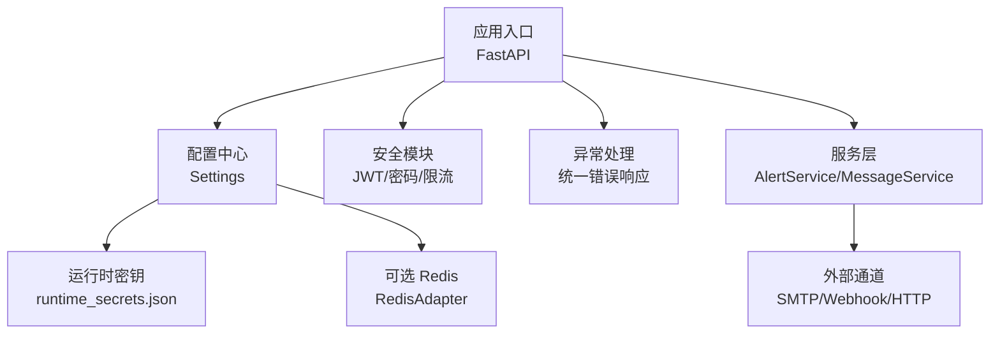
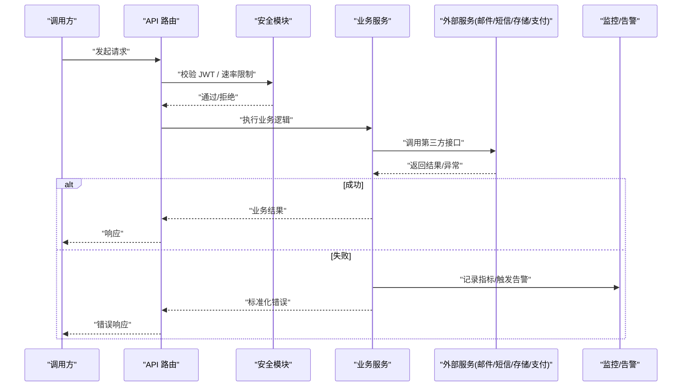
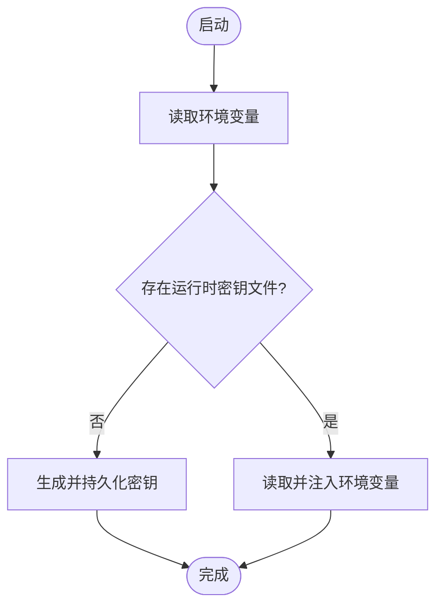
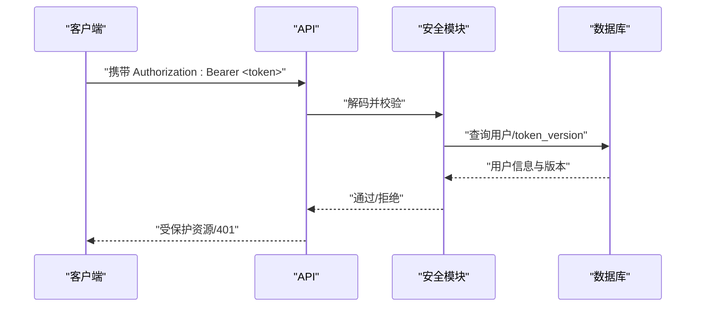
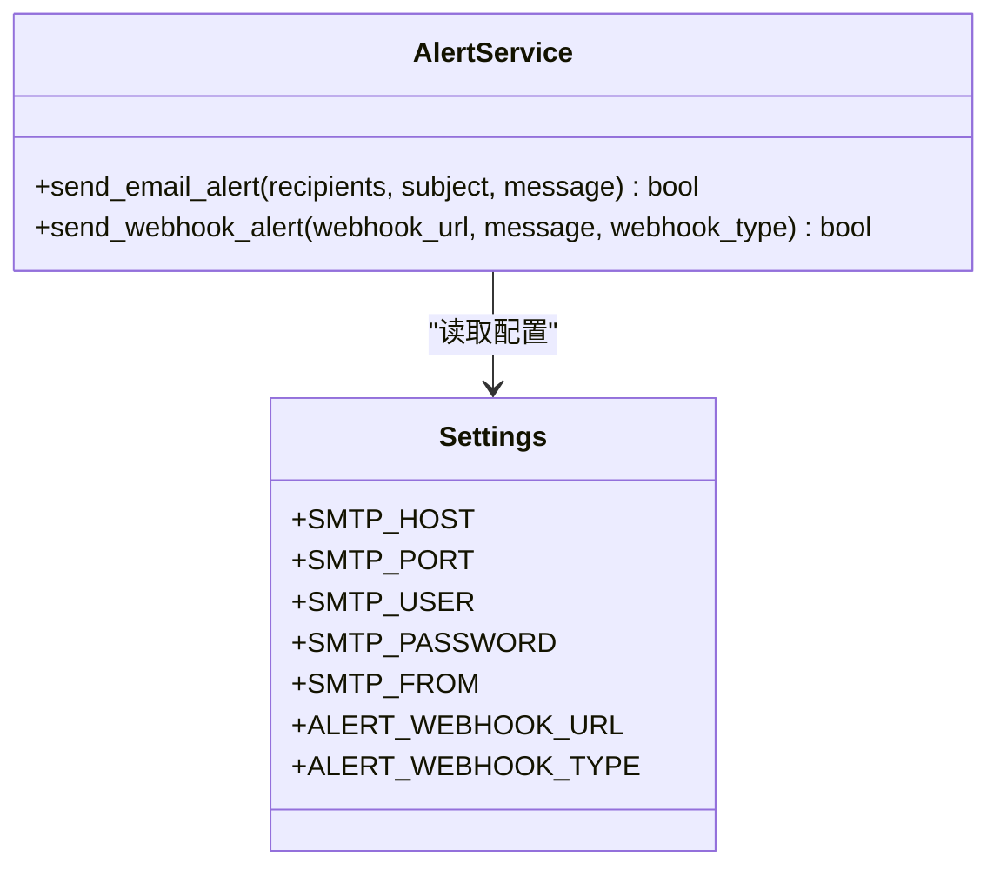
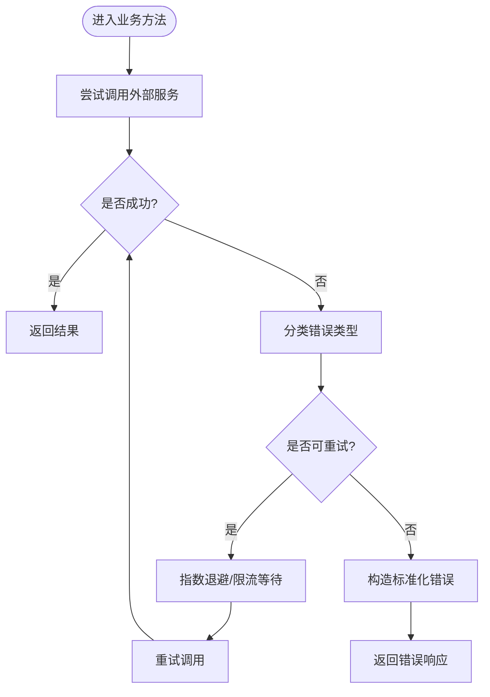
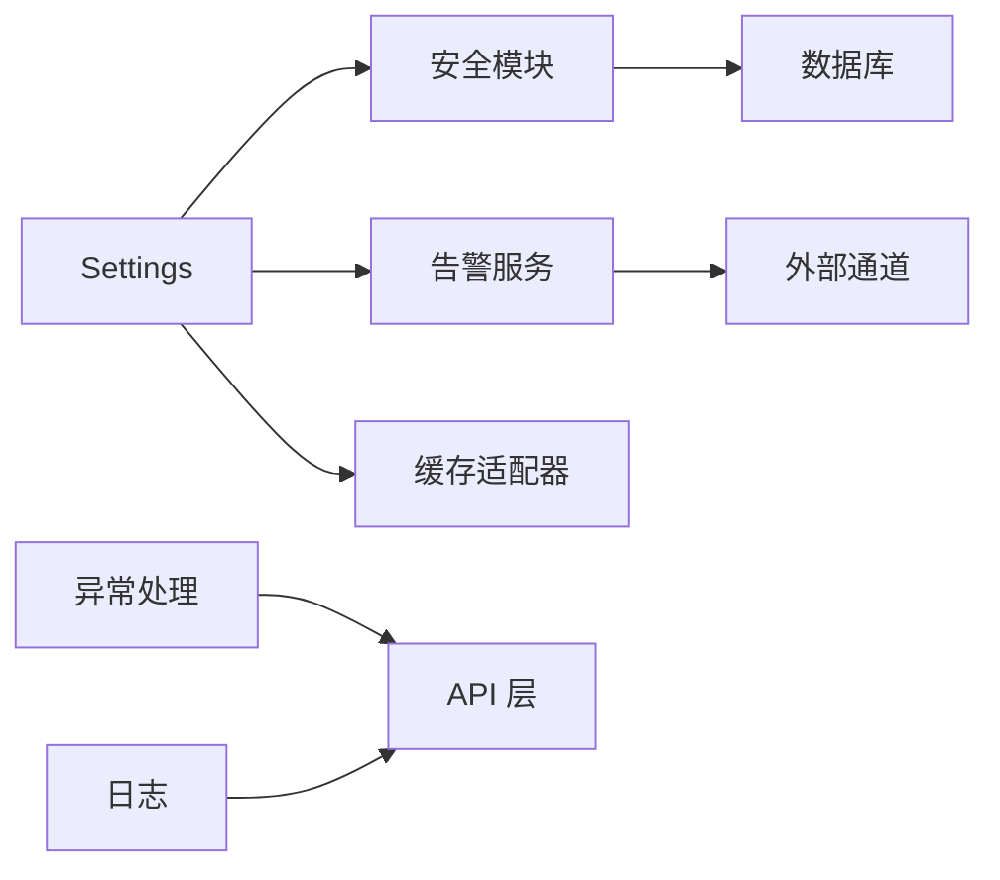

# 第三方服务集成

<cite>
**本文引用的文件**
- [backend/app/core/config.py](file://backend/app/core/config.py)
- [backend/app/core/security.py](file://backend/app/core/security.py)
- [backend/app/services/secrets_manager.py](file://backend/app/services/secrets_manager.py)
- [backend/app/utils/runtime_secrets.py](file://backend/app/utils/runtime_secrets.py)
- [backend/app/core/redis_adapter.py](file://backend/app/core/redis_adapter.py)
- [backend/app/core/error_handler.py](file://backend/app/core/error_handler.py)
- [backend/app/core/logging.py](file://backend/app/core/logging.py)
- [backend/app/core/errors.py](file://backend/app/core/errors.py)
- [backend/app/services/alert_service.py](file://backend/app/services/alert_service.py)
</cite>

## 目录
1. [简介](#简介)
2. [项目结构](#项目结构)
3. [核心组件](#核心组件)
4. [架构总览](#架构总览)
5. [详细组件分析](#详细组件分析)
6. [依赖关系分析](#依赖关系分析)
7. [性能考量](#性能考量)
8. [故障排查指南](#故障排查指南)
9. [结论](#结论)
10. [附录](#附录)

## 简介
本指导文档面向在本系统中集成外部第三方服务的工程实践，覆盖认证配置、请求封装、错误处理与重试机制、OAuth2.0/JWT 令牌管理、常见服务（邮件、短信、文件存储、支付）的集成示例，以及服务发现、负载均衡、熔断降级等高级特性。同时给出配置管理、密钥安全、日志记录与监控告警的最佳实践，帮助在“离线单机版”与“可接入外部服务”的两种部署形态下稳定运行。

## 项目结构
系统后端采用分层架构：
- 配置层：集中式 Settings，统一从环境变量加载，支持加密密钥文件回退。
- 安全层：JWT 签发/校验、密码哈希、速率限制、安全头中间件。
- 服务层：业务服务与外部服务适配（如告警、消息）。
- 基础设施：数据库、缓存（Redis 或内存适配器）、日志、异常处理。

图表来源
- [backend/app/core/config.py:54-199](file://backend/app/core/config.py#L54-L199)
- [backend/app/core/security.py:210-336](file://backend/app/core/security.py#L210-L336)
- [backend/app/core/error_handler.py:38-108](file://backend/app/core/error_handler.py#L38-L108)
- [backend/app/services/alert_service.py:20-111](file://backend/app/services/alert_service.py#L20-L111)
- [backend/app/core/redis_adapter.py:7-43](file://backend/app/core/redis_adapter.py#L7-L43)

章节来源
- [backend/app/core/config.py:54-199](file://backend/app/core/config.py#L54-L199)
- [backend/app/core/security.py:210-336](file://backend/app/core/security.py#L210-L336)
- [backend/app/core/error_handler.py:38-108](file://backend/app/core/error_handler.py#L38-L108)
- [backend/app/services/alert_service.py:20-111](file://backend/app/services/alert_service.py#L20-L111)
- [backend/app/core/redis_adapter.py:7-43](file://backend/app/core/redis_adapter.py#L7-L43)

## 核心组件
- 配置管理：通过 Settings 集中管理所有外部服务相关参数（SMTP、Webhook、Redis、CORS、CSRF、日志、监控等），并支持加密密钥文件加载与环境变量优先策略。
- 安全与令牌：提供 JWT access/refresh token 生成与校验、黑名单吊销、版本化强制下线；内置速率限制与安全响应头。
- 密钥管理：运行时自动创建并持久化 SECRET_KEY/CSRF_SECRET_KEY；支持多版本密钥轮换与过期清理。
- 外部通道：告警服务统一封装 SMTP 邮件与 Webhook（通用/钉钉/企业微信）发送；Redis 以内存适配器默认实现，可按需切换真实 Redis。
- 错误与日志：统一异常类型与响应体；结构化日志与敏感信息脱敏；全局异常处理器兜底。

章节来源
- [backend/app/core/config.py:54-199](file://backend/app/core/config.py#L54-L199)
- [backend/app/core/security.py:210-336](file://backend/app/core/security.py#L210-L336)
- [backend/app/services/secrets_manager.py:13-193](file://backend/app/services/secrets_manager.py#L13-L193)
- [backend/app/utils/runtime_secrets.py:20-179](file://backend/app/utils/runtime_secrets.py#L20-L179)
- [backend/app/core/redis_adapter.py:7-43](file://backend/app/core/redis_adapter.py#L7-L43)
- [backend/app/core/error_handler.py:38-108](file://backend/app/core/error_handler.py#L38-L108)
- [backend/app/core/logging.py:1-24](file://backend/app/core/logging.py#L1-L24)

## 架构总览
下图展示“调用方 → 网关/路由 → 安全鉴权 → 业务服务 → 外部服务”的典型链路，以及失败路径下的重试、熔断与告警。

图表来源
- [backend/app/core/security.py:210-336](file://backend/app/core/security.py#L210-L336)
- [backend/app/services/alert_service.py:20-111](file://backend/app/services/alert_service.py#L20-L111)
- [backend/app/core/error_handler.py:38-108](file://backend/app/core/error_handler.py#L38-L108)

## 详细组件分析

### 配置与密钥管理（Settings + runtime_secrets + SecretsManager）
- 配置来源优先级：环境变量 > 运行时密钥文件 > 默认值。生产环境强制关闭 SQL echo，避免敏感数据入日志。
- 运行时密钥：自动检测并生成 SECRET_KEY/CSRF_SECRET_KEY，原子写入本地 JSON，进程重启不丢失。
- 密钥版本管理：支持生成、轮换、撤销、过期清理，便于密钥生命周期治理。

图表来源
- [backend/app/core/config.py:243-364](file://backend/app/core/config.py#L243-L364)
- [backend/app/utils/runtime_secrets.py:20-179](file://backend/app/utils/runtime_secrets.py#L20-L179)
- [backend/app/services/secrets_manager.py:13-193](file://backend/app/services/secrets_manager.py#L13-L193)

章节来源
- [backend/app/core/config.py:54-199](file://backend/app/core/config.py#L54-L199)
- [backend/app/core/config.py:243-364](file://backend/app/core/config.py#L243-L364)
- [backend/app/utils/runtime_secrets.py:20-179](file://backend/app/utils/runtime_secrets.py#L20-L179)
- [backend/app/services/secrets_manager.py:13-193](file://backend/app/services/secrets_manager.py#L13-L193)

### 认证与令牌管理（JWT + 黑名单 + 版本控制）
- Access Token 与 Refresh Token 分离，支持过期时间、类型校验。
- 登出/强制下线时加入黑名单，并通过 token_version 强制旧会话失效。
- 获取当前用户时校验黑名单与版本，确保 fail-closed。

图表来源
- [backend/app/core/security.py:210-336](file://backend/app/core/security.py#L210-L336)

章节来源
- [backend/app/core/security.py:210-336](file://backend/app/core/security.py#L210-L336)

### 外部通道封装（告警服务：邮件/Webhook）
- 邮件告警：基于 SMTP，配置项来自 Settings（主机、端口、账号、密码、发件人）。
- Webhook 告警：支持通用、钉钉、企业微信格式，使用异步 HTTP 客户端发送。
- 失败路径：捕获异常并记录日志，返回失败状态，不影响主流程。

图表来源
- [backend/app/services/alert_service.py:20-111](file://backend/app/services/alert_service.py#L20-L111)
- [backend/app/core/config.py:185-199](file://backend/app/core/config.py#L185-L199)

章节来源
- [backend/app/services/alert_service.py:20-111](file://backend/app/services/alert_service.py#L20-L111)
- [backend/app/core/config.py:185-199](file://backend/app/core/config.py#L185-L199)

### 缓存与连接（Redis 适配器）
- 默认使用内存适配器，保证离线单机可用；生产可替换为真实 Redis。
- 提供 get/set/delete/exists/flush/stats/health_check 等基础能力。

章节来源
- [backend/app/core/redis_adapter.py:7-43](file://backend/app/core/redis_adapter.py#L7-L43)
- [backend/app/core/config.py:118-125](file://backend/app/core/config.py#L118-L125)

### 错误处理与重试机制
- 统一错误响应构建器与 FastAPI 异常处理器，对外暴露一致的错误体。
- 业务异常分类清晰（验证、未找到、冲突、数据库、外部服务等），便于前端差异化处理。
- 重试策略：数据库死锁场景提供装饰器级重试；网络侧可在上层封装指数退避与最大重试次数。

图表来源
- [backend/app/core/error_handler.py:38-108](file://backend/app/core/error_handler.py#L38-L108)
- [backend/app/core/errors.py:61-86](file://backend/app/core/errors.py#L61-L86)

章节来源
- [backend/app/core/error_handler.py:38-108](file://backend/app/core/error_handler.py#L38-L108)
- [backend/app/core/errors.py:61-86](file://backend/app/core/errors.py#L61-L86)

### 日志与监控告警
- 日志：统一初始化入口，支持结构化输出与轮转；生产环境强制关闭 SQL echo。
- 监控：健康检查与指标开关；告警服务支持邮件与 Webhook 多渠道通知。

章节来源
- [backend/app/core/logging.py:1-24](file://backend/app/core/logging.py#L1-L24)
- [backend/app/core/config.py:161-199](file://backend/app/core/config.py#L161-L199)
- [backend/app/services/alert_service.py:20-111](file://backend/app/services/alert_service.py#L20-L111)

## 依赖关系分析
- 配置依赖：Settings 驱动其他模块行为（如 CSRF、CORS、日志级别、告警通道）。
- 安全依赖：JWT 依赖 SECRET_KEY/ALGORITHM；黑名单与 token_version 依赖数据库。
- 外部通道依赖：AlertService 依赖 SMTP/Webhook；RedisAdapter 可被缓存服务替代。
- 错误与日志：全局异常处理器与日志模块贯穿各层。

图表来源
- [backend/app/core/config.py:54-199](file://backend/app/core/config.py#L54-L199)
- [backend/app/core/security.py:210-336](file://backend/app/core/security.py#L210-L336)
- [backend/app/services/alert_service.py:20-111](file://backend/app/services/alert_service.py#L20-L111)
- [backend/app/core/error_handler.py:38-108](file://backend/app/core/error_handler.py#L38-L108)
- [backend/app/core/logging.py:1-24](file://backend/app/core/logging.py#L1-L24)

章节来源
- [backend/app/core/config.py:54-199](file://backend/app/core/config.py#L54-L199)
- [backend/app/core/security.py:210-336](file://backend/app/core/security.py#L210-L336)
- [backend/app/services/alert_service.py:20-111](file://backend/app/services/alert_service.py#L20-L111)
- [backend/app/core/error_handler.py:38-108](file://backend/app/core/error_handler.py#L38-L108)
- [backend/app/core/logging.py:1-24](file://backend/app/core/logging.py#L1-L24)

## 性能考量
- 连接池与超时：数据库连接池大小、溢出、超时与回收策略需按并发压测调优。
- 缓存：启用本地缓存或 Redis，合理设置 TTL 与容量上限，降低外部服务压力。
- 限流：内置滑动窗口限流，防止恶意刷接口与雪崩。
- 日志：生产环境关闭 SQL echo，减少 I/O 与敏感信息泄露风险。
- 外部调用：对第三方服务增加超时、重试与熔断策略，避免级联故障。

[本节为通用指导，不直接分析具体文件]

## 故障排查指南
- 认证失败：检查 JWT 是否有效、是否在黑名单、token_version 是否匹配。
- 权限不足：确认角色与权限策略，必要时开启调试日志。
- 外部服务不可用：检查 SMTP/Webhook 配置与网络连通性；查看告警日志。
- 性能问题：关注慢查询阈值、连接池耗尽、缓存命中率。
- 密钥问题：确认运行时密钥文件是否存在且可读；必要时重新生成。

章节来源
- [backend/app/core/security.py:210-336](file://backend/app/core/security.py#L210-L336)
- [backend/app/services/alert_service.py:20-111](file://backend/app/services/alert_service.py#L20-L111)
- [backend/app/core/config.py:161-199](file://backend/app/core/config.py#L161-L199)
- [backend/app/utils/runtime_secrets.py:20-179](file://backend/app/utils/runtime_secrets.py#L20-L179)

## 结论
本系统提供了完善的配置管理、密钥安全、认证授权、错误处理与监控告警能力，可作为集成第三方服务的坚实基础。建议在实际集成中遵循“配置外置、密钥隔离、失败快速返回、可观测性强”的原则，结合重试、熔断与降级策略，保障系统在复杂外部依赖下的稳定性与安全性。

[本节为总结性内容，不直接分析具体文件]

## 附录

### 常见第三方服务集成示例与最佳实践

- 邮件服务（SMTP）
  - 配置项：SMTP_HOST、SMTP_PORT、SMTP_USER、SMTP_PASSWORD、SMTP_FROM。
  - 使用方式：通过告警服务发送邮件；失败时记录日志并返回失败。
  - 安全建议：使用 TLS/STARTTLS；最小权限账号；定期轮换密码。

  章节来源
  - [backend/app/services/alert_service.py:20-67](file://backend/app/services/alert_service.py#L20-L67)
  - [backend/app/core/config.py:185-199](file://backend/app/core/config.py#L185-L199)

- 短信服务（HTTP API）
  - 建议模式：封装统一的 HTTP 客户端，设置超时与重试；签名与验签；幂等键防重。
  - 错误处理：区分网络错误与服务端错误，按策略重试或降级。
  - 安全建议：密钥通过运行时密钥管理；日志脱敏。

  章节来源
  - [backend/app/core/errors.py:61-86](file://backend/app/core/errors.py#L61-L86)
  - [backend/app/utils/runtime_secrets.py:20-179](file://backend/app/utils/runtime_secrets.py#L20-L179)

- 文件存储（对象存储/网盘）
  - 建议模式：抽象上传/下载/删除接口；分片上传与断点续传；MIME 校验与病毒扫描。
  - 错误处理：网络重试、服务端限流退避；失败回滚。
  - 安全建议：临时签名 URL；访问白名单；审计日志。

  章节来源
  - [backend/app/core/config.py:170-176](file://backend/app/core/config.py#L170-L176)
  - [backend/app/core/logging.py:1-24](file://backend/app/core/logging.py#L1-L24)

- 支付接口（银行/第三方支付）
  - 建议模式：严格幂等与对账；回调验签；异步通知重试；资金操作事务边界。
  - 错误处理：区分可重试与不可重试错误；失败告警与人工介入。
  - 安全建议：密钥分级管理；最小权限；全链路审计。

  章节来源
  - [backend/app/core/errors.py:61-86](file://backend/app/core/errors.py#L61-L86)
  - [backend/app/services/alert_service.py:20-111](file://backend/app/services/alert_service.py#L20-L111)

### OAuth2.0 与 JWT 令牌管理
- 推荐流程：授权码模式 + PKCE；Access Token 短期、Refresh Token 长期；服务端维护黑名单与 token_version。
- 安全要点：HTTPS 传输；Token 仅存于安全位置；刷新接口限流；登出即吊销。
- 集成建议：将第三方 OAuth 作为身份源，内部仍使用 JWT 做会话与会话吊销。

章节来源
- [backend/app/core/security.py:210-336](file://backend/app/core/security.py#L210-L336)

### 服务发现、负载均衡与熔断降级
- 服务发现：若第三方提供多实例，可通过配置中心动态更新地址列表。
- 负载均衡：在网关层或客户端侧实现轮询/加权策略。
- 熔断降级：当第三方连续失败超过阈值，快速失败并返回降级结果；恢复后自动探测。

[本节为通用指导，不直接分析具体文件]

### 配置管理与密钥安全
- 配置外置：所有敏感配置通过环境变量或加密文件注入，禁止硬编码。
- 密钥管理：使用运行时密钥文件与密钥版本管理；生产环境强制强密钥长度。
- 审计与脱敏：日志中脱敏敏感字段；关键操作记录审计日志。

章节来源
- [backend/app/core/config.py:54-199](file://backend/app/core/config.py#L54-L199)
- [backend/app/utils/runtime_secrets.py:20-179](file://backend/app/utils/runtime_secrets.py#L20-L179)
- [backend/app/services/secrets_manager.py:13-193](file://backend/app/services/secrets_manager.py#L13-L193)
- [backend/app/core/security.py:180-203](file://backend/app/core/security.py#L180-L203)

### 日志记录与监控告警
- 日志：统一初始化、结构化输出、轮转与保留策略；生产关闭 SQL echo。
- 监控：健康检查与指标开关；慢请求监控。
- 告警：邮件与 Webhook 多渠道；失败时及时通知运维。

章节来源
- [backend/app/core/logging.py:1-24](file://backend/app/core/logging.py#L1-L24)
- [backend/app/core/config.py:161-199](file://backend/app/core/config.py#L161-L199)
- [backend/app/services/alert_service.py:20-111](file://backend/app/services/alert_service.py#L20-L111)