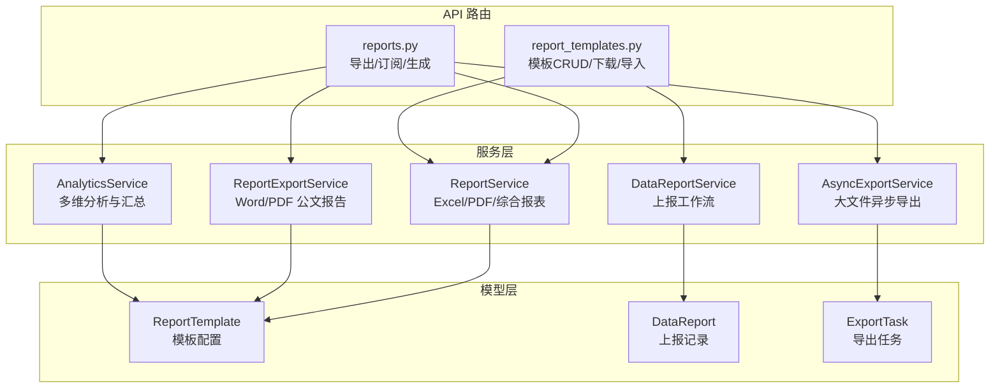
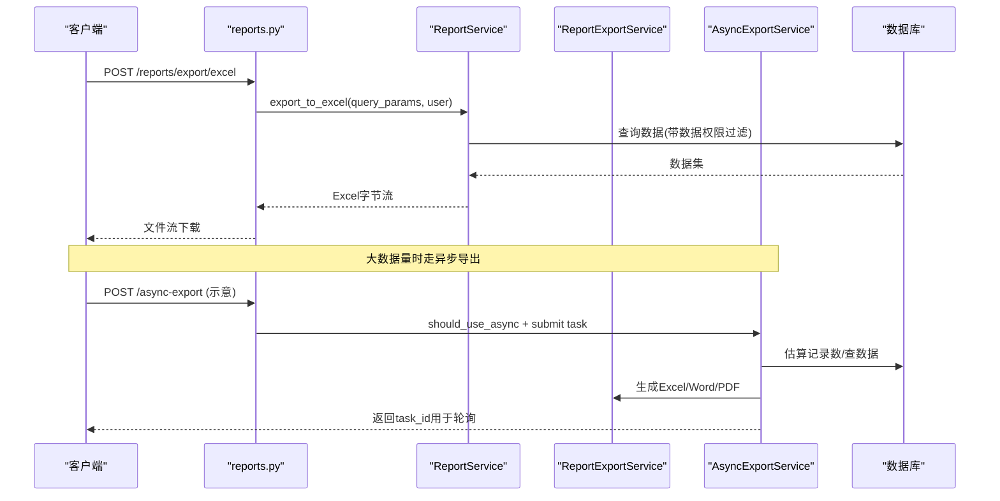
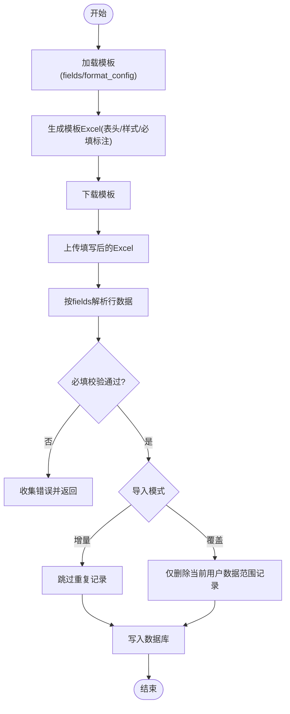
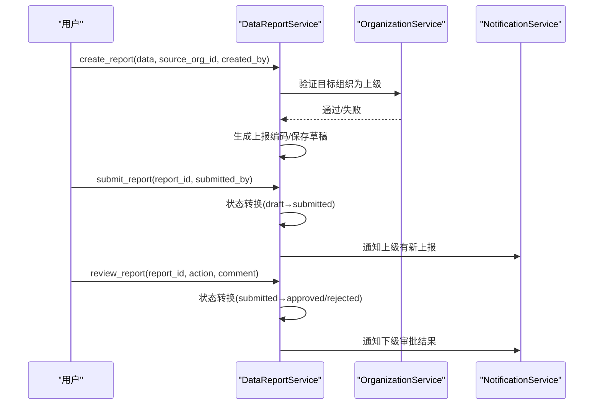
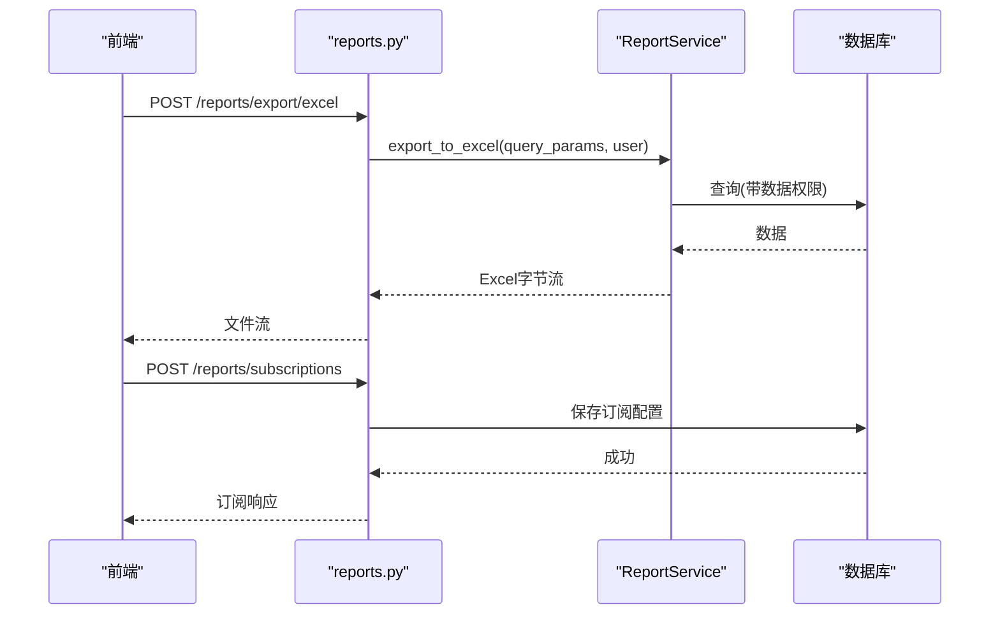
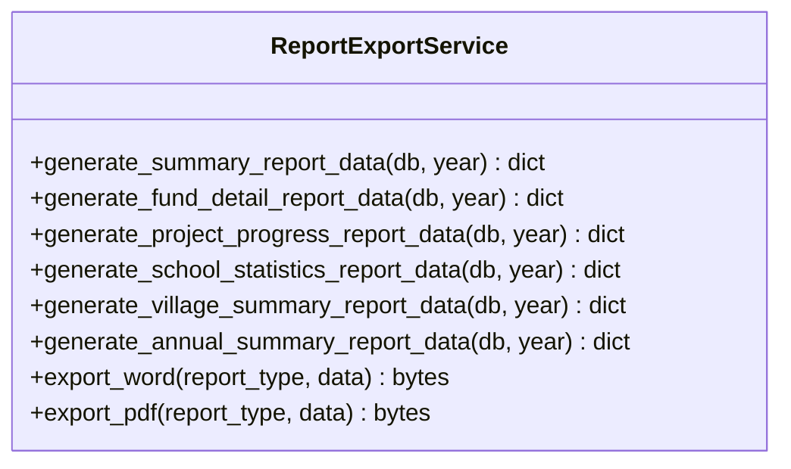
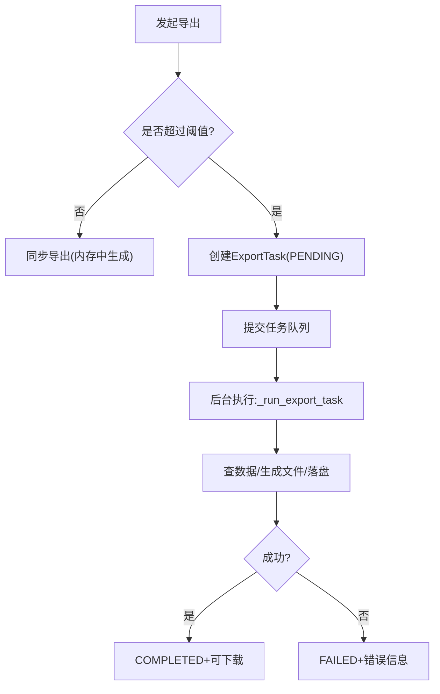
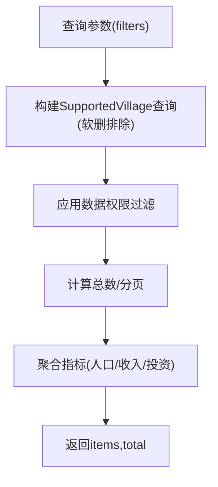
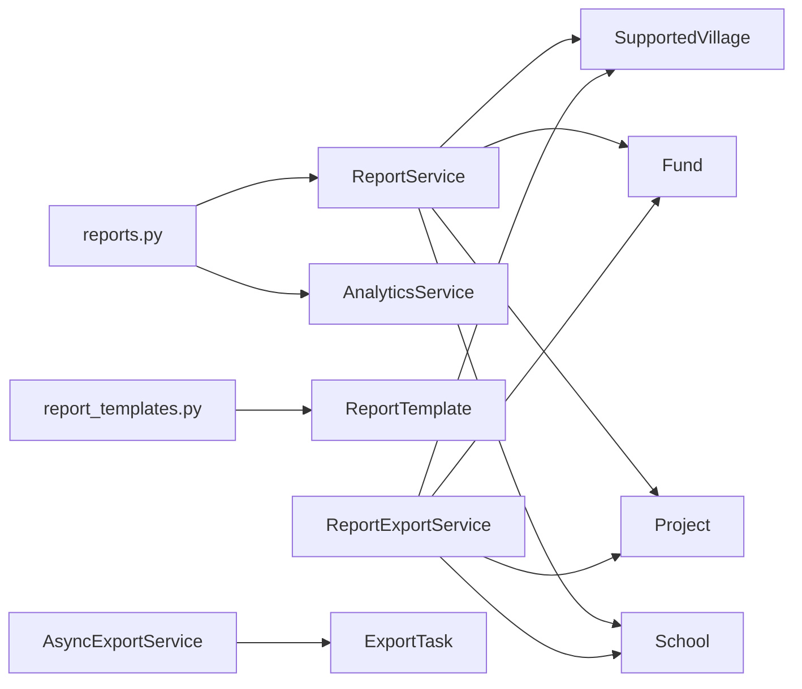

# 自定义报表开发

<cite>
**本文引用的文件**
- [backend/app/models/report_template.py](file://backend/app/models/report_template.py)
- [backend/app/models/data_report.py](file://backend/app/models/data_report.py)
- [backend/app/models/export_task.py](file://backend/app/models/export_task.py)
- [backend/app/api/v1/report_templates.py](file://backend/app/api/v1/report_templates.py)
- [backend/app/api/v1/data/data/reports.py](file://backend/app/api/v1/data/data/reports.py)
- [backend/app/services/report_service.py](file://backend/app/services/report_service.py)
- [backend/app/services/report_export_service.py](file://backend/app/services/report_export_service.py)
- [backend/app/services/async_export_service.py](file://backend/app/services/async_export_service.py)
- [backend/app/services/analytics_service.py](file://backend/app/services/analytics_service.py)
- [backend/app/services/data_report_service.py](file://backend/app/services/data_report_service.py)
</cite>

## 目录
1. [简介](#简介)
2. [项目结构](#项目结构)
3. [核心组件](#核心组件)
4. [架构总览](#架构总览)
5. [详细组件分析](#详细组件分析)
6. [依赖关系分析](#依赖关系分析)
7. [性能与扩展性](#性能与扩展性)
8. [故障排查指南](#故障排查指南)
9. [结论](#结论)
10. [附录：开发示例与最佳实践](#附录开发示例与最佳实践)

## 简介
本文件面向“乡村振兴系统”的自定义报表开发，系统性说明报表引擎的架构设计与扩展点，覆盖数据源接入、查询构建、模板渲染与导出能力；并提供统计报表、分析报表、财务报表等实现方法。同时给出性能优化、缓存策略、异步生成与大文件处理建议，以及权限控制、版本管理与分享协作的实践要点。

## 项目结构
后端围绕 FastAPI 路由层、服务层与模型层组织报表相关能力：
- 路由层：提供报表导出、订阅管理、模板管理等 API。
- 服务层：封装数据聚合、报表数据组装、Word/PDF/Excel 渲染与异步导出。
- 模型层：定义上报流程、模板配置、导出任务等持久化实体。

图表来源
- [backend/app/api/v1/data/data/reports.py:54-156](file://backend/app/api/v1/data/data/reports.py#L54-L156)
- [backend/app/api/v1/report_templates.py:298-502](file://backend/app/api/v1/report_templates.py#L298-L502)
- [backend/app/services/report_service.py:27-152](file://backend/app/services/report_service.py#L27-L152)
- [backend/app/services/report_export_service.py:46-300](file://backend/app/services/report_export_service.py#L46-L300)
- [backend/app/services/async_export_service.py:390-516](file://backend/app/services/async_export_service.py#L390-L516)
- [backend/app/services/analytics_service.py:22-78](file://backend/app/services/analytics_service.py#L22-L78)
- [backend/app/services/data_report_service.py:81-161](file://backend/app/services/data_report_service.py#L81-L161)
- [backend/app/models/report_template.py:44-73](file://backend/app/models/report_template.py#L44-L73)
- [backend/app/models/data_report.py:29-113](file://backend/app/models/data_report.py#L29-L113)
- [backend/app/models/export_task.py:28-80](file://backend/app/models/export_task.py#L28-L80)

章节来源
- [backend/app/api/v1/data/data/reports.py:54-156](file://backend/app/api/v1/data/data/reports.py#L54-L156)
- [backend/app/api/v1/report_templates.py:298-502](file://backend/app/api/v1/report_templates.py#L298-L502)
- [backend/app/services/report_service.py:27-152](file://backend/app/services/report_service.py#L27-L152)
- [backend/app/services/report_export_service.py:46-300](file://backend/app/services/report_export_service.py#L46-L300)
- [backend/app/services/async_export_service.py:390-516](file://backend/app/services/async_export_service.py#L390-L516)
- [backend/app/services/analytics_service.py:22-78](file://backend/app/services/analytics_service.py#L22-L78)
- [backend/app/services/data_report_service.py:81-161](file://backend/app/services/data_report_service.py#L81-L161)
- [backend/app/models/report_template.py:44-73](file://backend/app/models/report_template.py#L44-L73)
- [backend/app/models/data_report.py:29-113](file://backend/app/models/data_report.py#L29-L113)
- [backend/app/models/export_task.py:28-80](file://backend/app/models/export_task.py#L28-L80)

## 核心组件
- 报表模板（ReportTemplate）：以 JSON 字段映射 Excel 列到数据库字段，支持导入/导出模板类型、模块绑定、格式配置与启用状态。
- 数据上报（DataReport）：维护下级向上级提交的数据上报生命周期（草稿/已提交/已批准/已拒绝/已取消），含截止时间与审批信息。
- 导出任务（ExportTask）：统一记录同步/异步导出任务的状态、参数、结果文件与过期时间。
- 报表服务（ReportService）：提供 Excel/PDF/综合报表导出，内置数据权限过滤与文件名生成。
- 公文报告导出（ReportExportService）：按统一数据结构（标题/段落/表格）生成 Word/PDF 公文报告。
- 异步导出（AsyncExportService）：基于任务队列的大文件后台导出，自动阈值判断、落盘与状态回写。
- 数据分析（AnalyticsService）：多维度筛选、钻取、对比与汇总统计，支撑可视化与报表数据源。
- 上报服务（DataReportService）：上报创建、提交、审批、通知与统计，保障上下级组织间的数据流转。

章节来源
- [backend/app/models/report_template.py:44-73](file://backend/app/models/report_template.py#L44-L73)
- [backend/app/models/data_report.py:29-113](file://backend/app/models/data_report.py#L29-L113)
- [backend/app/models/export_task.py:28-80](file://backend/app/models/export_task.py#L28-L80)
- [backend/app/services/report_service.py:27-152](file://backend/app/services/report_service.py#L27-L152)
- [backend/app/services/report_export_service.py:46-300](file://backend/app/services/report_export_service.py#L46-L300)
- [backend/app/services/async_export_service.py:390-516](file://backend/app/services/async_export_service.py#L390-L516)
- [backend/app/services/analytics_service.py:22-78](file://backend/app/services/analytics_service.py#L22-L78)
- [backend/app/services/data_report_service.py:81-161](file://backend/app/services/data_report_service.py#L81-L161)

## 架构总览
报表系统采用分层设计：API 路由负责入参与鉴权，服务层负责业务编排与数据聚合，模型层负责持久化。导出链路分为“即时导出”和“异步导出”，前者适用于小数据量，后者通过任务队列在后台生成并落盘，避免阻塞请求。

图表来源
- [backend/app/api/v1/data/data/reports.py:54-156](file://backend/app/api/v1/data/data/reports.py#L54-L156)
- [backend/app/services/report_service.py:27-152](file://backend/app/services/report_service.py#L27-L152)
- [backend/app/services/report_export_service.py:318-443](file://backend/app/services/report_export_service.py#L318-L443)
- [backend/app/services/async_export_service.py:390-516](file://backend/app/services/async_export_service.py#L390-L516)

## 详细组件分析

### 报表模板与导入导出
- 模板建模：ReportTemplate 使用 fields(JSON) 描述 Excel 列与数据库字段的映射，format_config(JSON) 描述纸张、页眉页脚、列宽等格式。
- 模板 API：提供列表、创建、更新、删除、详情与下载；下载时根据 fields 动态生成带表头与必填标注的 Excel。
- 导入解析：上传 Excel 后按 fields 解析为行记录，支持增量与覆盖模式，并对必填项进行校验与错误收集。

图表来源
- [backend/app/api/v1/report_templates.py:446-502](file://backend/app/api/v1/report_templates.py#L446-L502)
- [backend/app/api/v1/report_templates.py:508-546](file://backend/app/api/v1/report_templates.py#L508-L546)
- [backend/app/api/v1/report_templates.py:620-740](file://backend/app/api/v1/report_templates.py#L620-L740)

章节来源
- [backend/app/models/report_template.py:44-73](file://backend/app/models/report_template.py#L44-L73)
- [backend/app/api/v1/report_templates.py:298-502](file://backend/app/api/v1/report_templates.py#L298-L502)
- [backend/app/api/v1/report_templates.py:508-546](file://backend/app/api/v1/report_templates.py#L508-L546)
- [backend/app/api/v1/report_templates.py:620-740](file://backend/app/api/v1/report_templates.py#L620-L740)

### 数据上报工作流
- 上报模型：DataReport 记录上报编码、数据包ID、来源/目标组织、状态、提交/审批信息与截止时间。
- 工作流：创建上报→提交→上级审批（批准/拒绝）→通知双方；支持统计与仪表盘视图。
- 权限与关系：确保目标组织为来源组织的上级，使用组织服务验证层级关系。

图表来源
- [backend/app/services/data_report_service.py:110-193](file://backend/app/services/data_report_service.py#L110-L193)
- [backend/app/services/data_report_service.py:195-235](file://backend/app/services/data_report_service.py#L195-L235)
- [backend/app/models/data_report.py:29-113](file://backend/app/models/data_report.py#L29-L113)

章节来源
- [backend/app/models/data_report.py:29-113](file://backend/app/models/data_report.py#L29-L113)
- [backend/app/services/data_report_service.py:81-161](file://backend/app/services/data_report_service.py#L81-L161)
- [backend/app/services/data_report_service.py:163-235](file://backend/app/services/data_report_service.py#L163-L235)

### 报表导出与订阅
- 导出接口：Excel/PDF/综合报表导出，文件名自动生成，支持分页与数据权限过滤。
- 订阅管理：创建/更新/删除/切换订阅，支持频率、发送时间、输出格式与目录配置。
- 生成接口：按 report_type/year/village_ids/include_sections/format 生成报表数据或文件。

图表来源
- [backend/app/api/v1/data/data/reports.py:54-156](file://backend/app/api/v1/data/data/reports.py#L54-L156)
- [backend/app/api/v1/data/data/reports.py:345-587](file://backend/app/api/v1/data/data/reports.py#L345-L587)
- [backend/app/services/report_service.py:27-152](file://backend/app/services/report_service.py#L27-L152)

章节来源
- [backend/app/api/v1/data/data/reports.py:54-156](file://backend/app/api/v1/data/data/reports.py#L54-L156)
- [backend/app/api/v1/data/data/reports.py:345-587](file://backend/app/api/v1/data/data/reports.py#L345-L587)
- [backend/app/services/report_service.py:27-152](file://backend/app/services/report_service.py#L27-L152)

### 公文报告导出（Word/PDF）
- 数据约定：generate_*_report_data 返回统一结构 {year, title, sections:[{title, paragraphs, table}] }。
- 渲染器：export_word 使用 python-docx，export_pdf 使用 reportlab，空数据输出“暂无数据”。
- 报表类型：年度总结、经费明细、项目进度、学校统计、帮扶村汇总等。

图表来源
- [backend/app/services/report_export_service.py:46-300](file://backend/app/services/report_export_service.py#L46-L300)
- [backend/app/services/report_export_service.py:318-443](file://backend/app/services/report_export_service.py#L318-L443)

章节来源
- [backend/app/services/report_export_service.py:46-300](file://backend/app/services/report_export_service.py#L46-L300)
- [backend/app/services/report_export_service.py:318-443](file://backend/app/services/report_export_service.py#L318-L443)

### 异步导出与大文件处理
- 阈值判断：超过 ASYNC_THRESHOLD 条记录自动走异步导出。
- 任务执行：创建 ExportTask→提交任务队列→后台独立会话查数据→生成文件→落盘→更新状态。
- 下载与过期：完成后提供下载，支持 expires_at 过期控制。

图表来源
- [backend/app/services/async_export_service.py:390-516](file://backend/app/services/async_export_service.py#L390-L516)
- [backend/app/models/export_task.py:28-80](file://backend/app/models/export_task.py#L28-L80)

章节来源
- [backend/app/services/async_export_service.py:390-516](file://backend/app/services/async_export_service.py#L390-L516)
- [backend/app/models/export_task.py:28-80](file://backend/app/models/export_task.py#L28-L80)

### 数据分析与可视化数据源
- 多维度筛选：按省份、梯队、区域、部门、三区三州、重点县等条件组合查询。
- 钻取与对比：支持按维度钻取、多村对比、年度对比。
- 汇总统计：人口、收入、产业投资、基础设施、教育投资等指标聚合。

图表来源
- [backend/app/services/analytics_service.py:637-683](file://backend/app/services/analytics_service.py#L637-L683)
- [backend/app/services/analytics_service.py:511-532](file://backend/app/services/analytics_service.py#L511-L532)

章节来源
- [backend/app/services/analytics_service.py:22-78](file://backend/app/services/analytics_service.py#L22-L78)
- [backend/app/services/analytics_service.py:511-532](file://backend/app/services/analytics_service.py#L511-L532)
- [backend/app/services/analytics_service.py:637-683](file://backend/app/services/analytics_service.py#L637-L683)

## 依赖关系分析
- 路由与服务耦合：reports.py 依赖 ReportService、AnalyticsService；report_templates.py 依赖 ReportTemplate 与 openpyxl。
- 服务与模型：ReportExportService 依赖业务模型（Fund/Project/School/SupportedVillage）进行聚合；AsyncExportService 依赖 ExportTask 与任务队列。
- 数据权限：多处使用 filter_by_data_scope 保证跨组织数据隔离。

图表来源
- [backend/app/api/v1/data/data/reports.py:54-156](file://backend/app/api/v1/data/data/reports.py#L54-L156)
- [backend/app/api/v1/report_templates.py:298-502](file://backend/app/api/v1/report_templates.py#L298-L502)
- [backend/app/services/report_service.py:27-152](file://backend/app/services/report_service.py#L27-L152)
- [backend/app/services/report_export_service.py:46-300](file://backend/app/services/report_export_service.py#L46-L300)
- [backend/app/services/async_export_service.py:390-516](file://backend/app/services/async_export_service.py#L390-L516)

章节来源
- [backend/app/api/v1/data/data/reports.py:54-156](file://backend/app/api/v1/data/data/reports.py#L54-L156)
- [backend/app/api/v1/report_templates.py:298-502](file://backend/app/api/v1/report_templates.py#L298-L502)
- [backend/app/services/report_service.py:27-152](file://backend/app/services/report_service.py#L27-L152)
- [backend/app/services/report_export_service.py:46-300](file://backend/app/services/report_export_service.py#L46-L300)
- [backend/app/services/async_export_service.py:390-516](file://backend/app/services/async_export_service.py#L390-L516)

## 性能与扩展性
- 查询优化
  - 使用 SQLAlchemy 聚合函数（sum/count/avg）在数据库侧完成统计，减少内存压力。
  - 对常用字段建立索引（如组织、状态、时间戳），提升筛选与排序性能。
  - 分页与限制（limit/offset）避免一次性拉取大量数据。
- 导出优化
  - 小数据量：同步导出直接返回字节流。
  - 大数据量：异步导出阈值判断，后台生成并落盘，避免阻塞请求。
  - PDF/Word 渲染时限制行数或分片，防止内存溢出。
- 缓存策略
  - 对热点汇总数据（如仪表盘、年度统计）引入缓存（Redis/内存），设置合理 TTL。
  - 模板与字典类静态数据可缓存，减少重复解析。
- 并发与资源
  - 异步任务使用独立数据库会话，避免与请求会话冲突。
  - 限制最大导出行数（MAX_EXPORT_ROWS），防止超大文件导致 OOM。
- 扩展点
  - 新增报表类型：在 ReportExportService 增加 generate_*_report_data 与 _REPORT_TITLES 映射。
  - 新增导出格式：在 ReportService 扩展 export_to_* 方法。
  - 新增数据源：在 AnalyticsService 与 AsyncExportService 的 fetcher 中注册新实体查询。

[本节为通用指导，不直接分析具体文件]

## 故障排查指南
- 导出为空或报错
  - 检查依赖库是否安装（openpyxl、reportlab、python-docx）。
  - 查看日志中的 ImportError 与异常堆栈，确认数据层查询是否成功。
- 异步任务卡住
  - 确认任务队列是否启动，ExportTask 状态是否为 processing/completed/failed。
  - 检查文件路径是否存在，expires_at 是否过期。
- 权限问题
  - 确认 filter_by_data_scope 是否正确注入用户上下文。
  - 核对组织层级关系（上级/下级）是否满足约束。
- 上报流程异常
  - 检查状态转换是否合法（VALID_TRANSITIONS）。
  - 确认目标组织是否为来源组织的上级。

章节来源
- [backend/app/services/report_service.py:67-72](file://backend/app/services/report_service.py#L67-L72)
- [backend/app/services/report_service.py:128-133](file://backend/app/services/report_service.py#L128-L133)
- [backend/app/services/async_export_service.py:330-387](file://backend/app/services/async_export_service.py#L330-L387)
- [backend/app/models/export_task.py:85-121](file://backend/app/models/export_task.py#L85-L121)
- [backend/app/services/data_report_service.py:87-103](file://backend/app/services/data_report_service.py#L87-L103)
- [backend/app/services/data_report_service.py:448-461](file://backend/app/services/data_report_service.py#L448-L461)

## 结论
本系统提供了完整的自定义报表能力：从模板管理、数据上报、多维分析到多种格式的导出与异步处理。通过清晰的分层架构与可扩展的服务设计，开发者可以快速接入新的数据源、报表类型与导出格式，并结合权限控制与缓存策略保障性能与安全。

[本节为总结，不直接分析具体文件]

## 附录：开发示例与最佳实践

### 统计报表（年度汇总）
- 数据源：SupportedVillage/Fund/Project/School 等模型的聚合查询。
- 实现要点：使用 SQLAlchemy 聚合函数在数据库侧计算；空数据时输出友好提示。
- 参考路径
  - [backend/app/services/report_export_service.py:55-88](file://backend/app/services/report_export_service.py#L55-L88)
  - [backend/app/services/analytics_service.py:511-532](file://backend/app/services/analytics_service.py#L511-L532)

### 分析报表（多维筛选与钻取）
- 数据源：AnalyticsService 的多维筛选、钻取与对比接口。
- 实现要点：结合 filter_by_data_scope 做数据权限过滤；分页与 limit 控制返回规模。
- 参考路径
  - [backend/app/services/analytics_service.py:637-683](file://backend/app/services/analytics_service.py#L637-L683)
  - [backend/app/api/v1/data/data/reports.py:173-220](file://backend/app/api/v1/data/data/reports.py#L173-L220)

### 财务报表（经费明细）
- 数据源：Fund 表按类型分组聚合金额与笔数。
- 实现要点：金额格式化、合计行追加、异常兜底输出空表。
- 参考路径
  - [backend/app/services/report_export_service.py:90-146](file://backend/app/services/report_export_service.py#L90-L146)

### 可视化图表数据
- 数据源：AnalyticsService 提供的汇总与趋势数据。
- 实现要点：将服务返回的结构转换为前端图表所需格式（折线/柱状/饼图）。
- 参考路径
  - [backend/app/services/analytics_service.py:28-78](file://backend/app/services/analytics_service.py#L28-L78)
  - [backend/app/services/analytics_service.py:173-218](file://backend/app/services/analytics_service.py#L173-L218)

### 权限控制、版本管理与分享协作
- 权限控制
  - 使用 filter_by_data_scope 在查询层强制数据隔离。
  - 上报流程中验证组织层级关系，确保只有上级可审批。
  - 参考路径
    - [backend/app/services/analytics_service.py:656-662](file://backend/app/services/analytics_service.py#L656-L662)
    - [backend/app/services/data_report_service.py:128-139](file://backend/app/services/data_report_service.py#L128-L139)
- 版本管理
  - 模板与订阅配置变更应记录审计字段（created_at/updated_at），必要时引入版本快照。
  - 参考路径
    - [backend/app/models/report_template.py:67-69](file://backend/app/models/report_template.py#L67-L69)
    - [backend/app/api/v1/data/data/reports.py:389-427](file://backend/app/api/v1/data/data/reports.py#L389-L427)
- 分享协作
  - 通过订阅机制实现定时推送与共享；结合通知服务提醒相关人员。
  - 参考路径
    - [backend/app/api/v1/data/data/reports.py:345-587](file://backend/app/api/v1/data/data/reports.py#L345-L587)
    - [backend/app/services/data_report_service.py:469-491](file://backend/app/services/data_report_service.py#L469-L491)

章节来源
- [backend/app/services/report_export_service.py:55-88](file://backend/app/services/report_export_service.py#L55-L88)
- [backend/app/services/analytics_service.py:511-532](file://backend/app/services/analytics_service.py#L511-L532)
- [backend/app/services/analytics_service.py:637-683](file://backend/app/services/analytics_service.py#L637-L683)
- [backend/app/services/report_export_service.py:90-146](file://backend/app/services/report_export_service.py#L90-L146)
- [backend/app/services/analytics_service.py:28-78](file://backend/app/services/analytics_service.py#L28-L78)
- [backend/app/services/analytics_service.py:173-218](file://backend/app/services/analytics_service.py#L173-L218)
- [backend/app/services/analytics_service.py:656-662](file://backend/app/services/analytics_service.py#L656-L662)
- [backend/app/services/data_report_service.py:128-139](file://backend/app/services/data_report_service.py#L128-L139)
- [backend/app/models/report_template.py:67-69](file://backend/app/models/report_template.py#L67-L69)
- [backend/app/api/v1/data/data/reports.py:389-427](file://backend/app/api/v1/data/data/reports.py#L389-L427)
- [backend/app/api/v1/data/data/reports.py:345-587](file://backend/app/api/v1/data/data/reports.py#L345-L587)
- [backend/app/services/data_report_service.py:469-491](file://backend/app/services/data_report_service.py#L469-L491)