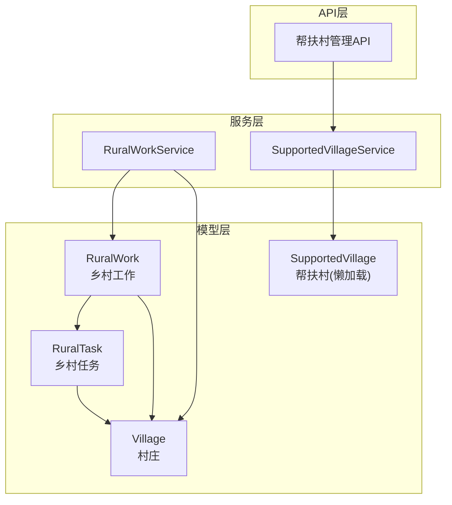
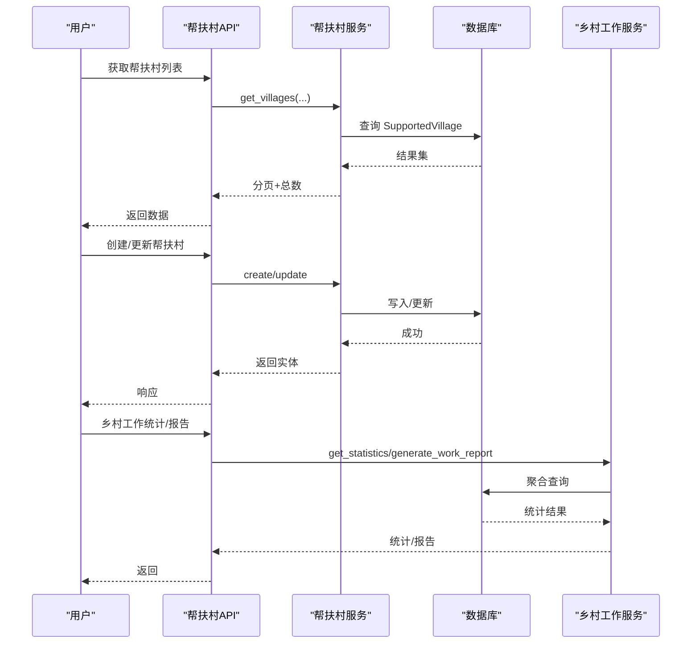
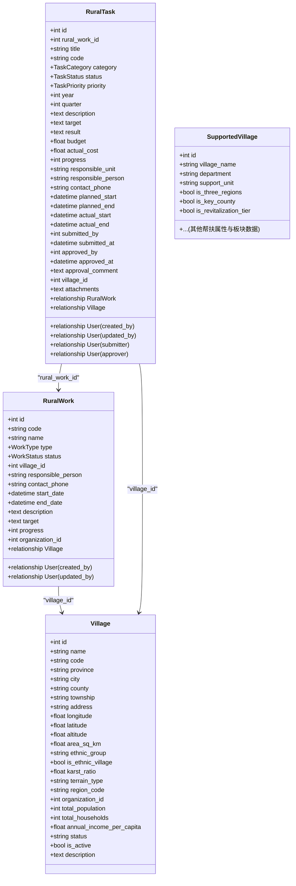
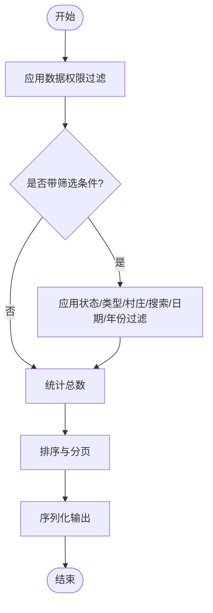
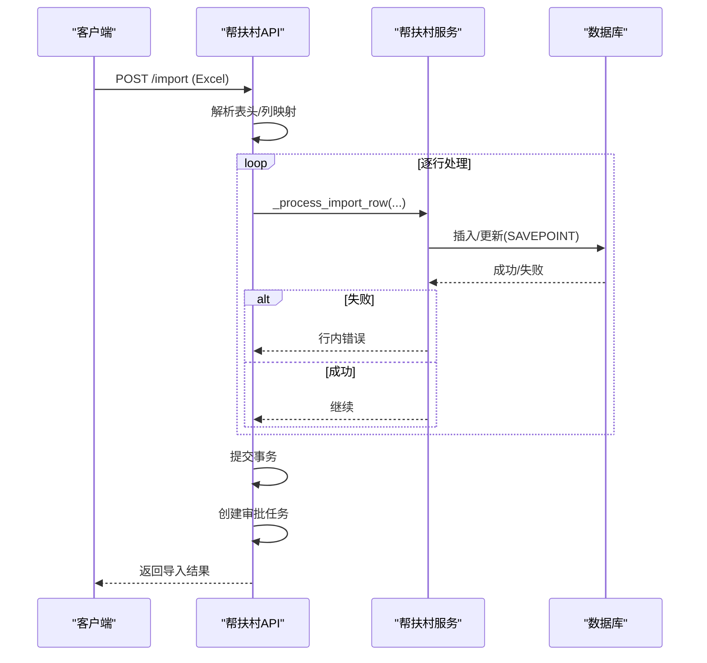
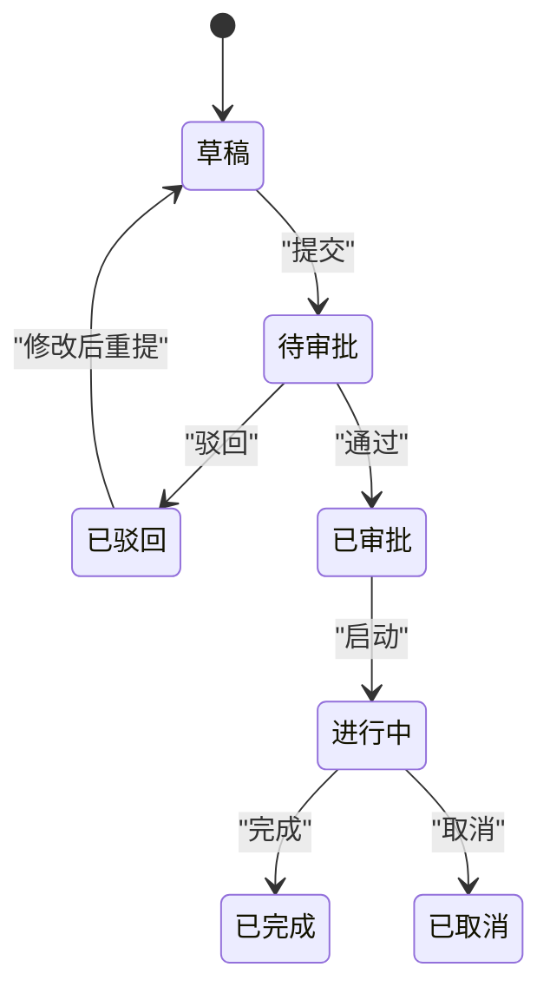
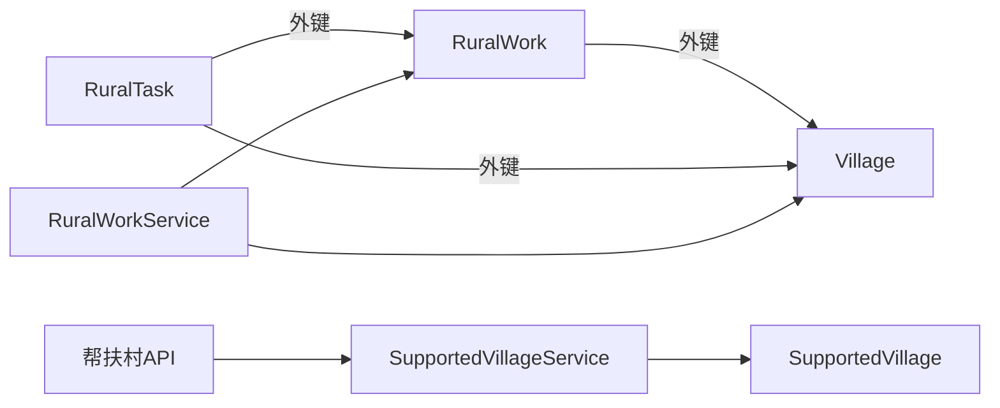

# 乡村工作模型

<cite>
**本文引用的文件**
- [backend/app/models/rural_work.py](file://backend/app/models/rural_work.py)
- [backend/app/models/rural_task.py](file://backend/app/models/rural_task.py)
- [backend/app/models/village.py](file://backend/app/models/village.py)
- [backend/app/models/__init__.py](file://backend/app/models/__init__.py)
- [backend/app/services/rural_work_service.py](file://backend/app/services/rural_work_service.py)
- [backend/app/api/v1/supported_village.py](file://backend/app/api/v1/supported_village.py)
- [backend/app/schemas/supported_village.py](file://backend/app/schemas/supported_village.py)
- [backend/app/services/supported_village_service.py](file://backend/app/services/supported_village_service.py)
</cite>

## 目录
1. [简介](#简介)
2. [项目结构](#项目结构)
3. [核心组件](#核心组件)
4. [架构总览](#架构总览)
5. [详细组件分析](#详细组件分析)
6. [依赖关系分析](#依赖关系分析)
7. [性能考虑](#性能考虑)
8. [故障排查指南](#故障排查指南)
9. [结论](#结论)
10. [附录：查询示例与最佳实践](#附录：查询示例与最佳实践)

## 简介
本文件面向“乡村振兴系统”的乡村工作模型，围绕以下目标展开：
- 说明乡村工作表、任务表、村庄表和帮扶村庄表的结构设计
- 解释工作任务分配、进度跟踪和成果汇报的业务逻辑
- 覆盖村庄信息管理、帮扶关系维护、统计数据收集的数据设计
- 说明工作流状态管理、任务优先级处理与资源分配机制
- 提供业务关系图与典型工作场景的查询示例

## 项目结构
围绕乡村工作模型的核心代码分布在后端模块中：
- 数据模型层：rural_work、rural_task、village，以及通过懒加载注册的 supported_village 系列模型
- 服务层：rural_work_service（乡村工作服务）、supported_village_service（帮扶村服务）
- API 层：supported_village 路由（帮扶村管理），乡村工作相关路由由服务暴露能力供上层调用
- Schema 层：supported_village 的创建/更新等请求校验

图表来源
- [backend/app/models/rural_work.py:34-76](file://backend/app/models/rural_work.py#L34-L76)
- [backend/app/models/rural_task.py:56-133](file://backend/app/models/rural_task.py#L56-L133)
- [backend/app/models/village.py:14-74](file://backend/app/models/village.py#L14-L74)
- [backend/app/models/__init__.py:21-28](file://backend/app/models/__init__.py#L21-L28)
- [backend/app/services/rural_work_service.py:124-221](file://backend/app/services/rural_work_service.py#L124-L221)
- [backend/app/services/supported_village_service.py:11-75](file://backend/app/services/supported_village_service.py#L11-L75)
- [backend/app/api/v1/supported_village.py:447-577](file://backend/app/api/v1/supported_village.py#L447-L577)

章节来源
- [backend/app/models/rural_work.py:34-76](file://backend/app/models/rural_work.py#L34-L76)
- [backend/app/models/rural_task.py:56-133](file://backend/app/models/rural_task.py#L56-L133)
- [backend/app/models/village.py:14-74](file://backend/app/models/village.py#L14-L74)
- [backend/app/models/__init__.py:21-28](file://backend/app/models/__init__.py#L21-L28)
- [backend/app/services/rural_work_service.py:124-221](file://backend/app/services/rural_work_service.py#L124-L221)
- [backend/app/services/supported_village_service.py:11-75](file://backend/app/services/supported_village_service.py#L11-L75)
- [backend/app/api/v1/supported_village.py:447-577](file://backend/app/api/v1/supported_village.py#L447-L577)

## 核心组件
- 乡村工作 RuralWork：定义工作类型、状态、归属村庄、责任人、时间范围、目标、进度、组织隔离等。
- 乡村任务 RuralTask：作为 RuralWork 的子任务，支持年度/季度管理、审批状态、优先级、预算与实际花费、进度、负责人、附件、关联村庄等。
- 村庄 Village：基础信息、地理信息、民族与地貌、组织关联、经济概况、状态与描述；并包含村民与产业子实体。
- 帮扶村 SupportedVillage：通过懒加载注册，承载帮扶关系、地区属性、资金与板块数据（人口、收入、基建、党建、医疗、消费、就业、教育、村委会等）。

章节来源
- [backend/app/models/rural_work.py:18-76](file://backend/app/models/rural_work.py#L18-L76)
- [backend/app/models/rural_task.py:21-133](file://backend/app/models/rural_task.py#L21-L133)
- [backend/app/models/village.py:14-130](file://backend/app/models/village.py#L14-L130)
- [backend/app/models/__init__.py:21-28](file://backend/app/models/__init__.py#L21-L28)

## 架构总览
乡村工作模型采用“工作-任务-村庄/帮扶村”的分层设计：
- 工作（RuralWork）是宏观计划或专项，可关联一个或多个任务（RuralTask）
- 任务（RuralTask）细化到具体执行单元，具备审批流、优先级、预算、进度与成果字段
- 村庄（Village）是地理与组织维度的基础主数据；帮扶村（SupportedVillage）承载帮扶关系与年度板块数据
- 服务层负责数据权限过滤、统计汇总、报告生成、列表分页与导入导出等
- API 层暴露帮扶村管理与乡村工作操作入口

图表来源
- [backend/app/api/v1/supported_village.py:447-577](file://backend/app/api/v1/supported_village.py#L447-L577)
- [backend/app/services/supported_village_service.py:15-75](file://backend/app/services/supported_village_service.py#L15-L75)
- [backend/app/services/rural_work_service.py:370-488](file://backend/app/services/rural_work_service.py#L370-L488)

## 详细组件分析

### 数据模型与关系
- RuralWork
  - 关键字段：类型、状态、所属村庄、责任人、联系方式、起止时间、目标、进度、组织ID
  - 关系：指向 Village；记录创建者/更新者
  - 索引：type、status、village_id
- RuralTask
  - 关键字段：标题、编号、分类、状态、优先级、年度/季度、目标/成果、预算/实际花费、进度、责任单位/人、联系方式、计划/实际起止、提交/审批信息与评论、附件、组织隔离
  - 关系：属于 RuralWork；关联 Village；记录创建/更新/提交/审批人
  - 索引：work+year、status、category、village、year
- Village
  - 关键字段：名称、编码、省市区乡镇、地址、经纬度海拔面积、民族与地貌、区域编码、组织ID、人口/户数/人均收入、状态、是否活跃、备注
  - 关系：村民、产业、茶种植园、仙人掌果园（视图只读）
- SupportedVillage（懒加载）
  - 承载帮扶关系、地区属性、板块数据（人口、收入、投资、产业、基建、党建、医疗、消费、就业、教育、村委会信息等）

图表来源
- [backend/app/models/rural_work.py:34-76](file://backend/app/models/rural_work.py#L34-L76)
- [backend/app/models/rural_task.py:56-133](file://backend/app/models/rural_task.py#L56-L133)
- [backend/app/models/village.py:14-74](file://backend/app/models/village.py#L14-L74)
- [backend/app/models/__init__.py:21-28](file://backend/app/models/__init__.py#L21-L28)

章节来源
- [backend/app/models/rural_work.py:34-76](file://backend/app/models/rural_work.py#L34-L76)
- [backend/app/models/rural_task.py:56-133](file://backend/app/models/rural_task.py#L56-L133)
- [backend/app/models/village.py:14-74](file://backend/app/models/village.py#L14-L74)
- [backend/app/models/__init__.py:21-28](file://backend/app/models/__init__.py#L21-L28)

### 乡村工作服务（RuralWorkService）
- 数据权限过滤：管理员全量；部门范围含下级组织；仅本人按创建人过滤；单条访问校验
- 列表查询：支持状态、类型、村庄、搜索、日期区间、年份、排序与分页
- 统计与报告：按状态/类型聚合，计算完成率；支持按年/日期范围生成工作报告
- 下拉选择：从帮扶村表读取并 upsert 到 villages 表，保证外键一致性与下拉数据可用
- 审计日志：创建/更新/删除时记录工作日志（失败不影响主流程）

图表来源
- [backend/app/services/rural_work_service.py:30-67](file://backend/app/services/rural_work_service.py#L30-L67)
- [backend/app/services/rural_work_service.py:162-221](file://backend/app/services/rural_work_service.py#L162-L221)
- [backend/app/services/rural_work_service.py:370-488](file://backend/app/services/rural_work_service.py#L370-L488)

章节来源
- [backend/app/services/rural_work_service.py:30-67](file://backend/app/services/rural_work_service.py#L30-L67)
- [backend/app/services/rural_work_service.py:162-221](file://backend/app/services/rural_work_service.py#L162-L221)
- [backend/app/services/rural_work_service.py:370-488](file://backend/app/services/rural_work_service.py#L370-L488)

### 帮扶村管理（API 与服务）
- 列表与筛选：支持关键词、部门、县市、年份、振兴梯队、三区三州、民族地区、重点县等；默认软删过滤；可选摘要统计
- 缓存：列表接口使用缓存键（组织ID+参数哈希）提升性能
- 导入：Excel 导入，表头驱动列映射，行级 SAVEPOINT 回滚；自动创建审批任务
- 批量删除：二次密码确认；软删；自动创建审批任务；触发即时备份
- 详情与选项：详情附带可见性元数据；筛选选项受数据权限控制

图表来源
- [backend/app/api/v1/supported_village.py:376-439](file://backend/app/api/v1/supported_village.py#L376-L439)
- [backend/app/api/v1/supported_village.py:666-726](file://backend/app/api/v1/supported_village.py#L666-L726)

章节来源
- [backend/app/api/v1/supported_village.py:447-577](file://backend/app/api/v1/supported_village.py#L447-L577)
- [backend/app/api/v1/supported_village.py:666-726](file://backend/app/api/v1/supported_village.py#L666-L726)
- [backend/app/services/supported_village_service.py:15-75](file://backend/app/services/supported_village_service.py#L15-L75)

### 工作流状态管理与任务优先级
- 工作流状态
  - 乡村工作：planned → in_progress → completed/delayed；支持 pending/planned/in_progress/completed/delayed
  - 乡村任务：draft → pending_approval → approved/rejected → in_progress → completed/cancelled
- 优先级处理
  - 任务优先级：low/medium/high/urgent，用于排序与提醒策略
- 资源分配机制
  - 预算与实际花费：任务维度记录预算与实际成本，支撑资源占用与结算
  - 组织隔离：工作/任务/村庄均支持 organization_id，结合数据权限实现跨组织隔离

图表来源
- [backend/app/models/rural_task.py:35-54](file://backend/app/models/rural_task.py#L35-L54)
- [backend/app/models/rural_work.py:26-32](file://backend/app/models/rural_work.py#L26-L32)

章节来源
- [backend/app/models/rural_task.py:35-54](file://backend/app/models/rural_task.py#L35-L54)
- [backend/app/models/rural_work.py:26-32](file://backend/app/models/rural_work.py#L26-L32)

### 村庄信息管理、帮扶关系维护与统计数据收集
- 村庄信息管理
  - 基本信息、地理信息、民族与地貌、区域编码、组织归属、经济与状态字段
  - 支持村民与产业子实体管理
- 帮扶关系维护
  - 帮扶村表承载帮扶单位、地区属性、板块数据（人口、收入、投资、产业、基建、党建、医疗、消费、就业、教育、村委会等）
  - 列表接口支持多维度筛选与摘要统计；导入/删除走审批流与审计留痕
- 统计数据收集
  - 乡村工作统计：按状态/类型聚合，计算完成率
  - 帮扶村统计：总投入=军事过渡资金+地方过渡资金求和；区县/部门计数

章节来源
- [backend/app/models/village.py:14-130](file://backend/app/models/village.py#L14-L130)
- [backend/app/api/v1/supported_village.py:526-551](file://backend/app/api/v1/supported_village.py#L526-L551)
- [backend/app/services/rural_work_service.py:370-488](file://backend/app/services/rural_work_service.py#L370-L488)

## 依赖关系分析
- 模型间依赖
  - RuralTask.rural_work_id → RuralWork.id
  - RuralTask.village_id → Village.id
  - RuralWork.village_id → Village.id
  - SupportedVillage 通过懒加载注册，被服务与API使用
- 服务依赖
  - RuralWorkService 依赖数据权限工具、工作日志服务、事务工具
  - SupportedVillageService 依赖异步会话与SQLAlchemy查询
- API 依赖
  - 帮扶村API 依赖数据权限、缓存、审批工作流、审计增强服务

图表来源
- [backend/app/models/rural_work.py:34-76](file://backend/app/models/rural_work.py#L34-L76)
- [backend/app/models/rural_task.py:56-133](file://backend/app/models/rural_task.py#L56-L133)
- [backend/app/models/village.py:14-74](file://backend/app/models/village.py#L14-L74)
- [backend/app/models/__init__.py:21-28](file://backend/app/models/__init__.py#L21-L28)
- [backend/app/services/rural_work_service.py:124-221](file://backend/app/services/rural_work_service.py#L124-L221)
- [backend/app/services/supported_village_service.py:11-75](file://backend/app/services/supported_village_service.py#L11-L75)
- [backend/app/api/v1/supported_village.py:447-577](file://backend/app/api/v1/supported_village.py#L447-L577)

章节来源
- [backend/app/models/rural_work.py:34-76](file://backend/app/models/rural_work.py#L34-L76)
- [backend/app/models/rural_task.py:56-133](file://backend/app/models/rural_task.py#L56-L133)
- [backend/app/models/village.py:14-74](file://backend/app/models/village.py#L14-L74)
- [backend/app/models/__init__.py:21-28](file://backend/app/models/__init__.py#L21-L28)
- [backend/app/services/rural_work_service.py:124-221](file://backend/app/services/rural_work_service.py#L124-L221)
- [backend/app/services/supported_village_service.py:11-75](file://backend/app/services/supported_village_service.py#L11-L75)
- [backend/app/api/v1/supported_village.py:447-577](file://backend/app/api/v1/supported_village.py#L447-L577)

## 性能考虑
- 索引优化
  - 乡村工作：type、status、village_id
  - 乡村任务：work+year、status、category、village、year
  - 村庄：name、county、organization_id
- 查询优化
  - 列表接口使用分页与预加载（selectinload）避免N+1
  - 帮扶村列表启用缓存（TTL 120s），降低热点查询压力
- 导入性能
  - Excel 导入使用表头驱动列映射与行级 SAVEPOINT，提高容错与吞吐
- 统计性能
  - 使用聚合函数（count、sum、distinct）减少数据传输与内存占用

章节来源
- [backend/app/models/rural_work.py:71-75](file://backend/app/models/rural_work.py#L71-L75)
- [backend/app/models/rural_task.py:126-132](file://backend/app/models/rural_task.py#L126-L132)
- [backend/app/models/village.py:19-23](file://backend/app/models/village.py#L19-L23)
- [backend/app/api/v1/supported_village.py:466-477](file://backend/app/api/v1/supported_village.py#L466-L477)
- [backend/app/api/v1/supported_village.py:553-562](file://backend/app/api/v1/supported_village.py#L553-L562)

## 故障排查指南
- 导入失败
  - 检查Excel格式与表头识别；关注行级错误信息（如重名、超长、必填为空）
  - 查看导入结果中的 errors 列表与审批任务ID
- 数据权限问题
  - 非管理员无法访问跨组织记录；确认当前用户组织ID与数据范围
  - 列表/详情接口会应用数据权限过滤，必要时调整 scope 或组织归属
- 状态流转异常
  - 任务状态需遵循审批流；若卡在待审批，检查审批任务与回调
- 统计口径不一致
  - 帮扶村总投入以 transition_fund_military_total + transition_fund_local_total 为准；确保字段有值
- 缓存未刷新
  - 写操作后清理缓存键；确认缓存服务可用

章节来源
- [backend/app/api/v1/supported_village.py:666-726](file://backend/app/api/v1/supported_village.py#L666-L726)
- [backend/app/api/v1/supported_village.py:492-502](file://backend/app/api/v1/supported_village.py#L492-L502)
- [backend/app/api/v1/supported_village.py:526-551](file://backend/app/api/v1/supported_village.py#L526-L551)

## 结论
乡村工作模型以“工作-任务-村庄/帮扶村”为核心，形成清晰的数据边界与职责划分：
- 工作聚焦计划与总体进度，任务细化执行与审批，村庄/帮扶村提供主数据与板块数据支撑
- 服务层统一数据权限、统计与报告，API 层提供易用的管理能力
- 通过索引、缓存、聚合与导入优化，保障高并发与大数据量下的稳定性与性能

## 附录：查询示例与最佳实践
以下为典型查询思路（基于现有模型与服务能力）：
- 列出某村庄的乡村工作（按状态/年份筛选）
  - 使用 RuralWorkService.get_rural_works，传入 village_id、year、status、search 等参数
- 统计某年度乡村工作完成情况
  - 使用 RuralWorkService.get_statistics 或 generate_work_report，指定 year 或日期范围
- 获取帮扶村列表与摘要
  - 使用帮扶村API列表接口，开启 with_summary=true，获取总投入、区县/部门计数
- 导入帮扶村数据
  - 使用导入接口上传Excel，关注导入结果与错误列表；必要时查看审批任务
- 下拉选择村庄
  - 使用 RuralWorkService.get_villages_for_select，将帮扶村同步至 villages 表，确保外键一致

注意：
- 所有列表与详情均受数据权限控制，请确保当前用户具备相应组织范围
- 导入与删除操作会创建审批任务，便于审计与合规

章节来源
- [backend/app/services/rural_work_service.py:162-221](file://backend/app/services/rural_work_service.py#L162-L221)
- [backend/app/services/rural_work_service.py:370-488](file://backend/app/services/rural_work_service.py#L370-L488)
- [backend/app/api/v1/supported_village.py:447-577](file://backend/app/api/v1/supported_village.py#L447-L577)
- [backend/app/api/v1/supported_village.py:666-726](file://backend/app/api/v1/supported_village.py#L666-L726)