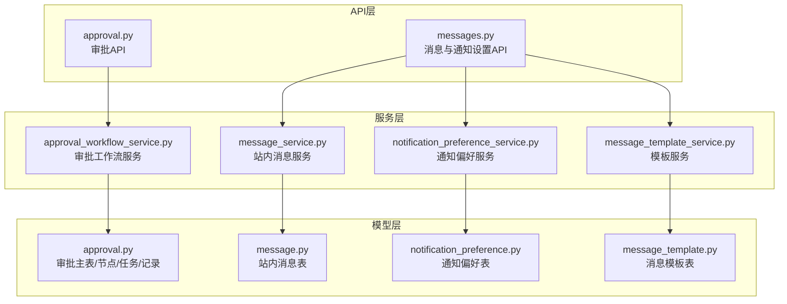
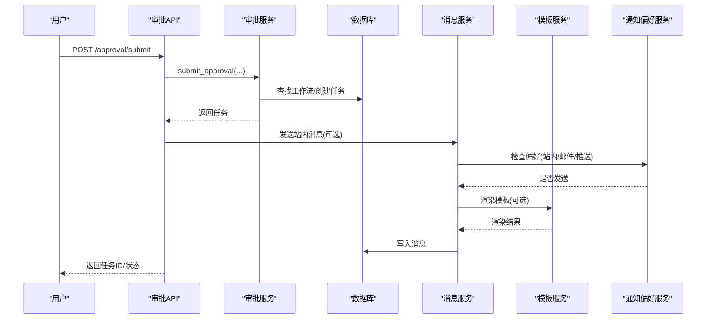
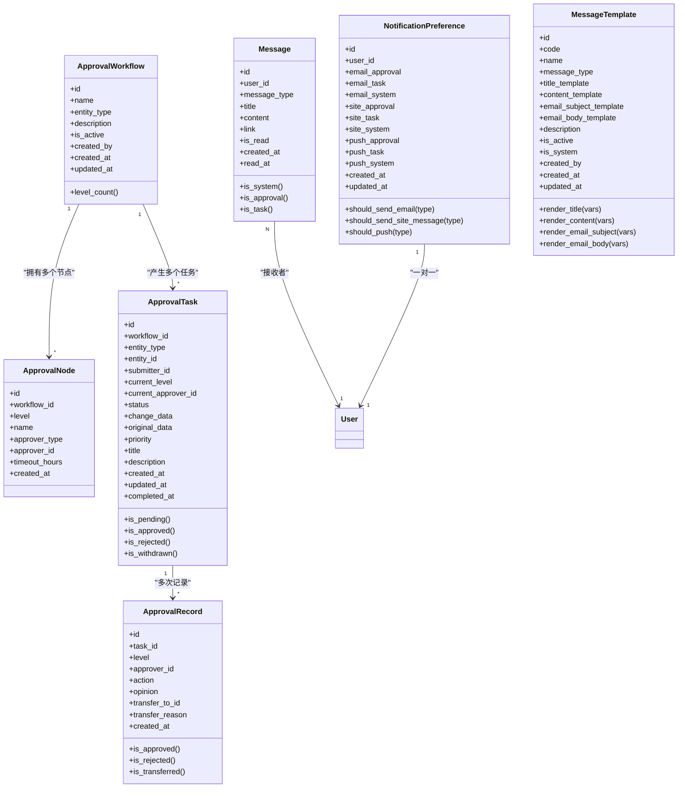
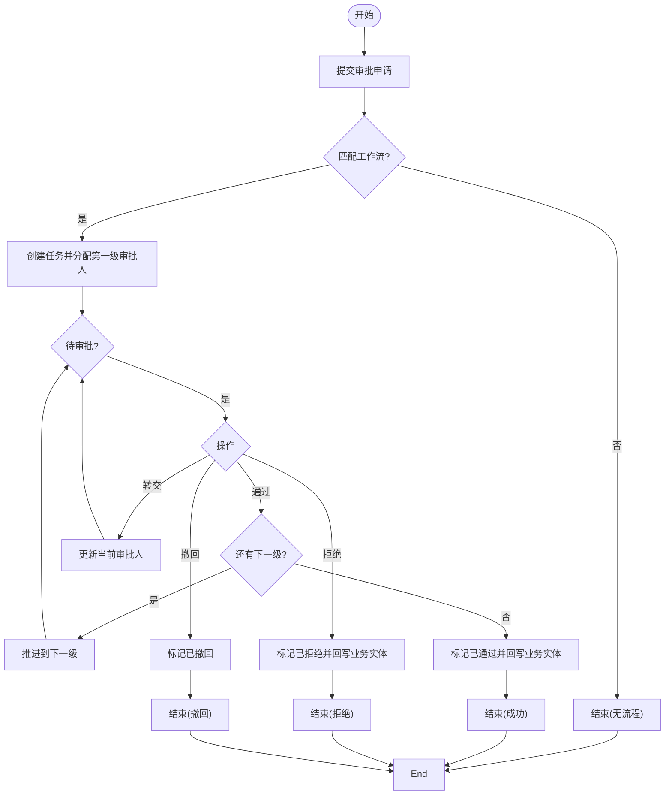
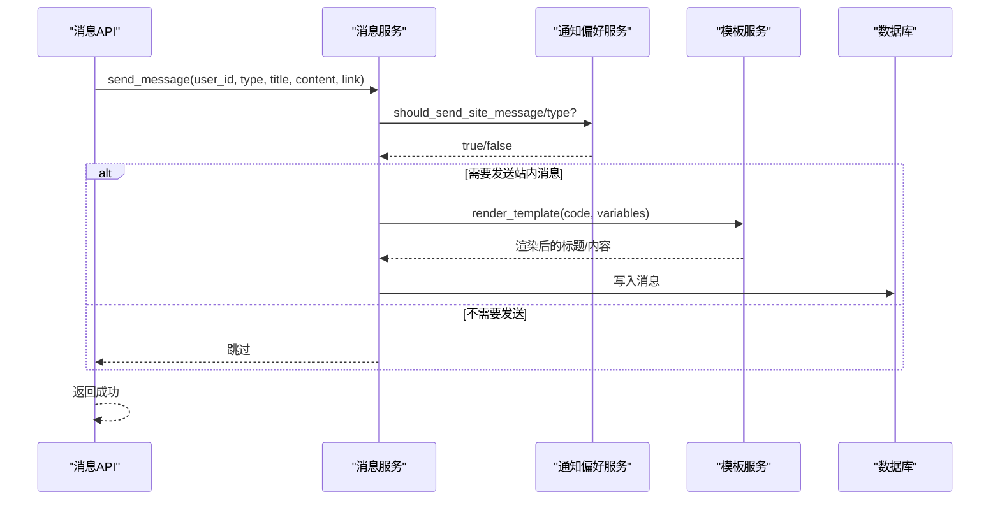
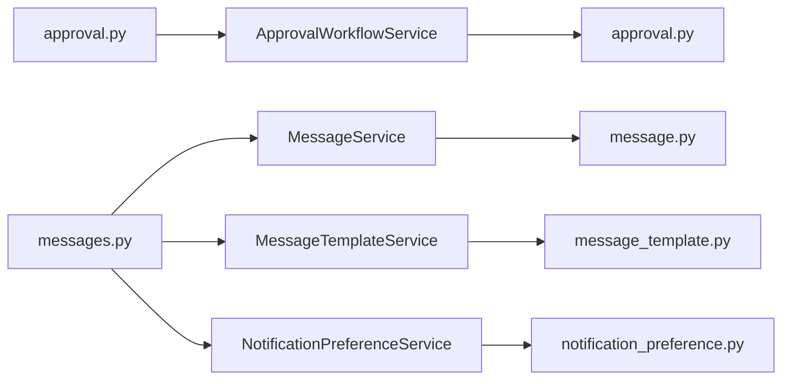

# 审批流程模型

<cite>
**本文引用的文件**
- [backend/app/models/approval.py](file://backend/app/models/approval.py)
- [backend/app/models/message.py](file://backend/app/models/message.py)
- [backend/app/models/notification_preference.py](file://backend/app/models/notification_preference.py)
- [backend/app/models/message_template.py](file://backend/app/models/message_template.py)
- [backend/app/services/approval_workflow_service.py](file://backend/app/services/approval_workflow_service.py)
- [backend/app/services/message_service.py](file://backend/app/services/message_service.py)
- [backend/app/services/message_template_service.py](file://backend/app/services/message_template_service.py)
- [backend/app/services/notification_preference_service.py](file://backend/app/services/notification_preference_service.py)
- [backend/app/api/v1/approval.py](file://backend/app/api/v1/approval.py)
- [backend/app/api/v1/messages.py](file://backend/app/api/v1/messages.py)
</cite>

## 目录
1. [简介](#简介)
2. [项目结构](#项目结构)
3. [核心组件](#核心组件)
4. [架构总览](#架构总览)
5. [详细组件分析](#详细组件分析)
6. [依赖关系分析](#依赖关系分析)
7. [性能与扩展性](#性能与扩展性)
8. [故障排查指南](#故障排查指南)
9. [结论](#结论)
10. [附录：常见场景配置示例](#附录：常见场景配置示例)

## 简介
本文件面向“审批流程模型”的完整设计与实现，覆盖以下目标：
- 审批主表、消息表、通知偏好表的数据结构设计
- 多级审批流程、任务自动分配与状态管理机制
- 消息通知系统、模板管理与用户偏好的数据设计
- 审批历史追踪、超时处理与异常处理逻辑
- 完整的审批流程图与消息传递机制
- 常见审批场景的配置示例

## 项目结构
围绕审批与通知的核心代码分布在以下层次：
- 数据模型层：定义审批工作流、节点、任务、记录；站内消息；通知偏好；消息模板
- 服务层：封装审批工作流引擎、消息发送、模板渲染、通知偏好控制
- API层：暴露审批与消息相关接口，承载权限校验、参数校验、结果封装

图表来源
- [backend/app/api/v1/approval.py:1-120](file://backend/app/api/v1/approval.py#L1-L120)
- [backend/app/api/v1/messages.py:1-120](file://backend/app/api/v1/messages.py#L1-L120)
- [backend/app/services/approval_workflow_service.py:1-120](file://backend/app/services/approval_workflow_service.py#L1-L120)
- [backend/app/services/message_service.py:1-120](file://backend/app/services/message_service.py#L1-L120)
- [backend/app/services/message_template_service.py:1-120](file://backend/app/services/message_template_service.py#L1-L120)
- [backend/app/services/notification_preference_service.py:1-120](file://backend/app/services/notification_preference_service.py#L1-L120)
- [backend/app/models/approval.py:1-120](file://backend/app/models/approval.py#L1-L120)
- [backend/app/models/message.py:1-87](file://backend/app/models/message.py#L1-L87)
- [backend/app/models/notification_preference.py:1-132](file://backend/app/models/notification_preference.py#L1-L132)
- [backend/app/models/message_template.py:1-140](file://backend/app/models/message_template.py#L1-L140)

章节来源
- [backend/app/api/v1/approval.py:1-120](file://backend/app/api/v1/approval.py#L1-L120)
- [backend/app/api/v1/messages.py:1-120](file://backend/app/api/v1/messages.py#L1-L120)

## 核心组件
- 审批工作流模型：工作流、节点、任务、记录，支撑多级审批、状态流转、历史记录
- 消息模型：站内消息，支持类型、已读标记、时间筛选与统计
- 通知偏好模型：按渠道（邮件/站内/推送）和类型（系统/审批/任务）控制是否发送
- 消息模板模型：可配置的标题/内容/邮件主题/正文模板，支持变量占位符与启用禁用
- 服务层：审批工作流服务、消息服务、模板服务、通知偏好服务，提供业务编排能力
- API层：审批与消息管理接口，负责鉴权、入参校验、调用服务并返回统一响应

章节来源
- [backend/app/models/approval.py:53-291](file://backend/app/models/approval.py#L53-L291)
- [backend/app/models/message.py:25-87](file://backend/app/models/message.py#L25-L87)
- [backend/app/models/notification_preference.py:17-132](file://backend/app/models/notification_preference.py#L17-L132)
- [backend/app/models/message_template.py:14-140](file://backend/app/models/message_template.py#L14-L140)
- [backend/app/services/approval_workflow_service.py:30-120](file://backend/app/services/approval_workflow_service.py#L30-L120)
- [backend/app/services/message_service.py:24-120](file://backend/app/services/message_service.py#L24-L120)
- [backend/app/services/message_template_service.py:42-120](file://backend/app/services/message_template_service.py#L42-L120)
- [backend/app/services/notification_preference_service.py:26-120](file://backend/app/services/notification_preference_service.py#L26-L120)
- [backend/app/api/v1/approval.py:86-160](file://backend/app/api/v1/approval.py#L86-L160)
- [backend/app/api/v1/messages.py:170-220](file://backend/app/api/v1/messages.py#L170-L220)

## 架构总览
审批与通知的整体交互如下：
- 提交审批：API接收请求，服务匹配工作流并创建任务，必要时发送站内消息
- 审批操作：通过/拒绝/转交/撤回/重新提交，更新任务状态与记录，触发回写与通知
- 消息与模板：消息服务持久化消息，模板服务渲染内容，通知偏好决定发送策略
- 历史与统计：记录每次操作，支持分页查询与对比差异

图表来源
- [backend/app/api/v1/approval.py:380-414](file://backend/app/api/v1/approval.py#L380-L414)
- [backend/app/services/approval_workflow_service.py:203-278](file://backend/app/services/approval_workflow_service.py#L203-L278)
- [backend/app/services/message_service.py:44-104](file://backend/app/services/message_service.py#L44-L104)
- [backend/app/services/message_template_service.py:320-365](file://backend/app/services/message_template_service.py#L320-L365)
- [backend/app/services/notification_preference_service.py:167-216](file://backend/app/services/notification_preference_service.py#L167-L216)

## 详细组件分析

### 数据模型设计
- 审批主表族
  - 工作流：定义实体类型的审批链，最多5级，包含名称、描述、是否启用等
  - 节点：每级审批的配置，包括级别、名称、审批人类型（用户/角色）、审批人标识、超时小时数
  - 任务：每个变更申请生成一个任务，记录当前级别、当前审批人、状态、变更数据、优先级、标题、说明、完成时间等
  - 记录：每次审批操作的留痕，包括级别、审批人、动作（通过/拒绝/转交）、意见、转交目标与原因、时间
- 消息表
  - 站内消息：接收用户、类型（系统/审批/任务/备份）、标题、内容、关联链接、是否已读、创建与阅读时间
- 通知偏好表
  - 按渠道与类型控制是否发送：邮件（系统/审批/任务）、站内（系统/审批/任务）、推送（系统/审批/任务）
  - 提供方法判断某类型是否应发送邮件/站内消息/推送
- 消息模板表
  - 模板编码、名称、类型、标题模板、内容模板、邮件主题/正文模板、描述、是否启用、是否系统预置、创建人与时间
  - 提供渲染方法，支持变量占位符替换，缺失变量时保留原占位符

图表来源
- [backend/app/models/approval.py:53-291](file://backend/app/models/approval.py#L53-L291)
- [backend/app/models/message.py:25-87](file://backend/app/models/message.py#L25-L87)
- [backend/app/models/notification_preference.py:17-132](file://backend/app/models/notification_preference.py#L17-L132)
- [backend/app/models/message_template.py:14-140](file://backend/app/models/message_template.py#L14-L140)

章节来源
- [backend/app/models/approval.py:53-291](file://backend/app/models/approval.py#L53-L291)
- [backend/app/models/message.py:25-87](file://backend/app/models/message.py#L25-L87)
- [backend/app/models/notification_preference.py:17-132](file://backend/app/models/notification_preference.py#L17-L132)
- [backend/app/models/message_template.py:14-140](file://backend/app/models/message_template.py#L14-L140)

### 多级审批流程与任务自动分配
- 工作流创建：限制最多5级，至少1个节点；节点支持指定用户或角色作为审批人，并可配置超时小时数
- 提交审批：根据实体类型匹配活跃工作流，创建任务并设置第一级审批人；若为角色类型，解析为具体用户（单机版解析管理员）
- 推进与终态：通过则推进到下一级；全部通过后标记为已通过，并尝试回写业务实体状态；失败则标记为“已通过_回写失败”，支持重试
- 拒绝：立即终止流程，标记为已拒绝，并尝试回写业务实体状态；失败同样标记为“已拒绝_回写失败”
- 转交：记录转交流程，更新当前审批人；管理员可代为转交任意待审批任务
- 撤回：仅提交人可撤回待审批任务
- 重新提交：被驳回或撤回后可重新提交，重置到第一级并记录“重新提交”动作

图表来源
- [backend/app/services/approval_workflow_service.py:203-278](file://backend/app/services/approval_workflow_service.py#L203-L278)
- [backend/app/services/approval_workflow_service.py:447-504](file://backend/app/services/approval_workflow_service.py#L447-L504)
- [backend/app/services/approval_workflow_service.py:506-539](file://backend/app/services/approval_workflow_service.py#L506-L539)
- [backend/app/services/approval_workflow_service.py:568-625](file://backend/app/services/approval_workflow_service.py#L568-L625)
- [backend/app/services/approval_workflow_service.py:672-704](file://backend/app/services/approval_workflow_service.py#L672-L704)

章节来源
- [backend/app/services/approval_workflow_service.py:76-124](file://backend/app/services/approval_workflow_service.py#L76-L124)
- [backend/app/services/approval_workflow_service.py:203-278](file://backend/app/services/approval_workflow_service.py#L203-L278)
- [backend/app/services/approval_workflow_service.py:447-504](file://backend/app/services/approval_workflow_service.py#L447-L504)
- [backend/app/services/approval_workflow_service.py:506-539](file://backend/app/services/approval_workflow_service.py#L506-L539)
- [backend/app/services/approval_workflow_service.py:568-625](file://backend/app/services/approval_workflow_service.py#L568-L625)
- [backend/app/services/approval_workflow_service.py:672-704](file://backend/app/services/approval_workflow_service.py#L672-L704)

### 状态管理机制
- 任务状态：待审批、已通过、已拒绝、已撤回；支持“已通过_回写失败”“已拒绝_回写失败”用于异常恢复
- 节点状态：通过推进到下一节点；全部通过后进入终态
- 记录状态：每次操作均记录，支持查询历史与差异对比
- 权限与范围：管理员可查看所有待审批任务；普通用户仅查看自己提交或待自己审批的任务

章节来源
- [backend/app/models/approval.py:36-51](file://backend/app/models/approval.py#L36-L51)
- [backend/app/services/approval_workflow_service.py:318-366](file://backend/app/services/approval_workflow_service.py#L318-L366)
- [backend/app/api/v1/approval.py:720-765](file://backend/app/api/v1/approval.py#L720-L765)

### 消息通知系统与模板管理
- 消息发送：支持系统、审批、任务三类消息；提供批量发送、未读计数、列表查询、标记已读、删除等功能
- 模板渲染：支持标题、内容、邮件主题、邮件正文模板；变量占位符缺失时保留原占位符；支持启用/禁用与修改历史
- 通知偏好：按渠道与类型控制是否发送；默认值在首次获取时创建；支持聚合enabled字段与兼容扩展字段
- 消息与模板集成：审批流程中可在提交或结果时发送站内消息；模板服务可用于渲染通知内容

图表来源
- [backend/app/services/message_service.py:44-104](file://backend/app/services/message_service.py#L44-L104)
- [backend/app/services/notification_preference_service.py:167-216](file://backend/app/services/notification_preference_service.py#L167-L216)
- [backend/app/services/message_template_service.py:320-365](file://backend/app/services/message_template_service.py#L320-L365)
- [backend/app/api/v1/messages.py:170-220](file://backend/app/api/v1/messages.py#L170-L220)

章节来源
- [backend/app/services/message_service.py:44-104](file://backend/app/services/message_service.py#L44-L104)
- [backend/app/services/message_template_service.py:320-365](file://backend/app/services/message_template_service.py#L320-L365)
- [backend/app/services/notification_preference_service.py:167-216](file://backend/app/services/notification_preference_service.py#L167-L216)
- [backend/app/api/v1/messages.py:170-220](file://backend/app/api/v1/messages.py#L170-L220)

### 审批历史追踪、超时处理与异常处理
- 历史追踪：每次审批操作写入记录，支持按任务、实体、提交人、状态过滤与分页
- 超时处理：节点配置超时小时数；当前实现中提供超时提醒模板与提醒接口，实际定时扫描可由外部调度器驱动
- 异常处理：
  - 审批终态回写失败：任务状态追加“_apply_failed”，提供重试接口；管理员可查询与修复
  - 消息发送失败：非致命错误，记录日志并继续流程
  - 角色审批人解析失败：保持任务未分配，由待审批板块兜底可见

章节来源
- [backend/app/services/approval_workflow_service.py:49-71](file://backend/app/services/approval_workflow_service.py#L49-L71)
- [backend/app/services/approval_workflow_service.py:541-566](file://backend/app/services/approval_workflow_service.py#L541-L566)
- [backend/app/services/approval_workflow_service.py:280-307](file://backend/app/services/approval_workflow_service.py#L280-L307)
- [backend/app/services/message_service.py:375-392](file://backend/app/services/message_service.py#L375-L392)
- [backend/app/api/v1/approval.py:486-512](file://backend/app/api/v1/approval.py#L486-L512)

## 依赖关系分析
- API与服务：
  - approval.py 依赖 ApprovalWorkflowService，负责审批工作流CRUD与任务操作
  - messages.py 依赖 MessageService、MessageTemplateService、NotificationPreferenceService，负责消息与通知设置
- 服务与模型：
  - ApprovalWorkflowService 依赖 approval.py 中的模型，进行工作流与任务的状态机管理
  - MessageService 依赖 message.py 进行消息持久化与统计
  - MessageTemplateService 依赖 message_template.py 进行模板渲染与管理
  - NotificationPreferenceService 依赖 notification_preference.py 进行偏好控制
- 外部依赖：
  - 工作日志：部分API调用 write_work_log 记录审计
  - 权限工具：使用 is_admin、require_admin 进行权限控制

图表来源
- [backend/app/api/v1/approval.py:1-120](file://backend/app/api/v1/approval.py#L1-L120)
- [backend/app/api/v1/messages.py:1-120](file://backend/app/api/v1/messages.py#L1-L120)
- [backend/app/services/approval_workflow_service.py:1-120](file://backend/app/services/approval_workflow_service.py#L1-L120)
- [backend/app/services/message_service.py:1-120](file://backend/app/services/message_service.py#L1-L120)
- [backend/app/services/message_template_service.py:1-120](file://backend/app/services/message_template_service.py#L1-L120)
- [backend/app/services/notification_preference_service.py:1-120](file://backend/app/services/notification_preference_service.py#L1-L120)

章节来源
- [backend/app/api/v1/approval.py:1-120](file://backend/app/api/v1/approval.py#L1-L120)
- [backend/app/api/v1/messages.py:1-120](file://backend/app/api/v1/messages.py#L1-L120)

## 性能与扩展性
- 索引优化：审批任务与工作流、节点、记录均有复合索引，提升查询效率
- 分页与排序：任务列表支持分页与按优先级、时间排序，避免全量加载
- 事务安全：关键操作使用 safe_commit，确保一致性；批量审批独立事务，单个失败不影响其余
- 可扩展点：
  - 实体回写处理器注册表：业务模块可注册处理器，在审批终态时回写业务实体状态
  - 模板变量：支持丰富变量占位符，便于多场景通知
  - 通知偏好：按渠道与类型灵活控制，支持未来扩展更多渠道

[本节为通用指导，不直接分析具体文件]

## 故障排查指南
- 审批任务无法创建：检查是否存在对应实体类型的活跃工作流；若无，可使用自动创建默认流程接口
- 审批人未分配：角色类型解析失败或无管理员时，任务保持未分配；管理员可在待审批页面查看全部pending任务
- 审批通过但业务状态未变：检查任务状态是否包含“_apply_failed”；使用重试接口重新执行回写
- 消息未送达：检查通知偏好是否关闭该渠道/类型；确认模板是否启用且变量齐全
- 模板渲染异常：检查模板是否启用；缺失变量时会保留原占位符，建议补充必要变量

章节来源
- [backend/app/services/approval_workflow_service.py:180-197](file://backend/app/services/approval_workflow_service.py#L180-L197)
- [backend/app/services/approval_workflow_service.py:280-307](file://backend/app/services/approval_workflow_service.py#L280-L307)
- [backend/app/services/approval_workflow_service.py:541-566](file://backend/app/services/approval_workflow_service.py#L541-L566)
- [backend/app/services/message_template_service.py:320-365](file://backend/app/services/message_template_service.py#L320-L365)
- [backend/app/services/notification_preference_service.py:167-216](file://backend/app/services/notification_preference_service.py#L167-L216)

## 结论
本审批流程模型以清晰的数据结构与分层服务实现了多级审批、任务自动分配、状态管理与通知体系。通过模板与偏好控制，系统具备高度的可配置性与扩展性；结合历史追踪与异常处理机制，保障了业务流程的可追溯与健壮性。建议在复杂场景中结合外部调度器实现超时提醒与批量清理，进一步提升运维效率。

[本节为总结，不直接分析具体文件]

## 附录：常见场景配置示例
- 单级审批（经费类）
  - 工作流：实体类型“fund”，单节点“财务审核”，超时24小时
  - 提交：POST /approval/submit，携带实体类型、ID、变更数据
  - 审批：POST /approval/tasks/{id}/approve 或 /reject
- 多级审批（项目立项）
  - 工作流：实体类型“project”，三级节点“部门主管→项目经理→财务复核”，超时分别为24/48/24小时
  - 提交后自动推进，直至全部通过或任一拒绝
- 角色审批（管理员兜底）
  - 节点审批人类型为“role”，值为“admin”；解析失败时任务未分配，管理员可查看全部pending任务
- 消息与模板
  - 预置模板：审批已提交、已通过、已拒绝、转交、撤回、待审批提醒、超时提醒
  - 通知偏好：用户可分别开启/关闭邮件、站内、推送的通知类型
- 异常处理
  - 回写失败：使用重试接口恢复业务状态
  - 消息失败：非致命，记录日志并继续流程

章节来源
- [backend/app/services/approval_workflow_service.py:76-124](file://backend/app/services/approval_workflow_service.py#L76-L124)
- [backend/app/services/approval_workflow_service.py:203-278](file://backend/app/services/approval_workflow_service.py#L203-L278)
- [backend/app/services/approval_workflow_service.py:447-504](file://backend/app/services/approval_workflow_service.py#L447-L504)
- [backend/app/services/message_template_service.py:498-800](file://backend/app/services/message_template_service.py#L498-L800)
- [backend/app/services/notification_preference_service.py:59-81](file://backend/app/services/notification_preference_service.py#L59-L81)
- [backend/app/api/v1/approval.py:380-414](file://backend/app/api/v1/approval.py#L380-L414)
- [backend/app/api/v1/approval.py:486-512](file://backend/app/api/v1/approval.py#L486-L512)