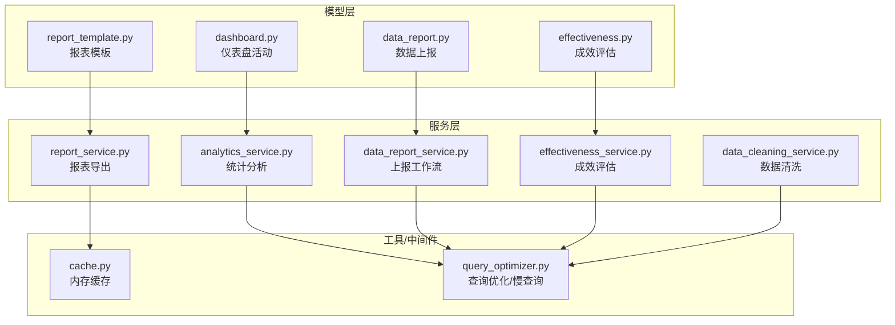
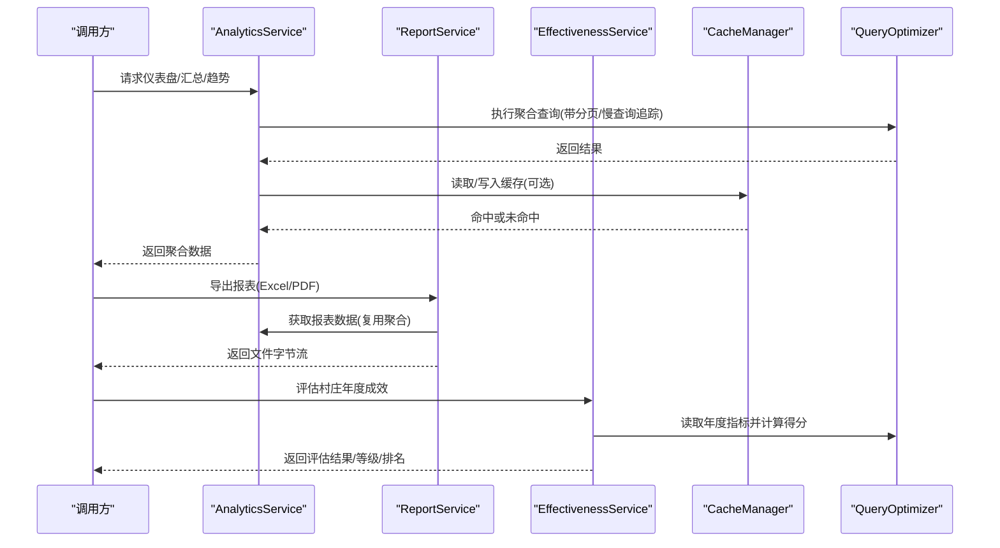
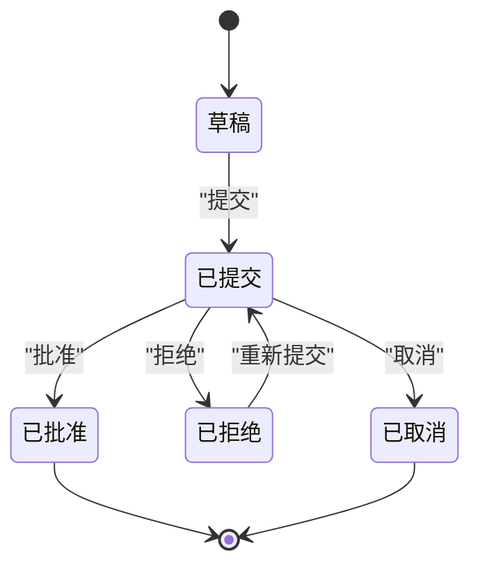
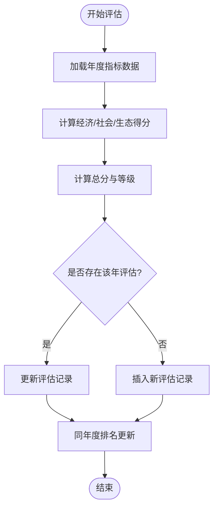
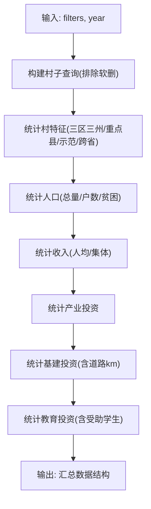
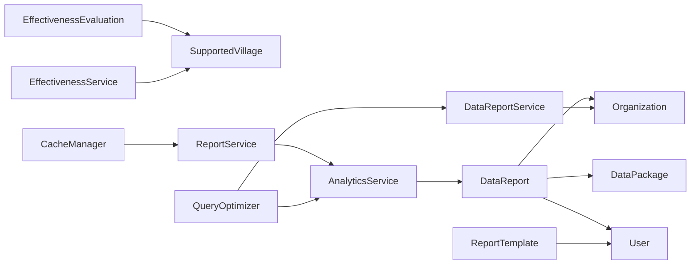

# 数据分析模型

<cite>
**本文引用的文件**
- [backend/app/models/dashboard.py](file://backend/app/models/dashboard.py)
- [backend/app/models/data_report.py](file://backend/app/models/data_report.py)
- [backend/app/models/report_template.py](file://backend/app/models/report_template.py)
- [backend/app/models/effectiveness.py](file://backend/app/models/effectiveness.py)
- [backend/app/services/analytics_service.py](file://backend/app/services/analytics_service.py)
- [backend/app/services/report_service.py](file://backend/app/services/report_service.py)
- [backend/app/services/data_report_service.py](file://backend/app/services/data_report_service.py)
- [backend/app/services/effectiveness_service.py](file://backend/app/services/effectiveness_service.py)
- [backend/app/core/cache.py](file://backend/app/core/cache.py)
- [backend/app/core/query_optimizer.py](file://backend/app/core/query_optimizer.py)
- [backend/app/services/data_cleaning_service.py](file://backend/app/services/data_cleaning_service.py)
</cite>

## 目录
1. [简介](#简介)
2. [项目结构](#项目结构)
3. [核心组件](#核心组件)
4. [架构总览](#架构总览)
5. [详细组件分析](#详细组件分析)
6. [依赖关系分析](#依赖关系分析)
7. [性能与缓存策略](#性能与缓存策略)
8. [数据质量检查与清洗](#数据质量检查与清洗)
9. [趋势分析与预测模型设计](#趋势分析与预测模型设计)
10. [报表导出格式与生成流程](#报表导出格式与生成流程)
11. [查询优化示例](#查询优化示例)
12. [故障排查指南](#故障排查指南)
13. [结论](#结论)

## 简介
本文件围绕乡村振兴系统的数据分析模型，系统化说明以下四类表的设计与使用：仪表盘表、数据报表表、报表模板表、成效评估表。并在此基础上，阐述统计分析指标计算、可视化数据聚合、自定义报表生成逻辑；补充数据质量检查、趋势分析与预测模型的数据设计；给出报表导出格式、缓存策略与性能优化方案；并提供完整的数据分析流程与查询优化示例，帮助读者快速理解与落地。

## 项目结构
后端以“模型层 + 服务层 + 工具/中间件”的分层组织为主：
- 模型层：定义仪表盘活动、数据上报、报表模板、成效评估等实体及字段约束。
- 服务层：封装统计、报表导出、上报工作流、效果评估、数据清洗等能力。
- 工具/中间件：提供缓存、慢查询监控、分页与N+1检测等通用能力。

图表来源
- [backend/app/models/dashboard.py:1-42](file://backend/app/models/dashboard.py#L1-L42)
- [backend/app/models/data_report.py:1-141](file://backend/app/models/data_report.py#L1-L141)
- [backend/app/models/report_template.py:1-73](file://backend/app/models/report_template.py#L1-L73)
- [backend/app/models/effectiveness.py:1-54](file://backend/app/models/effectiveness.py#L1-L54)
- [backend/app/services/analytics_service.py:1-703](file://backend/app/services/analytics_service.py#L1-L703)
- [backend/app/services/report_service.py:1-357](file://backend/app/services/report_service.py#L1-L357)
- [backend/app/services/data_report_service.py:1-492](file://backend/app/services/data_report_service.py#L1-L492)
- [backend/app/services/effectiveness_service.py:1-360](file://backend/app/services/effectiveness_service.py#L1-L360)
- [backend/app/core/cache.py:1-166](file://backend/app/core/cache.py#L1-L166)
- [backend/app/core/query_optimizer.py:1-177](file://backend/app/core/query_optimizer.py#L1-L177)

章节来源
- [backend/app/models/dashboard.py:1-42](file://backend/app/models/dashboard.py#L1-L42)
- [backend/app/models/data_report.py:1-141](file://backend/app/models/data_report.py#L1-L141)
- [backend/app/models/report_template.py:1-73](file://backend/app/models/report_template.py#L1-L73)
- [backend/app/models/effectiveness.py:1-54](file://backend/app/models/effectiveness.py#L1-L54)

## 核心组件
- 仪表盘活动表：记录前端手动添加的近期动态，以及隐藏的系统自动生成动态ID，用于仪表盘展示与用户交互状态持久化。
- 数据上报表：管理下级向上级单位提交数据的生命周期（草稿、已提交、已批准、已拒绝、已取消），包含提交/审批人、截止时间等审计字段。
- 报表模板表：定义导入/导出模板、字段映射、格式配置、是否启用等，支撑Excel模板解析与自动导入。
- 成效评估表：按村与年度存储三维度得分（经济、社会、生态）、总分、等级、排名、指标JSON等，支持评估报告与对比。

章节来源
- [backend/app/models/dashboard.py:9-42](file://backend/app/models/dashboard.py#L9-L42)
- [backend/app/models/data_report.py:19-141](file://backend/app/models/data_report.py#L19-L141)
- [backend/app/models/report_template.py:26-73](file://backend/app/models/report_template.py#L26-L73)
- [backend/app/models/effectiveness.py:20-54](file://backend/app/models/effectiveness.py#L20-L54)

## 架构总览
数据分析整体流程：
- 数据采集与清洗：通过数据清洗服务进行去重、标准化、缺失值填充。
- 指标计算与聚合：统计分析服务基于多表聚合计算省域分布、投资/人口/收入、基础设施分类、资金趋势、绩效指标等。
- 报表生成与导出：报表服务根据模板或固定模板导出Excel/PDF，支持综合报表与订阅机制。
- 成效评估：按村年度计算三维度得分与等级，更新排名，支持历史对比。
- 缓存与优化：内存缓存加速热点指标；慢查询监控与分页工具保障查询性能。

图表来源
- [backend/app/services/analytics_service.py:28-385](file://backend/app/services/analytics_service.py#L28-L385)
- [backend/app/services/report_service.py:27-152](file://backend/app/services/report_service.py#L27-L152)
- [backend/app/services/effectiveness_service.py:132-201](file://backend/app/services/effectiveness_service.py#L132-L201)
- [backend/app/core/cache.py:72-137](file://backend/app/core/cache.py#L72-L137)
- [backend/app/core/query_optimizer.py:23-93](file://backend/app/core/query_optimizer.py#L23-L93)

## 详细组件分析

### 仪表盘活动模型
- 功能：记录用户手动新增的动态类型、操作、目标、操作人与时间；维护被隐藏的系统动态ID，确保刷新后不重复显示。
- 关键点：独立表隔离用户隐藏状态，避免对业务源数据产生副作用。

章节来源
- [backend/app/models/dashboard.py:9-42](file://backend/app/models/dashboard.py#L9-L42)

### 数据上报模型与工作流
- 字段要点：上报编码、数据包ID、来源/目标组织、状态枚举、标题/说明/审批意见/拒绝原因、提交/审批时间与人、截止时间、创建/更新时间。
- 工作流：草稿→已提交→已批准/已拒绝→可回退至已提交或取消；支持逾期判断与编辑性判断。
- 索引：针对来源/目标组织、状态、提交时间、截止时间的索引提升查询效率。

图表来源
- [backend/app/models/data_report.py:19-141](file://backend/app/models/data_report.py#L19-L141)
- [backend/app/services/data_report_service.py:81-235](file://backend/app/services/data_report_service.py#L81-L235)

章节来源
- [backend/app/models/data_report.py:29-141](file://backend/app/models/data_report.py#L29-L141)
- [backend/app/services/data_report_service.py:110-235](file://backend/app/services/data_report_service.py#L110-L235)

### 报表模板模型
- 字段要点：模板名称、类型（导入/导出）、关联模块、字段映射（JSON）、格式配置（JSON）、文件路径、是否启用、创建人与审计时间。
- 用途：定义Excel列与数据库字段的映射关系，支撑批量导入与导出模板化。

章节来源
- [backend/app/models/report_template.py:26-73](file://backend/app/models/report_template.py#L26-L73)

### 成效评估模型与服务
- 字段要点：村ID、年份、指标JSON、经济/社会/生态得分、总分、等级、排名、报告路径、评估人与时间。
- 服务逻辑：按村与年度计算三维度得分与总分，确定等级；幂等更新已有评估；同年度内统一排序更新排名。

图表来源
- [backend/app/services/effectiveness_service.py:65-201](file://backend/app/services/effectiveness_service.py#L65-L201)
- [backend/app/models/effectiveness.py:20-54](file://backend/app/models/effectiveness.py#L20-L54)

章节来源
- [backend/app/models/effectiveness.py:20-54](file://backend/app/models/effectiveness.py#L20-L54)
- [backend/app/services/effectiveness_service.py:132-201](file://backend/app/services/effectiveness_service.py#L132-L201)

### 统计分析服务（指标计算与可视化聚合）
- 仪表盘总览：按省份统计帮扶村数量、振兴梯队分布、总数。
- 帮扶村分析：投资总额/均值/最大值、人口总量/常住/占比、人均收入与县均收入、基础设施投资分类。
- 资金趋势：近N年总投入、军地/地方资金拆分、覆盖村数。
- 绩效指标：政策发布情况、示范村数量、各类帮扶投资汇总。
- 对比分析：按省份或梯队对比投资与收入。
- 汇总统计：构建子查询过滤软删村，分步计算特征、人口、收入、产业、基建、教育等指标。
- 钻取与筛选：按维度钻取到村列表；多维度筛选与分页。

图表来源
- [backend/app/services/analytics_service.py:399-532](file://backend/app/services/analytics_service.py#L399-L532)

章节来源
- [backend/app/services/analytics_service.py:28-385](file://backend/app/services/analytics_service.py#L28-L385)
- [backend/app/services/analytics_service.py:511-683](file://backend/app/services/analytics_service.py#L511-L683)

### 报表导出服务
- Excel导出：构造工作簿与表头，拉取数据行，自动列宽，返回字节流。
- PDF导出：绘制标题、元数据、表格头部与数据行，限制行数，分页处理。
- 综合报表：复用Excel导出，传入综合类型参数。
- 文件名生成：基于报表类型与时间戳命名。
- 订阅管理：列出/创建/更新/取消订阅，支持频率、发送时间、邮箱、输出目录与格式。

章节来源
- [backend/app/services/report_service.py:27-165](file://backend/app/services/report_service.py#L27-L165)
- [backend/app/services/report_service.py:167-297](file://backend/app/services/report_service.py#L167-L297)
- [backend/app/services/report_service.py:301-357](file://backend/app/services/report_service.py#L301-L357)

## 依赖关系分析
- 模型间关系：
  - DataReport 关联 DataPackage、Organization、User（提交人/审批人/创建人）。
  - EffectivenessEvaluation 关联 SupportedVillage、User（评估人）。
  - ReportTemplate 关联 User（创建人）。
- 服务间耦合：
  - AnalyticsService 依赖多个年度/业务表进行聚合。
  - ReportService 复用 AnalyticsService 的数据或自行查询。
  - DataReportService 依赖 OrganizationService 校验上下级关系与通知。
  - EffectivenessService 依赖年度指标表计算得分。
- 工具依赖：
  - QueryOptimizer 提供分页与慢查询追踪。
  - CacheManager 提供线程安全内存缓存与TTL。

图表来源
- [backend/app/models/data_report.py:29-141](file://backend/app/models/data_report.py#L29-L141)
- [backend/app/models/effectiveness.py:20-54](file://backend/app/models/effectiveness.py#L20-L54)
- [backend/app/models/report_template.py:44-73](file://backend/app/models/report_template.py#L44-L73)
- [backend/app/services/analytics_service.py:28-385](file://backend/app/services/analytics_service.py#L28-L385)
- [backend/app/services/report_service.py:27-152](file://backend/app/services/report_service.py#L27-L152)
- [backend/app/services/data_report_service.py:110-235](file://backend/app/services/data_report_service.py#L110-L235)
- [backend/app/services/effectiveness_service.py:132-201](file://backend/app/services/effectiveness_service.py#L132-L201)
- [backend/app/core/query_optimizer.py:23-93](file://backend/app/core/query_optimizer.py#L23-L93)
- [backend/app/core/cache.py:72-137](file://backend/app/core/cache.py#L72-L137)

章节来源
- [backend/app/models/data_report.py:29-141](file://backend/app/models/data_report.py#L29-L141)
- [backend/app/models/effectiveness.py:20-54](file://backend/app/models/effectiveness.py#L20-L54)
- [backend/app/models/report_template.py:44-73](file://backend/app/models/report_template.py#L44-L73)

## 性能与缓存策略
- 缓存策略：
  - 使用 SimpleCache 实现线程安全的内存缓存，支持键级TTL与最大容量淘汰。
  - CacheManager 提供异步兼容接口，便于在异步服务中缓存热点指标。
  - 装饰器 cached 可用于同步/异步函数，自动缓存返回值。
- 查询优化：
  - 分页工具 paginate 限制页大小，防止过大结果集。
  - track_query 记录慢查询，便于定位瓶颈。
  - analyze_n_plus_one 检测潜在N+1问题，提示优化。
- 建议：
  - 对高频访问的仪表盘总览、汇总统计、筛选选项等进行缓存。
  - 对复杂聚合查询增加必要索引（如年份、组织ID、状态等）。
  - 使用子查询与联合查询减少多次往返。

章节来源
- [backend/app/core/cache.py:14-137](file://backend/app/core/cache.py#L14-L137)
- [backend/app/core/query_optimizer.py:23-177](file://backend/app/core/query_optimizer.py#L23-L177)

## 数据质量检查与清洗
- 清洗能力：
  - 去重：支持关键字段模糊匹配相似度阈值。
  - 标准化：电话、邮箱、地址格式统一。
  - 缺失值填充：默认值、均值、中位数、众数策略。
  - 批量清洗：组合规则一次性处理数据集。
- 质量检查：
  - 前端质量面板展示总记录数、有效记录、问题记录、完整率，并支持触发检查与自定义校验规则。
- 建议：
  - 在导入前执行清洗，减少脏数据进入核心表。
  - 对关键指标字段设置必填与格式校验规则。

章节来源
- [backend/app/services/data_cleaning_service.py:14-297](file://backend/app/services/data_cleaning_service.py#L14-L297)
- [frontend/src/views/dataManagement/components/QualitySection.vue:1-59](file://frontend/src/views/dataManagement/components/QualitySection.vue#L1-L59)

## 趋势分析与预测模型设计
- 趋势分析：
  - 资金趋势：按年聚合总投入、军地/地方资金、覆盖村数，形成时间序列。
  - 成效趋势：通过历年评估得分变化观察改善幅度。
- 预测模型数据设计（建议）：
  - 输入特征：历史年度指标（收入、基础设施覆盖、产业项目数）、政策发布数、资金投放量、区域属性（是否三区三州/重点县）。
  - 目标变量：下一年人均收入增长率、项目完成率、满意度评分。
  - 存储结构：在现有年度指标表基础上扩展预测特征列，或在独立表中保存特征向量与预测结果。
  - 训练与回写：离线训练后，将预测结果写入评估相关表或新增预测结果表，供前端可视化。
- 注意：当前仓库未包含具体预测算法实现，上述为可扩展的数据设计建议。

章节来源
- [backend/app/services/analytics_service.py:173-218](file://backend/app/services/analytics_service.py#L173-L218)
- [backend/app/services/effectiveness_service.py:292-307](file://backend/app/services/effectiveness_service.py#L292-L307)

## 报表导出格式与生成流程
- 导出格式：
  - Excel：使用 openpyxl 构建工作簿，设置表头与数据行，自动列宽。
  - PDF：使用 reportlab 绘制标题、元数据与表格，限制行数并分页。
- 生成流程：
  - 接收查询参数（年份、村ID、报表类型等）。
  - 调用数据获取逻辑（可复用统计分析服务）。
  - 渲染为指定格式并返回字节流。
  - 支持订阅机制，按频率定时生成并发送。
- 文件名：基于报表类型与时间戳生成。

章节来源
- [backend/app/services/report_service.py:27-165](file://backend/app/services/report_service.py#L27-L165)
- [backend/app/services/report_service.py:167-297](file://backend/app/services/report_service.py#L167-L297)
- [backend/app/services/report_service.py:301-357](file://backend/app/services/report_service.py#L301-L357)

## 查询优化示例
- 分页查询：使用 paginate 工具限制每页大小，避免大结果集拖垮系统。
- 慢查询追踪：使用 track_query 包裹关键查询，记录耗时并告警。
- N+1检测：使用 analyze_n_plus_one 装饰服务方法，当查询次数超过阈值时发出警告。
- 实际场景：
  - 汇总统计：先构建村子查询排除软删，再分步计算各指标，减少重复扫描。
  - 上报统计：一次性查询所有相关报告并按组织分组，避免N+1。

章节来源
- [backend/app/core/query_optimizer.py:23-177](file://backend/app/core/query_optimizer.py#L23-L177)
- [backend/app/services/analytics_service.py:399-532](file://backend/app/services/analytics_service.py#L399-L532)
- [backend/app/services/data_report_service.py:346-435](file://backend/app/services/data_report_service.py#L346-L435)

## 故障排查指南
- 常见错误：
  - 上报不存在：抛出业务异常，需检查ID与权限。
  - 状态转换非法：检查当前状态与目标状态是否在允许转换表中。
  - 导出失败：检查依赖库（openpyxl/reportlab）是否安装，或数据层异常。
- 日志与监控：
  - 慢查询日志：通过慢查询监控定位耗时查询。
  - 缓存命中率：关注缓存命中与过期策略是否合理。
- 修复建议：
  - 为高频查询添加合适索引。
  - 对复杂聚合使用子查询与联合查询减少往返。
  - 对热点数据启用缓存并设置合理TTL。

章节来源
- [backend/app/services/data_report_service.py:30-103](file://backend/app/services/data_report_service.py#L30-L103)
- [backend/app/services/report_service.py:67-133](file://backend/app/services/report_service.py#L67-L133)
- [backend/app/core/query_optimizer.py:57-108](file://backend/app/core/query_optimizer.py#L57-L108)

## 结论
本模型以清晰的表结构与分层服务实现了从数据采集、清洗、指标计算、可视化聚合到报表导出与成效评估的完整闭环。通过缓存与查询优化工具，保障了高并发下的性能与稳定性。建议在后续迭代中引入预测模型数据设计，完善趋势分析与智能预警能力，进一步提升决策支持价值。